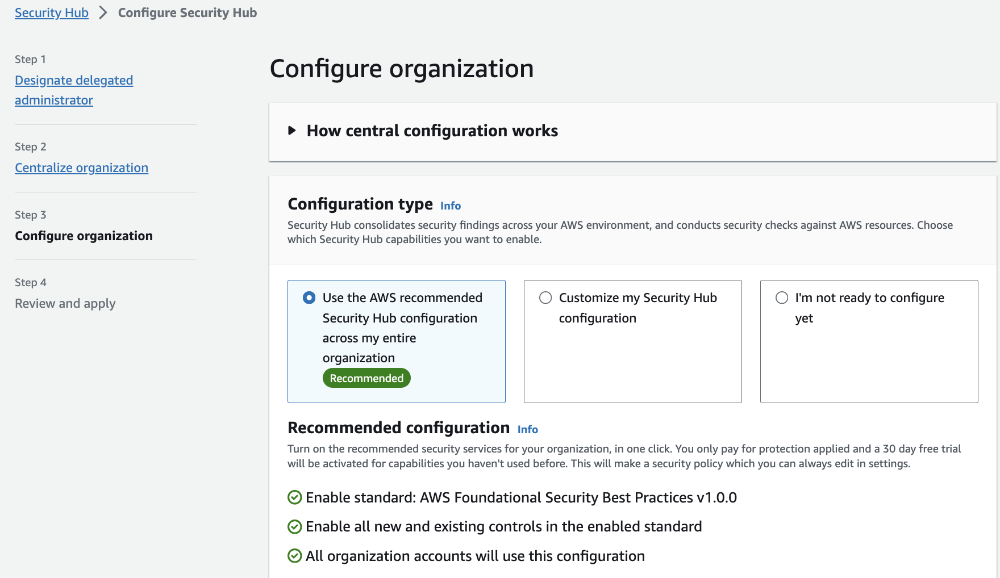
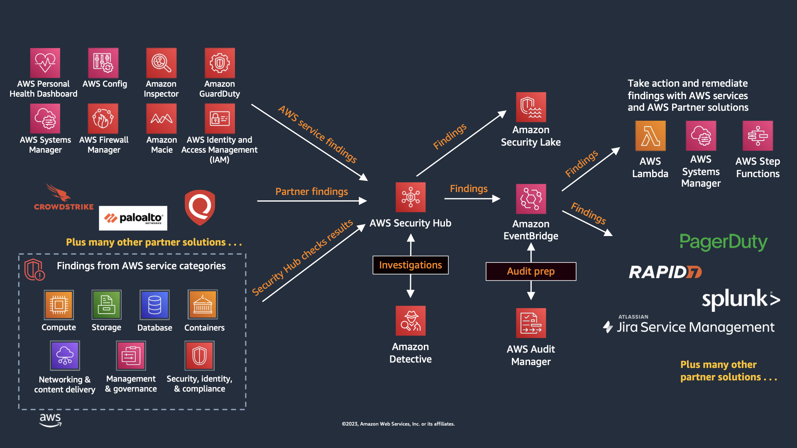
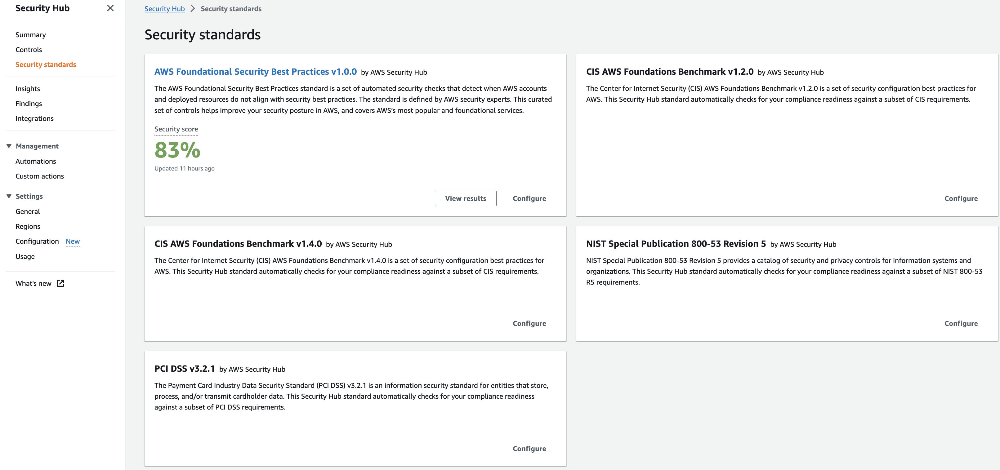
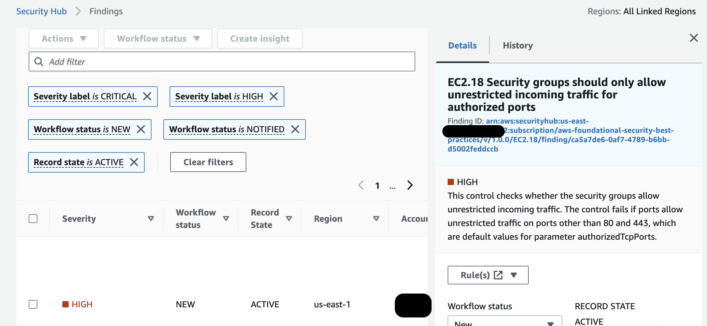
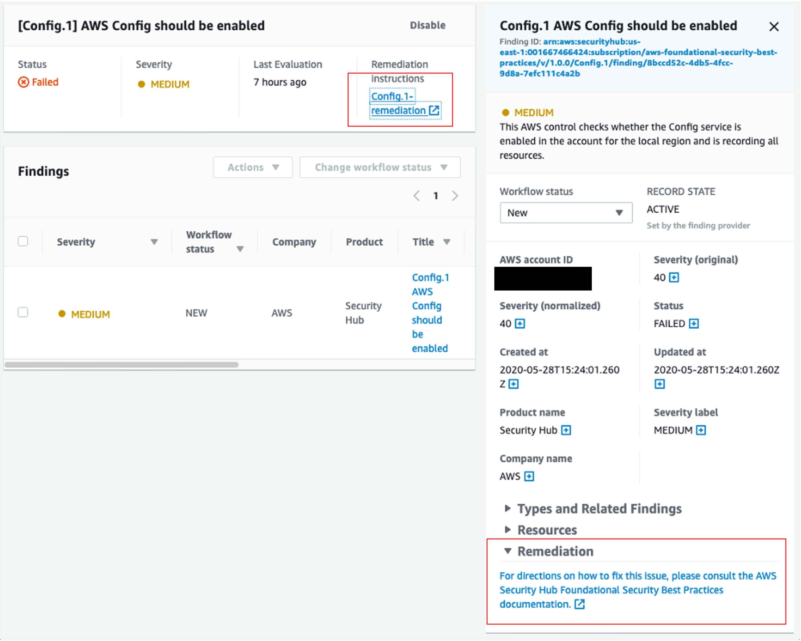
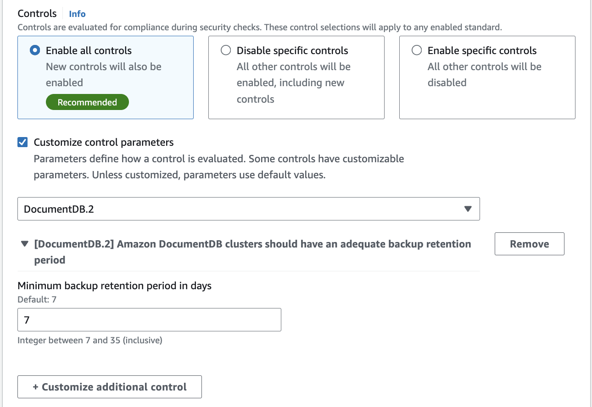
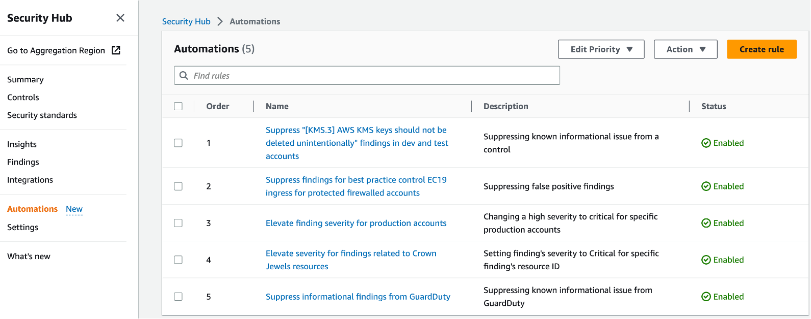
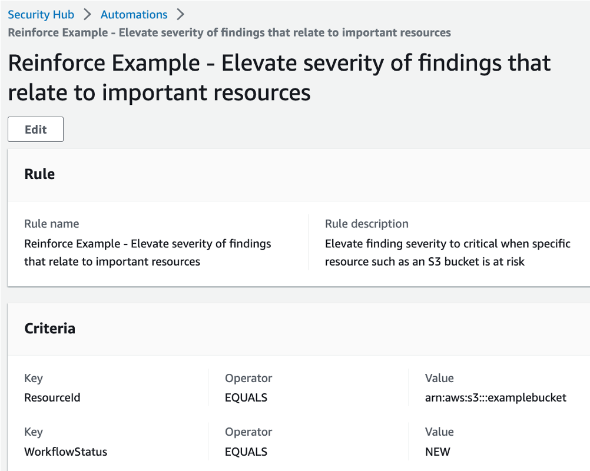
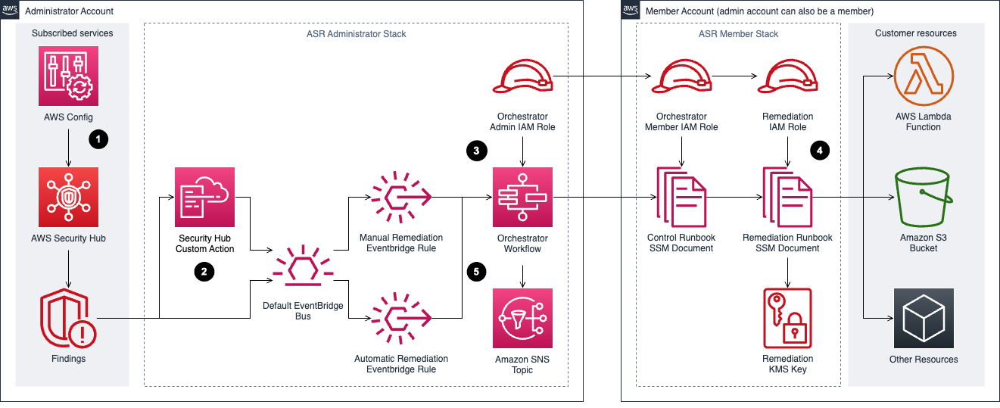
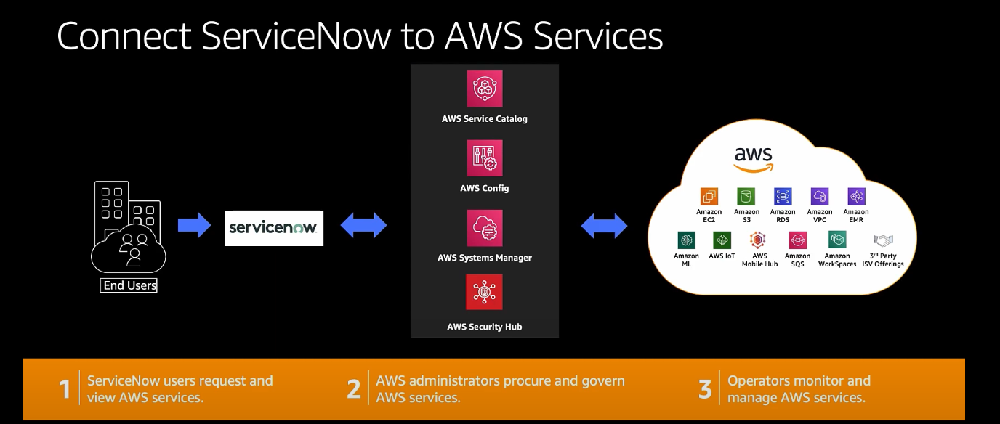

# Security Hub

## Introduction

Welcome to the AWS Security Hub Best Practices Guide. The purpose of this guide is to provide prescriptive guidance for leveraging AWS Security Hub for automated, continuous security best practice checks against your AWS resources. Publishing this guidance via GitHub will allow for quick iterations to enable timely recommendations that include service enhancements, as well as, the feedback of the user community. This guide is designed to provide value whether you are deploying Security Hub for the first time in a single account, or looking for ways to optimize Security Hub in an existing multi-account deployment.

## How to use this guide

This guide is geared towards security practitioners who are responsible for monitoring and remediation of threats and malicious activity within AWS accounts (and resources). The best practices are organized into three categories for easier consumption. Each category includes a set of corresponding best practices that begin with a brief overview, followed by detailed steps for implementing the guidance. The topics do not need to be read in a particular order:

* [What is Security Hub](#what-is-security-hub)
* [What are the benefits of enabling Security Hub](#what-are-the-benefits-of-enabling-security-hub)
* [Getting Started](#getting-started)
    * [Deployment considerations](#deployment-considerations)
    * [Region considerations](#region-considerations)
* [Implementations](#implementation)
    * [Configuration](#Configuration)
    * [Integrate your security tools](#integrate-your-security-tools)
    * [Enable security standards](#enable-security-standards)
* [Operationalizing](#operationalizing)
    * [Take action on critical and high findings](#take-action-on-critical-and-high-findings)
    * [Create customized insights](#create-customized-insights)
    * [Leverage available remediation instructions](#leverage-available-remediation-instructions)
    * [Fine tuning security standard controls](#fine-tuning-security-standard-controls)
    * [Automation rules](#automation-rules)
    * [Automated response and remediation](#automated-response-and-remediation)
    * [3rd party integrations](#3rd-party-integrations)
* [Cost considerations](#cost-considerations)
    * [AWS Config](#aws-config)
* [Resources](#resources)

## What is Security Hub?

AWS Security Hub is a cloud security posture management (CSPM) service that performs automated, continuous security best practice checks against your AWS resources to help you identify misconfigurations, and aggregates your security alerts (i.e. findings) in a standardized format so that you can more easily enrich, investigate, and remediate them. It can be used by security teams, compliance teams, cloud architects, Incident response teams, risk management teams, and MSSPs. Security Hub is currently used by customers of all sizes ranging from small startups to large enterprises.

## What are the benefits of enabling Security Hub?

Security Hub reduces the complexity and effort of managing and improving the security of your AWS accounts, workloads, and resources. You can enable Security Hub within a particular Region in minutes, and the service helps you answer fundamental security questions you may have on a daily basis. Key benefits include:

* Detect deviations from security best practices with a single click. Security Hub runs continuous and automated account and resource-level configuration checks against the controls in the [AWS Foundational Security Best Practices standard](https://docs.aws.amazon.com/securityhub/latest/userguide/fsbp-standard.html) and other supported industry best practices and standards, including [CIS AWS Foundations Benchmark](https://www.cisecurity.org/benchmark/amazon_web_services/), [National Institute of Standards and Technology (NIST)](https://csrc.nist.gov/publications/detail/sp/800-53/rev-5/final), and [Payment Card Industry Data Security Standard (PCI DSS)](https://www.pcisecuritystandards.org/). Learn more about [supported standards and controls available in Security Hub](https://docs.aws.amazon.com/securityhub/latest/userguide/standards-reference.html).
* Automatically aggregate security findings in a standardized data format from AWS and partner services. Security Hub collects findings from the security services enabled across your AWS accounts, such as threat detection findings from Amazon GuardDuty, vulnerability findings from Amazon Inspector, and sensitive data findings from Amazon Macie. Security Hub also collects findings from partner security products using a standardized AWS Security Finding Format, eliminating the need for time-consuming data parsing and normalization efforts. Customers can designate an administrator account that can access all findings across their accounts.
* Accelerate mean time to resolution with automated response and remediation actions. Create custom automated response, remediation, and enrichment workflows using the Security Hub [integration with Amazon EventBridge](https://docs.aws.amazon.com/securityhub/latest/userguide/securityhub-cloudwatch-events.html), and other [integrations](https://docs.aws.amazon.com/securityhub/latest/userguide/securityhub-partner-providers.html) to create Security Orchestration Automation and Response (SOAR) and Security Information and Event Management (SIEM) workflows. You can also use Security Hub Automation Rules to automatically update or suppress findings in near-real time.

## Getting started

Some important considerations for AWS Security Hub is that you need to ensure you have the right permissions to administer Security Hub and you should think through which account in your AWS Organization is best suited to be the Security Hub delegated administrator account. To get started with permissions make sure the role you are using to administer Security Hub has a minimum of the AWS managed policy name “AWSSecurityHubFullAccess”. Another consideration is to make sure AWS Config is enabled on all accounts because AWS Security Hub uses service-linked AWS Config rules to perform most of its security checks for controls. Please refer to this [document](https://docs.aws.amazon.com/securityhub/latest/userguide/securityhub-prereq-config.html) for more details.

### Deployment Considerations

To deploy Security Hub across your AWS Organization you will need to enable it in the AWS management and the security tooling account whether this is done in the Console, CLI, or API. If you are not familiar with the concept of the security tooling account it is recommended to familiarize yourself with the [recommended account structure](https://docs.aws.amazon.com/prescriptive-guidance/latest/security-reference-architecture/organizations.html) in the Security Reference Architecture. To summarize this is a dedicated account in your AWS Organization that is used as the delegated administrator account for native AWS security services such as Amazon Inspector, Amazon GuardDuty, Amazon Macie, and Amazon Detective.

### Region Considerations

Amazon Security Hub is a regional service. This means that to use Security Hub you will need to enable it in every region that you would like to leverage Security Hub. You can enable Security Hub across all accounts and regions using the AWS API or you can do this by toggling between regions in the console. One other feature AWS Security Hub provides is called [Cross-Region aggregation](https://docs.aws.amazon.com/securityhub/latest/userguide/finding-aggregation-overview.html) where you can aggregate findings, findings updates, insights, control compliance statuses, and security scores from multiple Regions to a single aggregation Region of your choice. You can then manage all of this data from the aggregation Region simplifying cross region deployments.

## Implementation

When you implement Security Hub for the first time in your AWS Organization as stated above you will set the delegated administrator in your organization management account in each region that you want to use Security Hub for more information on this process refer to the [Security Hub documentation](https://docs.aws.amazon.com/securityhub/latest/userguide/securityhub-accounts.html) or follow the steps below. Once that is complete, there are other steps to completely configure Security Hub that we will cover in this guide.

### Configuration

Once you set the delegated administrator in the organization management account Security Hub will be enabled but it will be missing coverage across all of the existing accounts in your organization. So next you will need to go to the account configuration settings or use the API to enable Security Hub across all member accounts using a Security Hub [central configuration policy](https://docs.aws.amazon.com/securityhub/latest/userguide/central-configuration-intro.html). This configuration policy will enable you to specify what accounts, organizational units, or regions have Security Hub enabled and also which standards you want enabled. The default policy options will select all regions, all accounts, enable the AWS Foundational Security Best Practices standard, and enable this same configuration for any new accounts added in the AWS Organization. This will ensure you don’t have a lack of visibility and save you manual effort of enabling Security Hub individually for accounts in your organization moving forward. Using central configuration will also set the finding aggregation to your region that was used when setting the central configuration.

*Figure 1: Security Hub accounts page*

You can choose to not use central configuration and instead use Local configuration to new organization accounts but with this feature you must configure settings manually in each account and region. If you choose to use local configuration or have not started using central configuration you can still configure an aggregation region following the [Security Hub documentation](https://docs.aws.amazon.com/securityhub/latest/userguide/finding-aggregation-enable.html).

### Integrate your security tools

You can integrate different security tools into Security Hub. This includes ingesting different findings into Security Hub from different data sources such as supported [AWS services](https://docs.aws.amazon.com/securityhub/latest/userguide/securityhub-internal-providers.html), [3rd party vendors](https://docs.aws.amazon.com/securityhub/latest/userguide/securityhub-partner-providers.html), your AWS custom config rules, and even your own [custom applications](https://docs.aws.amazon.com/securityhub/latest/userguide/securityhub-custom-providers.html). The Security Hub Console integration page provides details on each integration and what you need to do to enable them. Not only that, you can forward these findings managed by Security Hub into other AWS services or integrated 3rd party tools such as supported ticketing systems, chat software, or a SIEM solution for alerting and management of findings.

*Figure 2: Security Hub Finding Flow*

### Enable Security Standards

By default, when you enable Security Hub using the default policy, the AWS Foundational Best Practices is selected. We recommend that you start with the defaults and then enable any other security standards that you need to meet your business needs such as the CIS or NIST standards.

*Figure 3: Security Hub Standards*

## Operationalizing

### Take action on CRITICAL and HIGH Findings

Most customers focus on the critical and high severity findings as a priority to respond to. We recommend you use the filter option as mentioned in these steps and pictured below. Once you understand what are your critical and high findings you will be able to understand the types of findings you will be responding too. You can then create the necessary runbooks and automation to complete this work.

* Filter Findings on Severity label and Status. Keep in mind filters are case sensitive.
* Review and Remediate.

*Figure 4: Security Hub finding*

### Create Customized Insights

AWS Security Hub has Insights allow you to view your findings through different visualizaktions. Most customers use the default Insights and create custom insights to focus on finding trends that require attention. Below are some best practices of creating insights:

* Create insights with the context from your environment.
* Create insights by using the ‘Group By’ filter, for example use ‘ResourceType’ which groups findings by AWS resource or you can use AWS account ID which groups findings by AWS account in multi-account setup.
* Add filters before using ‘Group By’ to focus Insight. For example, Status EQUALS FAILED.
* Create insights that help you visualize and track progress of security programs your teams are working on. For example, reduction of critical vulnerabilities over time.

### Leverage available remediation instructions

Each Security Hub finding from a Security or Compliance Standard has an associated remediation instructions. This can provide valuable insights into how to respond to any given finding.

*Figure 5: Security Hub Finding Remediation guidance*

### Fine tuning Security Standard controls

Some customers when enabling a security standard might have one or more controls that are not applicable to their environment. For such findings you might want to disable them and add a note of why for historical reference. This can be done by selecting the control and clicking on the disable control button as shown below. This will stop generating additional findings for that control. As for the existing findings, they are archived automatically after 3-5 days.

*Figure 6: Security Hub control status*

Some Security Hub controls use parameters that affect how the control is evaluated. Typically, such controls are evaluated against the default parameter values that Security Hub defines. However, for a subset of these controls, you can customize the parameter values. When you customize a parameter value for a control, Security Hub starts evaluating the control against the value that you specify. This is a great feature to leverage if you need to update a control to specific information applicable to your environment. Custom control parameters can be configured at a single or multi-account level using configuration policies as shown below. Refer to the documentation for more information about [configuring custom control parameters](https://docs.aws.amazon.com/securityhub/latest/userguide/custom-control-parameters.html).

*Figure 7: Security Hub custom control parameter policy configuration*

### Automation Rules

[Automation Rules](https://docs.aws.amazon.com/securityhub/latest/userguide/automation-rules.html) allows you to automatically update or suppress Security Hub findings, without any code. With this feature, rules are created by admininstrators to streamline cloud security posture management and act on findings in all accounts under the organization. This happens in near-real time as rules run at the time of finding ingestion. This can assist in removing repetitive tasks for security teams and reduce mean time to respond. For example, one of the most common customer uses cases is to elevate findings severity for top production accounts where you need to focus on, rather than the same findings identified on developers account. You can elevate the severity level of findings related to the production account IDs to a higher severity or you can lower the severity of the findings related to developers account IDs so your team can only focus on the important findings. Another use case is to use resource tags to further understand what resources are associated with a finding and what you want the automation rule to do with the finding.

*Figure 8: Security Hub Automation Rules page*

Here are some examples when it comes to automation rules:

* Change findings severity from HIGH to CRITICAL if the findings affect specific production accounts.
* Change the Security Hub findings with ‘Informational’ severity label to “Suppressed” workflow status.
* Set finding severity to CRITICAL if the finding’s resource ID refers to a specific resource (for example, S3 buckets with PII).

For example, let’s say we created an automation rule to elevate severity of a finding for production environments from high to critical and then If a criteria is matched as part of this automated rule, an automated action will be taken as shown in the image below where the finding severity will be raised from high to critical.

*Figure 9: Security Hub Automation Rule*

Here are some considerations when it comes to automation rules:

* Including a rule description allows teams to provide context to responders and resource owners.
* Only the Security Hub admin account can create, delete, edit, and view automation rules.
* Automated remediation must be created in each region in Security Hub admin account.
* Define criteria and include member account ids.
* Security Hub updates control findings every 12-24 hours or when the associated resource changes state.
* Rule order matters - multiple rules may apply to same finding or finding field. Lowest numerical value first.
* If multiple findings have the same rule order, Security Hub applies a rule with an earlier value for the UpdatedAt field first (that is, the rule which was most recently edited is applied last).
* Security Hub currently supports a maximum of 100 automation rules for an administrator account.

### Automated Response and Remediation

This AWS Solution is an add-on that works with AWS Security Hub and provides predefined response and remediation actions based on industry compliance standards and best practices for security threats. It helps Security Hub customers to resolve common security findings and to improve their security posture in AWS. For more details about it, please refer to [this document](https://aws.amazon.com/solutions/implementations/automated-security-response-on-aws/).

*Figure 10: Automated Response and Remediation Diagram*

### 3rd party Integrations

Integration with 3rd party supported partners is available within SecurityHub. One example of using integration to automate responses is forwarding findings to a ticketing system. for example, ServiceNow ITSM integration with Security Hub allows security findings from Security Hub to be viewed within ServiceNow ITSM. You can also configure ServiceNow to automatically create an incident or problem when it receives a finding from Security Hub. Any updates to these incidents and problems result in updates to the findings in Security Hub.

*Figure 11: Security Hub and ServiceNow integration diagram*

## Cost Considerations

Security Hub is priced along three dimensions: the quantity of security checks, the quantity of finding ingestion events, and the quantity of rule evaluations processed per month. With AWS Organizations support, Security Hub allows you to connect multiple AWS accounts and consolidate findings across those accounts to enjoy tiered pricing for your entire organization’s security checks, finding ingestion events, and automation rule evaluations.

If you are just getting started with Security Hub or are enabling it on new accounts. AWS Security Hub has a [30 day free trial](https://aws.amazon.com/security-hub/pricing/?nc=sn&loc=3). The trial includes the complete Security Hub feature set and security best practice checks. Every AWS account in each Region that is enabled with Security Hub receives a free trial. During the free trial, you will get an estimate of your monthly bill if you were to continue to use Security Hub across the same accounts and Regions.

* AWS Foundational Security Best Practices and CIS standards are on by default
* When you enable a standard, “all” of the controls for that standard are enabled by default.   You can then disable and enable specific controls within an enabled standard, or disable the entire standard.  
* Note there is a tradeoff: lowering costs through disabling controls could lead to potential higher risks due to a lack of visibility.
* Turn off controls that deal with global resources in all regions except for the region that runs global recording. Examples:
  * You can disable CIS 2.3 and 2.6 controls related to CloudTrail logging in all accounts and Regions except for the account and Region where a centralized S3 bucket is located.
  * Disable CIS 1.2-1.14, 1.16, 1.22, and 2.5 controls that deal with global resources in all Regions except for the Region that runs global recording.
* Filter findings from integrations that are not useful and feeding into Security Hub. This will reduce the cost of finding ingestion events.
* Turn off security checks potentially not relevant to your environment. For example, if you do not plan to use Lambda inside of a VPC because you have compensating controls such as a strict CI/CD process and daily rollouts. But also take into consideration that in this example, you need to have a mechanism in place (Such as allow/deny list SCP) to control the use of services such as Lambda.

### AWS Config

With AWS Config, you are charged based on the number of configuration items recorded, the number of active AWS Config rule evaluations, and the number of conformance pack evaluations in your account. A configuration item is a record of the configuration state of a resource in your AWS account. An AWS Config rule evaluation is a compliance state evaluation of a resource by an AWS Config rule in your AWS account. A conformance pack evaluation is the evaluation of a resource by an AWS Config rule within the conformance pack.

* Record global resources only in required region. Which will reduce the number of configuration items recorded
* Turn off compliance history timeline if you are not using Config outside of Security Hub – tracks the history of each individual resource compliance status. This is on by default if you have enabled recording all resource types in config
* Disable recording of resources not supported by Security Hub Controls – May introduce risk if using Config as CMDB. Also not recommended to disable recording of resources type you do use in your environment considering Security Hub control expansion
* There are other tips mentioned in this [AWS Config cost optimization for Security Hub](https://aws.amazon.com/blogs/security/optimize-aws-config-for-aws-security-hub-to-effectively-manage-your-cloud-security-posture/)

Important note to mention here is that AWS Config is NOT part of the 30 days trial version for Security Hub. So when you want to enable Security Standards on Security Hub, you will be charged for any AWS config rules used.

## Resources

### Workshops

[Activation Days](https://awsactivationdays.splashthat.com/)
[AWS Security Hub workshop](https://catalog.us-east-1.prod.workshops.aws/workshops/adccbda9-ceaf-47a8-843b-cf231281b635/en-US)
[Amazon GuardDuty workshop](https://catalog.workshops.aws/guardduty)
[Amazon Detective workshop](https://catalog.workshops.aws/detective)
[EKS security workshop](https://catalog.workshops.aws/containersecurity)
[Amazon Macie workshop](https://catalog.workshops.aws/data-discovery)

### Videos

[Customize and contextualize security with AWS Security Hub](https://www.youtube.com/watch?v=nghb507nVtM&list=PLB3flZ7qA4xu__uOEfpc-coXm04swNWva&index=2&pp=iAQB)
[AWS Security Hub - Bidirectional integration with ServiceNow ITSM](http://%20https//www.youtube.com/watch?v=OYTi0sjEggE)
[Re:inforce Security Hub Automation Rules](http://%20https//www.youtube.com/watch?v=t10Mgi8ZgVw)
[AWS Security Hub integration with AWS Control Tower](https://www.youtube.com/watch?v=Ev3giJRpHWw&list=PLhr1KZpdzukfJzNDd8eCJH_TGg24ZTwP6&index=2&pp=iAQB)
[AWS Security Hub automation rules](https://www.youtube.com/watch?v=XaMfO_MERH8&list=PLhr1KZpdzukfJzNDd8eCJH_TGg24ZTwP6&index=23&pp=iAQB)
[Using Security Hub finding history feature](https://www.youtube.com/watch?v=mz_yRIDxX5M&list=PLhr1KZpdzukfJzNDd8eCJH_TGg24ZTwP6&index=28&pp=iAQB)
[Subscribing to Security Hub announcements](https://www.youtube.com/watch?v=iolGhikAigw&list=PLhr1KZpdzukfJzNDd8eCJH_TGg24ZTwP6&index=70&t=2s&pp=iAQB)
[Visualize Security Hub findings using Amazon Quicksight](https://www.youtube.com/watch?v=qfBptS8qogE&list=PLhr1KZpdzukfJzNDd8eCJH_TGg24ZTwP6&index=86&t=2s&pp=iAQB)
[Cross-region finding aggregation](https://www.youtube.com/watch?v=KcRmxehmRvk&list=PLhr1KZpdzukfJzNDd8eCJH_TGg24ZTwP6&index=93&pp=iAQB)
[Bidirectional integration with Atlassian Jira Service Management](https://www.youtube.com/watch?v=uEKwu0M8S3M&list=PLhr1KZpdzukfJzNDd8eCJH_TGg24ZTwP6&index=97&t=1s&pp=iAQB)

### Blogs

[Optimize AWS Config for AWS Security Hub to effectively manage your cloud security posture](https://aws.amazon.com/blogs/security/optimize-aws-config-for-aws-security-hub-to-effectively-manage-your-cloud-security-posture/)
[Consolidating controls in Security Hub: The new controls view and consolidated findings](https://aws.amazon.com/blogs/security/consolidating-controls-in-security-hub-the-new-controls-view-and-consolidated-findings/)
[AWS Security Hub launches a new capability for automating actions to update findings](https://aws.amazon.com/blogs/security/aws-security-hub-launches-a-new-capability-for-automating-actions-to-update-findings/)
[Get details on security finding changes with the new Finding History feature in Security Hub](https://aws.amazon.com/blogs/security/get-details-on-security-finding-changes-with-the-new-finding-history-feature-in-security-hub/)
[Three recurring Security Hub usage patterns and how to deploy them](https://aws.amazon.com/blogs/security/three-recurring-security-hub-usage-patterns-and-how-to-deploy-them/)
[How to subscribe to the new Security Hub Announcements topic for Amazon SNS](https://aws.amazon.com/blogs/security/how-to-subscribe-to-the-new-security-hub-announcements-topic-for-amazon-sns/)
[How to export AWS Security Hub findings to CSV format](https://aws.amazon.com/blogs/security/how-to-export-aws-security-hub-findings-to-csv-format/)
[Automatically block suspicious DNS activity with Amazon GuardDuty and Route 53 Resolver DNS Firewall](https://aws.amazon.com/blogs/security/automatically-block-suspicious-dns-activity-with-amazon-guardduty-and-route-53-resolver-dns-firewall/)
[How to build a multi-Region AWS Security Hub analytic pipeline and visualize Security Hub data](https://aws.amazon.com/blogs/security/how-to-build-a-multi-region-aws-security-hub-analytic-pipeline/)
[How to enrich AWS Security Hub findings with account metadata](https://aws.amazon.com/blogs/security/how-to-enrich-aws-security-hub-findings-with-account-metadata/)
