# Certificate Services

## Introduction
Welcome to the AWS Certificate Manager (ACM) and AWS Private CA Guide. The purpose of this guide is to provide prescriptive guidance for leveraging AWS Certificate Manager (ACM) and AWS Private Certificate Authority (AWS Private CA) for creating and controlling the certificates that are used for maintaining a secure and effective Public Key Infrastructure (PKI). Publishing this guidance via GitHub will allow for quick iterations to enable timely recommendations that include service enhancements, as well as, the feedback of the user community. This guide is designed to provide value whether you are deploying a certificate system for the first time in a single account, or looking for ways to optimize your infrastructure in an existing multi-account infrastructure.

## How to use this guide

This guide is geared towards security practitioners who are responsible for working with certificates within AWS accounts (and resources). The best practices are organized into different categories for easier consumption. Each category includes a set of corresponding best practices that begin with a brief overview, followed by detailed steps for implementing the guidance. The topics do not need to be read in a particular order:

* [What is AWS Certificate Manager (ACM)?](#what-is-aws-certificate-manager-acm)
* [What are the benefits of using ACM?](#what-are-the-benefits-of-using-acm)
* [Getting started with ACM](#getting-started-with-acm)
    * [Certificate considerations](#certificate-considerations)
    * [Data protection considerations](#data-protection-considerations)
    * [AWS CloudFormation considerations](#aws-cloudformation-considerations)
    * [Turn on AWS CloudTrail](#turn-on-aws-cloudtrail)
* [Implementing ACM](#implementing-acm)
    * [Deployment considerations](#deployment-considerations)
    * [Domain name considerations](#domain-name-considerations)
    * [Controlling access to ACM certificates](#controlling-access-to-acm-certificates)
    * [Certificate pinning](#certificate-pinning)
    * [Opting out of certificate transparency logging](#opting-out-of-certificate-transparency-logging)
* [Operationalizing ACM](#operationalizing-acm)
    * [Setting up automated notifications for expiring certificates with Amazon Eventbridge](#setting-up-automated-notifications-for-expiring-certificates-with-amazon-eventbridge)
    * [Setting up automated notifications for expiring certificates with CloudWatch alarms](#setting-up-automated-notifications-for-expiring-certificates-with-cloudwatch-alarms)
    * [Certificate inventory management](#certificate-inventory-management)
    * [Compliance and auditing](#compliance-and-auditing)
    * [Managed renewal for imported certificates](#managed-renewal-for-imported-certificates)
    * [Renewal status tracking](#renewal-status-tracking)
* [What is AWS Private Certificate Authority (AWS Private CA)?](#what-is-aws-private-certificate-authority-aws-private-ca)
* [What are the benefits of using AWS Private CA?](#what-are-the-benefits-of-using-aws-private-ca)
* [Getting started with AWS Private CA](#getting-started-with-aws-private-ca)
    * [Certificate considerations](#certificate-considerations-1)
    * [Data protection considerations](#data-protection-considerations-1)
    * [Validation considerations](#validation-considerations)
    * [Domain name considerations](#domain-name-considerations-1)
    * [Deployment considerations](#deployment-considerations-1)
    * [Minimize use of the Root CA if possible](#minimize-use-of-the-root-ca-if-possible)
* [Implementing AWS Private CA](#implementing-aws-private-ca)
    * [Certificate authority hierarchy design](#certificate-authority-hierarchy-design)
    * [Key algorithm and length selection](#key-algorithm-and-length-selection)
    * [Certificate template configuration](#certificate-considerations-1)
    * [CA Sharing](#ca-sharing)
    * [Integration with AWS Services](#integration-with-aws-services)
    * [Access control and IAM policies secure](#access-control-and-iam-policies-secure)
    * [Managed revocation](#managed-revocation)
* [Connector for Kubernetes](#connector-for-kubernetes)
* [Connector for SCEP](#connector-for-scep)
* [Connector for Active Directory](#connector-for-active-directory)
* [Cross-account CA sharing](#cross-account-ca-sharing)
* [What is the difference between ACM and AWS Private CA?](#what-is-the-difference-between-acm-and-private-ca)
* [Cost Considerations](#cost-considerations)
* [AWS Private CA Best Practices Checklist](#aws-private-ca-best-practices-checklist)
* [Resources](#resources)

## What is AWS Certificate Manager (ACM)?

ACM is an AWS service that simplifies the management of provisioning, storing, and renewing public and private SSL/TLS X.509 certificates for use with AWS services. 

TLS plays an important role in encrypting data in transit. The security of TLS is built on cryptography and digital signatures where a certificate authority signs a document attesting to the identity of a machine, which is then digitally verified by a client initiating the TLS connection. Certificate-based signatures use digital certificates issued by a certificate authority (CA) to link a signature to a specific identity, validating the identity of the signer. ACM issues certificates through two paths: public certificates from Amazon's public certificate authority for internet domains, and private certificates via AWS Private CA for internal resources. 

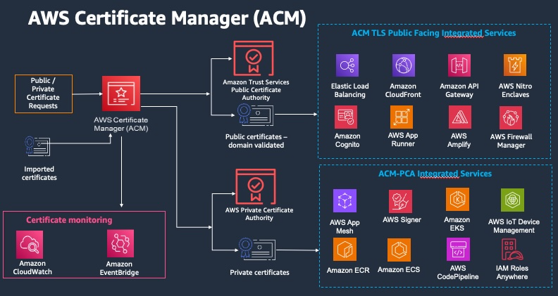
*Figure 1: An overview of ACM*

ACM simplifies the cryptographic complexity involved in managing certificates and their associated keys. Through ACM, you can centrally manage certificates, seamlessly integrate with native AWS services, and automate the lifecycle of certificates.

## What are the benefits of using ACM?

ACM simplifies the management and deployment of public and private SSL/TLS certificates by enabling centralized control through the AWS Management Console, AWS CLI, or APIs. Certificate usage can be monitored through AWS CloudTrail Logs for auditing and governance purposes.

These TLS certificates can be issued at no additional cost for use with various AWS services including Elastic Load Balancers, Amazon CloudFront distributions, and APIs on Amazon API Gateway. Additionally, you can also import SSL/TLS certificates from third-party CAs.

ACM provides managed renewals for all SSL/TLS certificates issued by Amazon. Certificates using DNS validation will be automatically renewed. For private certificates issued by the Private CA IssueCertificate API or imported certificates, users should implement automated expiration notifications.

## Getting started with ACM

### Certificate considerations

ACM manages three types of SSL/TLS certificates: public (domain or email-validated), private, and imported. Users can request a publicly trusted certificate, import a third-party certificate, or or request a private certificate, issued by a customer-owned CA hosted in AWS Private CA. ACM certificates are exclusively compatible with integrated AWS services such as Elastic Load Balancing, CloudFront, and API Gateway. For a full list, see [Services Integrated with ACM](https://docs.aws.amazon.com/acm/latest/userguide/acm-services.html).

The validity period for certificates requested from ACM is fixed at 13 months and cannot be modified for either public or private certificates. If organizations require different validity periods, they should consider importing a certificate from a third-party CA vendor.

## Data protection considerations

When requesting a public certificate from ACM, the service generates a public/private key pair on your behalf. The public key becomes part of the certificate, while ACM uses KMS to encrypt the private key with an encryption context. ACM then stores the certificate and its corresponding encrypted private key. AWS uses the same KMS key to encrypt private keys for all certificates in a specific AWS account and region, with all KMS calls handled internally by ACM.

KMS cryptographic operations with symmetric encryption keys accept an encryption context—an optional set of non-secret key-value pairs containing additional contextual information about the data. This context can be inserted into KMS Encrypt operations to enhance the audibility of API decryption calls. ACM automatically sets the context with values including the certificate ARN of the private key being encrypted, the AWS Region, and the Account ID, which are then cryptographically bound to the ciphertext. The unique encryption context for every ACM certificate creates a logical isolation between certificates.

Important considerations for ACM public certificates include:

* They cannot directly access KMS operations
* You cannot modify how ACM calls KMS
* You are unable to modify the encryption context
* You are prohibited from exporting the private key of a public certificate

### AWS CloudFormation considerations

With AWS CloudFormation you can create a template that describes the AWS resources that you want to use. AWS CloudFormation then provisions and configures those resources for you. AWS CloudFormation can provision resources that are supported by ACM such as Elastic Load Balancing, Amazon CloudFront, and Amazon API Gateway. 

Fast development cycles often require rapid iteration. If you use AWS CloudFormation to quickly create and delete multiple test environments, we recommend that you do not create a separate ACM certificate for each environment. Doing so could exhaust your certificate quota. Instead, create a wildcard certificate that covers all of the domain names that you are using for testing. For example, if you repeatedly create ACM certificates for domain names that vary by only a version number, such as \<version>.service.example.com, create instead a single wildcard certificate for <*>.service.example.com. Include the wildcard certificate in the template that AWS CloudFormation uses to create your test environment.

When using AWS CloudFormation to request a certificate, domain validation is only handled under specific conditions: the domain must be hosted in Amazon Route 53, reside in your AWS account, and use DNS validation. If these conditions are not met, the CloudFormation stack will remain in the CREATE_IN_PROGRESS state, delaying further stack operations.

### Turn on AWS CloudTrail

Turn on CloudTrail logging before you begin using ACM. CloudTrail enables you to monitor your AWS deployments by retrieving a history of AWS API calls for your account, including API calls made via the AWS Management Console, the AWS SDKs, the AWS Command Line Interface, and higher-level Amazon Web Services. You can also identify which users and accounts called the ACM APIs, the source IP address the calls were made from, and when the calls occurred. You can integrate CloudTrail into applications using the API, automate trail creation for your organization, check the status of your trails, and control how administrators turn CloudTrail logging on and off. CloudTrail also simplifies certificate lifecycle management by [enabling event-driven workflows to notify or take action on expiring TLS certificates in your organization](https://aws.amazon.com/blogs/security/how-to-manage-certificate-lifecycles-using-acm-event-driven-workflows/). 

For more information, see [Creating a Trail](https://docs.aws.amazon.com/awscloudtrail/latest/userguide/cloudtrail-create-and-update-a-trail.html). You can also go to [Using CloudTrail with AWS Certificate Manager](https://docs.aws.amazon.com/acm/latest/userguide/cloudtrail.html) to see example trails for ACM actions.

## Implementing ACM

### Deployment considerations

ACM is a regional service, which means ACM certificates must be issued in the same Region as the AWS resources where they will be used and cannot be shared across AWS accounts. A critical exception exists for Amazon CloudFront: all ACM certificates for CloudFront must be issued in the US East (N. Virginia) Region (us-east-1). Once associated with a CloudFront distribution, these certificates are then distributed to all configured geographic locations. 

### Domain validation considerations

Before a CA can issue a certificate for your site, ACM must verify that you own or control all the domains that you specified in your request. You can perform verification using either email or DNS. 


*Figure 2: ACM domain validation*

Amazon recommends using DNS validation over email validation. DNS validation offers several key advantages:

* Direct integration with Route 53 allows you to update records through ACM
* ACM automatically renews DNS-validated certificates as long as the DNS record remains in place and the certificate is actively used
* No manual intervention is required for renewal

Email-validated certificates require a different approach. Renewal notices are sent to five common system addresses for the requested domain  (e.g., admin or postmaster) starting 45 days before expiration. These certificates require manual approval from the domain owner. All listed domains must be validated for a renewed certificate with the same ARN to be issued, which can introduce potential errors or delays if email configurations are incorrect.

### Domain name considerations

ACM certificates can secure singular domain names, multiple specific domain names, wildcard domains (protecting an unlimited number of subdomains), or any combination of these. Once created, certificates cannot be modified by adding or removing domain names. To make changes, you must request a new certificate with the entire revised list of domain names, validating ownership of all domains, including previously validated names.

You cannot add or remove domain names from an existing ACM certificate. Instead you must request a new certificate with the revised list of domain names. For example, if your certificate has five domain names and you want to add four more, you must request a new certificate with all nine domain names. As with any new certificate, you must validate ownership of all the domain names in the request, including the names that you previously validated for the original certificate.

If you use email validation, you receive up to 8 validation email messages for each domain, at least 1 of which must be acted upon within 72 hours. For example, when you request a certificate with five domain names, you receive up to 40 validation messages, at least 5 of which must be acted upon within 72 hours. As the number of domain names in the certificate request increases, so does the work required to use email to validate domain ownership.

If you use DNS validation instead, you must write one new DNS record to the database for the FQDN you want to validate. ACM sends you the record to create and later queries the database to determine whether the record has been added. Adding the record asserts that you own or control the domain. In the preceding example, if you request a certificate with five domain names, you must create five DNS records. We recommend that you use DNS validation when possible.

### Controlling access to ACM certificates

Unlike other data protection services like KMS or Secrets Manager, ACM does not support resource policies or resource control policies (RCPs). Instead, access to ACM certificates can be controlled through either identity-based IAM policies, or service control policies (SCPs) if using AWS Organizations.

Use account-level separation in your policies to control who can access certificates at an account level. Keep your production certificates in separate accounts than your testing and development certificates. If you can't use account-level separation, you can restrict access to specific roles by denying the kms:CreateGrant action  in your policies for the KMS key that protects the certificate private key. This limits which roles in an account can sign or use certificates at a high level. For information about grants, including grant terminology, see [Grants in AWS KMS](https://docs.aws.amazon.com/kms/latest/developerguide/grants.html) in the *AWS Key Management Service Developer Guide*.

If you want more granular control than restricting the use of `kms:CreateGrant` by account, you can limit `kms:CreateGrant` to specific certificates using `kms:EncryptionContext` condition keys. Specify `arn:aws:acm` as the key, and the value of the ARN to restrict. The following example policy prevents the use of a specific certificate, but allow others.

```
{
   "Version": "2012-10-17",
   "Statement": [
       {
           "Sid": "VisualEditor0",
           "Effect": "Deny",
           "Action": "kms:CreateGrant",
           "Resource": "*",
           "Condition": {
               "StringEquals": {
                   "kms:EncryptionContext:aws:acm:arn": "arn:aws:acm:us-east-1:111122223333:certificate/[certificate-id-here]"
               }
           }
       }
   ]
}
```

### Certificate pinning

Certificate pinning (or SSL pinning) is a process that you can use in your application to validate a remote host by associating that host directly with its X.509 certificate or public key instead of with a certificate hierarchy, bypassing SSL/TLS certificate chain validation.  Instead of verifying the entire certificate chain from root CA downward, the application only trusts a pre-defined certificate or key for that host. This trusted certificate can be embedded during development or captured during the first connection to the host.

We recommend that your application not pin an ACM certificate. ACM performs [managed certificate renewal](https://docs.aws.amazon.com/acm/latest/userguide/managed-renewal.html) in AWS Certificate Manager to automatically renew your Amazon-issued SSL/TLS certificates before they expire. To renew a certificate, ACM generates a new public-private key pair. If your application pins the ACM certificate and the certificate is successfully renewed with a new public key, the application might be unable to connect to your domain.

If you decide to pin a certificate, the following options will not hinder your application from connecting to your domain:

* [Import your own certificate](https://docs.aws.amazon.com/acm/latest/userguide/managed-renewal.html) into ACM and then pin your application to the imported certificate. ACM doesn't try to automatically renew imported certificates.
* If you're using a public certificate, pin your application to all available [Amazon root certificates](https://www.amazontrust.com/repository/). If you're using a private certificate, pin your application to the CA's root certificate.

### Opting out of certificate transparency logging

As of April 30 2018, Google Chrome no longer trusts public SSL/TLS certificates that are not recorded in a certificate transparency log. Therefore, beginning April 24, 2018, the Amazon CA began publishing all new certificates and renewals to at least two public logs. Once a certificate has been logged, it cannot be removed.

Logging is performed automatically when you request a certificate or when a certificate is renewed, but you can choose to opt out. Common reasons for doing so include concerns about security and privacy. For example, logging internal host domain names gives potential attackers information about internal networks that would otherwise not be public. In addition, logging could leak the names of new or unreleased products and websites.

To opt out of transparency logging when you are requesting a certificate, use the options parameter of the [request-certificate](https://docs.aws.amazon.com/cli/latest/reference/acm/request-certificate.html) AWS CLI command or the [RequestCertificate](https://docs.aws.amazon.com/acm/latest/APIReference/API_RequestCertificate.html) API operation. If your certificate was issued before April 24, 2018, and you want to make sure that it is not logged during renewal, you can use the [update-certificate-options](https://docs.aws.amazon.com/cli/latest/reference/acm/update-certificate-options.html) command or the [UpdateCertificateOptions](https://docs.aws.amazon.com/acm/latest/APIReference/API_UpdateCertificateOptions.html) API operation to opt out.

**Limitations**

* You cannot use the console to enable or disable transparency logging.
* You cannot change logging status after a certificate enters its renewal period, typically 60 days before certificate expiry. No error message is generated if a status change fails.

Once a certificate has been logged, it cannot be removed from the log. Opting out at that point will have no effect. If you opt out of logging when you request a certificate and then choose later to opt back in, your certificate will not be logged until it is renewed. If you want the certificate to be logged immediately, we recommend that you issue a new one.

The following example shows you how to use the [request-certificate](https://docs.aws.amazon.com/cli/latest/reference/acm/request-certificate.html) command to disable certificate transparency when you request a new certificate.

```
aws acm request-certificate \
--domain-name www.example.com \
--validation-method DNS \
--options CertificateTransparencyLoggingPreference=DISABLED \
```

The preceding command outputs the ARN of your new certificate.

```
{ 
    "CertificateArn": "arn:aws:acm:region:account:certificate/certificate_ID" 
}
```

If you already have a certificate, and you don't want it to be logged when it is renewed, use the [update-certificate-options](https://docs.aws.amazon.com/cli/latest/reference/acm/update-certificate-options.html) command. This command does not return a value.

```
aws acm update-certificate-options \
--certificate-arn arn:aws:acm:region:account:\
certificate/certificate_ID \
--options CertificateTransparencyLoggingPreference=DISABLED
```

## Operationalizing ACM

### Setting up automated notifications for expiring certificates with Amazon EventBridge

ACM does not manage renewal or send expiry notices for certificates issued using the Private CA Issue Certificates API or imported certificates. Instead, you can take advantage of the ACM Certificate Approaching Expiration event to notify you of expiry events. 

1. Create a relevant standard **SNS** topic.
2. Open the **EventBridge** console. In the navigation pane, choose **Buses**, and then **Rules**.
3. Click **Create Rule**.
4. Fill in the name of your rule. Leave all other settings default.

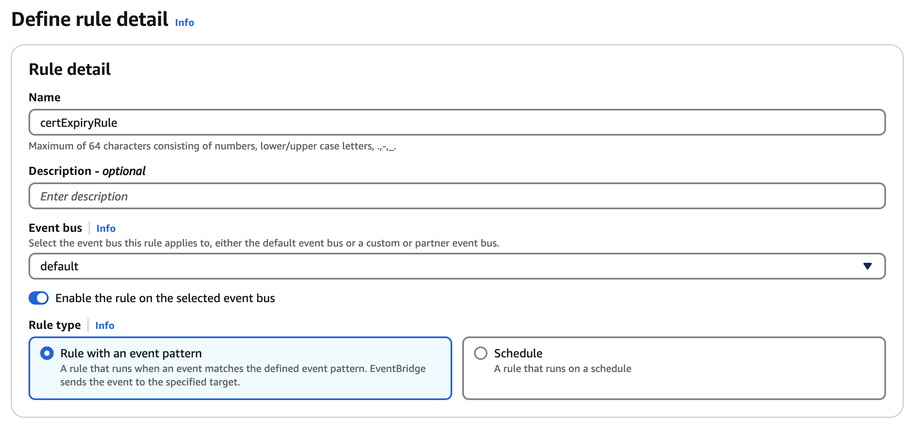
*Figure 3: Defining the Eventbridge rule detail*

4. Scroll down to **Event Pattern**. Under **AWS Service**, choose **Certificate Manager**. 
5. For **Event Type**, choose **ACM Certificate Approaching Expiration**.

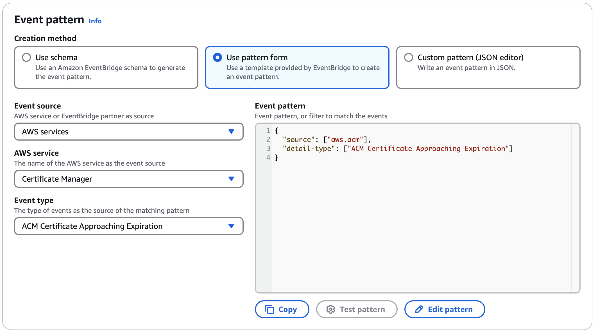
*Figure 4: Defining the Eventbridge event pattern*

6. Click **Next**.
7. Select the SNS topic created in Step 1.

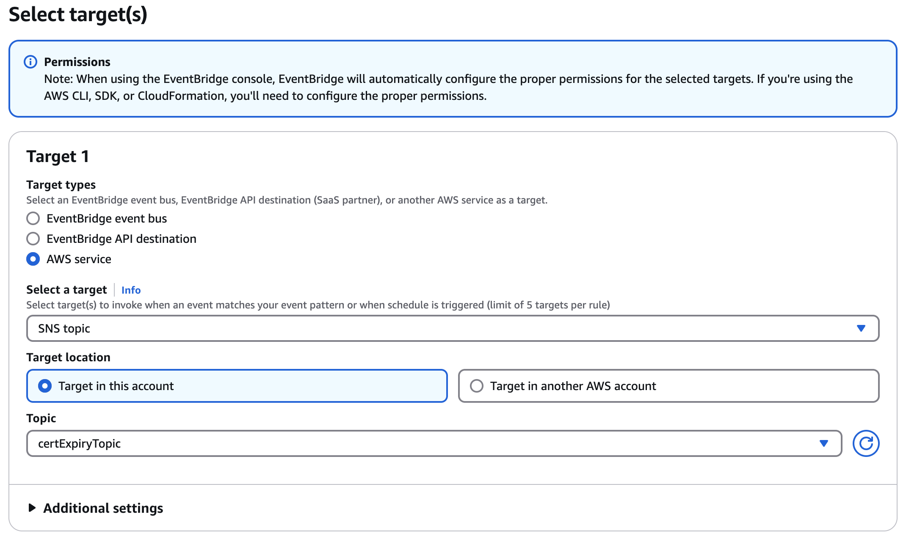
*Figure 5: Specifying the Eventbridge target*

8. Click **Next**, then skip ahead to Step 5.
9. Review your selections, then click **Create rule**.

Your rule will now notify you via SNS topic when your certificate approaches expiry. ACM will send daily expiration events for all active certificates (public, private and imported) starting 45 days prior to expiration. To change the timing of the expiration notification, use the `PutAccountConfiguration` action of the ACM API to select a value between 1-45 days for **DaysBeforeExpiry**.

The EventBridge rule will notify you regardless if your certificate is imported, private, or issued by ACM. You may want to have more granular notifications that only notify you for certain certificates, for instance.

### Setting up automated notifications for expiring certificates with CloudWatch alarms

[CloudWatch Alarms](https://docs.aws.amazon.com/acm/latest/userguide/cloudwatch-metrics.html) monitor certificate expiration in AWS environments and prevent service disruptions through automated notifications. The service sends alerts via email, SMS, or incident management systems when certificates approach their expiration threshold.

The AWS console has one specific limitation: CloudWatch Alarms can monitor only one certificate metric per alarm configuration. For environments with multiple certificates, use the AWS CLI or Infrastructure as Code (IaC) tools to create and manage alarms programmatically.

Two solutions exist for scalable certificate monitoring:

1. AWS Lambda functions that execute certificate expiration checks on a defined schedule.
2. [AWS Config rules that track certificate lifecycles across AWS accounts](https://repost.aws/knowledge-center/acm-certificate-expiration).

### Certificate inventory management

Organizations can implement [AWS Config rules](https://github.com/aws-samples/ACM-flag-CA-issuer) to actively track certificate usage and deployment patterns across their infrastructure. A structured resource tagging strategy assigns specific ownership and purpose metadata to each certificate, enabling clear accountability and tracking. Organizations typically generate automated inventory reports using AWS Organizations and AWS Config, providing comprehensive visibility across certificate deployments. Regular audits of certificate-to-resource mappings ensure accuracy and help identify potential gaps in certificate management. 

### Compliance and Auditing

Compliance and auditing processes focus on maintaining detailed records through AWS CloudTrail logs of all certificate operations. These logs enable automated reporting systems to identify unused certificates and track approaching expirations, supporting proactive certificate management. Organizations implement compliance validation scripts to verify certificate configurations against internal policies and regulatory requirements. Regular security reviews assess certificate policies and deployments, ensuring continuous alignment with security standards and compliance mandates.

### Managed renewal for imported certificates

AWS Config automates renewal of imported certificates in ACM using resource tags and remediation rules. Unlike AWS-issued certificates which renew automatically, imported certificates require this specific automation for renewal. The automation process follows a fixed sequence: An AWS Config rule identifies expiring imported certificates, triggers a Lambda function, which then uses certificate metadata from resource tags to execute renewal. The function retrieves the new certificate, imports it to ACM, and updates associated AWS resources automatically. The solution eliminates manual renewals, prevents certificate-related outages, and standardizes management across all certificate types. Implementation requires precise configuration of AWS Config rules, Lambda functions, and resource tags.

### Renewal status tracking

AWS Config monitors imported certificate renewals in ACM using defined rules and metadata tags. Each certificate maintains one of four status tags: pending renewal, renewal in progress, renewal complete, or renewal failed. Config rules trigger EventBridge notifications upon status changes, ensuring timely alerts for renewal activities.

Organizations can track renewal status through AWS Config dashboards and aggregator reports, while the system logs all renewal actions for audit purposes. This automation ensures continuous monitoring of certificate lifecycles and prevents renewal-related outages.

## What is AWS Private Certificate Authority (AWS Private CA)?

AWS Private CA is a highly available, managed service designed to create and maintain an internal public key infrastructure (PKI) for organizations. This service eliminates the upfront investment and ongoing maintenance costs associated with operating a private certificate authority while simplifying certificate lifecycle management.

## What are the benefits of using AWS Private CA?

### Improve availability and scalability

AWS Private CA’s fundamental benefits of availability and scalability offer a robust 99.9% availability guarantee through a [service level agreement (SLA)](https://aws.amazon.com/private-ca/sla/). Private CA eliminates the complexity and overhead associated with managing on-premises PKI infrastructure. The service's flexible architecture supports seamless scaling as business demands grow, while providing versatile deployment options through multiple connector types - including Active Directory, Kubernetes, and SCEP for Mobile Device Management (MDM). Organizations can leverage various certificate modes (short-lived and general-purpose) to align with their specific security requirements, enabling a tailored approach to certificate issuance and management. 

### Enhance security posture

Security is enhanced through multiple layers of protection. AWS Private CA employs FIPS 140-3 validated hardware security modules (HSMs) to safeguard CA keys, providing enterprise-grade security for critical PKI components. The integration with AWS Identity and Access Management (IAM) enables granular access control and permissions management for Certificate Authorities. Security response capabilities are strengthened through efficient certificate revocation mechanisms, including Online Certificate Status Protocol (OCSP) and Certificate Revocation Lists (CRLs), allowing organizations to quickly address potential certificate compromises and maintain a robust security posture. 

### Simplify certificate lifecycle management

Certificate lifecycle management is streamlined through automation and integration. AWS Private CA works seamlessly with AWS Certificate Manager to automate crucial tasks such as certificate issuance, renewal, and revocation for both AWS and non-AWS resources. This automation eliminates the manual overhead traditionally associated with PKI management, reducing the operational burden on IT teams. 

By automating routine PKI management tasks, organizations can redirect their resources toward strategic security initiatives while maintaining efficient certificate operations. 

### Accelerate compliance and regulatory adherence

The service accelerates compliance and regulatory adherence through centralized management and comprehensive auditing capabilities. Integration with AWS CloudTrail and Amazon CloudWatch provides unified visibility and detailed audit trails, simplifying compliance with industry regulations and standards. AWS Private CA enables organizations to easily share CAs across multiple AWS accounts while maintaining strict access controls and security best practices. The platform's customizable certificate templates support organization-specific identity and data protection policies, accommodating diverse use cases from web services to IoT devices, all while optimizing costs and maintaining security standards. 

## Getting started with AWS Private CA

### Certificate considerations

AWS Private CA enables you to create and operate private CAs on AWS. Unlike ACM's public certificates, Private CA lets you establish your own PKI hierarchy with root and subordinate CAs for issuing private certificates. These certificates can be used with both AWS services and on-premises applications.

Types of certificates:

* Root CA - The top-level authority in your PKI hierarchy
* Subordinate CA - Issues certificates under the  authority of a root CA

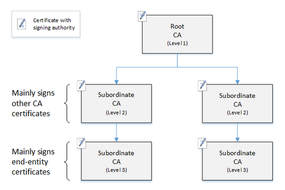
*Figure 6: A simple, three-level CA hierarchy*

ACM offers fixed 13-month validity periods for certificates, while Private CA offers flexible configuration for CAs as well as issued certificates:

* There is no limit for Root CA validity. The Private CA default for root certificates is ten years.
* Subordinate CAs can have custom validity periods. The Private CA default validity period for a subordinate CA certificate is three years.

A certificate managed by Private CA must have a validity period shorter than or equal to the validity period of the CA that issued it.

### Data protection considerations

When you create a private certificate authority using AWS Private CA, the service generates a private/public key pair for the root or subordinate CA. You can use CloudTrail to monitor and audit all cryptographic operations associated with your CA.

### Validation Considerations

Since AWS Private CA is designed for internal certificates, you control the issuance policies and validation methods rather than relying on public domain validation. You define the certificate subjects and any associated extensions or constraints in your CA’s configuration. You can implement your own validation processes that relies on certificate templates that define allowed configurations, custom validation rules, and access controls implemented through IAM policies. Organizations can define their own validation criteria, including custom certificate extensions, key usage restrictions, and naming conventions. Trust is established through:

* **IAM Policies**: Controlling who can issue, revoke, or manage certificates. You can also use [IAM condition context keys to allow or deny authorized accounts and users to request certificates for specific domains](https://aws.amazon.com/blogs/security/how-to-use-aws-certificate-manager-to-enforce-certificate-issuance-controls/).
* **Certificate Templates**: Predefined or custom templates that enforce certificate  parameters (e.g., key usage, extended key usage).
* **Revocation**: Revoking certificates via API/console and either publishing Certificate Revocation Lists (CRLs) to an S3 bucket or enabling OCSP.
* **Name Constraints**: DNS name constraints that establish guardrails to mitigate certificate misuse. For example, you can set a [DNS name constraint that restricts the CA from issuing certificates to a resource using a specific domain name](https://aws.amazon.com/blogs/security/how-to-enforce-dns-name-constraints-in-aws-private-ca/).

Please note for cross-account certificate issuance that explicit IAM permissions must be configured to validate and authorize requests. 

### Domain name considerations

AWS Private CA offers flexible domain name considerations, allowing you to issue certificates for both internal and external domain names without the public domain validation requirements of ACM. You can use any valid domain naming convention, including non-public domains (like .internal, .local, .corp), private IP addresses, and custom internal naming schemes. The certificates can include Subject Distinguished Name (DN) components (such as Common Name, Organization, Country, etc.) and multiple Subject Alternative Names (SANs) that support DNS names, IP addresses, internal hostnames, and wildcard domains. 

### Deployment considerations

AWS Private CA is  a regional service. You must create your private CA in the same AWS Region  where your resources are deployed, or where you plan to use the  certificates. However, certificates are not Region bound and you can issue certificates for resources located in  different regions. You can use AWS Private CA with AWS Certificate Manager (ACM) to deploy certificates to AWS services like Elastic Load Balancing, API Gateway, and CloudFront.

### Minimize use of the Root CA if possible

Customers should avoid sharing Root CA between accounts and keep it as restricted as possible. The Root CA should be placed in an isolated account with MFA enabled, with no cross-account access other than to sign subordinate CAs.

A root CA should in general only be used to issue certificates for intermediate CAs. This allows the root CA to be stored out of harm's way in its own account while the intermediate CAs perform the daily task of issuing end-entity certificates.

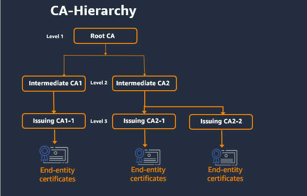
*Figure 7: A Best Practice CA Hierarchy with minimal Root usage*

## Implementing AWS Private CA

### Certificate authority hierarchy design 

The root and subordinate CA hierarchy should be carefully designed with consideration of geographic distribution, business unit separation, and specific use case requirements. A hierarchy design establishes the framework for all certificate operations and directly impacts a PKI infrastructure's security and manageability. A well-designed CA hierarchy offers granular security controls appropriate to each CA, the division of administrative tasks for better load balancing and security, the use of CAs with limited, revocable trust for daily operations, and validity periods and certificate path limits.

In AWS Private CA, you can create a hierarchy of certificates with up to five levels. A root CA can have any number of branches, with as many as four levels of subordinate CAs per branch. It is also possible to create multiple hierarchies, each with its own root.

A CA hierarchy should have strongest security at the top of the tree, protecting the root CA and its private key, as a compromised root could destroy trust in the entire PKI. As a result, root and high-level subordinate CAs should only be used infrequently (e.g. to sign other CA certificates, or when a CRL or OCSP responder needs to be configured) and be tightly controlled and audited. More routine administrative tasks should be given to lower-level CAs in the hierarchy.

### Key algorithm and length selection

Private CA supports [the following RSA and Elliptic Curve algorithms](https://docs.aws.amazon.com/privateca/latest/userguide/PcaWelcome.html#supported-algorithms). Cryptographic algorithms and key lengths (RSA 2048 or 4096 bits) should be selected to balance security and performance requirements, as a choice impacts certificate processing overhead, compatibility requirements, and long-term security posture. Regular evaluation of these choices should be implemented within an organization to ensure continued alignment with evolving cryptographic standards and emerging security threats.

### Certificate template configuration 

Private CA uses configuration templates to issue CA certificates and end-entity certificates. Four varieties of templates are supported:

* Base templates - Pre-defined templates in which no passthrough parameters are allowed
* CSRPassthrough templates - Templates that extend a corresponding base template version by allowing CSR passthrough, e.g. extension values in the certificate signing request that are copied over to the issued certificate. (Note: if a CSR contains extension values that conflict with the template definition, a template definition will have higher priority).
* APIPassthrough templates - Templates that extend a corresponding base template version by allowing API passthrough, or dynamic values, e.g. dynamic values that are known to the admin or intermediate systems that may not be known by the entity that requested the certificate, are impossible to define in a template, or may not be available in a CSR (Note: if a APIPassthrough parameter contains extension values that conflict with the template definition, a template definition will have higher priority).
* APICSRPassthrough templates - Templates that extend a corresponding base template version by allowing both API and CSR passthrough. (Note: if a template definition, API passthrough values, or CSR passthrough extensions conflict, the priority will be template definition, APIPassthrough, and then CSR passthrough extensions).

Certificate templates standardize and streamline the certificate issuance process. Organizations must define templates with appropriate validity periods, extensions, and constraints that align with different use cases and security requirements. Well-designed templates enforce organizational policies while maintaining operational flexibility. This standardization reduces human error, ensures consistency in certificate issuance, and simplifies certificate lifecycle management across the organization.

### CA Sharing

AWS Private CA offers cross-account sharing, or the ability to grant permissions for other accounts to use a centralized CA to issue end-entity certificates or subordinate CA certificates. This can be done using AWS Resource Access Manager (RAM) to manage permissions or by using the Private CA API or CLI to attach a resource-based policy to a CA. 

If [using RAM to share Private CA](https://repost.aws/knowledge-center/acm-share-pca-with-another-account), keep in mind that RAM is a Regional service and that resource share is Regional. ACM PCA resource shares with principals in another AWS account must only access resources from the same AWS Region as the resource share (and any supported global resources created in us-east-1). 

### Integration with AWS Services

Integration planning consists of connecting AWS Private CA with essential AWS services, particularly ACM for automated lifecycle management. You should evaluate your existing AWS infrastructure to identify integration points with services like IoT and Direct Connect. The integration strategy should emphasize automation, scalability, and efficient certificate deployment while leveraging the full capabilities of the AWS ecosystem.

### Access control and IAM policies secure 

AWS Private CA operations require implementing precise access controls through AWS IAM. Organizations must create roles and policies that enforce the principle of least privilege, defining specific permissions for certificate issuance, revocation, and CA management. An effective way to have control over CA management is through separation of permissions; i.e., having User A only be able to change the state of the CA, while User B can only install and issue certificates through the CA. Both users are thus required to create and activate a new CA. This separation of permissions should also be implemented between roles that disable CAs, and roles that can delete them.

Regular policy reviews ensure continued alignment with security requirements while maintaining operational efficiency. This structured approach to access control prevents unauthorized access and supports compliance requirements.

### Managed revocation

The RevokeCertificate API revokes a AWS Private CA certificate before its scheduled expiration in the event of a key being compromised, the associate domain becomes invalid, etc. AWS provides two fully managed mechanisms for the client using the certificate to check the revocation status: OCSP and certificate revocation lists (CRLs).

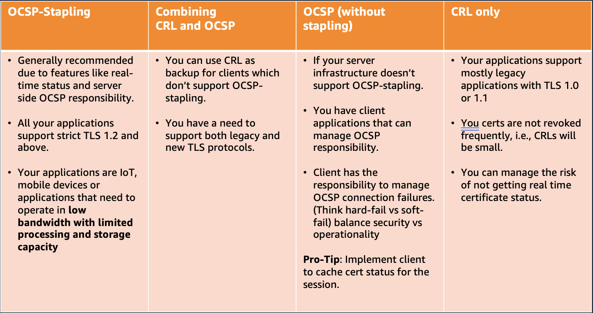
*Figure 8: A comparison of AWS fully managed revocation mechanisms*

**OCSP**

AWS Private CA provides a fully managed OCSP solution to notify endpoints that certificates have been revoked. Customers can enable OCSP on CAs through the Private CA console, the API, the CLI, or CloudFormation. With OCSPs, the client queries an authoritative revocation database that returns a synchronous status. When OCSP is enabled, Private CA will include the URL of the OCSP responder in the Authority Information Access (AIA) extension of the new certificate.

Some considerations for OCSP:

* OCSP responses may take up to 60 minutes to reflect a revoked certificate’s new status
* APIPassthrough and CSRPassthrough certificate templates do not work with AIA if the OCSP responder is enabled
* The endpoint of the managed OCSP service is available on the public internet. Customers who want OCSP but prefer not to have a public endpoint will have to operate an alternative infrastructure.
* OCSPs are priced on-demand.

**CRL**

A CRL is a file that includes a list of all revoked certificates, as well as relevant information including reason for revocation. When you configure a CA, you can choose whether or not AWS Private CA creates a complete or partitioned CRL (where a CRL is partitioned into several smaller CRLs). As each CRL can only revoke 50,000 certificates, the more partitioned CRLs you have, the more certificates that you can revoke, up to a 1,000,000 limit for each supported region.

Some considerations for CRL:

* CRLs are updated approximately 30 minutes after a certificate is revoked. If a CRL update fails, Private CA will continue to make further attempts every 15 minutes
* Because of the download and processing requirements, CRLs require more memory than OCSP. Consider caching revocation lists or partitioned CRLs.
* If you update your CRL from complete to partitioned, AWS Private CA creates new partitions as needed and adds the IDP extension to all CRLs, including the original. 
* Partitioned CRLs dramatically increase the number of certificates your private CA can issue, and saves you from frequently rotating your CAs.

## Connector for Kubernetes

AWS Private CA introduced a powerful integration with Kubernetes through its open-source cert-manager plugin, aws-privateca-issuer. This solution enables organizations to manage certificates for their Kubernetes workloads while maintaining strict security controls and compliance requirements. The plugin eliminates the need to store sensitive private keys within the cluster, significantly reducing security risks and simplifying certificate lifecycle management.

The aws-privateca-issuer plugin offers flexibility, supporting deployments across Amazon EKS, self-managed Kubernetes on AWS, and on-premises Kubernetes environments. Organizations can leverage this solution regardless of their infrastructure choices, including both x86 and ARM architectures. This integration is particularly valuable for enterprises with stringent regulatory requirements, as it provides enhanced auditability and control over certificate operations. Security teams can maintain centralized oversight of certificate issuance while allowing development teams to efficiently manage their certificate needs through familiar Kubernetes workflows. 

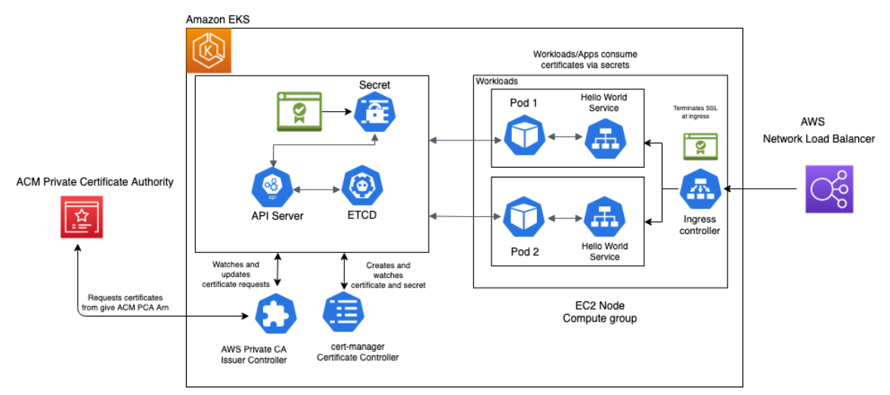
*Figure 9: AWS Private CA Connector for Kubernetes*

This architecture shows you how to set up end-to-end encryption on Amazon Elastic Kubernetes Service (Amazon EKS) with AWS Private CA. . For this example of end-to-end encryption, traffic originates from your client and terminates at an Ingress controller server running inside a sample app. 

### Connector for SCEP

[AWS Private Certificate Authority (AWS Private CA) Connector for SCEP](https://www.youtube.com/watch?v=sqlyaQqyUnw) (Simple Certificate Enrollment Protocol) offers a streamlined solution for mobile device certificate management. This preview feature integrates seamlessly with popular Mobile Device Management (MDM) solutions to enhance security and simplify certificate deployment for mobile devices.

The connector provides several key benefits for organizations managing mobile device certificates. It significantly reduces operational costs and complexity by simplifying the process of securing mobile devices with private certificates. Organizations can leverage a single Certificate Authority with the AWS Private CA connector, eliminating the need for multiple CAs across different use cases, which streamlines certificate management and reduces infrastructure complexity.

A major advantage of this solution is its cost-effectiveness and efficiency in PKI operations. By utilizing a managed private CA with a managed SCEP service, organizations can save both time and money on their PKI infrastructure. Furthermore, the solution enables automatic enrollment of mobile devices through AWS Private CA, working in conjunction with commercially available MDM solutions, which simplifies device onboarding and certificate deployment processes.

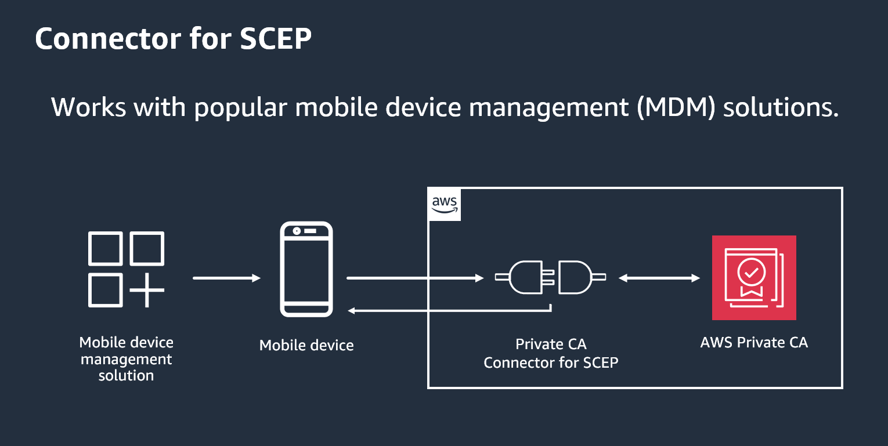
*Figure 10: AWS Private CA Connector for SCEP*

The architecture, as illustrated in the diagram, shows a straightforward flow where the MDM solution communicates with mobile devices through the AWS Private CA Connector for SCEP, which then interfaces with AWS Private CA for certificate management. This integrated approach provides a secure and efficient method for managing device certificates at scale.

### Connector for Active Directory

AWS Private CA Connector for Active Directory can help you provision certificates for users and machines within your Microsoft Active Directory (AD) environment. By combining AWS Private CA with AD, you can leverage managed private CA while using your existing AD infrastructure to handle certificate enrollment, distribution, and trust. Using the AWS Private CA Connector for Active Directory, you can replace on-premises enterprise or other third-party CAs with a managed private CA that you own, providing certificate enrollment to users, groups, and machines that are managed by your AD. 

To integrate AWS Private CA with Active Directory, you can use the AWS Directory Service, which provides a managed Microsoft Active Directory in the AWS Cloud. By creating a directory using AWS Directory Service, you can then configure AWS Private CA to trust the directory and issue certificates to users and devices that are authenticated against the Active Directory. The Connector for AD can be used to issue certificates to domain-joined devices for both on-premise AD environments (using the [Active Directory Connector](https://docs.aws.amazon.com/directoryservice/latest/admin-guide/directory_ad_connector.html) provided by AWS Directory Services) and AD environments hosted in [AWS Managed Microsoft AD](https://docs.aws.amazon.com/directoryservice/latest/admin-guide/directory_microsoft_ad.html).

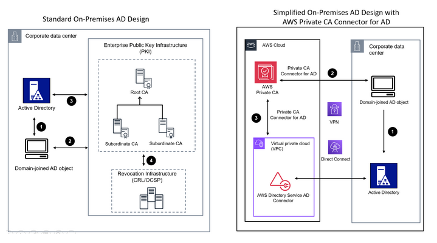
*Figure 11: AWS Private CA Conenctor for Active Directory*

This architecture displays the difference between an on-premises ADCS implementation without AWS Private CA, and an implementation using AWS Private CA with the Connector for AD. 

### Cross account CA sharing

AWS Private CA supports cross-account sharing, which allows you to share your private certificate authority (CA) with other AWS accounts within your organization. 

You can use AWS RAM (Resource Access Manager) to share an ACM Private CA to create a resource share with another AWS account. Using AWS RAM to apply a resource-based policy, an AWS Private CA administrator can share access to a CA with a user in a different AWS account directly or through AWS Organizations. The primary account attaches a policy to the Private CA, specifying which secondary accounts or IAM roles can perform actions like issuing certificates, revoking certificates, or exporting the CA certificate. Secondary accounts then use IAM policies to allow their users or roles to interact with the shared CA. This setup ensures centralized control over the CA’s lifecycle while delegating certificate issuance to trusted accounts.

You can also share an ACM Private CA with other entities such as the following:

* Other principals, such as AWS Identify and Access  Management (IAM) users and IAM roles.
* Organizational units (OUs).
* The entire AWS organization that your account is a  member of.

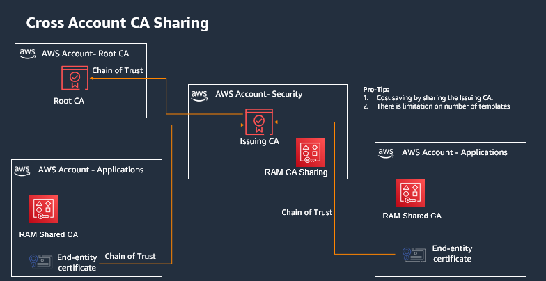
*Figure 12: Cross Account CA Sharing*

This architecture provides a detailed overview of Cross-Account CA Sharing using AWS Private CA. It demonstrates how the Root CA, Issuing CA, and RAM Shared CA work together to enable centralized certificate management while maintaining a chain of trust across accounts.

### What is the difference between ACM and Private CA?

AWS Private CA and ACM are distinct yet complementary services. AWS Private CA enables organizations to establish and operate their own CA within AWS, allowing them to issue private certificates for both internal and external resources with complete control over the certificate hierarchy and policies. In contrast, ACM primarily focuses on managing SSL/TLS certificates specifically for AWS services, offering free public certificates from Amazon Trust Services CA and automated certificate lifecycle management including renewal and deployment.

While Private CA provides broader flexibility and can issue certificates for any resource with associated costs for CA operation and certificate issuance, ACM streamlines certificate management specifically for AWS services with free public certificates and deep service integrations. These services often work together in practice, with AWS Private CA handling the creation of private certificates and ACM managing their deployment and lifecycle within AWS services, providing a comprehensive certificate management solution for organizations.

* Use ACM when you need free, automatically managed public certificates for your AWS services like websites, applications, or APIs running on AWS.
* Use AWS Private CA when you need to create and manage your own private certificates for internal resources, applications outside of AWS, or when you require complete control over your certificate issuance and policies.

### Cost considerations

AWS Certificate Manager (ACM) provides public TLS certificates at no cost. AWS PrivateCA pricing follows a three-part model: a fixed monthly fee per CA for operational costs, usage-based charges for private certificate issuance, and OCSP validation fees (while CRL usage remains free).

If you are just getting started with AWS Private CA or enabling it on new accounts, AWS Private CA has a 30-day free trial for the first private CA created in the account in each Region. You pay for any certificates issued during the trial, including a one-time charge for the first time you export the private key and certificate of certificates requested through ACM. This trial period provides an opportunity to evaluate the service's features and confirm it meets your organization's PKI requirements without incurring the full CA operation costs. 

## AWS Private CA best practices checklist 

Best practices are recommendations that can help you use AWS Private CA effectively. The following best practices are based on real-world experience from current AWS Private CA customers.

* Document CA structure and policies. Do not issue end entity certificates from the root CA.
* Define and set CA validity periods during initial CA creation. 
* Limit Root CA usage to only issuing intermediate CA certificates. 
* Maintain a simple CA hierarchy of 2-3 levels for efficient management. 
* Deploy the root CA in a dedicated AWS account separate from other CAs. 
* Maintain separation between administrator and certificate issuer roles through distinct IAM permissions. 
* Implement certificate revocation through OCSP or CRLs for automated certificate status management. 
* Enable AWS CloudTrail logging before creating and operating private CAs. 
* Regularly rotate CA private keys through certificate imports or CA replacement. 
* Remove unused CAs following the recommended deletion process. 
* Enable S3 Block Public Access for CRL storage buckets to protect PKI details. 
* Follow Amazon EKS Best Practices Guides when using AWS Private CA with Kubernetes environments.

## Resources

### Workshops
* [Activation Days](https://awsactivationdays.splashthat.com/)
* [AWS Encryption in Transit Workshop](https://catalog.workshops.aws/certificatemanager/en-US)
* [Hands-on ACM Troubleshooting Labs](https://catalog.workshops.aws/acm-troubleshooting/en-US)

### Videos
* [AWS Private Certificate Authority (AWS Private CA) Connector for SCEP](https://www.youtube.com/watch?v=sqlyaQqyUnw)

### Blogs
* [How to manage certificate lifecycles using ACM event-driven workflows](https://aws.amazon.com/blogs/security/how-to-manage-certificate-lifecycles-using-acm-event-driven-workflows/)
* [How to enforce DNS name constraints in AWS Private cA](https://aws.amazon.com/blogs/security/how-to-enforce-dns-name-constraints-in-aws-private-ca/)