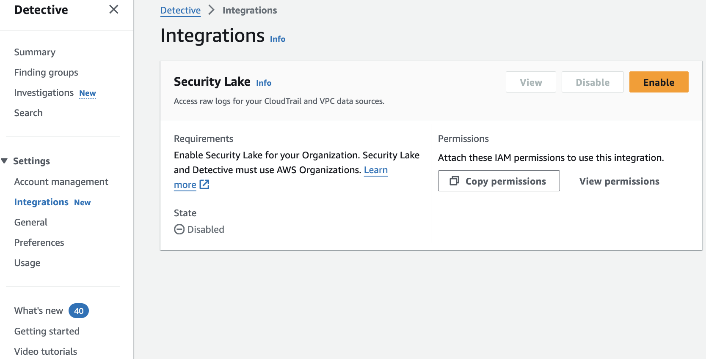
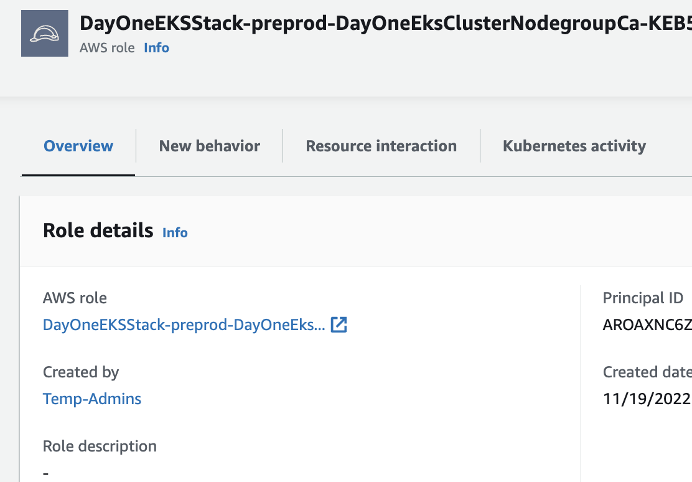
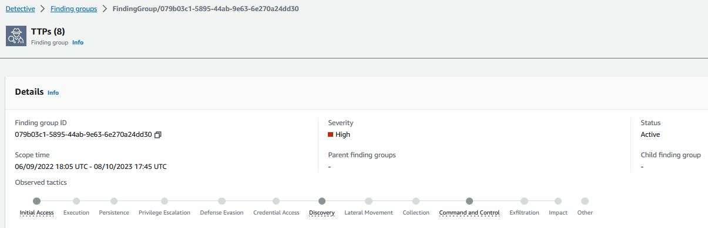
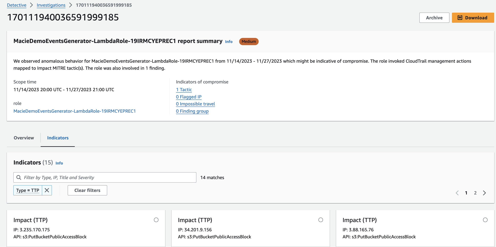

# Amazon Detective

## Introduction

Welcome to the Amazon Detective Hub Best Practices Guide. The purpose of this guide is to provide prescriptive guidance for leveraging Amazon Detective for investigating security issues associated with your AWS resources. Publishing this guidance via GitHub will allow for quick iterations to enable timely recommendations that include service enhancements, as well as the feedback from the user community. This guide is designed to provide value whether you are deploying Detective for the first time in a single account, or looking for ways to optimize Detective in an existing multi-account deployment.

## How to use this guide

This guide is geared towards security practitioners who are responsible for monitoring and remediation of threats and malicious activity within AWS accounts (and resources). The best practices are organized into categories for easier consumption. Each category includes a set of corresponding best practices that begin with a brief overview, followed by detailed steps for implementing the guidance. The topics do not need to be read in a particular order:

* [What is Amazon Detective](#what-is-amazon-detective)
* [Who is Amazon Detective for](#who-is-amazon-detective-for)
* [What are the benefits of enabling Amazon Detective](#what-are-the-benefits-of-enabling-amazon-detective)
* [Getting started](#getting-started)
    * [Enable GuardDuty](#enable-guardduty)
    * [Where to enable Detective](#where-to-enable-detective)
    * [Region considerations](#region-considerations)
* [Implementation](#implementation)
    * [Enablement](#enablement)
    * [Enroll other AWS account in your organization](#enroll-other-aws-accounts-in-your-organization)
    * [Enable optional data feeds](#enable-optional-data-feeds)
* [Operationalizing](#operationalizing)
    * [Providing access](#providing-access)
    * [Investigating a finding](#investigating-a-finding)
      * [Start your investigation from GuardDuty](#start-your-investigation-from-guardduty)
      * [Start your investigation from a Finding Group](#start-your-investigation-from-a-finding-groups)
      * [Threat hunting in Detective](#threat-hunting-in-detective)
      * [Crafting Detective Embedded URLs](#crafting-detective-embedded-urls)
* [Cost Considerations](#cost-considerations)
* [Resources](#resources)

## What is Amazon Detective?

Amazon Detective makes it easy to analyze, investigate, and quickly identify the root cause of security findings or suspicious activities. Detective automatically collects log data from your AWS resources and uses machine learning, statistical analysis, and graph theory to help you visualize and conduct faster and more efficient security investigations.

## Who is Amazon Detective for?

Amazon Detective works well for customers who want to take advantage of a managed security service that helps connect the dots for investigating security issues in AWS. These customers may be a bigger organization with many tools who want to augment analysts to focus on other issues but they also may have a leaner IT Security staff and need an effective tool to help their teams with efficiently investigate security issues in AWS. Detective is for security analysts, security operations engineers, and incident response teams. Larger customers may benefit from using Detective if they have tool sprawl and are looking to consolidate their SIEM tooling. Customers have particularly found value using Amazon Detective to gain visibility Amazon Elastic Kubernetes Service (EKS) audit logs and VPC flow logs.

## What are the benefits of enabling Amazon Detective?

Detective aids incident responders and security engineers in determining what resources are associated with a given security event. It uses data feeds from GuardDuty findings, VPC Flow Logs, CloudTrail, EKS audit logs, and Security Hub findings, to build a behavior graph to help customers understand resource associations, abnormal activity like newly observed geo locations, understanding when roles were assumed by other roles, along with many other use case in your environment. Many customers may not have the log and telemetry collection correlation tooling stood up, or the knowledge or resources, and this makes Detective a perfect fit.

Although many customers who have the tools, knowledge, people already in place and are able to successfully navigate security events and discover related logs within an acceptable response time. Typically this requires third party tooling to be installed, configured, operated, and monitored while collecting VPC Flow logs, CloudTrail logs, EKS Audit logs, and shipped to a log aggregation tool. Consider the cost tradeoff and time saved by switching to Detective where visibility into these data feeds is built-in vs aggregated and stored separately. Most customers have found Detective effective in shortening investigation times because they do not have to write queries into a log aggregation tool and instead rely on Detective provided insights.

Many customers observe that using Detective and GuardDuty together provides the ability to investigate natively in AWS after GuardDuty creates a finding. GuardDuty tells you about the threat, but Detective tells you the story. Often we hear from customers that the amount of security findings from any given service overwhelm their teams and leave them without a clear priority. Detective enables teams to focus on true security events.

Detective provides benefits for Amazon EKS workloads to assist in runtime investigations. Detective allows you to view inside EKS workloads to examine pod configuration, pod image, image source, VPC flows within an EKS cluster, and activity by Kubernetes user within a cluster. If you run Amazon EKS across many AWS accounts, Detective’s ability to ingest data from the backend and centralize in a centralized Security Account helps reduce time to root cause during a security event. Take a closer look at our [Container Security Workshop](https://catalog.workshops.aws/containersecurity) for more in-depth walkthroughs on how to use Detective for container based workloads.

## Getting started

### Enable GuardDuty

Amazon GuardDuty is a pre-requisite before enabling Amazon Detective. Follow the [Amazon GuardDuty documentation](https://docs.aws.amazon.com/guardduty/latest/ug/what-is-guardduty.html) for enabling GuardDuty and enrolling AWS Accounts in your Organization at scale.

If you run Amazon EKS in your environment, it is recommended to enable [EKS Audit and Runtime Protection in GuardDuty](https://docs.aws.amazon.com/guardduty/latest/ug/kubernetes-protection.html). In the enablement recommendations below we will discuss consuming EKS audit logs in Detective.

It’s recommended to update the GuardDuty CloudWatch Notification Frequency from its default of 6 hours to 15 minutes. If you leave it at 6 hours, it could take updates to recurring findings up to 6 hours to be reflected in Detective. Regardless if you do or do not change this frequency, new findings are always sent to Detective within five minutes of the finding being generated. Shortening this timeframe does not incur any additional costs.  For information about setting the notification frequency, see [Monitoring GuardDuty Findings with Amazon CloudWatch Events](https://docs.aws.amazon.com/guardduty/latest/ug/guardduty_findings_cloudwatch.html) in the Amazon GuardDuty User Guide.

### Where to enable Detective

We recommend enabling Amazon Detective in the same Delegated Administrator AWS Account as the rest of your AWS Security Services (GuardDuty, Security Hub, Macie, etc), as outlined in the [Security Reference Architecture](https://docs.aws.amazon.com/prescriptive-guidance/latest/security-reference-architecture/organizations.html) (SRA) whitepaper. If you don’t have a dedicated Security AWS Account yet, this is the perfect opportunity to create one. If you run AWS Control Tower, you already have one which is often called the “Audit” or “Security” Account.

Note that Detective currently supports a maximum of 1200 AWS accounts in each behavior graph. If you’re interested in enabling Detective for more than 1200 accounts please reach out to your AWS account team. For other Detective quotas refer to the documentation on [regions and quotas](https://docs.aws.amazon.com/detective/latest/adminguide/regions-limitations.html).

### Region Considerations

Amazon Detective is a regional service. This means that to use Amazon Detective you will need to enable it in every region that you would like to have incident response capabilities with Detective.

A question that is often asked is “Should I use a security service in a region that my company is not actively using?” Detective’s costs are based on the amount of data ingested in a given account. If an AWS account or region has no activity, Detective will not incur a cost. It’s recommended to review the Usage section in Detective to determine if the estimated costs are acceptable. We recommend enabling Detective in every AWS account and region that you plan to have available in your organization. This ensures that if someone started to launch resources in a region you will have visibility if needed for any subsequent security issues.

You can use the AWS console, AWS CLI, or the Amazon Detective python scripts to enable Detective across accounts in an AWS Organization. [Review the scripts and their contents here](https://docs.aws.amazon.com/detective/latest/adminguide/detective-github-scripts.html).

## Implementation

### Enablement

To create a delegated administrator for Amazon Detective to your desired Security Tooling Account, follow the [enablement documentation](https://docs.aws.amazon.com/detective/latest/adminguide/accounts-designate-admin.html). Then, using your AWS console, open your Security Tooling account and browse to the Detective service.

Detective is very easy to enable. There is nothing to install and the integration with other AWS services is seamless. In the Detective service, enable Detective by clicking on the orange Get Started button.

*Figure 1: Detective getting started page*

Review the service linked role that Detective will create to understand the permissions needed and then click enable Amazon Detective.

*Figure 2: Enable Detective*

### Enroll other AWS Accounts in your Organization

After enabling Detective you will need to enroll other AWS Accounts in the Organization. In the Detective console browse to Account Management. From the account management page you can enroll all accounts in your organization by selecting the “Enable all accounts“ button pictured below.

*Figure 3: Enable all Detective accounts*

After you have enabled for all accounts in your organization ensure that you have turned on the "auto-enable" button as pictured below. This give the Detective delegated administrator the ability to automatically enable Detective in all new accounts that are created in your organization without needing to perform any actions by your team.

*Figure 4: Detective auto enable feature*

### Enable Optional Data Feeds

Browse to the General section.

If you have just enabled Detective, you will already be ingesting findings from AWS security services and EKS audit logs. If you were using Detective before these integrations were released you will need to enable them manually.

*Figure 5: Detective source packages*

### Enable Amazon Security Lake integration

Optionally you can configure Detective to integrate with Amazon Security Lake to query and retrieve logs stored in Security Lake directly in the Detective console. With this integration, security analysts can start their security investigations based on summaries and visualizations in Detective. In the event they need to dive deeper and retrieve logs, Detective provides a pre-built query using Amazon Athena that is scoped to the time and entities under investigation. You can use this query to get a preview of CloudTrail or VPC flow logs that represent the potential security issue or download all the logs as CSV files.

*Figure 6: Security Lake integration enablement page*

## Operationalizing

### Providing Access

Amazon Detective works by consuming VPC Flow Logs, Cloudtrail Logs, EKS Audit Logs, and Security Hub findings and correlating resource IDs with events from GuardDuty into a behavior graph. This graph is what you can follow in Detective when performing an investigation to see which IP relates to which EC2 instance to which EC2 instance profile to which IAM role that created the instance profile, for example.

*Figure 7: Detective workflow diagram*

As a result, there may be information being fed into Detective in the form of IP addresses, package vulnerabilities, IAM roles and federated users. You will want to apply least privilege to your Incident Investigator IAM Role.

Most customers will opt to provide access to their security and incident response teams to the Security Tooling account where many AWS Security Services including Security Hub, Inspector, Macie, and GuardDuty delegated administrators have been assigned. It’s best practice not to provide any team full administrative privileges to the AWS Account, and security teams are no different. We recommend granting incident responders using Detective least privilege rights to do their job, and a great way to start with this is by attaching the AWS IAM Managed Policy AmazonDetectiveInvestigatorAccess to your incident responder’s IAM Role. You can view this policy, and others, on the Settings > General tab.

*Figure 8: Detective IAM policies*

### Investigating a Finding

There are four primary ways to start an investifation using Detective that we have listed below and will cover in more detail in the following sections.

1. Using the “Investigate with Detective” option from GuardDuty.
2. Through a Finding Group in Detective.
3. Threat Hunting using Detective’s Search and geography graphs.
4. Using embedded links in Splunk.

#### Start your investigation from GuardDuty

Most customers start investigations after a threat has been detected through Amazon GuardDuty. If you don’t have any GuardDuty findings present, you can still use Detective to investigate activity or threat hunt, as we’ll explain in method #3 below. When you open a GuardDuty finding, a detail pane will appear on the right. Click the “Investigate with Detective” option.

*Figure 9: Investigation link in GuardDuty finding detail page*

You’ll see a panel with all the related resources collected by Detective. Let’s start with the GuardDuty finding.

*Figure 10: Detective investigation options from GuardDuty finding*

From here we can see the VPC ID, the subnet ID, and other related information.

*Figure 11: Entities related to GuardDuty Finding*

Let’s browse into the EC2 instance and see the related information.

*Figure 12: Instance profile page in Detective*

From here you will be able to determine when the EC2 was built, the AWS Account it resides in, the IAM Role or User that created the EC2 instance.

If we click into the Created By IAM Role, we can look at the Resource Interaction tab, identify the IAM identity that created this EC2 instance, when the first observance of the user was, the most recent occurrence, and the various times this user has assumed this role during the scope time.

*Figure 13: Role profile page in Detective*

For the sake of this walkthrough let’s assume you have noticed a strange occurence with the role assumptions of the user in question. With that in mind at this point you may want to execute your incident response plan, isolate and snapshot the EC2 instance, revoke credentials for past sessions on the IAM Role, and further investigate the federated user who created the instance. If your organization does not currently have incident response playbooks there are [publicly available samples](https://github.com/aws-samples/aws-incident-response-playbooks) to help you get started.

#### Start your investigation from a Finding Groups

Amazon Detective Finding Groups enable you to examine multiple activities as they relate to a single security event. If a threat actor is attempting to compromise your AWS environment, they typically perform a sequence of actions that lead to multiple security findings and unusual behaviors. These actions are often spread across time and entities. When security findings are investigated in isolation, it can lead to a misinterpretation of their significance and difficulty in finding the root cause. Amazon Detective addresses this problem by applying a graph analysis technique that infers relationships between findings and entities, and groups them together. We recommend treating finding groups as the starting point for investigating the involved entities and findings. While GuardDuty can show you the threat event, Detective can tell you the story of what else happened in the environment related to the event.

When we first navigate to a finding group like the example image below we can see that we are presented with a generative AI powered summary of the finding group. This gives us an understanding of the activity associated with the finding group before we even dive into the data.

*Figure 14: Detective generative AI finding group summary*

Detective will attempt to correlate threat events and resources to the MITRE ATT&CK framework. [MITRE](https://attack.mitre.org/matrices/enterprise/) publishes a matrix of Tactics, Techniques and Procedures (TTPs) that malicious actors perform when attacking a system. These correlated TTPs are published by Detective into a Finding Group. This is a visual representation of the events, resources, and security findings that make up an event.

*Figure 15: TTPs associated with Detective Finding Group*

As you can see the finding group is represented by this generated graph that will give you a visualization into what resources are associated with the finding group and how they are connected. You can see we have a number of different IP addresses associated with a brute force GuardDuty finding and some of these resources are also associated with other GuardDuty findings just as DGA Domain request. If you’re not familiar DGAs are used to periodically generate a large number of domain names that can be used as rendezvous points with their command and control (C&C) servers. If you were investigating a GuardDuty finding alone it might not be clear that there are a number of other resources that are involved with the overall security issue. Detective finding groups helps connect these dots.

*Figure 16: Detective Finding Group graph visualization*

Continuing on you can use these Finding Groups to look for other IPs, EC2s, or AWS accounts where this attack may have originated from or continued on to.

The data correlating events to resources is available in raw data if you are collecting these data sources individually, but security analysts need to know how to craft individual queries to crawl through logs and then graph to a visualization tool later. Detective short-circuits this investigative effort and query generation activity. While most customers don’t replace their traditional SIEM tools with Detective, the use of Detective with a SIEM is effective at reducing investigation times.

#### Threat Hunting in Detective

Customers can use Detective if they have interesting information that they want to try to correlate to AWS resources or events such as the ability to look at what AWS resources have been communicating with a suspicious public IP. Browse to Amazon Detective console and on the left navigation pane click the Search option. In here you can search for many kinds of resources including EC2 instances, IP addresses, Kubernetes Subjects, or Container Images.

*Figure 17: Detective search options*

*Figure 18: Searching for IP in Detective*

Important Note: With regards to IP addresses, it’s important to remember which IPs are yours vs public IPs. Most customer IPv4 addresses are in the RFC1918 range (10.0.0.0/8, 172.16.0.0/12, 192.168.0.0/16). If you are using public IPs in your IP schema for your VPCs, you may need to perform lookups occasionally to determine who owns the IP.

In addition to searching for information [Detective investigations](https://docs.aws.amazon.com/detective/latest/userguide/detective-investigations.html) lets you investigate IAM users and IAM roles using indicators of compromise, which can help you determine if a resource is involved in a security incident. Using Detective investigations you can investigate attack tactics, impossible travel, flagged IP addresses, and finding groups. It performs initial security investigation steps and generates a report highlighting the risks identified by Detective, to help you understand security events and respond to potential incidents.

To start an investigation you will select the Run Invesigation as pictured below. Once select your desired date and time and select confirm.

*Figure 19: Start investigation button on IAM role entity page*

*Figure 20: Confirm investigation settings*

Once the investigation has run you will be able to see information such as the TTPs, threat intelligence flagged IP addresses, impossible travel, related finding groups, related findings, new geolocations, new user agents, and new ASOs. All information will be provided in the console and can be downloaded in a JSON format.

*Figure 21: Detective sample investigation results*

#### Crafting Detective Embedded URLs

The fourth way to start investigating a security issue with Detective is to use embedded links in Splunk through the Splunk Trumpet project. The Splunk Trumpet project allows you send data from AWS services to Splunk. You can configure the Trumpet project to generate Detective URLs for Amazon GuardDuty findings. You can then use these URLs to pivot directly from Splunk to the corresponding Detective finding profiles. The Trumpet project is available from [GitHub](https://github.com/splunk/splunk-aws-project-trumpet).

*Figure 22: Crafting Detective embedded URLs*

## Cost Considerations

Amazon Detective pricing is thoroughly covered in the [pricing page](https://aws.amazon.com/detective/pricing/), covering which dimensions are used for pricing, and includes pricing examples. We won’t cover a pricing exercise here, but we will cover some options to reduce your Detective spend.

1. Take advantage of the 30-day free trial to get an idea of how pricing works with Detective. After enabling Detective, come back in a few days and check the Usage tab on the left.
2. In the Detective usage page you can view the estimated costs under the “This account’s projected costs” and “All accounts’ projected costs”. You can further understand which accounts are driving costs by using the “Ingested volume by member account”.
3. Some customers choose to exclude AWS accounts that are classified as sandbox or non-production as a way to reduce cost. Also consider if you have supplementary tools that ingest VPC FlowLog and Cloudtrail data separately that could be scaled down and augmented with Detective.

*Figure 23: Detective usage page*

## Resources

### Workshops

* [Activation Days](https://awsactivationdays.splashthat.com/)
* [Amazon GuardDuty workshop](https://catalog.workshops.aws/guardduty)
* [Amazon Detective workshop](https://catalog.workshops.aws/detective)
* [EKS security workshop](https://catalog.workshops.aws/containersecurity)

### Videos

* [AWS re:Inforce 2022 - Using Amazon Detective to improve security investigations(TDR302)](https://www.youtube.com/watch?v=vd_VHg6-xWc&t=1796s&pp=ygUTcmVpbmZvcmNlIGRldGVjdGl2ZQ%3D%3D)
* [AWS re:Inforce 2023 - Streamline security analysis with Amazon Detective (TDR210)](https://www.youtube.com/watch?v=TWJtvq8pgw8&t)
* [How to use Amazon Detective for security investigations](https://www.youtube.com/watch?v=AtUZgdtZCYo)
* [Detective finding groups include Amazon Inspector findings](https://www.youtube.com/watch?v=U5xu6Dy3Pb0&list=PLhr1KZpdzukfJzNDd8eCJH_TGg24ZTwP6&index=9&pp=iAQB)
[* Investigations for Amazon GuardDuty threat detections](https://www.youtube.com/watch?v=dFR4Dk4h1Go&list=PLhr1KZpdzukfJzNDd8eCJH_TGg24ZTwP6&index=15&pp=iAQB)
* [Using Amazon Detective to perform root cause analysis for security findings](https://www.youtube.com/watch?v=nuYHzN02f60&list=PLhr1KZpdzukfJzNDd8eCJH_TGg24ZTwP6&index=31&pp=iAQB)
* [Amazon Detective Visualizations demo](https://www.youtube.com/watch?v=TZZuQrC8ZtA&list=PLhr1KZpdzukfJzNDd8eCJH_TGg24ZTwP6&index=43&pp=iAQB)
* [Reduce time to investigate GuardDuty findings by grouping related findings](https://www.youtube.com/watch?v=rPnpPBIRRv8&list=PLhr1KZpdzukfJzNDd8eCJH_TGg24ZTwP6&index=63&pp=iAQB)
* [Security Scenario investigation walk through](https://www.youtube.com/watch?v=Rz8MvzPfTZA&list=PLhr1KZpdzukfJzNDd8eCJH_TGg24ZTwP6&index=85&pp=iAQB)
* [Deploying Amazon Detective with AWS Organizations](https://www.youtube.com/watch?v=aZRnzBErRsE&list=PLhr1KZpdzukfJzNDd8eCJH_TGg24ZTwP6&index=88&t=1s&pp=iAQB)

### Blogs

* [How to improve security incident investigations using Amazon Detective finding groups](https://aws.amazon.com/blogs/security/how-to-improve-security-incident-investigations-using-amazon-detective-finding-groups/)
* [Improve your security investigations with Detective finding groups visualizations](https://aws.amazon.com/blogs/security/improve-your-security-investigations-with-detective-finding-groups-visualizations/)
* [How to detect security issues in Amazon EKS clusters using Amazon GuardDuty – Part 1](https://aws.amazon.com/blogs/security/how-to-detect-security-issues-in-amazon-eks-clusters-using-amazon-guardduty-part-1/)
* [How to detect security issues in Amazon EKS clusters using Amazon GuardDuty – Part 2](https://aws.amazon.com/blogs/security/how-to-investigate-and-take-action-on-security-issues-in-amazon-eks-clusters-with-amazon-detective-part-2/)