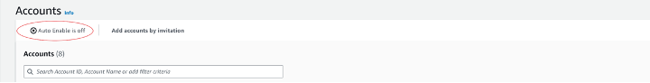
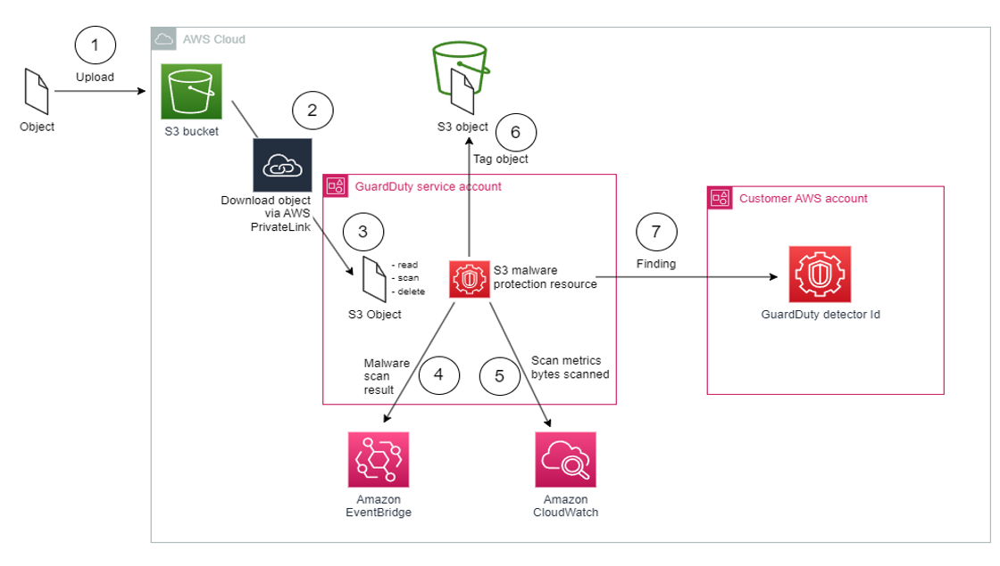

# Amazon GuardDuty

## Introduction

Welcome to the Amazon GuardDuty Best Practices Guide. The purpose of this guide is to provide prescriptive guidance for leveraging Amazon GuardDuty for continuous monitoring of your AWS accounts and resources. Publishing this guidance via GitHub will allow for quick iterations to enable timely recommendations that include service enhancements, as well as, the feedback of the user community. This guide is designed to provide value whether you are deploying GuardDuty for the first time in a single account, or looking for ways to optimize GuardDuty in an existing multi-account deployment.

## How to use this guide

This guide is geared towards security practitioners who are responsible for monitoring and remediation of threats and malicious activity within AWS accounts (and resources). The best practices are organized into three categories for easier consumption. Each category includes a set of corresponding best practices that begin with a brief overview, followed by detailed steps for implementing the guidance. The topics do not need to be read in a particular order:

* [Deploying GuardDuty](#deploying-guardduty)
    * [Single account deployment](#single-account-deployment)
    * [Multi-account deployment](#multi-account-deployment)
      * [Enablement of a delegated administrator](#enablement-of-a-delegated-administrator)
      * [Configuring auto-enable preferences for organization](#configuring-auto-enable-preferences-for-organization)
      * [Add accounts as members to your organization](#add-accounts-as-members-to-your-organization)
    * [GuardDuty protection plans](#guardduty-protection-plans)
      * [Enabling S3 malware protection](#S3-Malware-Protection)
      * [Runtime Monitoring](#runtime-monitoring-deployment-for-ec2)
        * [Enabling runtime monitoring for EC2](#runtime-monitoring-deployment-for-ec2)
        * [Enabling runtime monitoring for ECS](#runtime-monitoring-deployment-for-ecs)
        * [Enabling runtime monitoring for EKS](#runtime-monitoring-deployment-for-eks) 
* [Operationalizing GuardDuty findings](#operationalize-guardduty-findings)
    * [Filtering findings](#filtering-findings)
    * [Reducing potential noise](#reducing-potential-noise)
    * [Automated notification for high priority findings](#automated-notification-for-high-priority-findings)
    * [Automated remediation for common finding types](#automated-remediation-for-common-finding-types)
* [Cost optimization](#cost-optimization)
    * [CloudTrail and/or S3 data event utilization is high](#cloudtrail-andor-s3-data-event-utilization-is-high)
    * [VPC Flow Logs](#vpc-flow-logs)
    * [DNS Query Logs](#dns-query-logs)
    * [Other considerations](#other-considerations)
* [Troubleshooting](#troubleshooting)
* [Resources](#resources)

## What is Amazon GuardDuty?

GuardDuty is an intelligent threat detection service that continuously monitors your AWS accounts, Amazon Elastic Compute Cloud (Amazon EC2) instances, AWS Lambda functions, Amazon Elastic Kubernetes Service (Amazon EKS) clusters, Amazon Elastic Container Service (Amazon ECS), Amazon Aurora login activity, and data stored in Amazon Simple Storage Service (Amazon S3) for malicious activity. If potential malicious activity, such as anomalous behavior, credential exfiltration, or command and control infrastructure (C2) communication is detected, GuardDuty generates detailed security findings that can be used for security visibility and assisting in remediation. Additionally, using the Amazon GuardDuty Malware Protection feature helps to detect malicious files on Amazon Elastic Block Store (Amazon EBS) volumes attached to Amazon EC2 instance and container workloads.

GuardDuty monitors [Foundational data sources](https://docs.aws.amazon.com/guardduty/latest/ug/guardduty_data-sources.html) such as AWS CloudTrail event logs, AWS CloudTrail management events, Amazon VPC Flow Logs, and DNS logs. Enablement of the Foundational data sources is not required. Amazon GuardDuty pulls independent streams of data directly from those services.

In addition to the foundational data sources, GuardDuty can use additional data from other AWS services in your AWS environment to monitor and provide analysis for potential security threats. Those services include:

* [Amazon EKS](https://docs.aws.amazon.com/guardduty/latest/ug/kubernetes-protection.html) – GuardDuty monitors EKS Audit Logs and operating system-level events via the GuardDuty security agent.
* [AWS Lambda](https://docs.aws.amazon.com/guardduty/latest/ug/lambda-protection.html) – GuardDuty monitors network activity logs, including VPC Flow Logs for suspicious network traffic.
* [Amazon EC2 and Containers](https://docs.aws.amazon.com/guardduty/latest/ug/malware-protection.html) – GuardDuty monitors its findings for indicators of malware presence on attached Amazon Elastic Block Store (Amazon EBS) volumes, e.g. bitcoin mining activity.
* [Amazon Aurora](https://docs.aws.amazon.com/guardduty/latest/ug/rds-protection.html) – GuardDuty monitors and profiles relational database service login activity for potential threats.
* [Amazon S3](https://docs.aws.amazon.com/guardduty/latest/ug/s3-protection.html) – GuardDuty monitors AWS CloudTrail S3 data events to identify potential threats in your Amazon S3 resources. AWS CloudTrail S3 management events are monitored by default after GuardDuty is enabled.
* [Runtime Monitoring](https://docs.aws.amazon.com/guardduty/latest/ug/runtime-monitoring.html) - Runtime Monitoring observes and analyzes operating system-level, networking, and file events to help you detect potential threats in specific AWS workloads in your environment.
* [S3 Malware Protection](https://docs.aws.amazon.com/guardduty/latest/ug/gdu-malware-protection-s3.html) - Malware Protection for S3 helps you detect potential presence of malware by scanning newly uploaded objects to your selected Amazon Simple Storage Service (Amazon S3) bucket. When an S3 object or a new version of an existing S3 object gets uploaded to your selected bucket, GuardDuty automatically starts a malware scan. It is important to note that S3 malware protection is not intended to be deployed across your entire S3 estate. S3 Malware protection is purpose built to provide a cost effective solution that will scan objects that are uploaded to untrusted buckets. For example, in a scenario where you have third parties sending you documents or files and you need to ensure there is no malware before processing them in an application.

## What are the benefits of enabling GuardDuty?

GuardDuty is designed to operate completely independently from your resources and have no performance or availability impact to your workloads. The service is fully managed with integrated threat intelligence, machine learning (ML) anomaly detection, and malware scanning. GuardDuty delivers detailed and actionable alerts that are designed to be integrated with existing event management and workflow systems. There are no upfront costs and you pay only for the events analyzed, with no infrastructure to manage or threat intelligence feed subscriptions required.

## Deploying GuardDuty

### Single account deployment

The minimum requirements for enabling GuardDuty as a standalone account or as a GuardDuty administrator with AWS Organizations are covered below.

The first step to using GuardDuty is to enable it in your account. Once enabled, GuardDuty will immediately begin to monitor for security threats in the current Region. For a standalone account:

1. Open the GuardDuty console at: https://console.aws.amazon.com/guardduty/
2. Choose Get Started.

*Figure 1: GuardDuty landing page*
3. Choose Enable GuardDuty.

*Figure 2: GuardDuty enablement*

Once these steps are complete GuardDuty will begin collecting log data and monitoring the environment for malicious or suspicious activity.

#### S3 Malware Protection single account deployment

Although we recommend using GuardDuty across all of your AWS environment S3 Malware protection can be enabled independently from the rest of GuardDuty on a single account. Refer to the documentation on [Get started with Malware Protection for S3 only](https://docs.aws.amazon.com/guardduty/latest/ug/malware-protection-s3-get-started-independent.html) to learn more.


*Figure 3: S3 Malware Protection only*

### Multi-account deployment

As prerequisites for this process, you must be in the same organization as all the accounts you want to manage, and have access to the AWS Organizations management account in order to delegate an administrator for GuardDuty within your organization. Additional permissions may be required to delegate an administrator, for more information see [Permissions required to designate a delegated administrator](https://docs.aws.amazon.com/guardduty/latest/ug/guardduty_organizations.html#organizations_permissions).

#### Enablement of a delegated administrator

1. Open the AWS Organizations console at https://console.aws.amazon.com/organizations/, using the management account.
2. Open the GuardDuty console at https://console.aws.amazon.com/guardduty/.

Is GuardDuty already enabled in your account?

* If GuardDuty is not already enabled, you can select Get Started and then designate a GuardDuty delegated administrator on the Welcome to GuardDuty page.
* If GuardDuty is enabled, you can designate a GuardDuty delegated administrator on the Settings page.

3. Enter the twelve-digit AWS account ID of the account that you want to designate as the GuardDuty delegated administrator for the organization and choose Delegate.


*Figure 4: GuardDuty auto-enable off*

#### Configuring auto-enable preferences for organization

1. Open the GuardDuty console at https://console.aws.amazon.com/guardduty/.
2. In the navigation pane, choose Accounts.
3. The Accounts page provides configuration options to the GuardDuty administrator to Auto-enable GuardDuty and the optional protection plans on behalf of the member accounts that belong to the organization. You can find this option next to Add accounts by invitation.

This support is available to configure GuardDuty and all the supported optional protection plans in your AWS Region. You can select one of the following configuration options for GuardDuty on behalf of your member accounts:

* Enable for all accounts – Select to enable the corresponding option for all the member accounts in an organization automatically. This includes new accounts that join the organization and those accounts that may have been suspended or removed from the organization.
* Auto-enable for new accounts – Select to enable GuardDuty for new member accounts automatically when they join your organization.
* Do not enable – Select to prevent enabling the corresponding option for any account in your organization. In this case, the GuardDuty administrator will manage each account individually.


*Figure 5: GuardDuty auto-enable preferences*

4. Choose Save Changes

#### Add accounts as members to your organization

This procedure covers adding members accounts to a GuardDuty delegated administrator account through AWS Organizations. To learn more about associating members in GuardDuty, see [Managing multiple accounts in Amazon GuardDuty AWS service integrations with GuardDuty](https://docs.aws.amazon.com/guardduty/latest/ug/guardduty_accounts.html).

1. Log in to the delegated administrator account
2. Open the GuardDuty console at https://console.aws.amazon.com/guardduty/.
3. In the navigation panel, choose Accounts.
The accounts table displays all of the accounts that are added either Via Organizations or By invitation.
4. Select one or multiple account IDs that you want to add as members. Thses account IDs must have Type as Via Organizations.
5. You can select the down arrow of the Status column to sort the accounts by the Not a member status and then choose each account that does not have GuardDuty enable in the current Region.
6. Choose Confirm to add the accounts as members. This action also enables GuardDuty for all of the selected accounts. The Status for the accounts will change to Enabled.
7. (Recommended) Repeat these steps in each AWS Region. This ensures that the delegated administrator can manage findings and other configurations for member accounts in all the Regions where you have GuardDuty enabled.

### GuardDuty protection plans

After enabling GuardDuty in your account(s), choosing additional protection types is highly recommended. GuardDuty protection plans are [additional features](https://docs.aws.amazon.com/guardduty/latest/ug/guardduty-features-activation-model.html) that add focused threat detection for Amazon EKS, Amazon S3, Amazon Aurora, Amazon EC2, Amazon ECS, and AWS Lambda. To learn more about the benefits of what each GuardDuty protection provides, refer to the protection section of the [Amazon GuardDuty User Guide](https://docs.aws.amazon.com/guardduty/latest/ug/what-is-guardduty.html).

#### S3 Malware Protection

You can enable S3 Malware protection through the console, CLI, API, or through infrastructure as code such as [CloudFormation](https://docs.aws.amazon.com/AWSCloudFormation/latest/UserGuide/aws-resource-guardduty-malwareprotectionplan.html) or [Terraform](https://registry.terraform.io/providers/hashicorp/aws/latest/docs/resources/guardduty_malware_protection_plan). Keep in mind that you enable this specifically for a bucket at a time and not across a entire account or accounts. Refer to the [deployment documentation](https://docs.aws.amazon.com/guardduty/latest/ug/enable-malware-protection-s3-bucket.html) for the exact steps but we have placed images below for you to get an idea of what the deployment looks like.

Before deployment you need to ensure that a role exists that gives GuardDuty access to scan S3 objects in the bucket, including the ability to allow KMS key action, and that the bucket is not explicitly denying access to this role. For more information on creating this role and support encryption mechanisms look at the [prerequisite documentation](https://docs.aws.amazon.com/guardduty/latest/ug/malware-protection-s3-iam-policy-prerequisite.html) and the [quota documentation](https://docs.aws.amazon.com/guardduty/latest/ug/malware-protection-s3-quotas-guardduty.html).

When deploying you will need to determine if you want GuardDuty to tag objects based on if there was malware found (NO_THREATS_FOUND, THREATS_FOUND, UNSUPPORTED, ACCESS_DENIED, or FAILED). This tagging always you to create automated workflows depending on the tag. We give an example of this in the [S3 Malware automation workflow](#s3-malware-protection-automation-workflow) section.


*Figure 7: S3 Malware Protection console*


*Figure 8: S3 Malware Protection configuration*


#### Runtime Monitoring

For GuardDuty runtime monitoring protections including GuardDuty runtime monitoring for EKS, EC2, and ECS you have the ability to further scope what resources you want coverage for and how you would like to deploy the runtime agent. We recommend allowing GuardDuty to deploy runtime monitoring which will deploy a VPC endpoint and agent for EC2, ECS, and EKS using a an agent, sidecar, or EKS managed add-on, respectively. This will ensure coverage across your current resources but also apply to new resources that are created in the future. This agent if built on [EBPF technology](https://ebpf.io/what-is-ebpf/). Using the GuardDuty automation saves manual effort needed to address new resource coverage across your organization. However if you can choose to you can manage this configuration yourself.

If choose to allow GuardDuty to deploy the needed resources to cover both current and future VPC endpoints and agents needed to provide runtime monitoring in your environment you can further scope which resources the runtime monitoring applies to by using inclusion or exclusion tags. For example, if you have a handful of EKS clusters that you don't want to monitor, than it would be more efficient to use an exclusion tag rather than the opposite scenario where you only want to apply monitoring to a few resources where you would want to use inclusion tags. The GuardDuty documentation provides [use case examples and specific tags](https://docs.aws.amazon.com/guardduty/latest/ug/runtime-monitoring-configuration.html) needed to implement this functionality.

When configuring GuardDuty runtime monitoring it is important to understand the [prequisites](https://docs.aws.amazon.com/guardduty/latest/ug/runtime-monitoring-prerequisites.html) for runtime monitoring. This will give you information on supported OS's, Kernel version, CPU and Memory limits for the GuardDuty agent and more. After deployment ensure you [assess your coverage](https://docs.aws.amazon.com/guardduty/latest/ug/runtime-monitoring-assessing-coverage.html) of the runtime monitoring deployment to address any issues.

#### Runtime Monitoring Deployment for EC2
This deployment guide assumes the following:

* EC2 instances are running on supported Amazon Machine Images (AMIs), instance types, and operating systems.
* Foundational GuardDuty coverage is already enabled for your AWS Organization.

For more detailed information on the prerequisites, refer [here](https://docs.aws.amazon.com/guardduty/latest/ug/prereq-runtime-monitoring-ec2-support.html).

By following the steps outlined in this guide, you will learn how to leverage GuardDuty Runtime Monitoring to enhance the security posture of your EC2 instances, enabling real-time threat detection and response capabilities within your AWS environment.

**Configure AWS Systems Manager (SSM) Default Host Management**

The Amazon EC2 instances for which you want GuardDuty to monitor runtime events must be AWS Systems Manager (SSM) managed. With Quick Setup, a capability of AWS Systems Manager, you can activate Default Host Management Configuration for all accounts and Regions that have been added to your organization in AWS Organizations. This ensures that SSM Agent is kept up to date on all Amazon Elastic Compute Cloud (EC2) instances in the organization, and that they can connect to Systems Manager.

1. Visit the [AWS Systems Manager console](https://console.aws.amazon.com/systems-manager/) in the Organization management account.
2. In the left-hand navigation pane, choose **Quick Setup**.
3. Under “Default Host Management Configuration”, select “Create”.
4. Leave the options as default, and select “Create”.

---
**Assuming the AWS Systems Manager (SSM) Agent is already running on the EC2 instance when you configured Default Host Management, you may need to wait up to 30 minutes for the agent to connect with Systems Manager and the EC2 instance to appear in Fleet Manager as a managed instance. At that point, Systems Manager will install the Amazon GuardDuty Runtime Monitoring SSM Plugin on the instance.**

---


**Validate SSM Host Management**
Remember, it normally takes 30 minutes for hosts to show in SSM after enabling Default Host Management. 

5. Visit the [AWS Systems Manager console](https://console.aws.amazon.com/systems-manager/), in the left-hand navigation pane, under the **Node Management** section, choose **Fleet Manager**.
6. Confirm that you can see your EC2 instances in Fleet Manager. Alternatively, you can use [AWS Resource Explorer](https://docs.aws.amazon.com/systems-manager/latest/userguide/Resource-explorer-quick-setup.html) to search and discover resources in your AWS account or across an entire AWS organization. 

---
**If you do not see your EC2 instances in Fleet Manager after 30 minutes of enabling Default Host Management, refer to the SSM Agent Troubleshooting section at the bottom of this page.**

---

**Enabling GuardDuty Runtime Monitoring for EC2**

7. Visit the [Amazon GuardDuty console](https://console.aws.amazon.com/guardduty/) in your GuardDuty delegated administrator account.
8. In the left hand navigation pane, under the **Protection plans** section, choose **Runtime Monitoring**.
9. Under **Runtime Monitoring configuration**, click **Enable**. Click **Confirm** when prompted.
10. Under **Automated agent configuration**, click **Enable** for all accounts (recommended).
11. Toggle to the tab **Runtime coverage** and then open the tab, **EC2 instance runtime coverage**. Within 5 minutes, EC2 instances will start to show a "Healthy" status. It may take up to 10 minutes for runtime monitoring to be "Healthy" on EC2 instances already meeting the prerequisite configuration.
12. Repeat steps 9-11 for all Regions enabled for your AWS Organization.


#### Runtime Monitoring Deployment for ECS
This deployment guide assumes the following:

* Foundational GuardDuty coverage is already enabled for your AWS Organization.
* You have access to the delegated GuardDuty administrator account.
* Fargate platform running on supported version (at least 1.4.0 or LATEST).
* EC2 container instances are running on supported ECS-AMIs, instance types, and operating systems.

For more information on the prerequisites for Fargate (ECS only) cluster, refer [here](https://docs.aws.amazon.com/guardduty/latest/ug/prereq-runtime-monitoring-ecs-support.html). 

For more information on the prerequisites for Amazon ECS running on Amazon EC2, refer [here](https://docs.aws.amazon.com/AmazonECS/latest/developerguide/ecs-guard-duty-configure-manual-guard-duty.html).

By following the steps outlined in this guide, you will learn how to leverage GuardDuty Runtime Monitoring to enhance the security posture of your ECS clusters, enabling real-time threat detection and response capabilities within your AWS environment. For more information on how Runtime Monitoring works with Fargate (Amazon ECS only), refer [here](https://docs.aws.amazon.com/guardduty/latest/ug/how-runtime-monitoring-works-ecs-fargate.html). 

1. Open the [**Runtime Monitoring**](https://us-east-1.console.aws.amazon.com/guardduty/home?region=us-east-1#/runtime-monitoring) page in Amazon GuardDuty in the delegated GuardDuty administrator account.
2. Under **Runtime Monitoring configuration**, click **Enable for all accounts**. Click **Save** when prompted. This will turn on GuardDuty ECS monitoring in all accounts.
3. Under **Automated agent configuration**, click **Enable for all accounts** for **AWS Fargate (ECS only**). GuardDuty deploys and manages the agent in your ECS clusters on AWS Fargate, on your behalf. 
4. Toggle to the tab **Runtime coverage** and then open the tab, **ECS clusters runtime coverage**. 

When you want GuardDuty to monitor tasks that are part of a service, it requires a new service deployment after you enable Runtime Monitoring. If the last deployment for a specific ECS service was started before you enabled Runtime Monitoring, you can either restart the service, or update the service by using `forceNewDeployment`.

For steps to update the service, see the following resources:
* [Updating an Amazon ECS service using the console](https://docs.aws.amazon.com/AmazonECS/latest/developerguide/update-service-console-v2.html) in the *Amazon Elastic Container Service Developer Guide*.
* [UpdateService](https://docs.aws.amazon.com/AmazonECS/latest/APIReference/API_UpdateService.html) in the *Amazon Elastic Container Service API Reference*.
* [update-service](https://awscli.amazonaws.com/v2/documentation/api/latest/reference/ecs/update-service.html) in the *AWS CLI Command Reference*.

#### Runtime Monitoring Deployment for EKS
This deployment guide assumes the following:

* Amazon EKS clusters are running on Amazon EC2 instances. GuardDuty does't support Amazon EKS clusters running on AWS Fargate.
* The Amazon EKS cluster must be running on a supported operating system and Kubernetes version.
* Foundational GuardDuty coverage is already enabled for your AWS Organization.
* You have access to the delegated GuardDuty administrator account.

For more detailed information on the prerequisites, refer [here](https://docs.aws.amazon.com/guardduty/latest/ug/prereq-runtime-monitoring-ec2-support.html).

By following the steps outlined in this guide, you will learn how to leverage GuardDuty Runtime Monitoring to enhance the security posture of your EKS clusters, enabling real-time threat detection and response capabilities within your AWS environment. For more information on how Runtime Monitoring works with Amazon EKS clusters, refer [here](https://docs.aws.amazon.com/guardduty/latest/ug/how-runtime-monitoring-works-eks.html#eksrunmon-approach-to-monitor-eks-clusters). 

In a multiple-account environments, only the delegated GuardDuty administrator account can enable or disable Automated agent configuration for the member accounts, and manage Automated agent for the EKS clusters belonging to the member accounts in their organization. The GuardDuty member accounts can't modify this configuration from their accounts. The delegated GuardDuty administrator account account manages their member accounts using AWS Organizations. For more information about multi-account environments, see [Managing multiple accounts](https://docs.aws.amazon.com/guardduty/latest/ug/guardduty_accounts.html).

1. Open the [**Runtime Monitoring**](https://us-east-1.console.aws.amazon.com/guardduty/home?region=us-east-1#/runtime-monitoring) page in Amazon GuardDuty.
2. Under **Runtime Monitoring configuration**, click **Enable for all accounts**. Click **Save** when prompted.
3. Under **Automated agent configuration**, click **Enable for all accounts** for **Amazon EKS**. GuardDuty deploys and manages the agent in your EKS clusters on AWS Fargate, on your behalf. 
4. Toggle to the tab **Runtime coverage** and then open the tab, **EKS clusters runtime coverage**. 


## Operationalize GuardDuty findings

After GuardDuty has been enabled in your account(s), GuardDuty will begin monitoring the [foundational data sources](https://docs.aws.amazon.com/guardduty/latest/ug/guardduty_data-sources.html) and analyzing features associated with optionally enabled resource protection types. A best practice recommendation after enabling GuardDuty is to leverage the 30-day trial (enabled per account) to understand the baseline of normal activity, derived by machine learning, for your accounts and resources. During the trial period GuardDuty will also use threat-based and rules-based intelligence to generate [findings](https://docs.aws.amazon.com/guardduty/latest/ug/guardduty_findings.html) in near-real time.

Potential security issues are presented as findings in the GuardDuty console. All GuardDuty findings are assigned a [severity level](https://docs.aws.amazon.com/guardduty/latest/ug/guardduty_findings.html#guardduty_findings-severity) (low, medium, high) and corresponding value (1.0 – 8.9) based on potential risks. Higher value findings indicate a greater security risk. The severity level assigned to a finding is provided to help you determine a response to a potential security issue that is highlighted by a finding.

*Figure 9: GuardDuty severity levels*

It is recommended to familiarize your team with the [GuardDuty Finding Types](https://docs.aws.amazon.com/guardduty/latest/ug/guardduty_finding-types-active.html). This will give you insights into what findings you might see in your account, the details associated with these findings, and potential [remediation actions](https://docs.aws.amazon.com/guardduty/latest/ug/guardduty_remediate.html). After you understand different GuardDuty findings we encourage customers to think through filtering, notifications, and potential automatic remediation which will cover in the next sections. It is also encouraged to begin writing [incident response playbooks](https://github.com/aws-samples/aws-incident-response-playbooks) for responding to GuardDuty findings in your environment. This will likely combine multiple steps below and also details not covered that might be specific to your environment and your teams.

### Filtering findings

If you are new to GuardDuty the easiest way to view/filter your findings is via the Summary tab. The Summary dashboard displays an aggregated view of the last 10,000 GuardDuty findings generated in the current AWS Region. You can choose to view the Last 2 days (default), Last 7 days or Last 30 days. This dashboard provides 6 widgets, 3 of which include filter capabilities to customize your view.

*Figure 10: GuardDuty summary page*

As the delegated administrator becomes more familiar with their organizations’ GuardDuty findings, an advanced filtering technique may be employed using the Findings tab.  The Findings tab exposes [80+ finding attributes](https://docs.aws.amazon.com/guardduty/latest/ug/guardduty_filter-findings.html#filter_criteria) that can match the criteria you specify or filter out any unmatched findings. A common filter technique is one that focuses on threats that have a high indication that 1. A resource has been compromised, for example looking at high severity findings 2. The type of finding indicates potential risks for unwanted billing charges, for example CryptoMining.

Surfacing Bitcoin mining is an example of one such finding filter that could be created. Bitcoin is a worldwide cryptocurrency and digital payment system that can be exchanged for other currencies, products, and services. Bitcoin is a reward for bitcoin-mining and is highly sought after by threat actors. To find out if any of your EC2 instances have been compromised for purposes of Bitcoin mining you can use this attribute and value pairing: Severity:High, Finding type:CryptoCurrency:EC2/BitcoinTool.B!DNS. Applying this filter will provide a view of any EC2 instances that are querying a domain name that is associated with Bitcoin or other cryptocurrency-related activity.

*Figure 11: GuardDuty finding page*

Note: Frequently used filters can be saved to reduce future efforts. To save the specified attributes and their values (filter criteria) as a filter, select Save. Enter the filter name and description, and then choose Done.

### Reducing potential noise

As accounts and workloads grow within an AWS Organization, it is possible there will be an increase in GuardDuty findings because of certain configurations. Some of the findings may be deemed low value or threats not intended to be acted upon. To make it easier to recognize security threats that are most impactful to your environment, enabling quick remediation actions, it is recommended to deploy suppression rules. A [suppression rule](https://docs.aws.amazon.com/guardduty/latest/ug/findings_suppression-rule.html) is a set of criteria, consisting of a filter attribute paired with a value, used to filter findings by automatically archiving new findings that match the specified criteria.

After creating a suppression rule, new findings that match the criteria defined in the rule are automatically archived as long as the suppression rule is in place. Existing filters can be used to create suppression rules. Suppression rules can be configured to suppress entire finding types, or define more granular filter criteria to suppress only specific instances of a particular finding type. Suppression rules can be edited at any time. It is recommended to suppress with as much granualarity as possible. This will help with reducing findings for only certain circumstances without losing total coverage of a finding type.

Suppressed findings are not sent to AWS Security Hub, Amazon S3, Amazon Detective, or Amazon CloudWatch, reducing finding noise level if you consume GuardDuty findings via Security Hub, a third-party SIEM, or other alerting and ticketing applications.

GuardDuty continues to generate findings even when they match suppression rules, however, those findings are automatically marked as archived. An archived finding is stored in GuardDuty for 90-days and can be viewed at any time during that period. You can view suppressed findings in the GuardDuty console by selecting Archived from the findings table, or through the GuardDuty API using the ListFindings API with a findingCriteria criterion of service.archived equal to true.

A common use case for a suppression rule is filtering out a known resource that scans EC2 instances. This resource may result in a finding type Recon:EC2/Portscan which for certain resources in your environment may be intended. For this scenario it is recommended to suppress associated findings using a combination of resource tagging and Finding Type.

### Automated notification for high priority findings

After creating suppression rule filters to allow for surfacing only the most impactful findings for your environment, the next recommended action is automating the notification of high priority findings. Amazon EventBridge is a serverless event bus that makes it easier to build event-driven applications at scale using events generated from AWS services. GuardDuty creates an event for Amazon EventBridge for newly generated findings. All findings are dynamic, meaning that, if GuardDuty detects new activity related to the same security issue it will update the original finding with the new information as a newly aggregated finding. Thus, creating a new event for EventBridge to potentially process. Delegated administrators can optionally change the frequency of publishing new findings to EventBridge in GuardDuty Settings under Findings export options. By default, EventBridge is updated every 6 hours but can be changed to 1 hour or 15 minutes intervals.

Every GuardDuty finding is assigned a finding ID. GuardDuty creates an EventBridge event for every finding with a unique finding ID.  By using Amazon EventBridge with GuardDuty, you can automate tasks to help you respond to security issues related to GuardDuty findings. One such task is sending notifications to a preferred notification channel. Commonly used notification channels are email and Enterprise messaging applications that support incoming messages via Webhook.

Another common scenario is to send GuardDuty findings to a ticketing system or SIEM solution for tracking and event correlation. It is recommended to leverage Security Hub as a central aggregation point in AWS for security findings before [sending these findings to a ticketing system or SIEM solution](https://docs.aws.amazon.com/securityhub/latest/partnerguide/prepare-receive-findings.html). You can also leverage EventBridge to send GuardDuty findings directly to a ticketing system or SIEM solution. Please refer to your solutions documentation for guidance on how to send information via EventBridge.

When leveraging email as a preferred notification channel, GuardDuty is integrated with Amazon Simple Notification Services (Amazon SNS) via EventBridge. Amazon Simple Notification Service (Amazon SNS) is a fully managed messaging service for both application-to-application (A2A) and application-to-person (A2P) communication. The notification workflow is as depicted in the image below.

*Figure 12: GuardDuty notification workflow*

All GuardDuty findings not matching a suppression rule are automatically delivered to the account event bus. There are only two configurations required to deploy email notification via Amazon SNS for unsuppressed findings:

1. Create and subscribe to a SNS topic
2. Create an EventBridge rule

SNS is the target service for EventBridge actions in this workflow. SNS only requires two steps: 1. Create a new Topic (choose type as Standard) and provide a topic Name, 2. Create a Subscription with Email as the protocol. Entering an email address under Endpoint and clicking Create subscription finalizes the steps required in the console. The last step is to click Confirm subscription within the email sent to the email address used for the endpoint.

*Figure 13: GuardDuty SNS email*


*Figure 14: SNS subscription confirmation*

The basis of EventBridge is to create [rules](https://docs.aws.amazon.com/eventbridge/latest/userguide/eb-rules.html) that route [events](https://docs.aws.amazon.com/eventbridge/latest/userguide/eb-events.html) to a [target](https://docs.aws.amazon.com/eventbridge/latest/userguide/eb-targets.html). In this example below, a rule with an event pattern is constructed. This results in the rule being ran when an event matches the defined pattern. This rule will look for EC2 instances that exhibit SSH brute force attack behavior with the added detail of the resource being leveraged as the threat actor.

With both the SNS topic/subscription in place, deploying this EventBridge rule will automatically send an email notification to the registered email address. It is recommended to use an email alias associated with a team when sending notifications of high severity findings.

*Figure 15: GuardDuty EventBridge rule*

Tip: For more detailed instructions on how to build an EventBridge rule for GuardDuty findings that target SNS for email notification with customization, refer to this [AWS Knowledge Center video](https://www.youtube.com/watch?v=HSon9kZ0mCw).

### Automated remediation for common finding types

*Stealth:S3/ServerAccessLoggingDisabled*
A common use case for automation with GuardDuty finding types is to address S3 and EC2 related findings as a result of misconfiguration (intentional or unintentional). For example, finding type Stealth:S3/ServerAccessLoggingDisabled informs you that S3 server access logging is disabled for a bucket within your AWS environment. If disabled, no web request logs are created for any attempts to access the identified S3 bucket, however, S3 management API calls to the bucket, such as [DeleteBucket](https://docs.aws.amazon.com/AmazonS3/latest/API/API_DeleteBucket.html), are still tracked. If S3 data event logging is enabled through CloudTrail for this bucket, web requests for objects within the bucket will still be tracked. This could be the result of a misconfiguration or part of an unauthorized user’s technique to evade detection.

Using the associated finding details, an administrator can learn about the AWS resources that were involved in the suspicious activity, when this activity took place, and additional information. After gathering the information, the administrator could pivot from the finding into the S3 bucket to re-enable Server Access Logging. Remediating this automatically would save the administrator time and allow for focused investigation into how a potential threat actor was able to perform the API call.

A common remediation approach decouples the GuardDuty detection from the automation action using an AWS Config Managed Rule to trigger on [s3-bucket-logging-enabled](https://docs.aws.amazon.com/config/latest/developerguide/s3-bucket-logging-enabled.html) configuration changes. Once triggered, AWS Config will immediately evaluate the S3 bucket and display a status of NON_COMPLIANT if logging is disabled. You can associate remediation actions with AWS Config rules and choose to execute them automatically to address non-compliant resources without manual intervention. In this scenario, the non-compliant s3-bucket-logging-enabled status will trigger the [Systems Manager Automation](https://docs.aws.amazon.com/systems-manager/latest/userguide/systems-manager-automation.html) document named [AWS-ConfigureS3BucketLogging](https://docs.aws.amazon.com/systems-manager-automation-runbooks/latest/userguide/automation-aws-configures3bucketlogging.html). By selecting Automatic remediation and AWS-ConfigureS3BucketLogging as your Remediation action detail when configuring your AWS Config rule Action, S3 server access logging will be re-enabled anytime a S3 bucket is non-compliant to the Config rule.


*Figure 16: GuardDuty finding automation*

*Backdoor:EC2/C&CActivity.B*
EC2 instances querying an IP address that is associated with a known command and control server is another common use case for automated remediation. This finding informs you that the listed instance within your AWS environment is querying an IP associated with a known command and control (C&C) server. The listed instance might be compromised. This type of finding has multiple steps towards remediations, that may include actions like performing a snapshot of the volume(s) before terminating the instance. This snapshot can provide information to a forensics team. However, the first step in remediating this finding is too isolate the instance.

The same event workflow described in the Automated Notifications section can be utilized to change the security group of the instance to stop inbound/outbound connections to the internet. An [AWS Lambda function](https://docs.aws.amazon.com/lambda/latest/dg/welcome.html) would be the target of an EventBridge rule set to match on Backdoor:EC2/C&CActivity.B. (An EventBridge can support multiple targets; a best practice for this scenario would also include an SNS topic target)
Here is an example Lambda function written Python to perform this task:

```Python
import boto3

ec2_client = boto3.client('ec2')

def lambda_handler(event, context):
    try:
        # Check if the event is triggered by GuardDuty finding
        if 'detail' in event and 'type' in event['detail'] and event['detail']['type'] == 'Backdoor:EC2/C&CActivity.B':
            # Extract relevant information from the GuardDuty finding
            instanceId = event['detail']['resource']['instanceDetails']['instanceId']
            SecurityGroupId = "sg-XXXXXXXXXXXX"  # Replace with the desired Security Group ID

            # Construct the modification command
            command = {
                'InstanceId': instanceId,
                'Groups': [SecurityGroupId]
            }

            # Send the command to modify the EC2 instance's security group
            ec2_client.modify_instance_attribute(**command)

            return 'Updated security group for instance: {}'.format(instanceId)
        else:
            return 'No action taken. Event is not a GuardDuty finding of type Backdoor:EC2/C&CActivity.B'
    except Exception as e:
        print('Error:', str(e))
        raise e
```

### S3 Malware Protection automation workflow

Giving GuardDuty the ability to add tags such as NO_THREATS_FOUND, THREATS_FOUND, UNSUPPORTED, ACCESS_DENIED, or FAILED based on the result of the malware scan gives you the ability to create automated workflows. For example, if you are allowing untrusted third parties to upload documents into S3 before you bring them into an application you can use GuardDuty S3 malware protection to scan these documents and then either move them into the application bucket or a quarantine bucket based on the tag given. As a primer we have included a picture below illustrating how GuardDuty S3 Malware Protection processes files and integrates with other AWS services.


*Figure 17: S3 Malware Protection automation workflow*

To achieve the example we described in the first paragraph we can use [Amazon EventBridge](https://aws.amazon.com/eventbridge/) and AWS Lambda to build out our automated solution based on the S3 object scan result getting published to your default event bus which is [configured by default](https://docs.aws.amazon.com/guardduty/latest/ug/monitor-with-eventbridge-s3-malware-protection.html) when S3 Malware Protection is configured in your aWS account. Then you can configure a Lambda function to process the file based on the object tag that was given by GuardDuty.

You can see an example EventBridge rule in the [GuardDuty documentation](https://docs.aws.amazon.com/guardduty/latest/ug/monitor-with-eventbridge-s3-malware-protection.html). From here you will need to configure a Lambda function to uses that EventBridge rule as a trigger and then moves the file based on your needs. Example Pyton code to do this is shown below. Keep in mind this is example code and should be altered to fit your use case.

```Python
#Script that evaluates messages about the scan status of S3 malware scanning and then moves the files to
#the appropriate bucket based on the status.


import boto3
import json
import os
import logging
from botocore.exceptions import ClientError
logger = logging.getLogger()
logger.setLevel(logging.INFO)

gdclient = boto3.client('guardduty')
s3client = boto3.client('s3')

infected_bucket = os.environ['INFECTED_BUCKET']
clean_bucket = os.environ['CLEAN_BUCKET']

def lambda_handler(event, context):
    logger.info('Event Data')
    logger.info(event)

    scan_status = event["detail"]["scanStatus"]
    bucket_name = event["detail"]["s3ObjectDetails"]["bucketName"]
    object_key = event["detail"]["s3ObjectDetails"]["objectKey"]
    scan_result = event["detail"]["scanResultDetails"]["scanResultStatus"]
    
    if scan_status == 'COMPLETED':
        logger.info("Scan status is COMPLETED")

        if scan_result == 'THREATS_FOUND':
            logger.info("Threats found in the object")
            logger.info("Moving file to infected bucket: %s",infected_bucket)
            
            copy_source = {'Bucket': bucket_name, 'Key': object_key}
            
            try:
                response = s3client.copy_object(
                    Bucket=infected_bucket,
                    CopySource=copy_source,
                    Key=object_key
                )
                
                print(response)
                
                logger.info("File copy successful")
                logger.info("Deleting object from source bucket")
                response = s3client.delete_object(
                    Bucket=bucket_name,
                    Key=object_key)
                    
                print (response)
                    
            except ClientError:
                raise

        elif scan_result == 'NO_THREATS_FOUND':
            logger.info("No threats found in the object")
            logger.info("Moving file to clean bucket: %s",clean_bucket)
            
            copy_source = {'Bucket': bucket_name, 'Key': object_key}
            
            try:
                response = s3client.copy_object(
                    Bucket=clean_bucket,
                    CopySource=copy_source,
                    Key=object_key
                )
                
                print(response)
                
                logger.info("File copy successful")
                logger.info("Deleting object from source bucket")
                response = s3client.delete_object(
                    Bucket=bucket_name,
                    Key=object_key)
                    
                print (response)
                
            except ClientError:
                raise
            

        else:
            logger.info("scan_result is: %s not moving", scan_result)
```

## Cost Optimization

When GuardDuty is enabled for the first time in an account, that account will be automatically provided with a 30-day free trial period for each region. Subsequently each feature also has a free trial too. For more information on pricing and free trials please refer to the [GuardDuty pricing page](https://aws.amazon.com/guardduty/pricing/). This is an important first step in understanding monthly GuardDuty costs in a given account. During the trial an administrator can view cost estimations based on Account ID, Data source, Feature and S3 buckets. If enabling GuardDuty in an AWS organization, the administrator can monitor cost metrics for all of the member accounts.

AWS account administrators may be required to investigate charges related to GuardDuty if an increase in costs occurs. Some common reason for increased monthly GuardDuty costs includes:

### CloudTrail and/or S3 data event utilization is high

An increase in CloudTrail charges could be attributed to multiple reasons depending on whether they originate from management event costs or data event costs. Although there are many ways to query AWS log data we will show examples using Athena to look at exact API calls and the services associated with them. To understand CloudTrail API volumes using Athena:

1. If not already present, create a new CloudTrail trail [2]. Choose to account for both management and data events here. If the trail is not needed beyond the scope of this analysis, the trail may be deleted or disable logging data to it.
2. Create an Athena table [3] that pulls from the S3 location where the CloudTrail logs are stored
3. Once this table has been created, navigate to the Athena console to perform a query over a 24-hour period to understand the top event names and event sources that contributed to the spike

```SQL
SELECT eventName,count(eventName) AS eventVolume,eventSource
FROM your_athena_tablename
WHERE eventtime between '2021-01-24' AND '2021-01-25'
GROUP BY eventName, eventSource
ORDER BY eventVolume DESC limit 10;
```

4. Upon gaining an understanding of which events and event sources were responsible for a bulk of the activity, it may be suitable to alter the SQL query to view data by hour, user-agent, IP or principal. This will help to identify the exact source of the increased API calls

*[2] Creating a trail - <https://docs.aws.amazon.com/awscloudtrail/latest/userguide/cloudtrail-create-a-trail-using-the-console-first-time.html>*
*[3] Querying AWS CloudTrail Logs - Using the CloudTrail Console to Create an Athena Table for CloudTrail Logs  - <https://docs.aws.amazon.com/athena/latest/ug/cloudtrail-logs.html#create-cloudtrail-table-ct>*

### VPC Flow Logs

An increase in VPC Flow log related costs can be a result of GuardDuty analyzing flow logs to identify malicious, unauthorized, or unexpected behavior in AWS accounts and workloads. This data source is charged per Gigabyte (GB) per month and is offered with tiered volume discounts.
To understand VPC Flow log volumes using Athena, perform the steps:

1. Ensure that Flow logs are being published to S3 [4]
2. Create an Athena table [5] that pulls from the S3 location where the flow logs are stored [5]
3. Once this table has been created, navigate to the Athena console to perform a query over a 24 period to understand the top flows that contributed to the spike

```SQL
SELECT COUNT(version) AS Flows,
        SUM(numpackets) AS Packetcount,
         sourceaddress
FROM vpc_flow_logs
WHERE date = DATE('2021-01-31')
GROUP BY  sourceaddress
ORDER BY  Flows DESC LIMIT 10;
```

4. Alternatively, if VPC flow logs are setup with CloudWatch logs as their final destination, the customer may use CloudWatch insights to extract the top-talker information [6]. Here are some sample queries that can be called directly from the insights console [7]

*[4] Publishing flow logs to Amazon S3 - <https://docs.aws.amazon.com/vpc/latest/userguide/flow-logs-s3.html>*
*[5] Querying Amazon VPC Flow Logs - <https://docs.aws.amazon.com/athena/latest/ug/vpc-flow-logs.html>*
*[6] Analyzing Log Data with CloudWatch Logs Insights - <https://docs.aws.amazon.com/AmazonCloudWatch/latest/logs/AnalyzingLogData.html>*
*[7] Sample Queries - <https://docs.aws.amazon.com/AmazonCloudWatch/latest/logs/CWL_QuerySyntax-examples.html>*

Querying flow logs using Amazon Athena - <https://docs.aws.amazon.com/vpc/latest/userguide/flow-logs-athena.html>*

### DNS Query logs

An increase in DNS log related costs can be a result of GuardDuty analyzing DNS requests and responses to identify malicious, unauthorized, or unexpected behavior in AWS accounts and workloads. This data source is charged per Gigabyte (GB) per month and is offered with tiered volume discounts.
Much like VPC Flow logs, an account may have their DNS flow logs exported to CloudWatch or S3 [8]. Top-talkers for DNS can be queried in CloudTrail Insights:

1. Navigate to Route53 and verify that 'Query Logging' is enabled
2. Check the logger configuration and confirm that a 'CloudWatch Logs log group' is the destination type
3. Verify that one or more VPC’s are present under 'VPC’s that queries are logged for'
4. Click the log group shown as a part of the 'Destination ARN'
5. Click Insights on the left tab
6. Select the log-group where the queries are being logged
7. Select a time range and supply a query to understand which instance and hostnames have the most outbound queries

```SQL
stats count(*) as numRequests by srcids.instance,query_name
    | sort numRequests desc
    | limit 10
```

Alternatively, if the DNS logs are being routed to a S3 bucket, Athena can be used to create a table that pulls this data from S3 [9]. Steps to perform:

1. Navigate to Route53 and verify that 'Query Logging' is enabled
2. Check the logger configuration and confirm that 'S3 bucket' is the destination type
3. Verify that one or more VPC’s are present under 'VPC’s that queries are logged for'
4. Navigate to Athena and create a table using the following command

```SQL
CREATE EXTERNAL TABLE IF NOT EXISTS default.route53query (
  `version` float,
  `account_id` string,
  `region` string,
  `vpc_id` string,
  `query_timestamp` string,
  `query_name` string,
  `query_type` string,
  `query_class` string,
  `rcode` string,
  `answers` array<string>,
  `srcaddr` string,
  `srcport` int,
  `transport` string,
  `srcids` string,
  `isMatchedDomain` string
)
ROW FORMAT SERDE 'org.openx.data.jsonserde.JsonSerDe'
WITH SERDEPROPERTIES (
  'serialization.format' = '1'
) LOCATION 's3://<bucket name>/AWSLogs/<account number>/vpcdnsquerylogs/'
TBLPROPERTIES ('has_encrypted_data'='false');
```

5. Query data using the following query

```SQL
SELECT count(version) AS numRequests,
         srcids,
        query_name
FROM route53query
WHERE query_timestamp
    BETWEEN '2021-01-14'
        AND '2021-01-15'
GROUP BY  srcids,query_name
ORDER BY  numRequests DESC limit 10;
```

*[8] Log your VPC DNS queries with Route 53 Resolver Query Logs - https://aws.amazon.com/blogs/aws/log-your-vpc-dns-queries-with-route-53-resolver-query-logs/*
*[9] How to automatically parse Route 53 Resolver query logs - https://aws.amazon.com/blogs/networking-and-content-delivery/how-to-automatically-parse-route-53-resolver-query-logs/*
--

### Other considerations

* Sometimes an understanding of a surge in the costs occurring the start of the month for CloudTrail S3 and VPC/DNS flow log analysis is required. This is most likely due to the pricing structure of these data sources. GuardDuty offers tiered discounts and becomes inexpensive to use as more events are analyzed through the course of the month. See pricing page (<https://aws.amazon.com/guardduty/pricing/>) for a better understanding.
* GuardDuty costs can increase due to configuration changes on an account including deployment of new applications or the use of a third-party security/scanning tool that makes repeated ‘Describe’ API calls. These might cause an increase in CloudTrail events, and/or traffic (VPC & DNS logs).
* It is not recommended to rely on the CloudTrail event history's CSV download to compare event volumes because it may have event filters or incomplete data. This feature is more suited for smaller CSV downloads.
* CloudTrail insights can be useful to augment these investigations. CloudTrail Insights continuously monitors CloudTrail write management events, and uses mathematical models to determine the normal levels of API and service event activity for an account.
* If a new member account is added or if a GuardDuty service is resumed after being disabled for an extended time those costs may also be perceived as surges.
* S3 protection can be disabled but GuardDuty does not allow you to remove any additional data sources. However, if DNS is disabled at the VPC level, those logs are not processed by GuardDuty. Accounts will not be charged or have DNS-based results.
* GuardDuty is optimized for security value and will not charge customers for processing some low-risk events that would otherwise be delivered to a customer's CloudTrail. Therefore, the event counts may not exactly match.
* If Runtime Monitoring is enabled for your account, you will not be charged for analysis of VPC Flow Logs from instances where the GuardDuty agent is deployed and active.

## Troubleshooting
### Troubleshooting AWS Systems Manager (SSM) Agent Issues
There are several issues that might cause the SSM agent to work improperly. You can use the Systems Manager Automation runbook to automatically troubleshoot an EC2 instance that SSM is unable to manage

* Open [this link](https://us-east-1.console.aws.amazon.com/systems-manager/automation/execute/AWSSupport-TroubleshootManagedInstance?region=us-east-1) to configure the[](https://us-east-1.console.aws.amazon.com/systems-manager/automation/execute/AWSSupport-TroubleshootManagedInstance?region=us-east-1)Systems Manager Automation runbook.
* Navigate to the AWS Region for the EC2 instance you want to troubleshoot.
* Under the **Input parameters**, change the dropdown from "Show managed instances only" to "Show all instances".
* Select the EC2 instance you want to troubleshoot.
* Leave all the other settings, and at the bottom of the page, click **Execute**. This process normally takes up to 5 minutes to complete.
* Once the automation document has as an Overall status of Success, expand the Outputs section.
* Review the outputs to see the specific problem with your SSM configuration.

### Troubleshooting Shared VPCs Issues
EC2 instances in your AWS account might run in subnets from a [shared VPC](https://docs.aws.amazon.com/vpc/latest/userguide/vpc-sharing.html) owned by another AWS account. In this scenario the GuardDuty console might show an error message “VPC Endpoint Creation Failed” for EC2 instances listed in the Runtime Monitoring section.
* Enable GuardDuty EC2 Runtime Monitoring in the AWS account that owns the shared VPC.
* Ensure there is at least one EC2 instance running in the shared VPC and in the AWS account that owns the VPC.

### Troubleshooting Custom Recursive DNS Architecture Issues

Another reason that you might see the error message “VPC Endpoint Creation Failed” can be caused by using a custom DNS server instead of the default [Amazon Route 53 Resolver](https://docs.aws.amazon.com/Route53/latest/DeveloperGuide/resolver.html), often referred to as the “.2 resolver”. Since GuardDuty relies on the Route 53 resolver to know where how to find the GuardDuty VPC endpoint this can cause an issue with the VPC endpoint configuration. Although we recommend using the AWS managed DNS resolver for recursive DNS, some customers decide to use a custom DNS resolver. To fix this issue while still using your custom DNS server you have two options:

1. The best option is to leave the “Enable DNS resolution” box checked so that GuardDuty can use the Route 53 resolver to find the GuardDuty VPC endpoint. The DHCP option set that you have configured for your custom DNS server will have set the resolver.conf file for your hosts so that they use your custom DNS server. The GuardDuty agent will use the .2 resolver option. To enable the Route 53 DNS Resolver in your VPC follow the steps below.

    * Visit the [Amazon VPC Console](https://console.aws.amazon.com/vpc/). 
    * Select the VPC that you want to change the DNS settings.
    * In the top right corner use the **Actions** drop down and click edit **VPC settings**


    


    * Once you’re on the VPC settings page make sure the **Enable DNS resolution** box is checked. This will enable Route53 DNS Resolver for this VPC.
    

    


    * If you have configured a custom DNS server because you want to limit traffic that can use the Route 53 resolver then you can use Route 53 DNS firewall to allow resolution to the GuardDuty endpoint and nothing else. To do this you will need to make two rules in your Route 53 DNS firewall policy. The rule with the top priority will allow resolution to “guardduty-data.<region>.amazonaws.com”. The rule that will follow in rule evaluation priority should deny “*.”. The combination of these rules will allow resolution to the GuardDuty endpoint through the Route 53 resolver, while denying any other resolution.
---
**GuardDuty is also monitoring this Route53 resolver traffic for suspicious activity.**

---


2. If you’re using a [centralized endpoint VPC architecture](https://aws.amazon.com/blogs/networking-and-content-delivery/centralize-access-using-vpc-interface-endpoints/) you can create an entry in your custom DNS server to resolve the GuardDuty endpoint. To do this you will need to check the endpoint specific to your central VPC that the GuardDuty agent is trying to resolve and then add that as your DNS entry.

### Troubleshooting ECS Task Execution Role Errors
If you see issue type **Agent exited** and additional information error message that says **CannotPullContainerError** this is likely caused by insufficient IAM permissions for the ECS Fargate task execution role. Fargate tasks **must** use a task execution role. This role grants the tasks permission to retrieve, update, and manage the GuardDuty security agent on your behalf. To fix this follow the steps below.

* Visit the [AWS IAM console](https://console.aws.amazon.com/iam/).
* In the left-hand navigation pane, choose **Roles**, and then choose **Create role**.
* For **Trusted entity type**, choose **AWS service**.
* For **Service or use case**, choose **Elastic Container Service**, and then choose the **Elastic Container Service Task** use case.
* Choose **Next**.
* In the **Add permissions** section, search for **AmazonECSTaskExecutionRolePolicy**, then select the policy.
* Choose **Next**.
* For **Role name**, enter **ecsTaskExecutionRole**.
* Review the role, and then choose **Create role**.


---
**Runtime Monitoring supports managing the security agent for your Amazon ECS clusters (AWS Fargate) only through GuardDuty. There is no support for managing the security agent manually on Amazon ECS clusters.**

---

## Resources

### Workshops

* [Activation Days](https://awsactivationdays.splashthat.com/)
* [Amazon GuardDuty workshop](https://catalog.workshops.aws/guardduty)
* [Amazon Detective workshop](https://catalog.workshops.aws/detective)
* [Container security workshop](https://catalog.workshops.aws/containersecurity)

### Videos

* [Introducing GuardDuty ECS Runtime Monitoring](https://www.youtube.com/watch?v=nuMOaQctNgE&list=PLB3flZ7qA4xu__uOEfpc-coXm04swNWva&index=4&pp=iAQB)
* [Amazon GuardDuty EKS Protection Overview](https://www.youtube.com/watch?v=mxNyxJ_Mo8k&list=PLhr1KZpdzukfJzNDd8eCJH_TGg24ZTwP6&index=14&pp=iAQB)
* [Amazon GuardDuty S3 Protection Overview](https://www.youtube.com/watch?v=yNUdNH31BUw&list=PLhr1KZpdzukfJzNDd8eCJH_TGg24ZTwP6&index=15&pp=iAQB)
* [Amazon GuardDuty findings summary view](https://www.youtube.com/watch?v=4rR37ZBJWdI&list=PLhr1KZpdzukfJzNDd8eCJH_TGg24ZTwP6&index=30&pp=iAQB)
* [Enable GuardDuty Lambda Protection to monitor your Lambda execution environment](https://www.youtube.com/watch?v=dpc6jvtHB0g&list=PLhr1KZpdzukfJzNDd8eCJH_TGg24ZTwP6&index=38&pp=iAQB)
* [GuardDuty EKS Runtime Monitoring](https://www.youtube.com/watch?v=t3rVVilJWEk&list=PLhr1KZpdzukfJzNDd8eCJH_TGg24ZTwP6&index=40&pp=iAQB)
* [Amazon GuardDuty RDS Protection](https://www.youtube.com/watch?v=f_CFtrAG8Nw&list=PLhr1KZpdzukfJzNDd8eCJH_TGg24ZTwP6&index=41&pp=iAQB)
* [S3 Malware Protection overview](https://youtu.be/uweeumMAif4)

### Blogs

* [Measure cluster performance impact of Amazon GuardDuty EKS Agent](https://aws.amazon.com/blogs/containers/measure-cluster-performance-impact-of-amazon-guardduty-eks-agent/)
* [How AWS threat intelligence deters threat actors](https://aws.amazon.com/blogs/security/how-aws-threat-intelligence-deters-threat-actors/)
* [Improve your security investigations with Detective finding groups visualizations](https://aws.amazon.com/blogs/security/improve-your-security-investigations-with-detective-finding-groups-visualizations/)
* [Three ways to accelerate incident response in the cloud: insights from re:Inforce 2023](https://aws.amazon.com/blogs/security/three-ways-to-accelerate-incident-response-in-the-cloud-insights-from-reinforce-2023/)
* [Detect threats to your data stored in RDS databases by using GuardDuty](https://aws.amazon.com/blogs/security/detect-threats-to-your-data-stored-in-rds-databases-by-using-guardduty/)
* [Reduce triage time for security investigations with Amazon Detective visualizations and export data](https://aws.amazon.com/blogs/security/reduce-triage-time-for-security-investigations-with-detective-visualizations-and-export-data/)
* [How to use Amazon GuardDuty and AWS WAF v2 to automatically block suspicious hosts](https://aws.amazon.com/blogs/security/how-to-use-amazon-guardduty-and-aws-waf-v2-to-automatically-block-suspicious-hosts/)
* [How to improve security incident investigations using Amazon Detective finding groups](https://aws.amazon.com/blogs/security/how-to-improve-security-incident-investigations-using-amazon-detective-finding-groups/)
* [Automatically block suspicious DNS activity with Amazon GuardDuty and Route 53 Resolver DNS Firewall](https://aws.amazon.com/blogs/security/automatically-block-suspicious-dns-activity-with-amazon-guardduty-and-route-53-resolver-dns-firewall/)
* [How to use new Amazon GuardDuty EKS Protection findings](https://aws.amazon.com/blogs/security/how-to-use-new-amazon-guardduty-eks-protection-findings/)