# Amazon Inspector

## Introduction

Welcome to the Amazon Inspector Best Practices Guide. The purpose of this guide is to provide prescriptive guidance for leveraging Amazon Inspector for continuous monitoring of software vulnerabilities and unintended network exposure in AWS workloads such as Amazon EC2, AWS Lambda functions, and Amazon ECR. Publishing this guidance via GitHub will allow for quick iterations to enable timely recommendations that include service enhancements, as well as, the feedback of the user community. This guide is designed to provide value whether you are deploying Inspector for the first time in a single account, or looking for ways to optimize Inspector in an existing multi-account deployment.

## How to use this guide

This guide is geared towards security practitioners who are responsible for monitoring and remediation of security events, abnormal activity, and vulnerabilities within AWS accounts (and resources). The best practices are organized into different categories for easier consumption. Each category includes a set of corresponding best practices that begin with a brief overview, followed by detailed steps for implementing the guidance. The topics do not need to be read in a particular order:

* [What is Amazon Inspector](#what-is-amazon-inspector)
* [What are the benefits of enabling Amazon Inspector](#what-are-the-benefits-of-enabling-amazon-inspector)
* [Getting started](#getting-started)
    * [EC2 scanning approaches and the Inspector VM Scanner](#ec2-scanning-approaches-and-the-inspector-vm-scanner)
    * [Deployment considerations](#deployment-considerations)
    * [Region considerations](#region-considerations)
* [Implementation](#implementation)
    * [Stand-alone account enablement](#stand-alone-account-enablement)
    * [Multi-Account organization enablement](#multi-account-organization-enablement)
* [Coverage](#coverage)
    * [Amazon EC2 scanning](#amazon-ec2-scanning)
    * [Windows scanning](#windows-scanning)
    * [ECR scanning](#ecr-scanning)
    * [Lambda scanning](#lambda-scanning)
    * [CI/CD](#cicd-scanning)
    * [Code Security](#code-security)
    * [CIS Scans](#cis-scans)
* [Operationalizing](#operationalizing)
    * [Actioning Inspector findings](#actioning-inspector-findings)
    * [Software bill of materials (SBOM) configuration](#software-bill-of-materials-sbom-configuration)
    * [Suppression rules](#suppression-rules)
    * [Vulnerability database search](#vulnerability-database-search)
* [Cost considerations](#cost-considerations)
* [Troubleshooting](#troubleshooting)
* [Resources](#resources)

## What is Amazon Inspector?

Amazon Inspector is a vulnerability management service that continuously monitors your AWS workloads for software vulnerabilities and unintended network exposure. Amazon Inspector automatically discovers and scans running Amazon EC2 instances, container images in Amazon Elastic Container Registry (Amazon ECR), and AWS Lambda functions.

## What are the benefits of enabling Amazon Inspector?

Amazon Inspector continuously discovers resources across your AWS Organization. After you deploy Amazon Inspector it will identify and automatically assess your resources for vulnerabilities. Keeping a continuous state of your environment Amazon Inspector understands when resources no longer exist or more importantly when new resources are deployed so that it can begin assessing these resources for vulnerabilities without requiring any manual configurations.  

Continuous assessment of your resources including Amazon EC2 instances, images in ECR, and Lambda functions for vulnerabilities so that you are always up to date on the current state of your resources, even as new vulnerabilities are discovered. Amazon Inspector continues to assess your environment throughout the lifecycle of your resources by automatically monitoring resources in response to changes that could introduce a new vulnerability, such as: installing a new package in an Amazon EC2 instance, installing a patch, and when a new common vulnerabilities and exposures (CVE) that impacts the resource is published. Unlike traditional security scanning software, Amazon Inspector has minimal impact on the performance of your fleet.

Amazon Inspector creates a finding when it discovers a software vulnerability, code vulnerability, or network configuration issues. A finding describes the vulnerability, identifies the affected resource, rates the severity of the vulnerability, and provides remediation guidance. Amazon Inspector also provide an Amazon Inspector score that provides context into the severity of a vulnerability. Visit the Inspector documentation to learn more about the [Amazon Inspector score](https://docs.aws.amazon.com/inspector/latest/user/findings-understanding-score.html#findings-understanding-inspector-score). You can analyze findings using the Amazon Inspector console, or view and process your findings through other AWS services.

Integration with Organizations enables you to quickly deploy and see vulnerability posture across all of their accounts from a single location and verify that Amazon inspector is automatically enabled and performing assessments as new accounts are added to the organization. This reduces the amount of effort needs to maintain a ready state of vulnerability management across your AWS environment.

## Getting started

In this section we will cover what you need to consider before activating Amazon Inspector in your AWS Organization. 

### EC2 Scanning Approaches and the Inspector VM Scanner

How Inspector assesses your EC2 instances changed, and if you deployed Inspector before the [Amazon Inspector VM Scanner](https://docs.aws.amazon.com/inspector/latest/user/inspector-vm-scanner.html) was released, this section is worth reading rather than skimming.

**We recommend the Amazon Inspector VM Scanner over the legacy Amazon Inspector SSM plugin.** When you enable Enhanced EC2 Scanning on an account, the VM Scanner replaces the SSM plugin. The VM Scanner uses the inventory collection capability of the [Amazon Inspector SBOM Generator](https://docs.aws.amazon.com/inspector/latest/user/sbom-generator.html) to build a software bill of materials and submits it through the Inspector Telemetry channel. That gives you the same scan mechanism across every supported operating system, which produces more consistent findings and uses fewer compute resources than the plugin. The improvement is most noticeable on Windows, where the VM Scanner avoids the per-query timeouts that could cause the SSM plugin to report findings inconsistently. If you have ever had a Windows fleet where Inspector results seemed to vary between scans without the underlying packages changing, this is the likely explanation and the fix.

You have two ways to deploy it:

* **Automatic installation (recommended)** – Enable Enhanced EC2 Scanning in the Inspector console and Inspector uses Systems Manager to install and manage the VM Scanner on your instances. No per-instance work.
* **Manual installation** – Install the VM Scanner with standard package managers (RPM, DEB, APK, MSI, PKG). This path does not require SSM at all.

That second option matters more than it looks. The VM Scanner does not have a hard dependency on Systems Manager, so instances that cannot be SSM managed are no longer stuck with reduced coverage. It also enables a separation of duties that comes up constantly in large organizations: the security team enables scanning at the account level, while instance administrators keep control over installation and configuration on individual hosts. If SSM ownership has been the blocker to getting Inspector coverage on a particular fleet, this is the way around it.

For instances where you want no agent at all, [agentless scanning](https://docs.aws.amazon.com/inspector/latest/user/scanning-ec2.html#agentless), also called hybrid scanning mode, remains available. The tradeoff is scan cadence and depth. Agent-based scanning is event driven, so installing a new package triggers an evaluation, while agentless scanning evaluates instances once per 24 hours.

One important exception to plan around: **CIS scans remain on the Inspector SSM plugin** and there is currently no intention to move them to the VM Scanner. If you run CIS benchmark scans, you still need SSM managed instances for that purpose even after moving vulnerability scanning to the VM Scanner.

Systems Manager continues to earn its place regardless. Beyond Inspector, SSM gives you scheduled patching, maintenance windows, patch compliance reporting, a mechanism to run automation across a fleet, and secure instance access without exposing port 22 or 3389. [AmazonSSMManagedInstanceCore](https://docs.aws.amazon.com/aws-managed-policy/latest/reference/AmazonSSMManagedInstanceCore.html) is the recommended instance profile policy and covers what Inspector EC2 scanning needs. The SSM Agent ships preinstalled on [some AMIs](https://docs.aws.amazon.com/systems-manager/latest/userguide/ami-preinstalled-agent.html), though you may still need to activate it and grant SSM permission to manage the instance. Inspector also uses a managed policy named `AmazonInspector2ManagedTelemetryPolicy` to collect and transmit package inventory for scanning.

If you plan to use the automatic installation path, or you want SSM for the reasons above, see the section below on enabling default host management.

#### Enabling Default Host Management in AWS Systems Manager (SSM)

Hybrid scanning in Amazon Inspector includes agent-based scanning and agentless scanning. By default, Amazon Inspector uses these scan methods on all eligible Amazon EC2 instances. Agent-based scanning uses the SSM agent to collect software inventory. Agentless scanning uses Amazon EBS snapshots to collect software inventory. By default, the SSM agent is already installed in Amazon EC2 instances based on Amazon Machine Images. However, you might need to activate the SSM agent manually in some cases. For more information, see [Working with the SSM agent](https://docs.aws.amazon.com/systems-manager/latest/userguide/ssm-agent.html) in the AWS Systems Manager User Guide. To manage EC2 instances automatically with Systems Manager, use the Default Host Management Configuration setting.

For assessing network reachability of Amazon EC2 instances, vulnerability scanning of container images, or vulnerability scanning of Lambda functions, no agents are necessary. 

1. Sign in to your organization management account for AWS Organizations.
2. Navigate to Systems Manager and open the [Quick Setup](https://console.aws.amazon.com/systems-manager/quick-setup) page.
3. Click **Create** for **Default Host Management Configuration**.
4. Make sure the box is selected for **Enable automatic updates of the SSM Agent every two weeks**.
5. Click **Create**. You will see a banner stating, "Your Default Host Management Configuration Quick Setup is being updated.". It normally takes up to 30 minutes for the agent to connect with Systems Manager and the EC2 instance to appear in the Systems Manager Inventory as a managed instance (required for Inspector to perform agent-based scanning). 
6. You may continue to the next steps without waiting 30 minutes for the Host Management Configuration to complete. 

### Deployment Considerations

To deploy Inspector across your AWS Organization you need to enable it in the AWS management account and the security tooling account whether this is done in the Console, CLI, or API. If you are not familiar with the concept of the security tooling account it is recommended to familiarize yourself with the [recommended account structure](https://docs.aws.amazon.com/prescriptive-guidance/latest/security-reference-architecture/organizations.html) in the Security Reference Architecture. To summarize, this is a dedicated account in your AWS Organization that is used as the delegated administrator account for native AWS security services such as Amazon Inspector, Amazon GuardDuty, AWS Security Hub, and Amazon Detective.

### Region Considerations

Amazon Inspector is a regional service. This means that to use Amazon Inspector you need to enable it in every region that you would like to have vulnerability monitoring capabilities in. You can enable Inspector across all accounts and regions using the AWS CLI script on [GitHub](https://github.com/aws-samples/inspector2-enablement-with-cli) or you can do this by toggling between regions in the console.

A question that is often asked is “Should I use a security service in a region that my company is not actively using?”. Although there is not a straightforward answer to this question as there are many factors that might influence your answer such as risk appetite, budget, and compensating controls, among others. There are some things to keep in mind when making this decision.

1. Inspector is a service that you only pay for what you use. So, if you have a region that has minimal use you can have Inspector on giving visibility into your vulnerability landscape without incurring disproportionate cost associated with the resources being used in a region.
2. If you have a compensating control associated with none used regions such as a service control policy that blocks all use in this region. It is still recommended to have a detective control to validate detection of this compensating control being changed at any point in the future.

This decision is ultimately one that your company needs to make based on your own circumstances, but a rule of thumb in security is that more visibility before an investigation is better as it often hard, if not impossible to obtain after the fact.

## Implementation

In this section we will cover the minimum requirements for enabling Inspector in a stand-alone account and in a multi-account organization.

Before following the per-service steps below, note that if you have adopted the unified [AWS Security Hub](../security-hub/index.md), you can enable and configure Inspector centrally from the Security Hub console using configuration policies and deployments, alongside GuardDuty and Security Hub CSPM. For organizations enabling several security services at once, that is usually the faster path. Inspector is then billed through the Security Hub essentials plan. The per-service steps below remain correct for accounts not managed through Security Hub, or when you need Inspector-specific settings that Security Hub configuration policies do not yet cover.

### Stand-alone account enablement

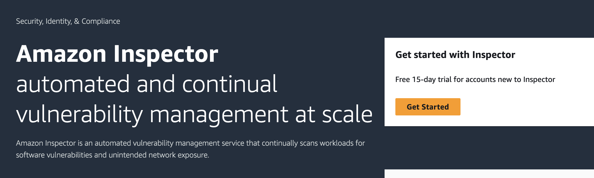
*Figure 1: Inspector getting started page*

The first step is to navigate to the Inspector console. Once you are in the Inspector console you should see a landing page with a getting started button. Click on “Get started”.

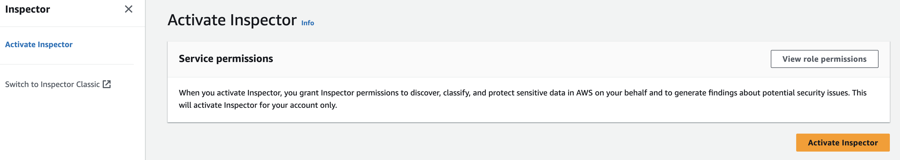
*Figure 2: Activate Inspector page*

After clicking on “Get started” you will be brought to the Inspector enablement page. Review the Service role permissions so that you have an understanding of the permissions Inspector needs in order to provide its features and functions then select the yellow box labeled “Activate Inspector” to enable Inspector.

Once these two steps are done Inspector will be enabled in this account. It is important to refer to sections below to make sure you have enabled all relevant features of Inspector.

### Multi-Account organization enablement

When you implement Inspector for the first time in your AWS Organization as stated above you will set the delegated administrator in your organization management account in each region that you want to use Inspector. Keep in mind you will need to use the same account in all regions.

*Figure 3: Inspector getting started page*

The first step is to navigate to the Inspector console in your organizations management account. Once you are on the Inspector console you will see a landing page with a getting started button. Click on “Get started”.

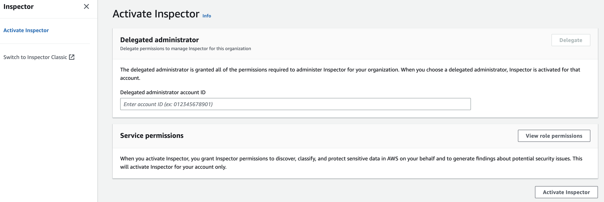
*Figure 4: Delegated admin assignment page*

After clicking on “Get started” you will be brought to the Inspector enablement page. Next you will need to enter the account ID for the account you want to designate as the Inspector delegated administrator account. Once you have entered the account ID select “Delegate”. At this point you will switch to the Delegated administrator to finish configuring Amazon Inspector across your AWS Organization.

*Figure 5: Inspector getting started page*

Once you are in the Inspector delegated administrator account you will again see a landing page with a getting started button. Click on “Get started”. Once this is complete Inspector will be enabled. There are a few more deployment considerations that we will cover.

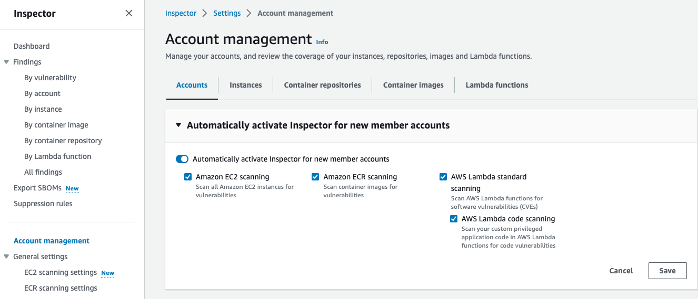
*Figure 6: Inspector account management page*

Next you will need to make sure you activate scanning for all current accounts and all scanning types including Amazon EC2 scanning, Amazon ECR Scanning, AWS Lambda standard scanning, and AWS Lambda code scanning. It is also highly recommended to “Automatically activate Inspector for new member accounts”. This helps you understand that you don’t have a gap in vulnerability coverage when new accounts are created in your organization. This will also automate the process of onboarding new accounts and automatically aggregate all findings to your delegated administrator account reducing manual tasks and saving time.

* Sign in to the Delegated Admin account for Inspector.
* Open the Inspector console.
* From the [Account management](https://console.aws.amazon.com/inspector/v2/home?#/settings/account-management/accounts) page, under **Automatically activate Inspector for new member accounts** toggle on the option to **Automatically activate Inspector for new member accounts**. 
* Make sure that all of the options are selected and click **Save**. You should see a banner with the message "You have successfully updated the auto-activate scan settings for your organization.".
* Scroll down to where accounts are listed under **Organization**. Depending on how many accounts you have, you should click the gear icon on the right to view 50 accounts per page. 
* Per page, select all accounts. Click the **Activate** dropdown menu, select all of the options, and click **Submit**. 
* Within minutes, resources will start being scanned and you will see any generated findings on the [Findings](https://console.aws.amazon.com/inspector/v2/home?#/findings/all) page.

Alternatively, you may enable Inspector across all accounts and regions using CLI. Check out the [enablement script on Github](https://github.com/aws-samples/inspector2-enablement-with-cli).

For organizations that want declarative governance over Inspector enablement, [AWS Organizations now supports Inspector policies](https://docs.aws.amazon.com/organizations/latest/userguide/orgs_manage_policies_inspector.html). An Inspector policy is a JSON document attached to your organization root or OUs that specifies which scan types should be enabled. When the policy is in place, all in-scope accounts are automatically aligned with your policy definition, and member accounts cannot disable policy-managed scanning via the Inspector API. This is stronger than the auto-enable toggle above, because it provides a guardrail that prevents drift ensuring consistent vulnerability scanning coverage as your organization scales.

## Coverage

In this section we will cover the enablement of different features to configure Inspector across all supported resources in your environment.

### Amazon EC2 Scanning

After enabling Inspector in your Organization there are two more Amazon EC2 scanning related configurations that you need to address.

Inspector deep inspection gives Inspector the ability to detect package vulnerabilities for application programming language packages in addition to operating system packages. It is included with Amazon EC2 scanning at no additional cost, so there is no pricing reason to leave it off. If you are unsure whether it is active for an account, you do not have to guess from the console alone. The account management view shows deep inspection status per account, and you can confirm it programmatically through the Inspector API, which reports the enablement status of each scan type. With Enhanced EC2 Scanning and the VM Scanner, deep inspection and custom paths are supported on Linux, Windows, and macOS. If you last configured this when deep inspection was Linux only, revisit it, because your Windows and macOS instances can now be covered the same way. New accounts enabling Inspector have deep inspection enabled by default. To confirm it on an account enabled earlier, check the account management page in the Inspector console for accounts showing deep inspection deactivated, as pictured below. For full details refer to the [Inspector deep inspection documentation](https://docs.aws.amazon.com/inspector/latest/user/scanning-ec2.html#deep-inspection).

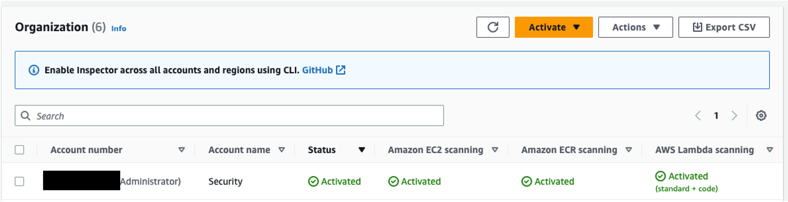
*Figure 7: Inspector EC2 deep scan activated*

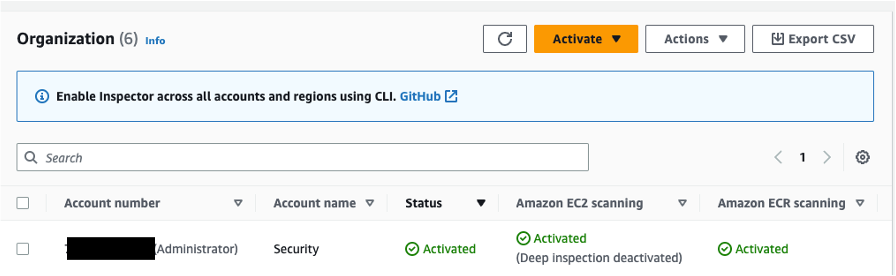
*Figure 8: Inspector EC2 deep scan deactivated*

Deep inspection scans a default set of locations that varies by operating system. On Linux those defaults include paths such as `/usr/lib`, `/usr/lib64`, `/usr/local/lib`, and `/usr/local/lib64`. Because the defaults differ per operating system, and because the VM Scanner does not necessarily scan the same locations the older SSM plugin did, check the [custom paths documentation](https://docs.aws.amazon.com/inspector/latest/user/scanning-resources.html#deep-inspection-paths) for the current default list rather than assuming.

Individual accounts can add up to 5 custom paths, and the delegated administrator can add 5 more that apply across the organization, for a total of up to 10 custom paths per account.

Custom paths are where this configuration succeeds or fails, and it is the single most common cause of a false sense of coverage. **Software installed outside the default locations is scanned only if you add its path.** A database or application server installed on a non-system drive such as `D:\` on Windows, or an application deployed under `/opt` or a home directory on Linux, produces no findings at all unless you have added that path. There is no warning that this is happening. Inspector reports the instance as scanned, and the dashboard looks the same as it would for a genuinely clean host.

Two practical recommendations follow. First, inventory where your teams actually install application software before you finalize custom paths, rather than configuring the paths you expect them to use. Second, if you are activating or reactivating Inspector, or you have migrated from the SSM plugin to the VM Scanner, review your custom paths before you trust the results.

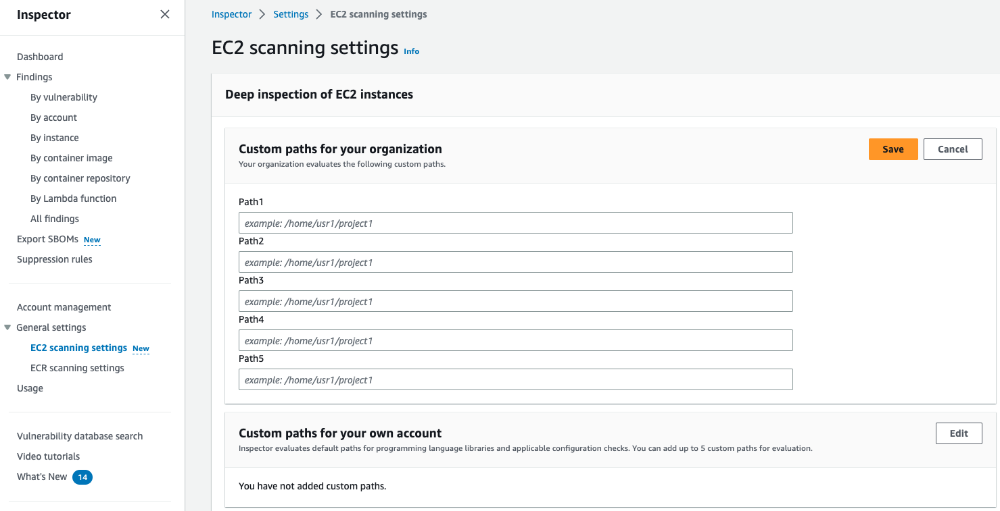
*Figure 9: Inspector EC2 scan settings*

### Windows Scanning

Amazon Inspector automatically discovers all supported Windows instances and includes them in scanning without any extra actions.

Windows is the clearest case for moving to the Inspector VM Scanner. Under the legacy SSM plugin, Windows instances are scanned at discovery and then at regular intervals, with a default of every 6 hours that you can adjust using the `aws ssm update-association` CLI command. That path also carried the per-query timeout behavior that could make Windows findings inconsistent between scans. The VM Scanner uses the same scan mechanism on Windows as it does on Linux and macOS, which is why it produces more consistent Windows results and why we recommend it. Deep inspection custom paths are also supported on Windows with Enhanced EC2 Scanning, which matters given how often Windows application software lands on a non-system drive.

For the current scan interval behavior and configuration steps for whichever path you are on, refer to the [Inspector Windows scanning documentation](https://docs.aws.amazon.com/inspector/latest/user/scanning-ec2.html#windows-scanning).

### ECR Scanning

When you first activate ECR scanning, and your repository is configured for continuous scanning, Amazon Inspector detects all eligible images that you have pushed within 30 days, or pulled within the last 90 days. Amazon Inspector continues to monitor images as long as they were pushed or pulled within the last 90 days (by default), or within the ECR rescan duration you configure. You might choose to stop scanning instances after a defined period of time because they are no longer used for applications in your environment or based on other compensating controls you might have in place. You can configure Inspector to re-scan based on either image push date or image pull date. For example, if you select 60 days for push date, and 180 days for pull date configurations, Amazon Inspector will continue to monitor images if they were pushed in the last 60 days or if they have been pulled at least once in the last 180 days. We recommend understanding the application deployment patterns at your organization when deciding the re-scan duration settings. For example if you build images often you might want shorter scan durations. Inspector supports 3-day and 7-day settings in addition to the longer durations, for both image re-scan duration and image push date duration, which suits teams that rebuild and redeploy on a short cycle and do not need Inspector tracking images that are already out of service. Also, if you utilize [ECR lifecycle policies](https://docs.aws.amazon.com/AmazonECR/latest/userguide/LifecyclePolicies.html) this might affect how long images exist in ECR, so align the two settings rather than configuring them independently. For detailed instructions please refer to the [ECR automated re-scan duration documentation](https://docs.aws.amazon.com/inspector/latest/user/scanning_resources_configure_duration_setting_ecr.html).

Inspector also [maps ECR images to running containers](https://aws.amazon.com/blogs/aws/amazon-inspector-enhances-container-security-by-mapping-amazon-ecr-images-to-running-containers/) in your Amazon ECS and EKS environments. This is critical for prioritization, because a vulnerable image sitting unused in a registry is a different risk than one actively running in production. The mapping lets security teams focus remediation efforts on vulnerabilities that are actually exposed in running workloads rather than treating every ECR finding equally.

One cost behavior to be aware of if you build multi-architecture images. A multi-architecture image is a manifest list pointing at one image per platform, for example one for `linux/amd64` and one for `linux/arm64`. Inspector scans each platform image, so a two-platform image counts as two scanned images rather than one for pricing purposes. This is easy to miss because a single `docker buildx` push produces what looks like one image, and teams adopting multi-arch builds sometimes see ECR scan costs rise without an obvious change in how many images they think they pushed. It is not a reason to avoid multi-arch builds, just something to factor into an ECR cost estimate and to keep in mind when you compare a bill against your image count.

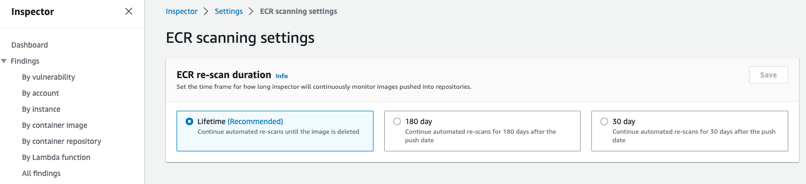
*Figure 10: Inspector ECR scan settings*

### Lambda Scanning

Lambda scanning has two different functionalities. The first is the ability to scan Lambda functions for software vulnerabilities in programming languages and packages. The second is the ability to scan your custom privileged application code for code vulnerabilities. Under account management make sure that these are both activated to provide full Inspector visibility. If you see any accounts with Lambda scanning or code scanning deactivated refer to the [Lambda scanning documentation for detailed steps on activation](https://docs.aws.amazon.com/inspector/latest/user/scanning-lambda.html).

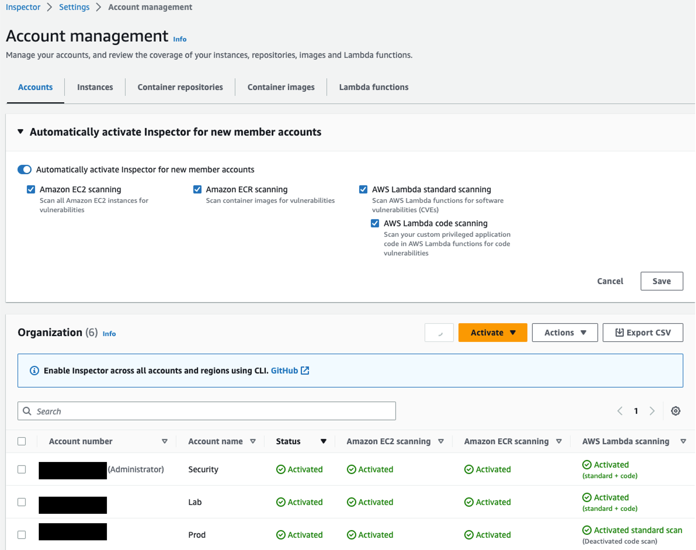
*Figure 11: Inspector Account management page*

### CI/CD Scanning

You can integrate Amazon Inspector directly in CI/CD tools such as Jenkins. For [Jenkins](https://docs.aws.amazon.com/inspector/latest/user/cicd-jenkins.html) and [TeamCity](https://docs.aws.amazon.com/inspector/latest/user/cicd-teamcity.html) tools Inspector has dedicated plugins that can be installed so you can add vulnerability scanning directly into these pipelines. These plugins can be used as a pass or fail mechanism based on finding severities.

For AWS-native pipelines, [AWS CodePipeline offers a built-in InspectorScan action](https://docs.aws.amazon.com/inspector/latest/user/cicd-inspector-codepipeline-actions.html) that scans source code repositories and container images as part of your pipeline execution. This is the simplest path for teams already using CodePipeline, since no plugin installation is required and scans can be configured to pass or fail pipeline executions based on vulnerability count and severity thresholds.

If Amazon Inspector does not provide plugins for your CI/CD solution, you can create your own [custom CI/CD integration](https://docs.aws.amazon.com/inspector/latest/user/scanning-cicd.html) using a combination of the Amazon Inspector SBOM Generator and the Amazon Inspector Scan API.

### Code Security

Amazon Inspector [Code Security](https://aws.amazon.com/about-aws/whats-new/2025/06/amazon-inspector-code-security-shift-security-development) extends vulnerability detection into your source code repositories by integrating directly with source code management (SCM) tools such as GitHub and GitLab. Code Security provides three capabilities: static application security testing (SAST) for analyzing application source code, software composition analysis (SCA) for evaluating third-party dependencies, and infrastructure as code (IaC) scanning for validating infrastructure definitions such as CloudFormation and Terraform templates.

This is a significant shift-left capability. Rather than discovering vulnerabilities only after code is deployed to EC2, Lambda, or ECR, Code Security catches issues during development. For organizations that already use Inspector for runtime scanning, enabling Code Security closes the gap between when a vulnerability is introduced (at commit time) and when it would otherwise be detected (at deployment or post-deployment). Connect your SCM repositories through the Inspector console to get started.

For teams that need deeper context-aware analysis beyond standard SAST, SCA, and IaC scanning, [AWS Security Agent](https://docs.aws.amazon.com/securityagent/latest/userguide/what-is.html) goes further. It is a separate service rather than an Inspector feature, currently in preview and now offered as part of AWS Continuum. The Security Agent ingests your existing documents, including architecture diagrams, threat models, and design documents, alongside your source code, then performs contextually aware testing that chains vulnerabilities together and validates exploits to reduce false positives. It builds threat models, delivers penetration testing on demand, and provides automated code remediation. It has also added full repository code scanning, so it can review an entire codebase rather than only changed files.

The distinction to hold onto is what question each tool answers. Inspector Code Security answers whether your code contains known vulnerabilities, which is what you want running on every commit as a gate. AWS Security Agent answers which of those risks are genuinely exploitable given this application's architecture and threat landscape, and how to fix them. They complement each other rather than compete, and because the Security Agent is in preview, treat Inspector Code Security as the capability you build your pipeline around today.

### CIS Scans

In addition to traditional vulnerability scans many customers also want to run scans to assess adherence to CIS Benchmarks. If you're not familiar, CIS Benchmarks from the Center for Internet Security (CIS) are a set of globally recognized and consensus-driven best practices to help security practitioners implement and manage their cybersecurity defenses. Developed with a global community of security experts, the guidelines help organizations proactively safeguard against emerging risks. Companies implement the CIS Benchmark guidelines to limit configuration-based security vulnerabilities in their digital assets. Just like you can check your AWS environment against CIS Benchmarks using AWS Security Hub CSPM, Inspector allows you to run CIS Benchmarks against your operating systems in AWS.

Start by familiarizing yourself with the necessary [requirements for running CIS scans](https://docs.aws.amazon.com/inspector/latest/user/scanning-cis.html#cis-requirements) such as the need for deep scanning to be enabled and an SSM agent to be present on an instance.

Next, we recommend you think about your desired outcome for CIS scans before configuration. For example, you should answer questions before configuration such as what we have listed below, which is not an exhaustive list. This will help you get the most out of your CIS scans without creating extra findings that don't help with your overall security goals.

* How often do we build images? Do we need to run frequent scans or run one time scans based on frequent image build?
* What images / environments need to run level 1 vs level 2 scans?
* Will you push out CIS scans across your AWS Organization from the delegated administrator account or will individual account owners be responsible for creating them at the account level.
* Do you have a tag in place that you can use to target instances when configuring your scan configuration settings?

## Operationalizing

### Actioning Inspector Findings

Many organizations have a well-established vulnerability management program, but if you don’t or you are unsure of what you do now works with Amazon Inspector we want to highlight a few important themes that you should be thinking about.

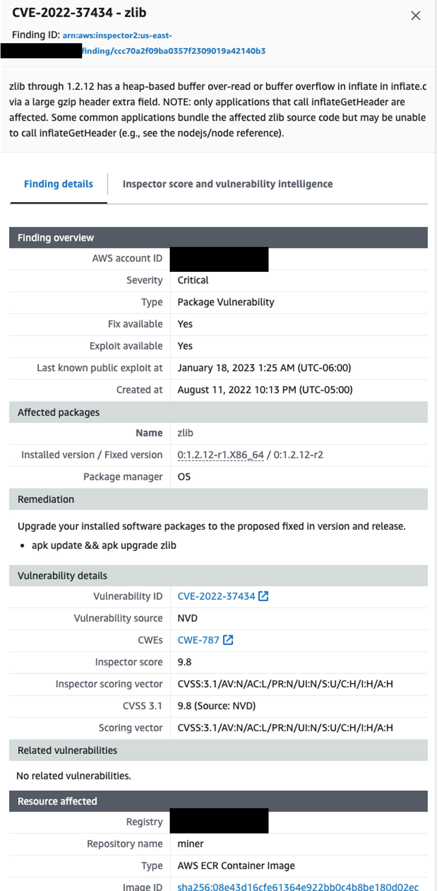
*Figure 12: Inspector finding details*

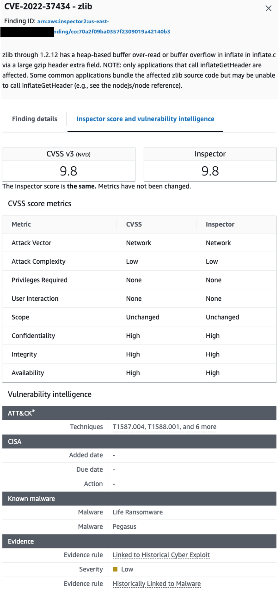
*Figure 13: Inspector score example*

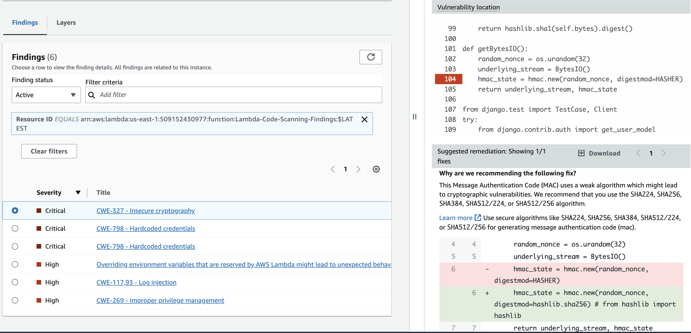
*Figure 14: Generative AI powered code remediation recommendation*

Inspector vulnerability findings give great detail into the resource affected, the CVE, and generative AI powered code remediation suggestions giving security and application teams the context needed to more quickly remediate vulnerabilities in your AWS environment. Inspector findings are also stateful. This means that if you update a package that contained a vulnerability Inspector will see the package change, initiate an assessment, and if the vulnerability was in fact remediated then close the finding. This understanding is important for determining how you will handle Inspector findings.

If you build metrics or SLA reporting on Inspector data, understand how the finding timestamps behave, because they do not all mean "when was this last checked." `lastScannedAt` is the most recent time Inspector scanned the resource. `updatedAt` and `lastObservedAt` advance only when the finding's metadata actually changes, not on every scan. So a finding that has been Active and unchanged for two weeks can have a recent `lastScannedAt` but an older `updatedAt`, and that is expected rather than a sign scanning stopped. A finding stays Active as long as the vulnerability is still detected. If you are computing time-to-remediate, anchor it on the finding's creation and closure, and use `lastScannedAt` to confirm coverage is current, rather than reading `updatedAt` as a scan time.

One retention detail affects how you report on remediation. Inspector removes findings after 3 days when the associated resource is deleted, terminated, or otherwise no longer eligible for scanning, and findings closed for other reasons are removed after 30 days. In an environment with short-lived instances or frequently rebuilt containers, that means Inspector is not a durable record of what was vulnerable and for how long. If your vulnerability management program needs to demonstrate mean time to remediate, or show an auditor the history of a finding on a resource that no longer exists, export findings to your own store rather than relying on Inspector to hold them. Below we dive into some of the different themes we think you should be thinking through.

1. A critical component of an effective vulnerability management program is the ability to assess and prioritize security findings. This is where pulling in context, organizational history, and tuning detection systems comes into place. Prioritization of security findings helps establish the appropriate speed for response level. We recommend prioritizing the investigation of all critical and high severity findings.
2. Understand what you will do with findings when they are created by Inspector. For example, Amazon Inspector has 5 different finding severity levels described [here](https://docs.aws.amazon.com/inspector/latest/user/findings-understanding-severity.html). It is important to understand how quickly you will require teams in your organization to remediate findings. This is likely to depend on severity, as you will want to more quickly respond to critical findings vs informational findings.
3. After understanding response times, it is important to focus on how you will alert on new vulnerabilities. For example, do you have a ticketing system that you would like to integrate with? The unified [AWS Security Hub](../security-hub/index.md) can assist here, since it offers native integrations with Atlassian Jira Service Management and ServiceNow and can create tickets from findings using automation rules. You might want to send these alerts directly to application teams for remediation, or maybe they need to be cleared through security first. Between Inspector's integration with Amazon EventBridge, Security Hub, and Security Hub CSPM you have many different alerting and tracking options. It is important to understand what works best for your organization and to have this workflow established.
4. Remediation of vulnerabilities should be pushed to application owners as they are the ones who understand the implications of updating packages used by their application code. It would be an anti-pattern for security teams to be responsible for software patching. A two-way communication channel between the security teams should be established for communicating risk, its acceptance and/or mitigation.
5. Ideally at every organization we want to automate as much as possible to save time and potential errors associated with repetitive manual actions from humans. Unfortunately, this can’t also be done 100% of the time, but we should always be working to get there. First work through what services you will use to automate vulnerability remediation such as [AWS Systems Manager Patch Manager](https://docs.aws.amazon.com/systems-manager/latest/userguide/patch-manager.html). Then understand what environments, resources, and CVEs you feel comfortable automatically remediating. The amount of automation that can be created will largely depend on resource timing and ability. There will be an intersection where risk is not great enough to constitute how much time you spent on furthering automation versus working on other high priority projects. Once you start to build this out there are a lot of different resources that can help with automating patch management in AWS. Since there are a number of different resources on this, we have created a dedicated section in the resources section below of valuable resources that you should look at.
6. In addition to automating where possible many customers use Amazon Inspector to find vulnerabilities in resources early in the development lifecycle and remediate before being deployed in a production environment. Using Amazon Inspector in development and staging accounts during development and testing give you the visibility to understand what vulnerabilities exist in applications before deploying to production. There are also multiple blogs that cover how Inspector fits into a CI/CD pipeline in the resources section.

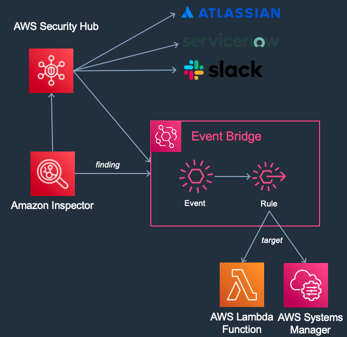
*Figure 15: Inspector finding flow*

### Software Bill of Materials (SBOM) Configuration

In Amazon Inspector you can export a Software Bill of Materials or SBOM for short. If you’re not familiar an SBOM it is a nested inventory of all the open source and third-party software components of your codebase. This can help you gain visibility into information about your software supply, such as your commonly used packages, and associated vulnerabilities across your organization.

To export SBOMs you need to use the Console or API set this up. Steps on how to configure this can be found in the [Inspector SBOM documentation](https://docs.aws.amazon.com/inspector/latest/user/sbom-export.html). It is important to keep in mind that this is a one-time export. If you need to do this on a regular basis it is recommended to set up a Lambda Function that uses the create sbom export API on a regular schedule to automatically create these SBOMs. This will help you if you need to look at an SBOM you have an update to date SBOM. This could also be event driven, for example running an SBOM export for an instance when it is created.

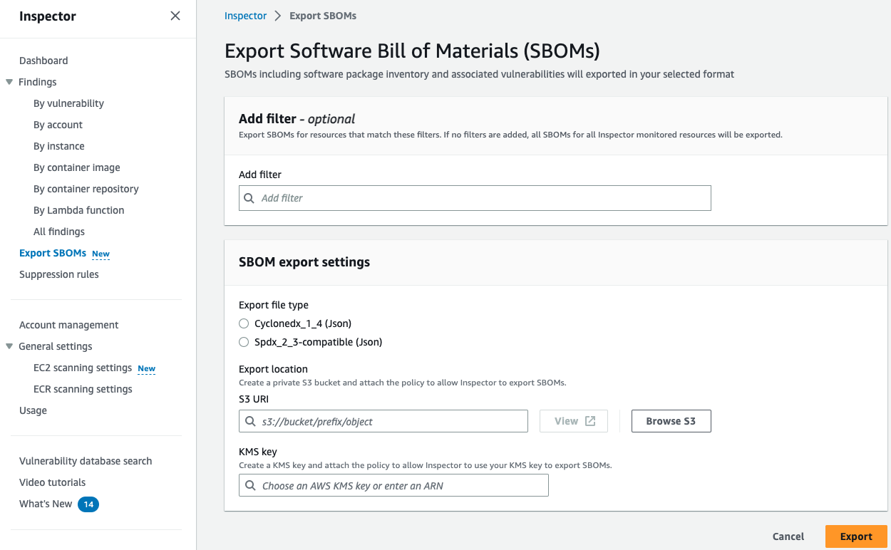
*Figure 16: Inspector SBOM settings*

### Suppression Rules

You might have CVEs in your environment that are not applicable because of a compensating control or that you’re unable to remediate and have categorized them as an accepted risk. For these circumstances you can create suppression rules in Inspector. You can use suppression rules to automatically exclude Amazon Inspector findings that match specified criteria. For example, you can create a rule to suppress all findings with a low vulnerability score. Suppression rules don't have any impact on the finding itself and don't prevent Amazon Inspector from generating a finding. Suppression rules are only used to filter your list of findings. If Amazon Inspector generates a new finding that matches a suppression rule, the service automatically sets the status of the finding to Suppressed. The findings that match suppression rule criteria won't appear in the console by default.

Additionally, if you are using AWS Security Hub CSPM as your aggregation point for Inspector and other AWS security services you can use automation rules to address findings. For example, you can use automation rules to upgrade all findings for a particular production account to a severity that warrants an immediate action or downgrades the severity of findings for particular environments that have controls in place that don’t allow public resources. To learn more refer to the [Security Hub CSPM automation rules documentation](https://docs.aws.amazon.com/securityhub/latest/userguide/automation-rules.html). The unified Security Hub also supports automation rules, including creating tickets directly in supported ITSM tools.

### Vulnerability Database Search

Amazon Inspector continuously updates its vulnerability database with the latest CVEs to confirm that our customers are able to assess their environments for up-to-date information. From time to time, you might ask “Is Inspector looking for this CVE?”. You can use the vulnerability database search capability in the AWS console to help answer this question, by simply providing a Common Vulnerability and Enumerations (CVE) ID, for example, “CVE-2023-1264“. This allows you to confirm the CVEs covered by Inspector scanning engine and do preliminary research on a CVE.

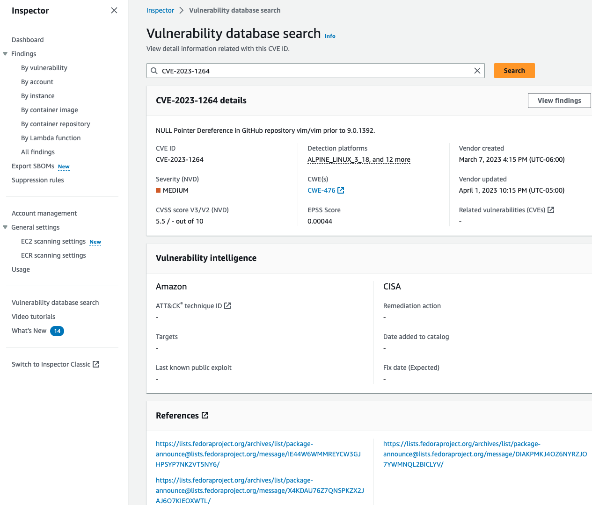
*Figure 17: Inspector vulnerability database page*

## Cost considerations

Amazon Inspector pricing is thoroughly covered in the pricing page covering pricing components, and multiple pricing examples that go through examples of what pricing might look like in your environment. We won’t cover that here and instead focus on two different questions that are frequently asked. 1. My organization is cost conscious or going through a cost optimization exercise, I want to confirm that I am using Amazon Inspector in a cost-effective way. 2. I am going to test Inspector or I want to enable Inspector in my environment but I want to estimate costs before getting started.

Before working through either question, establish which pricing model applies. **If you have enabled AWS Security Hub**, vulnerability management powered by Amazon Inspector is included in the Security Hub essentials plan at a single per-resource price covering your EC2 instances, ECR container images, and Lambda functions. You do not enable or pay for Inspector separately in those accounts. Lambda code scanning remains a separate per-resource add-on. The most important consequence is that several classic Inspector cost levers stop being cost levers, most notably ECR scan mode and re-scan duration, because scanning is included rather than billed per image and per rescan. Choose those settings on risk instead. See [Cost Considerations](../security-hub/index.md#cost-considerations) in the Security Hub guide for the pricing model and the console Cost Estimator.

The rest of this section applies to accounts running Amazon Inspector standalone, where usage-based pricing is in effect. A mixed estate is common and supported, so confirm which accounts fall where before you start optimizing.

Amazon Inspector charges you based on usage in your environment. The first lever is simply not carrying resources you do not need, since unused EC2 instances, stale ECR images, and abandoned Lambda functions cost you in Inspector and in the underlying services at the same time. Amazon ECR [lifecycle policies](https://docs.aws.amazon.com/AmazonECR/latest/userguide/LifecyclePolicies.html) are the highest-leverage cleanup here, because registries accumulate quietly and nobody owns pruning them.

Each scanning function is optional, so you can choose what to run. We do not recommend disabling scan types, because the resulting blind spot usually costs more than it saves, but budget constraints are real and the decision belongs to your organization. If you need to reduce scope, prefer narrowing which resources are scanned over turning a scan type off entirely. Inspector supports a tag that excludes individual EC2 instances from scanning, which is a more surgical option than disabling EC2 scanning across an account. Evaluate it carefully, because an excluded instance produces no findings and looks identical to a clean one on a dashboard. For more information, see the [scanning Amazon EC2 instances documentation](https://docs.aws.amazon.com/inspector/latest/user/scanning-ec2.html#exclude-ec2).

For standalone Inspector, ECR is priced per image on push and per rescan of retained images, so both the scan mode and the [re-scan duration](https://docs.aws.amazon.com/inspector/latest/user/scanning_resources_configure_duration_setting_ecr.html) are genuine levers. Shorter re-scan durations reduce cost, and Inspector now supports 3-day and 7-day settings in addition to the longer options, which gives you finer control than before. Match the duration to how long an image is realistically deployable in your environment, and check it against your ECR lifecycle policies so you are not paying to rescan images that your own retention rules are about to delete.

The best way to estimate costs is the 15-day free trial. Inspector can be turned on and off across hundreds or thousands of accounts in minutes, so a trial across a representative slice of your organization gives you a real number rather than a modeled one. If you are weighing standalone Inspector against Security Hub pricing, the Security Hub console Cost Estimator will show both side by side using your actual Cost Explorer data.

## Troubleshooting
### Troubleshooting AWS Systems Manager (SSM) Agent Issues
There are several issues that might cause the SSM agent to work improperly. You can use the Systems Manager Automation runbook to automatically troubleshoot an EC2 instance that SSM is unable to manage

* Open [this link](https://us-east-1.console.aws.amazon.com/systems-manager/automation/execute/AWSSupport-TroubleshootManagedInstance?region=us-east-1) to configure the Systems Manager Automation runbook.
* Navigate to the AWS Region for the EC2 instance you want to troubleshoot.
* Under the **Input parameters**, change the dropdown from "Show managed instances only" to "Show all instances".
* Select the EC2 instance you want to troubleshoot.
* Leave all the other settings, and at the bottom of the page, click **Execute**. This process normally takes up to 5 minutes to complete.
* Once the automation document has as an Overall status of Success, expand the Outputs section.
* Review the outputs to see the specific problem with your SSM configuration.

## Resources

### Workshops

* [Activation Days](https://awsactivationdays.splashthat.com/)
* [Amazon Inspector workshop](https://catalog.workshops.aws/inspector/en-US)
* [Amazon Detective workshop](https://catalog.workshops.aws/detective)
* [EKS security workshop](https://catalog.workshops.aws/containersecurity)

### Demo videos

* [Enhance workload security with agentless scanning and CI/CD integration](https://www.youtube.com/watch?v=5ngtzZHSwqU&list=PLB3flZ7qA4xu__uOEfpc-coXm04swNWva&index=5&pp=iAQB)
* [Inspector overview demo](https://www.youtube.com/watch?v=Nx8s7lwapoE&list=PLhr1KZpdzukfJzNDd8eCJH_TGg24ZTwP6&index=87&t=608s&pp=iAQB)
* [Vulnerability intelligence database search](https://www.youtube.com/watch?v=viAn4E7uwRU&list=PLhr1KZpdzukfJzNDd8eCJH_TGg24ZTwP6&index=18&pp=iAQB)
* [Windows support for continual EC2 vulnerability scanning](https://www.youtube.com/watch?v=ukvG_oRZ9iQ&list=PLhr1KZpdzukfJzNDd8eCJH_TGg24ZTwP6&index=19&pp=iAQB)
* [Software bill of materials export capability](https://www.youtube.com/watch?v=6dUvnDx4D-Y&list=PLhr1KZpdzukfJzNDd8eCJH_TGg24ZTwP6&index=20&pp=iAQB)
* [Inspector deep inspection of EC2 instances](https://www.youtube.com/watch?v=o0TAwqYN5rI&list=PLhr1KZpdzukfJzNDd8eCJH_TGg24ZTwP6&index=27&t=199s&pp=iAQB)
* [How to use Lambda code scanning](https://www.youtube.com/watch?v=VjIhTXeIgM0&list=PLhr1KZpdzukfJzNDd8eCJH_TGg24ZTwP6&index=37&pp=iAQB)
* [AWS Lambda functions support](https://www.youtube.com/watch?v=XXlY1yF_nUo&list=PLhr1KZpdzukfJzNDd8eCJH_TGg24ZTwP6&index=55&pp=iAQB)
* [Inspector for Lambda workloads](https://www.youtube.com/watch?v=BsrRibUfQls&list=PLhr1KZpdzukfJzNDd8eCJH_TGg24ZTwP6&index=61&pp=iAQB)
* [Inspector suppression rules demo](https://www.youtube.com/watch?v=JhtdPhuAVGM&list=PLhr1KZpdzukfJzNDd8eCJH_TGg24ZTwP6&index=90&pp=iAQB)

### Blogs

* [Use Amazon Inspector to manage your build and deploy pipelines for containerized applications](https://aws.amazon.com/blogs/security/use-amazon-inspector-to-manage-your-build-and-deploy-pipelines-for-containerized-applications/)
* [How to scan EC2 AMIs using Amazon Inspector](https://aws.amazon.com/blogs/security/how-to-scan-ec2-amis-using-amazon-inspector/)
* [Automate vulnerability management and remediation in AWS using Amazon Inspector and AWS Systems manager part 1](https://aws.amazon.com/blogs/mt/automate-vulnerability-management-and-remediation-in-aws-using-amazon-inspector-and-aws-systems-manager-part-1/)
* [Automate vulnerability management and remediation in AWS using Amazon Inspector and AWS Systems manager part 2](https://aws.amazon.com/blogs/mt/automate-vulnerability-management-and-remediation-in-aws-using-amazon-inspector-%20and-aws-systems-manager-part-2/)

### Other Resources

* [Building a scalable vulnerability management program on AWS - Guide](https://docs.aws.amazon.com/prescriptive-guidance/latest/vulnerability-management/introduction.html)