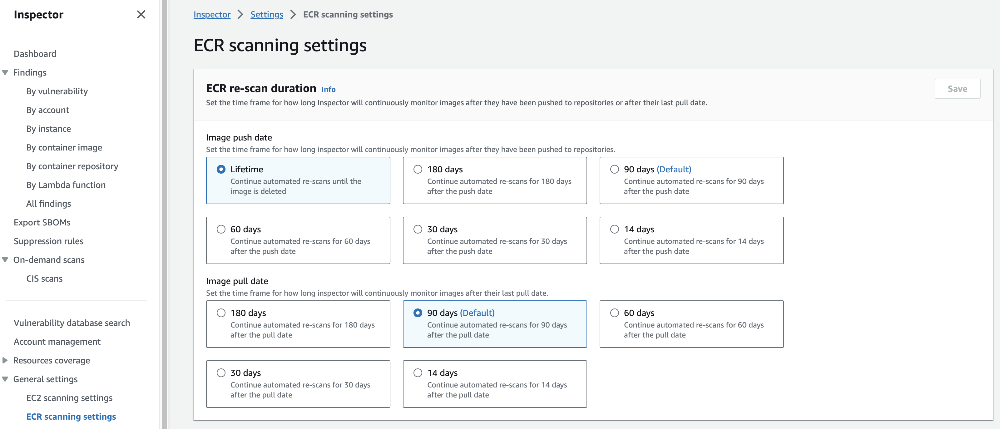

# Amazon Inspector

## Introduction

Welcome to the Amazon Inspector Best Practices Guide. The purpose of this guide is to provide prescriptive guidance for leveraging Amazon Inspector for continuous monitoring of software vulnerabilities and unintended network exposure in AWS workloads such as Amazon EC2, AWS Lambda functions, and Amazon ECR. Publishing this guidance via GitHub will allow for quick iterations to enable timely recommendations that include service enhancements, as well as, the feedback of the user community. This guide is designed to provide value whether you are deploying Inspector for the first time in a single account, or looking for ways to optimize Inspector in an existing multi-account deployment.

## How to use this guide

This guide is geared towards security practitioners who are responsible for monitoring and remediation of security events, abnormal activity, and vulnerabilities within AWS accounts (and resources). The best practices are organized into different categories for easier consumption. Each category includes a set of corresponding best practices that begin with a brief overview, followed by detailed steps for implementing the guidance. The topics do not need to be read in a particular order:

* [What is Amazon Inspector](#what-is-amazon-inspector)
* [What are the benefits of enabling Amazon Inspector](#what-are-the-benefits-of-enabling-amazon-inspector)
* [Getting started](#getting-started)
    * [AWS SSM agent](#aws-ssm-agent)
    * [Deployment considerations](#deployment-considerations)
    * [Region considerations](#region-considerations)
* [Implementation](#implementation)
    * [Stand-alone account enablement](#stand-alone-account-enablement)
    * [Multi-Account organization enablement](#multi-account-organization-enablement)
* [Coverage](#coverage)
    * [Amazon EC2 scanning](#amazon-ec2-scanning)
    * [Windows scanning](#windows-scanning)
    * [ECR scanning](#ecr-scanning)
    * [Lambda scanning](#lambda-scanning)
    * [CI/CD](#cicd-scanning)
* [Operationalizing](#operationalizing)
    * [Actioning Inspector findings](#actioning-inspector-findings)
    * [Software bill of materials (SBOM) configuration](#software-bill-of-materials-sbom-configuration)
    * [Suppression rules](#suppression-rules)
    * [Vulnerability database search](#vulnerability-database-search)
* [Cost considerations](#cost-considerations)
* [Resources](#resources)

## What is Amazon Inspector?

Amazon Inspector is a vulnerability management service that continuously monitors your AWS workloads for software vulnerabilities and unintended network exposure. Amazon Inspector automatically discovers and scans running Amazon EC2 instances, container images in Amazon Elastic Container Registry (Amazon ECR), and AWS Lambda functions.

## What are the benefits of enabling Amazon Inspector?

Amazon Inspector continuously discovers resources across your AWS Organization. After you deploy Amazon Inspector it will identify and automatically assess your resources for vulnerabilities. Keeping a continuous state of your environment Amazon Inspector understands when resources no longer exist or more importantly when new resources are deployed so that it can begin assessing these resources for vulnerabilities without requiring any manual configurations.  

Continuous assessment of your resources including Amazon EC2 instances, images in ECR, and Lambda functions for vulnerabilities so that you are always up to date on the current state of your resources, even as new vulnerabilities are discovered. Amazon Inspector continues to assess your environment throughout the lifecycle of your resources by automatically monitoring resources in response to changes that could introduce a new vulnerability, such as: installing a new package in an Amazon EC2 instance, installing a patch, and when a new common vulnerabilities and exposures (CVE) that impacts the resource is published. Unlike traditional security scanning software, Amazon Inspector has minimal impact on the performance of your fleet.

Amazon Inspector creates a finding when it discovers a software vulnerability, code vulnerability, or network configuration issues. A finding describes the vulnerability, identifies the affected resource, rates the severity of the vulnerability, and provides remediation guidance. Amazon Inspector also provide an Amazon Inspector score that provides context into the severity of a vulnerability. Visit the Inspector documentation to learn more about the [Amazon Inspector score](https://docs.aws.amazon.com/inspector/latest/user/findings-understanding-score.html#findings-understanding-inspector-score). You can analyze findings using the Amazon Inspector console, or view and process your findings through other AWS services.

Integration with Organizations enables you to quickly deploy and see vulnerability posture across all of their accounts from a single location and verify that Amazon inspector is automatically enabled and performing assessments as new accounts are added to the organization. This reduces the amount of effort needs to maintain a ready state of vulnerability management across your AWS environment.

## Getting started

In this section we will cover what you need to consider before activating Amazon Inspector in your AWS Organization.

### AWS SSM Agent

Although not required, it is recommended when using Amazon Inspector to detect software vulnerabilities in Amazon EC2 instance, the instance is managed instance in [AWS Systems Manager (SSM)](https://aws.amazon.com/systems-manager/). An SSM managed instance has the AWS SSM Agent installed and running, and SSM has permission to manage the instance. [AmazonSSMManagedInstanceCore](https://docs.aws.amazon.com/aws-managed-policy/latest/reference/AmazonSSMManagedInstanceCore.html) is the recommended policy to use when you attach an instance profile. This policy has all the permissions needed for Amazon Inspector EC2 scanning. If you are already using SSM to manage your instances, no additional steps are needed for Amazon Inspector to begin scans.

If you have instances that do not or can not have an SSM agent for example because of an unsupported operating system you will still be able to scan them for software vulnerabilities using Inspector [agentless scanning](https://docs.aws.amazon.com/inspector/latest/user/scanning-ec2.html#agentless) also referred to as hybrid scanning mode. Scanning with the SSM agent uses an event driven pattern, for example when new packages are installed on an instance Inspector will initiate an evaluation of the package. With agentless scanning, Inspector scans instances once per 24 hours.

The AWS SSM Agent is installed by default on Amazon EC2 instances created from [some Amazon Machine Images (AMIs)](https://docs.aws.amazon.com/systems-manager/latest/userguide/ami-preinstalled-agent.html). For more information, see [About SSM Agent](https://docs.aws.amazon.com/systems-manager/latest/userguide/prereqs-ssm-agent.html) in the AWS Systems Manager User Guide. However, even if it is installed, you may need to activate the AWS SSM Agent manually, and grant SSM permission to manage your instance.

In addition to providing the visibility that is needed to look for vulnerabilities on Amazon EC2 instance the presence of the AWS SSM agent provides value for activities such as scheduling automated patching, creating maintenance windows, reporting on patching compliance, providing a mechanism to run automation across your fleet of instances, and provide secure access to instances without the need to expose port 22 or 3389 for remote access to SSH or RDP.

### Deployment Considerations

To deploy Inspector across your AWS Organization you need to enable it in the AWS management account and the security tooling account whether this is done in the Console, CLI, or API. If you are not familiar with the concept of the security tooling account it is recommended to familiarize yourself with the [recommended account structure](https://docs.aws.amazon.com/prescriptive-guidance/latest/security-reference-architecture/organizations.html) in the Security Reference Architecture. To summarize, this is a dedicated account in your AWS Organization that is used as the delegated administrator account for native AWS security services such as Amazon Inspector, Amazon GuardDuty, AWS Security Hub, and Amazon Detective.

### Region Considerations

Amazon Inspector is a regional service. This means that to use Amazon Inspector you need to enable it in every region that you would like to have vulnerability monitoring capabilities in. You can enable Inspector across all accounts and regions using the AWS CLI script on [GitHub](https://github.com/aws-samples/inspector2-enablement-with-cli) or you can do this by toggling between regions in the console.

A question that is often asked is “Should I use a security service in a region that my company is not actively using?”. Although there is not a straightforward answer to this question as there are many factors that might influence your answer such as risk appetite, budget, and compensating controls, among others. There are some things to keep in mind when making this decision.

1. Inspector is a service that you only pay for what you use. So, if you have a region that has minimal use you can have Inspector on giving visibility into your vulnerability landscape without incurring disproportionate cost associated with the resources being used in a region.
2. If you have a compensating control associated with none used regions such as a service control policy that blocks all use in this region. It is still recommended to have a detective control to validate detection of this compensating control being changed at any point in the future.

This decision is ultimately one that your company needs to make based on your own circumstances, but a rule of thumb in security is that more visibility before an investigation is better as it often hard, if not impossible to obtain after the fact.

## Implementation

In this section we will cover the minimum requirements for enabling Inspector in a stand-alone account and in a multi-account organization.

### Stand-alone account enablement

*Figure 1: Inspector getting started page*

The first step is to navigate to the Inspector console. Once you are in the Inspector console you should see a landing page with a getting started button. Click on “Get started”.

*Figure 2: Activate Inspector page*

After clicking on “Get started” you will be brought to the Inspector enablement page. Review the Service role permissions so that you have an understanding of the permissions Inspector needs in order to provide its features and functions then select the yellow box labeled “Activate Inspector” to enable Inspector.

Once these two steps are done Inspector will be enabled in this account. It is important to refer to sections below to make sure you have enabled all relevant features of Inspector.

### Multi-Account organization enablement

When you implement Inspector for the first time in your AWS Organization as stated above you will set the delegated administrator in your organization management account in each region that you want to use Inspector. Keep in mind you will need to use the same account in all regions.

*Figure 3: Inspector getting started page*

The first step is to navigate to the Inspector console in your organizations management account. Once you are on the Inspector console you will see a landing page with a getting started button. Click on “Get started”.

*Figure 4: Delegated admin assignment page*

After clicking on “Get started” you will be brought to the Inspector enablement page. Next you will need to enter the account ID for the account you want to designate as the Inspector delegated administrator account. Once you have entered the account ID select “Delegate”. At this point you will switch to the Delegated administrator to finish configuring Amazon Inspector across your AWS Organization.

*Figure 5: Inspector getting started page*

Once you are in the Inspector delegated administrator account you will again see a landing page with a getting started button. Click on “Get started”. Once this is complete Inspector will be enabled. There are a few more deployment considerations that we will cover.

*Figure 6: Inspector account management page*

Next you will need to make sure you activate scanning for all current accounts and all scanning types including Amazon EC2 scanning, Amazon ECR Scanning, AWS Lambda standard scanning, and AWS Lambda code scanning. It is also highly recommended to “Automatically activate Inspector for new member accounts”. This helps you understand that you don’t have a gap in vulnerability coverage when new accounts are created in your organization. This will also automate the process of onboarding new accounts and automatically aggregate all findings to your delegated administrator account reducing manual tasks and saving time.

## Coverage

In this section we will cover the enablement of different features to configure Inspector across all supported resources in your environment.

### Amazon EC2 Scanning

After enabling Inspector in your Organization there are two more Amazon EC2 scanning related configurations that you need to address.

Inspector Deep Inspection for Amazon EC2 gives Inspector the ability to detect package vulnerabilities for application programming language packages in your Linux-based Amazon EC2 Instances. New accounts enabling Inspector will have deep inspection enabled by default. If you have an account that was previously enabled and want to confirm that this is enabled, you can look at the account management page in the Inspector console and look for any accounts that have deep inspection scanning deactivated like the picture below. For full details on Inspector Deep inspection and instructions on how to configure deep inspection scans refer to the [Inspector Deep inspection documentation](https://docs.aws.amazon.com/inspector/latest/user/scanning-ec2.html#deep-inspection).

*Figure 7: Inspector EC2 deep scan activated*

*Figure 8: Inspector EC2 deep scan deactivated*

By default, Deep Inspection scanning looks at the default paths below.

* /usr/lib
* /usr/lib64
* /usr/local/lib
* /usr/local/lib64

All individual accounts can add up to 5 custom paths. The delegated administrator can add an additional 5 paths that will apply across the organization. This amounts to a total of up to 10 custom paths scanned per account in the organization. An example of a custom path would be “/home/usr1/project01”. It is recommended to put in all custom paths applicable to your organization to provide full visibility for Inspector Deep inspection.

*Figure 9: Inspector EC2 scan settings*

### Windows Scanning

Amazon Inspector automatically discovers all supported Windows instances and includes them in continuous scanning without any extra actions. Unlike scans for Linux based instances, Amazon Inspector runs Windows scans at regular intervals. Windows instances are initially scanned at discovery and then scanned every 6 hours. However, the default 6‐hour scan interval is adjustable. If 6 hours is your desired scan frequency than no action is needed. If you would like to adjust the scan frequency you can do this using the aws ssm update-association CLI command. For steps on how to adjust the scan frequency please refer to the [Inspector Windows scanning documentation](https://docs.aws.amazon.com/inspector/latest/user/scanning-ec2.html#windows-scanning).

### ECR Scanning

For ECR scanning, images are scanned on push and then you have the option to specify when you would like to stop scanning images. You might choose to stop scanning instances after a defined period of time because they are no longer used for applications in your environment based on other compensating controls you might have in place.

By default, ECR scanning is set to continue to scan for the lifetime of an image existing in ECR and is scanned whenever a new CVE is added to the Inspector database and is relevant to that container image. It is recommended to use the default to verify that you are always looking for new vulnerabilities associated with images in your environment although you do have the option to change this behavior to stop scanning instances after 30 days or 180 days. For detailed instructions on how to set this duration please refer to the [ECR automated re-scan duration documentation](https://docs.aws.amazon.com/inspector/latest/user/scanning-ecr.html#scan-duration-ecr).

*Figure 10: Inspector ECR scan settings*

### Lambda Scanning

Lambda scanning has two different functionalities. The first is the ability to scan Lambda functions for software vulnerabilities in programming languages and packages. The second is the ability to scan your custom privileged application code for code vulnerabilities. Under account management make sure that these are both activated to provide full Inspector visibility. If you see any accounts with Lambda scanning or code scanning deactivated refer to the [Lambda scanning documentation for detailed steps on activation](https://docs.aws.amazon.com/inspector/latest/user/scanning-lambda.html).

*Figure 11: Inspector Account management page*

### CI/CD Scanning

You can integrate Amazon Inspector directly in CI/CD tools such as Jenkins. For [Jenkins](https://docs.aws.amazon.com/inspector/latest/user/cicd-jenkins.html) and [TeamCity](https://docs.aws.amazon.com/inspector/latest/user/cicd-teamcity.html) tools Inspector has dedicated plugins that can be installed so you can add vulnerability scanning directly into these pipelines. These plugins can be used as a pass or fail mechanism based on finding severities.

If Amazon Inspector does not provide plugins for your CI/CD solution, you can create your own [custom CI/CD integration](https://docs.aws.amazon.com/inspector/latest/user/scanning-cicd.html) using a combination of the Amazon Inspector SBOM Generator and the Amazon Inspector Scan API.

## Operationalizing

### Actioning Inspector Findings

Many organizations have a well-established vulnerability management program, but if you don’t or you are unsure of what you do now works with Amazon Inspector we want to highlight a few important themes that you should be thinking about.

*Figure 12: Inspector finding details*

*Figure 13: Inspector score example*

*Figure 14: Generative AI powered code remediation recommendation*

Inspector vulnerability findings give great detail into the resource affected, the CVE, and generative AI powered code remediation suggestions giving security and application teams the context needed to more quickly remediate vulnerabilities in your AWS environment. Inspector findings are also stateful. This means that if you update a package that contained a vulnerability Inspector will see the package change, initiate an assessment, and if the vulnerability was in fact remediated then close the finding. This understanding is important for understanding you will handle Inspector findings. Below will dive into some of the different themes we think you should be thinking through.

1. A critical component of an effective vulnerability management program is the ability to assess and prioritize security findings. This is where pulling in context, organizational history, and tuning detection systems comes into place. Prioritization of security findings helps establish the appropriate speed for response level. We recommend prioritizing the investigation of all critical and high severity findings.
2. Understand what you will do with findings when they are created by Inspector. For example, Amazon Inspector has 5 different finding severity levels described [here](https://docs.aws.amazon.com/inspector/latest/user/findings-understanding-severity.html). It is important to understand how quickly you will require teams in your organization to remediate findings. This is likely to depend on severity, as you will want to more quickly respond to critical findings vs informational findings.
3. After understanding response times, it is important to focus on how you will alert on new vulnerabilities. For example, do you have a ticketing system that you would like to integrate with? If so, this is something that AWS Security Hub can assist with. You might want to send these alerts directly to applications teams for remediation, or maybe they need to be cleared through security first. With Inspectors integration with Amazon EventBridge and AWS Security Hub you have many different alerting and tracking options. It is important to understand what works best for your organization and to have this workflow established.
4. Remediation of vulnerabilities should be pushed to application owners as they are the ones who understand the implications of updating packages used by their application code. It would be an anti-pattern for security teams to be responsible for software patching. A two-way communication channel between the security teams should be established for communicating risk, its acceptance and/or mitigation.
5. Ideally at every organization we want to automate as much as possible to save time and potential errors associated with repetitive manual actions from humans. Unfortunately, this can’t also be done 100% of the time, but we should always be working to get there. First work through what services you will use to automate vulnerability remediation such as [AWS Systems Manager Patch Manager](https://docs.aws.amazon.com/systems-manager/latest/userguide/patch-manager.html). Then understand what environments, resources, and CVEs you feel comfortable automatically remediating. The amount of automation that can be created will largely depend on resource timing and ability. There will be an intersection where risk is not great enough to constitute how much time you spent on furthering automation versus working on other high priority projects. Once you start to build this out there are a lot of different resources that can help with automating patch management in AWS. Since there are a number of different resources on this, we have created a dedicated section in the resources section below of valuable resources that you should look at.
6. In addition to automating where possible many customers use Amazon Inspector to find vulnerabilities in resources early in the development lifecycle and remediate before being deployed in a production environment. Using Amazon Inspector in development and staging accounts during development and testing give you the visibility to understand what vulnerabilities exist in applications before deploying to production. There are also multiple blogs that cover how Inspector fits into a CI/CD pipeline in the resources section.

*Figure 15: Inspector finding flow*

### Software Bill of Materials (SBOM) Configuration

In Amazon Inspector you can export a Software Bill of Materials or SBOM for short. If you’re not familiar an SBOM it is a nested inventory of all the open source and third-party software components of your codebase. This can help you gain visibility into information about your software supply, such as your commonly used packages, and associated vulnerabilities across your organization.

To export SBOMs you need to use the Console or API set this up. Steps on how to configure this can be found in the [Inspector SBOM documentation](https://docs.aws.amazon.com/inspector/latest/user/sbom-export.html). It is important to keep in mind that this is a one-time export. If you need to do this on a regular basis it is recommended to set up a Lambda Function that uses the create sbom export API on a regular schedule to automatically create these SBOMs. This will help you if you need to look at an SBOM you have an update to date SBOM. This could also be event driven, for example running an SBOM export for an instance when it is created.

*Figure 16: Inspector SBOM settings*

### Suppression Rules

You might have CVEs in your environment that are not applicable because of a compensating control or that you’re unable to remediate and have categorized them as an accepted risk. For these circumstances you can create suppression rules in Inspector. You can use suppression rules to automatically exclude Amazon Inspector findings that match specified criteria. For example, you can create a rule to suppress all findings with a low vulnerability score. Suppression rules don't have any impact on the finding itself and don't prevent Amazon Inspector from generating a finding. Suppression rules are only used to filter your list of findings. If Amazon Inspector generates a new finding that matches a suppression rule, the service automatically sets the status of the finding to Suppressed. The findings that match suppression rule criteria won't appear in the console by default.

Additionally, if you are using AWS Security Hub as your aggregation point for Inspector in other AWS security services you can use automation rules to address findings. For example, you can use automation rules to upgrade all findings for a particular production account to a severity that warrants an immediate action or downgrades the severity of findings for particular environments that have controls in place that don’t allow public resources. To learn more about AWS Security Hub automation rules refer to the [AWS Security Hub automation rules documentation](https://docs.aws.amazon.com/securityhub/latest/userguide/automation-rules.html).

### Vulnerability Database Search

Amazon Inspector continuously updates its vulnerability database with the latest CVEs to confirm that our customers are able to assess their environments for up-to-date information. From time to time, you might ask “Is Inspector looking for this CVE?”. You can use the vulnerability database search capability in the AWS console to help answer this question, by simply providing a Common Vulnerability and Enumerations (CVE) ID, for example, “CVE-2023-1264“. This allows you to confirm the CVEs covered by Inspector scanning engine and do preliminary research on a CVE.

*Figure 17: Inspector vulnerability database page*

## Cost considerations

Amazon Inspector pricing is thoroughly covered in the pricing page covering pricing components, and multiple pricing examples that go through examples of what pricing might look like in your environment. We won’t cover that here and instead focus on two different questions that are frequently asked. 1. My organization is cost conscious or going through a cost optimization exercise, I want to confirm that I am using Amazon Inspector in a cost-effective way. 2. I am going to test Inspector or I want to enable Inspector in my environment but I want to estimate costs before getting started.

Amazon Inspector is a cost-effective service that charges you based on usage in your environment. To verify that you are using Inspector cost effectively it is important to understand that since it is usage based you should make sure you do not have extra resources in your environment that are not being used. This will not only save Inspector cost but will potentially save you on Amazon EC2, ECR, and Lambda costs. Secondly each scanning function of Amazon Inspector is optional, so you can choose to use what you need. It is not recommended to disable any of the features as this could potentially cause a lack of visibility into vulnerabilities in your environment and introduce unnecessary challenges, but at every organization there is budgets limits that should be taken into consideration when using Amazon Inspector features. Another option that can be used but should be carefully evaluated is the tag that can be used to exlude scanning for EC2 instances. For more information on how to configure this tag please refer to the [scanning Amazon EC2 Instances documentation](https://docs.aws.amazon.com/inspector/latest/user/scanning-ec2.html#exclude-ec2).

The best way to estimate costs with Amazon Inspector is to take advantage of the 15-day free trial. Inspector can be turned on and off across hundreds or thousands of accounts in an organization in a matter of minutes. Once you enable Inspector you will be able to see the costs associated with running Inspector in your organization past the 15-day free trial.

## Resources

### Workshops

* [Activation Days](https://awsactivationdays.splashthat.com/)
* [Amazon Inspector workshop](https://catalog.workshops.aws/inspector/en-US)
* [Amazon Detective workshop](https://catalog.workshops.aws/detective)
* [EKS security workshop](https://catalog.workshops.aws/containersecurity)

### Demo videos

* [Enhance workload security with agentless scanning and CI/CD integration](https://www.youtube.com/watch?v=5ngtzZHSwqU&list=PLB3flZ7qA4xu__uOEfpc-coXm04swNWva&index=5&pp=iAQB)
* [Inspector overview demo](https://www.youtube.com/watch?v=Nx8s7lwapoE&list=PLhr1KZpdzukfJzNDd8eCJH_TGg24ZTwP6&index=87&t=608s&pp=iAQB)
* [Vulnerability intelligence database search](https://www.youtube.com/watch?v=viAn4E7uwRU&list=PLhr1KZpdzukfJzNDd8eCJH_TGg24ZTwP6&index=18&pp=iAQB)
* [Windows support for continual EC2 vulnerability scanning](https://www.youtube.com/watch?v=ukvG_oRZ9iQ&list=PLhr1KZpdzukfJzNDd8eCJH_TGg24ZTwP6&index=19&pp=iAQB)
* [Software bill of materials export capability](https://www.youtube.com/watch?v=6dUvnDx4D-Y&list=PLhr1KZpdzukfJzNDd8eCJH_TGg24ZTwP6&index=20&pp=iAQB)
* [Inspector deep inspection of EC2 instances](https://www.youtube.com/watch?v=o0TAwqYN5rI&list=PLhr1KZpdzukfJzNDd8eCJH_TGg24ZTwP6&index=27&t=199s&pp=iAQB)
* [How to use Lambda code scanning](https://www.youtube.com/watch?v=VjIhTXeIgM0&list=PLhr1KZpdzukfJzNDd8eCJH_TGg24ZTwP6&index=37&pp=iAQB)
* [AWS Lambda functions support](https://www.youtube.com/watch?v=XXlY1yF_nUo&list=PLhr1KZpdzukfJzNDd8eCJH_TGg24ZTwP6&index=55&pp=iAQB)
* [Inspector for Lambda workloads](https://www.youtube.com/watch?v=BsrRibUfQls&list=PLhr1KZpdzukfJzNDd8eCJH_TGg24ZTwP6&index=61&pp=iAQB)
* [Inspector suppression rules demo](https://www.youtube.com/watch?v=JhtdPhuAVGM&list=PLhr1KZpdzukfJzNDd8eCJH_TGg24ZTwP6&index=90&pp=iAQB)

### Blogs

* [Use Amazon Inspector to manage your build and deploy pipelines for containerized applications](https://aws.amazon.com/blogs/security/use-amazon-inspector-to-manage-your-build-and-deploy-pipelines-for-containerized-applications/)
* [How to scan EC2 AMIs using Amazon Inspector](https://aws.amazon.com/blogs/security/how-to-scan-ec2-amis-using-amazon-inspector/)
* [Automate vulnerability management and remediation in AWS using Amazon Inspector and AWS Systems manager part 1](https://aws.amazon.com/blogs/mt/automate-vulnerability-management-and-remediation-in-aws-using-amazon-inspector-and-aws-systems-manager-part-1/)
* [Automate vulnerability management and remediation in AWS using Amazon Inspector and AWS Systems manager part 2](https://aws.amazon.com/blogs/mt/automate-vulnerability-management-and-remediation-in-aws-using-amazon-inspector-%20and-aws-systems-manager-part-2/)

### Other Resources

* [Building a scalable vulnerability management program on AWS - Guide](https://docs.aws.amazon.com/prescriptive-guidance/latest/vulnerability-management/introduction.html)