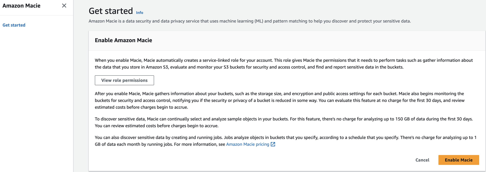
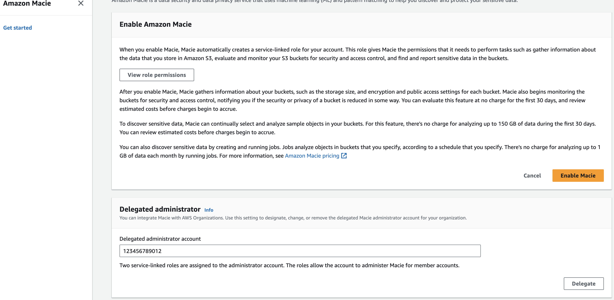
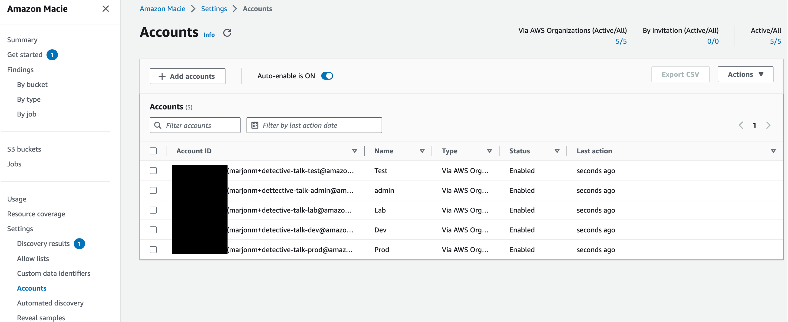
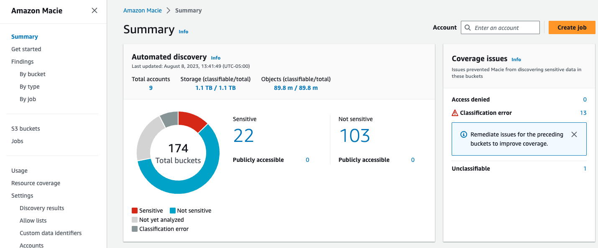
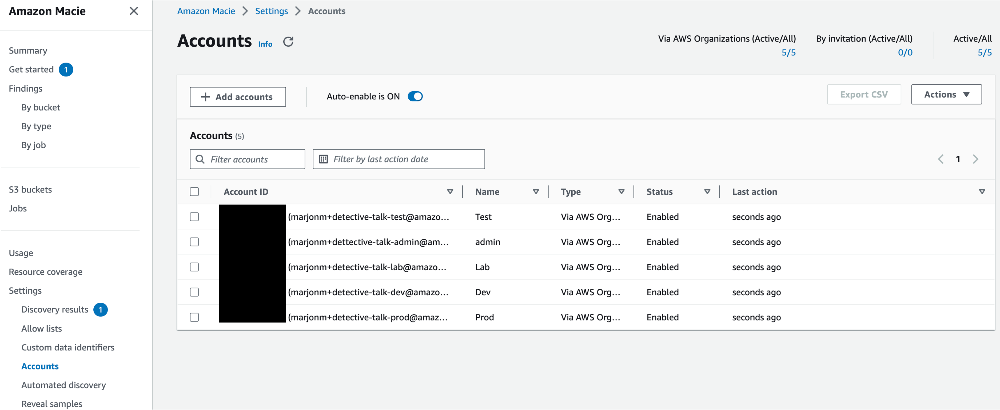
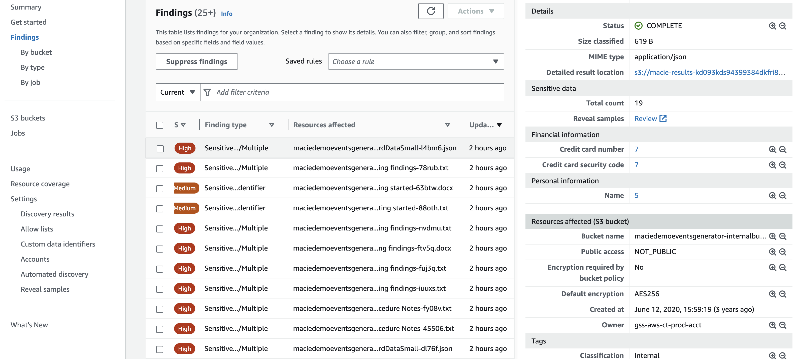
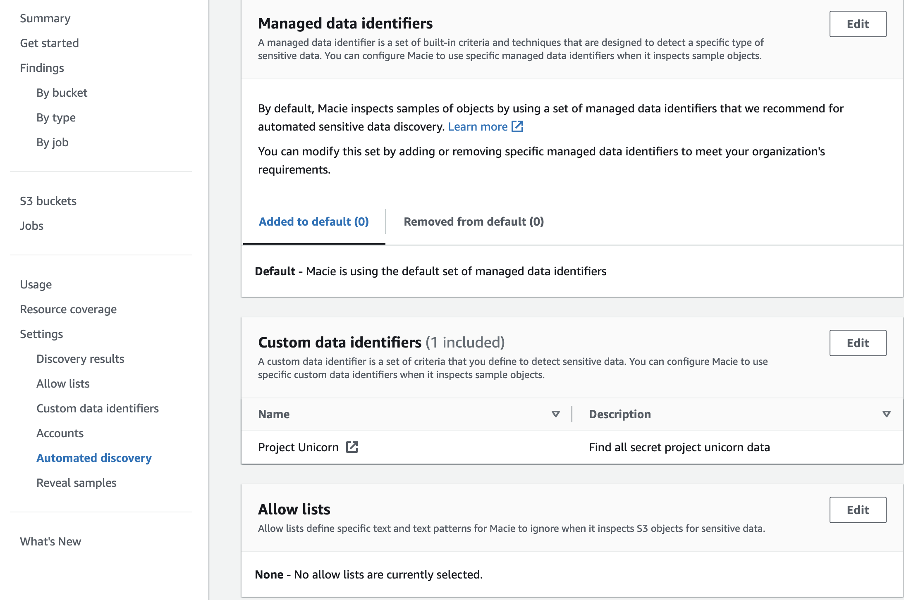

# Amazon Macie

## Introduction

Welcome to the Amazon Macie Best Practices Guide. The purpose of this guide is to provide prescriptive guidance for leveraging Amazon Macie for continuous monitoring of your data in your Amazon S3 estate. Publishing this guidance via GitHub will allow for quick iterations to enable timely recommendations that include service enhancements, as well as, the feedback of the user community. This guide is designed to provide value whether you are deploying Macie for the first time in a single account, or looking for ways to optimize Macie in an existing multi-account deployment.

## How to use this guide

This guide is geared towards security practitioners who are responsible for monitoring and remediation of threats, malicious activity, and vulnerabilities within AWS accounts (and resources). The best practices are organized into three categories for easier consumption. Each category includes a set of corresponding best practices that begin with a brief overview, followed by detailed steps for implementing the guidance. The topics do not need to be read in a particular order:

* [What is Amazon Macie](#what-is-amazon-macie)
* [What are the benefits of enabling Macie](#what-are-the-benefits-of-enabling-macie)
* [Getting started](#getting-started)
    * [Deployment considerations](#deployment-considerations)
    * [Region considerations](#region-considerations)
* [Implementation](#implementation)
    * [Stand alone account enablement](#stand-alone-account-enablement)
    * [Multi-account organization enablement](#multi-account-organization-enablement)
    * [Account coverage](#account-coverage)
    * [Discovery results](#discovery-results)
    * [Publishing to Security Hub](#publishing-to-security-hub)
    * [Automated sensitive data discovery vs sensitive data discovery jobs](#automated-sensitive-data-discovery-vs-sensitive-data-discovery-jobs)
    * [Resource coverage](#resource-coverage)
* [Operationalizing Macie Findings](#operationalizing-macie-findings)
    * [Action Macie findings](#action-macie-findings)
    * [Influencing sensitive data detections](#influencing-sensitive-data-detections)
    * [Suppression rules](#suppression-rules)
* [Cost considerations](#cost-considerations)
* [Resources](#resources)

## What is Amazon Macie?

Amazon Macie is a data security service that discovers sensitive data by using machine learning and pattern matching, provides visibility into data security risks, and enables automated protection against those risks.

To help you manage the security posture of your organization's Amazon Simple Storage Service (Amazon S3) data estate, Macie provides you with an inventory of your S3 buckets, and automatically evaluates and monitors the buckets for security and access control. If Macie detects a potential issue with the security or privacy of your data, such as a bucket that becomes publicly accessible, Macie generates a finding for you to review and remediate as necessary.

Macie also automates discovery and reporting of sensitive data to provide you with a better understanding of the data that your organization stores in Amazon S3. To detect sensitive data, you can use built-in criteria and techniques that Macie provides, custom criteria that you define, or a combination of the two. If Macie detects sensitive data in an S3 object, Macie generates a finding to notify you of the sensitive data that Macie found.

## What are the benefits of enabling Macie?

Macie as an AWS managed service that automatically provides statistics such as what buckets are publicly accessible, shared outside of your AWS Organization, or amount of buckets that contain sensitive data. These statistics offer insights into the security posture of your Amazon S3 data and where sensitive data might reside in your data estate.  The statistics and data can guide your decisions to perform deeper investigations of specific S3 buckets and objects. Since Macie is a managed service you can spend your time reviewing and analyzing findings, statistics, and other data by using the Amazon Macie console or the Amazon Macie API instead of setting up and managing the infrastructure needed to provide these insights. You can also leverage Macie integration with Amazon EventBridge and AWS Security Hub to monitor, process, and remediate findings by using other services, applications, and systems.

Macie makes it easy to do this across your AWS Organization through automation and AWS Organizations integration Macie provides sensitive data discovery and bucket posture assessments across all of your S3 buckets and objects across all accounts within your organization. Giving you centralized visibility across your entire S3 data estate.

Some of the most common use cases for Macie are listed below:

* Macie intelligent sampling functionality and native integration with AWS services such as AWS Security Hub and Amazon EventBridge make discovering and actioning sensitive data more cost effective and time efficient.
* Company A is being acquired by Company B. As part of the merger, Company A needs to understand the presence of Sensitive data in Company B’s data to ensure they are adhering to compliance mandates.
* Company A is a data centric company and keeps tons of data for business needs. Company A also wants to ensure that the sensitive data is carefully protected by having an understanding of their sensitive data assets and the access patterns of this data.
* Your company has had a security issue and you need to understand the type of data that was accessed.

## Getting started

Before getting started with Amazon Macie you need to ensure you have permissions to administer Macie and you should think through which account in your AWS Organization is best suited to be the Macie delegated administrator account. To get started with permissions make sure your role you are using to administer Macie has a minimum of the AWS managed policy name “AmazonMacieFullAccess”.

### Deployment Considerations

To deploy Macie across your AWS Organization you will need to enable it in the AWS management account and the security tooling account whether this is done in the Console, CLI, or API. If you are not familiar with the concept of the security tooling account it is recommended to familiarize yourself with the [recommended account structure](https://docs.aws.amazon.com/prescriptive-guidance/latest/security-reference-architecture/organizations.html) in the Security Reference Architecture. To summarize this is a dedicated account in your AWS Organization that is used as the delegated administrator account for native AWS security services such as Amazon Inspector, Amazon GuardDuty, AWS Security Hub, and Amazon Detective.

### Region Considerations

Amazon Macie is a regional service. This means that to use Macie you will need to enable it in every region that you would like to discover sensitive data. You can enable Macie across all accounts and regions using the AWS API or you can do this by toggling between regions in the console.

## Implementation

In this section we will cover the minimum requirements for enabling Macie in a stand alone account and in a multi-account organization.

### Stand alone account enablement

*Figure 1: Macie Getting Started*

The first step is to navigate to the Macie console. Once you are on the Macie console you will see a landing page with a getting started button. Click on “Get started”.

*Figure 2: Macie enablement*

After clicking on “Get started” you will be brought to the Macie enablement page review the Service role permissions so that you have an understanding on the permissions Macie will need in order to provide its features and functions then select the yellow box labeled “Enable Macie” to enable Macie.

Once these two steps are done Macie will be enabled in this account. It is important to refer to sections below to make sure you have enabled all relevant features of Macie.

### Multi-Account organization enablement

When you implement Macie for the first time in your AWS Organization as stated above you will set the delegated administrator in your organization management account in each region that you want to use Macie. Once that is complete there are other steps to completely configure Macie that we will cover in this section.

*Figure 3: Macie Getting Started*

The first step is to navigate to the Macie console in your Organizations management account. Once you are on the Macie console you will see a landing page with a getting started button. Click on “Get started”.

*Figure 4: Macie delegated admin enablement*

After clicking on “Get started” you will be brought to the Macie enablement page. Next you will need to enter the account ID for the account you want to designate the Macie delegated administrator account. Once you have entered the account ID select “Delegate”. At this point you will switch to the Delegated administrator to finish configuring Amazon Macie across your AWS Organization.

### Account Coverage

Once you set the delegated administrator in the organization management account Macie will be enabled in the delegated administrator account but it will be missing coverage across the accounts that already exist in your organization. So next you will need to go to the account settings or use the API to enable Macie across all member accounts. You will also want to check the “Auto-enable” toggle switch to on. This will ensure that any new accounts in your Organization automatically get Macie enabled, which will make sure you don’t have a lack of visibility and save you manual effort of enabling Macie individually for accounts in your organization. Make sure the status of your accounts says enabled and the “Auto-enabled” toggle switch indicates on like what is pictured below.

*Figure 5: Macie Account page*

### Discovery Results

It is important to set up an S3 bucket for your discovery results within the first 30 days of enabling Macie because Macie stores your sensitive data discovery results for only 90 days. To access the results and enable long-term storage and retention of them, you will need to configure Macie to store the results in an S3 bucket. This will enable you to keep a record of all discovery results going forward. For context, discovery results creates an entry for every file that Macie looked at, even if there was no sensitive data identified. This data can help you confirm certain files were scanned, identify where Macie could not scan a file, and files where sensitive data was found. To learn how to configure this repository, see [Storing and retaining sensitive data discovery results](https://docs.aws.amazon.com/macie/latest/user/discovery-results-repository-s3.html).

### Publishing to Security Hub

By default Macie automatically publishes policy and sensitive data findings to Amazon EventBridge as events and publishes policy findings to Security Hub. It is recommended to also publish sensitive data findings to Security Hub so that you can take advantage of any workflows or automation that you might have created for other security service findings such as sending findings to a ticketing system or using Lambda to remediate a resource based on a finding in Security Hub.

*Figure 6: Macie finding publish settings*

### Automated Sensitive Data Discovery vs Sensitive Data Discovery Jobs

Many customers often have vast amounts of data stored in S3 making the ability to search this data very compute intensive and cost inefficient across their entire data estate. To make this more cost effective and efficient Macie performs automated sensitive data discovery for broad visibility into where sensitive data might reside in your S3 data estate. With automated sensitive data discovery, Macie continually evaluates your S3 bucket inventory and uses sampling techniques to identify and select representative S3 objects in your buckets. Macie then retrieves and analyzes the selected objects, inspecting them for sensitive data. It is recommended to use the automated discovery feature of Macie as this will give you the most cost effective sensitive data scanning coverage in your AWS Organization.

*Figure 7: Macie summary page*

If you need to do a deeper analysis of a particular bucket you also have the ability to run a sensitive data discovery job that allows you to be very specific in the scanning functionality you are looking for. For example you can look for certain managed data identifiers, custom data identifiers, only look for certain file types, or include/exclude data based on certain tags. The large majority of customers will not need to run individual jobs as they will get their results from automated discovery and then dive into certain data sets to learn more.

A few use cases to run sensitive data discovery jobs that we hear often are customers who have a data set where they can’t have any uncertainty, so they decide to scan the entirety of this data set giving them the ability to learn where all instances of sensitive data live in a given data set. Another use case would be to would be to run scans based on an ingest of data. Data discovery jobs would give you the ability to target where this data is being ingested and the frequency at which it is scanned. Finally you might want to use custom data identifiers on a smaller subset of data than across your entire S3 estate with automated discovery. Sensitive data discovery jobs would give you the ability to focus this custom data identifier on a smaller set of data.  

For more information on how to configure a sensitive data discovery job please refer to the [Amazon Macie documentation](https://docs.aws.amazon.com/macie/latest/user/discovery-jobs.html).

### Resource Coverage

For Macie to scan data in S3 the data needs to be in a [supported file format](https://docs.aws.amazon.com/macie/latest/user/discovery-supported-storage.html) and be in a bucket that has [permissions that allows Macie](https://docs.aws.amazon.com/macie/latest/user/monitoring-restrictive-s3-buckets.html) to scan the data. Most buckets have an explicit allow in the bucket policy but for buckets with explicit deny’s in the bucket policy you will need to add the Macie service linked role to be allowed in the bucket policy. In the resource coverage page Macie lists bucket issues so you can more easily see and address any buckets that Macie is not able to scan.

*Figure 8: Macie S3 coverage insights*

## Operationalizing Macie Findings

### Action Macie Findings

The first step we recommend for operationalizing findings from any security service is to understand what details a finding will give you and then understand how you will respond to a finding considering your organizations tooling capabilities and ownership model. For example, do you have a ticketing system you can integrate with to create tickets when a new sensitive data finding is created? Will the account owner automatically receive the ticket and be responsible for remediation? Will triage and alerting be the responsibility of a central security team? These are just a few of the questions that you will need to answer.

*Figure 9: Macie findings*

Macie findings give details such as the bucket and object location of the sensitive data finding, they also give information into what was the sensitive data and the location within the given finding making it easier for you to remediate. It is recommended to start out by understanding findings and making account owners and application teams responsible for addressing and cleaning up sensitive data discovered by Macie whether this alerting is done via automation through a ticketing system or email notification. Once you have established a familiarity with sensitive data findings and your environment we would recommend to automate wherever possible to save time and cut down on potential errors created from manual human actions. This could be something such as using Lambda to create a deny all S3 bucket policy for S3 buckets that have been found to have sensitive data. This type of solution will largely depend on the risk appetite of your organization and other factors such as tagging and compensating controls in an environment. We have linked to multiple blogs in the resource section that cover in detail how to create automation based on a Macie finding.

### Influencing Sensitive Data Detections

Customers often ask how can I tune what Amazon Macie is looking for. To more effectively tune Macie to look for data in your S3 data estate you have the option to create allow lists, custom data identifiers, and specify which managed data identifiers you would like to look for.

Macie has managed data identifiers associated with sensitive data types such as credentials, financial information, personal health information, and personally identifiable information. Custom data identifiers give you the ability to create your own detection criteria that reflects your organization’s particular scenarios, intellectual property, or proprietary data—for example, employee IDs, customer account numbers, or internal data classifications. 

Allow lists define specific text and text patterns for Macie to ignore when it inspects S3 objects for sensitive data.

As pictured below you can see that we can adjust each of these mechanisms in our automated discovery settings. Macie is not charged by the amount of data identifiers that are used so it is recommended to use all managed data identifiers and then adjust for false positives using allow lists. Then if you are needing to find data that is specific to your organization use custom data identifiers to extend the detection capabilities of Macie.

*Figure 10: Macie managed data identifiers*

### Suppression Rules

To streamline your analysis of findings, you can create and use suppression rules. A suppression rule is a set of attribute-based filter criteria that defines cases where you want Amazon Macie to archive findings automatically. Suppression rules are helpful in situations where you've reviewed a class of findings and don't want to be notified of them again. [Refer to the documentation](https://docs.aws.amazon.com/macie/latest/user/findings-suppression.html) to learn more about how to configure suppression rules.

## Cost considerations

For the most cost effective way to use Amazon Macie it is recommended to use the automated data discovery capabilities of Macie. This functionality uses sampling techniques to effectively identify and select representative S3 objects in your bucket making sensitive data discovery cost effective. For example Macie Automated Data Discovery can sample data in a 100TB data estate for only a few hunderd dollars per month.

If you configure a sensitive data discovery job before creating the job Macie shows you an estimate of the potential cost of running the job based on the amount of data that will be scanned. This can help you understand your job costs and understand what your cost implications are. The usage page in the Macie console gives you the ability to understand your monthly Macie cost associated with your entire environment broken down by preventative control monitoring, sensitive data discovery jobs, and automated sensitive data discovery which is further broken down by object analysis and object monitoring.

If you are just getting started with Macie or are enabling it on new accounts Amazon Macie has a 30 day free trialthat covers bucket inventory and up to 150GB per account of automated sensitive data discovery. Keep in mind sensitive data discovery jobs are not included in the [30 day free trial](https://aws.amazon.com/macie/pricing/).

More details and pricing examples can be found on the [Macie pricing page](https://aws.amazon.com/macie/pricing/).

## Resources

### Workshops

* [Activation Days](https://awsactivationdays.splashthat.com/)
* [Amazon Macie workshop](https://catalog.us-east-1.prod.workshops.aws/workshops/9982e0dc-0ccf-4116-ad12-c053b0ab31c6/en-US)
* [Amazon Detective workshop](https://catalog.workshops.aws/detective)

### Videos

* [Additional support for discovering more types of sensitive data](https://www.youtube.com/watch?v=Cu0Cy_kk_Zc&list=PLhr1KZpdzukfJzNDd8eCJH_TGg24ZTwP6&index=34&pp=iAQB)
* [Fine-tuning sensitive data findings with allow lists](https://www.youtube.com/watch?v=JmQ_Hybh2KI&list=PLhr1KZpdzukfJzNDd8eCJH_TGg24ZTwP6&index=49&pp=iAQB)
* [Automated Data Discovery Overview](https://www.youtube.com/watch?v=PVnFYotwqyo&list=PLhr1KZpdzukfJzNDd8eCJH_TGg24ZTwP6&index=52&t=3s&pp=iAQB)
* [One-Click temporary retrieval](https://www.youtube.com/watch?v=-rY4G8ER8Gg&list=PLhr1KZpdzukfJzNDd8eCJH_TGg24ZTwP6&index=62&t=3s&pp=iAQB)
* [How Amazon Macie uses keywords to discover sensitive data](https://www.youtube.com/watch?v=GBaIAwLYN-o&list=PLhr1KZpdzukfJzNDd8eCJH_TGg24ZTwP6&index=69&pp=iAQB)

### Blogs

* [How to use Amazon Macie to reduce cost of discovering sensitive data](https://aws.amazon.com/blogs/security/how-to-use-amazon-macie-to-reduce-the-cost-of-discovering-sensitive-data/)
* [How to query and visualize Macie sensitive data discovery results with Athena and Quicksight](https://aws.amazon.com/blogs/security/how-to-query-and-visualize-macie-sensitive-data-discovery-results-with-athena-and-quicksight/)
* [How to use Amazon Macie to preview sensitive data in S3 buckets](https://aws.amazon.com/blogs/security/how-to-use-amazon-macie-to-preview-sensitive-data-in-s3-buckets/)
* [Correlate IAM Access Analyzer findings with Amazon Macie](https://aws.amazon.com/blogs/security/correlate-iam-access-analyzer-findings-with-amazon-macie/)
* [Creating a notification workflow from sensitive data discovery with Amazon Macie, Amazon EventBridge, and Slack](https://aws.amazon.com/blogs/security/creating-a-notification-workflow-from-sensitive-data-discover-with-amazon-macie-amazon-eventbridge-aws-lambda-and-slack/)
* [Deploy an automated chatops solutions for remediating Amazon Macie findings](https://aws.amazon.com/blogs/security/deploy-an-automated-chatops-solution-for-remediating-amazon-macie-findings/)
