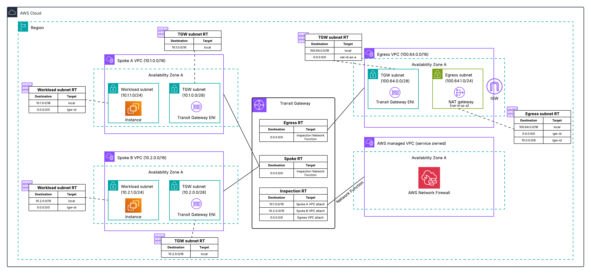
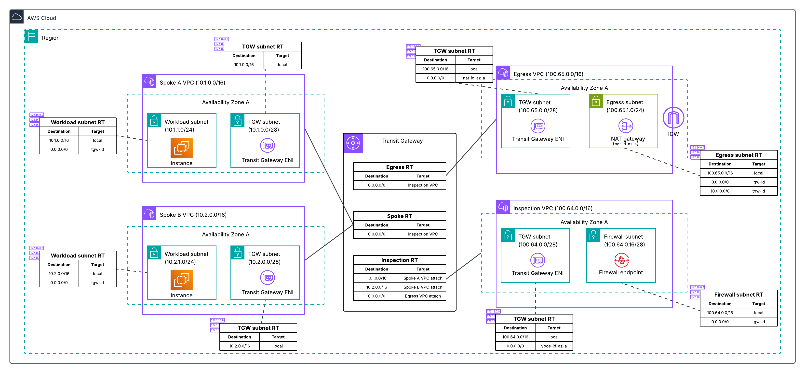
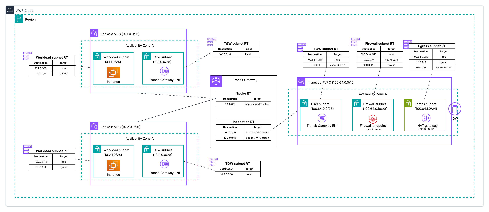
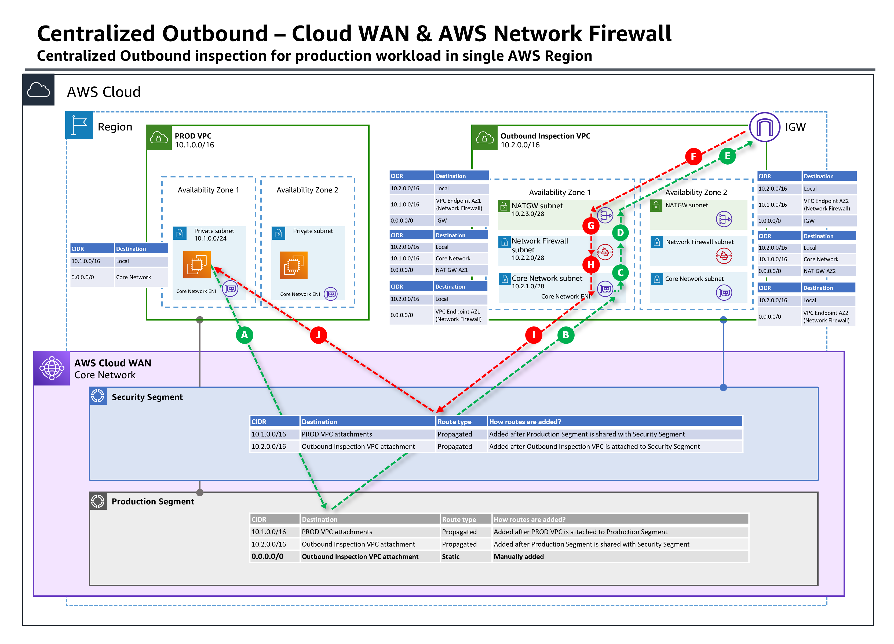
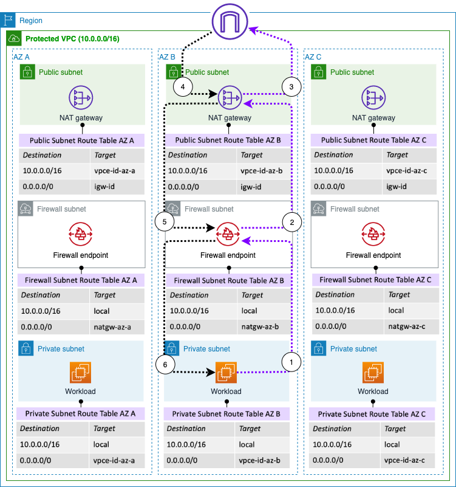
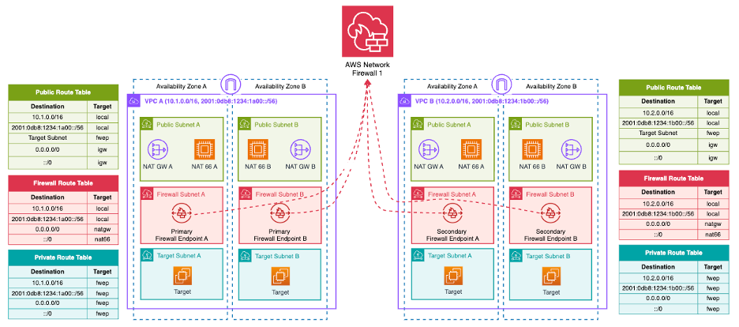
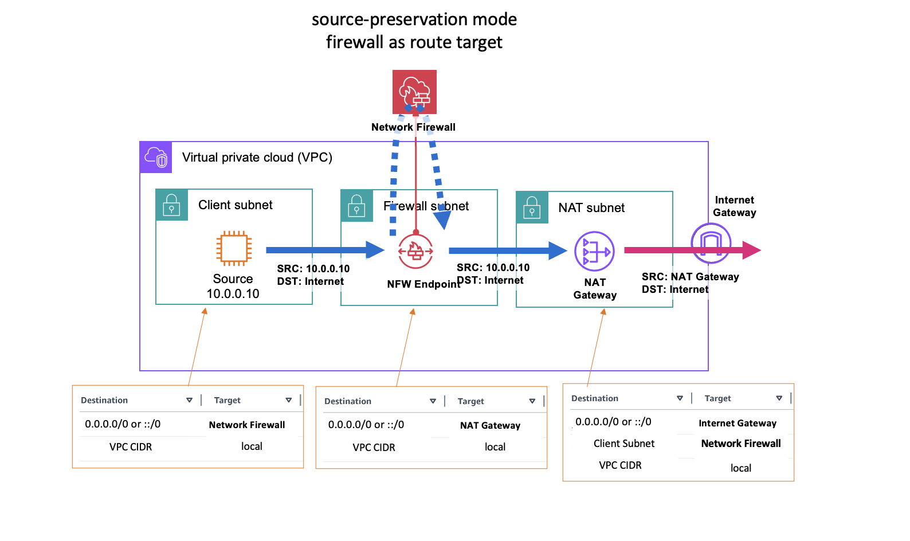

# Deployment architecture

!!! info "Prerequisites"
    This section assumes familiarity with [Prerequisites and fundamentals](../../prerequisites/docs/index.md). Review that topic first if you are new to AWS Network Firewall concepts.

AWS Network Firewall supports centralized, distributed, and combined deployment models, with centralized inspection being the recommended starting point for multi-account environments because it minimizes endpoint costs and simplifies policy management. Choosing the right architecture impacts cost, scalability, blast radius, and operational complexity.

For sample CloudFormation and Terraform templates implementing these models, see the [aws-networkfirewall-cfn-templates](https://github.com/aws-samples/aws-networkfirewall-cfn-templates) and [aws-network-firewall-terraform](https://github.com/aws-samples/aws-network-firewall-terraform) repositories.

## Centralized deployment models

Centralized deployment places Network Firewall in a hub position where traffic from multiple spoke VPCs is routed through a single set of firewall endpoints. This is the most common and recommended pattern for multi-account environments.

### Centralizing with Transit Gateway native attachment

AWS Network Firewall supports [native integration with AWS Transit Gateway](https://aws.amazon.com/about-aws/whats-new/2025/07/aws-network-firewall-native-transit-gateway-support/) that attaches a firewall directly to a Transit Gateway as a network function attachment, eliminating the need to create and manage a dedicated inspection VPC. This is the recommended centralized model for new deployments.

For a detailed walkthrough of architectural patterns with this feature, see [Deployment models for AWS Network Firewall: Transit Gateway attachment and multiple VPC endpoints](https://aws.amazon.com/blogs/networking-and-content-delivery/deployment-models-for-aws-network-firewall-transit-gateway-attachment-and-multiple-vpc-endpoints/).

You specify a Transit Gateway when creating the firewall (no VPC required), and AWS creates and manages an internal VPC containing the firewall endpoints, subnets, and Transit Gateway attachment. Transit Gateway appliance mode is automatically activated, providing symmetric routing without manual configuration. You configure static routes on Transit Gateway route tables to direct traffic through the firewall attachment.

This model supports East-West (VPC-to-VPC) inspection, centralized internet egress (requires a separate egress VPC with NAT gateway and internet gateway), and combined egress plus East-West through a single firewall.

Supports [Flexible Cost Allocation for Transit Gateway](https://docs.aws.amazon.com/vpc/latest/tgw/metering-policy.html) to charge back account owners for traffic they send through the centralized firewall. This cost allocation capability is only available with Transit Gateway-attached firewalls.



For migration guidance from a traditional inspection VPC to native TGW attachment, see [Why and how to migrate to a Transit Gateway-attached AWS Network Firewall](https://aws.amazon.com/blogs/security/why-and-how-to-migrate-to-a-transit-gateway-attached-aws-network-firewall/).

### Centralizing with an inspection VPC

This is the original centralized model that existed before Transit Gateway native attachment. Network Firewall is deployed into a customer-managed inspection VPC attached to Transit Gateway. You create and manage the VPC, subnets, firewall endpoints, and route tables yourself.

!!! tip "Best practice"
    For new centralized deployments, prefer the [native Transit Gateway attachment](#centralizing-with-transit-gateway-native-attachment) over a customer-managed inspection VPC. Only choose an inspection VPC when you have one of the specific requirements listed below. If you already run an inspection VPC and none of those requirements apply to you, see the [migration blog](https://aws.amazon.com/blogs/security/why-and-how-to-migrate-to-a-transit-gateway-attached-aws-network-firewall/).

**What you give up by using an inspection VPC:**

* **Flexible cost allocation for Network Firewall charges.** Transit Gateway metering policies can only charge back Network Firewall data processing to the account that generated the traffic when the firewall is natively attached to Transit Gateway. With an inspection VPC you can allocate the Transit Gateway data processing charges, but not the Network Firewall charges. For many central security teams this is the difference between a chargeback model and absorbing the whole bill.
* **The infrastructure AWS would otherwise manage for you.** You own the VPC, the firewall subnets in each AZ, the inspection VPC route tables, the Transit Gateway attachment, and the route table associations and propagations that steer traffic in and back out. With native attachment, AWS provisions and manages all of that in a service-managed VPC.
* **Automatic appliance mode.** Native attachments enable Transit Gateway appliance mode automatically. With an inspection VPC you have to remember to enable it, and forgetting is a common source of asymmetric routing that silently degrades inspection.

**When an inspection VPC is still the right choice:**

* When you need access to PrivateLink endpoint metrics and VPC flow logs for the firewall endpoint ENIs, which are not available for the service-managed VPC used by native attachments
* When you need centralized ingress inspection (placing the firewall between an internet gateway and a load balancer within the inspection VPC)
* When you require Transit Gateway encryption, which native Network Firewall attachment does not currently support
* When you require specialized routing not supported by the native integration

Enable [TGW appliance mode](https://docs.aws.amazon.com/network-firewall/latest/developerguide/vpc-config.html) on the inspection VPC attachment to ensure symmetric routing. Without it, return traffic could land on an endpoint in a different AZ, preventing correct traffic evaluation.



You can also place the NAT gateway in the same inspection VPC as the firewall, combining inspection and egress into a single VPC:



### Centralizing with Cloud WAN and service insertion

[AWS Cloud WAN](https://aws.amazon.com/cloud-wan/) can serve as the routing hub instead of Transit Gateway. In this model, Network Firewall is deployed into an inspection VPC and Cloud WAN's [service insertion](https://docs.aws.amazon.com/network-manager/latest/cloudwan/cloudwan-policy-service-insertion.html) feature directs traffic through the firewall.

**When to use:**

* Organizations already using Cloud WAN as their global network backbone
* When you need Cloud WAN's global routing capabilities (multi-Region network segmentation, dynamic routing policies)



For a detailed walkthrough of this pattern, see [Centralized outbound inspection architecture in AWS Cloud WAN](https://aws.amazon.com/blogs/networking-and-content-delivery/centralized-outbound-inspection-architecture-in-aws-cloud-wan/).

## Distributed deployment models

Distributed deployment places firewall endpoints directly in the VPCs that need inspection, keeping traffic local and avoiding Transit Gateway or Cloud WAN data processing charges.

### Distributed with dedicated firewall endpoints

Network Firewall is deployed into each individual VPC that requires inspection, with each VPC having its own firewall and firewall policy.

**When to use:**

* Single-account or few-account environments
* When specific workloads require dedicated inspection with independent failure domains
* When Transit Gateway data processing charges for a high-throughput workload exceed the cost of additional firewall endpoints
* When workloads have unique firewall policies that cannot share a centralized policy

Each VPC requires its own firewall endpoints (one per AZ for high availability), which results in higher total endpoint hourly costs in multi-VPC environments. Can be managed centrally via [AWS Firewall Manager](https://docs.aws.amazon.com/firewall-manager/latest/userguide/what-is-fms.html) for policy enforcement across accounts.



!!! warning "Cost at scale"
    In a multi-account environment with many VPCs, distributed deployment with dedicated firewalls becomes expensive. For example, 10 VPCs across 3 AZs requires 30 endpoints and 10 separate firewalls, compared to a centralized model with 3 endpoints (one per AZ). See the [Network Firewall pricing](https://aws.amazon.com/network-firewall/pricing/) page for current per-endpoint rates.

### Distributed with multiple VPC endpoint associations

The [multiple VPC endpoint associations](https://aws.amazon.com/about-aws/whats-new/2025/05/aws-network-firewall-multiple-vpc-endpoints/) feature solves the distributed model's cost and management problems by allowing up to 50 secondary endpoints per AZ to share a single primary firewall. This provides distributed endpoints (AZ-local inspection in each spoke VPC) with centralized management (one firewall, one policy, one rule set).

For a detailed walkthrough of architectural patterns with this feature, see [Deployment models for AWS Network Firewall: Transit Gateway attachment and multiple VPC endpoints](https://aws.amazon.com/blogs/networking-and-content-delivery/deployment-models-for-aws-network-firewall-transit-gateway-attachment-and-multiple-vpc-endpoints/).

A primary firewall is created in one account/VPC, and secondary endpoints are associated in other VPCs (same account or cross-account via AWS RAM). All endpoints share the same firewall policy and rule groups. Secondary endpoints are charged at a reduced hourly rate.



**Architectural constraint for egress:**

Multi-endpoint support is designed for **distributed egress** architectures where each account maintains its own internet egress infrastructure (NAT gateway + internet gateway). The shared firewall provides centralized inspection and policy enforcement, but the egress infrastructure remains account-specific.

* **Supported:** Spoke VPC > Firewall endpoint (secondary) > NAT gateway (spoke account) > internet gateway (spoke account)
* **Not supported:** Spoke VPC > Firewall endpoint (secondary) > NAT gateway (hub account) > internet gateway (hub account)

**Key limitations:**

* TLS inspection is not supported for firewalls with VPC endpoint associations
* East-West inspection is limited to traffic within the same AZ
* All endpoints (primary + secondary) share combined throughput capacity per AZ
* Secondary endpoints can only be deployed in AZs where the primary firewall already has an endpoint

## Combined deployment models

A combined model runs a centralized firewall for East-West and egress traffic while also deploying separate firewalls in specific VPCs for internet ingress inspection. It appears in older deployment model guidance as a way to get centralized cost efficiency for most traffic and dedicated inspection where it is needed.

!!! tip "Best practice"
    We do not recommend a combined deployment model as a starting point. Running two deployment models side by side means two sets of endpoints to pay for, two sets of routing to reason about, and firewall policies that have to be kept coherent with each other. It also inherits the [limitations of a customer-managed inspection VPC](#centralizing-with-an-inspection-vpc), including the loss of flexible cost allocation for Network Firewall charges.

Before reaching for a combined model, check whether the requirement that is driving it can be met another way:

* **Web application ingress.** Amazon CloudFront with AWS WAF in front of your origin is the recommended architecture for HTTP and HTTPS ingress, and it does not require a firewall in the ingress path at all. See [Ingress patterns](../../../firewall-overview/ingress-patterns/docs/index.md).
* **Non-HTTP ingress inspection.** Centralized ingress inspection is one of the cases where a [customer-managed inspection VPC](#centralizing-with-an-inspection-vpc) is still appropriate, and it can handle both ingress and egress in a single centralized firewall.
* **A workload that needs its own policy or its own failure domain.** [Multiple VPC endpoint associations](#distributed-with-multiple-vpc-endpoint-associations) give you AZ-local endpoints in individual VPCs while keeping one firewall and one policy, which covers most of what people reach for a combined model to achieve.

If you do end up running more than one deployment model, keep the number of distinct firewall policies as small as possible and manage them from the same infrastructure as code repository so they cannot drift apart.

## AWS Network Firewall Proxy

!!! note "Preview"
    AWS Network Firewall Proxy is currently in preview. Features and behavior may change before general availability.

[AWS Network Firewall Proxy](https://aws.amazon.com/blogs/networking-and-content-delivery/reintroducing-network-firewall-proxy-for-secure-egress-connectivity/) is an explicit proxy capability built directly into Network Firewall. Rather than transparently intercepting traffic via routing (the default deployment mode), Network Firewall Proxy requires clients to explicitly configure a proxy endpoint. The key difference from the initial preview is that the proxy is now a function of Network Firewall itself, not a separate product. This means you use the same firewall policy, same rule groups, and same management plane for both transparent firewall and explicit proxy use cases.

### How it works

Network Firewall Proxy uses a new deployment mode called `no-source-preservation`. In this mode, the firewall is attached to a NAT gateway. Traffic flows from the client to the firewall endpoint, the firewall inspects and filters the traffic, then uses the attached NAT gateway's IP address to communicate with the upstream destination on the client's behalf.



*Default Network Firewall deployment (source-preservation): firewall as route target*

In `no-source-preservation` mode, clients configure their workloads to send traffic to the firewall's FQDN (provided after firewall creation). The hostname resolves to a local VPC endpoint, so no route table changes are required for proxied traffic. On Linux, this is typically done with environment variables:

```
export https_proxy="https://<nfw_hostname>:<port>"
export http_proxy="https://<nfw_hostname>:<port>"
```

### What the proxy supports

Because the proxy is integrated directly into Network Firewall, it supports the full set of Network Firewall capabilities:

* Stateful and stateless rules engine (all Suricata rules work as-is)
* AWS managed rule groups (threat signatures, ATD, domain/IP reputation)
* TLS inspection
* URL and domain category filtering
* Geographic IP filtering
* Container attribute-based rules
* Logging and monitoring (with additional proxy-specific fields like requested domain from CONNECT)

### When to use Network Firewall Proxy

* Environments that already use explicit proxy configurations (corporate environments, containerized workloads with proxy environment variables)
* When you need to centralize egress from networks with overlapping CIDRs (the `no-source-preservation` mode handles this natively)
* When you want the same security policy to apply to both transparently inspected traffic and explicitly proxied traffic without maintaining separate configurations

### Architecture patterns

The `no-source-preservation` firewall can protect proxied traffic from the local VPC, remote VPCs, or on-premises sources. As long as the workload has connectivity to the Network Firewall endpoint, it can use the proxy functionality. Traffic can only reach the firewall through an endpoint; routing traffic directly to the NAT gateway does not apply Network Firewall policies.

For detailed setup instructions and architecture patterns, see [Reintroducing Network Firewall Proxy for Secure Egress Connectivity](https://aws.amazon.com/blogs/networking-and-content-delivery/reintroducing-network-firewall-proxy-for-secure-egress-connectivity/) and the [Network Firewall Proxy documentation](https://docs.aws.amazon.com/network-firewall/latest/developerguide/network-firewall-proxy-developer-guide.html).

## Managing across accounts with AWS Firewall Manager

[AWS Firewall Manager](https://docs.aws.amazon.com/firewall-manager/latest/userguide/what-is-fms.html) provides centralized policy management for Network Firewall across multiple accounts. It automatically deploys firewall endpoints and policies to new accounts and VPCs, and monitors compliance.

Firewall Manager is most valuable for **distributed deployment models** where you need to deploy and manage separate firewalls across many VPCs and accounts. For centralized deployments, Firewall Manager adds limited value because you already have a single firewall managed in one account. Most customers with centralized deployments manage their firewall policy through infrastructure as code (CloudFormation, Terraform, CDK) in a Git repository and do not see significant benefit from adding Firewall Manager as an additional abstraction layer above an already centralized resource.

**Use Firewall Manager when:**

* You have a distributed deployment with firewalls in many VPCs across accounts
* You need automatic deployment of firewall endpoints to new VPCs/accounts as they are created
* You need compliance monitoring and automatic remediation of policy drift across distributed firewalls

**Use direct management (IaC) when:**

* You have a centralized deployment with one firewall (or a small number) managed in a security account
* Your team already manages infrastructure as code and prefers Git-based change control

## Resource sharing with AWS RAM

[AWS Resource Access Manager (AWS RAM)](https://docs.aws.amazon.com/network-firewall/latest/developerguide/sharing.html) is used in several Network Firewall deployment patterns to share resources across accounts.

### Centralized deployment pattern

A security team in a central account owns and operates the firewall. AWS RAM shares the Transit Gateway so spoke accounts can create attachments and route traffic to the inspection path. The firewall policy, rule groups, and firewall itself remain in the central account and are not shared. Spoke accounts only need to route traffic through Transit Gateway. The central security team manages the firewall policy via IaC in a Git repository with change control.

### Distributed deployment pattern

A security team creates the firewall policy and rule groups centrally, then shares them to spoke accounts so each account can create its own firewall that references the shared policy. This enforces a **centralized control plane** (policy defined once, centrally) with a **distributed data plane** (firewall endpoints deployed locally in each spoke VPC). The central account retains ownership and can update shared resources. Changes propagate automatically to all consumers.

### Multi-endpoint pattern

The primary firewall owner shares the **firewall** via AWS RAM so spoke accounts can create secondary VPC endpoint associations. Spoke accounts create endpoints in their VPCs that route traffic to the shared firewall. The firewall owner retains full control over the policy and rule groups.

## What to read next

* [Firewall policy configuration](../../firewall-policy-configuration/docs/index.md) - Configure your firewall policy settings
* [Cost considerations](../../cost-considerations/docs/index.md) - Understand and optimize Network Firewall costs
* [Customer managed rules](../../customer-managed-rules/docs/index.md) - Write rules for your firewall policy
