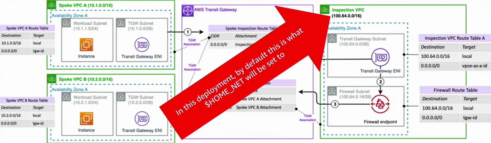

# 방화벽 정책 구성

!!! info "사전 요구 사항"
    이 섹션은 [사전 요구 사항 및 기본 사항](../../prerequisites/docs/index.md) 및 [배포 아키텍처](../../deployment-architecture/docs/index.md)에 대한 이해를 전제로 합니다. AWS Network Firewall이 처음이라면 해당 주제를 먼저 검토하세요.

[방화벽 정책](https://docs.aws.amazon.com/network-firewall/latest/developerguide/firewall-policies.html)은 AWS Network Firewall이 트래픽을 평가하고 처리하는 방법을 정의하는 중앙 리소스로, 규칙 순서, 일치하지 않는 트래픽에 대한 기본 동작, 규칙에서 사용되는 네트워크 변수, 중간 스트림 연결 및 유휴 타임아웃과 같은 엣지 케이스를 방화벽이 처리하는 방법을 제어합니다. 규칙을 작성하기 전에 이러한 설정을 올바르게 구성하면 나중에 디버그하기 어려운 동작을 방지할 수 있습니다.

## 규칙 순서: 항상 Strict 사용

Network Firewall은 Suricata 엔진이 상태 저장 규칙을 처리하는 방식에 대해 두 가지 옵션을 제공합니다:

* **[Strict](https://docs.aws.amazon.com/network-firewall/latest/developerguide/suricata-rule-evaluation-order.html#suricata-strict-rule-evaluation-order)** - 규칙이 정의한 순서대로 처리됩니다. 첫 번째 일치하는 규칙이 적용됩니다. 규칙 평가 우선순위를 완전히 제어할 수 있습니다.
* **[Action Order](https://docs.aws.amazon.com/network-firewall/latest/developerguide/suricata-rule-evaluation-order.html#suricata-default-rule-evaluation-order)** - Suricata의 기본 규칙 처리 모드로, 규칙을 작업별(pass, drop, reject, alert)로 그룹화합니다. 이 모드는 규칙 순서에 관계없이 작업 유형별로 규칙을 재정렬하므로, 다른 작업 유형의 규칙 간 우선순위를 제어할 수 없습니다.

!!! tip "모범 사례"
    항상 Strict 규칙 순서를 사용하세요. Action Order는 방화벽 배포에 사용하지 마세요. Action Order 모드에서 Suricata는 규칙을 작업 유형별로 재정렬합니다(pass 규칙 먼저, 그다음 drop, reject, alert 순). 이는 pass 규칙이 배치 위치에 관계없이 항상 drop 규칙보다 우선한다는 의미입니다. Strict 순서는 첫 번째 일치하는 규칙이 적용되는 결정론적이고 우선순위 기반의 평가를 제공하며, 이것이 방화벽에 필요한 방식입니다.

## 기본 작업

Strict 규칙 순서를 구성할 때, 어떤 규칙과도 일치하지 않는 트래픽에 대해 어떻게 처리할지 결정하는 "[기본 작업](https://docs.aws.amazon.com/network-firewall/latest/developerguide/suricata-rule-evaluation-order.html#suricata-strict-rule-evaluation-order-default)"을 선택합니다. 이는 규칙셋 하단의 암시적 거부입니다. 선택한 기본 작업은 모든 사용자 정의 및 관리형 규칙이 확인된 후 마지막으로 평가되는 규칙으로 추가됩니다.

기본 작업에는 두 가지 범주가 있습니다: 트래픽을 기록하는 "alert" 작업과 트래픽을 차단하는 "drop" 작업입니다. 각각 하나 이상을 선택할 수 있습니다. 기본 작업을 선택하지 않으면, 어떤 규칙과도 일치하지 않는 모든 트래픽이 검사 없이 방화벽을 통과합니다. 많은 고객이 트래픽이 흐르도록 광범위한 "pass any any" 규칙을 작성해야 한다고 생각하지만, 그렇지 않습니다. 기본 작업이나 일치하는 규칙이 없으면, 트래픽은 기본적으로 통과합니다.

!!! tip "모범 사례"
    기본 drop 작업으로 "Application drop established (server-directed only)"를 사용하세요. 차단된 트래픽이 기록되도록 항상 해당 alert 작업("Application alert established (server-directed only)")과 함께 사용하세요. alert 변형 없이는 생성된 drop 규칙에 `noalert` 키워드가 추가되어, 차단된 트래픽이 로그에 나타나지 않습니다.

!!! danger "일반적인 잘못된 구성"
    해당 alert 변형 없이 drop 기본 작업을 선택하면 차단된 트래픽이 로그 항목 없이 조용히 폐기됩니다. 활성화하는 모든 기본 작업에 대해 항상 drop과 alert 변형을 함께 선택하세요.

### 이 특정 기본 작업을 권장하는 이유

"Application drop established (server-directed only)"는 drop 결정을 내리기 전에 충분한 애플리케이션 계층 데이터(예: Client Hello의 TLS SNI 필드)를 확인할 때까지 대기합니다. 설정된 연결에서 클라이언트에서 서버로의 트래픽만 차단하므로, 허용된 플로우에 대한 서버에서 클라이언트로의 응답은 간섭 없이 통과합니다.

이것이 중요한 이유는 두 가지 일반적인 시나리오를 깔끔하게 처리하기 때문입니다:

1. **도메인 기반 필터링이 올바르게 작동합니다.** 방화벽은 도메인 정보가 사용 가능하기 전에 TCP 핸드셰이크를 차단하는 대신, TLS Client Hello(도메인 이름 포함)를 기다린 후 차단 여부를 결정합니다.
2. **응답 트래픽에 대한 간섭이 없습니다.** 서버에서 클라이언트로의 TCP 제어 패킷(윈도우 업데이트, 킵얼라이브, RST) 및 서버 시작 배너(FTP 인사말, SMTP 배너, SSH 핸드셰이크)는 클라이언트에서 서버로의 트래픽만 차단 대상이므로 자유롭게 통과합니다.

또한 하이브리드 암호 키 교환으로 인해 Client Hello 메시지가 여러 패킷으로 분할될 수 있는 포스트 양자 TLS 구현도 올바르게 처리합니다. TCP 핸드셰이크 직후 트래픽을 차단하는 대신, 애플리케이션 계층 데이터가 재조립될 때까지 대기합니다.

### 다른 기본 작업이 덜 적합한 이유

**"Drop all"** 은 Suricata가 TLS SNI 및 HTTP 호스트 헤더와 같은 애플리케이션 계층 속성을 검사하기 전에 트래픽을 차단합니다. 명시적 pass 규칙을 작성하지 않으면 TCP 3-way 핸드셰이크 패킷이 차단되며, Suricata가 TLS Client Hello를 보지 못하기 때문에 도메인 기반 필터링이 중단됩니다. 기본 프로토콜 협상을 허용하기 위해 많은 추가 규칙을 작성해야 합니다.

**"Alert all"** 은 TCP 핸드셰이크의 모든 단계를 포함하여 Suricata가 처리하는 모든 패킷에 대해 로그 항목을 생성합니다. 이는 저장 비용이 높고 구문 분석이 어려운 엄청난 양의 로그 항목을 생성합니다. 대부분의 환경에서 신호보다 훨씬 많은 노이즈를 생성합니다.

**"Application drop established (bidirectional)"** 은 양방향으로 트래픽을 차단하여 서버에서 클라이언트로의 TCP 제어 패킷 및 서버 시작 배너를 방해할 수 있습니다. 이러한 플로우의 중단을 방지하려면 [추가 pass 규칙](https://docs.aws.amazon.com/network-firewall/latest/developerguide/suricata-rule-evaluation-order.html#suricata-strict-rule-evaluation-order-default)을 추가해야 합니다. server-directed only 변형은 이를 완전히 방지합니다. "Application drop established (server-directed only)"를 사용하면 추가 규칙을 건너뛸 수 있습니다.

### 대안: 사용자 정의 기본 차단 규칙

[샘플 Suricata 규칙](../../sample-suricata-rules/docs/index.md#custom-default-block-rules) 페이지의 사용자 정의 기본 차단 규칙은 정책 수준 기본 작업과 동일한 목적을 수행하지만 추가 제어를 제공합니다. TLS 트래픽이 차단될 때 JA4 해시를 기록하고, 로그 메시지에서 이그레스와 인그레스 트래픽을 구분하며, 이그레스 트래픽에 대해 TCP RST(reject)를 보내고 인그레스 트래픽은 조용히 차단합니다.

사용자 정의 기본 차단 규칙을 사용하는 경우, 정책 수준 기본 drop 작업도 선택하지 마세요. 동일한 목적을 수행하며 둘 다 사용하면 중복 로그 항목이 생성됩니다. 전체 구현은 [샘플 Suricata 규칙](../../sample-suricata-rules/docs/index.md) 페이지를 참조하세요.

## $HOME_NET 및 $EXTERNAL_NET 변수

$HOME_NET과 $EXTERNAL_NET은 Suricata 규칙이 내부 네트워크와 외부 트래픽을 구분하는 데 사용하는 [규칙 변수](https://docs.aws.amazon.com/network-firewall/latest/developerguide/rule-variables.html)입니다. 규칙은 소스 및 대상 필드에서 이러한 변수를 참조하여(예: `alert tcp $HOME_NET any -> $EXTERNAL_NET any`) 어떤 방향의 트래픽을 검사할지 제어합니다. $HOME_NET에 모든 내부 CIDR 범위가 포함되지 않으면, 이를 참조하는 규칙은 해당 범위의 트래픽을 조용히 놓칩니다.

$HOME_NET은 방화벽 정책 수준에서 재정의할 수 있는 유일한 변수입니다. 이것이 중요한 이유는 $EXTERNAL_NET이 정책 수준에서 설정된 $HOME_NET의 역으로 자동 계산되기 때문입니다. $EXTERNAL_NET을 수동으로 설정할 필요가 없습니다. 정책 수준에서 $HOME_NET을 올바르게 설정하면 $EXTERNAL_NET은 자동으로 처리됩니다.

### $HOME_NET이 중요한 이유

기본적으로 $HOME_NET은 Network Firewall이 배포된 VPC의 CIDR 범위로 설정됩니다. 방화벽이 여러 스포크 VPC의 트래픽을 검사하는 중앙 집중식 배포에서, 이 기본값은 검사 VPC CIDR만 포함하고 스포크 VPC는 포함하지 않습니다. $HOME_NET에 없는 스포크 VPC CIDR에서 발생하는 트래픽은 소스 필드에 `$HOME_NET`이 있는 규칙과 일치하지 않습니다.

*Network Firewall HOME_NET 변수 기본값(검사 VPC CIDR만 표시)*

이것은 AWS 관리형 위협 서명 규칙 그룹에 특히 중요합니다. 이 규칙들은 $HOME_NET과 $EXTERNAL_NET 사이를 흐르는 트래픽에서 위협을 탐지하도록 작성되었습니다. 스포크 VPC CIDR이 $HOME_NET에 없으면, 관리형 위협 서명이 해당 VPC의 트래픽에 대해 작동하지 않아 보호되지 않은 상태로 남게 됩니다.

!!! danger "일반적인 잘못된 구성"
    고객들이 관리형 위협 서명 규칙 그룹을 배포하고 작동하는 것을 보지 못한 후, 규칙이 작동하지 않는다고 가정합니다. 가장 일반적인 원인은 $HOME_NET이 워크로드가 실제로 실행되는 스포크 VPC CIDR이 아닌 검사 VPC CIDR(기본값)만 포함하고 있기 때문입니다. 해당 스포크 VPC의 트래픽은 $HOME_NET을 참조하는 규칙과 일치하지 않으므로 관리형 규칙이 이를 조용히 무시합니다.

### 정책 수준에서 $HOME_NET 설정

!!! tip "모범 사례"
    방화벽 정책 수준에서 $HOME_NET을 모든 RFC 1918 사설 IP 주소 범위로 설정하세요: 10.0.0.0/8, 172.16.0.0/12, 192.168.0.0/16. 규칙 그룹 수준에서 $HOME_NET을 설정하지 마세요. 이 접근 방식은 향후 추가하는 VPC에 관계없이 방화벽을 통해 흐르는 모든 사설 IP 트래픽을 포함하며, 정책 수준과 규칙 그룹 수준 변수 정의 간의 충돌을 방지합니다.

이 구성은 다음을 의미합니다:

* 모든 사설 IP 트래픽이 $HOME_NET과 일치하므로, $HOME_NET을 참조하는 관리형 규칙 및 사용자 정의 규칙이 방화벽을 통해 라우팅되는 모든 VPC의 트래픽을 검사합니다.
* $EXTERNAL_NET은 자동으로 역(모든 비 RFC 1918 주소)으로 설정되므로, 외부 트래픽을 대상으로 하는 규칙이 추가 구성 없이 올바르게 작동합니다.
* 환경에 새 VPC 또는 스포크 계정을 추가할 때 변수를 업데이트할 필요가 없습니다.

### 규칙 그룹 수준에서 $HOME_NET을 재정의하지 마세요

Network Firewall은 규칙 그룹 수준에서 $HOME_NET을 재정의할 수 있지만, 이렇게 하면 복잡성과 일반적인 잘못된 구성이 발생합니다. 규칙 그룹 수준에서 $HOME_NET을 설정하면, $EXTERNAL_NET은 규칙 그룹의 $HOME_NET의 역으로 자동 재계산되지 **않습니다**. **정책 수준** $HOME_NET의 역으로 유지됩니다. 즉, 불일치를 방지하기 위해 규칙 그룹 수준에서 $EXTERNAL_NET도 수동으로 설정해야 하며, 값을 변경할 때마다 둘 다 동기화 상태를 유지해야 합니다.

!!! tip "모범 사례"
    규칙 그룹 수준 변수 재정의를 완전히 피하세요. 정책 수준에서 $HOME_NET을 RFC 1918 범위로 한 번 설정하면, 모든 규칙 그룹이 $HOME_NET과 $EXTERNAL_NET 모두에 대해 올바른 값을 자동으로 상속합니다. 이렇게 하면 전체 잘못된 구성 범주가 제거됩니다.

규칙 그룹 변수 동작에 대한 자세한 내용은 [규칙 그룹에서 규칙 변수 재정의](https://docs.aws.amazon.com/network-firewall/latest/developerguide/rule-variables.html#rule-variables-override)를 참조하세요.

### 동서 트래픽 검사

$HOME_NET을 모든 RFC 1918 범위로 설정해도 관리형 위협 서명 규칙이 동서(내부 간) 트래픽을 검사하는 것을 방지하지 않습니다. AWS 관리형 위협 서명 규칙 그룹은 각 규칙에 [배포 태그](https://community.emergingthreats.net/t/signature-metadata/96)를 사용하여 의도된 검사 범위를 나타냅니다. `deployment Internal`로 태그된 규칙은 조직 내 동서 트래픽을 모니터링하고 수평 이동을 탐지하도록 특별히 설계되었습니다. 이러한 규칙은 $HOME_NET이 내부 CIDR 범위를 포함하도록 올바르게 설정되어 있는 한 내부 간 플로우를 일치시키도록 작성되었습니다.

$HOME_NET을 모든 RFC 1918 범위로 설정하면, 내부 배포용으로 태그된 규칙이 추가 변수 구성 없이 VPC 간 수평 이동을 올바르게 일치시킵니다.

### 잘못 구성된 $HOME_NET 탐지

!!! tip "모범 사례"
    모든 Network Firewall 정책에 [$HOME_NET 탐지 규칙](../../sample-suricata-rules/docs/index.md#detect-home-net-misconfiguration)을 배포하세요. 소스와 대상 모두 $HOME_NET과 일치하지 않는 트래픽에 대해 알림을 보내, 변수 구성이 불완전할 수 있음을 나타냅니다. 이 규칙에서 알림이 발생하면 예상되는 모든 CIDR 범위가 $HOME_NET 변수에 포함되어 있는지 확인하여 조사하세요.

이 규칙은 flowbits를 사용하여 플로우가 어느 방향에서든 $HOME_NET과 일치했는지 기록한 다음, 어느 비트도 설정되지 않은 플로우에 대해 알림을 보냅니다. `tcp`가 아닌 `ip`에서 일치하므로 모든 IP 프로토콜을 다루며, 잘못 구성된 변수가 UDP 및 ICMP 트래픽에서도 나타납니다. 규칙과 함께 작동하는 방식에 대한 설명은 [$HOME_NET 잘못된 구성 탐지](../../sample-suricata-rules/docs/index.md#detect-home-net-misconfiguration)를 참조하세요.

## 스트림 예외 정책

[스트림 예외 정책](https://docs.aws.amazon.com/network-firewall/latest/developerguide/stream-exception-policy.html)은 Network Firewall이 중간 스트림으로 도착하는 TCP 트래픽, 즉 Suricata가 플로우에 대한 연결 상태를 갖지 않는 경우를 처리하는 방법을 결정합니다. 올바른 정책을 선택하면 보안(트래픽 재검사)과 가용성(기존 연결 유지) 간의 균형을 맞출 수 있습니다.

!!! tip "모범 사례"
    대부분의 프로덕션 환경에서는 스트림 예외 정책을 **Reject**로 설정하세요. Reject는 양쪽에 TCP RST를 보내 클라이언트가 재연결하도록 합니다. 새 연결은 현재 규칙에 대해 완전히 검사됩니다. TCP RST를 정상적으로 처리하는 애플리케이션(대부분의 최신 애플리케이션 및 SDK는 자동으로 재시도)에 대해 보안과 가용성의 최적 균형을 제공합니다.

| 정책 | 동작 | 적합한 환경 |
|--------|----------|----------|
| **Reject** | 양쪽에 TCP RST를 보내 클라이언트가 재연결하도록 합니다. 새 연결은 완전히 검사됩니다. | TCP RST를 처리하고 자동으로 재연결할 수 있는 대부분의 프로덕션 워크로드 |
| **Continue** | 중간 스트림 패킷을 통과시킵니다. Suricata가 해당 시점부터 플로우 추적을 시작하지만 애플리케이션 계층 검사가 제한될 수 있습니다. | 재시작에 사용자 개입이 필요하거나 RST에서 복구할 수 없는 애플리케이션 |
| **Drop** (기본값) | 중간 스트림 패킷을 조용히 차단합니다. TCP RST가 전송되지 않습니다. | 최고 보안 환경(그러나 장애 조치 중 클라이언트에 신호 없이 연결을 조용히 중단함) |

!!! warning "스트림 예외 정책 변경 시 방화벽이 재시작됩니다"
    스트림 예외 정책(또는 StatefulEngineOptions 설정)을 변경하면 방화벽 백엔드가 재시작되어 모든 기존 연결이 끊어집니다. 유지 보수 기간 중에 이 변경을 계획하세요.

### 중간 스트림 플로우의 일반적인 원인

중간 스트림 플로우는 Suricata가 상태가 없는 TCP 연결에 대한 패킷을 수신할 때 발생합니다. 가장 일반적인 원인은:

* **비대칭 라우팅** - 동일한 플로우의 트래픽이 여러 방화벽 인스턴스에 분산됩니다(예: 클라이언트에서 서버로의 패킷이 하나의 인스턴스를 통과하고 서버에서 클라이언트로의 패킷은 다른 인스턴스를 통과). 각 인스턴스는 한 방향만 보고 전체 세션 상태를 구축할 수 없습니다. 이것은 라우팅이 잘못 구성된 중앙 집중식 배포에서 가장 일반적인 원인입니다. 플로우 대칭을 유지하는 패턴은 [배포 아키텍처](../../deployment-architecture/docs/index.md)를 참조하세요.
* **스테이트리스 규칙 잘못된 구성** - 스테이트리스 규칙이 응답 트래픽에 대한 해당 규칙 없이 요청 트래픽을 스테이트풀 엔진으로 전달하면, 스테이트풀 엔진은 대화의 한 방향만 봅니다.

### 활성 플로우에 새 규칙 적용

새 차단 규칙을 추가하면 기본적으로 새 연결에만 적용됩니다. 이전에 허용된 이미 설정된 플로우는 Suricata가 이미 수락했기 때문에 계속 통과합니다. [Flow Flush](https://docs.aws.amazon.com/network-firewall/latest/developerguide/firewall-flow-operations.html)를 사용하여 특정 활성 플로우에 새 규칙을 적용하세요.

!!! tip "모범 사례"
    새 규칙을 즉시 적용해야 할 때 상태 테이블에서 특정 플로우를 선택적으로 제거하려면 Flow Flush를 사용하세요. Flow Flush는 특정 소스/대상 쌍을 대상으로 하므로 영향을 받는 플로우만 중단됩니다. 플러시되면 해당 플로우의 후속 패킷이 중간 스트림이 되어 스트림 예외 정책에 의해 처리됩니다. Reject로 설정된 경우 클라이언트는 TCP RST를 받고 재연결하며, 이 시점에서 새 규칙이 적용됩니다.

Flow Flush는 모든 활성 연결이 아닌 대상 플로우만 영향을 미치므로 전체 상태 테이블을 지우는 것보다 안전합니다. 구성 단계는 [플로우 작업을 사용한 방화벽 상태 테이블 관리](https://docs.aws.amazon.com/network-firewall/latest/developerguide/firewall-flow-operations.html)를 참조하세요.

!!! warning "프로덕션에서 전체 상태 테이블 지우기를 피하세요"
    스트림 예외 정책을 다른 값으로 변경한 다음 다시 되돌리면 전체 상태 저장 규칙 상태 테이블이 지워져 모든 활성 플로우가 재평가됩니다. 수백 개의 워크로드가 있는 프로덕션 환경에서는 모든 활성 연결이 동시에 중단됩니다. 대신 대상 수정을 위해 Flow Flush를 사용하세요.

### 스트림 예외 정책 활동 모니터링

!!! tip "모범 사례"
    지속적인 중간 스트림 플로우 활동을 탐지하기 위해 **StreamExceptionPolicyPackets**에 CloudWatch 알람을 생성하세요. 장애 조치 이벤트 후 클라이언트가 재연결하면서 짧은 급증이 예상되며 몇 초 내에 해결되어야 합니다. 지속적인 상승은 조사가 필요한 구성 문제(가장 일반적으로 비대칭 라우팅)를 나타냅니다.

주요 CloudWatch 지표:

* **StreamExceptionPolicyPackets** - 스트림 예외 정책에 의해 처리된 총 패킷. 기준선 이상의 지속적 값에 대해 알람을 설정하세요.
* **RejectedPackets** - TCP RST를 받은 패킷(Reject 정책 사용 시). 장애 조치 후 일시적 급증은 정상입니다.
* **DroppedPackets** - 조용히 차단된 패킷(Drop 정책 사용 시).

Continue 정책을 사용할 때는 정상 운영 중에 StreamExceptionPolicyPackets 값이 높을 수 있습니다. 기준선을 설정하고 편차에 대해 알림하세요. 전체 지표 참조는 [Network Firewall CloudWatch 지표](https://docs.aws.amazon.com/network-firewall/latest/developerguide/monitoring-cloudwatch.html)를 참조하세요.

## TCP 유휴 타임아웃

Network Firewall [TCP 유휴 타임아웃](https://docs.aws.amazon.com/network-firewall/latest/developerguide/firewall-policies.html#firewall-policy-stateful-engine-options)은 60-6000초 사이에서 구성할 수 있습니다(기본값: 350초). 이 설정은 기본 로드 밸런서와 스테이트풀 엔진 모두의 유휴 타임아웃을 동시에 조정합니다. UDP 유휴 타임아웃은 120초로 고정되어 있습니다.

!!! tip "모범 사례"
    단일 올바른 값은 없으므로, 다음 세 가지 규칙에 따라 설정하세요:

    1. **트래픽 경로에 NAT 게이트웨이가 있는 경우 350초를 초과하지 마세요.** NAT 게이트웨이의 자체 350초 타임아웃은 변경할 수 없으므로, 방화벽에서 더 높은 값을 설정하면 연결이 끊어지는 위치만 이동하며, 클라이언트에 신호 없이 끊어집니다. 이것이 350이 기본값인 이유입니다.
    2. **NAT 게이트웨이가 없는 경로의 경우, 타임아웃 값을 조정하기보다 TCP 킵얼라이브를 구성하세요.** 클라이언트 또는 서버에서 방화벽 타임아웃보다 짧은 간격으로 킵얼라이브를 설정하세요. 장기 동서 플로우, 데이터베이스 연결 풀, 영구 세션은 선택한 값에 관계없이 활성 상태를 유지하며, 이는 워크로드가 변경될 때마다 타임아웃을 조정하는 것보다 더 지속 가능한 수정입니다.
    3. **애플리케이션 동작을 변경할 수 없는 경우, 워크로드가 예상하는 가장 긴 유휴 기간보다 높게 타임아웃을 올리세요**, 최대 6000초까지. 장기 동서 플로우는 이를 수행하는 일반적이고 합법적인 이유입니다.

    어떤 경우든 인프라 코드에서 값을 명시적으로 설정하여, 상속된 기본값이 아닌 의도적 결정으로 읽히도록 하세요.

타임아웃을 더 높은 값(최대 6000초)으로 설정해도 성능에 큰 부정적 영향은 없습니다. 주요 고려 사항은 높은 값이 방화벽의 플로우 테이블에 연결 상태를 더 오래 유지하여 메모리를 사용한다는 것입니다. 대부분의 배포에서는 이것이 문제가 되지 않습니다. 차단되는 장기 유휴 연결(데이터베이스 풀, 영구 WebSocket 연결)이 있는 경우, 타임아웃을 늘리거나 유휴 타임아웃보다 짧은 간격으로 클라이언트/서버에서 TCP 킵얼라이브를 구성하는 것이 모두 유효한 솔루션입니다.

알아야 할 주요 상호 작용은 NAT 게이트웨이입니다. 트래픽 경로에 NAT 게이트웨이가 포함된 경우, NAT 게이트웨이에는 변경할 수 없는 고정 350초 유휴 타임아웃이 있습니다. 이 시나리오에서 방화벽 타임아웃을 350초보다 높게 설정하면, NAT 게이트웨이가 먼저 연결을 닫고, NAT 게이트웨이에 연결이 더 이상 존재하지 않으므로 후속 패킷이 방화벽 엔드포인트에서 차단됩니다. NAT 게이트웨이가 없는 경로에서는 값을 더 높게 설정할 수 있는 유연성이 있습니다.

참고로, 다른 AWS 서비스에도 Network Firewall과 상호 작용할 수 있는 자체 유휴 타임아웃이 있습니다:

* [NAT 게이트웨이](https://docs.aws.amazon.com/vpc/latest/userguide/nat-gateway-troubleshooting.html)(350초, 구성 불가)
* [Application Load Balancer](https://docs.aws.amazon.com/elasticloadbalancing/latest/application/application-load-balancers.html#connection-idle-timeout)(구성 가능)
* [Network Load Balancer](https://docs.aws.amazon.com/elasticloadbalancing/latest/network/edit-idle-timeout.html)(구성 가능)
* [EC2 연결 추적](https://docs.aws.amazon.com/AWSEC2/latest/UserGuide/security-group-connection-tracking.html#connection-tracking-timeouts)(ENI별 구성 가능)

## Flow Capture

[Flow Capture](https://docs.aws.amazon.com/network-firewall/latest/developerguide/firewall-flow-operations.html)를 사용하면 Suricata가 플로우 종료 후 플로우 로그 이벤트를 게시할 때까지 기다리지 않고, 튜플, 수명, 패킷 수, 바이트 수를 포함한 활성 플로우의 상위 수준 세부 정보를 쿼리할 수 있습니다.

!!! tip "모범 사례"
    초기 배포 또는 라우팅 변경 후 트래픽이 예상대로 방화벽을 통해 흐르는지 확인하려면 Flow Capture를 사용하세요. 트래픽을 생성하고 로그 이벤트를 기다릴 필요 없이 활성 플로우에 대한 즉각적인 가시성을 제공합니다. 변수 구성이 예상되는 모든 트래픽을 캡처하는지 검증하려면 위의 $HOME_NET 탐지 규칙과 함께 사용하세요.

## 다음 읽을 내용

* [고객 관리 규칙](../../customer-managed-rules/docs/index.md) - 여기서 구성한 정책 설정을 사용하여 효과적인 상태 저장 규칙 작성
* [AWS 관리형 규칙](../../aws-managed-rules/docs/index.md) - 관리형 규칙이 $HOME_NET 및 $EXTERNAL_NET을 사용하는 방법 이해
* [로깅 및 모니터링](../../logging-and-monitoring/docs/index.md) - 스트림 예외 정책 및 플로우 활동 모니터링
