# AWS Network Firewall ベストプラクティス

## はじめに

AWS Network Firewall ベストプラクティスガイドへようこそ。本ガイドは、VPC とワークロードを効率的に保護するための AWS Network Firewall の運用指針を提供することを目的としています。GitHub を通じて公開することで、サービスの機能強化やユーザーコミュニティからのフィードバックを迅速に反映できます。本ガイドは、単一アカウントで初めて Network Firewall をデプロイする場合でも、既存のマルチアカウントやマルチ VPC 環境で Network Firewall を最適化する方法を探している場合でも、有用な内容を提供できるよう設計されています。

## 本ガイドの使い方

本ガイドは、AWS アカウント（およびリソース）内のセキュリティイベント、悪意のあるアクティビティ、脆弱性の監視と修復を担当するセキュリティ担当者を対象としています。ベストプラクティスは、理解しやすいように複数のカテゴリに分類されています。各カテゴリには、対応するベストプラクティスが含まれており、概要に続いて実装のための詳細な手順が記載されています。トピックは特定の順序で読む必要はありません。

* [開始方法](#開始方法)
  * [デプロイに関する考慮事項](#デプロイに関する考慮事項)
* [実装](#実装)
* [運用](#運用)
  * [対称ルーティングの確保](#対称ルーティングの確保)
  * [Strict ルール順序と 'Drop established' または 'Application drop established' および対応する 'Alert' デフォルトアクションの使用](#strict-ルール順序と-drop-established-または-application-drop-established-および対応する-alert-デフォルトアクションの使用)
  * [ステートレスルールよりもステートフルルールを使用](#ステートレスルールよりもステートフルルールを使用)
  * [UI 生成ルールの代わりにカスタム Suricata ルールを使用](#ui-生成ルールの代わりにカスタム-suricata-ルールを使用)
  * [カスタムルールグループの数を最小限に抑える](#カスタムルールグループの数を最小限に抑える)
  * [$HOME_NET 変数が正しく設定されていることを確認](#home_net-変数が正しく設定されていることを確認)
  * [許可されたトラフィックをログに記録するために Pass ルールの前に Alert ルールを使用](#許可されたトラフィックをログに記録するために-pass-ルールの前に-alert-ルールを使用)
  * [ステートフルルールで "flow:to_server" キーワードを使用](#ステートフルルールで-flowto_server-キーワードを使用)
  * [新しいステートフルファイアウォールルールを既存のフローに適用する方法](#新しいステートフルファイアウォールルールを既存のフローに適用する方法)
  * [ログ記録とモニタリングの設定](#ログ記録とモニタリングの設定)
  * [AWS Network Firewall を使用したクライアント側 TLS SNI 操作の緩和オプション](#aws-network-firewall-を使用したクライアント側-tls-sni-操作の緩和オプション)
* [コストに関する考慮事項](#コストに関する考慮事項)
* [非対称転送に関するステートレスルールのトラブルシューティング](#非対称転送に関するステートレスルールのトラブルシューティング)
* [リソース](#リソース)

## AWS Network Firewall とは

AWS Network Firewall は、すべての [Amazon Virtual Private Cloud (VPC)](https://aws.amazon.com/vpc/) に対して、L3〜L7 のディープパケットインスペクション保護を簡単にデプロイできるマネージドサービスです。VPC のサブネットレベルでトラフィックをフィルタリングでき、インターネットゲートウェイ、NAT ゲートウェイ、VPN、または AWS Direct Connect を経由するトラフィックのフィルタリングも可能です。

## AWS Network Firewall を有効にするメリット

AWS Network Firewall は、お客様固有のワークロードを保護するためのカスタムファイアウォールルールを構築できる、非常に柔軟なルールエンジンを備えています。数千のルールをサポートし、ポート、プロトコル、FQDN/ドメインに基づいてルールを定義できます。Suricata 形式のルールをサポートしているため、パケットサイズやバイトマッチパターンなどの特定のネットワークトラフィック特性に基づいたカスタムルールを作成できます。また、[AWS マネージドドメインリスト](https://docs.aws.amazon.com/ja_jp/network-firewall/latest/developerguide/stateful-rule-groups-domain-names.html)と脅威シグネチャも提供されるため、独自の Suricata IPS ルールの作成やメンテナンスは不要です。

## 開始方法

このセクションでは、AWS インフラストラクチャで AWS Network Firewall を有効化する前に考慮すべき事項について説明します。

### デプロイに関する考慮事項

AWS Network Firewall を初めてデプロイする際、すべての機能を確認せずにすぐに設定を始めたくなるかもしれません。例えば、各 VPC にエンドポイントをデプロイしたり、マネージドルールのみを使用したり、Alert ルールを使用しないといったケースがあります。[Network Firewall のドキュメント](https://docs.aws.amazon.com/ja_jp/network-firewall/latest/developerguide/what-is-aws-network-firewall.html)を事前に確認することで、後々大幅な時間の節約につながります。

まず、Network Firewall デプロイの 3 つの主要なアーキテクチャパターンを理解し、ご自身の環境に最適なものを選択する必要があります。

* 分散デプロイモデル — Network Firewall を各 VPC に個別にデプロイします。
* 集中デプロイモデル — East-West（VPC 間）または North-South（インターネットやオンプレミスからのインバウンドおよびアウトバウンド）トラフィック用に、AWS Transit Gateway インスタンスに接続された集中型 VPC に Network Firewall をデプロイします。この VPC を検査 VPC と呼びます。
* 複合デプロイモデル — East-West（VPC 間）および一部の North-South（オンプレミス、エグレス）トラフィック用に、集中型検査 VPC に Network Firewall をデプロイします。インターネットからのインバウンドアクセスが必要な VPC にはインターネットイングレスを分散し、それに応じて Network Firewall をデプロイします。

デプロイモデルの詳細については、[AWS Network Firewall のデプロイモデルに関するブログ記事](https://aws.amazon.com/jp/blogs/news/networking-and-content-delivery-deployment-models-for-aws-network-firewall/)を参照してください。

## 実装

このセクションでは、AWS Network Firewall をデプロイするための最小要件について説明します。

Network Firewall をデプロイするには、1 つの VPC と 1 つのサブネットがあれば十分ですが、耐障害性のために、ワークロードが存在する各アベイラビリティーゾーンにファイアウォールエンドポイント/サブネットをデプロイすることを強くお勧めします。

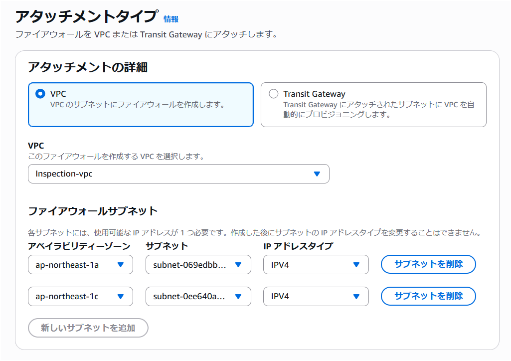

*図 1: Network Firewall VPC 設定*

独自のキーで Network Firewall の設定データを保管時に暗号化する場合は、KMS キーを指定する必要があります。

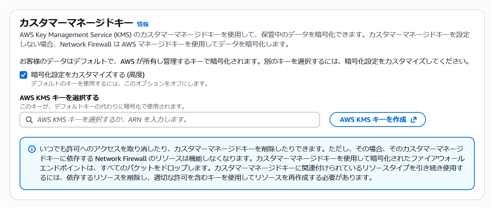

*図 2: Network Firewall CMK 設定*

デプロイの詳細については、[Network Firewall の開始方法に関するドキュメント](https://docs.aws.amazon.com/ja_jp/network-firewall/latest/developerguide/what-is-aws-network-firewall.html)を参照してください。


トラフィックの中断を最小限に抑えたい本番環境に AWS Network Firewall を実装する場合は、[ストリーム例外ポリシーオプション](https://docs.aws.amazon.com/ja_jp/network-firewall/latest/developerguide/stream-exception-policy.html)を「Continue」または「Reject」に設定し、デフォルトのブロックアクションを使用しないことをお勧めします。「Drop」オプションは、ミッドストリームフローを通知なしにブロックし、TCP Reset を送信しないため、本番トラフィックへの影響がより大きくなる可能性があります。

## 運用

### 対称ルーティングの確保

Network Firewall は非対称ルーティングをサポートしていないため、VPC で対称ルーティングが設定されていることを確認する必要があります。VPC に Network Firewall をデプロイする際は、トラフィックが検査されるようにファイアウォールエンドポイントを経由するようルートテーブルを変更する必要があります。ルートテーブルは、双方向でファイアウォールエンドポイントへのネットワークフローを考慮する必要があります。

集中デプロイ構成で [AWS Transit Gateway (TGW)](https://aws.amazon.com/transit-gateway/) を使用し、Network Firewall で VPC 間の East-West トラフィックを検査する場合、検査 VPC のアタッチメントに対して [TGW のアプライアンスモードオプション](https://docs.aws.amazon.com/ja_jp/network-firewall/latest/developerguide/vpc-config.html)を有効にする必要があります。アプライアンスモードは AWS コンソールおよび API で有効化できます。

アプライアンスモードが有効になっていない場合、リターンパスのトラフィックが別のアベイラビリティーゾーンのエンドポイントに到達する可能性があり、Network Firewall がファイアウォールポリシーに基づいてトラフィックを正しく評価できなくなります。

### Strict ルール順序と 'Drop established' または 'Application drop established' および対応する 'Alert' デフォルトアクションの使用

* Network Firewall には、Suricata エンジンがルールを処理する方法について 2 つのオプションがあります。
  * 「Strict」オプションは、定義した順序でルールを処理するよう Suricata に指示するため推奨されます。
  * 「Action Order」オプションは、IDS のユースケースには適していますが、一般的なファイアウォールのユースケースには適さない Suricata のデフォルトのルール処理をサポートします。
* Strict ルール順序を選択すると、すべてのルールの末尾で実行される「デフォルト」アクションも選択できます。このアクションは、それ以前のルールに一致しなかったトラフィックに適用されます。デフォルトアクションには主に 2 つのアプローチがあります:

#### 'Drop all' ではなく 'Drop established' を使用する理由

「Drop established」が「Drop all」よりも推奨される理由は、Suricata エンジンがドロップの判断を行う前にレイヤー 7 の検査を実行できるためです。これは、TLS SNI や HTTP ホストヘッダーフィールドのドメイン情報に一致する pass ルールにとって非常に重要です。「Drop all」を使用すると、Suricata がこれらのアプリケーションレイヤー属性を検査する前にトラフィックがドロップされてしまいます。

#### Drop established

「Drop established」はよりシンプルなオプションであり、ほとんどのデプロイにとって良い出発点です。以前のルールに一致しない確立済み接続のトラフィックをすべてドロップしつつ、ドメインベースのフィルタリングに必要なレイヤー 7 の検査を許可します。

対応する「Alert established」アクションも必ず選択してください。これを選択しないと、デフォルトアクションによってドロップされたトラフィックがログに記録されません。「Alert established」はドロップアクションなしで単独で選択することもできます。これは、ルールを適用する前にどのトラフィックがドロップされるかを確認するのに便利です。

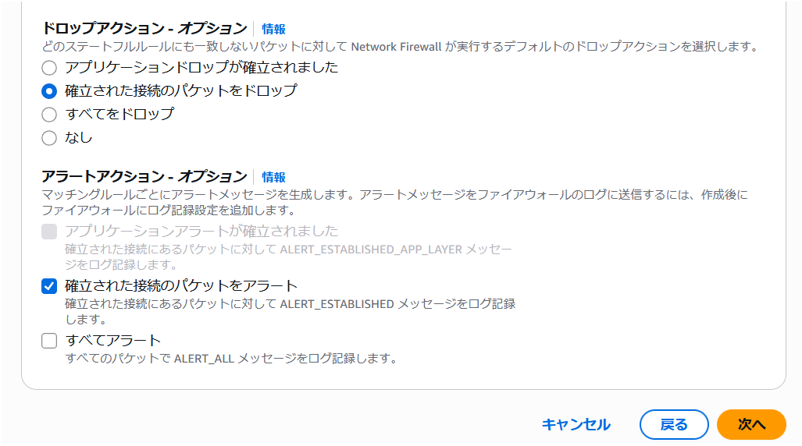

*図 3a: Network Firewall Drop Established デフォルトアクション*

#### Application drop established

「Application drop established」は、TLS Client Hello メッセージが複数のパケットに分割される可能性がある環境向けに設計されており、これはポスト量子ハイブリッド暗号鍵交換でますます一般的になっています。TCP ハンドシェイク直後にトラフィックをドロップするのではなく、ドロップの判断を行う前に十分なアプリケーションレイヤーデータ（TLS SNI フィールドなど）を確認するまで待機します。

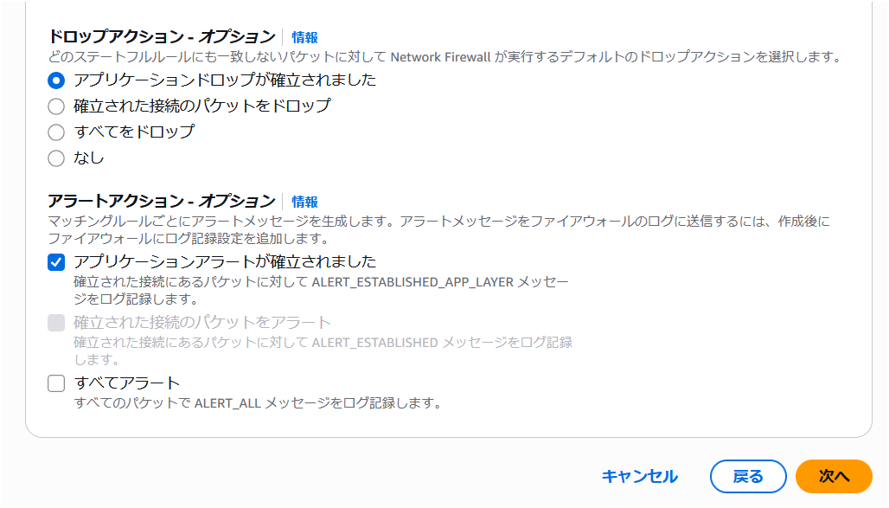

*図 3b: Network Firewall Application Drop Established デフォルトアクション*

「Application drop established」を使用する場合、TCP ハンドシェイク後、pass ルールが適用される前に発生する TCP フロー制御パケット（ウィンドウ更新、キープアライブ、リセットなど）がドロップされる可能性があることに注意してください。これらのパケットを許可するためのカスタムルールが必要になる場合があります。詳細については、[ステートフルルールグループの評価順序](https://docs.aws.amazon.com/ja_jp/network-firewall/latest/developerguide/suricata-rule-evaluation-order.html)のドキュメントを参照してください。

あるいは、本ガイドに含まれる[カスタム Suricata ルールテンプレート](#ui-生成ルールの代わりにカスタム-suricata-ルールを使用)の Egress Default Block Rules は、TCP フロー制御パケット用の個別ルールを必要とせずに、カスタムルールを使用して同じアプリケーションレイヤー対応のドロップ戦略を適用します。

### ステートレスルールよりもステートフルルールを使用

* ステートレスルールは、非対称フロー転送の問題（ファイアウォールのステートフル検査エンジンがフローの片方向のみを検査する状態）を容易に引き起こします。また、ファイアウォールルールセット全体の理解とトラブルシューティングをより複雑にします。大多数のユースケースでは、ステートレスエンジンのデフォルトアクションを「Forward to stateful rule groups」に設定し、ステートフルルールよりも優先されるステートレスルールは設定しないことをお勧めします。
* ステートレスルールを使用する場合は、Network Firewall の Stateless Rule Group Analyzer を使用して非対称フローの問題をトラブルシューティングおよび解決する方法を理解することが重要です。「非対称転送に関するステートレスルールのトラブルシューティング」セクションを参照してください。
* Network Firewall のディープパケットインスペクション IPS 機能を活用するには、ステートフルルールを使用する必要があります。一部のお客様はステートレスルールから始めてしまい、後になってステートフルルールが必要だったことに気づくケースがあります。
  * ステートレスルールは、一部のトラフィックをログやアラートなしに単純に拒否したい場合に使用できますが、ほとんどの場合、ルールグループは AWS コンソールで以下のような構成にする必要があります:

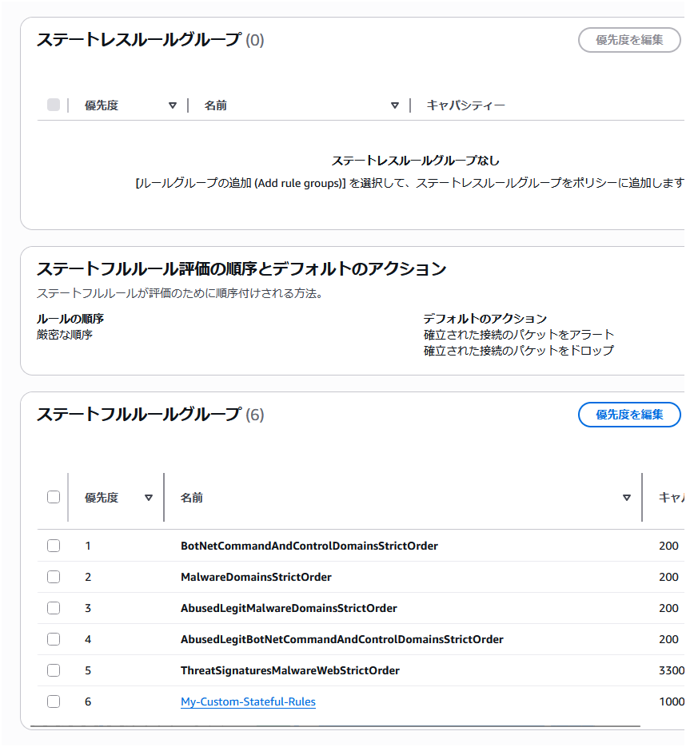

*図 4: Network Firewall ステートレスルールグループ*

* ステートフルルール使用のメリット
  * リターントラフィックが自動的に許可されるため、同一トラフィックフローに対してインバウンドとアウトバウンドの両方のルールを定義する必要がありません
  * ディープパケットインスペクションがサポートされ、トラフィックのレイヤー 7 属性に対するより深い可視性が得られます
  * ログ記録をサポートしているため、標準的な 5 タプルフロー情報に加えて、アプリケーションレベルのトラフィック詳細を確認できます
  * これらのルールはトラブルシューティングが容易で、ステートレスルールよりもはるかに柔軟で強力です
    * ルールに作成日（変更リクエスト番号付き）、ユースケース、その他のコメントなどの説明を追加できます
  * Reject アクションがサポートされています
  * これらのルールのキャパシティ計算がより簡単です

### UI 生成ルールの代わりにカスタム Suricata ルールを使用

管理者が自ら標準ステートフルルールでプロトコル、送受信元、送受信ポートを設定追加するのではなく、カスタム Suricata ルールを使用することを推奨します。これらはステートフルルールグループオプションで設定でき、完全な制御が可能な自由形式のテキストです。Suricata の柔軟性をより簡単に活用できます。開始時に役立つ [Suricata ルールの例](https://docs.aws.amazon.com/ja_jp/network-firewall/latest/developerguide/suricata-examples.html)を参照してください。

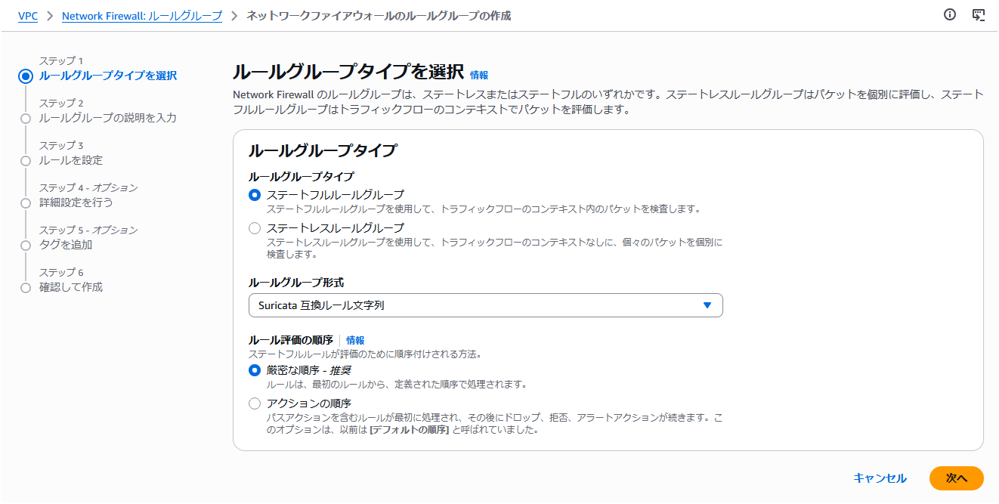

*図 5: Network Firewall ステートフルルールグループ*

後にさまざまなユースケースをサポートする際に、カスタム Suricata ルールの柔軟性が必要になることが多いため、導入の早い段階からチームとともにカスタム Suricata ルールの使用方法を習得することをお勧めします。

カスタム Suricata ルール使用のメリット:

* 非常に重要なキーワード [「flow:to_server」](https://aws.github.io/aws-security-services-best-practices/guides/network-firewall/#use-flowto_server-keyword-in-stateful-rules) をルールに簡単に追加可能
* 最大限の柔軟性
* アラートとログへの表示方法の制御
* トラブルシューティングとログ分析の簡素化に役立つカスタムルールシグネチャ ID の使用が可能
* 自由形式のテキストルールはコピー、編集、共有、バックアップが容易
* ルールグループ間でのルールの切り替えが容易（例: ブルーグリーンテスト）

カスタム Suricata ルールの作成を支援するために、[AWS Network Firewall 用 Suricata ルールジェネレーターオープンソースアプリケーション](https://github.com/aws-samples/sample-suricata-generator)を作成しました。

以下に、エグレスセキュリティのユースケース向けのカスタム Suricata ルールテンプレートの例も含めています。

```
# This is a "Strict rule ordering" ruleset template. Use this ruleset with "Strict" rule ordering firewall policy and no default actions, as this template includes custom default block rules at the end that block everything not explicently allowed.
# This template will not work well with the "Drop All" or "Drop Established" or "Application Drop Established" default firewall policy actions. And "Alert establsihed" will produce redundant log entries if it's used with this template, so we reccomend not using "Alert estabished" with this template ruleset.
# Make sure the $HOME_NET variable is set correctly (usually all RFC 1918 IP space) at the firewall policy level so all Rule Groups inherit it. 

# Silently allow TCP 3-way handshake to be setup by $HOME_NET clients so that the domain filtering rules will work properly
# Do not move this section, it's important that this be at the top of the entire firewall ruleset to reduce rule conflicts
pass tcp $HOME_NET any -> any any (flow:not_established, to_server; sid:202501021;)

# Silently turn on JA3/S hash logging for all other tls alert rules (like sid:999991)
alert tls $HOME_NET any -> any any (ja3.hash; content:!"xxxxxxxxxxxxxxxxxxxxxxxxxxxxxxxx"; noalert; flow:to_server; sid:202501024;)
alert tls any any -> $HOME_NET any (ja3s.hash; content:!"xxxxxxxxxxxxxxxxxxxxxxxxxxxxxxxx"; noalert; flow:to_client; sid:202501025;)

# Direct to IP connections
reject http $HOME_NET any -> any any (http.host; content:"."; pcre:"/^(?:[0-9]{1,3}\.){3}[0-9]{1,3}$/"; msg:"HTTP direct to IP via http host header (common malware download technique)"; flow:to_server; sid:202501026;)
reject tls $HOME_NET any -> any any (tls.sni; content:"."; pcre:"/^(?:[0-9]{1,3}\.){3}[0-9]{1,3}$/"; msg:"TLS direct to IP via TLS SNI (common malware download technique)"; flow:to_server; sid:202501027;)
# JA4 No SNI Reject
reject tls $HOME_NET any -> any any (ja4.hash; content:"_"; startswith; content:!"d"; offset:3; depth:1; msg:"JA4 No SNI Reject"; sid:1297713;)

# Block higher risk Geoip
drop ip $HOME_NET any -> any any (msg:"Egress traffic to RU IP"; geoip:dst,RU; metadata:geo RU; flow:to_server; sid:202501028;)
drop ip $HOME_NET any -> any any (msg:"Egress traffic to CN IP"; geoip:dst,CN; metadata:geo CN; flow:to_server; sid:202501029;)

# Block higher risk domain categories
reject tls $HOME_NET any -> any any (msg:"Category:Command and Control"; aws_domain_category:Command and Control; ja4.hash; content:"_"; flow:to_server; sid:202602061;)
reject tls $HOME_NET any -> any any (msg:"Category:Hacking"; aws_domain_category:Hacking; ja4.hash; content:"_"; flow:to_server; sid:202602062;)
reject tls $HOME_NET any -> any any (msg:"Category:Malicious"; aws_domain_category:Malicious; ja4.hash; content:"_"; flow:to_server; sid:202602063;)
reject tls $HOME_NET any -> any any (msg:"Category:Malware"; aws_domain_category:Malware; ja4.hash; content:"_"; flow:to_server; sid:202602064;)
reject tls $HOME_NET any -> any any (msg:"Category:Phishing"; aws_domain_category:Phishing; ja4.hash; content:"_"; flow:to_server; sid:202602065;)
reject tls $HOME_NET any -> any any (msg:"Category:Proxy Avoidance"; aws_domain_category:Proxy Avoidance; ja4.hash; content:"_"; flow:to_server; sid:202602066;)
reject tls $HOME_NET any -> any any (msg:"Category:Spam"; aws_domain_category:Spam; ja4.hash; content:"_"; flow:to_server; sid:202602067;)
reject http $HOME_NET any -> any any (msg:"Category:Command and Control"; aws_url_category:Command and Control; flow:to_server; sid:202602068;)
reject http $HOME_NET any -> any any (msg:"Category:Hacking"; aws_url_category:Hacking; flow:to_server; sid:202602069;)
reject http $HOME_NET any -> any any (msg:"Category:Malicious"; aws_url_category:Malicious; flow:to_server; sid:2026020610;)
reject http $HOME_NET any -> any any (msg:"Category:Malware"; aws_url_category:Malware; flow:to_server; sid:2026020611;)
reject http $HOME_NET any -> any any (msg:"Category:Phishing"; aws_url_category:Phishing; flow:to_server; sid:2026020612;)
reject http $HOME_NET any -> any any (msg:"Category:Proxy Avoidance"; aws_url_category:Proxy Avoidance; flow:to_server; sid:2026020613;)
reject http $HOME_NET any -> any any (msg:"Category:Spam"; aws_url_category:Spam; flow:to_server; sid:2026020614;)


# Block higher risk ccTLDs
reject tls $HOME_NET any -> any any (tls.sni; content:".ru"; nocase; endswith; msg:"Egress traffic to RU ccTLD"; flow:to_server; sid:202501036;)
reject http $HOME_NET any -> any any (http.host; content:".ru"; endswith; msg:"Egress traffic to RU ccTLD"; flow:to_server; sid:202501037;)
reject tls $HOME_NET any -> any any (tls.sni; content:".cn"; nocase; endswith; msg:"Egress traffic to CN ccTLD"; flow:to_server; sid:202501038;)
reject http $HOME_NET any -> any any (http.host; content:".cn"; endswith; msg:"Egress traffic to CN ccTLD"; flow:to_server; sid:202501039;)

# Block high risk TLDs
reject tls $HOME_NET any -> any any (tls.sni; content:".xyz"; nocase; endswith; msg:"High risk TLD .xyz blocked"; flow:to_server; sid:202501040;)
reject http $HOME_NET any -> any any (http.host; content:".xyz"; endswith; msg:"High risk TLD .xyz blocked"; flow:to_server; sid:202501041;)
reject tls $HOME_NET any -> any any (tls.sni; content:".info"; nocase; endswith; msg:"High risk TLD .info blocked"; flow:to_server; sid:202501042;)
reject http $HOME_NET any -> any any (http.host; content:".info"; endswith; msg:"High risk TLD .info blocked"; flow:to_server; sid:202501043;)
reject tls $HOME_NET any -> any any (tls.sni; content:".top"; nocase; endswith; msg:"High risk TLD .top blocked"; flow:to_server; sid:202501044;)
reject http $HOME_NET any -> any any (http.host; content:".top"; endswith; msg:"High risk TLD .top blocked"; flow:to_server; sid:202501045;)

# Block QUICK traffic
drop quic $HOME_NET any -> any any (msg:"QUIC traffic blocked"; flow:to_server; sid:3898932;)

# Log higher risk ports
alert ip $HOME_NET any -> any 53 (msg:"Possible GuardDuty/DNS Firewall bypass!"; flow:to_server; sid:202501055;)
alert ip $HOME_NET any -> any 1389 (msg:"Possible Log4j callback!"; flow:to_server; sid:202501059;)
alert ip $HOME_NET any -> any [4444,666,3389] (msg:"Egress traffic to high risk port!"; flow:to_server; sid:202501058;)

# Port/protocol enforcement (TLS can only use TCP/443, TLS can't use anything other than TCP/443, etc.)
reject tcp $HOME_NET any -> any 443 (msg:"Egress Port TCP/443 but not TLS"; app-layer-protocol:!tls; flow:to_server; sid:202501030;)
reject tls $HOME_NET any -> any !443 (msg:"Egress TLS but not port TCP/443"; flow:to_server; sid:202501031;)
reject tcp $HOME_NET any -> any 80 (msg:"Egress Port TCP/80 but not HTTP"; app-layer-protocol:!http; flow:to_server; sid:202501032;)
reject http $HOME_NET any -> any !80 (msg:"Egress HTTP but not port TCP/80"; flow:to_server; sid:202501033;)
reject tcp $HOME_NET any -> any 22 (msg:"Egress Port TCP/22 but not SSH"; app-layer-protocol:!ssh; flow:to_server; sid:202501060;)
reject ssh $HOME_NET any -> any !22 (msg:"Egress SSH but not port TCP/22"; flow:to_server; sid:202501061;)

# Silently (do not log) allow low risk protocols out to anywhere
pass ntp $HOME_NET any -> any 123 (flow:to_server; sid:202501034;)
pass icmp $HOME_NET any -> any any (flow:to_server; sid:202501035;)

# Alert on requests to possible suspicious TLDs
alert tls $HOME_NET any -> any any (tls.sni; pcre:"/^(?!.*\.(com|org|net|io|edu|aws)$).*/i"; msg:"Request to possible suspicious TLDs"; flow:to_server; sid:202501065;)
alert http $HOME_NET any -> any any (http.host; pcre:"/^(?!.*\.(com|org|net|io|edu|aws)$).*/i"; msg:"Request to possible suspicious TLDs"; flow:to_server; sid:202501066;)

# Silently (do not log) allow AWS public service endpoints that we have not setup VPC endpoints for yet
# VPC endpoints are highly encouraged. They reduce NFW data processing costs and allow for additional security features like VPC endpoint policies.
pass tls $HOME_NET any -> any any (tls.sni; content:"ec2messages."; startswith; nocase; content:".amazonaws.com"; endswith; nocase; flow:to_server; sid:202501047;)
pass tls $HOME_NET any -> any any (tls.sni; content:"ssm."; startswith; nocase; content:".amazonaws.com"; endswith; nocase; flow:to_server; sid:202501048;)
pass tls $HOME_NET any -> any any (tls.sni; content:"ssmmessages."; startswith; nocase; content:".amazonaws.com"; endswith; nocase; flow:to_server; sid:202501049;)

# Allow-list of strict FQDNs to silently allow
pass tls $HOME_NET any -> any any (tls.sni; content:"checkip.amazonaws.com"; startswith; nocase; endswith; flow:to_server; sid:202501050;)
pass http $HOME_NET any -> any any (http.host; content:"checkip.amazonaws.com"; startswith; endswith; flow:to_server; sid:202501051;)

# Allow-List of strict FQDNs, but still alert on them
# This method shows the verdict of "pass"
alert tls $HOME_NET any -> any any (tls.sni; content:"www.example.com"; startswith; nocase; endswith; msg:"TLS SNI Allowed"; flow:to_server; sid:202501052;)
pass tls $HOME_NET any -> any any (tls.sni; content:"www.example.com"; startswith; nocase; endswith; flow:to_server; sid:202501053;)

# Allow HTTPS domain and also log it
# This method shows the verdict of "alert" instead of pass
pass tls $HOME_NET any -> any any (alert; msg:"www.example2.com allowed"; tls.sni; content:"www.example2.com"; startswith; nocase; endswith; flow:to_server; sid:202506131;)


# Allow-List of second level/registered domain and all of its subdomains
# When using 'dotprefix': Always place it before 'content' and always include the leading dot in the domain name (.amazon.com in the following example)
pass tls $HOME_NET any -> any any (tls.sni; dotprefix; content:".amazon.com"; nocase; endswith; flow:to_server; sid:202501078;)


#
# Custom Block Rules
# These replace "Drop All" or "Drop Established" or "Application drop established" default actions
#
# Egress Default Block Rules
pass tcp $HOME_NET any -> any any (msg:"Allow three-way handshake to be setup by $HOME_NET"; flow:not_established, to_server; sid:999990;)
reject tls $HOME_NET any -> any any (msg:"Default Egress HTTPS Reject"; ssl_state:client_hello; ja4.hash; content:"_"; flowbits:set,blocked; flow:to_server; sid:999991;)
alert tls $HOME_NET any -> any any (msg:"PQC"; flowbits:isnotset,blocked; flowbits:set,PQC; noalert; flow:to_server; sid:999993;)
reject http $HOME_NET any -> any any (msg:"Default Egress HTTP Reject"; flowbits:set,blocked; flow:to_server; sid:999992;)
reject tcp $HOME_NET any -> any any (msg:"Default Egress TCP Reject"; flowbits:isnotset,blocked; flowbits:isnotset,PQC; flow:to_server; sid:999994;)
drop udp $HOME_NET any -> any any (msg:"Default Egress UDP Drop"; flow:to_server; sid:999995;)
drop icmp $HOME_NET any -> any any (msg:"Default Egress ICMP Drop"; flow:to_server; sid:999996;)
drop ip $HOME_NET any -> any any (msg:"Default Egress All Other IP Drop"; ip_proto:!TCP; ip_proto:!UDP; ip_proto:!ICMP; flow:to_server; sid:999997;)

# Ingress Default Block Rules in case ingress traffic lands on this firewall
# You may want to silence these rules by putting "noalert" on them to save on logging costs
# Uncomment the following rule if the firewall will be used for the ingress use case and you want to perform L7 filtering
# pass tcp any any -> $HOME_NET any (msg:"Allow three-way handshake to be setup by any"; flow:not_established, to_server; sid:999980;)
drop tls any any -> $HOME_NET any (msg:"Default Ingress HTTPS Drop"; ssl_state:client_hello; ja4.hash; content:"_"; flowbits:set,blocked; flow:to_server; sid:999999;)
alert tls any any -> $HOME_NET any (msg:"PQC"; flowbits:isnotset,blocked; flowbits:set,PQC; noalert; flow:to_server; sid:9999910;)
drop http any any -> $HOME_NET any (msg:"Default Ingress HTTP Drop"; flowbits:set,blocked; flow:to_server; sid:9999911;)
drop tcp any any -> $HOME_NET any (msg:"Default Ingress TCP Drop"; flowbits:isnotset,blocked; flowbits:isnotset,PQC; flow:to_server; sid:9999912;)
drop udp any any -> $HOME_NET any (msg:"Default Ingress UDP Drop"; flow:to_server; sid:9999913;)
drop icmp any any -> $HOME_NET any (msg:"Default Ingress ICMP Drop"; flow:to_server; sid:9999914;)
drop ip any any -> $HOME_NET any (msg:"Default Ingress All Other IP Drop"; ip_proto:!TCP; ip_proto:!UDP; ip_proto:!ICMP; flow:to_server; sid:9999915;)

# The following rules alert you if they see traffic not to or from $HOME_NET (meaning $HOME_NET probably isn't set correctly)
alert ip $HOME_NET any -> any any (noalert; flowbits:set,egress_from_home_net; flow:to_server; sid:8925324;)
alert ip any any -> $HOME_NET any (noalert; flowbits:set,ingress_to_home_net; flow:to_server; sid:8923323;)
alert ip any any -> any any (msg:"$HOME_NET may not be set right! Set it at the firewall policy level."; flowbits:isnotset,ingress_to_home_net; flowbits:isnotset,egress_from_home_net; threshold: type limit, track by_both, seconds 600, count 1; flow:to_server; sid:8923283;)
```

### カスタムルールグループの数を最小限に抑える

その理由は以下の通りです:

* カスタムルールグループを作成する際にはキャパシティを定義する必要があり、作成後にキャパシティを変更できないため、余裕を持たせる必要があります。ルールグループが多いとキャパシティ制限の管理がより煩雑になります。キャパシティについては、AWS マネージドルールグループを実装した後の残りのキャパシティをカスタムルールグループに割り当てることをお勧めします。
* 管理するルールグループが複数あると、トラフィックの処理方法を把握するのがより複雑になります。ルールを 1 つのビューで確認できれば、複数のルールグループを行き来してトラフィックの評価方法を理解するよりも、ルール間の競合や優先順位の問題をはるかに容易に特定できます。
* Network Firewall は、マネージドとカスタムを合わせて最大 20 のルールグループをサポートしています。カスタムルールグループを多く作成すると、追加できる AWS マネージドルールグループの数が制限されます。
* トラブルシューティングのために、すべてのルールグループでシグネチャ ID（SID）が一意であることを確認する必要があります。Network Firewall は単一のルールグループ内では一意の SID を強制しますが、ルールグループ間では強制しません。すべてのルールグループで一意の SID がない場合、ログからどのルールが実際にトラフィックを処理したかを把握するのがより困難になります。

### $HOME_NET 変数が正しく設定されていることを確認

デフォルトでは、$HOME_NET 変数は Network Firewall がデプロイされている VPC の CIDR 範囲に設定されます。


*図 6: Network Firewall HOME_NET 変数*

ただし、このデフォルトの動作では、上記の例の Spoke VPC A や Spoke VPC B のように、保護したい VPC の CIDR 範囲がカバーされない場合があります。

$HOME_NET の CIDR 範囲が、保護対象のすべての VPC およびトラフィックマッチング対象と一致していることを確認してください。ほとんどのお客様は、$HOME_NET をすべての [RFC 1918](https://datatracker.ietf.org/doc/html/rfc1918) IP アドレス範囲（10.0.0.0/8、172.16.0.0/12、192.168.0.0/16）に設定することが有効です。

この変数は、グローバルなファイアウォールポリシーレベルまたは各ルールグループで設定できます。両方のレベルで設定されている場合、ルールグループの設定が優先されます。

$HOME_NET 変数とその逆変数（$EXTERNAL_NET）は、AWS マネージドルールでのトラフィックマッチングに使用されます。デフォルトでは、$EXTERNAL_NET はファイアウォールポリシーレベルで設定された $HOME_NET の逆になります。ルールグループレベルで $HOME_NET を設定する場合は、ルールグループレベルで $EXTERNAL_NET も設定してください。設定しないと、ルールグループの $EXTERNAL_NET がルールグループの $HOME_NET の逆にならない可能性があります。

East-West のユースケースでマネージドルールを使用する場合は、保護したい VPC/CIDR を決定し、それらの CIDR のみを $HOME_NET 変数に割り当てる必要があります。すべての VPC/CIDR を割り当てると、マネージドルールの $EXTERNAL_NET 変数に一致する CIDR 範囲がなくなります。

脅威シグネチャからルールをコピーして変数を調整することもできます（変数を「any」に置き換えてすべての CIDR に一致させることも可能）。ただし、この場合はルールがコピー時点で固定され、AWS マネージドルールのように自動更新されないという欠点があります。

以下は、ファイアウォールを通過するトラフィックが $HOME_NET に含まれておらず、含めるべきかどうかを特定するのに役立つカスタム Suricata ルールの例です:

alert tcp !$HOME_NET any -> !$HOME_NET any (flow:to_server,established; msg:"It looks like you might have $HOME_NET traffic that is not a part of the $HOME_NET variable. Please make sure your $HOME_NET variable is set correctly."; sid:39179777;)

### 許可されたトラフィックをログに記録するために Pass ルールの前に Alert ルールを使用

すべてのトラフィック（拒否または許可）をログに記録する要件がある場合、Suricata の Pass ルールはトラフィックを許可するだけでログを記録しないため、Pass ルール自体の前に同じトラフィックに対する Alert ルールを追加する必要があります。

```
#https://*.amazonaws.com への許可されたトラフィックのログ記録
alert tls $HOME_NET any -> any any (tls.sni; content:".amazonaws.com"; nocase; endswith; msg:"*.amazonaws.com allowed by sid:021420242"; flow:to_server; sid:021420241;)
pass tls $HOME_NET any-> any any (tls.sni; content:".amazonaws.com"; nocase; endswith; msg:"Pass rules don't alert, alert is on sid:021420241"; flow.to_server; sid:021420242;)
```

Strict Ordering を使用する必要があり、上記のコードサンプルで示されているように、Alert ルールは Pass ルールよりも高い優先順位を持つ必要があります。

Alert ルールのメッセージで Pass ルールの SID を参照でき、その逆も可能です。十分に長い SID を使用すると、ログ検索時にその SID と無関係な情報が表示されることなく、素早く検索できます。

あるいは、pass ルールに `alert;` キーワードを追加できますが、アラートログでは pass ではなく alert の verdict が生成されます。ルールの例:
```
# この方法では pass ではなく alert の verdict が表示されます
pass tls $HOME_NET any -> any any (alert; msg:"www.example2.com allowed"; tls.sni; content:"www.example2.com"; startswith; nocase; endswith; flow:to_server; sid:202506131;)
```

### ステートフルルールで "flow:to_server" キーワードを使用

Suricata では、競合するルールセットが構成される可能性があります。宛先へのトラフィックが [OSI モデル](https://en.wikipedia.org/wiki/OSI_model)の異なるレイヤーで動作する場合、上位レイヤー（例: TLS）で許可したいトラフィックが、下位レイヤー（例: TCP）のルールによってブロックされる可能性があります:

#### 悪いルールセットの例（Strict rule ordering）– 使用しないでください

```
# ルール 1 は baddomain.com への http トラフィックをブロックするためのものです
reject http $HOME_NET any → any 80 (http.host; content:"baddomain.com"; sid:1;)

# ルール 2 はアプリケーションプロトコル検査の前に TCP ポート 80 のトラフィックフローを許可します
pass tcp $HOME_NET any → any 80 (sid:2;)
```

ルールで「flow:to_server」を使用すると、同じレベルで動作するようになり、トラフィックを同時に評価できます。pass ルール（sid:2）が reject ルール（sid:1）よりも優先される形でトラフィックを許可することはなくなります。
 
#### 良いルールセットの例（Strict rule ordering）– 使用可能

```
# ルール 1 は baddomain.com への http トラフィックをブロックします
reject http $HOME_NET any → any 80 (http.host; content:"baddomain.com"; sid:1;)

# ルール 2 はルール 1 よりも優先されません
pass tcp $HOME_NET any → any 80 (flow:to_server; sid:2;)
```

ファイアウォールルールのトラブルシューティングの詳細については、[Network Firewall でのルールのトラブルシューティング](https://docs.aws.amazon.com/ja_jp/network-firewall/latest/developerguide/troubleshooting-rules.html)を参照してください。


### 新しいステートフルファイアウォールルールを既存のフローに適用する方法

Network Firewall は、すべてのステートフルファイアウォールルールに Suricata ディープパケットインスペクションエンジンを使用しています。フローが Suricata ルールによって許可されると、Suricata はそのフローを状態テーブルに登録します。これにより、そのフローに対してディープパケットインスペクションにリソースを費やす必要がなくなります。そのフローがアクティブである限り、すでに判断が下されているため、新しいステートフルファイアウォールルールはそのトラフィックに適用されません。

しかし、新しく追加したルールを、以前に許可されたアクティブなトラフィックを含むすべてのトラフィックに適用したい場合があります。例えば、最初に「すべてのトラフィックを許可」するルールで開始し、その後ルールセットを絞り込んでいく過程で、既に許可されたトラフィックも新しいルールで再評価したい場合です。

Network Firewall のステートフルルール状態テーブルをクリアする方法

* ファイアウォールポリシーの「Details」ページに移動します
* 「Stream exception policy」を現在の設定とは異なるものに変更し、Save をクリックします
* 次に「Stream exception policy」を編集し、以前の設定に戻します。ほとんどの場合の推奨設定: 「Stream exception policy: Reject」

これにより、以前に許可されたトラフィックを含むすべてのトラフィックが、最新のステートフルファイアウォールルールに対して再評価されます。

### ログ記録とモニタリングの設定

Network Firewall は、Alert ログと Flow ログの 2 種類のログタイプをサポートしています。

* Alert ログ
  * Suricata からの情報
  * IPS エンジン
  * レイヤー 7 属性（ドメインなど）
  * プロトコル検出

* Flow ログ
  * ファイアウォールを通過するフローの 5 タプル情報
  * トラフィック量を含む
  * トラフィックの主要な発生源と宛先の特定に役立つ

ネイティブの[ファイアウォールモニタリングダッシュボード](https://docs.aws.amazon.com/ja_jp/network-firewall/latest/developerguide/nwfw-using-dashboard.html)は、ファイアウォールに関する主要なメトリクスを表示するための複数のオプションを提供します。ダッシュボードで利用可能なすべてのメトリクスは[こちら](https://docs.aws.amazon.com/ja_jp/network-firewall/latest/developerguide/nwfw-detailed-monitoring-metrics.html)で確認できます。

CloudWatch Logs Insights を使用して、Network Firewall のログからセキュリティおよび運用上のインサイトを分析できます。以下のクエリは、flow_id を使用して Flow ログ（トラフィック量データ）と Alert ログ（TLS SNI 情報）を相関分析します:

```
fields @timestamp, event.flow_id, event.netflow.bytes, event.tls.sni
| stats sum(event.netflow.bytes) as flowBytes, latest(event.tls.sni) as sni by event.flow_id
| stats sum(flowBytes) as totalBytes, count(*) as flowCount by sni
| sort totalBytes desc
| limit 20
```

このクエリは 2 段階の集計を使用して SNI とバイト数を相関させます。まず flow_id ごとに集計して Flow ログのバイト数と Alert ログの SNI を結合し、次にドメインごとにすべてのバイト数を合計します。これにより、環境が最も多く通信している外部サービスと、トラフィックの大部分がどこに向かっているかを把握できます。

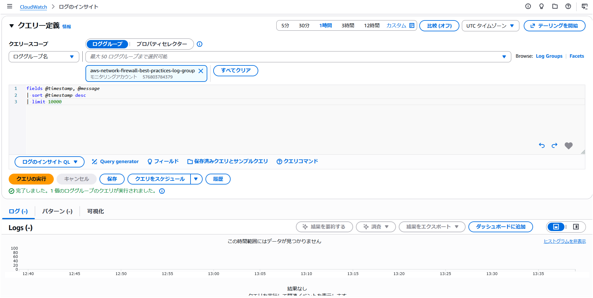


## コストに関する考慮事項

各 Network Firewall エンドポイントは使用していなくても時間単位の料金が発生するため、[Network Firewall のネイティブ Transit Gateway サポート](https://aws.amazon.com/jp/about-aws/whats-new/2025/07/aws-network-firewall-native-transit-gateway-support/)を活用した集中検査設計でエンドポイント数を削減してください。TGW を使用しないが、複数の AWS アカウントや VPC でファイアウォールを共有したい場合は、Network Firewall の[マルチエンドポイントサポート](https://aws.amazon.com/jp/about-aws/whats-new/2025/05/aws-network-firewall-multiple-vpc-endpoints/)を活用して、セカンダリエンドポイントのコストを削減できます。

Transit Gateway を通じて集中型 Network Firewall を使用している複数のアカウントまたは事業部門がある組織では、[Transit Gateway の柔軟なコスト配分](https://docs.aws.amazon.com/ja_jp/vpc/latest/tgw/metering-policy.html)を活用して、トラフィック使用パターンに基づいてコストを配分・追跡し、組織単位間でのコスト可視性とチャージバックを向上させることができます。

検査が不要なトラフィックを Network Firewall に送信しないでください。Network Firewall での不要な処理料金を避けるために、TGW ルートテーブルを使用してネットワークをセグメント化してください。例えば、VPC Prod と VPC Dev が通信する必要がない場合は、相互通信を防止します。

[トラフィック分析レポート機能](https://docs.aws.amazon.com/ja_jp/network-firewall/latest/developerguide/reporting.html)を使用して、ネットワーク処理料金を最も増加させている可能性のあるドメインを確認してください。

そのトラフィックを Network Firewall 経由で送信する代わりに、S3 および DynamoDB 用の無料の VPC エンドポイントを使用してください。

ファイアウォールによる検査が不要なサードパーティサービスが提供する PrivateLink エンドポイントを活用してください。ワークロードが「共有サービス」タイプの VPC 内のリソースにアクセスする必要がある場合、Network Firewall 経由ではなく VPC ピアリングを使用して「共有サービス VPC」にアクセスする方が、Network Firewall のデータ処理料金の節約に効果的な場合があります。

ルートテーブルが他のアベイラビリティーゾーンのエンドポイントではなく、ローカルの Network Firewall エンドポイントにトラフィックを送信していることを確認してください。この設計により、クロス AZ データ転送料金の発生を回避できます。

DNS Firewall を使用して Network Firewall に到達するトラフィックを削減してください。Network Firewall に到達するはずのトラフィックに対して DNS レイヤーで基本的なブロックを設定することで、「パケットソースに最も近い」場所でトラフィックを効果的にブロックできます。

ログ出力を抑制してログコストを削減したい場合は、Suricata ルールに `"threshold: type limit, track by_both, seconds 600, count 1;"` を追加できます。例えば、以下のルールは、ルールをトリガーするソースおよび宛先 IP ペアごとに 10 分に 1 回のみアラートを発生させます。

`alert ssh $HOME_NET any -> any any (msg:"Egress SSH - alert only once every ten minutes"; threshold: type limit, track by_both, seconds 600, count 1; flow:to_server; sid:898233;)`

## 非対称転送に関するステートレスルールのトラブルシューティング

特定のステートレスルール構成により、トラフィックが一方向のみステートフルエンジンで検査される場合があります。最も一般的な原因は、リターン方向に対応するルールなしにステートレスの「Pass」または「Forward to stateful rules」を使用する場合です。

この非対称転送を引き起こすステートレスルールを特定するには、サービスの組み込みルールアナライザーを使用し、非対称ルールを削除するか、リターントラフィックに一致するルールを追加してルールグループを更新してください。AWS マネジメントコンソールでステートレスルールグループを分析するか、API または CLI で DescribeRuleGroup を呼び出す際に「AnalyzeRuleGroup」オプションを使用できます。

以下は、AWS マネジメントコンソールを使用してルールグループを分析する方法の例です。ステートレスルールグループに移動して「Analyze」をクリックします。

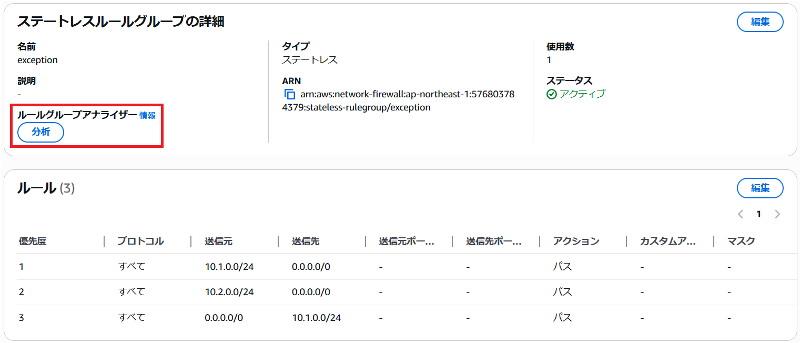

ルールグループアナライザーは、優先順位 2 のステートレスルールが Network Firewall を通じた非対称ルーティングにつながることを特定しました。

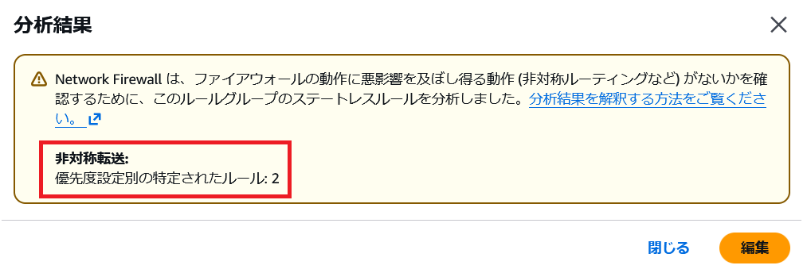

この問題を修正するには、「Edit」をクリックしてリターントラフィックを許可する別のルールを追加します。つまり、0.0.0.0/0 から 10.2.0.0/24 へのトラフィックです。

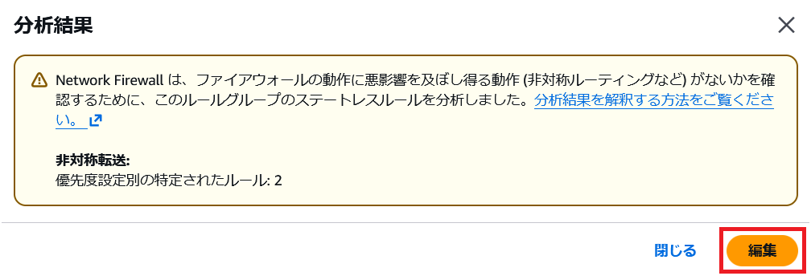

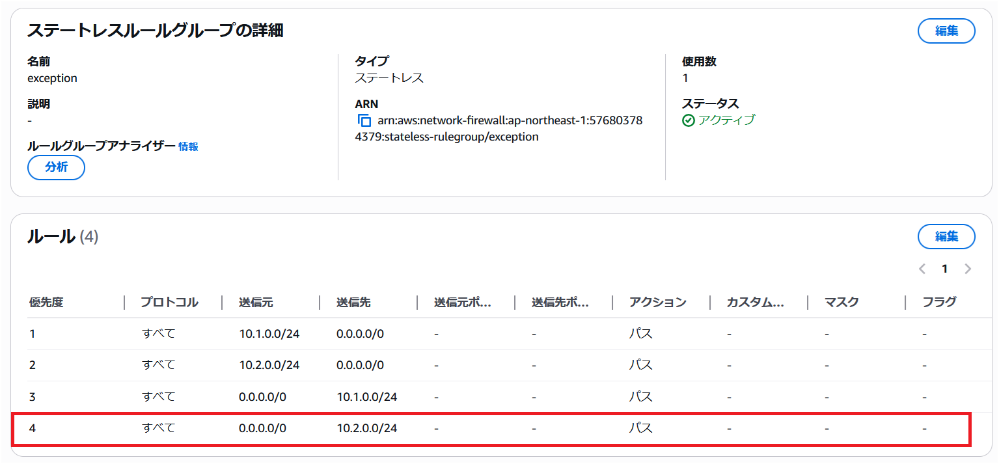

ルールを更新した後、アナライザーを再度実行して問題が解決されたことを確認します。

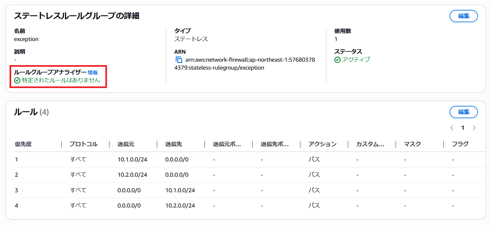

ご質問がある場合は、AWS サポートチームにお問い合わせください。

## AWS Network Firewall を使用したクライアント側 TLS SNI 操作の緩和オプション

TLS SNI フィルタリングは、ネットワークアプライアンスがエグレストラフィックを制御するためにドメインフィルタリングを実行する業界標準のメカニズムです。ドメインを IP アドレスに名前解決する必要なく TLS トラフィックを監視・制御できる、シンプルで簡単な方法です。

ただし、ドメインから IP への名前解決は信頼性が低い場合があり、潜在的な脆弱性にもなります。CDN がウェブサイトホスティングに広く使用されているため、CDN の IP へのアクセスを許可すると、クライアントが偽造リクエストを作成できる場合、その CDN でホストされているすべてのドメインにアクセスできてしまいます。SNI フィルタリングにも同様の制限があります。クライアントが偽造リクエストを作成できる場合、正当なドメインに向かうように見せかけて、実際には不正な IP アドレスに接続する可能性があります。これらのクライアント側 SNI 操作のケースでは、いずれもシステムがある程度侵害されていることが前提条件です。

* では、この問題にどう対処すればよいでしょうか？

まず最も重要なのは、SNI 操作が可能になるほどワークロードが侵害される可能性自体を低減することに集中することです。AWS Network Firewall のマネージドルールの活用が良い出発点です。よく知られた高リスクの脅威をブロックしてくれるためです。多くの AWS のお客様はここから始め、正当なドメインの短いリストのみを許可し、その他すべてをデフォルトでブロックする最小権限セキュリティモデルへと移行しています。ドメイン許可リストはリスク面を大幅に削減し、ワークロードが侵害されて偽造リクエストの送信に悪用される機会をさらに低減します。

* しかし、AWS Network Firewall でクライアント側 SNI 操作を直接ブロックしたい場合はどうすればよいでしょうか？

[AWS Network Firewall の TLS 復号機能](https://docs.aws.amazon.com/ja_jp/network-firewall/latest/developerguide/tls-inspection-configurations.html)を有効にすることで実現できます。TLS 復号が有効になると、クライアント側 SNI 操作はデフォルトでブロックされ、ファイアウォールの TLS ログに以下のエラーメッセージが表示されます:

```
{
    "firewall_name": "NetworkFirewall",
    "availability_zone": "us-east-1a",
    "event_timestamp": 1727451885,
    "event": {
        "timestamp": "2024-09-27T15:44:45.321222Z",
        "src_ip": "10.2.1.145",
        "src_port": "39038",
        "dest_ip": "44.193.128.70",
        "dest_port": "443",
        "sni": "spoofedsni.com",
        "tls_error": {
            "error_message": "SNI: spoofedsni.com Match Failed to server certificate names: checkip.us-east-1.prod.check-ip.aws.a2z.com/checkip.us-east-1.prod.check-ip.aws.a2z.com/checkip.amazonaws.com/checkip.check-ip.aws.a2z.com "
        }
    }
}
```

* しかし、クライアント側 SNI 操作をブロックするための他のオプションは何でしょうか？

SNI ドメインチェックと DNS ドメイン-IP チェックの両方を追加して、SNI リクエストが DNS でそのドメインに関連付けられた IP アドレスへのみ許可されるようにすることが可能です。[Network Firewall でこれを実現するソリューション例](https://aws.amazon.com/blogs/security/how-to-control-non-http-and-non-https-traffic-to-a-dns-domain-with-aws-network-firewall-and-aws-lambda/)を参照してください。上記の両方のソリューションには追加のコストや複雑さが伴うため、まずドメイン許可リストの導入から始め、ワークロードのセキュリティ要件に応じて追加の制御が必要かどうかを判断することをお勧めします。

Network Firewall が TLS SNI スプーフィングに対抗できるもう 1 つの機能は JA3 フィルタリングです。JA3 は HTTP User-Agent に似た概念ですが TLS 用であり、簡単には設定変更できません。JA3 の詳細については[こちら](https://engineering.salesforce.com/tls-fingerprinting-with-ja3-and-ja3s-247362855967/)を参照してください。tls.sni フィルタリングと ja3.hash フィルタリングを組み合わせて使用する方法の例をいくつか見てみましょう。

まず、TLS ドメイン許可リストが以下のようになっていると仮定します:

```
pass tls $HOME_NET any -> any any (tls.sni; content:"ssm.us-east-1.amazonaws.com"; nocase; flow:to_server; sid:11111;)
pass tls $HOME_NET any -> any any (tls.sni; content:"ssmmessages.us-east-1.amazonaws.com"; nocase; flow:to_server; sid:22222;)
pass tls $HOME_NET any -> any any (tls.sni; content:"ec2.us-east-1.amazonaws.com"; nocase; flow:to_server; sid:33333;)
reject tls $HOME_NET any -> any any (msg:"TLS not on domain allow-list blocked"; flow:to_server; sid:44444;)
```

これらの特定のドメインをクライアントエージェントの JA3 ハッシュでのみアクセスできるようにさらに制限したい場合、ドメイン許可リストを以下のように変換できます:

```
pass tls $HOME_NET any -> any any (tls.sni; content:"ssm.us-east-1.amazonaws.com"; nocase; ja3.hash; content:"7a15285d4efc355608b304698cd7f9ab"; sid:11111;)
pass tls $HOME_NET any -> any any (tls.sni; content:"ssmmessages.us-east-1.amazonaws.com"; nocase; ja3.hash; content:"1be8360b66649edee1de25f81d98ec27"; sid:22222;)
pass tls $HOME_NET any -> any any (tls.sni; content:"ec2.us-east-1.amazonaws.com"; nocase; ja3.hash; content:"fd75aaca18604d62f2bc8b02b345140f"; sid:33333;)
reject tls $HOME_NET any -> any any (msg:"TLS not on domain/JA3 allow-list blocked"; flow:to_server; sid:44444;)
```

上記のルールセットが適用されると、各ドメインが正しい JA3 でのみアクセス可能になるため、許可リスト上のドメインに curl でアクセスすることはできなくなります。SNI スプーフィングが成功するには、クライアントシステムが特殊なコマンドを作成・実行できるほど侵害されている必要があります。さらに、攻撃者が許可リスト上のドメインへの接続を行うために、特定のクライアントエージェント/プロセスまで操作できるほどシステムを深く掌握している必要があります。

もう 1 つのオプションは、厳密にせず、3 つの JA3 がすべての SNI にアクセスできるようにする方法です:

```
alert tls $HOME_NET any -> any any (ja3.hash; content:"7a15285d4efc355608b304698cd7f9ab"; flowbits:set,ja3_allowed; noalert; sid:11111;)
alert tls $HOME_NET any -> any any (ja3.hash; content:"1be8360b66649edee1de25f81d98ec27"; flowbits:set,ja3_allowed; noalert; sid:22222;)
alert tls $HOME_NET any -> any any (ja3.hash; content:"fd75aaca18604d62f2bc8b02b345140f"; flowbits:set,ja3_allowed; noalert; sid:33333;)
pass tls $HOME_NET any -> any any (tls.sni; content:"ssm.us-east-1.amazonaws.com"; nocase; flowbits:isset,ja3_allowed; sid:44444;)
pass tls $HOME_NET any -> any any (tls.sni; content:"ssmmessages.us-east-1.amazonaws.com"; flowbits:isset,ja3_allowed; nocase; sid:55555;)
pass tls $HOME_NET any -> any any (tls.sni; content:"ec2.us-east-1.amazonaws.com"; nocase; flowbits:isset,ja3_allowed; sid:66666;)
reject tls $HOME_NET any -> any any (msg:"TLS not on domain/JA3 allow-list blocked"; flow:to_server; sid:77777;)
```

上記の 2 つのオプションには、クライアントエージェントのアップグレードのたびに新しい JA3 ハッシュを許可リストに追加する必要があるという欠点があります。これはセキュリティ価値の向上のために運用の複雑さが増すことを意味します。

許可リストの管理を容易にしつつ、リスク面の削減を継続するにはどうすればよいでしょうか？

もう 1 つのオプションは、承認された JA3 ハッシュがアクセスした宛先 IP を追跡し、一定期間記憶した上で、TLS ドメイン許可リストがそれらの信頼度の高い宛先 IP に対してのみ機能するようにすることです。そのルールセットは以下のようになります:

```
alert tls $HOME_NET any -> any any (ja3.hash; content:"7a15285d4efc355608b304698cd7f9ab"; xbits:set, allowed_ja3_destination_ips, track ip_dst, expire 21600; sid:11111;)
alert tls $HOME_NET any -> any any (ja3.hash; content:"1be8360b66649edee1de25f81d98ec27"; xbits:set, allowed_ja3_destination_ips, track ip_dst, expire 21600; sid:22222;)
alert tls $HOME_NET any -> any any (ja3.hash; content:"fd75aaca18604d62f2bc8b02b345140f"; xbits:set, allowed_ja3_destination_ips, track ip_dst, expire 21600; sid:33333;)
pass tls $HOME_NET any -> any any (tls.sni; content:"ssm.us-east-1.amazonaws.com"; nocase; xbits:isset, allowed_ja3_destination_ips, track ip_dst; sid:44444;)
pass tls $HOME_NET any -> any any (tls.sni; content:"ssmmessages.us-east-1.amazonaws.com"; xbits:isset, allowed_ja3_destination_ips, track ip_dst; nocase; sid:55555;)
pass tls $HOME_NET any -> any any (tls.sni; content:"ec2.us-east-1.amazonaws.com"; nocase; xbits:isset, allowed_ja3_destination_ips, track ip_dst; sid:66666;)
reject tls $HOME_NET any -> any any (msg:"TLS not on domain/A3 allow-list blocked"; flow:to_server; sid:77777;)
```

上記のオプションは、新しい JA3 が TLS ドメイン許可リストにアクセスすることを許可しますが、承認された JA3 がすでに通信している IP へのリクエストに限定されます。過度な柔軟性を与えることなく、適度な柔軟性を提供できます。

各お客様は、自社アプリケーションの脅威モデルに照らして、JA3 許可リストの維持管理に伴う追加の負担が正当化されるかどうかを判断する必要があります。ほとんどの AWS Network Firewall のお客様は、ドメイン許可リストによる大幅なリスク削減で十分と判断しており、JA3 ハッシュの許可リストまで追加する必要はないと考えています。

## リソース

### ワークショップ

* [AWS Advanced Network Security: Network Firewall & DNS Firewall](https://catalog.workshops.aws/network-security/en-US)
* [AWS Network Firewall Workshop](https://catalog.workshops.aws/networkfirewall/en-US)
* [Egress Controls Workshop](https://catalog.us-east-1.prod.workshops.aws/workshops/503778b9-6dbb-4e0d-9920-e8dbae141f43/en-US)

### 動画

* [Introduction, Best Practices and Custom Suricata Rules](https://www.youtube.com/watch?v=67pVOv3lPlk)
* [AWS Network Firewall console experience](https://www.youtube.com/watch?v=BYVObzBWnqo&list=PLhr1KZpdzukfJzNDd8eCJH_TGg24ZTwP6&index=1&pp=iAQB)
* [Decrypt, inspect, and re-encrypt TLS egress traffic at scale](https://www.youtube.com/watch?v=S7_hUxWrYmw&list=PLhr1KZpdzukfJzNDd8eCJH_TGg24ZTwP6&index=3&pp=iAQB)
* [Decrypt, inspect, and re-encrypt TLS traffic at scale](https://www.youtube.com/watch?v=j2pLuHdAj0A&list=PLhr1KZpdzukfJzNDd8eCJH_TGg24ZTwP6&index=40&pp=iAQB)
* [AWS Network Fireall Suricata HOME_NET variable override](https://www.youtube.com/watch?v=ufx8sO5s4BI&list=PLhr1KZpdzukfJzNDd8eCJH_TGg24ZTwP6&index=22&pp=iAQB)
* [AWS Network Firewall support for reject action for TCP traffic](https://www.youtube.com/watch?v=_K_2TVNygF4&list=PLhr1KZpdzukfJzNDd8eCJH_TGg24ZTwP6&index=54&pp=iAQB)
* [AWS Network Firewall tag-based resource groups](https://www.youtube.com/watch?v=SDj_tMHN5Zk&list=PLhr1KZpdzukfJzNDd8eCJH_TGg24ZTwP6&index=55&pp=iAQB)
* [AWS re:Inforce 2023 - Firewalls, and where to put them (NIS306)](https://www.youtube.com/watch?v=lTJxWAiQrHM)

### ブログ

* [Deployment models](https://aws.amazon.com/jp/blogs/news/networking-and-content-delivery-deployment-models-for-aws-network-firewall/)
* [Cost considerations and common options for AWS Network Firewall log management](https://aws.amazon.com/blogs/security/cost-considerations-and-common-options-for-aws-network-firewall-log-management/)
* [TLS inspection configuration for encrypted traffic and AWS Network Firewall](https://aws.amazon.com/blogs/security/tls-inspection-configuration-for-encrypted-traffic-and-aws-network-firewall/)
* [How to control non-HTTP and non-HTTPS traffic to a DNS domain with AWS Network Firewall and AWS Lambda](https://aws.amazon.com/blogs/security/how-to-control-non-http-and-non-https-traffic-to-a-dns-domain-with-aws-network-firewall-and-aws-lambda/)
* [Use AWS Network Firewall to filter outbound HTTPS traffic from applications hosted on Amazon EKS and collect hostnames provided by SNI](https://aws.amazon.com/blogs/security/use-aws-network-firewall-to-filter-outbound-https-traffic-from-applications-hosted-on-amazon-eks/)
* [How to deploy AWS Network Firewall by using AWS Firewall Manager](https://aws.amazon.com/blogs/security/how-to-deploy-aws-network-firewall-by-using-aws-firewall-manager/)
* [Introducing Prefix Lists in AWS Network Firewall Stateful Rule Groups](https://aws.amazon.com/blogs/networking-and-content-delivery/introducing-prefix-lists-in-aws-network-firewall-stateful-rule-groups/)
* [How to analyze AWS Network Firewall logs using Amazon OpenSearch Service – Part 1](https://aws.amazon.com/blogs/networking-and-content-delivery/how-to-analyze-aws-network-firewall-logs-using-amazon-opensearch-service-part-1/)
* [How to analyze AWS Network Firewall logs using Amazon OpenSearch Service – Part 2](https://aws.amazon.com/blogs/networking-and-content-delivery/how-to-analyze-aws-network-firewall-logs-using-amazon-opensearch-service-part-2/)

### サンプルコード
* [AWS Network Firewall CloudWatch Dashboard](https://github.com/aws-samples/aws-networkfirewall-cfn-templates/tree/main/cloudwatch_dashboard)
* [AWS Network Firewall Automation Examples](https://github.com/aws-samples/aws-network-firewall-automation-examples/tree/main)
