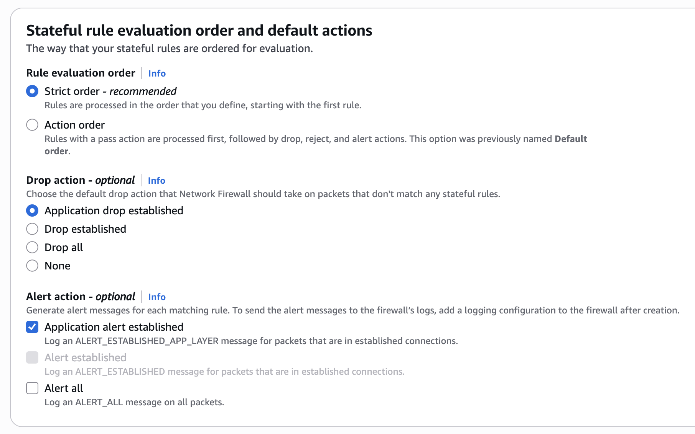

# AWS Network Firewall

## 소개

AWS Network Firewall 모범 사례 가이드에 오신 것을 환영합니다. 이 가이드의 목적은 VPC와 워크로드를 효율적으로 보호하기 위한 AWS Network Firewall에 대한 규범적 지침을 제공하는 것입니다. GitHub를 통해 이 가이드를 게시함으로써 서비스 개선 사항과 사용자 커뮤니티의 피드백을 포함한 시의적절한 권장 사항을 신속하게 반복할 수 있습니다. 이 가이드는 단일 계정에서 처음으로 Network Firewall을 배포하는 경우든, 기존 다중 계정 및/또는 다중 VPC 배포에서 Network Firewall을 최적화하는 방법을 찾고 있는 경우든 가치를 제공하도록 설계되었습니다.

## 이 가이드 사용 방법

이 가이드는 AWS 계정(및 리소스) 내에서 보안 이벤트, 악의적인 활동 및 취약점의 모니터링과 해결을 담당하는 보안 실무자를 대상으로 합니다. 모범 사례는 더 쉬운 이해를 위해 다양한 카테고리로 구성되어 있습니다. 각 카테고리에는 간략한 개요로 시작하여 지침 구현을 위한 세부 단계가 이어지는 해당 모범 사례 세트가 포함되어 있습니다. 주제는 특정 순서로 읽을 필요가 없습니다.

* [시작하기](#시작하기)
  * [배포 고려사항](#배포-고려사항)
* [구현](#구현)
* [운영화](#운영화)
  * [대칭 라우팅 보장](#대칭-라우팅-보장)
  * [엄격한 규칙 순서 및 'Application drop established'와 'Application alert established' 기본 방화벽 정책 작업 사용](#엄격한-규칙-순서-및-application-drop-established와-application-alert-established-기본-방화벽-정책-작업-사용)
  * [Stateless 규칙보다 Stateful 규칙 사용](#stateless-규칙보다-stateful-규칙-사용)
  * [UI 생성 규칙 대신 사용자 지정 Suricata 규칙 사용](#ui-생성-규칙-대신-사용자-지정-suricata-규칙-사용)
  * [가능한 한 적은 수의 사용자 지정 규칙 그룹 사용](#가능한-한-적은-수의-사용자-지정-규칙-그룹-사용)
  * [$HOME_NET 변수가 올바르게 설정되었는지 확인](#home_net-변수가-올바르게-설정되었는지-확인)
  * [허용된 트래픽을 로깅하기 위해 Pass 규칙 전에 Alert 규칙 사용](#허용된-트래픽을-로깅하기-위해-pass-규칙-전에-alert-규칙-사용)
  * [Stateful 규칙에서 "flow:to_server" 키워드 사용](#stateful-규칙에서-flowto_server-키워드-사용)
  * [새로운 Stateful 방화벽 규칙이 기존 플로우에 적용되도록 하는 방법](#새로운-stateful-방화벽-규칙이-기존-플로우에-적용되도록-하는-방법)
  * [로깅 및 모니터링 설정](#로깅-및-모니터링-설정)
  * [AWS Network Firewall을 사용한 클라이언트 측 TLS SNI 조작 완화 옵션](#aws-network-firewall을-사용한-클라이언트-측-tls-sni-조작-완화-옵션)
* [비용 고려사항](#비용-고려사항)
* [비대칭 전달을 위한 Stateless 규칙 문제 해결](#비대칭-전달을-위한-stateless-규칙-문제-해결)
* [리소스](#리소스)

## AWS Network Firewall이란 무엇입니까?

AWS Network Firewall은 모든 [Amazon Virtual Private Clouds (VPCs)](https://aws.amazon.com/vpc/)에 대한 필수 L3-L7 심층 패킷 검사 보호를 쉽게 배포할 수 있게 해주는 관리형 서비스입니다. VPC의 서브넷 수준에서 트래픽을 필터링할 수 있으며, 인터넷 게이트웨이, NAT 게이트웨이, VPN 또는 AWS Direct Connect를 통해 들어오고 나가는 트래픽을 필터링할 수 있습니다.

## AWS Network Firewall 활성화의 이점은 무엇입니까?

AWS Network Firewall은 고유한 워크로드를 보호하기 위한 사용자 지정 방화벽 규칙을 구축할 수 있는 매우 유연한 규칙 엔진을 갖추고 있습니다. 수천 개의 규칙을 지원하며, 규칙은 포트, 프로토콜 및 FQDN/도메인을 기반으로 할 수 있습니다. AWS Network Firewall은 Suricata 형식으로 작성된 규칙을 지원하여 패킷 크기 또는 바이트 일치 패턴과 같은 특정 네트워크 트래픽 특성을 기반으로 사용자 지정 규칙을 생성할 수 있습니다. Network Firewall은 또한 [AWS 관리형 도메인 목록](https://docs.aws.amazon.com/network-firewall/latest/developerguide/stateful-rule-groups-domain-names.html)과 위협 시그니처를 제공하므로 자체 Suricata IPS 규칙을 작성하고 유지 관리할 필요가 없습니다.

## 시작하기

이 섹션에서는 AWS 인프라에서 AWS Network Firewall을 활성화하기 전에 고려해야 할 사항을 다룹니다.

### 배포 고려사항

고객이 AWS Network Firewall 배포를 처음 시작할 때 모든 기능을 살펴보지 않고 바로 구성을 시작하려는 유혹을 받을 수 있습니다. 예를 들어 각 VPC에 엔드포인트를 배포하거나, 관리형 규칙만 사용하거나, Alert 규칙을 사용하지 않는 경우입니다. 나중에 상당한 시간을 절약할 수 있으므로 [Network Firewall 문서](https://docs.aws.amazon.com/network-firewall/latest/developerguide/what-is-aws-network-firewall.html)를 살펴보는 것이 좋습니다.

시작하려면 Network Firewall 배포를 위한 세 가지 주요 아키텍처 패턴과 환경에 가장 적합한 것이 무엇인지 이해해야 합니다.

* 분산 배포 모델 — Network Firewall이 각 개별 VPC에 배포됩니다.
* 중앙 집중식 배포 모델 — Network Firewall이 East-West(VPC 간) 또는 North-South(인터넷, 온프레미스에서 인바운드 및 아웃바운드) 트래픽을 위해 AWS Transit Gateway 인스턴스에 연결된 중앙 집중식 VPC에 배포됩니다. 이 VPC를 검사 VPC라고 합니다.
* 결합 배포 모델 — Network Firewall이 East-West(VPC 간) 및 North-South(온프레미스, 이그레스) 트래픽의 하위 집합을 위해 중앙 집중식 검사 VPC에 배포됩니다. 인터넷 인그레스는 인터넷에서 전용 인바운드 액세스가 필요한 VPC에 분산되며, Network Firewall이 그에 따라 배포됩니다.

배포 모델에 대한 자세한 내용은 [AWS Network Firewall의 배포 모델 블로그 게시물](https://aws.amazon.com/blogs/networking-and-content-delivery/deployment-models-for-aws-network-firewall/)을 참조하십시오.

## 구현

이 섹션에서는 AWS Network Firewall 배포를 위한 최소 요구 사항을 다룹니다.

Network Firewall을 배포하려면 하나의 VPC와 하나의 서브넷만 있으면 되지만, 복원력을 위해 워크로드가 있는 각 AZ에 대해 방화벽 엔드포인트/서브넷을 배포하는 것을 강력히 권장합니다.


*그림 1: Network Firewall VPC 구성 설정*

자체 키로 Network Firewall 구성 데이터를 저장 시 암호화하려면 KMS 키를 지정해야 합니다.


*그림 2: Network Firewall CMK 구성*

배포에 대한 자세한 내용은 [Network Firewall 시작하기 문서](https://docs.aws.amazon.com/network-firewall/latest/developerguide/what-is-aws-network-firewall.html)를 참조하십시오.

트래픽 중단을 최소화하려는 프로덕션 환경에 AWS Network Firewall을 구현하는 경우 [Stream exception policy 옵션](https://docs.aws.amazon.com/network-firewall/latest/developerguide/stream-exception-policy.html)을 "Continue" 또는 "Reject"로 설정하고 기본 차단 작업을 사용하지 않는 것이 좋습니다. "Drop"의 Stream exception policy 옵션은 중간 스트림 플로우를 자동으로 차단하고 TCP Reset을 보내지 않기 때문에 프로덕션 트래픽에 더 많은 중단을 일으킬 수 있습니다.

## 운영화

### 대칭 라우팅 보장

Network Firewall은 비대칭 라우팅을 지원하지 않으므로 VPC에서 대칭 라우팅이 구성되어 있는지 확인해야 합니다. VPC에 Network Firewall을 배포할 때 트래픽이 검사될 수 있도록 방화벽 엔드포인트를 통해 전송되도록 라우팅 테이블을 수정해야 합니다. Network Firewall은 비대칭 라우팅을 지원하지 않으므로 라우팅 테이블은 양방향으로 방화벽 엔드포인트로 가는 네트워크 플로우를 고려해야 합니다.

중앙 집중식 배포 구성에서 [AWS Transit Gateway (TGW)](https://aws.amazon.com/transit-gateway/)를 사용하고 Network Firewall을 사용하여 VPC 간 East-West 트래픽을 검사하는 경우, 검사 VPC의 연결에 대해 [TGW의 어플라이언스 모드 옵션](https://docs.aws.amazon.com/network-firewall/latest/developerguide/vpc-config.html)을 활성화해야 합니다. 어플라이언스 모드는 AWS 콘솔과 API에서 활성화할 수 있습니다.

어플라이언스 모드가 활성화되지 않으면 반환 경로 트래픽이 다른 AZ의 엔드포인트에 도달할 수 있으며, 이는 Network Firewall이 방화벽 정책에 대해 트래픽을 올바르게 평가하는 것을 방해합니다.

### 엄격한 규칙 순서 및 'Application drop established'와 'Application alert established' 기본 방화벽 정책 작업 사용

* Network Firewall에는 Suricata 엔진이 규칙을 처리하는 방법에 대한 두 가지 옵션이 있습니다.
  * "Strict" 옵션은 정의한 순서대로 규칙을 처리하도록 Suricata에 지시하므로 권장됩니다.
  * "Action Order" 옵션은 IDS 사용 사례에 적합하지만 일반적인 방화벽 사용 사례에는 적합하지 않은 Suricata의 기본 규칙 처리를 지원합니다.
* Strict 규칙 순서를 선택하면 규칙 끝에 실행되고 이전 규칙과 일치하지 않는 모든 트래픽에 적용되는 "Default" 작업을 선택할 수도 있습니다.



*그림 3: Network Firewall Stateful 규칙 평가*

### Stateless 규칙보다 Stateful 규칙 사용

* Stateless 규칙은 비대칭 플로우 전달 문제(방화벽의 상태 저장 검사 엔진이 플로우의 한쪽만 보는 경우)를 쉽게 일으킬 수 있고 전체 방화벽 규칙 세트를 이해하고 문제를 해결하기 더 복잡하게 만들기 때문에 매우 제한적으로 사용해야 합니다. 대부분의 사용 사례에서 stateless 엔진의 기본 작업을 "Forward to stateful rule groups"로 설정하고 stateful 규칙보다 우선하는 stateless 규칙을 구성하지 않는 것이 좋습니다.
* Stateless 규칙을 사용하려는 경우 Network Firewall의 Stateless Rule Group Analyzer를 사용하여 비대칭 플로우 문제를 해결하는 방법을 이해하는 것이 중요합니다. "비대칭 전달을 위한 Stateless 규칙 문제 해결"을 참조하십시오.
* 고객은 Network Firewall의 심층 패킷 검사 IPS 기능을 원하는 경우 Stateful 규칙을 활용해야 합니다. 일부 고객은 실수로 stateless 규칙으로 시작했다가 나중에 실제로 stateful 규칙을 사용해야 한다는 것을 알게 됩니다.
  * Stateless 규칙은 일부 트래픽을 로깅하거나 경고하지 않고 단순히 거부하려는 경우에 사용할 수 있지만, 대부분의 경우 규칙 그룹은 AWS 콘솔에서 다음과 같이 표시되어야 합니다.


*그림 4: Network Firewall Stateless 규칙 그룹*

* Stateful 규칙 사용의 장점
  * 반환 트래픽이 자동으로 허용되므로 동일한 트래픽 플로우에 대해 인그레스 및 이그레스 규칙을 모두 정의할 필요가 없습니다
  * 심층 패킷 검사가 지원되어 트래픽의 레이어 7 속성에 대한 더 깊은 가시성을 제공합니다
  * 로깅을 지원하므로 고객이 표준 5-tuple 플로우 정보뿐만 아니라 전체 애플리케이션 수준 트래픽 세부 정보를 검토할 수 있습니다
  * 이러한 규칙은 문제 해결이 더 쉽고 stateless 규칙보다 훨씬 더 유연하고 강력합니다
    * 고객은 생성 날짜(변경 요청 번호 포함), 사용 사례 또는 기타 주석과 같은 규칙에 설명을 추가할 수 있습니다
  * Reject 작업이 지원됩니다
  * 이러한 규칙의 용량 계산이 더 쉽습니다

### UI 생성 규칙 대신 사용자 지정 Suricata 규칙 사용

이는 Stateful 규칙 그룹 옵션에서 구성할 수 있으며 완전히 제어할 수 있는 자유 형식 텍스트입니다. Suricata의 전체 유연성을 더 쉽게 활용할 수 있습니다. 다음은 고객이 시작할 때 유용하다고 생각한 [Suricata 규칙 예제](https://docs.aws.amazon.com/network-firewall/latest/developerguide/suricata-examples.html)입니다.


*그림 5: Network Firewall Stateful 규칙 그룹*

나중에 모든 사용 사례를 지원하기 위해 사용자 지정 Suricata 규칙의 강력함과 유연성이 필요하기 때문에 채택 초기에 사용자 지정 Suricata 규칙 사용에 대해 자신과 팀을 교육하는 것이 좋습니다.

사용자 지정 Suricata 규칙 사용의 장점:

* 최대 유연성
* 경고 및 로그에 표시되는 방식에 대한 제어
* 문제 해결 및 로그 분석 간소화에 도움이 되는 사용자 지정 규칙 시그니처 ID 사용 가능
* 자유 형식 텍스트 규칙은 복사, 편집, 공유 및 백업이 더 쉽습니다
* 한 규칙 그룹에서 다른 규칙 그룹으로 규칙을 쉽게 전환할 수 있습니다(예: blue-green 테스트)
* 매우 중요한 키워드인 "flow:to_server"를 규칙에 쉽게 추가할 수 있습니다

고객이 사용자 지정 Suricata 규칙을 작성하는 것을 돕기 위해 [AWS Network Firewall용 Suricata 규칙 생성기 오픈 소스 애플리케이션](https://github.com/aws-samples/sample-suricata-generator)을 만들었습니다.

아래에는 사용자 지정 suricata 규칙의 예를 보여주기 위한 이그레스 보안 사용 사례를 위한 사용자 지정 템플릿도 포함되어 있습니다.

```
# 이것은 이그레스 사용 사례만을 위한 "Strict rule ordering" 이그레스 보안 템플릿입니다. 이러한 규칙은 다른 사용 사례를 수용하도록 조정해야 합니다. 이 템플릿에는 명시적으로 허용되지 않은 모든 것을 차단하는 사용자 지정 기본 차단 규칙이 끝에 포함되어 있으므로 "Strict" 규칙 순서 방화벽 정책과 기본 차단 작업 없이 이 규칙 세트를 사용하십시오.
# 이 템플릿은 "Drop All" 또는 "Drop Established" 기본 방화벽 정책 작업과 잘 작동하지 않습니다.
# $HOME_NET 변수가 올바르게 설정되어 있는지 확인하십시오(모든 규칙 그룹이 상속하도록 방화벽 정책 수준에서 수행)

# $HOME_NET 클라이언트가 설정하는 TCP 3-way handshake를 자동으로 허용
# 규칙 충돌을 줄이기 위해 전체 방화벽 규칙 세트의 맨 위에 있어야 하므로 이 섹션을 이동하지 마십시오
pass tcp $HOME_NET any -> any any (flow:not_established, to_server; sid:202501021;)
pass tcp any any -> $HOME_NET any (flow:not_established, to_client; sid:202501022;)

# 다른 모든 tls alert 규칙(예: sid:999991)에 대해 JA3/S 해시 로깅을 자동으로 켭니다
alert tls $HOME_NET any -> any any (ja3.hash; content:!"xxxxxxxxxxxxxxxxxxxxxxxxxxxxxxxx"; noalert; flow:to_server; sid:202501024;)
alert tls any any -> $HOME_NET any (ja3s.hash; content:!"xxxxxxxxxxxxxxxxxxxxxxxxxxxxxxxx"; noalert; flow:to_client; sid:202501025;)

# IP로 직접 연결
reject http $HOME_NET any -> any any (http.host; content:"."; pcre:"/^(?:[0-9]{1,3}\.){3}[0-9]{1,3}$/"; msg:"HTTP direct to IP via http host header (common malware download technique)"; flow:to_server; sid:202501026;)
reject tls $HOME_NET any -> any any (tls.sni; content:"."; pcre:"/^(?:[0-9]{1,3}\.){3}[0-9]{1,3}$/"; msg:"TLS direct to IP via TLS SNI (common malware download technique)"; flow:to_server; sid:202501027;)
# JA4 No SNI Reject
reject tls $HOME_NET any -> any any (ja4.hash; content:"_"; startswith; content:!"d"; offset:3; depth:1; msg:"JA4 No SNI Reject"; sid:1297713;)

# 높은 위험 Geoip 차단
drop ip $HOME_NET any -> any any (msg:"Egress traffic to RU IP"; geoip:dst,RU; metadata:geo RU; flow:to_server; sid:202501028;)
drop ip $HOME_NET any -> any any (msg:"Egress traffic to CN IP"; geoip:dst,CN; metadata:geo CN; flow:to_server; sid:202501029;)

# 높은 위험 도메인 카테고리 차단
reject tls $HOME_NET any -> any any (msg:"Category:Command and Control"; aws_domain_category:Command and Control; ja4.hash; content:"_"; flow:to_server; sid:202602061;)
reject tls $HOME_NET any -> any any (msg:"Category:Hacking"; aws_domain_category:Hacking; ja4.hash; content:"_"; flow:to_server; sid:202602062;)
reject tls $HOME_NET any -> any any (msg:"Category:Malicious"; aws_domain_category:Malicious; ja4.hash; content:"_"; flow:to_server; sid:202602063;)
reject tls $HOME_NET any -> any any (msg:"Category:Malware"; aws_domain_category:Malware; ja4.hash; content:"_"; flow:to_server; sid:202602064;)
reject tls $HOME_NET any -> any any (msg:"Category:Phishing"; aws_domain_category:Phishing; ja4.hash; content:"_"; flow:to_server; sid:202602065;)
reject tls $HOME_NET any -> any any (msg:"Category:Proxy Avoidance"; aws_domain_category:Proxy Avoidance; ja4.hash; content:"_"; flow:to_server; sid:202602066;)
reject tls $HOME_NET any -> any any (msg:"Category:Spam"; aws_domain_category:Spam; ja4.hash; content:"_"; flow:to_server; sid:202602067;)
reject http $HOME_NET any -> any any (msg:"Category:Command and Control"; aws_url_category:Command and Control; flow:to_server; sid:202602068;)
reject http $HOME_NET any -> any any (msg:"Category:Hacking"; aws_url_category:Hacking; flow:to_server; sid:202602069;)
reject http $HOME_NET any -> any any (msg:"Category:Malicious"; aws_url_category:Malicious; flow:to_server; sid:2026020610;)
reject http $HOME_NET any -> any any (msg:"Category:Malware"; aws_url_category:Malware; flow:to_server; sid:2026020611;)
reject http $HOME_NET any -> any any (msg:"Category:Phishing"; aws_url_category:Phishing; flow:to_server; sid:2026020612;)
reject http $HOME_NET any -> any any (msg:"Category:Proxy Avoidance"; aws_url_category:Proxy Avoidance; flow:to_server; sid:2026020613;)
reject http $HOME_NET any -> any any (msg:"Category:Spam"; aws_url_category:Spam; flow:to_server; sid:2026020614;)

# 높은 위험 ccTLD 차단
reject tls $HOME_NET any -> any any (tls.sni; content:".ru"; nocase; endswith; msg:"Egress traffic to RU ccTLD"; flow:to_server; sid:202501036;)
reject http $HOME_NET any -> any any (http.host; content:".ru"; endswith; msg:"Egress traffic to RU ccTLD"; flow:to_server; sid:202501037;)
reject tls $HOME_NET any -> any any (tls.sni; content:".cn"; nocase; endswith; msg:"Egress traffic to CN ccTLD"; flow:to_server; sid:202501038;)
reject http $HOME_NET any -> any any (http.host; content:".cn"; endswith; msg:"Egress traffic to CN ccTLD"; flow:to_server; sid:202501039;)

# 높은 위험 TLD 차단
reject tls $HOME_NET any -> any any (tls.sni; content:".xyz"; nocase; endswith; msg:"High risk TLD .xyz blocked"; flow:to_server; sid:202501040;)
reject http $HOME_NET any -> any any (http.host; content:".xyz"; endswith; msg:"High risk TLD .xyz blocked"; flow:to_server; sid:202501041;)
reject tls $HOME_NET any -> any any (tls.sni; content:".info"; nocase; endswith; msg:"High risk TLD .info blocked"; flow:to_server; sid:202501042;)
reject http $HOME_NET any -> any any (http.host; content:".info"; endswith; msg:"High risk TLD .info blocked"; flow:to_server; sid:202501043;)
reject tls $HOME_NET any -> any any (tls.sni; content:".top"; nocase; endswith; msg:"High risk TLD .top blocked"; flow:to_server; sid:202501044;)
reject http $HOME_NET any -> any any (http.host; content:".top"; endswith; msg:"High risk TLD .top blocked"; flow:to_server; sid:202501045;)

# QUIC 트래픽 차단
drop quic $HOME_NET any -> any any (msg:"QUIC traffic blocked"; flow:to_server; sid:3898932;)

# 높은 위험 포트 로깅
alert ip $HOME_NET any -> any 53 (msg:"Possible GuardDuty/DNS Firewall bypass!"; flow:to_server; sid:202501055;)
alert ip $HOME_NET any -> any 1389 (msg:"Possible Log4j callback!"; flow:to_server; sid:202501059;)
alert ip $HOME_NET any -> any [4444,666,3389] (msg:"Egress traffic to high risk port!"; flow:to_server; sid:202501058;)

# 포트/프로토콜 적용 (TLS는 TCP/443만 사용 가능, TLS는 TCP/443 이외의 것을 사용할 수 없음 등)
reject tcp $HOME_NET any -> any 443 (msg:"Egress Port TCP/443 but not TLS"; app-layer-protocol:!tls; flow:to_server; sid:202501030;)
reject tls $HOME_NET any -> any !443 (msg:"Egress TLS but not port TCP/443"; flow:to_server; sid:202501031;)
reject tcp $HOME_NET any -> any 80 (msg:"Egress Port TCP/80 but not HTTP"; app-layer-protocol:!http; flow:to_server; sid:202501032;)
reject http $HOME_NET any -> any !80 (msg:"Egress HTTP but not port TCP/80"; flow:to_server; sid:202501033;)
reject tcp $HOME_NET any -> any 22 (msg:"Egress Port TCP/22 but not SSH"; app-layer-protocol:!ssh; flow:to_server; sid:202501060;)
reject ssh $HOME_NET any -> any !22 (msg:"Egress SSH but not port TCP/22"; flow:to_server; sid:202501061;)

# 낮은 위험 프로토콜을 어디든지 자동으로 허용(로그하지 않음)
pass ntp $HOME_NET any -> any 123 (flow:to_server; sid:202501034;)
pass icmp $HOME_NET any -> any any (flow:to_server; sid:202501035;)

# 의심스러운 TLD에 대한 요청 경고
alert tls $HOME_NET any -> any any (tls.sni; pcre:"/^(?!.*\.(com|org|net|io|edu|aws)$).*/i"; msg:"Request to possible suspicious TLDs"; flow:to_server; sid:202501065;)
alert http $HOME_NET any -> any any (http.host; pcre:"/^(?!.*\.(com|org|net|io|edu|aws)$).*/i"; msg:"Request to possible suspicious TLDs"; flow:to_server; sid:202501066;)

# 아직 VPC 엔드포인트를 설정하지 않은 AWS 퍼블릭 서비스 엔드포인트를 자동으로 허용(로그하지 않음)
# VPC 엔드포인트 사용을 강력히 권장합니다. NFW 데이터 처리 비용을 줄이고 VPC 엔드포인트 정책과 같은 추가 보안 기능을 사용할 수 있습니다.
pass tls $HOME_NET any -> any any (tls.sni; content:"ec2messages."; startswith; nocase; content:".amazonaws.com"; endswith; nocase; flow:to_server; sid:202501047;)
pass tls $HOME_NET any -> any any (tls.sni; content:"ssm."; startswith; nocase; content:".amazonaws.com"; endswith; nocase; flow:to_server; sid:202501048;)
pass tls $HOME_NET any -> any any (tls.sni; content:"ssmmessages."; startswith; nocase; content:".amazonaws.com"; endswith; nocase; flow:to_server; sid:202501049;)

# 엄격한 FQDN 허용 목록 - 자동으로 허용
pass tls $HOME_NET any -> any any (tls.sni; content:"checkip.amazonaws.com"; startswith; nocase; endswith; flow:to_server; sid:202501050;)
pass http $HOME_NET any -> any any (http.host; content:"checkip.amazonaws.com"; startswith; endswith; flow:to_server; sid:202501051;)

# 엄격한 FQDN 허용 목록 - 경고와 함께 허용
# 이 방법은 "pass" verdict를 표시합니다
alert tls $HOME_NET any -> any any (tls.sni; content:"www.example.com"; startswith; nocase; endswith; msg:"TLS SNI Allowed"; flow:to_server; sid:202501052;)
pass tls $HOME_NET any -> any any (tls.sni; content:"www.example.com"; startswith; nocase; endswith; flow:to_server; sid:202501053;)

# HTTPS 도메인 허용 및 로깅
# 이 방법은 pass 대신 "alert" verdict를 표시합니다
pass tls $HOME_NET any -> any any (alert; msg:"www.example2.com allowed"; tls.sni; content:"www.example2.com"; startswith; nocase; endswith; flow:to_server; sid:202506131;)


# 2차 레벨/등록 도메인 및 모든 하위 도메인 허용 목록
# 'dotprefix' 사용 시: 항상 'content' 앞에 배치하고 도메인 이름에 항상 선행 점을 포함하십시오 (다음 예제에서 .amazon.com)
pass tls $HOME_NET any -> any any (tls.sni; dotprefix; content:".amazon.com"; nocase; endswith; flow:to_server; sid:202501078;)


#
# 사용자 지정 차단 규칙
# "Drop All" 또는 "Drop Established" 또는 "Application drop established" 기본 작업을 대체합니다
#
# 이그레스 기본 차단 규칙
reject tls $HOME_NET any -> any any (msg:"Default Egress HTTPS Reject"; ssl_state:client_hello; ja4.hash; content:"_"; flowbits:set,blocked; flow:to_server; sid:999991;)
alert tls $HOME_NET any -> any any (msg:"X25519Kyber768"; flowbits:isnotset,blocked; flowbits:set,X25519Kyber768; noalert; flow:to_server; sid:999993;)
reject http $HOME_NET any -> any any (msg:"Default Egress HTTP Reject"; flowbits:set,blocked; flow:to_server; sid:999992;)
reject tcp $HOME_NET any -> any any (msg:"Default Egress TCP Reject"; flowbits:isnotset,blocked; flowbits:isnotset,X25519Kyber768; flow:to_server; sid:999994;)
drop udp $HOME_NET any -> any any (msg:"Default Egress UDP Drop"; flow:to_server; sid:999995;)
drop icmp $HOME_NET any -> any any (msg:"Default Egress ICMP Drop"; flow:to_server; sid:999996;)
drop ip $HOME_NET any -> any any (msg:"Default Egress All Other IP Drop"; ip_proto:!TCP; ip_proto:!UDP; ip_proto:!ICMP; flow:to_server; sid:999997;)


# 인그레스 트래픽이 이 방화벽에 도달하는 경우를 위한 인그레스 기본 차단 규칙
# 로깅 비용을 절약하기 위해 이 규칙에 "noalert"를 추가할 수 있습니다
drop tls any any -> $HOME_NET any (msg:"Default Ingress HTTPS Drop"; ssl_state:client_hello; ja4.hash; content:"_"; flowbits:set,blocked; flow:to_server; sid:999999;)
alert tls any any -> $HOME_NET any (msg:"X25519Kyber768"; flowbits:isnotset,blocked; flowbits:set,X25519Kyber768; noalert; flow:to_server; sid:9999910;)
drop http any any -> $HOME_NET any (msg:"Default Ingress HTTP Drop"; flowbits:set,blocked; flow:to_server; sid:9999911;)
drop tcp any any -> $HOME_NET any (msg:"Default Ingress TCP Drop"; flowbits:isnotset,blocked; flowbits:isnotset,X25519Kyber768; flow:to_server; sid:9999912;)
drop udp any any -> $HOME_NET any (msg:"Default Ingress UDP Drop"; flow:to_server; sid:9999913;)
drop icmp any any -> $HOME_NET any (msg:"Default Ingress ICMP Drop"; flow:to_server; sid:9999914;)
drop ip any any -> $HOME_NET any (msg:"Default Ingress All Other IP Drop"; ip_proto:!TCP; ip_proto:!UDP; ip_proto:!ICMP; flow:to_server; sid:9999915;)

# 다음 규칙은 $HOME_NET으로 향하거나 $HOME_NET에서 오지 않는 트래픽을 감지합니다 ($HOME_NET이 올바르게 설정되지 않았을 수 있음)
alert ip $HOME_NET any -> any any (noalert; flowbits:set,egress_from_home_net; flow:to_server; sid:8925324;)
alert ip any any -> $HOME_NET any (noalert; flowbits:set,ingress_to_home_net; flow:to_server; sid:8923323;)
alert ip any any -> any any (msg:"$HOME_NET may not be set right! Set it at the firewall policy level."; flowbits:isnotset,ingress_to_home_net; flowbits:isnotset,egress_from_home_net; threshold: type limit, track by_both, seconds 600, count 1; flow:to_server; sid:8923283;)
```

### 가능한 한 적은 수의 사용자 지정 규칙 그룹 사용

이에 대한 이유는 아래에 나열되어 있습니다:

* 사용자 지정 규칙 그룹이 생성되면 용량을 정의해야 하며 규칙 그룹이 생성된 후에는 용량을 수정할 수 없으므로 추가 여유 공간을 고려해야 합니다. 많은 규칙 그룹이 있으면 규칙 용량 제한 관리에 추가적인 어려움이 발생합니다. 용량의 경우 AWS 관리형 규칙 그룹을 구현한 후 남은 용량으로 사용자 지정 규칙 그룹 용량을 설정하는 것이 좋습니다.
* 관리할 규칙 그룹이 여러 개 있으면 트래픽이 처리되는 방식을 이해하는 것이 더 복잡해집니다. 모든 규칙 그룹을 검사하여 트래픽에 미치는 영향을 분석해야 하기 때문입니다. 규칙을 한 보기에서 보면 여러 규칙 그룹 간에 이동하여 트래픽이 정책에 의해 평가되는 방식에 대한 이해를 구성하는 대신 규칙이 충돌하거나 다른 규칙을 가리는지 더 쉽게 식별할 수 있습니다.
* Network Firewall은 최대 20개의 규칙 그룹(관리형 및 사용자 지정)의 결합 총계를 지원합니다. 많은 사용자 지정 규칙 그룹을 생성하면 추가할 수 있는 AWS 관리형 규칙 그룹의 수가 제한됩니다.
* 문제 해결을 위해 모든 규칙 그룹에서 시그니처 ID(SID)가 고유한지 확인해야 합니다. 단일 규칙 그룹 내에서 Network Firewall은 고유한 SID를 적용하지만 모든 규칙 그룹에서는 적용하지 않습니다. 모든 규칙 그룹에서 고유한 SID가 없으면 로그에서 실제로 트래픽을 처리한 규칙을 이해하기가 더 어려울 수 있습니다.

### $HOME_NET 변수가 올바르게 설정되었는지 확인

기본적으로 $HOME_NET 변수는 Network Firewall이 배포된 VPC의 CIDR 범위로 설정됩니다.


*그림 6: Network Firewall HOME_NET 변수*

그러나 이 기본 동작은 위 예제의 Spoke VPC A 및 Spoke VPC B와 같이 보호하려는 VPC의 CIDR 범위를 포함하지 않을 수 있습니다.

$HOME_NET CIDR 범위가 보호하려는 모든 VPC 및 트래픽과 일치하는지 확인해야 합니다. 대부분의 고객은 $HOME_NET을 모든 [RFC 1918](https://datatracker.ietf.org/doc/html/rfc1918) IP 주소 범위(10.0.0.0/8, 172.16.0.0/12 및 192.168.0.0/16)로 설정하는 것이 유리합니다.

이 변수는 전역 방화벽 정책 수준 또는 각 규칙 그룹에서 설정할 수 있습니다. 두 수준 모두에서 설정된 경우 규칙 그룹 설정이 우선합니다.

$HOME_NET 변수와 그 역($EXTERNAL_NET)은 AWS 관리형 규칙에서 트래픽을 일치시키는 데 사용됩니다. $EXTERNAL_NET은 $HOME_NET을 따르며 항상 $HOME_NET 외부의 모든 것입니다.

east/west 사용 사례에 관리형 규칙을 사용할 때 보호하려는 VPC/CIDR을 결정하고 해당 CIDR만 $HOME_NET 변수에 할당해야 합니다. 모든 VPC/CIDR을 할당하면 관리형 규칙의 $EXTERNAL_NET 변수와 일치하는 CIDR 범위가 없습니다. 원하는 경우 위협 시그니처에서 규칙을 복사하고 변수를 원하는 대로 조정할 수도 있습니다(변수를 "any"로 대체하는 것도 포함). 이렇게 하면 모든/모든 CIDR과 일치하도록 할 수 있습니다. 이렇게 하는 단점은 해당 규칙이 해당 시점에 정적이 되며 AWS 관리형 규칙처럼 자동으로 업데이트되지 않는다는 것입니다.

다음은 방화벽을 통과하는 트래픽이 $HOME_NET에 포함되지 않고 포함되어야 하는지 식별하는 데 도움이 되는 사용자 지정 Suricata 규칙의 예입니다:

alert tcp !$HOME_NET any -> !$HOME_NET any (flow:to_server,established; msg:"It looks like you might have $HOME_NET traffic that is not a part of the $HOME_NET variable. Please make sure your $HOME_NET variable is set correctly."; sid:39179777;)

### 허용된 트래픽을 로깅하기 위해 Pass 규칙 전에 Alert 규칙 사용

모든 트래픽(거부 또는 허용)을 로깅해야 하는 의무가 있는 경우 Suricata의 Pass 규칙은 단순히 트래픽을 허용하고 로깅하지 않기 때문에 규칙 그룹에서 pass 규칙 자체 전에 pass 규칙과 동일한 트래픽에 대한 alert 규칙을 추가해야 합니다.

```
#https://*.amazonaws.com에 대한 허용된 트래픽 로깅
alert tls $HOME_NET any -> any any (tls.sni; content:".amazonaws.com"; nocase; endswith; msg:"*.amazonaws.com allowed by sid:021420242"; flow:to_server; sid:021420241;)
pass tls $HOME_NET any-> any any (tls.sni; content:".amazonaws.com"; nocase; endswith; msg:"Pass rules don't alert, alert is on sid:021420241"; flow.to_server; sid:021420242;)
```

Strict Ordering을 사용해야 하며 Alert 규칙은 위의 코드 샘플에서 보여주는 것처럼 Pass 규칙보다 높은 우선순위를 가져야 합니다.

alert 규칙 메시지의 SID는 pass 규칙의 SID를 참조할 수 있으며 그 반대도 마찬가지입니다. 더 긴 SID를 사용하면 해당 식별자를 포함할 수 있는 관련 없는 정보를 표시하지 않고 로그에서 해당 SID를 빠르게 검색할 수 있어 유용할 수 있습니다.

또는 pass 규칙에 `alert;` 키워드를 추가할 수 있지만 alert 로그에서 pass 대신 alert의 verdict를 생성합니다. 예제 규칙:
```
# 이 방법은 pass 대신 alert의 verdict를 표시합니다
pass tls $HOME_NET any -> any any (alert; msg:"www.example2.com allowed"; tls.sni; content:"www.example2.com"; startswith; nocase; endswith; flow:to_server; sid:202506131;)
```

### Stateful 규칙에서 "flow:to_server" 키워드 사용

Suricata를 사용하면 충돌하는 규칙 세트를 구성할 수 있습니다. 대상으로의 트래픽이 [OSI 모델](https://en.wikipedia.org/wiki/OSI_model)의 다른 계층에서 작동할 때 더 높은 수준(예: TLS)에서 작동하는 허용하려는 트래픽이 더 낮은 수준에서 작동하는 규칙에 의해 차단될 수 있습니다. 예를 들어 TCP:

#### 잘못된 규칙 세트의 예(Strict rule ordering) – 사용하지 마십시오

```
# 규칙 1은 baddomain.com에 대한 http 트래픽을 차단하기 위한 것입니다
reject http $HOME_NET any → any 80 (http.host; content:"baddomain.com"; sid:1;)

# 규칙 2는 애플리케이션 프로토콜 검사 전에 TCP 포트 80 트래픽 플로우를 허용합니다
pass tcp $HOME_NET any → any 80 (sid:2;)
```

규칙에서 "flow:to_server"를 사용하면 동일한 수준에서 작동하도록 하여 트래픽을 동시에 평가할 수 있으며 pass 규칙(sid:2)이 reject 규칙(sid:1)보다 우선하는 방식으로 트래픽을 허용하지 않습니다.

#### 좋은 규칙 세트의 예(Strict rule ordering) – 사용 가능

```
# 규칙 1은 baddomain.com에 대한 http 트래픽을 차단합니다
reject http $HOME_NET any → any 80 (http.host; content:"baddomain.com"; sid:1;)

# 규칙 2는 규칙 1보다 우선하지 않습니다
pass tcp $HOME_NET any → any 80 (flow:to_server; sid:2;)
```

규칙 문제 해결에 대한 자세한 내용은 [Network Firewall의 규칙 문제 해결](https://docs.aws.amazon.com/network-firewall/latest/developerguide/troubleshooting-rules.html)을 참조하십시오.


### 새로운 Stateful 방화벽 규칙이 기존 플로우에 적용되도록 하는 방법

Network Firewall은 모든 Stateful 방화벽 규칙에 대해 Suricata 심층 패킷 검사 엔진을 활용합니다. 플로우가 Suricata 규칙에 의해 허용되면 Suricata는 해당 플로우를 상태 테이블에 배치하여 더 이상 해당 플로우에 대해 심층 패킷 검사를 실행하는 데 리소스를 소비할 필요가 없음을 알 수 있습니다. 해당 플로우가 활성 상태로 유지되는 한 새로운 Stateful 방화벽 규칙은 해당 플로우에 대한 결정이 이미 내려졌기 때문에 해당 트래픽에 적용되지 않습니다. 때로는 새로 추가된 Stateful 방화벽 규칙이 이전에 방화벽을 통해 허용된 이미 활성화된 트래픽을 포함하여 모든 트래픽에 적용되기를 원할 수 있습니다. 예를 들어, 네트워크 방화벽 설정을 시작할 때 "모든 트래픽 허용" 유형의 규칙으로 시작했지만, 네트워크 방화벽의 배포 및 테스트가 진행됨에 따라 규칙 세트를 좁히고 이미 허용된 트래픽도 새 규칙에 의해 처리되도록 하고 싶을 수 있습니다.

Network Firewall stateful 규칙 상태 테이블을 지우는 방법

* 방화벽 정책의 "Details" 페이지로 이동합니다
* "Stream exception policy"를 현재 설정된 것과 다른 것으로 편집하고 Save를 클릭합니다
* 그런 다음 "Stream exception policy"를 편집하고 이전에 설정했던 것으로 다시 설정합니다. 대부분의 경우 권장사항: "Stream exception policy: Reject"

이제 이전에 허용된 트래픽이라도 모든 트래픽이 최신 stateful 방화벽 규칙에 대해 재평가됩니다.

### 로깅 및 모니터링 설정

Network Firewall은 두 가지 로그 유형인 Alert 로그와 Flow 로그를 지원합니다

Alert 로그
  * Suricata의 정보
  * IPS 엔진
  * 레이어 7 속성(도메인 등)
  * 프로토콜 감지

Flow 로그
  * 방화벽을 통과하는 플로우의 5-tuple 정보
  * 트래픽 볼륨 포함
  * 데이터의 주요 생산자 및 소비자 식별에 도움

네이티브 [방화벽 모니터링 대시보드](https://docs.aws.amazon.com/network-firewall/latest/developerguide/nwfw-using-dashboard.html)는 방화벽에 대한 주요 메트릭을 볼 수 있는 여러 옵션을 제공합니다. 대시보드의 일부로 사용 가능한 모든 메트릭은 [여기](https://docs.aws.amazon.com/network-firewall/latest/developerguide/nwfw-detailed-monitoring-metrics.html)에서 볼 수 있습니다.

CloudWatch Logs Insights를 사용하여 보안 및 운영 인사이트를 위해 Network Firewall 로그를 분석합니다. 이 쿼리는 flow_id를 사용하여 상관 관계를 지정하여 플로우 로그(트래픽 볼륨 데이터용)와 alert 로그(TLS SNI 정보용)를 모두 분석합니다:

```
fields @timestamp, event.flow_id, event.netflow.bytes, event.tls.sni
| stats sum(event.netflow.bytes) as flowBytes, latest(event.tls.sni) as sni by event.flow_id
| stats sum(flowBytes) as totalBytes, count(*) as flowCount by sni
| sort totalBytes desc
| limit 20
```

이 쿼리는 2단계 집계를 사용하여 SNI와 바이트 수를 상관시킵니다. 먼저 flow_id별로 집계하여 플로우 로그의 바이트를 alert 로그의 SNI와 결합합니다. 그런 다음 도메인별로 모든 바이트를 합산하여 환경이 가장 많이 통신하는 외부 서비스와 대부분의 트래픽이 어디로 가는지 보여줍니다.


## 비용 고려사항

각 Network Firewall 엔드포인트는 사용하지 않더라도 시간당 요금이 부과되므로 [Network Firewall의 네이티브 Transit Gateway 지원](https://aws.amazon.com/about-aws/whats-new/2025/07/aws-network-firewall-native-transit-gateway-support/)을 활용한 중앙 집중식 검사 설계를 통해 엔드포인트 수를 줄이십시오. TGW를 사용하지 않지만 여러 AWS 계정 및/또는 VPC와 방화벽을 공유하려는 경우 Network Firewall의 [다중 엔드포인트 지원](https://aws.amazon.com/about-aws/whats-new/2025/05/aws-network-firewall-multiple-vpc-endpoints/)을 활용하여 보조 엔드포인트에 대한 비용을 절감할 수 있습니다.

Transit Gateway를 통해 중앙 집중식 Network Firewall을 사용하는 여러 계정 또는 사업부가 있는 조직의 경우 [Transit Gateway의 유연한 비용 할당](https://docs.aws.amazon.com/vpc/latest/tgw/metering-policy.html)을 활용하여 트래픽 사용 패턴을 기반으로 비용을 할당하고 추적함으로써 다양한 조직 단위 간에 더 나은 비용 가시성과 차지백을 가능하게 합니다.

검사가 필요하지 않은 트래픽을 Network Firewall로 보내지 마십시오. Network Firewall의 불필요한 처리 비용을 피하려면 TGW 라우팅 테이블을 사용하여 네트워크를 분할하십시오. 예를 들어 VPC Prod와 VPC Dev가 통신할 필요가 없는 경우 서로 통신하지 못하도록 합니다.

[트래픽 분석 보고서 기능](https://docs.aws.amazon.com/network-firewall/latest/developerguide/reporting.html)을 사용하여 네트워크 처리 비용을 증가시킬 가능성이 가장 높은 도메인을 확인하십시오.

해당 트래픽을 Network Firewall을 통해 보내는 대신 S3 및 DynamoDB용 무료 VPC 엔드포인트를 사용하십시오.

방화벽에서 검사할 필요가 없는 타사 서비스에서 제공하는 PrivateLink 엔드포인트를 활용하십시오. 워크로드가 공통 "공유 서비스" 유형의 VPC에 있는 리소스에 도달해야 하는 경우 Network Firewall 데이터 처리 비용을 절약하기 위해 Network Firewall을 통해 "공유 서비스 VPC"에 액세스하는 대신 VPC 피어링을 활용하여 "공유 서비스 VPC"에 액세스하는 것이 합리적일 수 있습니다.

라우팅 테이블이 다른 AZ의 엔드포인트가 아닌 로컬 Network Firewall 엔드포인트로 트래픽을 보내는지 확인하십시오. 이 설계는 교차 AZ 데이터 전송 비용 발생을 방지합니다.

DNS Firewall을 사용하여 트래픽이 Network Firewall에 도달하지 않도록 합니다. 기본 차단은 DNS 계층에서 구성할 수 있으며, 그렇지 않으면 Network Firewall에 도달할 트래픽을 효과적으로 "패킷 소스에 가장 가까운" 곳에서 차단합니다.

로깅 비용을 줄이기 위해 로깅 출력을 억제하려는 경우 Suricata 규칙에 `"threshold: type limit, track by_both, seconds 600, count 1;"`을 추가할 수 있습니다. 예를 들어 아래 규칙은 규칙을 트리거하는 소스 및 대상 IP 쌍당 10분마다 한 번만 경고합니다.

`alert ssh $HOME_NET any -> any any (msg:\"Egress SSH - alert only once every ten minutes\"; threshold: type limit, track by_both, seconds 600, count 1; flow:to_server; sid:898233;)`

## 비대칭 전달을 위한 Stateless 규칙 문제 해결

특정 stateless 규칙 구성은 트래픽이 한 방향으로만 stateful 엔진에 의해 검사되도록 할 수 있으며, 가장 일반적으로 반환 방향과 일치하는 대응 규칙 없이 stateless "Pass" 또는 "Forward to stateful rules"가 사용될 때 발생합니다.

이 비대칭 전달을 일으키는 stateless 규칙을 식별하려면 서비스의 내장 규칙 분석기를 사용한 다음 규칙 그룹을 업데이트하여 비대칭 규칙을 제거하거나 반환 트래픽과 일치하는 규칙을 추가하십시오. AWS Management Console을 사용하여 stateless 규칙 그룹을 분석하거나 "AnalyzeRuleGroup" 옵션을 설정하여 DescribeRuleGroup을 호출하여 API 또는 CLI를 사용할 수 있습니다.

다음은 AWS Management Console을 사용하여 규칙 그룹을 분석하는 방법의 예입니다. stateless 규칙 그룹으로 이동하여 "Analyze"를 클릭합니다.


규칙 그룹 분석기는 우선순위 2의 stateless 규칙이 Network Firewall을 통한 비대칭 라우팅으로 이어질 것임을 식별했습니다.


이 문제를 해결하려면 "Edit"을 클릭하고 반환 트래픽을 허용하는 다른 규칙을 추가할 수 있습니다. 즉, 0.0.0.0/0에서 10.2.0.0/24로의 트래픽입니다.


규칙을 업데이트한 후 분석기를 다시 실행하여 문제가 해결되었는지 확인합니다.


질문이 있으시면 AWS Support 팀에 문의하십시오.

## AWS Network Firewall을 사용한 클라이언트 측 TLS SNI 조작 완화 옵션

TLS SNI 필터링은 네트워크 어플라이언스가 이그레스 트래픽을 제어하기 위해 도메인 필터링을 수행하는 업계 표준 메커니즘입니다. 도메인을 IP 주소로 확인할 필요 없이 TLS 트래픽을 모니터링하고 제어하는 간단하고 단순한 방법이며, 이는 신뢰할 수 없을 수 있고 CDN이 웹사이트 호스팅에 매우 일반적으로 사용되기 때문에 잠재적인 취약점을 열 수 있습니다. CDN의 IP에 대한 액세스를 허용하면 클라이언트가 위조된 요청을 만들 수 있는 경우 CDN에서 호스팅되는 모든 도메인에 대한 액세스가 허용됩니다. SNI 필터링도 유사한 제한이 있으며, 클라이언트가 위조된 요청을 만들 수 있는 경우 요청이 합법적인 도메인으로 가는 것처럼 주장할 수 있지만 실제로는 불법적인 IP 주소에 연결될 수 있습니다. 이러한 클라이언트 측 SNI 조작 사례 모두에서 전제 조건은 시스템이 이미 어느 정도 손상되었다는 것입니다.

* 그렇다면 이 문제를 어떻게 해결합니까?

무엇보다도 먼저 SNI 조작이 발생할 수 있을 정도로 워크로드가 손상될 가능성을 줄이는 데 집중합니다. AWS Network Firewall의 관리형 규칙을 활용하는 것이 좋은 출발점입니다. 잘 알려진 높은 위험 위협을 차단하기 때문입니다. 많은 AWS 고객이 여기서 시작한 다음 합법적인 도메인의 짧은 목록만 허용되고 다른 모든 도메인은 기본적으로 차단되는 최소 권한 보안 모델로 이동합니다. 도메인 허용 목록은 위험 표면을 상당히 줄여 워크로드가 손상되어 위조된 요청을 보내는 데 사용될 수 있는 기회를 다시 줄입니다.

* 하지만 AWS Network Firewall로 클라이언트 측 SNI 조작을 직접 차단하고 싶다면 어떻게 합니까?

[AWS Network Firewall의 TLS 복호화 기능](https://docs.aws.amazon.com/network-firewall/latest/developerguide/tls-inspection-configurations.html)을 활성화하여 이를 수행할 수 있습니다. TLS 복호화가 활성화되면 클라이언트 측 SNI 조작이 기본적으로 차단되고 방화벽의 TLS 로그에 다음 오류 메시지가 표시됩니다:

```
{
    "firewall_name": "NetworkFirewall",
    "availability_zone": "us-east-1a",
    "event_timestamp": 1727451885,
    "event": {
        "timestamp": "2024-09-27T15:44:45.321222Z",
        "src_ip": "10.2.1.145",
        "src_port": "39038",
        "dest_ip": "44.193.128.70",
        "dest_port": "443",
        "sni": "spoofedsni.com",
        "tls_error": {
            "error_message": "SNI: spoofedsni.com Match Failed to server certificate names: checkip.us-east-1.prod.check-ip.aws.a2z.com/checkip.us-east-1.prod.check-ip.aws.a2z.com/checkip.amazonaws.com/checkip.check-ip.aws.a2z.com "
        }
    }
}
```

* 하지만 클라이언트 측 SNI 조작을 차단하기 위한 다른 옵션은 무엇입니까?

SNI 도메인 확인과 DNS 도메인-IP 확인을 모두 추가하여 SNI 요청이 DNS에서 도메인과 연결된 IP 주소로만 허용되도록 할 수 있습니다. [이것은 Network Firewall로 이를 수행하는 예제 솔루션입니다](https://aws.amazon.com/blogs/security/how-to-control-non-http-and-non-https-traffic-to-a-dns-domain-with-aws-network-firewall-and-aws-lambda/). 위의 두 솔루션 모두 추가 비용 및/또는 복잡성이라는 단점이 있으므로 고객이 먼저 도메인 허용 목록으로 이동한 다음 워크로드의 보안 요구 사항이 더 많은 제어를 추가해야 하는지 결정하는 것이 좋습니다.

Network Firewall이 TLS SNI 스푸핑을 방지하는 또 다른 기능은 JA3 필터링입니다. JA3를 HTTP User-Agent와 유사하지만 TLS용이며 쉽게 구성할 수 없는 것으로 생각할 수 있습니다. JA3에 대한 자세한 내용은 [여기](https://engineering.salesforce.com/tls-fingerprinting-with-ja3-and-ja3s-247362855967/)에서 확인할 수 있습니다. tls.sni 필터링과 ja3.hash 필터링을 함께 사용하는 방법의 몇 가지 예를 살펴보겠습니다.

먼저 TLS 도메인 허용 목록이 다음과 같다고 가정해 보겠습니다:

```
pass tls $HOME_NET any -> any any (tls.sni; content:"ssm.us-east-1.amazonaws.com"; nocase; flow:to_server; sid:11111;)
pass tls $HOME_NET any -> any any (tls.sni; content:"ssmmessages.us-east-1.amazonaws.com"; nocase; flow:to_server; sid:22222;)
pass tls $HOME_NET any -> any any (tls.sni; content:"ec2.us-east-1.amazonaws.com"; nocase; flow:to_server; sid:33333;)
reject tls $HOME_NET any -> any any (msg:"TLS not on domain allow-list blocked"; flow:to_server; sid:44444;)
```

이러한 특정 도메인이 클라이언트 에이전트의 JA3 해시로만 액세스할 수 있도록 더욱 잠그려면 도메인 허용 목록을 다음과 같이 변환할 수 있습니다:

```
pass tls $HOME_NET any -> any any (tls.sni; content:"ssm.us-east-1.amazonaws.com"; nocase; ja3.hash; content:"7a15285d4efc355608b304698cd7f9ab"; sid:11111;)
pass tls $HOME_NET any -> any any (tls.sni; content:"ssmmessages.us-east-1.amazonaws.com"; nocase; ja3.hash; content:"1be8360b66649edee1de25f81d98ec27"; sid:22222;)
pass tls $HOME_NET any -> any any (tls.sni; content:"ec2.us-east-1.amazonaws.com"; nocase; ja3.hash; content:"fd75aaca18604d62f2bc8b02b345140f"; sid:33333;)
reject tls $HOME_NET any -> any any (msg:"TLS not on domain/JA3 allow-list blocked"; flow:to_server; sid:44444;)
```

위의 규칙 세트가 적용되면 각 도메인이 올바른 JA3를 통해서만 액세스할 수 있도록 잠겨 있기 때문에 더 이상 도메인 허용 목록의 도메인에 curl할 수 없습니다. 이제 SNI 스푸핑이 성공하려면 클라이언트 시스템이 특수 명령을 만들고 실행할 수 있을 정도로 손상되어야 할 뿐만 아니라 공격자가 허용 목록의 도메인에 연결하기 위해 특정 클라이언트 에이전트/프로세스를 조작할 수 있을 정도로 시스템을 깊이 제어해야 합니다.

또 다른 옵션은 그렇게 엄격하지 않고 대신 3개의 JA3만 다음과 같이 SNI에 액세스하도록 허용하는 것입니다:

```
alert tls $HOME_NET any -> any any (ja3.hash; content:"7a15285d4efc355608b304698cd7f9ab"; flowbits:set,ja3_allowed; noalert; sid:11111;)
alert tls $HOME_NET any -> any any (ja3.hash; content:"1be8360b66649edee1de25f81d98ec27"; flowbits:set,ja3_allowed; noalert; sid:22222;)
alert tls $HOME_NET any -> any any (ja3.hash; content:"fd75aaca18604d62f2bc8b02b345140f"; flowbits:set,ja3_allowed; noalert; sid:33333;)
pass tls $HOME_NET any -> any any (tls.sni; content:"ssm.us-east-1.amazonaws.com"; nocase; flowbits:isset,ja3_allowed; sid:44444;)
pass tls $HOME_NET any -> any any (tls.sni; content:"ssmmessages.us-east-1.amazonaws.com"; nocase; flowbits:isset,ja3_allowed; sid:55555;)
pass tls $HOME_NET any -> any any (tls.sni; content:"ec2.us-east-1.amazonaws.com"; nocase; flowbits:isset,ja3_allowed; sid:66666;)
reject tls $HOME_NET any -> any any (msg:"TLS not on domain/JA3 allow-list blocked"; flow:to_server; sid:77777;)
```

위의 두 옵션은 클라이언트 에이전트 업그레이드가 있을 때마다 새 JA3 해시를 허용 목록에 추가해야 작동한다는 단점이 있습니다. 이는 보안 가치를 높이기 위한 추가 복잡성입니다.

하지만 허용 목록 관리를 용이하게 하기 위해 약간의 유연성을 허용하면서도 위험 표면을 계속 줄이려면 어떻게 해야 합니까?

또 다른 옵션은 승인된 JA3 해시가 연결한 대상 IP를 추적하고 일정 기간 동안 기억한 다음 TLS 도메인 허용 목록이 더 높은 신뢰 대상 IP로만 작동하도록 하는 것입니다. 다음은 해당 규칙 세트의 모습입니다:

```
alert tls $HOME_NET any -> any any (ja3.hash; content:"7a15285d4efc355608b304698cd7f9ab"; xbits:set, allowed_ja3_destination_ips, track ip_dst, expire 21600; sid:11111;)
alert tls $HOME_NET any -> any any (ja3.hash; content:"1be8360b66649edee1de25f81d98ec27"; xbits:set, allowed_ja3_destination_ips, track ip_dst, expire 21600; sid:22222;)
alert tls $HOME_NET any -> any any (ja3.hash; content:"fd75aaca18604d62f2bc8b02b345140f"; xbits:set, allowed_ja3_destination_ips, track ip_dst, expire 21600; sid:33333;)
pass tls $HOME_NET any -> any any (tls.sni; content:"ssm.us-east-1.amazonaws.com"; nocase; xbits:isset, allowed_ja3_destination_ips, track ip_dst; sid:44444;)
pass tls $HOME_NET any -> any any (tls.sni; content:"ssmmessages.us-east-1.amazonaws.com"; xbits:isset, allowed_ja3_destination_ips, track ip_dst; nocase; sid:55555;)
pass tls $HOME_NET any -> any any (tls.sni; content:"ec2.us-east-1.amazonaws.com"; nocase; xbits:isset, allowed_ja3_destination_ips, track ip_dst; sid:66666;)
reject tls $HOME_NET any -> any any (msg:"TLS not on domain/A3 allow-list blocked"; flow:to_server; sid:77777;)
```

위의 옵션은 새로운 JA3가 TLS 도메인 허용 목록에 액세스하도록 허용하지만 요청이 승인된 JA3가 이미 통신하고 있는 IP로 가는 경우에만 허용합니다. 이는 너무 많은 유연성을 제공하지 않으면서 약간의 유연성을 제공할 수 있습니다.

각 고객은 특정 애플리케이션의 위협 모델이 JA3 허용 목록을 유지 관리하는 추가 오버헤드를 정당화하는지 결정해야 합니다. 대부분의 AWS Network Firewall 고객은 도메인 허용 목록의 상당한 위험 감소에 만족하며 도메인을 JA3 해시 허용 목록에도 잠글 필요가 없다고 생각합니다.

## 리소스

### 워크샵

* [AWS Network Firewall Workshop](https://catalog.workshops.aws/networkfirewall/en-US)
* [Egress Controls Workshop](https://catalog.us-east-1.prod.workshops.aws/workshops/503778b9-6dbb-4e0d-9920-e8dbae141f43/en-US)

### 비디오

* [Introduction, Best Practices and Custom Suricata Rules](https://www.youtube.com/watch?v=67pVOv3lPlk)
* [AWS Network Firewall console experience](https://www.youtube.com/watch?v=BYVObzBWnqo&list=PLhr1KZpdzukfJzNDd8eCJH_TGg24ZTwP6&index=1&pp=iAQB)
* [Decrypt, inspect, and re-encrypt TLS egress traffic at scale](https://www.youtube.com/watch?v=S7_hUxWrYmw&list=PLhr1KZpdzukfJzNDd8eCJH_TGg24ZTwP6&index=3&pp=iAQB)
* [Decrypt, inspect, and re-encrypt TLS traffic at scale](https://www.youtube.com/watch?v=j2pLuHdAj0A&list=PLhr1KZpdzukfJzNDd8eCJH_TGg24ZTwP6&index=40&pp=iAQB)
* [AWS Network Fireall Suricata HOME_NET variable override](https://www.youtube.com/watch?v=ufx8sO5s4BI&list=PLhr1KZpdzukfJzNDd8eCJH_TGg24ZTwP6&index=22&pp=iAQB)
* [AWS Network Firewall support for reject action for TCP traffic](https://www.youtube.com/watch?v=_K_2TVNygF4&list=PLhr1KZpdzukfJzNDd8eCJH_TGg24ZTwP6&index=54&pp=iAQB)
* [AWS Network Firewall tag-based resource groups](https://www.youtube.com/watch?v=SDj_tMHN5Zk&list=PLhr1KZpdzukfJzNDd8eCJH_TGg24ZTwP6&index=55&pp=iAQB)
* [AWS re:Inforce 2023 - Firewalls, and where to put them (NIS306)](https://www.youtube.com/watch?v=lTJxWAiQrHM)

### 블로그

* [Deployment models](https://aws.amazon.com/blogs/networking-and-content-delivery/deployment-models-for-aws-network-firewall/)
* [Cost considerations and common options for AWS Network Firewall log management](https://aws.amazon.com/blogs/security/cost-considerations-and-common-options-for-aws-network-firewall-log-management/)
* [TLS inspection configuration for encrypted traffic and AWS Network Firewall](https://aws.amazon.com/blogs/security/tls-inspection-configuration-for-encrypted-traffic-and-aws-network-firewall/)
* [How to control non-HTTP and non-HTTPS traffic to a DNS domain with AWS Network Firewall and AWS Lambda](https://aws.amazon.com/blogs/security/how-to-control-non-http-and-non-https-traffic-to-a-dns-domain-with-aws-network-firewall-and-aws-lambda/)
* [Use AWS Network Firewall to filter outbound HTTPS traffic from applications hosted on Amazon EKS and collect hostnames provided by SNI](https://aws.amazon.com/blogs/security/use-aws-network-firewall-to-filter-outbound-https-traffic-from-applications-hosted-on-amazon-eks/)
* [How to deploy AWS Network Firewall by using AWS Firewall Manager](https://aws.amazon.com/blogs/security/how-to-deploy-aws-network-firewall-by-using-aws-firewall-manager/)
* [Introducing Prefix Lists in AWS Network Firewall Stateful Rule Groups](https://aws.amazon.com/blogs/networking-and-content-delivery/introducing-prefix-lists-in-aws-network-firewall-stateful-rule-groups/)
* [How to analyze AWS Network Firewall logs using Amazon OpenSearch Service – Part 1](https://aws.amazon.com/blogs/networking-and-content-delivery/how-to-analyze-aws-network-firewall-logs-using-amazon-opensearch-service-part-1/)
* [How to analyze AWS Network Firewall logs using Amazon OpenSearch Service – Part 2](https://aws.amazon.com/blogs/networking-and-content-delivery/how-to-analyze-aws-network-firewall-logs-using-amazon-opensearch-service-part-2/)

### 샘플 코드
* [AWS Network Firewall CloudWatch Dashboard](https://github.com/aws-samples/aws-networkfirewall-cfn-templates/tree/main/cloudwatch_dashboard)
* [AWS Network Firewall Automation Examples](https://github.com/aws-samples/aws-network-firewall-automation-examples/tree/main)
