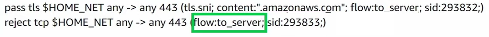

# AWS Network Firewall

## Introduction

Welcome to the AWS Network Firewall Best Practices Guide. The purpose of this guide is to provide prescriptive guidance for AWS Network Firewall for efficiently protecting your VPCs and their workloads. Publishing this guidance via GitHub will allow for quick iterations to enable timely recommendations that include service enhancements, as well as the feedback of the user community. This guide is designed to provide value whether you are deploying Network Firewall for the first time in a single account, or looking for ways to optimize Network Firewall in an existing multi-account and/or multi-VPC deployment.

## How to use this guide

This guide is geared towards security practitioners who are responsible for monitoring and remediation of security events, malicious activity and vulnerabilities within AWS accounts (and resources). The best practices are organized into different categories for easier consumption. Each category includes a set of corresponding best practices that begin with a brief overview, followed by detailed steps for implementing the guidance. The topics do not need to be read in a particular order.

* [Getting Started](#getting-started)
  * [Deployment Considerations](#deployment-considerations)
* [Implementation](#implementation)
* [Operationalizing](#operationalizing)
  * [Ensure Symmetric Routing](#ensure-symmetric-routing)
  * [Use “Strict rule ordering with Alert Established and Drop Established” Default actions](#use-strict-rule-ordering-with-alert-established-and-drop-established-default-actions)
  * [Use Stateful rules over Stateless rules](#use-stateful-rules-over-stateless-rules)
  * [Use Custom Suricata rules instead of UI generated rules](#use-custom-suricata-rules-instead-of-ui-generated-rules)
  * [Use as few Custom Rule Groups as possible](#use-as-few-custom-rule-groups-as-possible)
  * [Ensure the $HOME_NET variable is set correctly](#ensure-the-home_net-variable-is-set-correctly)
  * [Use Alert rule before Pass rule to log allowed traffic](#use-alert-rule-before-pass-rule-to-log-allowed-traffic)
  * [Use “flow:to_server” keyword in stateful rules](#use-flowto_server-keyword-in-stateful-rules)
  * [How to make sure your new Stateful firewall rules apply to existing flows](#how-to-make-sure-your-new-stateful-firewall-rules-apply-to-existing-flows)
  * [Set up logging and monitoring](#set-up-logging-and-monitoring)
  * [Options for Mitigating client side TLS SNI manipulation with AWS Network Firewall](#options-for-mitigating-client-side-tls-sni-manipulation-with-aws-network-firewall)
* [Cost Considerations](#cost-considerations)
* [Troubleshooting stateless rules for asymmetric forwarding](#troubleshooting-stateless-rules-for-asymmetric-forwarding)
* [Resources](#resources)

## What is AWS Network Firewall?

AWS Network Firewall is a managed service that makes it easy to deploy essential L3-L7 deep packet inspection protections for all of your [Amazon Virtual Private Clouds (VPCs)](https://aws.amazon.com/vpc/). It can filter traffic at the subnet level of your VPC, including filtering traffic going to and coming from an internet gateway, NAT gateway, over VPN, or AWS Direct Connect.

## What are the benefits of enabling AWS Network Firewall?

AWS Network Firewall has a highly flexible rule engine so you can build custom firewall rules to protect your unique workloads. It supports thousands of rules, and the rules can be based on port, protocol, and FQDN/domain. AWS Network Firewall supports rules written in Suricata format, giving you the ability to create customized rules based on specific network traffic characteristics, such as packet size or byte match pattern. Network Firewall also offers [AWS Managed domain lists](https://docs.aws.amazon.com/network-firewall/latest/developerguide/stateful-rule-groups-domain-names.html) and threat signatures so you don’t have to worry about writing and maintaining your own Suricata IPS rules.

## Getting started

In this section we will cover what you need to consider before activating AWS Network Firewall in your AWS infrastructure.

### Deployment Considerations

When customers first start deploying AWS Network Firewall, they might be tempted to start configuring it right away without looking at all its capabilities, for example deploying endpoints to each VPC, only using managed rules or not using Alert rules. We recommend looking into the [Network Firewall documentation](https://docs.aws.amazon.com/network-firewall/latest/developerguide/what-is-aws-network-firewall.html) as this could be a significant time-saver later down the road.

To get started you should understand the three main architecture patterns for Network Firewall deployments and what would be best suite your environment.

* Distributed deployment model — Network Firewall is deployed into each individual VPC.
* Centralized deployment model — Network Firewall is deployed into a centralized VPC attached to an instance of AWS Transit Gateway for East-West (VPC-to-VPC) or North-South (inbound and outbound from internet, on-premises) traffic. We refer to this VPC as the inspection VPC.
* Combined deployment model — Network Firewall is deployed into a centralized inspection VPC for East-West (VPC-to-VPC) and a subset of North-South (on-premises, egress) traffic. Internet ingress is distributed to VPCs that require dedicated inbound access from the internet, and Network Firewall is deployed accordingly.

See the [Deployment models for AWS Network Firewall blog post](https://aws.amazon.com/blogs/networking-and-content-delivery/deployment-models-for-aws-network-firewall/) for further details about deployment models.

## Implementation

In this section we will cover the minimum requirements for deploying AWS Network Firewall.

To deploy Network Firewall, you just need one VPC, one subnet, but for resiliency we highly recommend a firewall endpoint/subnet be deployed for each AZ that you have workloads in.


*Figure 1: Network Firewall VPC Configuration settings*

If you want to encrypt the Network Firewall configuration data at rest with your own key, you will need to specify a KMS key.


*Figure 2: Network Firewall CMK Configuration*

For more information on deployment refer to the [getting started with Network Firewall documentation](https://docs.aws.amazon.com/network-firewall/latest/developerguide/what-is-aws-network-firewall.html)

## Operationalizing

### Ensure Symmetric Routing

Network Firewall does not support Asymmetric routing so you will need to ensure symmetric routing is configured in your VPC. When you deploy Network Firewall into a VPC, you need to modify the route tables to ensure traffic is sent through firewall endpoints so that it can be inspected. Network Firewall does not support asymmetric routing so the route tables have to account for network flows going to the firewall endpoint in both directions.

When using [AWS Transit Gateway (TGW)](https://aws.amazon.com/transit-gateway/) in a centralized deployment configuration and using Network Firewall to inspect East-West traffic between VPCs, the [TGW’s appliance mode option](https://docs.aws.amazon.com/network-firewall/latest/developerguide/vpc-config.html) needs to be enabled for the attachments in the Inspection VPC. The appliance mode can be enabled in the AWS Console, as well as the API.

If appliance mode is not enabled, the return path traffic could land on an endpoint in a different AZ, which will prevent the Network Firewall from correctly evaluating the traffic against the firewall policy.

### Use “Strict rule ordering with Alert Established and Drop Established” Default actions

* In Network Firewall there are two options for how the Suricata engine is going to process rules.
  * The “Strict” option is recommended because it instructs Suricata to process the rules in the order you have defined.
  * The “Action Order” option supports Suricata’s default rule processing which is appropriate for IDS use cases but is not a good fit for typical firewall use cases.
* When selecting Strict rule-ordering you are also able to select a “Default” action, or actions that are run at the end of your rules and will be applied to any traffic not matching earlier rules. The two most often used are:
  * “Alert established” is a helpful option to help customers log all traffic flows through the firewall when starting out.  For customers looking to build out an allow-list policy, it also helpful to leave in place and log the traffic that would be blocked once they move to “Drop Established” (i.e. what traffic not explicitly allowed by any preceding firewall rules).
  * “Drop established” means that you are only allowing the traffic that you explicitly allow via your firewall rules and everything else is denied/dropped.  Customers can use this option once they are confident their policy has rules to only allow intended traffic. This rule will not log what is dropped by the rule unless the previous “Alert established” is also checked.


*Figure 3: Network Firewall Stateful Rule evaluation*

### Use Stateful rules over Stateless rules

* Stateless rules should be used very sparingly because they can easily cause asymmetric flow forwarding issues (where only one side of the flow is seen by the stateful inspection engine of the firewall) and they tend to make the overall firewall ruleset more complex to understand and troubleshoot. For the large majority of use cases we recommend the stateless engine’s default action be set to “Forward to stateful rule groups” and we recommend not having any stateless rules configured since they take precedence over stateful rules.
* If you are going to use stateless rules, it’s important to understand how to use the Network Firewall’s Stateless Rule Group Analyzer to troubleshoot and resolve asymmetric flow issues. See the “Troubleshooting stateless rules for asymmetric forwarding”
* Customers should leverage Stateful rules if they want to get the deep packet inspection IPS capabilities of the Network Firewall. Some customers accidentally start with stateless rules only to find out later that they really needed to use stateful rules instead.
  * Stateless rules could be used in the case where you don't want some traffic to be logged or alerted on and simply denied, but for the most part your rule groups should look like this (below) in the AWS Console:


*Figure 4: Network Firewall Stateless Rule Groups*

* Pros of using Stateful rules
  * Return traffic is automatically allowed so there is no need to define both ingress & egress rules for the same flow of traffic
  * Deep packet inspection is supported, which gives you a deeper visibility into layer 7 attributes of the traffic
  * Supports logging so customers can review the full application level details of traffic, as well as the standard 5-tuple flow information
  * These rules are easier to troubleshoot, and they are much more flexible and capable than the stateless rules
    * Customers can add a description to the rules, such as its creation date (with change request number), use case or other comments
  * The Reject action is supported
  * The capacity calculation for these rules is easier to work with

### Use Custom Suricata rules instead of UI generated rules

These are configurable under the Stateful rule group options and are a free-form text that you to have full control. They allow you to more easily leverage the full flexibility of Suricata. Here are [example Suricata rules](https://docs.aws.amazon.com/network-firewall/latest/developerguide/suricata-examples.html) that customers have found helpful when getting started.


*Figure 5: Network Firewall Stateful Rule Group*

We recommend you educate yourself and your team on using custom Suricata rules early in their adoption because often later they will need the power and flexibility of custom Suricata rules to support all their use cases.  

The pros of using customer Suricata rules:

* Maximum flexibility
* Control over the alerting and how it shows up in the logs
* Custom rule signature ID can be used which helps troubleshooting and simplifying log analysis
* Free-form text rules are easier to copy, edit, share, and backup.
* Easy to switch rule(s) from one rule group to another (blue-green testing for example)
* Allow for adding the very important keyword: “flow:to_server” to rules easily

Below we have also included a custom template for an egress security use case to show examples of custom suricata rules.

```
# This is a "Strict rule ordering" egress security template meant only for the egress use case. These rules would need to be adjusted to accommodate any other use cases. Use this ruleset with "Strict" rule ordering firewall policy and no default block action, as this template includes custom default block rules at the end. 
# This template will not work well with the "Drop All" or "Drop Established" default firewall policy actions.
# Make sure the $HOME_NET variable is set correctly (do this at the firewall policy level so all RGs inherit it)

# Silently allow TCP 3-way handshake to be setup by $HOME_NET clients
# Do not move this section, it's important that this be at the top of the entire firewall ruleset to reduce rule conflicts
pass tcp $HOME_NET any -> any any (flow:not_established, to_server; sid:202501021;)
pass tcp any any -> $HOME_NET any (flow:not_established, to_client; sid:202501022;)

# Block, but do not log any ingress request traffic from the outside
# Remove 'noalert' from this rule if you want the ingress traffic to be logged.
drop ip any any -> $HOME_NET any (flow:to_server; noalert; sid:202501023;)

# Silently allow TCP Resets out
# TCP Resets are trusted so it's safe to allow them out. This rule helps reduce noise in the logs.
pass tcp $HOME_NET any -> any any (msg:"pass rule do not log"; flags:R; sid:202501054;)

# Silently allow/ignore inspection of bogon traffic
# This traffic should not normally hit the Network Firewall, but we have seen cases where this is a misconfigruation that causes it to
pass ip $HOME_NET any -> 169.254.0.0/16 any (sid:202501067;)

# Turn on JA3/S hash logging for all other tls alert rules (like sid:999991)
alert tls $HOME_NET any -> any any (ja3.hash; content:!"xxxxxxxxxxxxxxxxxxxxxxxxxxxxxxxx"; noalert; flow:to_server; sid:202501024;)
alert tls any any -> $HOME_NET any (ja3s.hash; content:!"xxxxxxxxxxxxxxxxxxxxxxxxxxxxxxxx"; noalert; flow:to_client; sid:202501025;)

# Direct to IP connections
reject http $HOME_NET any -> any any (http.host; content:"."; pcre:"/^(?:[0-9]{1,3}\.){3}[0-9]{1,3}$/"; msg:"HTTP direct to IP via http host header (common malware download technique)"; flow:to_server; sid:202501026;)
reject tls $HOME_NET any -> any any (tls.sni; content:"."; pcre:"/^(?:[0-9]{1,3}\.){3}[0-9]{1,3}$/"; msg:"TLS direct to IP via TLS SNI (common malware download technique)"; flow:to_server; sid:202501027;)

# Block higher risk Geoip
drop ip $HOME_NET any -> any any (msg:"Egress traffic to RU IP"; geoip:dst,RU; metadata:geo RU; flow:to_server; sid:202501028;)
drop ip $HOME_NET any -> any any (msg:"Egress traffic to CN IP"; geoip:dst,CN; metadata:geo CN; flow:to_server; sid:202501029;)

# Block higher risk ccTLDs
reject tls $HOME_NET any -> any any (tls.sni; content:".ru"; nocase; endswith; msg:"Egress traffic to RU ccTLD"; flow:to_server; sid:202501036;)
reject http $HOME_NET any -> any any (http.host; content:".ru"; endswith; msg:"Egress traffic to RU ccTLD"; flow:to_server; sid:202501037;)
reject tls $HOME_NET any -> any any (tls.sni; content:".cn"; nocase; endswith; msg:"Egress traffic to CN ccTLD"; flow:to_server; sid:202501038;)
reject http $HOME_NET any -> any any (http.host; content:".cn"; endswith; msg:"Egress traffic to CN ccTLD"; flow:to_server; sid:202501039;)

# Log higher risk ports
alert ip $HOME_NET any -> any 53 (msg:"Possible GuardDuty/DNS Firewall bypass!"; flow:to_server; sid:202501055;)
alert ip $HOME_NET any -> any 1389 (msg:"Possible Log4j callback!"; flow:to_server; sid:202501059;)
alert ip $HOME_NET any -> any [4444,666,3389] (msg:"Egress traffic to high risk port!"; flow:to_server; sid:202501058;)

# Port/protocol enforcement (TLS can only use TCP/443, TLS can't use anything other than TCP/443, etc.)
reject tcp $HOME_NET any -> any 443 (msg:"Egress Port TCP/443 but not TLS"; app-layer-protocol:!tls; flow:to_server; sid:202501030;)
reject tls $HOME_NET any -> any !443 (msg:"Egress TLS but not port TCP/443"; flow:to_server; sid:202501031;)
reject tcp $HOME_NET any -> any 80 (msg:"Egress Port TCP/80 but not HTTP"; app-layer-protocol:!http; flow:to_server; sid:202501032;)
reject http $HOME_NET any -> any !80 (msg:"Egress HTTP but not port TCP/80"; flow:to_server; sid:202501033;)
reject tcp $HOME_NET any -> any 22 (msg:"Egress Port TCP/22 but not SSH"; app-layer-protocol:!ssh; flow:to_server; sid:202501060;)
reject ssh $HOME_NET any -> any !22 (msg:"Egress SSH but not port TCP/22"; flow:to_server; sid:202501061;)

# Silently (do not log) allow low risk protocols out to anywhere
pass ntp $HOME_NET any -> any 123 (flow:to_server; msg:"pass rules do not alert/log"; sid:202501034;)
pass icmp $HOME_NET any -> any any (flow:to_server; msg:"pass rules do not alert/log"; sid:202501035;)

# Block high risk TLDs
reject tls $HOME_NET any -> any any (tls.sni; content:".xyz"; nocase; endswith; msg:"High risk TLD .xyz blocked"; flow:to_server; sid:202501040;)
reject http $HOME_NET any -> any any (http.host; content:".xyz"; endswith; msg:"High risk TLD .xyz blocked"; flow:to_server; sid:202501041;)
reject tls $HOME_NET any -> any any (tls.sni; content:".info"; nocase; endswith; msg:"High risk TLD .info blocked"; flow:to_server; sid:202501042;)
reject http $HOME_NET any -> any any (http.host; content:".info"; endswith; msg:"High risk TLD .info blocked"; flow:to_server; sid:202501043;)
reject tls $HOME_NET any -> any any (tls.sni; content:".top"; nocase; endswith; msg:"High risk TLD .top blocked"; flow:to_server; sid:202501044;)
reject http $HOME_NET any -> any any (http.host; content:".top"; endswith; msg:"High risk TLD .top blocked"; flow:to_server; sid:202501045;)

# Alert on requests to possible suspicious TLDs
alert tls $HOME_NET any -> any any (tls.sni; pcre:"/^(?!.*\.(com|org|net|io|edu|aws)$).*/i"; flow:to_server; msg:"Request to possible suspicious TLDs"; sid:202501065;)
alert http $HOME_NET any -> any any (http.host; pcre:"/^(?!.*\.(com|org|net|io|edu|aws)$).*/i"; flow:to_server; msg:"Request to possible suspicious TLDs"; sid:202501066;)


# Silently (do not log) allow AWS public service endpoints that we have not setup VPC endpoints for yet
# VPC endpoints are highly encouraged. They reduce NFW data processing costs and allow for additional security features like VPC endpoint policies.

pass tls $HOME_NET any -> any any (tls.sni; content:"ec2messages."; startswith; nocase; content:".amazonaws.com"; endswith; nocase; flow:to_server; sid:202501047;)
pass tls $HOME_NET any -> any any (tls.sni; content:"ssm."; startswith; nocase; content:".amazonaws.com"; endswith; nocase; flow:to_server; sid:202501048;)
pass tls $HOME_NET any -> any any (tls.sni; content:"ssmmessages."; startswith; nocase; content:".amazonaws.com"; endswith; nocase; flow:to_server; sid:202501049;)

# Allow-list of strict FQDNs to silently allow
pass tls $HOME_NET any -> any any (tls.sni; content:"checkip.amazonaws.com"; startswith; nocase; endswith; flow:to_server; sid:202501050;)
pass http $HOME_NET any -> any any (http.host; content:"checkip.amazonaws.com"; startswith; endswith; flow:to_server; sid:202501051;)

# Allow-List of strict FQDNs, but still alert on them
alert tls $HOME_NET any -> any any (tls.sni; content:"www.example.com"; startswith; nocase; endswith; flow:to_server; msg:"TLS SNI Allowed"; sid:202501052;)
pass tls $HOME_NET any -> any any (tls.sni; content:"www.example.com"; startswith; nocase; endswith; flow:to_server; msg:"pass rules do not alert/log"; sid:202501053;)

# Allow-List of second level domain and all of its subdomains
pass tls $HOME_NET any -> any any (tls.sni; content:"amazon.com"; dotprefix; nocase; endswith; flow:to_server; msg:"pass rules do not alert/log"; sid:202501078;)

# Custom Default Block Rules
# Use this instead of firewall policy default actions like "Drop Established" or "Drop All"
# Block and log any egress traffic not already allowed above 
reject tls $HOME_NET any -> any any (ssl_state:client_hello; flow:to_server; msg:"Default Egress HTTPS Reject"; sid:999991;)
reject http $HOME_NET any -> any any (msg:"Default Egress HTTP Reject"; flow:to_server; sid:999992;)
reject tcp $HOME_NET any -> any any (app-layer-protocol:!tls; app-layer-protocol:!http; msg:"Default Egress TCP Reject"; flow:to_server; sid:999993;)
drop udp $HOME_NET any -> any any (msg:"Default Egress UDP Drop"; flow:to_server; sid:999994;)
drop icmp $HOME_NET any -> any any (msg:"Default Egress ICMP Drop"; flow:to_server; sid:999996;)
```

### Use as few Custom Rule Groups as possible

The reasons for this we have listed below:

* When a custom rule group is created, its capacity needs to be defined and extra headroom needs to be taken into account because capacity cannot be modified after a rule group has been created. Having many rule groups creates additional headaches for managing rule capacity limits. For capacity it is recommended to set your custom rule group capcity to whatever leftover capacity you have after implementing your AWS managed rule groups.
* With several rule groups to manage, understanding how traffic is going to be handled becomes more complex since every rule group needs to be inspected to analyze how it impacts the traffic. Seeing your rules in one view makes it easier to identify if a rule conflicts or overshadows other rules instead of jumping between multiple rule groups to stitch together an understanding of how traffic will be evaluated by the policy.
* Network Firewall supports a maximum combined total of 20 rule groups (Managed and Custom).  If you create many custom rule groups you will limit how many AWS Managed Rule Groups can also be added.
* For troubleshooting purposes, you will want to make sure Signature IDs (SIDs) are unique across all rule groups.  Within a single rule group Network Firewall will enforce unique SIDs, but not across all rule groups. If you don’t have unique SIDs across all rule groups then it can be more challenging to understand from the logs which rule actually handled the traffic.

### Ensure the $HOME_NET variable is set correctly

By default the $HOME_NET variable is set to the CIDR range of the VPC where Network Firewall is deployed.


*Figure 6: Network Firewall HOME_NET Variable*

However this default behavior might not cover the CIDR ranges of the VPCs you want to protect, like Spoke VPC A and Spoke VPC B in the above example.

You want to make sure that the $HOME_NET CIDR range lines up with all your VPCs that you intend to protect and match traffic against.

This variable can be set at a global firewall policy level or in each rule group. If it’s set at both levels, the rule group setting wins.

The $HOME_NET variable and it’s inverse ($EXTERNAL_NET) are used for matching traffic in AWS managed rules. $EXTERNAL_NET follows $HOME_NET and is always anything outside of $HOME_NET.

When using the managed rules for an east/west use case you will want to decide which VPCs/CIDRs you want to protect and assign only those CIDRs to the $HOME_NET variable. If you assign all VPCs/CIDRs then none of those CIDR ranges will be matched by the $EXTERNAL_NET variable in the managed rules. You can also copy out the rules from the threat signatures and adjust the variables to your liking (even replacing the variables by “any“) if you want them to match any/all CIDRs. The downside of doing this is those rules will be static at that point in time and will not be automatically updated like the AWS managed rules.

Here is an example custom Suricata rule that can help you identify if you have traffic going through the firewall that is not included in $HOME_NET and perhaps should be:

alert tcp !$HOME_NET any -> !$HOME_NET any (flow:to_server,established; msg:"It looks like you might have $HOME_NET traffic that is not a part of the $HOME_NET variable. Please make sure your $HOME_NET variable is set correctly."; sid:39179777;)

### Use Alert rule before Pass rule to log allowed traffic

If you have a mandate to log all traffic (denied or allowed), you need to add an alert rule for the same traffic as the pass rule before the pass rule itself in your rule group because Pass rules in Suricata simply allow the traffic and do not log it.

```
#Log allowed traffic to https://*.amazonaws.com
alert tls $HOME_NET any -> any any (tls.sni; content:".amazonaws.com"; nocase; endswith; msg:"*.amazonaws.com allowed by sid:021420242"; flow:to_server; sid:021420241;)
pass tls $HOME_NET any-> any any (tls.sni; content:".amazonaws.com"; nocase; endswith; msg:"Pass rules don't alert, alert is on sid:021420241"; flow.to_server; sid:021420242;)
```

You need to use Strict Ordering and the Alert rule needs a higher priority than the Pass rule as demonstrated in the code sample above.

The SID in the alert rule message can refer the SID of the pass rule and vice-versa. It can be helpful to use longer SIDs so that you can quickly search your logs for that SID without the query showing unrealted information that might also contain that identifier.

### Use “flow:to_server” keyword in stateful rules

With Suricata, it’s possible to configure conflicting rule sets. When traffic to a destination operates at different layers of the [OSI model](https://en.wikipedia.org/wiki/OSI_model), traffic we want to allow that is operating at a higher level(for example TLS) might get blocked by a rule that is operating at a lower level. For example TCP:


*Figure 7: Network Firewall TCP example*

Using “flow:to_server” in the rules will make the rules operate at the same level and evaluate the traffic at the same time so that the pass rule has a chance to inspect the traffic before the reject rule blocks the traffic.



*Figure 8: Network Firewall flow:to_server established*

See [Troubleshooting rules in Network Firewall](https://docs.aws.amazon.com/network-firewall/latest/developerguide/troubleshooting-rules.html) for more information on troubleshooting firewall rules

### How to make sure your new Stateful firewall rules apply to existing flows

Network Firewall leverages the Suricata deep packet inspection engine for all Stateful firewall rules. After a flow has been allowed by a Suricata rule, Suricata places that flow in the state table so that it knows it no longer needs to spend resources running deep packet inspection on that flow. For as long as that flow remains active, any new Stateful firewall rules will not apply to that traffic since a decision was already made on that flow. Sometimes you may want your newly added Stateful firewall rules to apply to all traffic, including already active traffic that has been previously allowed through the firewall. For example, perhaps you began setting up the network firewall and started with an, "allow all traffic" type of rule, but then as you get further along in the deployment  and testing of network firewall you may want to narrow down your ruleset, and ensure that even already allowed traffic must be processed by your new rules.

How to clear the Network Firewall stateful rules state table

* Go into the "Details" page of your firewall policy
* Edit the "Stream exception policy" to something other than what it is currently set to, and click Save
* Then edit the "Stream exception policy" and set it back to what you had it set to before. In the majority of cases we recommend: "Stream exception policy: Reject"

Now any and all traffic, even if it is traffic that was previously allowed, will be re-evaluated against the latest stateful firewall rules.

### Set up logging and monitoring

Network Firewall supports two log types, Alert logs and Flow logs

* Alert logs
  * Information from Suricata
  * IPS engine
  * Layer 7 attributes (like domains)
  * Protocol detection
* Flow logs
  * 5=tuple information that flows across the firewall
  * Include the volume of traffic
    * Helps identify the top producers and consumers of data
* It is very helpful to have a CloudWatch Dashboard created with CloudWatch Contributor insights that pulls from both types of logs, AWS support (Todd Pula) provides a [sample dashboard](https://github.com/aws-samples/aws-networkfirewall-cfn-templates/tree/main/cloudwatch_dashboard) with a cloudformation template. For example, you may want to see top domains allowed (alert logs) alongside top IPs sending data (Flow logs) so that you can hover over any data point in the dashboard and see what the corresponding information is across both data sources:

* Alert logs
  * Top protocols used
  * Top domains allowed/blocked
  * Top ports allowed/blocked
  * Top source IPs (workloads) in the VPC being allowed/blocked
* Flow logs
  * Destination IPs with most used bandwidth
  * Source IPs with most used bandwidth
  * Port/protocol with most used bandwidth

## Cost considerations

Because each Network Firewall endpoint has hourly charges even if it’s not used, reduce the number of endpoints by leveraging a centralized inspection design and Transit Gateway (TGW).

Do not send traffic to Network Firewall that does not need to be inspected. To avoid these unnecessary processing charges on Network Firewall, use TGW route tables to segment your network, for example keeping VPC Prod from talking to VPC Dev if these VPCs don’t need to communicate.

Use the free VPC endpoints for S3 and DynamoDB instead of sending that traffic through Network Firewall.

Leverage PrivateLink endpoints provided by 3rd party services that do not need to be inspected by the firewall.

Ensure route tables are sending traffic to the local Network Firewall endpoint and not to another AZ’s endpoint. This design will avoid incurring cross-AZ data transfer charges.

Use DNS Firewall to keep traffic off of Network Firewall. Basic blocks can be configured at the DNS layer for traffic that would otherwise reach Network Firewall, effectively blocking traffic “closest to the packet source”.

## Troubleshooting stateless rules for asymmetric forwarding

Certain stateless rule configurations can cause traffic to be inspected by the stateful engine in one direction only, most commonly when a stateless “Pass” or “Forward to stateful rules” is used without a counterpart rule matching the return direction.

To identify stateless rules causing this asymmetric forwarding, use the service’s built-in rule analyzer, and then update your rule group to either remove the asymmetric rule or add a rule that matches the return traffic. You can use AWS Management Console to analyze your stateless rule group, or use the API or CLI by calling DescribeRuleGroup and setting the “AnalyzeRuleGroup” option.

Here’s an example of how you can analyze your rule group using AWS Management Console. Go to your stateless rule group and click “Analyze”


The rule group analyzer identified that stateless rule with priority 2 will lead to asymmetric routing through Network Firewall.


To fix this issue you can click on “Edit” and add another rule to allow return traffic i.e. from 0.0.0.0/0 to 10.2.0.0/24.


After updating the rules, run the analyzer again to confirm the issue has been resolved.


Please reach out to AWS Support team if you have any questions.

## Options for Mitigating client side TLS SNI manipulation with AWS Network Firewall

TLS SNI filtering is the industry standard mechanism for network appliances to perform domain filtering to control egress traffic. It’s a straightforward and simple way to monitor and control TLS traffic without the need for resolving domains to IP addresses, which can be unreliable and also opens up a potential vulnerability since CDNs are so commonly used for website hosting, and allowing access to a CDN’s IP allows access to all domains hosted on the CDN, if the client is able to craft forged requests. SNI filtering also has a similar limitation, in that if a client is able to craft forged requests, the request could claim to be going to a legitimate domain, but actually connect to an illegitimate IP address instead. In both of these client side SNI manipulation cases a prerequisite is that the system is already to some extent compromised.

* So how do we address this?

First and foremost, we concentrate on reducing the likelihood that the workload could be compromised to the extent that SNI manipulation could occur. Leveraging AWS Network Firewall’s Managed Rules, is a good place to start since they block well-known high risk threats. Many AWS customers start here, and then also move towards a least privilege security model where only a short list of legitimate domains is allowed, and all others are blocked by default. A domain allow-list reduces the risk surface substantially, again, further reducing the opportunity for a workload to be compromised and able to be used to send forged requests.

* But what if I want to directly block client side SNI manipulation with AWS Network Firewall?

That can be accomplished by enabling [AWS Network Firewall’s TLS decryption feature](https://docs.aws.amazon.com/network-firewall/latest/developerguide/tls-inspection-configurations.html). When TLS decrypt is enabled, client side SNI manipulation is blocked by default and this error message is displayed in the firewall’s TLS log:

```
{
    "firewall_name": "NetworkFirewall",
    "availability_zone": "us-east-1a",
    "event_timestamp": 1727451885,
    "event": {
        "timestamp": "2024-09-27T15:44:45.321222Z",
        "src_ip": "10.2.1.145",
        "src_port": "39038",
        "dest_ip": "44.193.128.70",
        "dest_port": "443",
        "sni": "spoofedsni.com",
        "tls_error": {
            "error_message": "SNI: spoofedsni.com Match Failed to server certificate names: checkip.us-east-1.prod.check-ip.aws.a2z.com/checkip.us-east-1.prod.check-ip.aws.a2z.com/checkip.amazonaws.com/checkip.check-ip.aws.a2z.com "
        }
    }
}
```

* But what other options do I have to block client side SNI manipulation?

It’s possible to add both SNI Domain checks and DNS Domain-to-IP checks so that SNI requests are only allowed out to IP addresses that are associated with the domain in DNS. [This is an example solution](https://aws.amazon.com/blogs/security/how-to-control-non-http-and-non-https-traffic-to-a-dns-domain-with-aws-network-firewall-and-aws-lambda/) that accomplishes this with Network Firewall. Both of these solutions above have downsides in added cost and/or complexity, so we recommend customers first start by moving towards a Domain Allow-List, and then determine if the workload’s security requirements dictate that more controls should be added.

Another capability Network Firewall has in combating TLS SNI spoofing is JA3 filtering. You can think of JA3 as similar to an HTTP User-Agent, but for TLS, and not easily configurable. You can learn more about JA3 [here](https://engineering.salesforce.com/tls-fingerprinting-with-ja3-and-ja3s-247362855967/). Let's look at a couple examples of how we can use tls.sni filtering AND ja3.hash filtering together.

First let's assume my TLS domain allow-list looks like this:

```
pass tls $HOME_NET any -> any any (tls.sni; content:"ssm.us-east-1.amazonaws.com"; nocase; flow:to_server; sid:11111;)
pass tls $HOME_NET any -> any any (tls.sni; content:"ssmmessages.us-east-1.amazonaws.com"; nocase; flow:to_server; sid:22222;)
pass tls $HOME_NET any -> any any (tls.sni; content:"ec2.us-east-1.amazonaws.com"; nocase; flow:to_server; sid:33333;)
reject tls $HOME_NET any -> any any (msg:"TLS not on domain allow-list blocked"; flow:to_server; sid:44444;)
```

If I wanted to lock it down further so that these specific domains can only be accessed by the JA3 hash of their client agents, I could convert my domain allow-list to look like this:

```
pass tls $HOME_NET any -> any any (tls.sni; content:"ssm.us-east-1.amazonaws.com"; nocase; ja3.hash; content:"7a15285d4efc355608b304698cd7f9ab"; sid:11111;)
pass tls $HOME_NET any -> any any (tls.sni; content:"ssmmessages.us-east-1.amazonaws.com"; nocase; ja3.hash; content:"1be8360b66649edee1de25f81d98ec27"; sid:22222;)
pass tls $HOME_NET any -> any any (tls.sni; content:"ec2.us-east-1.amazonaws.com"; nocase; ja3.hash; content:"fd75aaca18604d62f2bc8b02b345140f"; sid:33333;)
reject tls $HOME_NET any -> any any (msg:"TLS not on domain/JA3 allow-list blocked"; flow:to_server; sid:44444;)
```

With the above ruleset in place, I can no longer curl to a domain on my domain allow-list, because each domain is locked down to only be accessible via the correct JA3. Now in order for SNI spoofing to be successful, not only would the client system need to be compromised to the extent that special commands could be crafted and launched from it, but now the attacker would have to have such deep control of the system that they could even manipulate the specific client agents/processes to make connections out to a domain on the allow-list.

Another option is to not be so strict, but instead allow only the 3 JA3s to access any of the SNIs like this:

```
alert tls $HOME_NET any -> any any (ja3.hash; content:"7a15285d4efc355608b304698cd7f9ab"; flowbits:set,ja3_allowed; noalert; sid:11111;)
alert tls $HOME_NET any -> any any (ja3.hash; content:"1be8360b66649edee1de25f81d98ec27"; flowbits:set,ja3_allowed; noalert; sid:22222;)
alert tls $HOME_NET any -> any any (ja3.hash; content:"fd75aaca18604d62f2bc8b02b345140f"; flowbits:set,ja3_allowed; noalert; sid:33333;)
pass tls $HOME_NET any -> any any (tls.sni; content:"ssm.us-east-1.amazonaws.com"; nocase; flowbits:isset,ja3_allowed; sid:44444;)
pass tls $HOME_NET any -> any any (tls.sni; content:"ssmmessages.us-east-1.amazonaws.com"; flowbits:isset,ja3_allowed; nocase; sid:55555;)
pass tls $HOME_NET any -> any any (tls.sni; content:"ec2.us-east-1.amazonaws.com"; nocase; flowbits:isset,ja3_allowed; sid:66666;)
reject tls $HOME_NET any -> any any (msg:"TLS not on domain/JA3 allow-list blocked"; flow:to_server; sid:77777;)
```

The above two options have drawbacks in that they require that any time there is a client agent upgrade the new JA3 hash be added to the allow-list before it'll work. This is added complexity for added security value.

But how can we allow for a little bit of flexibility to ease the management of the allow-lists while still continuing to reduce the risk surface?

Another option is to track which destination IPs have been contacted by approved JA3 hashes, remember them for a period of time, and then only let our TLS domain allow list work out to those higher trust destination IPs. Here is what that ruleset might look like:

```
alert tls $HOME_NET any -> any any (ja3.hash; content:"7a15285d4efc355608b304698cd7f9ab"; xbits:set, allowed_ja3_destination_ips, track ip_dst, expire 21600; sid:11111;)
alert tls $HOME_NET any -> any any (ja3.hash; content:"1be8360b66649edee1de25f81d98ec27"; xbits:set, allowed_ja3_destination_ips, track ip_dst, expire 21600; sid:22222;)
alert tls $HOME_NET any -> any any (ja3.hash; content:"fd75aaca18604d62f2bc8b02b345140f"; xbits:set, allowed_ja3_destination_ips, track ip_dst, expire 21600; sid:33333;)
pass tls $HOME_NET any -> any any (tls.sni; content:"ssm.us-east-1.amazonaws.com"; nocase; xbits:isset, allowed_ja3_destination_ips, track ip_dst; sid:44444;)
pass tls $HOME_NET any -> any any (tls.sni; content:"ssmmessages.us-east-1.amazonaws.com"; xbits:isset, allowed_ja3_destination_ips, track ip_dst; nocase; sid:55555;)
pass tls $HOME_NET any -> any any (tls.sni; content:"ec2.us-east-1.amazonaws.com"; nocase; xbits:isset, allowed_ja3_destination_ips, track ip_dst; sid:66666;)
reject tls $HOME_NET any -> any any (msg:"TLS not on domain/A3 allow-list blocked"; flow:to_server; sid:77777;)
```

The above option will let a new JA3 seen access the TLS domain allow list, but only if the request is going to an IP that an approved JA3 has already been talking to. This can provide some flexibility without providing too much flexibility.
Each customer will have to determine if their specific application's threat model justifies the added overhead of maintaining a JA3 allow-list. Most AWS Network Firewall customers are satisfied with the significant risk reduction of a domain allow-list, and don't find it necessary to also lock down the domains to an allow-list of JA3 hashes too.

## Resources

### Workshops

* [AWS Network Firewall Workshop](https://catalog.workshops.aws/networkfirewall/en-US)
* [Egress Controls Workshop](https://catalog.us-east-1.prod.workshops.aws/workshops/503778b9-6dbb-4e0d-9920-e8dbae141f43/en-US)

### Videos

* [Introduction, Best Practices and Custom Suricata Rules](https://www.youtube.com/watch?v=67pVOv3lPlk)
* [AWS Network Firewall console experience](https://www.youtube.com/watch?v=BYVObzBWnqo&list=PLhr1KZpdzukfJzNDd8eCJH_TGg24ZTwP6&index=1&pp=iAQB)
* [Decrypt, inspect, and re-encrypt TLS egress traffic at scale](https://www.youtube.com/watch?v=S7_hUxWrYmw&list=PLhr1KZpdzukfJzNDd8eCJH_TGg24ZTwP6&index=3&pp=iAQB)
* [Decrypt, inspect, and re-encrypt TLS traffic at scale](https://www.youtube.com/watch?v=j2pLuHdAj0A&list=PLhr1KZpdzukfJzNDd8eCJH_TGg24ZTwP6&index=40&pp=iAQB)
* [AWS Network Fireall Suricata HOME_NET variable override](https://www.youtube.com/watch?v=ufx8sO5s4BI&list=PLhr1KZpdzukfJzNDd8eCJH_TGg24ZTwP6&index=22&pp=iAQB)
* [AWS Network Firewall support for reject action for TCP traffic](https://www.youtube.com/watch?v=_K_2TVNygF4&list=PLhr1KZpdzukfJzNDd8eCJH_TGg24ZTwP6&index=54&pp=iAQB)
* [AWS Network Firewall tag-based resource groups](https://www.youtube.com/watch?v=SDj_tMHN5Zk&list=PLhr1KZpdzukfJzNDd8eCJH_TGg24ZTwP6&index=55&pp=iAQB)
* [AWS re:Inforce 2023 - Firewalls, and where to put them (NIS306)](https://www.youtube.com/watch?v=lTJxWAiQrHM)

### Blogs

* [Deployment models](https://aws.amazon.com/blogs/networking-and-content-delivery/deployment-models-for-aws-network-firewall/)
* [Cost considerations and common options for AWS Network Firewall log management](https://aws.amazon.com/blogs/security/cost-considerations-and-common-options-for-aws-network-firewall-log-management/)
* [TLS inspection configuration for encrypted traffic and AWS Network Firewall](https://aws.amazon.com/blogs/security/tls-inspection-configuration-for-encrypted-traffic-and-aws-network-firewall/)
* [How to control non-HTTP and non-HTTPS traffic to a DNS domain with AWS Network Firewall and AWS Lambda](https://aws.amazon.com/blogs/security/how-to-control-non-http-and-non-https-traffic-to-a-dns-domain-with-aws-network-firewall-and-aws-lambda/)
* [Use AWS Network Firewall to filter outbound HTTPS traffic from applications hosted on Amazon EKS and collect hostnames provided by SNI](https://aws.amazon.com/blogs/security/use-aws-network-firewall-to-filter-outbound-https-traffic-from-applications-hosted-on-amazon-eks/)
* [How to deploy AWS Network Firewall by using AWS Firewall Manager](https://aws.amazon.com/blogs/security/how-to-deploy-aws-network-firewall-by-using-aws-firewall-manager/)
* [Introducing Prefix Lists in AWS Network Firewall Stateful Rule Groups](https://aws.amazon.com/blogs/networking-and-content-delivery/introducing-prefix-lists-in-aws-network-firewall-stateful-rule-groups/)
* [How to analyze AWS Network Firewall logs using Amazon OpenSearch Service – Part 1](https://aws.amazon.com/blogs/networking-and-content-delivery/how-to-analyze-aws-network-firewall-logs-using-amazon-opensearch-service-part-1/)
* [How to analyze AWS Network Firewall logs using Amazon OpenSearch Service – Part 2](https://aws.amazon.com/blogs/networking-and-content-delivery/how-to-analyze-aws-network-firewall-logs-using-amazon-opensearch-service-part-2/)

### Sample Code
* [AWS Network Firewall CloudWatch Dashboard](https://github.com/aws-samples/aws-networkfirewall-cfn-templates/tree/main/cloudwatch_dashboard)
* [AWS Network Firewall Automation Examples](https://github.com/aws-samples/aws-network-firewall-automation-examples/tree/main)
