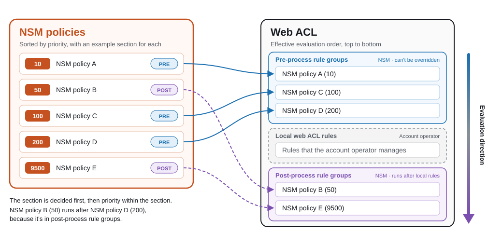

<!--
AUTHORING NOTES (applies to every NSM page)
- Always qualify "rule" as "WAF rule" or "NSM rule". Never use "rule" on its own.
- Avoid the word "policy" unless it refers to an NSM policy, and then write "NSM policy". Qualify other policies, such as "Firewall Manager policy".
- Each firewall type's "Recommended Design" page uses the same table columns (Priority, Importance, NSM policy, Scopes, Business need, NSM rules), Importance values, write-up fields (Contains, Why it's its own NSM policy, Scope, Most common owner), and scopes from the shared Common scopes list.
- Copy this entire comment block to the top of any new NSM page.
-->

# AWS WAF

## Overview

This section rebuilds the recommendations from the [AWS WAF Best Practices](../../../../waf/index.md) guide in NSM, including the [AWS Managed Rules](../../../../waf/aws-managed-rules/docs/index.md) and the [Recommended WAF Rule Order](../../../../waf/recommended-waf-rule-order/docs/index.md). We recommend this build as a best practice for managing AWS WAF with NSM.

The exact code for this build is in the [accompanying GitHub repository](https://PLACEHOLDER-github-repo). This section reviews each part of the build and explains what it outputs and why it's included.

<!-- TODO -->

## Rule sections and NSM policy priority

A web ACL that NSM manages evaluates WAF rules in three sections, from top to bottom in the following table. Together, the three sections are the complete WAF rule order.

| Runs | Section | Who manages it | Can a local operator override it? |
|---|---|---|---|
| First ⬇ | Pre-process rule groups | NSM | No |
| Next ⬇ | Local web ACL rules | The account's operator, such as an application team | Not applicable |
| Last | Post-process rule groups | NSM | Yes. Local web ACL rules run first. |

The difference between the two centrally managed sections, pre-process and post-process rule groups, is who gets the last word. NSM rules in pre-process rule groups run before any local web ACL rule, so a local operator can't override them. NSM rules in post-process rule groups run after the pre-process rule groups and after the local web ACL rules, so a local operator can act on a request before they run. For example, a local *Allow* rule ends evaluation before the post-process rule groups see the request.

NSM policy priority doesn't move an NSM rule between sections. The section decides where an NSM rule runs in the web ACL, and priority decides the order of NSM rules within that section. For example, an NSM policy at priority 50 in post-process rule groups runs after an NSM policy at priority 9500 in pre-process rule groups, because every pre-process rule group runs before every post-process rule group.

The following example shows five NSM policies, each assigned to pre-process or post-process rule groups, and the order that the web ACL evaluates them in.

<!-- TODO: how to place an NSM policy or NSM rule in pre-process or post-process rule groups -->

Labels affect which section to use. WAF rules in post-process rule groups can read labels that pre-process rule groups add, but not labels that local web ACL rules add. A local operator who wants to grant an exception to an NSM rule in post-process rule groups therefore uses a local *Allow* rule, not an exception label. For more information, see [Creating Exceptions](../../../../waf/operationalizing/docs/index.md#creating-exceptions) in the AWS WAF Best Practices guide.

## AWS WAF sections

* [Recommended Design](../recommended-design/docs/index.md) – The recommended AWS WAF NSM policies in priority order
* [Rule Examples](../rule-examples/docs/index.md) – The configuration of each NSM rule in those NSM policies
* [Label-Based Exceptions](../label-based-exceptions/docs/index.md) – Grant application exceptions to AMRs at scale
