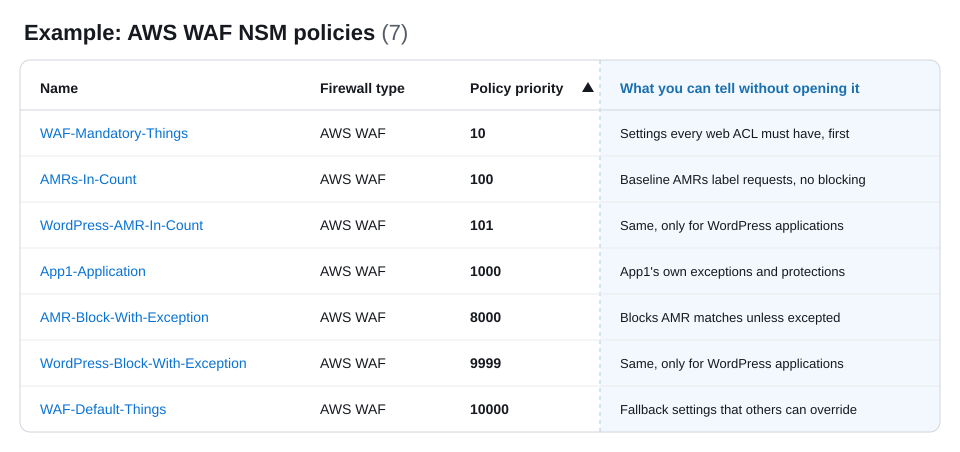

<!--
AUTHORING NOTES (applies to every NSM page)
- Always qualify "rule" as "WAF rule" or "NSM rule". Never use "rule" on its own.
- Avoid the word "policy" unless it refers to an NSM policy, and then write "NSM policy". Qualify other policies, such as "Firewall Manager policy".
- Each firewall type's "Recommended Design" page uses the same table columns (Priority, Importance, NSM policy, Scopes, Business need, NSM rules), Importance values, write-up fields (Contains, Why it's its own NSM policy, Scope, Most common owner), and scopes from the shared Common scopes list.
- Copy this entire comment block to the top of any new NSM page.
-->

# Policy Priority

## Overview

Each NSM policy has a priority, where a lower number means a higher priority. Priority decides how NSM combines NSM policies on each firewall. This section explains how priority affects the combined firewall configuration, and then how to choose priority numbers that you won't need to change as you add NSM policies.

## How priority combines NSM policies

The AWS resources that your firewalls protect are often in the scope of more than one NSM policy. For each protected AWS resource, NSM combines the NSM rules from every NSM policy whose scope includes that resource into one firewall configuration, and priority decides the result in two ways:

* **Order of NSM traffic inspection rules** – NSM combines the NSM traffic inspection rules from each NSM policy into the firewall's rule order by NSM policy priority. The firewall evaluates the NSM traffic inspection rules from an NSM policy with a lower number before the NSM traffic inspection rules from an NSM policy with a higher number. For example, the firewall evaluates the NSM traffic inspection rules from an NSM policy at priority 10 before those from an NSM policy at priority 20. This works the same way for every firewall type that NSM manages.
* **Conflicts between NSM firewall configuration rules** – When two NSM policies set the same firewall property, such as logging, the NSM policy with the lower number wins. For example, if an NSM policy at priority 10 and an NSM policy at priority 20 both set logging, the firewall uses the logging configuration from the NSM policy at priority 10. This lets a central team set a property at a low number that no NSM policy with a higher number can override.

NSM tracks priority separately for each firewall type. NSM policies for different firewall types never compete on priority, so each firewall type has its own recommended order.

!!! info "AWS WAF rule sections"
    For AWS WAF, priority orders NSM rules within the pre-process or post-process rule groups of each web ACL, not across them. For how the sections and priority work together, see [Rule sections and NSM policy priority](../../firewall-types/aws-waf/docs/index.md#rule-sections-and-nsm-policy-priority).

## Choose priority numbers that leave room

What matters is the relative order of the NSM policies, not the numbers themselves. The recommended priorities for each firewall type are an example, not hard requirements. Choose numbers so that you can add NSM policies later without changing the priority of the NSM policies that you already have. Renumbering means updating and redeploying potentially many NSM policies at once.

* **Don't start at 1** – Start your mandatory baseline NSM policy a little above 1, such as at 10. The numbers below it stay free for exceptions to the mandatory baselines, which should be rare but which you can then add without rearranging the baselines.
* **Leave gaps between NSM policies** – Space NSM policies at intervals, such as 10, 20, and 30, so that you can insert a new NSM policy between two existing ones.
* **Reserve ranges for groups that grow** – Give each group of NSM policies its own range, wide enough for the group to grow. For the recommended groups, see [Recommended priority ranges](#recommended-priority-ranges).

### Recommended priority ranges

We recommend organizing NSM policies into the following six groups, in this order. Each group runs before, and wins conflicts against, every group after it. The groups are the same for every firewall type.

| Range | Group | What it contains |
|---|---|---|
| 1–9 | Mandatory baseline exceptions | NSM policies that grant an exception to, or override, a mandatory baseline, such as one application that can't use a mandatory setting. These should be rare, but plan for them so that you can add one without rearranging the mandatory baselines. |
| 10–99 | Mandatory baselines | NSM policies that every resource in scope must have and that must run before inspection, such as mandatory settings, allow and block lists, and blanket rate limits. |
| 100–199 | Baseline inspection | NSM policies that inspect traffic across your organization without enforcing, such as managed rule groups in count mode that label matching traffic. Later NSM policies decide what to do with the results. |
| 200–9499 | Application exceptions | NSM policies for one application or business unit, such as exceptions to baseline NSM rules. This is the widest range, because it grows with the number of applications. |
| 9500–9999 | Baseline enforcement | NSM policies that act on the results of earlier inspection, after application exceptions have been applied. |
| 10,000+ | Defaults | Fallback settings that any NSM policy with a lower number can override. |

The ranges are an example. Adjust them to fit your organization, but keep the order of the groups and leave room in each range to grow. For how the NSM policies for each firewall type fit into these ranges, see the recommended NSM policies for [AWS WAF](../../firewall-types/aws-waf/recommended-design/docs/index.md).

<!-- TODO -->

## Group NSM rules into NSM policies

Use NSM policies to make your network security setup clear. NSM rules feed into NSM policies, and NSM scopes apply to NSM policies, so the NSM policy is where you see what each control is, where it applies, and in what order. When you need to understand what's happening on a firewall, you should be able to read your NSM policies in priority order and clearly understand what each one does and why. 

Because priority belongs to the NSM policy, how you group NSM rules into NSM policies decides what you can order and scope independently. We recommend grouping NSM rules that logically go together and need the same scope into one NSM policy. For example, if NSM rule 1 and NSM rule 2 serve the same need and need to apply to the same scope, put them both in NSM policy A.

Reasons to group NSM rules into one NSM policy include the following:

* **Fewer NSM policies to prioritize** – Each NSM policy needs its own priority, so fewer NSM policies leave fewer numbers to manage.
* **Changes stay together** – NSM rules that serve the same need are usually updated, tested, and promoted together.
* **Easier to read** – When each NSM policy meets one need, you can read your NSM policies in priority order and know what each firewall contains and why.

Reasons to use separate NSM policies include the following:

* **Different scopes** – Every NSM rule in an NSM policy applies to every scope that you deploy the NSM policy to.
* **Different positions in the rule order** – Every NSM rule in an NSM policy shares one priority.
* **Different owners** – Separate NSM policies let each team change its own NSM rules without changing another team's NSM policy.
* **Different release timing** – Separate NSM policies let you version and promote NSM rules independently.

## Recommended design by firewall type

* [AWS WAF](../../firewall-types/aws-waf/recommended-design/docs/index.md)
* [AWS Shield Advanced](../../firewall-types/shield-advanced/docs/index.md) – Its own firewall type, with its recommended NSM policy listed in the AWS WAF Recommended Design
* [AWS Network Firewall](../../firewall-types/network-firewall/recommended-design/docs/index.md)
