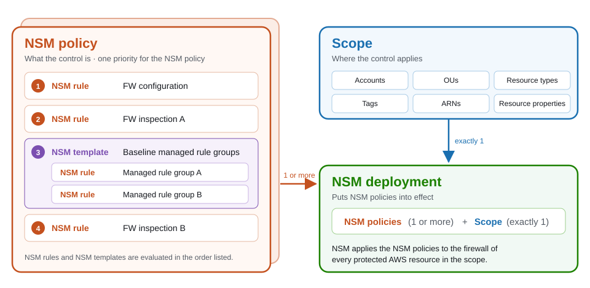

<!--
AUTHORING NOTES (applies to every NSM page)
- Always qualify "rule" as "WAF rule" or "NSM rule". Never use "rule" on its own.
- Avoid the word "policy" unless it refers to an NSM policy, and then write "NSM policy". Qualify other policies, such as "Firewall Manager policy".
- Each firewall type's "Recommended Design" page uses the same table columns (Priority, Importance, NSM policy, Scopes, Business need, NSM rules), Importance values, write-up fields (Contains, Why it's its own NSM policy, Scope, Most common owner), and scopes from the shared Common scopes list.
- Copy this entire comment block to the top of any new NSM page.
-->

# Prerequisites and Fundamentals

## Overview

You build network security controls in NSM from five resources, which are NSM rules, NSM templates, NSM policies, NSM scopes, and NSM deployments. Best practices for each resource are in the [Rules](../../rules/docs/index.md), [Templates](../../templates/docs/index.md), [Policies](../../policies/docs/index.md), [Scopes](../../scopes/docs/index.md), and [Deployments](../../deployments/docs/index.md) sections. For how each resource works, see the <!-- TODO: link --> NSM documentation.

## NSM Resources

Every network security control has two parts, what the control is and where it applies. Each NSM resource captures one piece:

* **[Rules](../../rules/docs/index.md)** – What the control is, such as a managed rule group or a logging configuration.
* **[Templates](../../templates/docs/index.md)** (optional) – A reusable, ordered set of NSM rules that you use in more than one NSM policy.
* **[Policies](../../policies/docs/index.md)** – How NSM rules and NSM templates combine, with one priority for the whole NSM policy.
* **[Scopes](../../scopes/docs/index.md)** – Where the control applies, selected by account, OU, resource type, tag, ARN, and resource property.
* **[Deployments](../../deployments/docs/index.md)** – What puts NSM policies into effect, by connecting them to a scope.

### Relationships between NSM resources

NSM rules go into NSM templates or directly into NSM policies. An NSM deployment connects one or more NSM policies to exactly one scope.

<!-- TODO: detailed relationships between NSM resources -->

## Versioning and Drafts

Every NSM resource supports versioning, rollback, and drafts. A draft stages changes to a resource before you save them, and each save creates a new version. The following best practices apply to every NSM resource.

### Versions

**Use versions to promote changes**

When you associate one NSM resource with another, such as an NSM rule with an NSM policy, you choose which version to reference:

* **Latest version** – Every change that you save to the referenced resource takes effect right away, everywhere that it's deployed.
* **Explicit saved version** – Changes to the referenced resource don't take effect until you update the association to the new version.

We recommend that production reference explicit saved versions, so that you can test a new version in non-production and then promote that same version to production by changing only the version reference. If a change causes problems, roll back by referencing the previous version. For a worked example, see [Use NSM rule versions to test changes before production](../../rules/docs/index.md#use-nsm-rule-versions-to-test-changes-before-production).

If you manage NSM with infrastructure as code (IaC), you might rely on source control instead of NSM versions for change history and rollback, and roll back by reverting a commit and redeploying. You can still use NSM versions to promote a change. For example, your IaC can create a new version of an NSM policy, point a development NSM deployment at it, and then point the production NSM deployment at the same version after testing. Both approaches are valid, and you can combine them. For more information, see [Console and IaC users](#console-and-iac-users).

**Reference the latest version only where changes need to take effect right away**

Referencing the latest version makes sense where you want every saved change to take effect without a separate promotion step, such as development or test environments that track the newest version of an NSM rule. Avoid referencing the latest version from production NSM policies and NSM deployments, because a save to the referenced resource then reaches production without testing.

### Drafts

Drafts are primarily for teams that manage NSM in the console. IaC users usually stage and review changes in source control and deployment pipelines instead.

**Use drafts to stage and review changes**

Make changes in a draft instead of saving each edit as you go. A draft lets you build a complete change, such as several NSM rule updates that belong together, and review it before it becomes a version. Treat saving a draft as the point at which a change can go live, because any resource that references the latest version picks up the change as soon as you save it. Before you save, check which NSM resources reference the latest version of the resource that you're changing.

<!-- TODO: confirm draft behavior, such as whether drafts can be shared or reviewed by another operator -->

### Console and IaC users

Teams that manage firewalls with IaC usually get change history, review, and rollback from source control and their deployment pipelines. Teams that manage firewalls in the console usually don't. NSM versioning gives console users the same capabilities inside NSM. NSM keeps every saved version, drafts let you stage a change before you save it, and you can promote or roll back by changing a version reference instead of re-creating a configuration by hand.

<!-- TODO: how IaC users should combine NSM versions with source control -->
