# AWS Security Hub CSPM

## Introduction

Welcome to the AWS Security Hub CSPM Best Practices Guide. The purpose of this guide is to provide prescriptive guidance for leveraging AWS Security Hub for automated, continuous security best practice checks against your AWS resources. Publishing this guidance via GitHub will allow for quick iterations to enable timely recommendations that include service enhancements, as well as, the feedback of the user community. This guide is designed to provide value whether you are deploying Security Hub for the first time in a single account, or looking for ways to optimize Security Hub in an existing multi-account deployment.

> For guidance on the unified AWS Security Hub including exposure findings, attack paths, and streamlined response, see the [AWS Security Hub Best Practices Guide](../security-hub/index.md).

## How to use this guide

This guide is geared towards security practitioners who are responsible for monitoring and improving the security posture of their AWS accounts and resources. The best practices are organized into three categories for easier consumption. Each category includes a set of corresponding best practices that begin with a brief overview, followed by detailed steps for implementing the guidance. The topics do not need to be read in a particular order:

* [What is Security Hub](#what-is-security-hub)
* [What are the benefits of enabling Security Hub](#what-are-the-benefits-of-enabling-security-hub)
* [Getting Started](#getting-started)
    * [Deployment considerations](#deployment-considerations)
    * [Region considerations](#region-considerations)
* [Implementations](#implementation)
    * [Configuration](#configuration)
    * [Integrate your security tools](#integrate-your-security-tools)
    * [Enable security standards](#enable-security-standards)
* [Operationalizing](#operationalizing)
    * [Take action on critical and high findings](#take-action-on-critical-and-high-findings)
    * [Create customized insights](#create-customized-insights)
    * [Leverage available remediation instructions](#leverage-available-remediation-instructions)
    * [Fine tuning security standard controls](#fine-tuning-security-standard-controls)
    * [Understanding finding lifecycle and retention](#understanding-finding-lifecycle-and-retention)
    * [Automation rules](#automation-rules)
    * [Automated security response](#automated-security-response)
    * [3rd party integrations](#3rd-party-integrations)
* [Cost considerations](#cost-considerations)
    * [Tuning standards and controls](#tuning-standards-and-controls)
    * [Removing duplicate aggregation](#removing-duplicate-aggregation)
    * [AWS Config](#aws-config)
* [Resources](#resources)

## What is Security Hub?

AWS Security Hub is a cloud security posture management (CSPM) service that performs automated, continuous security best practice checks against your AWS resources to help you identify misconfigurations, and aggregates your security alerts (i.e. findings) in a standardized format so that you can more easily enrich, investigate, and remediate them. Security Hub also serves as a central aggregation point for security findings from other AWS services and third-party tools. This guide focuses on the CSPM capabilities of Security Hub, specifically deploying, operationalizing, and optimizing security standards and controls. Security Hub can be used by security teams, compliance teams, cloud architects, incident response teams, risk management teams, and MSSPs, and is currently used by customers of all sizes ranging from small startups to large enterprises.

## What are the benefits of enabling Security Hub?

Security Hub reduces the complexity and effort of managing and improving the security of your AWS accounts, workloads, and resources. You can enable Security Hub within a particular Region in minutes, and the service helps you answer fundamental security questions you may have on a daily basis. Key benefits include:

* Detect deviations from security best practices with a single click. Security Hub CSPM runs continuous and automated account and resource-level configuration checks against the controls in the [AWS Foundational Security Best Practices standard](https://docs.aws.amazon.com/securityhub/latest/userguide/fsbp-standard.html) and other supported industry best practices and standards, including [CIS AWS Foundations Benchmark](https://docs.aws.amazon.com/securityhub/latest/userguide/cis-aws-foundations-benchmark.html) (v1.2.0, v1.4.0, v3.0.0, and v5.0.0), [NIST SP 800-53 Rev. 5](https://csrc.nist.gov/pubs/sp/800/53/r5/upd1/final), [NIST SP 800-171 Rev. 2](https://docs.aws.amazon.com/securityhub/latest/userguide/standards-reference-nist-800-171.html), [AI Security Best Practices](https://docs.aws.amazon.com/securityhub/latest/userguide/standards-ai-security.html), [AWS Resource Tagging Standard](https://docs.aws.amazon.com/securityhub/latest/userguide/standards-tagging.html), and [PCI DSS](https://docs.aws.amazon.com/securityhub/latest/userguide/pci-standard.html) (v3.2.1 and v4.0.1). Learn more about [supported standards and controls available in Security Hub CSPM](https://docs.aws.amazon.com/securityhub/latest/userguide/standards-reference.html).
* Automatically aggregate security findings in a standardized data format from AWS and partner services. Security Hub collects findings from the security services enabled across your AWS accounts, such as threat detection findings from Amazon GuardDuty, vulnerability findings from Amazon Inspector, and sensitive data findings from Amazon Macie. Security Hub also collects findings from partner security products using a standardized AWS Security Finding Format, eliminating the need for time-consuming data parsing and normalization efforts. Customers can designate an administrator account that can access all findings across their accounts.
* Accelerate mean time to resolution with automated response and remediation actions. Create custom automated response, remediation, and enrichment workflows using the Security Hub [integration with Amazon EventBridge](https://docs.aws.amazon.com/securityhub/latest/userguide/securityhub-cloudwatch-events.html), and other [integrations](https://docs.aws.amazon.com/securityhub/latest/userguide/securityhub-partner-providers.html) to create Security Orchestration Automation and Response (SOAR) and Security Information and Event Management (SIEM) workflows. You can also use Security Hub Automation Rules to automatically update or suppress findings in near-real time.

## Getting started

Some important considerations for AWS Security Hub is that you need to ensure you have the right permissions to administer Security Hub and you should think through which account in your AWS Organization is best suited to be the Security Hub delegated administrator account. To get started with permissions make sure the role you are using to administer Security Hub has a minimum of the AWS managed policy name “AWSSecurityHubFullAccess”. Another consideration is to make sure AWS Config is enabled on all accounts because AWS Security Hub uses service-linked AWS Config rules to perform most of its security checks for controls. Please refer to this [document](https://docs.aws.amazon.com/securityhub/latest/userguide/securityhub-prereq-config.html) for more details.

### Deployment Considerations

To deploy Security Hub across your AWS Organization you will need to enable it in the AWS management and the security tooling account whether this is done in the Console, CLI, or API. If you are not familiar with the concept of the security tooling account it is recommended to familiarize yourself with the [recommended account structure](https://docs.aws.amazon.com/prescriptive-guidance/latest/security-reference-architecture/organizations.html) in the Security Reference Architecture. To summarize, this is a dedicated account in your AWS Organization that is used as the delegated administrator account for native AWS security services such as Amazon Inspector, Amazon GuardDuty, Amazon Macie, and Amazon Detective.

### Region Considerations

Amazon Security Hub is a regional service. This means that to use Security Hub you will need to enable it in every region that you would like to leverage Security Hub. You can enable Security Hub across all accounts and regions using the AWS API or you can do this by toggling between regions in the console. One other feature AWS Security Hub provides is called [Cross-Region aggregation](https://docs.aws.amazon.com/securityhub/latest/userguide/finding-aggregation.html) where you can aggregate findings, findings updates, insights, control compliance statuses, and security scores from multiple Regions to a single aggregation Region of your choice. You can then manage all of this data from the aggregation Region simplifying cross region deployments.

## Implementation

When you implement Security Hub for the first time in your AWS Organization, as stated above, you will set the delegated administrator in your organization management account in each region that you want to use Security Hub for more information on this process refer to the [Security Hub documentation](https://docs.aws.amazon.com/securityhub/latest/userguide/securityhub-accounts.html) or follow the steps below. Once that is complete, there are other steps to completely configure Security Hub that we will cover in this guide.

### Configuration

Once you set the delegated administrator in the organization management account Security Hub will be enabled but it will be missing coverage across all of the existing accounts in your organization. So next you will need to go to the account configuration settings or use the API to enable Security Hub across all member accounts using a Security Hub [central configuration policy](https://docs.aws.amazon.com/securityhub/latest/userguide/central-configuration-intro.html). This configuration policy will enable you to specify what accounts, organizational units, or regions have Security Hub enabled and also which standards you want enabled. The default policy options will select all regions, all accounts, enable the AWS Foundational Security Best Practices standard, and enable this same configuration for any new accounts added in the AWS Organization. This will ensure you don’t have a lack of visibility and save you manual effort of enabling Security Hub individually for accounts in your organization moving forward. Using central configuration will also set the finding aggregation to your region that was used when setting the central configuration.

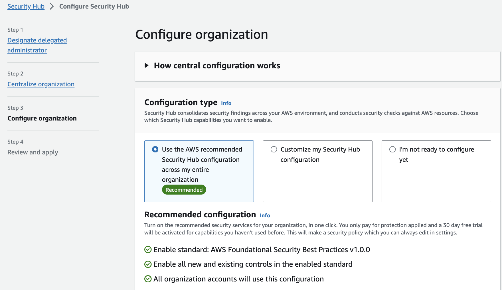
*Figure 1: Security Hub accounts page*

You can choose to not use central configuration and instead use Local configuration to new organization accounts, but with this feature you must configure settings manually in each account and region. If you choose to use local configuration or have not started using central configuration you can still configure an aggregation region following the [Security Hub documentation](https://docs.aws.amazon.com/securityhub/latest/userguide/finding-aggregation-enable.html).

### Integrate your security tools

You can integrate different security tools into Security Hub. This includes ingesting different findings into Security Hub from different data sources such as supported [AWS services](https://docs.aws.amazon.com/securityhub/latest/userguide/securityhub-internal-providers.html), [3rd party vendors](https://docs.aws.amazon.com/securityhub/latest/userguide/securityhub-partner-providers.html), your AWS custom config rules, and even your own [custom applications](https://docs.aws.amazon.com/securityhub/latest/userguide/securityhub-custom-providers.html). The Security Hub Console integration page provides details on each integration and what you need to do to enable them. Not only that, you can forward these findings managed by Security Hub into other AWS services or integrated 3rd party tools such as supported ticketing systems, chat software, or a SIEM solution for alerting and management of findings.

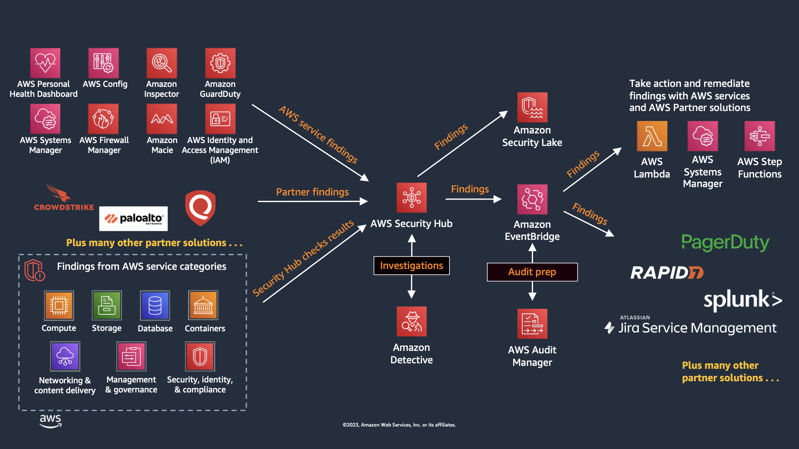
*Figure 2: Security Hub Finding Flow*

### Enable Security Standards

By default, when you enable Security Hub CSPM using the default policy, the AWS Foundational Security Best Practices standard is selected. We recommend that you start with the default and then enable additional standards that map to obligations you actually have. Enabling standards you are not accountable for is the most common way teams manufacture finding volume they never action.

When choosing CIS AWS Foundations Benchmark versions, note that Security Hub CSPM supports v1.2.0, v1.4.0, v3.0.0, and v5.0.0. If you are adopting CIS for the first time, start with v5.0.0 as it reflects the latest guidance. If you are already running an older version, plan a migration to v5.0.0. You can enable both versions simultaneously during the transition to compare control coverage before disabling the older standard. For organizations that handle payment card data, Security Hub CSPM supports PCI DSS v4.0.1 alongside v3.2.1. Since PCI DSS v3.2.1 has been retired by the PCI SSC, organizations subject to PCI compliance should enable v4.0.1. Organizations that handle Controlled Unclassified Information (CUI) or work with U.S. federal agencies can enable the [NIST SP 800-171 Rev. 2](https://docs.aws.amazon.com/securityhub/latest/userguide/standards-reference-nist-800-171.html) standard to assess their AWS environment against those requirements.

If you are deploying generative AI or machine learning workloads, enable the [AI Security Best Practices](https://docs.aws.amazon.com/securityhub/latest/userguide/standards-ai-security.html) standard. It is a curated set of controls covering network isolation, encryption at rest and in transit, VPC placement, AWS KMS key usage, and private registry requirements across Amazon Bedrock, Amazon Bedrock AgentCore, and Amazon SageMaker. Its ARN is `arn:aws:securityhub:region::standards/ai-security-best-practices/v/1.0.0`.

This standard is worth enabling early rather than after the fact. AI workloads tend to be stood up quickly by teams that are optimizing for time to first result, and the defaults that make experimentation easy are frequently the ones this standard flags, such as SageMaker notebook instances with direct internet access, AgentCore runtimes not placed in a VPC, or AgentCore Gateways that do not require authorization on inbound requests. Turning the standard on while the environment is small means a handful of findings on a handful of resources. Turning it on after a year of adoption means a backlog. Pair it with the [AI inventory](../security-hub/index.md#ai-inventory) in Security Hub so you are checking the AI resources you know about against a standard and discovering the ones you do not.

One thing to plan for across every standard: controls are added and retired continuously. Retirements happen when a control stops being meaningful, for example when AWS changes a service default or retires a capability the control depended on. Recent examples include the retirement of `ECS.1`, `RDS.18`, `AppSync.1`, `AppSync.6`, and `MQ.3`, and the removal of `EFS.6` from FSBP while it remains in other standards. The practical implication is that any list of disabled controls you maintain by hand will drift. Use the [controls change log](https://docs.aws.amazon.com/securityhub/latest/userguide/controls-change-log.html) to track changes, and prefer configuration policies over per-account control toggles so that changes are applied in one place.

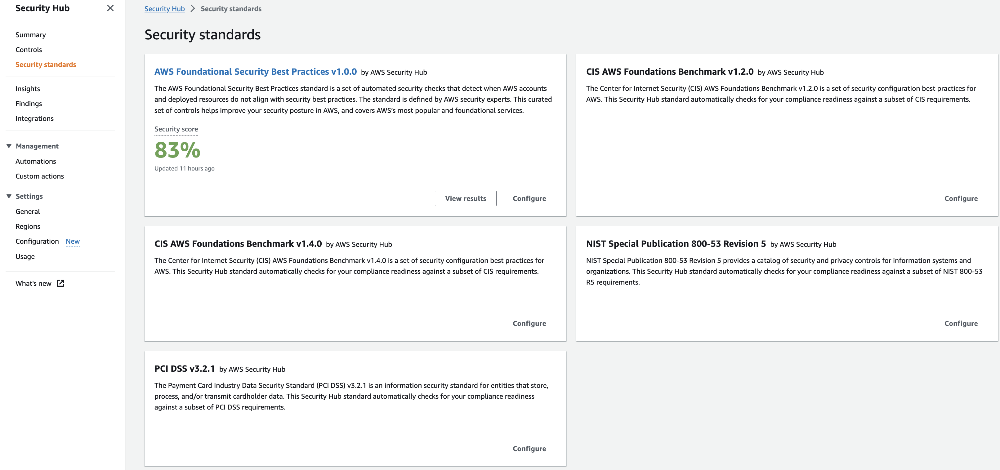
*Figure 3: Security Hub Standards*

## Operationalizing

### Take action on CRITICAL and HIGH Findings

Most customers focus on the critical and high severity findings as a priority to respond to. We recommend you use the filter option as mentioned in these steps and pictured below. Once you understand what are your critical and high findings you will be able to understand the types of findings you will be responding too. You can then create the necessary runbooks and automation to complete this work.

* Filter Findings on Severity label and Status. Keep in mind filters are case sensitive.
* Review and Remediate.

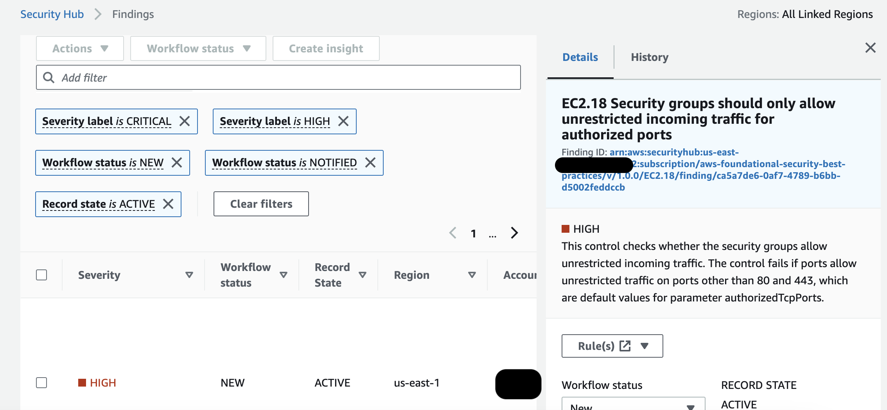
*Figure 4: Security Hub finding*

### Create Customized Insights

Security Hub CSPM Insights let you view your findings through different visualizations. If you have also adopted the unified Security Hub, check its dashboard and Trends views before you invest in building custom Insights, because the overlap is significant and the unified views already cover most cross-service trending. Insights remain the better tool when you need a CSPM-specific grouping that the unified dashboard does not offer, or when you are tracking a compliance program against a particular standard. Below are some best practices for creating insights:

* Create insights with the context from your environment.
* Create insights by using the ‘Group By’ filter, for example use ‘ResourceType’ which groups findings by AWS resource or you can use AWS account ID which groups findings by AWS account in multi-account setup.
* Add filters before using ‘Group By’ to focus Insight. For example, Status EQUALS FAILED.
* Create insights that help you visualize and track progress of security programs your teams are working on. For example, reduction of critical vulnerabilities over time.

### Leverage available remediation instructions

Each Security Hub finding from a Security or Compliance Standard has an associated remediation instructions. This can provide valuable insights into how to respond to any given finding.

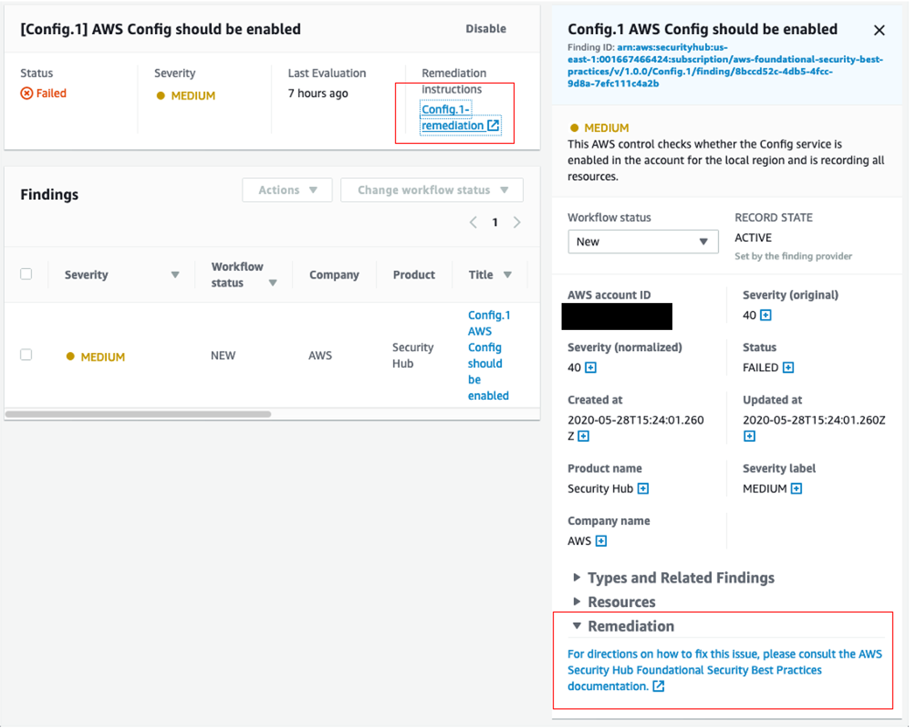
*Figure 5: Security Hub Finding Remediation guidance*

### Fine tuning Security Standard controls

Some customers when enabling a security standard might have one or more controls that are not applicable to their environment. For such findings you might want to disable them and add a note of why for historical reference. This can be done by selecting the control and clicking on the disable control button as shown below. This will stop generating additional findings for that control. As for the existing findings, they are archived automatically after 3-5 days.

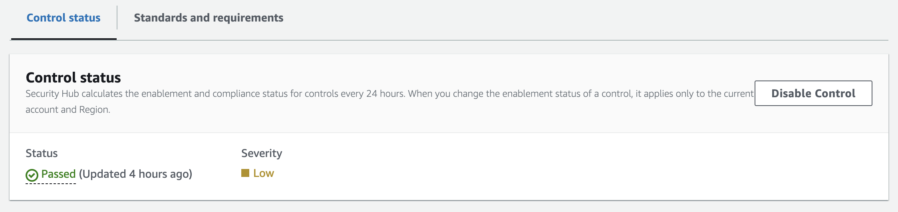
*Figure 6: Security Hub control status*

Some Security Hub controls use parameters that affect how the control is evaluated. Typically, such controls are evaluated against the default parameter values that Security Hub defines. However, for a subset of these controls, you can customize the parameter values. When you customize a parameter value for a control, Security Hub starts evaluating the control against the value that you specify. This is a great feature to leverage if you need to update a control to specific information applicable to your environment. Custom control parameters can be configured at a single or multi-account level using configuration policies as shown below. Refer to the documentation for more information about [configuring custom control parameters](https://docs.aws.amazon.com/securityhub/latest/userguide/custom-control-parameters.html).

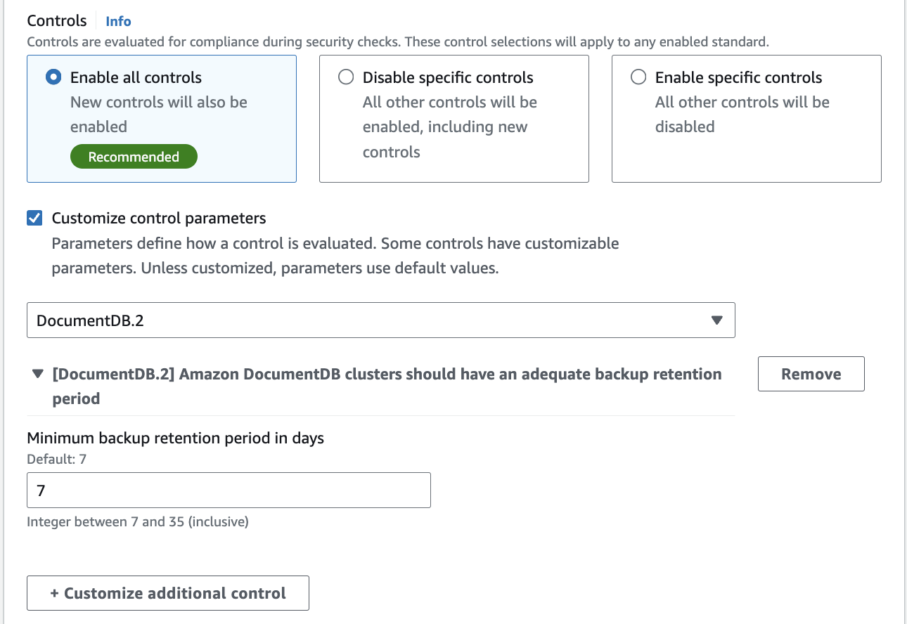
*Figure 7: Security Hub custom control parameter policy configuration*

### Understanding Finding Lifecycle and Retention

Two behaviors affect how you should build automation and how long you can rely on Security Hub CSPM as a source of history. Both changed recently enough that older integrations may assume the previous behavior.

**Control findings are updated in place.** When the compliance status of a resource changes against a control, Security Hub CSPM updates the existing finding rather than generating a new one. This is helpful because a single finding now carries the compliance history for that resource and control pairing, so you can track whether something has been flapping. It also means automation built on the assumption that every status change produces a new finding will behave differently than expected. If you have downstream logic that creates a ticket per finding, verify it keys on finding ID and handles updates, otherwise you will either miss transitions or reopen tickets you already closed.

**Archived findings are retained for 30 days.** This reduces noise, and it also means Security Hub CSPM is not a compliance retention system. If you need finding history beyond 30 days for audit, export to Amazon S3 using a custom action with an [Amazon EventBridge rule](https://docs.aws.amazon.com/securityhub/latest/userguide/securityhub-cloudwatch-events.html) and set that up before you need it. Separately, when you disable a control, its existing findings are archived automatically within a few days.

### Automation Rules

[Automation Rules](https://docs.aws.amazon.com/securityhub/latest/userguide/automation-rules.html) allows you to automatically update or suppress Security Hub findings, without any code. With this feature, rules are created by administrators to streamline cloud security posture management and act on findings in all accounts under the organization. This happens in near-real time as rules run at the time of finding ingestion. This can assist in removing repetitive tasks for security teams and reduce mean time to respond. For example, one of the most common customer uses cases is to elevate findings severity for top production accounts where you need to focus on, rather than the same findings identified on developers account. You can elevate the severity level of findings related to the production account IDs to a higher severity or you can lower the severity of the findings related to developers account IDs so your team can only focus on the important findings. Another use case is to use resource tags to further understand what resources are associated with a finding and what you want the automation rule to do with the finding.

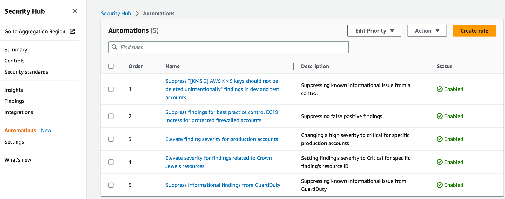
*Figure 8: Security Hub Automation Rules page*

Here are some examples when it comes to automation rules:

* Change findings severity from HIGH to CRITICAL if the findings affect specific production accounts.
* Change the Security Hub findings with ‘Informational’ severity label to “Suppressed” workflow status.
* Set finding severity to CRITICAL if the finding’s resource ID refers to a specific resource (for example, S3 buckets with PII).

For example, let’s say we created an automation rule to elevate severity of a finding for production environments from high to critical and then If a criteria is matched as part of this automated rule, an automated action will be taken as shown in the image below where the finding severity will be raised from high to critical.

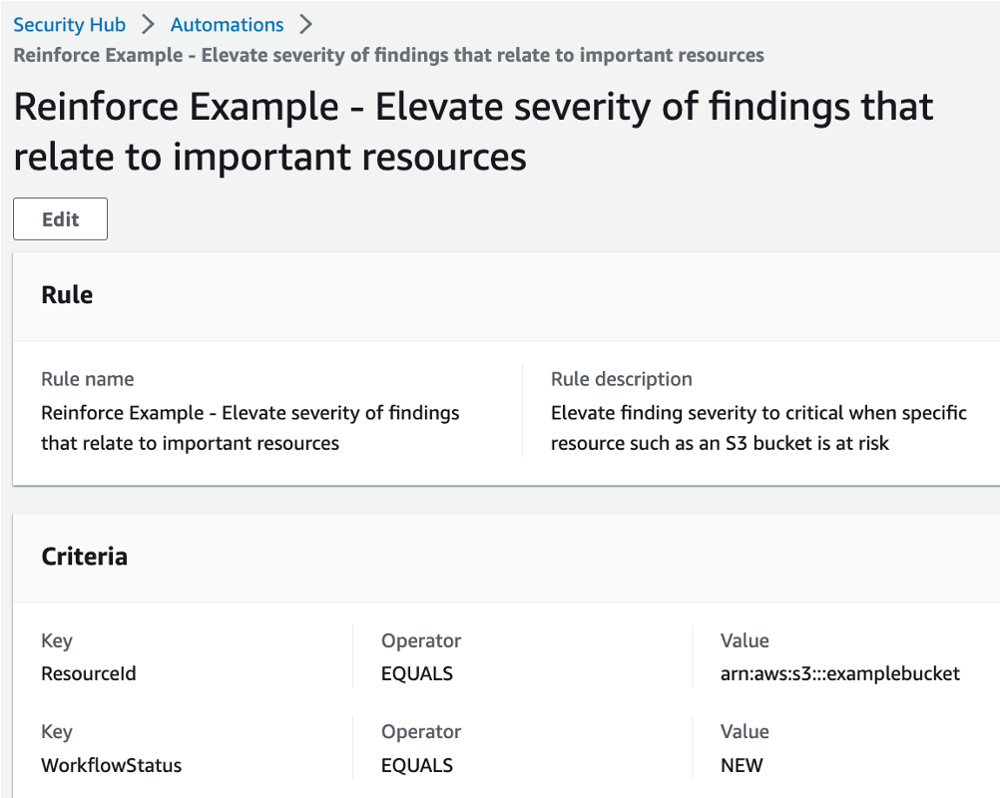
*Figure 9: Security Hub Automation Rule*

Here are some considerations when it comes to automation rules:

* Including a rule description allows teams to provide context to responders and resource owners.
* Only the Security Hub admin account can create, delete, edit, and view automation rules.
* Automated remediation must be created in each region in Security Hub admin account.
* Define criteria and include member account ids.
* Security Hub CSPM re-evaluates control findings every 12 to 24 hours, or sooner when the associated resource changes state. Those re-evaluations update the existing finding in place rather than creating a new one, so a rule that fires on finding creation will not fire again on a status change.
* Rule order matters - multiple rules may apply to same finding or finding field. Lowest numerical value first.
* If multiple findings have the same rule order, Security Hub applies a rule with an earlier value for the UpdatedAt field first (that is, the rule which was most recently edited is applied last).
* Security Hub currently supports a maximum of 100 automation rules for an administrator account.

### Automated Security Response

This AWS Solution is an add-on that works with AWS Security Hub and provides predefined response and remediation actions based on industry compliance standards and best practices for security threats. It helps Security Hub customers to resolve common security findings and to improve their security posture in AWS. For more details about it, please refer to [this document](https://aws.amazon.com/solutions/implementations/automated-security-response-on-aws/).

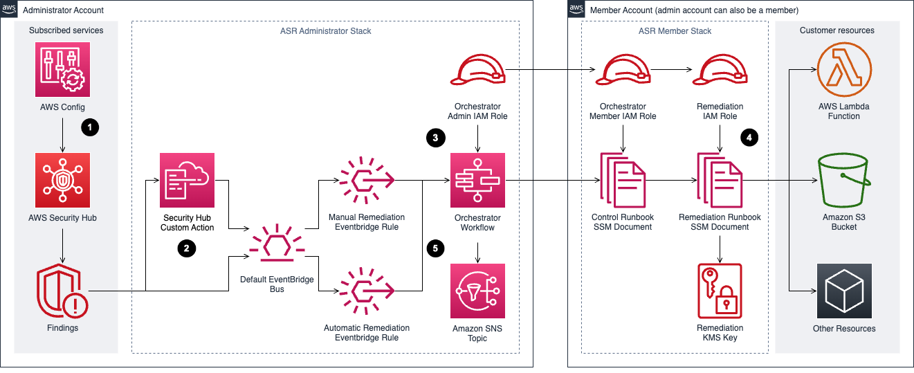
*Figure 10: Automated Security Response Diagram*

### 3rd party Integrations

Integration with 3rd party supported partners is available within Security Hub. One example of using integration to automate responses is forwarding findings to a ticketing system. for example, ServiceNow ITSM integration with Security Hub allows security findings from Security Hub to be viewed within ServiceNow ITSM. You can also configure ServiceNow to automatically create an incident or problem when it receives a finding from Security Hub. Any updates to these incidents and problems result in updates to the findings in Security Hub.

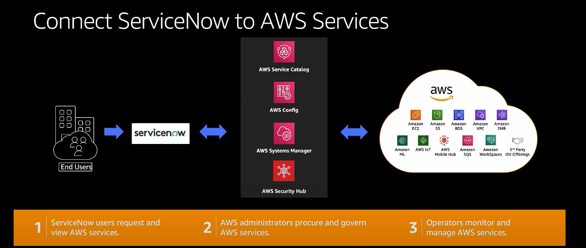
*Figure 11: Security Hub and ServiceNow integration diagram*

## Cost Considerations

Before you optimize anything, confirm which pricing model applies to the accounts you are looking at, because the levers are different and several of them stop existing.

**If you have enabled the unified AWS Security Hub**, security posture management is included in the Security Hub essentials plan at a single per-resource price. You do not enable or pay for Security Hub CSPM separately in those accounts, and you are not double-charged for the underlying checks. Control tuning still matters for finding volume and operational noise, but it is no longer how you manage your posture management bill. See [Cost Considerations](../security-hub/index.md#cost-considerations) in the Security Hub guide for the pricing model and the console Cost Estimator.

**If you run Security Hub CSPM standalone**, CSPM is priced along three dimensions: the quantity of security checks, the quantity of finding ingestion events, and the quantity of automation rule evaluations processed per month. AWS Organizations support lets you consolidate across accounts so your whole organization benefits from tiered pricing on all three dimensions. The rest of this section applies to you.

A mixed estate is a normal end state. Many organizations enable Security Hub on production accounts and leave lower environments on standalone CSPM pricing, which means both models are live at once and you need to know which accounts fall where before you start cutting.

Security Hub CSPM includes a [30 day free trial](https://aws.amazon.com/security-hub/pricing/?nc=sn&loc=3) covering the full feature set and security best practice checks. Every AWS account in each Region receives the trial, and during it you get an estimate of what your monthly bill would be if you continued at the same usage.

### Tuning Standards and Controls

* When you enable Security Hub CSPM with the default configuration policy, the AWS Foundational Security Best Practices standard is enabled. Other standards such as CIS and NIST are opt-in.
* Enabling a standard enables all of its controls. You can then disable individual controls within a standard, or disable the standard entirely.
* Keep the tradeoff in view. Lowering cost by disabling controls lowers visibility, and the savings are rarely worth a blind spot in a production account. Tune lower environments first.
* Controls that evaluate global resources only need to run in one Region. If you use central configuration, Security Hub CSPM handles this for you and automatically disables controls involving global resources in every Region except your home Region, so there is nothing to maintain by hand. If you are still on local configuration, you need to disable those controls per Region yourself, which is one of the better reasons to move to central configuration. Refer to the [controls reference](https://docs.aws.amazon.com/securityhub/latest/userguide/securityhub-controls-reference.html) for which controls apply to global resources rather than maintaining your own list, since controls are added and retired regularly.
* Filter out findings from integrations you are not acting on. Every ingested finding is a billable event, so an integration nobody reads is pure cost.
* Turn off checks for services you genuinely do not run. If you disable a control because you do not use the service, pair it with a preventative control such as an SCP that keeps the service unused. Otherwise you have disabled the detection and left the door open.

### Removing Duplicate Aggregation

If your organization has adopted the unified Security Hub, finding aggregation from other AWS security services already happens there, and you may be paying for the same aggregation twice. You can reduce CSPM ingestion costs by disabling third-party and AWS service finding ingestion in CSPM.

Approach this carefully. Before you disable any finding source in CSPM, audit your downstream consumers, including EventBridge rules, SIEM feeds, ticketing workflows, and custom Lambda functions, and confirm each one reads from Security Hub rather than from CSPM. Disabling ingestion without checking dependencies breaks alerting quietly, and the failure mode is findings that simply stop arriving rather than an error anyone notices.

### AWS Config

How AWS Config affects your bill depends on which configuration recorder is in play. If you last looked at this before Security Hub introduced its service-linked configuration recorder, the guidance below has changed.

**When both Security Hub and Security Hub CSPM are enabled**, CSPM creates and manages a service-linked configuration recorder named `AWSConfigurationRecorderForSecurityHubCSPM` in each account and Region where both are enabled. You do not enable or configure AWS Config yourself. CSPM keeps the recording scope aligned to the resources its supported controls need, and it does not use your customer-managed configuration recorder. The `Config.1` control always passes in this state. The practical effect is that the manual recorder scoping work below is handled for you, and new accounts get the recorder automatically as you enable them.

**When you run Security Hub CSPM standalone**, you own the recorder and its cost. Config charges are based on the number of configuration items recorded, the number of active rule evaluations, and the number of conformance pack evaluations. The levers that matter:

* Record global resources in one Region only, which reduces duplicate configuration items across Regions.
* Turn off the compliance history timeline if you are not using Config outside of Security Hub CSPM. It tracks per-resource compliance history and is on by default when you record all resource types.
* Be cautious about disabling recording for resource types CSPM does not currently check. Controls are added regularly, so a scoped-down recorder can silently stop feeding newly released controls.

If AWS Config exists in your environment only to serve Security Hub CSPM, you can turn it off or reduce its scope once CSPM no longer depends on it. Confirm first that no other team is relying on it. Config commonly backs a CMDB, custom Config rules, conformance packs, automated remediation, and audit evidence collection, and those owners are usually in a different part of the organization than the security team making the change. Ask before you scope down, not after.

Whichever recorder you use, Security Hub CSPM generates `WARNING` findings for an enabled control when resource recording is not turned on for the resource type that control checks. Treat those warnings as your safety net for detecting gaps you created while optimizing.

One billing detail that catches people out: AWS Config is not part of the Security Hub CSPM 30 day free trial. As soon as you enable security standards, you are paying for the Config usage behind them even though CSPM itself is still free.

For more detail, see [Optimize AWS Config for AWS Security Hub](https://aws.amazon.com/blogs/security/optimize-aws-config-for-aws-security-hub-to-effectively-manage-your-cloud-security-posture/).

## Resources

### Workshops

* [Activation Days](https://awsactivationdays.splashthat.com/)
* [Threat Detection and Response workshop](https://catalog.workshops.aws/security/en-US)
* [Amazon Detective workshop](https://catalog.workshops.aws/detective)
* [EKS security workshop](https://catalog.workshops.aws/containersecurity)
* [Amazon Macie workshop](https://catalog.workshops.aws/data-discovery)

### Videos

* [Customize and contextualize security with AWS Security Hub](https://www.youtube.com/watch?v=nghb507nVtM&list=PLB3flZ7qA4xu__uOEfpc-coXm04swNWva&index=2&pp=iAQB)
* [AWS Security Hub - Bidirectional integration with ServiceNow ITSM](https://www.youtube.com/watch?v=OYTi0sjEggE)
* [Re:inforce Security Hub Automation Rules](https://www.youtube.com/watch?v=t10Mgi8ZgVw)
* [AWS Security Hub integration with AWS Control Tower](https://www.youtube.com/watch?v=Ev3giJRpHWw&list=PLhr1KZpdzukfJzNDd8eCJH_TGg24ZTwP6&index=2&pp=iAQB)
* [AWS Security Hub automation rules](https://www.youtube.com/watch?v=XaMfO_MERH8&list=PLhr1KZpdzukfJzNDd8eCJH_TGg24ZTwP6&index=23&pp=iAQB)
* [Using Security Hub finding history feature](https://www.youtube.com/watch?v=mz_yRIDxX5M&list=PLhr1KZpdzukfJzNDd8eCJH_TGg24ZTwP6&index=28&pp=iAQB)
* [Subscribing to Security Hub announcements](https://www.youtube.com/watch?v=iolGhikAigw&list=PLhr1KZpdzukfJzNDd8eCJH_TGg24ZTwP6&index=70&t=2s&pp=iAQB)
* [Visualize Security Hub findings using Amazon Quicksight](https://www.youtube.com/watch?v=qfBptS8qogE&list=PLhr1KZpdzukfJzNDd8eCJH_TGg24ZTwP6&index=86&t=2s&pp=iAQB)
* [Cross-region finding aggregation](https://www.youtube.com/watch?v=KcRmxehmRvk&list=PLhr1KZpdzukfJzNDd8eCJH_TGg24ZTwP6&index=93&pp=iAQB)
* [Bidirectional integration with Atlassian Jira Service Management](https://www.youtube.com/watch?v=uEKwu0M8S3M&list=PLhr1KZpdzukfJzNDd8eCJH_TGg24ZTwP6&index=97&t=1s&pp=iAQB)

### Blogs

* [Optimize AWS Config for AWS Security Hub to effectively manage your cloud security posture](https://aws.amazon.com/blogs/security/optimize-aws-config-for-aws-security-hub-to-effectively-manage-your-cloud-security-posture/)
* [Consolidating controls in Security Hub: The new controls view and consolidated findings](https://aws.amazon.com/blogs/security/consolidating-controls-in-security-hub-the-new-controls-view-and-consolidated-findings/)
* [AWS Security Hub launches a new capability for automating actions to update findings](https://aws.amazon.com/blogs/security/aws-security-hub-launches-a-new-capability-for-automating-actions-to-update-findings/)
* [Get details on security finding changes with the new Finding History feature in Security Hub](https://aws.amazon.com/blogs/security/get-details-on-security-finding-changes-with-the-new-finding-history-feature-in-security-hub/)
* [Three recurring Security Hub usage patterns and how to deploy them](https://aws.amazon.com/blogs/security/three-recurring-security-hub-usage-patterns-and-how-to-deploy-them/)
* [How to subscribe to the new Security Hub Announcements topic for Amazon SNS](https://aws.amazon.com/blogs/security/how-to-subscribe-to-the-new-security-hub-announcements-topic-for-amazon-sns/)
* [How to export AWS Security Hub findings to CSV format](https://aws.amazon.com/blogs/security/how-to-export-aws-security-hub-findings-to-csv-format/)
* [Automatically block suspicious DNS activity with Amazon GuardDuty and Route 53 Resolver DNS Firewall](https://aws.amazon.com/blogs/security/automatically-block-suspicious-dns-activity-with-amazon-guardduty-and-route-53-resolver-dns-firewall/)
* [How to build a multi-Region AWS Security Hub analytic pipeline and visualize Security Hub data](https://aws.amazon.com/blogs/security/how-to-build-a-multi-region-aws-security-hub-analytic-pipeline/)
* [How to enrich AWS Security Hub findings with account metadata](https://aws.amazon.com/blogs/security/how-to-enrich-aws-security-hub-findings-with-account-metadata/)
