# AWS Security Hub

## Introduction

Welcome to the AWS Security Hub Best Practices Guide. The purpose of this guide is to provide prescriptive guidance for leveraging AWS Security Hub for unified cloud security operations, automated correlation of security signals, and streamlined response to critical security issues. Publishing this guidance via GitHub will allow for quick iterations to enable timely recommendations that include service enhancements, as well as the feedback of the user community. This guide is designed to provide value whether you are deploying Security Hub for the first time in a single account, or looking for ways to optimize Security Hub in an existing multi-account deployment.

> For guidance on CSPM capabilities including security standards, compliance controls, and posture checks, see the [AWS Security Hub CSPM Best Practices Guide](../security-hub-cspm/index.md).

## How to use this guide

This guide is geared towards security practitioners who are responsible for monitoring and remediation of threats and malicious activity within AWS accounts and resources. The best practices are organized into categories for easier consumption. Each category includes a set of corresponding best practices that begin with a brief overview, followed by detailed steps for implementing the guidance. The topics do not need to be read in a particular order:

* [What is Security Hub](#what-is-security-hub)
* [What are the benefits of enabling Security Hub](#what-are-the-benefits-of-enabling-security-hub)
* [Getting Started](#getting-started)
* [Deployment](#deployment)
* [Region considerations](#region-considerations)
* [Implementation](#implementation)
* [Configuration](#configuration)
* [Essential capabilities](#essential-capabilities)
* [Threat analytics plan](#threat-analytics-plan)
* [Integrate your security tools](#integrate-your-security-tools)
* [Enable security standards](#enable-security-standards)
* [Operationalize Security Hub Findings](#operationalize-security-hub-findings)
* [Investigating exposure findings](#investigating-exposure-findings)
* [Understanding attack paths](#understanding-attack-paths)
* [Analyzing traits and signals](#analyzing-traits-and-signals)
* [Resource investigation](#resource-investigation)
* [Automated response and remediation](#automated-response-and-remediation)
* [Monitoring and trending](#monitoring-and-trending)
* [Automation rules](#automation-rules)
* [3rd party integrations](#3rd-party-integrations)
* [Cost considerations](#cost-considerations)
* [Understanding the pricing model](#understanding-the-pricing-model)
* [Cost optimization strategies](#cost-optimization-strategies)
* [Resources](#resources)

## What is Security Hub?

AWS Security Hub is a unified cloud security solution that provides comprehensive security operations by automatically correlating and enriching security signals across your AWS environment. Security Hub integrates with Amazon GuardDuty, Amazon Inspector, Amazon Macie, and AWS Security Hub CSPM to deliver near real-time exposure findings, attack path visualization, and streamlined response capabilities that help you prioritize critical security issues and respond at scale. Security Hub can be used by security teams, compliance teams, cloud architects, incident response teams, risk management teams, and MSSPs. Security Hub is currently used by customers of all sizes ranging from small startups to large enterprises.

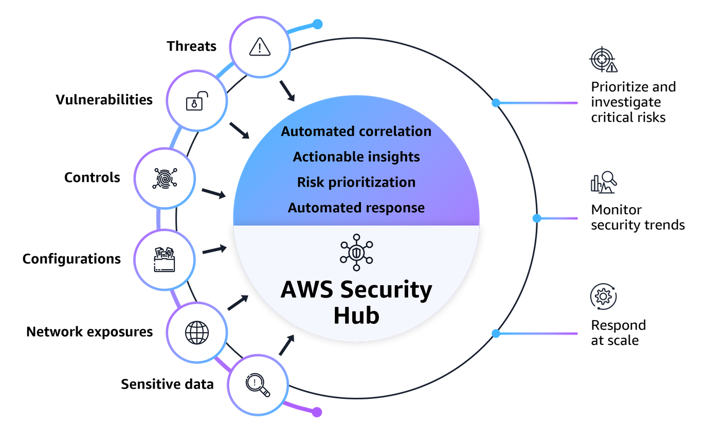

Security Hub has evolved from a basic findings aggregator into a comprehensive security platform. What was previously known as Security Hub is now called [AWS Security Hub CSPM](https://docs.aws.amazon.com/securityhub/latest/userguide/what-is-securityhub.html), which focuses specifically on security posture management and compliance monitoring. The enhanced Security Hub now provides unified cloud security operations with automated correlation across multiple security services, delivering actionable insights that help you protect your cloud environment more effectively.

## What are the benefits of enabling Security Hub?

Security Hub reduces the complexity and effort of managing and improving the security of your AWS accounts, workloads, and resources. You can enable Security Hub across your AWS accounts and regions in minutes, and the service helps you answer fundamental security questions you may have on a daily basis. Key benefits include:

* **Unified security operations:** Gain broader visibility across your cloud environment through centralized management in a unified cloud security solution.
* **Confident prioritization:** Make informed decisions about your critical security issues through automated correlation and enhanced risk context.
* **Actionable security insights:** Gain actionable insights through advanced analytics to surface security risks specific to your environment.
* **Streamlined response at scale:** Reduce response times with automated workflows and ticketing system integration to help protect your cloud environment.
* **Continuous security monitoring:** Detect deviations from security best practices with automated security checks against industry standards and AWS best practices.
* **Accelerate solution adoption:** Deploy curated partner solutions across endpoint, identity, email, network, data, browser, cloud, AI, and security operations in weeks, reducing procurement delays and accelerating coverage. 

Security Hub provides near real-time exposure findings that automatically correlate signals across multiple AWS security services to identify toxic combinations of threats, vulnerabilities, and misconfiguration. Security Hub calculates exposure finding severity by analyzing and correlating multiple security traits across AWS services, using a contextual approach that assigns severity ratings based on five key factors: ease of discovery, ease of exploit, likelihood of exploit using EPSS scores and internal threat intelligence, awareness of publicly available exploits, and impact of potential harm from successful exploitation including data loss, corruption, or system unavailability.

**Attack path** visualization helps you understand how an adversary could chain together vulnerabilities and misconfiguration to compromise critical resources. By mapping these connections, Security Hub shows possible routes an adversary could take through your environment and identifies which critical resources could be impacted. The visualization displays resource relationships, contributing factors at each stage, and trait classifications including internet reachability, vulnerabilities, sensitive data presence, misconfiguration, and assumability of IAM roles. Refer to the [Security Hub documentation](https://docs.aws.amazon.com/securityhub/latest/userguide/exposure-findings-supported-traits.html) for more information on supported traits.

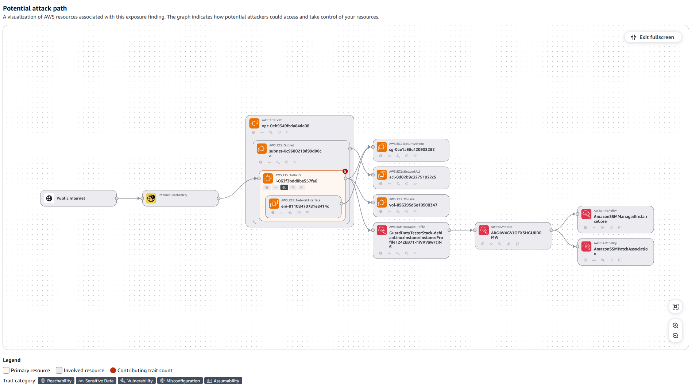

Security Hub provides a security focused resource inventory that offers a consolidated view of your AWS resources across your AWS accounts. Security Hub brings in resource-level context, helping you understand the resource configuration, security posture, and any associated findings. Rather than switching between different tools or consoles, you can see a summarized view of each resource's configuration details, application context, and related security findings all in one place. Quick filters let you slice the inventory by category (Compute, Storage, Database, Identity, Network, etc), by top accounts, or by resource type, making it easy to identify the resources that need to be prioritized. 

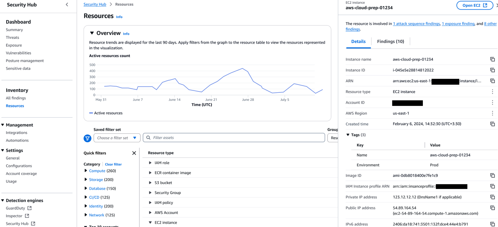

## Getting started

Before you enable AWS Security Hub, consider the following prerequisites and best practices.

**Permissions**

To administer Security Hub, attach the AWS managed policy AWSSecurityHubFullAccess to the IAM identity you plan to use for setup and management. If you plan to integrate Security Hub with AWS Organizations, also attach the AWSSecurityHubOrganizationsAccess policy to the Organizations management account.

**Delegated administrator**

Choose which account in your AWS Organization will serve as the Security Hub delegated administrator. This account manages Security Hub settings, findings, and member accounts on behalf of your organization. As a best practice, use the same delegated administrator account across your security services  such as Amazon GuardDuty, Amazon Inspector, and Amazon Macie for consistent governance, see the [Security Reference Architecture](https://docs.aws.amazon.com/prescriptive-guidance/latest/security-reference-architecture/architecture.html). for more information on setting up a delegated admin account. 

**AWS Config**

AWS Config is not a requirement for Security Hub itself. However, Security Hub CSPM a core capability that runs security checks against best practices and compliance standards requires AWS Config to be enabled and configured to record resource configuration changes. AWS Config tracks these changes so Security Hub CSPM can identify potential misconfigurations in your resources. Enable AWS Config in all accounts and Regions where you plan to use Security Hub 
For more information see [Enabling Security Hub](https://docs.aws.amazon.com/securityhub/latest/userguide/securityhub-v2-enable.html) documentation.

### Deployment

For organization wide deployment, use AWS Organizations integration with a delegated administrator account to enable central configuration and prevent configuration drift across your organization. Begin by designating a delegated administrator account within your AWS Organization. This should typically be a dedicated Security Account that serves as the central hub for security operations. 

From the AWS Organizations management account, navigate to Security Hub and designate your chosen security account as the delegated administrator. Under trusted access, select the checkbox to authorize trusted access for the delegated admin account. This delegation grants the delegated admin account the necessary permissions to manage Security Hub across all member accounts. You can optionally choose to enable security hub in the management account as well.

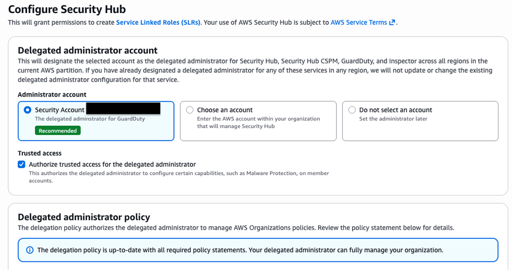

Once the delegated administrator is configured, navigate to the delegated admin account and enable Security Hub in your home region. The home region serves as the aggregation point for findings from all other regions across AWS accounts.

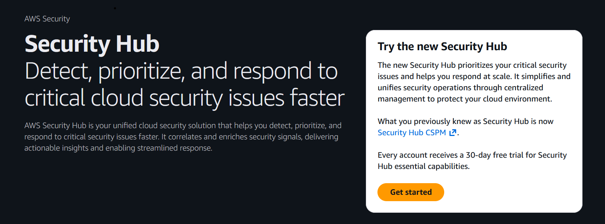

### Region Considerations

Security Hub supports a home region model where findings are aggregated from linked regions. The home region typically us-east-1 or your primary operational region serves as the Security Hub delegated administrator location, aggregates findings from all linked regions, manages central configuration and policy, and handles automation rules management. Linked regions such as us-west-2, eu-west-1, ap-southeast-1 automatically aggregate findings to the home region, receive configuration management from the home region, and monitor resources locally. This approach provides a single pane of glass for all regions, reduces operational overhead, enables centralized automation and response, and facilitates cross-region correlation and analysis.

## Implementation

One of the key advantages of AWS Security Hub is the ability to manage the deployment and configuration of multiple security services from a single console. Rather than navigating between individual service consoles for GuardDuty, Inspector, and Security Hub CSPM, Security Hub provides a unified pane of glass for enabling, configuring, and monitoring these services across your entire organization. This centralized approach reduces operational overhead, ensures consistency in security posture, and simplifies the management experience for security teams. 

### Configuration

Once you configure Security Hub in the delegated administrator account, Security Hub will be enabled but it will be missing coverage across all of the existing accounts in your organization. In the Security Hub delegated admin account, navigate to the security hub console and select summary you will see the option to configure Security Hub for your organization. Configuration policies and deployments  allow you to define and enforce consistent security capabilities across your organization. 

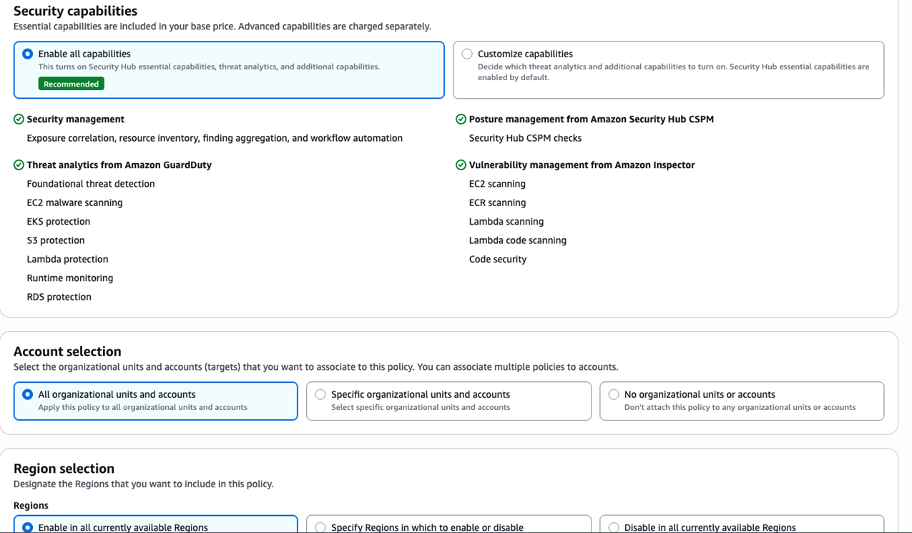

**Policies** generate AWS Organizations policies for accounts and Regions for AWS Security Hub and Amazon Inspector. Policies can be applied at the organizational level, allowing you to automatically apply appropriate security configurations to new accounts as they're added to your organization. This approach ensures consistent security coverage without manual intervention for each new account, preventing configuration drift and maintaining a strong security posture across your entire AWS environment.

For example, you might create a production policy that enables all essential capabilities plus threat analytics across all commercial regions, while development accounts might only require essential capabilities in limited regions, and sandbox accounts could use essential-only capabilities.

**Deployments** are a one-time action to enable a security capability across the entire organization, specific organizational units (OUs), or selected accounts and Regions for Amazon GuardDuty and AWS Security Hub CSPM. Unlike policies, you cannot view or edit deployments and deployments will not apply to newly enabled accounts. 

 To ensure that new AWS accounts added to your organization automatically have GuardDuty and Security Hub CSPM enabled, we recommend configuring the auto-enable feature for new member accounts. For detailed instructions, refer to the [Amazon GuardDuty](https://docs.aws.amazon.com/guardduty/latest/ug/set-guardduty-auto-enable-preferences.html) and [AWS Security Hub CSPM](https://docs.aws.amazon.com/securityhub/latest/userguide/accounts-orgs-auto-enable.html) documentation. 

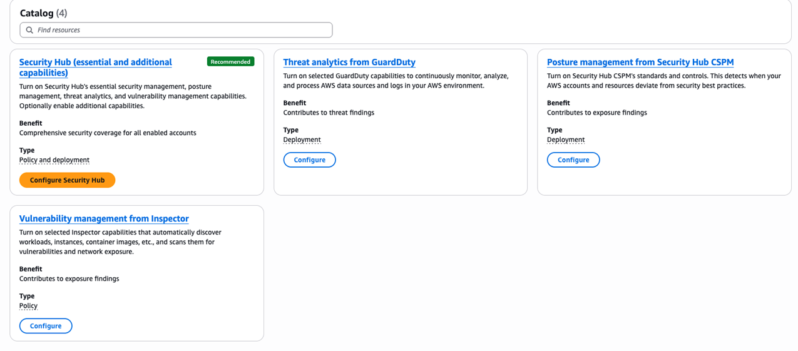

### Essential Capabilities

Security Hub Essential capabilities provide comprehensive security coverage through resource-based pricing. Essential capabilities include vulnerability management through Amazon Inspector scanning, security posture management through Security Hub CSPM checks, GuardDuty EC2 Malware Scanning, risk and exposure analytics, and security response management. When configuring essential capabilities, consider which resource types are most critical to your security posture.

### Threat Analytics Plan

The Threat Analytics plan embeds GuardDuty's threat detection capabilities directly into the Security Hub console. This means that threat findings such as privilege escalation, suspicious API calls, network anomalies, data exfiltration appear alongside resource misconfigurations, and vulnerabilities in a single unified view. A suspicious IAM action surfaces next to the configuration gap that enabled it, eliminating the need to manually pivot between services. Security Hub's native integrations with EventBridge and automated response workflows allow teams to act on these findings immediately—triggering remediation playbooks, normalizing severity across sources, and prioritizing what matters most. Without this plan, threat detection lives in isolation. When you enable threat analytics plan, Security Hub becomes a complete threat-aware security operations hub.

### Security Hub Extended

Security Hub Extended is a curated marketplace of enterprise-grade partner security solutions delivered directly through AWS Security Hub. It covers nine security categories — Endpoint, Identity, Email, Network, Data, Browser, Cloud, AI, and Security Operations with integrated partner offerings from providers such as CrowdStrike, Splunk, Zscaler, SailPoint, Okta, Proofpoint, Cyera, and others. AWS acts as the seller of record, which means you get pre-negotiated pay-as-you-go pricing, a single consolidated bill, and no long-term commitments. For AWS Enterprise Support customers, unified Level 1 support is also included. AWS Security Hub Extended expands Security Hub beyond AWS-native services into a full-stack enterprise security solution. It addresses one of the most common challenges security teams face: managing a fragmented portfolio of tools across multiple vendors, contracts, and consoles. Refer to the [Security Hub](https://docs.aws.amazon.com/securityhub/latest/userguide/securityhub-extended-plan.html) documentation for an updated list of supported partner solutions.

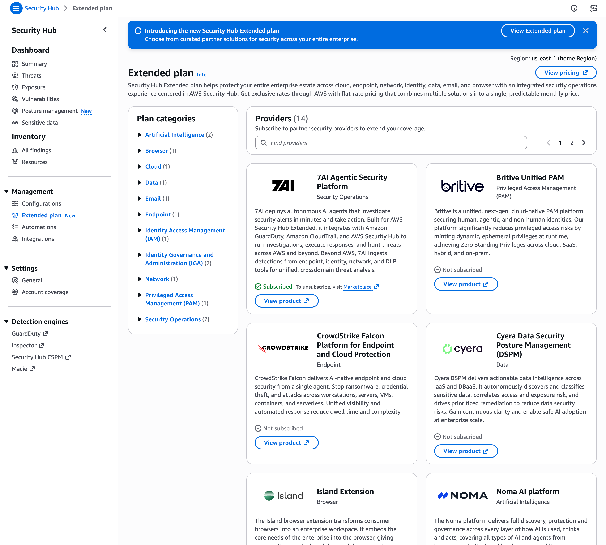

## Operationalize Security Hub Findings

### Investigate Critical Risks

To understand the most critical security risks in your environment, start by reviewing the exposure summary widget on the Security Hub dashboard. Exposure summaries are more effective than reviewing individual findings because they aggregate related findings into a single, contextualized view showing you the broader attack paths and resource relationships that matter most, rather than individual discrete alerts with low-context in isolation. This allows you to prioritize remediation based on actual exploitability and blast radius, not just finding volume. 

This widget shows your exposures by severity and frequency, with findings categorized as Critical, High, Medium, or Low. The widget displays the highest risks with the greatest number of critical findings, allowing you to quickly identify the most pressing security issues. 

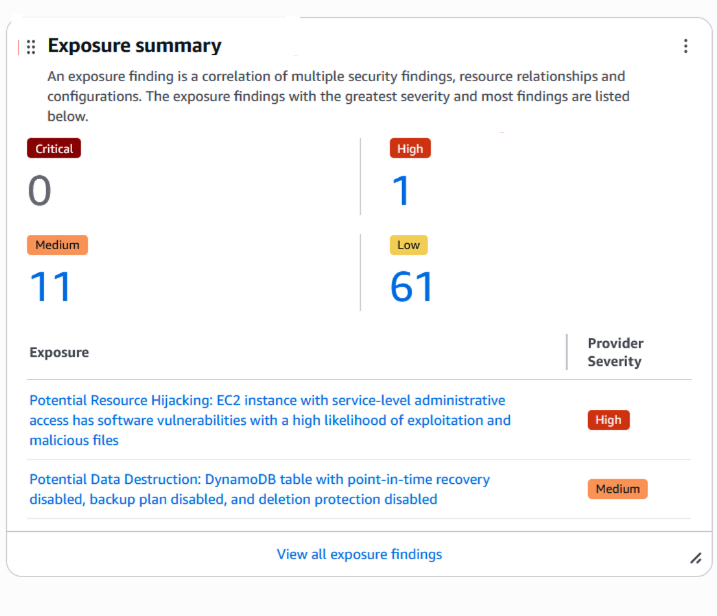

From the exposure summary widget, you can pivot to the exposure dashboard to see a pre-filtered view of your exposures for continued analysis. The exposure console shows findings by their title and ranked by decreasing severity, organized by filter criteria and grouped by finding title. Quick filters on the left-hand side provide a fast way to filter through exposures based on severity, top 10 attributes, top 10 accounts, and top 10 resource types.

To review a specific exposure, expand the finding to see the correlation of resources, status, attributes, and traits such as software vulnerabilities, misconfigurations, and reachability. For a particular exposure finding, a trait can be associated with one or more signals, and a signal can contain one or more indicators. Select anywhere in the line associated with the risk to see an overview panel with detailed information about the finding including the finding type, primary resource, region, account, age, and creation time. Most customers focus on the critical and high severity findings as a priority to respond to. We recommend you use the filter option to focus on these findings. Once you understand what are your critical and high findings you will be able to understand the types of findings you will be responding to. You can then create the necessary runbooks and automation to complete this work. Filter Findings on Severity label and Status keeping in mind filters are case sensitive, then review and remediate accordingly.

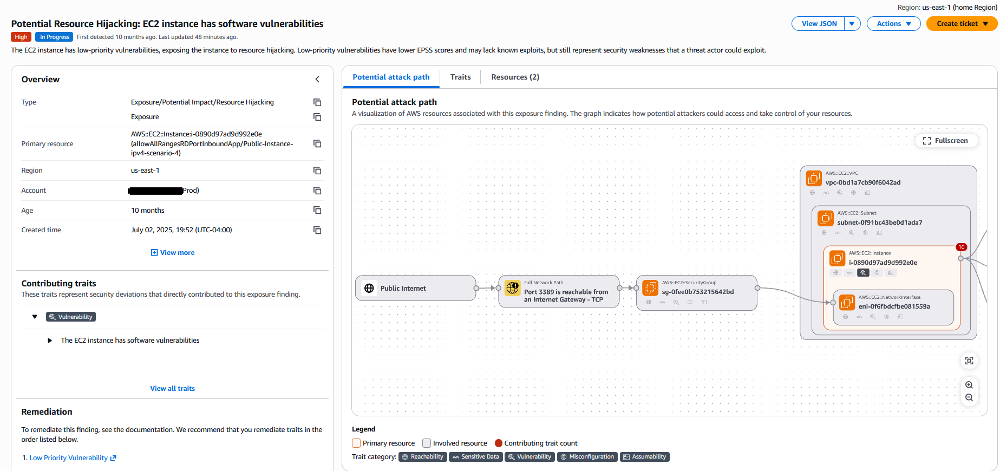

### Understanding Attack Paths

The attack path visualization provides a powerful way to understand how potential threat actors could exploit vulnerabilities to access your resources. The visualization maps out the sequence of steps an attacker could take, showing the relationships between resources and the contributing factors at each stage. When reviewing an attack path, examine the primary resource that represents the initial entry point for the attack, review the involved resources that could be accessed or compromised as part of the attack chain, analyze the contributing traits that make each resource vulnerable such as internet reachability, software vulnerabilities, misconfigurations, or excessive permissions, and consider the potential impact if the attack were successful including what sensitive data or critical resources could be compromised. 

The attack path graph uses color coding to distinguish different resource types and risk levels. Orange boxes typically represent primary or entry point resources, red boxes indicate high-risk or target resources, and gray or neutral colors show intermediate resources. Directional arrows show the attack flow, and severity indicators on nodes help you understand the risk level at each stage. Use the attack path information to prioritize remediation efforts by focusing on breaking the attack chain at its weakest or most critical points. Often, remediating a single misconfiguration or vulnerability can disrupt an entire attack path, significantly reducing your risk exposure.

### Analyzing Traits and Signals

To understand why an exposure is present, select the Traits tab in the finding details. This will list traits such as Misconfiguration, Vulnerability, Reachability, Sensitive Data, or Assumability. If you select By signal in the Traits tab, you have a full list of the signals associated with the exposure finding. These signals are the underlying findings that were created from different services such as Security Hub CSPM and Amazon Inspector that were correlated together to determine the risk associated with the exposure finding.

Understanding the relationship between traits and signals helps you comprehend the full context of a security issue. A single exposure finding might correlate findings from multiple security services, providing a comprehensive view of the risk that wouldn't be apparent when viewing individual findings in isolation. For example, an exposure finding might combine a vulnerability finding from Inspector, a misconfiguration finding from Security Hub CSPM, and a reachability finding from network analysis to show how these factors together create a critical security risk.

### Resource Investigation

When investigating resources associated with exposure findings, select the Resources tab to see all resources involved in the exposure. For example, you might see an EC2 instance along with its associated IAM role, security groups, network interfaces, VPC, subnet, and potentially S3 buckets or other resources that could be accessed through the attack path. This list of resources helps you determine what needs to be remediated in your environment to mitigate the risk attributed to the finding. 

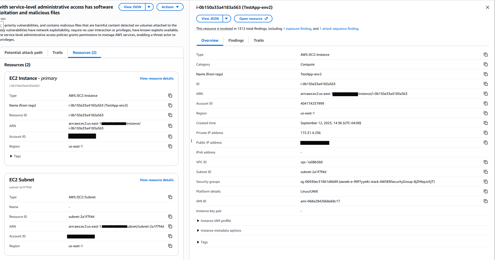

For each resource, you can view detailed configuration information including instance type, AMI ID, launch time, and network configuration. Associated findings show all security issues related to the resource, not just those contributing to the current exposure. Network connectivity information displays public IP addresses, security groups, and network ACLs. Tags provide business context such as application name, environment, and ownership. This comprehensive resource view enables you to understand the full security context of each resource and make informed decisions about remediation priorities.

### Automated Response and Remediation

Security Hub helps streamline the incident management process through its native integrations with popular service management systems such as Atlassian's Jira Service Management and ServiceNow. This integration minimizes the need for manual ticket creation and reduces the time between finding and fixing security issues. Organizations can use Security Hub Automation Rules to automatically create and track tickets for security findings directly from the Security Hub console, helping to ensure that no critical security exposure goes unaddressed.

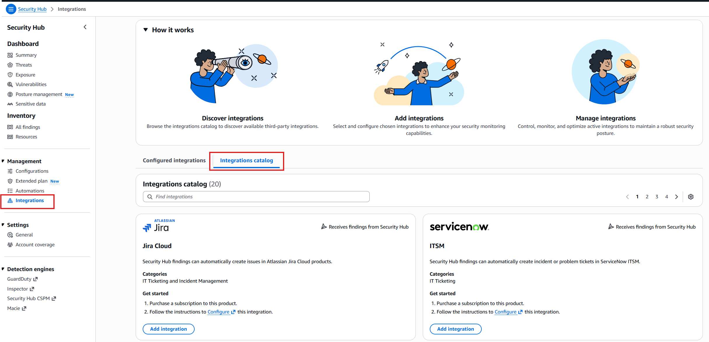

Integration with these widely-used service management systems helps maintain a consistent workflow, enables better tracking of remediation efforts, and improves collaboration between security and operations teams. Create automation rules for common remediation scenarios such as automatically revoking exposed credentials, updating security groups to remove overly permissive rules, or triggering Lambda functions that implement custom remediation logic. Document your automation rules and regularly review their effectiveness to ensure they're providing the intended security benefits. Each Security Hub finding from a Security or Compliance Standard has associated remediation instructions. This can provide valuable insights into how to respond to any given finding. Leverage these available remediation instructions to understand the recommended steps for addressing security issues.

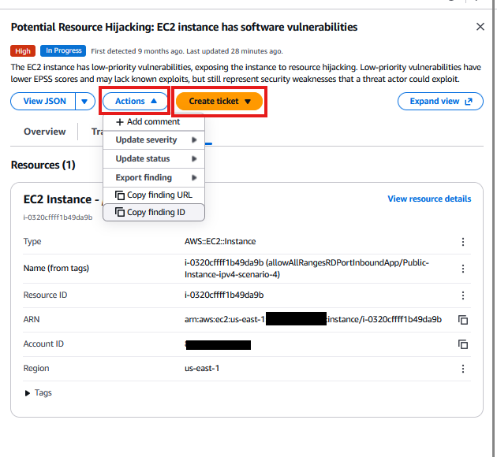

### Monitoring and Trending

Use the Security Hub dashboard to monitor trends in your security posture over time. The Trends Overview provides metrics on threats, exposures, resources, and all findings which allows you to visualize how your security posture is evolving over different time periods including 5 days, 30 days, 90 days, 6 months, and 1 year. These metrics help you understand whether your security posture is improving or deteriorating. The Security Coverage widget shows the percentage of your environment covered by different security capabilities including vulnerability management by Amazon Inspector, threat detection by Amazon GuardDuty, sensitive data discovery by Amazon Macie, and posture management by AWS Security Hub CSPM. Monitor this coverage to ensure you're maintaining comprehensive security visibility across your AWS environment. Regularly review these trends to identify patterns, measure the effectiveness of your security initiatives, and demonstrate security improvements to stakeholders. Trending data can also help you identify emerging risks or areas where additional security focus is needed.

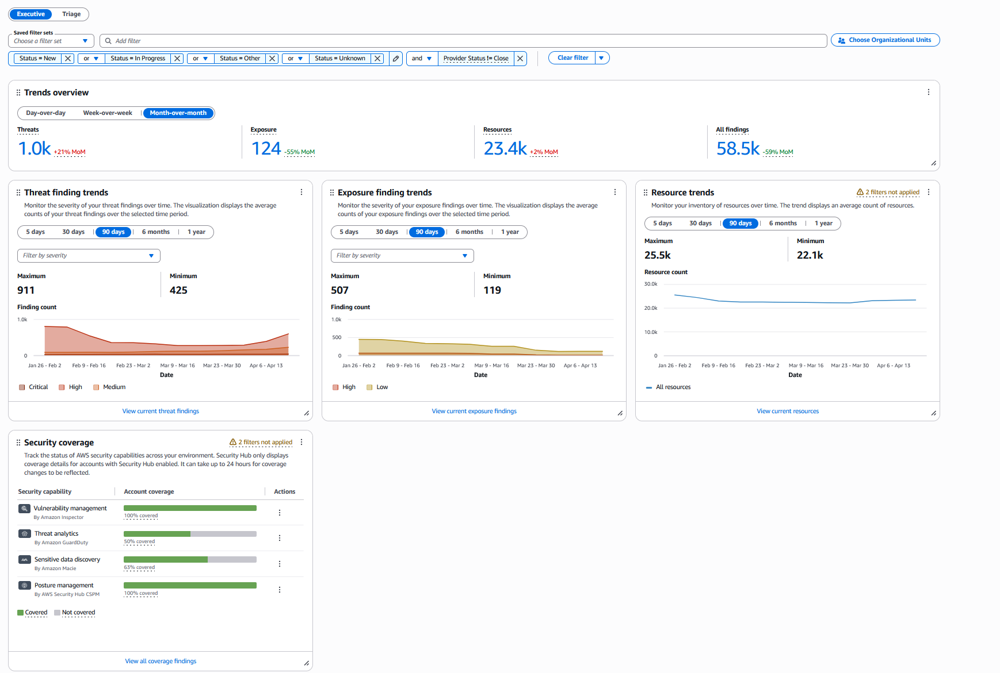

### Automation 

Security Hub includes features that automatically modify and act on findings based on your specifications. Security Hub currently supports the following types of automations:

* **Automation rules** – Automatically update and suppress findings, as well as send findings to ticketing tools, in near real time based on defined criteria.
* **Automated response and remediation** – Create custom Amazon EventBridge rules that define automatic actions to take against specific findings and insights.

Automation rules are helpful when you want to automatically update finding fields in the Open Cybersecurity Schema Framework (OCSF) without the need for custom code. For example, you can use an automation rule to update the severity level of findings for resources with a specific tag. Using the automation rule eliminates the need to manually update the severity level of each finding related to the specific tag. You can configure automation rules to create tickets in tools like Jira Cloud and ServiceNow when findings match specific attributes. This allows findings to be created into tickets as soon as they are sent to Security Hub or created by Security Hub.

EventBridge rules are helpful when you want to take actions outside of Security Hub with regards to specific findings or send specific findings to third-party tools for remediation or additional investigation. The rules can be used to trigger supported actions, such as invoking an AWS Lambda function or notifying an Amazon Simple Notification Service (Amazon SNS) topic about a specific finding. For more information on setting up event bridge rules for automation see [Automation rules in EventBridge](https://docs.aws.amazon.com/securityhub/latest/userguide/securityhub-v2-eventbridge-automations.html)

Automation rules take effect before EventBridge rules are applied. That is, automation rules are triggered and update a finding before EventBridge receives the finding. EventBridge rules then apply to the updated finding.

When creating automation rules, consider the rule order as lower rule numbers execute first. You can create up to 100 automation rules per administrator account. Rules evaluate new and updated findings but not historical findings. Only the Security Hub admin account can create or edit automation rules, ensuring centralized control over automated response workflows.

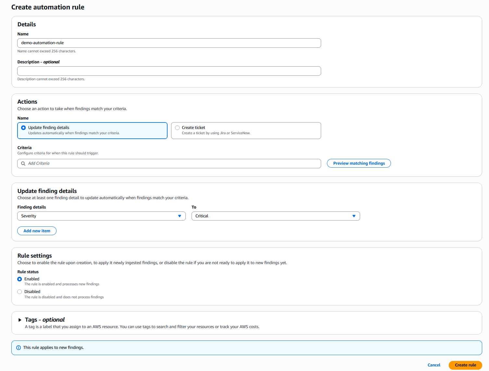

### 3rd party Integrations

Integration with 3rd party supported partners is available within Security Hub. One example of using integration to automate responses is forwarding findings to a ticketing system or SIEM such as Splunk. Security Hub supports the Open Cybersecurity Schema Framework OCSF, enabling interoperability with multiple security tools and services. Partners who support the OCSF schema include Cribl, CrowdStrike, Datadog, SentinelOne, Splunk and many others. Service partners such as Accenture, Deloitte, and Optiv can help you adopt Security Hub and implement security best practices tailored to your organization's needs.

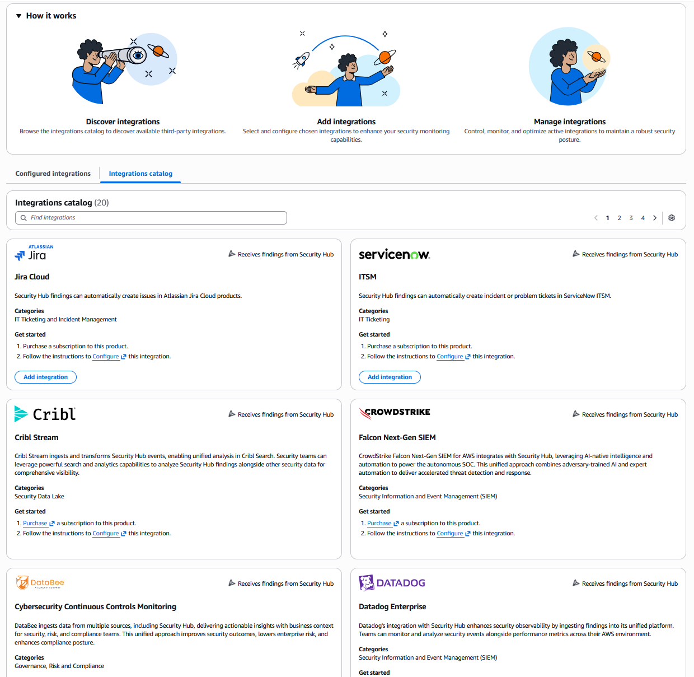

## Cost Considerations

### Understanding the Pricing Model

Security Hub offers predictable, resource based pricing that replaces multiple separate bills for GuardDuty, Inspector, and Security Hub CSPM, with a single consolidated billing model. The Essentials Plan provides comprehensive security coverage with per resource pricing, while the optional Threat Analytics Plan adds advanced threat detection capabilities with usage based pricing. AWS Security Hub provides a 30-day free trial that includes essentials plan capabilities. Every AWS account in each Region enabled with Security Hub receives a free trial, even if you previously used AWS Security Hub CSPM or Amazon Inspector free trials. Add-on capabilities (threat analytics powered by Amazon GuardDuty and AWS Lambda code scanning powered by Amazon Inspector) and the Extended plan are not included in the Security Hub free trial, though individual service free trials still apply if you have not used them previously. To help you plan ahead, use the [Security Hub pricing page](https://aws.amazon.com/security-hub/pricing/) and Security Hub [Cost Estimator](https://github.com/aws-samples/sample-AWS-Security-Hub-Cost-Estimation-Tool) to calculate your expected costs before enabling the service. During the free trial, you can monitor your usage through the AWS billing console to estimate your ongoing costs based on actual usage during the free trial.

### Cost Optimization Strategies

There are several strategies to optimize your Security Hub costs while maintaining comprehensive security coverage 

* **Remove Unused Resources** - Security Hub esssentials plan is based on per-resource pricing, regularly review your resource inventory and remove unused resources to save costs. You can use [AWS Trusted Advisor](https://docs.aws.amazon.com/awssupport/latest/user/cost-optimization-checks.html) to identify underutilized EC2 instances and Amazon ECR [Lifecycle Policies](https://docs.aws.amazon.com/AmazonECR/latest/userguide/LifecyclePolicies.html) to remove ECR images that are not being used to save costs. 

* **Optimize Lambda Function Scanning** - Lambda functions vulnerability scanning is included in the Security Essentials plan, customers can optionally enable lambda code scanning to identify enhanced vulnerabilities such as data leaks and injection flaws. To optimize costs, carefully evaluate whether lambda code scanning is necessary for all functions or only for lambda functions in production environments with complex business logic processing sensitive data or exposed to external inputs.

* **Review Container Scanning Patterns** - * Security Hub ECR vulnerability scanning powered by Amazon Inspector is priced based on two dimensions, Per image (on-push) and per rescan for retained images. Inspector provides two scanning modes - Continuous Scanning which automatically rescans images as new vulnerabilities are discovered and On-Push scanning which scans images only when pushed to the registry. With the new Security Hub resource-based pricing, you receive unlimited scanning. However, if your container images are relatively static and you have a robust CI/CD pipeline, switching to on-push scanning maintains security coverage at critical deployment points. We recommend using on-push scanning for production images with infrequent updates, base images that rarely change and development/test images with controlled deployment. Continuous scanning should be used for Internet-facing application, containers Images processing sensitive data and Containers with frequent dependency updates.

To change the scan mode for your container images, navigate to the ECR console, select “Features & Settings", then select "configure" under scanning. Use the appropriate filter based on the repository name to update the scan on push and continuous scanning configuration for example to configure continuous scanning for all repositories with prod in the name use the filter *prod*.

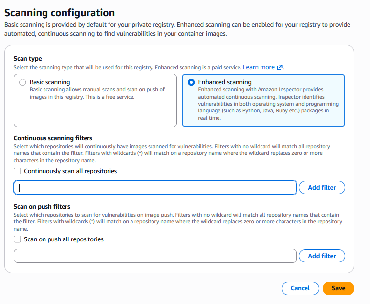

To update the re-scan configuration for ECR, Navigate to the Amazon inspector console, under “settings“ select ”scan settings“

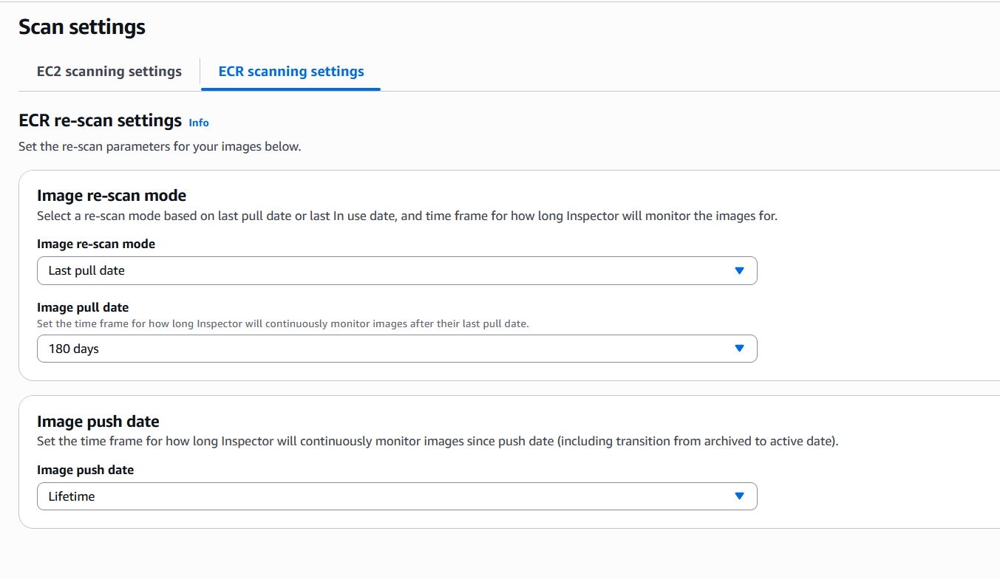

 For more information on updating the scanning mode see the [Amazon Inspector](https://docs.aws.amazon.com/inspector/latest/user/scanning-ecr.html) and the [Amazon ECR](https://docs.aws.amazon.com/AmazonECR/latest/userguide/image-scanning-enhanced-enabling.html) documentation.

* **Eliminate Redundant Finding Aggregation in Security Hub CSPM** - Customers previously using Security Hub CSPM may have configured finding aggregation at the CSPM level to consolidate security findings across AWS services and security tools. Since Security Hub now handles finding aggregation centrally, customers no longer need to maintain separate aggregation configurations at the CSPM level. This eliminates redundant processing and associated costs. It is important to understand the current Security Hub CSPM downstream integrations such as SIEM tools, ticketing platforms, security orchestration tools, compliance dashboards and impact of disabling these integration. Consider disabling the ingestion of AWS Security Service findings such as Amazon Guardduty (Threat Analytics), Amazon Inspector and Amazon Macie since the findings from these services are automatically ingested into Security Hub. Refer to the checklist below for before disabling integrations:
     
    * **Audit Existing Integrations:** Document all systems currently consuming findings from CSPM aggregation
    * **Identify Dependencies:** Determine which integrations rely specifically on CSPM aggregation vs. Security Hub's central aggregation
    * **Plan Migration Path:** For affected integrations, reconfigure them to consume findings from Security Hub's central aggregation instead
    * **Test Updated Integration:** Validate that all downstream systems continue receiving findings after the change
    * **Communicate changes:** Notify security operations and integration owners about the architectural changes

* **Review Security Hub Coverage** - Use configuration policies to apply different capability levels to different account types, enabling full capabilities for production accounts while using essential-only capabilities for development or sandbox accounts. This flexibility enables you to balance security coverage with budget constraints while maintaining the ability to expand coverage as needed. Accounts without Security Hub enabled can continue to use individual service pricing for GuardDuty, Inspector, and Security Hub CSPM, while accounts with Security Hub enabled benefit from streamlined pricing and enhanced capabilities.Leverage the 30-day free trial to evaluate costs and capabilities before organization wide deployment.

## Resources

* [AWS Security Hub User Guide](https://docs.aws.amazon.com/securityhub/latest/userguide/what-is-securityhub-v2.html)
* [AWS Security Hub API Reference](https://docs.aws.amazon.com/securityhub/1.0/APIReference/API_Operations.html)
* [Streamline security response at scale with AWS Security Hub automation](https://aws.amazon.com/blogs/security/streamline-security-response-at-scale-with-aws-security-hub-automation/)
* [AWS Security Hub Extended](https://aws.amazon.com/blogs/security/aws-security-hub-extended-why-enterprise-security-products-should-sell-themselves/)
* [Cost Estimator](https://github.com/aws-samples/sample-AWS-Security-Hub-Cost-Estimation-Tool)
