# AWS Security Hub

## Introduction

Welcome to the AWS Security Hub Best Practices Guide. The purpose of this guide is to provide prescriptive guidance for leveraging AWS Security Hub for unified cloud security operations, automated correlation of security signals, and streamlined response to critical security issues. Publishing this guidance via GitHub will allow for quick iterations to enable timely recommendations that include service enhancements, as well as the feedback of the user community. This guide is designed to provide value whether you are deploying Security Hub for the first time in a single account, or looking for ways to optimize Security Hub in an existing multi-account deployment.

> For guidance on CSPM capabilities including security standards, compliance controls, and posture checks, see the [AWS Security Hub CSPM Best Practices Guide](../security-hub-cspm/index.md).

## How to use this guide

This guide is geared towards security practitioners who are responsible for monitoring and remediation of threats and malicious activity within AWS accounts and resources. The best practices are organized into categories for easier consumption. Each category includes a set of corresponding best practices that begin with a brief overview, followed by detailed steps for implementing the guidance. The topics do not need to be read in a particular order:

* [What is Security Hub](#what-is-security-hub)
* [What are the benefits of enabling Security Hub](#what-are-the-benefits-of-enabling-security-hub)
* [Getting started](#getting-started)
    * [Deployment](#deployment)
    * [Region considerations](#region-considerations)
* [Implementation](#implementation)
    * [Configuration](#configuration)
    * [Essential capabilities](#essential-capabilities)
    * [Threat analytics plan](#threat-analytics-plan)
    * [Network Scanning](#network-scanning)
    * [Security Hub Extended](#security-hub-extended)
* [Operationalize Security Hub findings](#operationalize-security-hub-findings)
    * [Investigate critical risks](#investigate-critical-risks)
    * [Understanding attack paths](#understanding-attack-paths)
    * [Analyzing traits and signals](#analyzing-traits-and-signals)
    * [Resource investigation](#resource-investigation)
    * [AI inventory](#ai-inventory)
    * [Automated response and remediation](#automated-response-and-remediation)
    * [Monitoring and trending](#monitoring-and-trending)
    * [Automation](#automation)
    * [3rd party integrations](#3rd-party-integrations)
    * [Multi-cloud coverage](#multi-cloud-coverage)
* [Cost considerations](#cost-considerations)
    * [Understanding the pricing model](#understanding-the-pricing-model)
    * [Comparing individual service and Security Hub pricing](#comparing-individual-service-and-security-hub-pricing)
    * [Monitoring usage after enablement](#monitoring-usage-after-enablement)
    * [Cost optimization strategies](#cost-optimization-strategies)
* [Resources](#resources)

## What is Security Hub?

AWS Security Hub is a unified cloud security solution that provides comprehensive security operations by automatically correlating and enriching security signals across your AWS environment. Security Hub integrates with Amazon GuardDuty, Amazon Inspector, Amazon Macie, and AWS Security Hub CSPM to deliver near real-time exposure findings, attack path visualization, and streamlined response capabilities that help you prioritize critical security issues and respond at scale. Security Hub can be used by security teams, compliance teams, cloud architects, incident response teams, risk management teams, and MSSPs. Security Hub is currently used by customers of all sizes ranging from small startups to large enterprises.

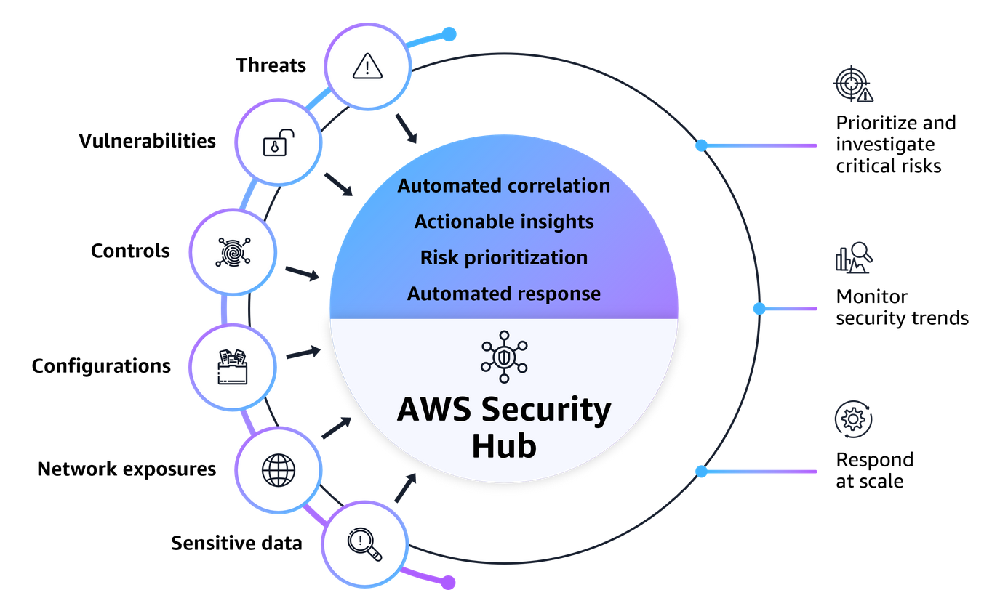

Security Hub has evolved from a basic findings aggregator into a comprehensive security platform. What was previously known as Security Hub is now called [AWS Security Hub CSPM](https://docs.aws.amazon.com/securityhub/latest/userguide/what-is-securityhub.html), which focuses specifically on security posture management and compliance monitoring. The enhanced Security Hub now provides unified cloud security operations with automated correlation across multiple security services, delivering actionable insights that help you protect your cloud environment more effectively.

## What are the benefits of enabling Security Hub?

Security Hub reduces the complexity and effort of managing and improving the security of your AWS accounts, workloads, and resources. You can enable Security Hub across your AWS accounts and regions in minutes, and the service helps you answer fundamental security questions you may have on a daily basis. Key benefits include:

* **Unified security operations:** Gain broader visibility across your cloud environment through centralized management in a unified cloud security solution.
* **Confident prioritization:** Make informed decisions about your critical security issues through automated correlation and enhanced risk context.
* **Actionable security insights:** Gain actionable insights through advanced analytics to surface security risks specific to your environment.
* **Streamlined response at scale:** Reduce response times with automated workflows and ticketing system integration to help protect your cloud environment.
* **Continuous security monitoring:** Detect deviations from security best practices with automated security checks against industry standards and AWS best practices.
* **Accelerate solution adoption:** Deploy curated partner solutions across endpoint, identity, email, network, data, browser, cloud, AI, and security operations in weeks, reducing procurement delays and accelerating coverage. 

Security Hub provides near real-time exposure findings that automatically correlate signals across multiple AWS security services to identify toxic combinations of threats, vulnerabilities, and misconfiguration. Security Hub calculates exposure finding severity using a Likelihood and Impact risk matrix aligned with NIST guidance. Likelihood reflects how readily an exposure could be exploited, drawing on factors such as ease of discovery, ease of exploit, EPSS scores combined with internal threat intelligence, and whether a public exploit is known to exist. Impact reflects the potential blast radius if the resource is compromised.

If you built prioritization runbooks against an earlier version of this model, revisit them. The move to a Likelihood and Impact matrix changes how some findings sort, and the addition of Impact means a vulnerability on a resource with broad permissions now rates higher than the same vulnerability on a tightly scoped one. That is the intended behavior, but it will reorder a queue your team may have grown used to.


**Attack path** visualization helps you understand how an adversary could chain together vulnerabilities and misconfiguration to compromise critical resources. By mapping these connections, Security Hub shows possible routes an adversary could take through your environment and identifies which critical resources could be impacted. The visualization displays resource relationships, contributing factors at each stage, and trait classifications. Security Hub supports six trait types:

| Trait | What it indicates | Where the signal comes from |
| --- | --- | --- |
| Reachability | Open network paths to a resource | Security Hub CSPM controls, GuardDuty findings, Inspector network reachability findings |
| Vulnerability | A weakness that could be exploited | Inspector package vulnerability findings, GuardDuty EC2 malware findings |
| Misconfiguration | A misconfigured resource | Security Hub CSPM controls, GuardDuty findings, AWS Config |
| Sensitive Data | The resource contains sensitive data | Macie sensitive data findings |
| Assumability | The resource has vended IAM permissions | Resource configuration from AWS Config |
| Impact | Potential blast radius if the resource is compromised | Effective permissions analysis of associated IAM principals |

This table is worth studying, because it shows why enabling more of the portfolio improves Security Hub's output rather than just adding more findings. Sensitive Data only appears if you run Macie. Vulnerability depends on Inspector. Without them, exposure findings still work but they carry less context, and severity is calculated from a thinner picture.

The **Impact** trait deserves particular attention because it is the newest and the least intuitive. Security Hub determines impact by analyzing the *effective permissions* of the IAM principals attached to a resource, meaning the permissions that remain after evaluating identity-based policies together with the resource-based policies of the resources those principals can reach. Using effective permissions, Security Hub traces privilege escalation paths from the primary resource outward and surfaces concrete paths to real resources in your environment. This is what turns "this instance has a vulnerability" into "this instance has a vulnerability and its role can reach these three other resources." You can review those paths in the [potential attack path graph](https://docs.aws.amazon.com/securityhub/latest/userguide/potential-attack-path-graph.html) and shrink your blast radius by removing permissions the workload does not use. Refer to the [supported trait types documentation](https://docs.aws.amazon.com/securityhub/latest/userguide/exposure-findings-supported-traits.html) for the full detail.

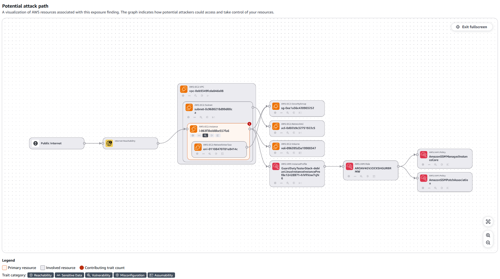

Security Hub provides a security focused resource inventory that offers a consolidated view of your AWS resources across your AWS accounts. Security Hub brings in resource-level context, helping you understand the resource configuration, security posture, and any associated findings. Rather than switching between different tools or consoles, you can see a summarized view of each resource's configuration details, application context, and related security findings all in one place. Quick filters let you slice the inventory by category (Compute, Storage, Database, Identity, Network, etc), by top accounts, or by resource type, making it easy to identify the resources that need to be prioritized. 

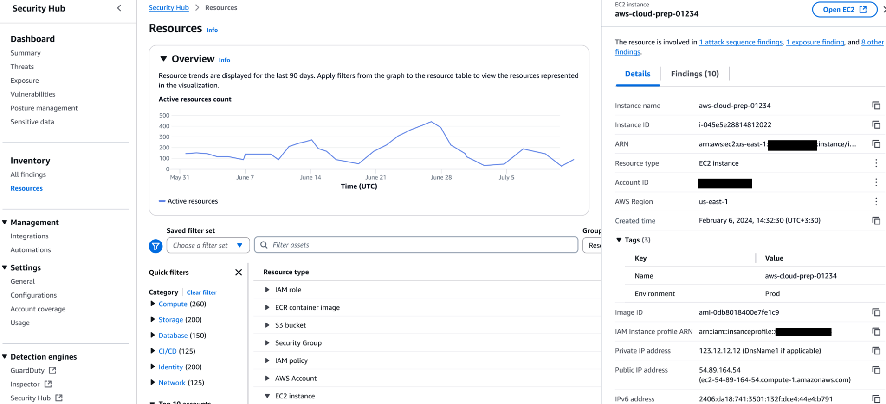


## Getting started

Before you enable AWS Security Hub, consider the following prerequisites and best practices.

**Permissions**

To administer Security Hub, attach the AWS managed policy AWSSecurityHubFullAccess to the IAM identity you plan to use for setup and management. If you plan to integrate Security Hub with AWS Organizations, also attach the AWSSecurityHubOrganizationsAccess policy to the Organizations management account.

**Delegated administrator**

Choose which account in your AWS Organization will serve as the Security Hub delegated administrator. This account manages Security Hub settings, findings, and member accounts on behalf of your organization. As a best practice, use the same delegated administrator account across your security services  such as Amazon GuardDuty, Amazon Inspector, and Amazon Macie for consistent governance, see the [Security Reference Architecture](https://docs.aws.amazon.com/prescriptive-guidance/latest/security-reference-architecture/architecture.html). for more information on setting up a delegated admin account. 

**AWS Config**

Security Hub CSPM runs security checks against best practices and compliance standards, and those checks need resource configuration data from AWS Config. You no longer have to set that up yourself. When both Security Hub and Security Hub CSPM are enabled in an account and Region, CSPM automatically creates and manages a service-linked configuration recorder named `AWSConfigurationRecorderForSecurityHubCSPM`, keeps its recording scope aligned to the resources that supported controls need, and creates one for each new account as you enable it. In this state Security Hub does not use your customer-managed configuration recorder, and the `Config.1` control always passes.

This is a change worth flagging if you are working from older runbooks, which typically told you to enable AWS Config in every account and Region before enabling Security Hub. You only need to manage AWS Config yourself if you run Security Hub CSPM standalone, or if you use AWS Config for purposes beyond CSPM such as a CMDB, custom Config rules, or conformance packs. See [Cost Considerations](../security-hub-cspm/index.md#aws-config) in the Security Hub CSPM guide for how this affects Config costs in each case. 
For more information see [Enabling Security Hub](https://docs.aws.amazon.com/securityhub/latest/userguide/securityhub-v2-enable.html) documentation.


### Deployment

For organization wide deployment, use AWS Organizations integration with a delegated administrator account to enable central configuration and prevent configuration drift across your organization. Begin by designating a delegated administrator account within your AWS Organization. This should typically be a dedicated Security Account that serves as the central hub for security operations. 

From the AWS Organizations management account, navigate to Security Hub and designate your chosen security account as the delegated administrator. Under trusted access, select the checkbox to authorize trusted access for the delegated admin account. This delegation grants the delegated admin account the necessary permissions to manage Security Hub across all member accounts. You can optionally choose to enable security hub in the management account as well.


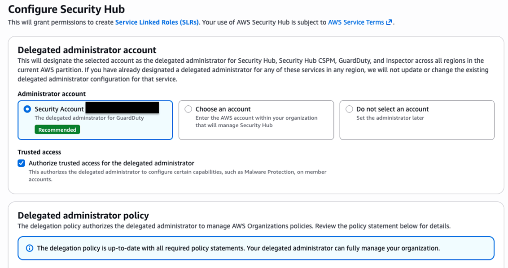

Once the delegated administrator is configured, navigate to the delegated admin account and enable Security Hub in your home region. The home region serves as the aggregation point for findings from all other regions across AWS accounts.

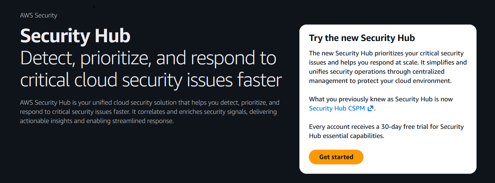


### Region Considerations

Security Hub supports a home region model where findings are aggregated from linked regions. The home region typically us-east-1 or your primary operational region serves as the Security Hub delegated administrator location, aggregates findings from all linked regions, manages central configuration and policy, and handles automation rules management. Linked regions such as us-west-2, eu-west-1, ap-southeast-1 automatically aggregate findings to the home region, receive configuration management from the home region, and monitor resources locally. This approach provides a single pane of glass for all regions, reduces operational overhead, enables centralized automation and response, and facilitates cross-region correlation and analysis.

## Implementation

One of the key advantages of AWS Security Hub is the ability to manage the deployment and configuration of multiple security services from a single console. Rather than navigating between individual service consoles for GuardDuty, Inspector, and Security Hub CSPM, Security Hub provides a unified pane of glass for enabling, configuring, and monitoring these services across your entire organization. This centralized approach reduces operational overhead, ensures consistency in security posture, and simplifies the management experience for security teams. 

### Configuration

Once you configure Security Hub in the delegated administrator account, Security Hub will be enabled but it will be missing coverage across all of the existing accounts in your organization. In the Security Hub delegated admin account, navigate to the security hub console and select summary you will see the option to configure Security Hub for your organization. Configuration policies and deployments  allow you to define and enforce consistent security capabilities across your organization. 

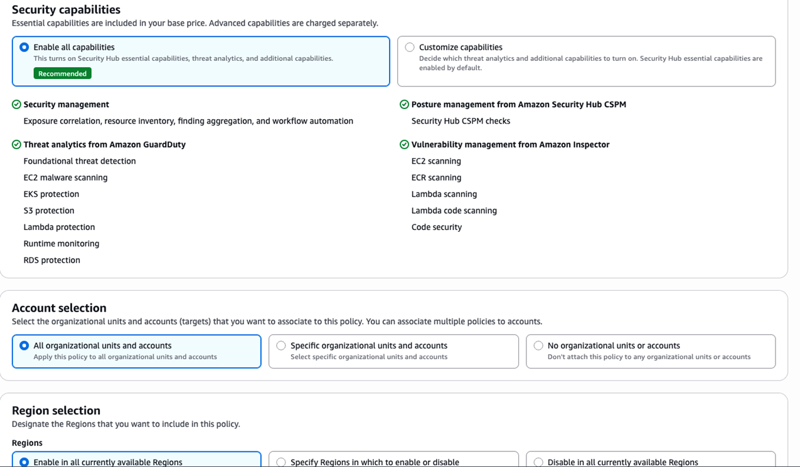

**Policies** generate AWS Organizations policies for accounts and Regions for AWS Security Hub and Amazon Inspector. Policies can be applied at the organizational level, allowing you to automatically apply appropriate security configurations to new accounts as they're added to your organization. This approach ensures consistent security coverage without manual intervention for each new account, preventing configuration drift and maintaining a strong security posture across your entire AWS environment.

For example, you might create a production policy that enables all essential capabilities plus threat analytics across all commercial regions, while development accounts might only require essential capabilities in limited regions, and sandbox accounts could use essential-only capabilities.

**Deployments** are a one-time action to enable a security capability across the entire organization, specific organizational units (OUs), or selected accounts and Regions for Amazon GuardDuty and AWS Security Hub CSPM. Unlike policies, you cannot view or edit deployments and deployments will not apply to newly enabled accounts. 

 To ensure that new AWS accounts added to your organization automatically have GuardDuty and Security Hub CSPM enabled, we recommend configuring the auto-enable feature for new member accounts. For detailed instructions, refer to the [Amazon GuardDuty](https://docs.aws.amazon.com/guardduty/latest/ug/set-guardduty-auto-enable-preferences.html) and [AWS Security Hub CSPM](https://docs.aws.amazon.com/securityhub/latest/userguide/accounts-orgs-auto-enable.html) documentation. 


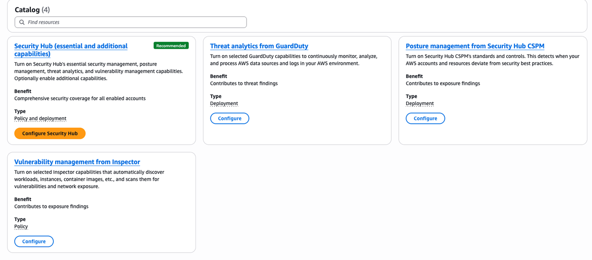

If you prefer to manage this in code rather than the console, it helps to understand that the console's single **Configure Security Hub (essential and add-on capabilities)** button is client-side orchestration over several independent mechanisms. There is no single API or Terraform resource that turns everything on at once. The faithful infrastructure-as-code equivalent is a composite: enable Security Hub itself for essentials, a `SECURITYHUB_POLICY` organization policy for essentials plus network scanning, an `INSPECTOR_POLICY` organization policy for vulnerability management, GuardDuty organization enablement for threat analytics, and a Security Hub CSPM central configuration policy for posture management. The example below shows that composite as a single Terraform template you run from the organization management account.

??? example "Terraform: Security Hub essentials and add-on capabilities for an organization"

    This template reproduces the console's one-button configuration as infrastructure as code. Review the inline notes before applying, particularly the prerequisites and the provider version requirement.

    > **Note:** At the time of writing, the `feature = "SecurityHubV2"` argument on `aws_securityhub_organization_admin_account` is not yet in a released version of the AWS provider (pending PR). Until it ships, either use a development build of the provider or designate the Security Hub V2 delegated administrator out-of-band, as noted in Section 1 of the template.

    ```terraform
    ###############################################################################
    # Security Hub V2 — "Essential and add-on capabilities" for an AWS Organization
    #
    # This template reproduces, in Terraform, what the Security Hub console's single
    # "Configure Security Hub (essential and add-on capabilities)" button does.
    # That button is CLIENT-SIDE ORCHESTRATION over four independent AWS mechanisms;
    # there is no single API/resource that turns everything on. So the faithful
    # Terraform equivalent is this composite:
    #
    #   1. Security Hub V2 (essentials)  -> delegated admin + enable the service
    #   2. Security Hub org policy       -> SECURITYHUB_POLICY (essentials + network scanning)
    #   3. Amazon Inspector org policy   -> INSPECTOR_POLICY (vulnerability management)
    #   4. Amazon GuardDuty              -> org admin + detector + org auto-enable (threat)
    #   5. Security Hub CSPM             -> central configuration policy (posture)
    #
    # Run from the ORGANIZATION MANAGEMENT account. A second provider alias points at
    # the DELEGATED ADMINISTRATOR (security) account.
    ###############################################################################

    terraform {
      required_providers {
        aws = {
          source = "hashicorp/aws"
          # NOTE: `feature = "SecurityHubV2"` on aws_securityhub_organization_admin_account
          # is NOT in a released provider yet (pending PR). Until it merges, either use a
          # dev build or designate the V2 delegated admin out-of-band (see Section 1 note).
          version = ">= 6.0"
        }
      }
    }

    ############################ Variables ########################################

    variable "region" {
      description = "Home Region to enable capabilities in."
      type        = string
      default     = "us-east-1"
    }

    variable "enabled_regions" {
      description = "Regions to enable in the SECURITYHUB_POLICY / INSPECTOR_POLICY."
      type        = list(string)
      default     = ["us-east-1"]
    }

    variable "management_profile" {
      description = "AWS profile/credentials for the organization management account."
      type        = string
    }

    variable "delegated_admin_profile" {
      description = "AWS profile/credentials for the delegated administrator (security) account."
      type        = string
    }

    variable "delegated_admin_account_id" {
      description = "Account ID of the delegated administrator (security) account."
      type        = string
    }

    variable "organization_root_id" {
      description = "Organization root ID (r-xxxx) to attach org policies to."
      type        = string
    }

    ############################ Providers ########################################

    # Organization MANAGEMENT account.
    provider "aws" {
      region  = var.region
      profile = var.management_profile
    }

    # DELEGATED ADMINISTRATOR (security) account.
    provider "aws" {
      alias   = "delegated_admin"
      region  = var.region
      profile = var.delegated_admin_profile
    }

    ###############################################################################
    # PREREQUISITES (do once, outside this template):
    #   * Trusted access for the services below is enabled (managed here via the
    #     organization resource, or already enabled in your org).
    #   * The SECURITYHUB_POLICY and INSPECTOR_POLICY *policy types* are enabled on
    #     the org root. There is no first-class TF resource for this; enable once:
    #       aws organizations enable-policy-type --root-id <root> --policy-type SECURITYHUB_POLICY
    #       aws organizations enable-policy-type --root-id <root> --policy-type INSPECTOR_POLICY
    ###############################################################################

    # Enable trusted access for all four services (safe to manage centrally).
    # If you already manage aws_organizations_organization elsewhere, remove this
    # and enable trusted access there instead.
    resource "aws_organizations_organization" "this" {
      aws_service_access_principals = [
        "securityhub.amazonaws.com",
        "inspector2.amazonaws.com",
        "guardduty.amazonaws.com",
        "malware-protection.guardduty.amazonaws.com",
      ]
      feature_set = "ALL"
    }

    ###############################################################################
    # 1. SECURITY HUB V2 (ESSENTIALS): delegated admin + enable the service
    ###############################################################################

    # Designate the Security Hub V2 delegated administrator (management account).
    #
    # Requires the `feature` argument (pending provider PR). Until it is released,
    # comment this out and designate the DA out-of-band instead, e.g.:
    #   aws securityhub enable-organization-admin-account \
    #     --admin-account-id <security-account> --feature SecurityHubV2
    resource "aws_securityhub_organization_admin_account" "v2" {
      admin_account_id = var.delegated_admin_account_id
      feature          = "SecurityHubV2"

      depends_on = [aws_organizations_organization.this]
    }

    # Enable Security Hub V2 in the delegated administrator account. Enabling the
    # service IS "essentials" — the essential capabilities are included at the base
    # per-resource price. (This resource calls EnableSecurityHubV2, which takes no
    # capability parameters; add-ons are configured by the sections below.)
    resource "aws_securityhub_account_v2" "da" {
      provider = aws.delegated_admin

      depends_on = [aws_securityhub_organization_admin_account.v2]
    }

    ###############################################################################
    # 2. SECURITY HUB ORG POLICY: essentials + network scanning across the org
    ###############################################################################

    resource "aws_organizations_policy" "securityhub" {
      name = "securityhub-essentials"
      type = "SECURITYHUB_POLICY"

      content = jsonencode({
        securityhub = {
          enable_in_regions  = { "@@assign" = var.enabled_regions }
          disable_in_regions = { "@@assign" = [] }
          features = {
            # network_scanning is the only opt-in SECURITYHUB_POLICY feature.
            network_scanning = {
              enable_in_regions  = { "@@assign" = var.enabled_regions }
              disable_in_regions = { "@@assign" = [] }
            }
          }
        }
      })
    }

    resource "aws_organizations_policy_attachment" "securityhub" {
      policy_id = aws_organizations_policy.securityhub.id
      target_id = var.organization_root_id

      depends_on = [aws_securityhub_account_v2.da]
    }

    ###############################################################################
    # 3. AMAZON INSPECTOR ORG POLICY: vulnerability management across the org
    ###############################################################################

    # Delegated administrator for Inspector (so findings aggregate to the security account).
    resource "aws_inspector2_delegated_admin_account" "this" {
      account_id = var.delegated_admin_account_id

      depends_on = [aws_organizations_organization.this]
    }

    resource "aws_organizations_policy" "inspector" {
      name = "inspector-vulnerability-management"
      type = "INSPECTOR_POLICY"

      content = jsonencode({
        inspector = {
          enablement = {
            ec2_scanning = {
              enable_in_regions  = { "@@assign" = var.enabled_regions }
              disable_in_regions = { "@@assign" = [] }
            }
            ecr_scanning = {
              enable_in_regions  = { "@@assign" = var.enabled_regions }
              disable_in_regions = { "@@assign" = [] }
            }
            lambda_standard_scanning = {
              enable_in_regions  = { "@@assign" = var.enabled_regions }
              disable_in_regions = { "@@assign" = [] }
              lambda_code_scanning = {
                enable_in_regions  = { "@@assign" = var.enabled_regions }
                disable_in_regions = { "@@assign" = [] }
              }
            }
            code_repository_scanning = {
              enable_in_regions  = { "@@assign" = var.enabled_regions }
              disable_in_regions = { "@@assign" = [] }
            }
          }
        }
      })
    }

    resource "aws_organizations_policy_attachment" "inspector" {
      policy_id = aws_organizations_policy.inspector.id
      target_id = var.organization_root_id

      depends_on = [aws_inspector2_delegated_admin_account.this]
    }

    ###############################################################################
    # 4. AMAZON GUARDDUTY: threat analytics (Deployment-type in the console)
    #    GuardDuty is NOT an org policy — it is enabled via these resources.
    ###############################################################################

    resource "aws_guardduty_organization_admin_account" "this" {
      admin_account_id = var.delegated_admin_account_id

      depends_on = [aws_organizations_organization.this]
    }

    # Detector in the delegated administrator account.
    resource "aws_guardduty_detector" "da" {
      provider = aws.delegated_admin
      enable   = true
    }

    # Auto-enable GuardDuty for all accounts in the organization.
    resource "aws_guardduty_organization_configuration" "this" {
      provider = aws.delegated_admin

      auto_enable_organization_members = "ALL"
      detector_id                      = aws_guardduty_detector.da.id

      depends_on = [aws_guardduty_organization_admin_account.this]
    }

    ###############################################################################
    # 5. SECURITY HUB CSPM: posture management (Deployment-type in the console)
    #    CSPM is the "classic" Security Hub, managed via central configuration.
    ###############################################################################

    # Designate the CSPM (SecurityHub) delegated administrator. Same security account.
    resource "aws_securityhub_organization_admin_account" "cspm" {
      admin_account_id = var.delegated_admin_account_id
      feature          = "SecurityHub" # CSPM (default)

      depends_on = [aws_organizations_organization.this]
    }

    # Enable Security Hub CSPM in the delegated administrator account.
    resource "aws_securityhub_account" "cspm" {
      provider = aws.delegated_admin
    }

    # Cross-Region finding aggregation (required before CENTRAL configuration).
    resource "aws_securityhub_finding_aggregator" "this" {
      provider = aws.delegated_admin

      linking_mode = "ALL_REGIONS"

      depends_on = [aws_securityhub_account.cspm]
    }

    # Switch org configuration to CENTRAL so configuration policies can be used.
    resource "aws_securityhub_organization_configuration" "cspm" {
      provider = aws.delegated_admin

      auto_enable           = false
      auto_enable_standards = "NONE"

      organization_configuration {
        configuration_type = "CENTRAL"
      }

      depends_on = [
        aws_securityhub_organization_admin_account.cspm,
        aws_securityhub_finding_aggregator.this,
      ]
    }

    # The CSPM configuration policy: enable Security Hub CSPM + FSBP standard/controls.
    resource "aws_securityhub_configuration_policy" "posture" {
      provider = aws.delegated_admin

      name        = "posture-management"
      description = "Enables Security Hub CSPM standards and controls (posture management)."

      configuration_policy {
        service_enabled = true
        enabled_standard_arns = [
          "arn:aws:securityhub:${var.region}::standards/aws-foundational-security-best-practices/v/1.0.0",
        ]
        security_controls_configuration {
          disabled_control_identifiers = []
        }
      }

      depends_on = [aws_securityhub_organization_configuration.cspm]
    }

    # Apply the CSPM configuration policy to the whole organization (root).
    resource "aws_securityhub_configuration_policy_association" "posture_root" {
      provider = aws.delegated_admin

      target_id = var.organization_root_id
      policy_id = aws_securityhub_configuration_policy.posture.id
    }

    ############################ Outputs ##########################################

    output "securityhub_v2_hub_arn" {
      value = aws_securityhub_account_v2.da.arn
    }

    output "securityhub_org_policy_id" {
      value = aws_organizations_policy.securityhub.id
    }

    output "inspector_org_policy_id" {
      value = aws_organizations_policy.inspector.id
    }

    output "guardduty_detector_id" {
      value = aws_guardduty_detector.da.id
    }

    output "cspm_configuration_policy_id" {
      value = aws_securityhub_configuration_policy.posture.id
    }
    ```

### Essential Capabilities

Security Hub Essential capabilities provide comprehensive security coverage through resource-based pricing. Essential capabilities include vulnerability management through Amazon Inspector scanning, security posture management through Security Hub CSPM checks, GuardDuty EC2 Malware Scanning, risk and exposure analytics, and security response management. When configuring essential capabilities, consider which resource types are most critical to your security posture.


### Threat Analytics Plan

The Threat Analytics plan embeds GuardDuty's threat detection capabilities directly into the Security Hub console. This means that threat findings such as privilege escalation, suspicious API calls, network anomalies, data exfiltration appear alongside resource misconfigurations, and vulnerabilities in a single unified view. A suspicious IAM action surfaces next to the configuration gap that enabled it, eliminating the need to manually pivot between services. Security Hub's native integrations with EventBridge and automated response workflows allow teams to act on these findings immediately by triggering remediation playbooks, normalizing severity across sources, and prioritizing what matters most. Without this plan, threat detection lives in isolation. When you enable threat analytics plan, Security Hub becomes a complete threat-aware security operations hub.

### Network Scanning

Network Scanning is an opt-in capability that performs active network reachability testing against your internet-facing resources from AWS-owned IP addresses. Rather than inferring exposure from security group and route table configuration, Network Scanning attempts TCP port connections, identifies applications and protocols, and collects service banners, HTTP headers, and TLS certificate metadata. The result is evidence of what is actually reachable from the internet rather than what your configuration suggests should be reachable.

This distinction matters in practice. Configuration analysis tells you a security group allows 0.0.0.0/0 on port 22. Network Scanning tells you whether something is answering on port 22 and what it is. Teams working through a large backlog of open security group findings use this to separate the genuinely exposed from the theoretically exposed, which is usually a much shorter list.

Network Scanning covers EC2 instances with a public IP, Elastic IPs, Network Load Balancers, Application Load Balancers, Classic Load Balancers, and Azure Public IP Addresses where you have configured an Azure connector. It scans each resource type independently. For load balancers it resolves and scans the DNS name, and it only scans instances behind a load balancer if those instances have their own public IP or Elastic IP.

Once enabled, Network Scanning scans existing resources within roughly 24 hours, picks up new resources shortly after Security Hub is notified they were created, rescans when eligible control plane changes occur, and rescans active resources roughly every 12 hours to catch reachability changes. Short-lived resources may terminate before they are ever scanned, so do not treat it as a complete inventory of everything that was ever exposed.

If you manage Security Hub as code, Network Scanning is enabled through the `SECURITYHUB_POLICY` AWS Organizations policy rather than a standalone Terraform flag, using the `network_scanning` feature block. The Terraform example in the [Configuration](#configuration) section above includes it, so you can enable it in the same policy that turns on essentials rather than clicking through the console per account.

Two operational notes. First, enable it through a configuration policy rather than per account. When enabled that way, member accounts cannot turn it off, which matters because active scanning is exactly the kind of setting an application team disables when it looks unfamiliar. Second, you will need an exclusion path. Add the tag key `SecurityHubNetworkScanExclusion` to a resource to stop future scans and close its active findings. Tag the resource that actually holds the public IP, which means the Elastic IP rather than the instance when an EIP is attached, and the load balancer plus any individually addressable targets for load balanced services. Agree the exclusion process with your network and application teams before you enable scanning, not after the first escalation.

Be aware that enabling Network Scanning authorizes AWS to actively scan your environment. Some organizations need to record that authorization or notify internal teams who monitor for scanning activity, so check whether that applies to you before turning it on.

### Security Hub Extended

Security Hub Extended is a curated marketplace of enterprise-grade partner security solutions delivered directly through AWS Security Hub. It covers nine security categories, which are Endpoint, Identity, Email, Network, Data, Browser, Cloud, AI, and Security Operations, with integrated partner offerings from providers such as CrowdStrike, Splunk, Zscaler, SailPoint, Okta, Proofpoint, Cyera, and others. AWS acts as the seller of record, which means you get pre-negotiated pay-as-you-go pricing, a single consolidated bill, and no long-term commitments. For AWS Enterprise Support customers, unified Level 1 support is also included. AWS Security Hub Extended expands Security Hub beyond AWS-native services into a full-stack enterprise security solution. It addresses one of the most common challenges security teams face: managing a fragmented portfolio of tools across multiple vendors, contracts, and consoles. Refer to the [Security Hub](https://docs.aws.amazon.com/securityhub/latest/userguide/securityhub-extended-plan.html) documentation for an updated list of supported partner solutions.

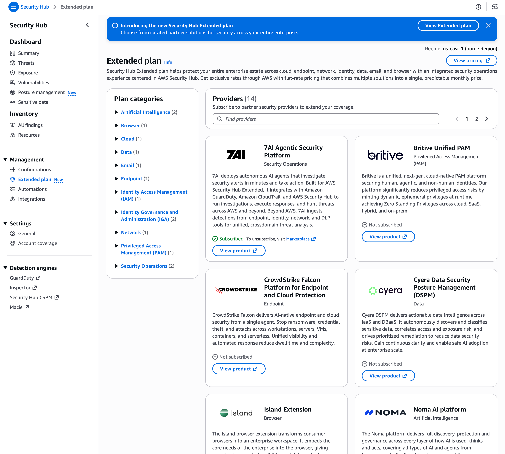


## Operationalize Security Hub Findings

### Investigate Critical Risks

To understand the most critical security risks in your environment, start by reviewing the exposure summary widget on the Security Hub dashboard. Exposure summaries are more effective than reviewing individual findings because they aggregate related findings into a single, contextualized view showing you the broader attack paths and resource relationships that matter most, rather than individual discrete alerts with low-context in isolation. This allows you to prioritize remediation based on actual exploitability and blast radius, not just finding volume. 

This widget shows your exposures by severity and frequency, with findings categorized as Critical, High, Medium, or Low. The widget displays the highest risks with the greatest number of critical findings, allowing you to quickly identify the most pressing security issues. 


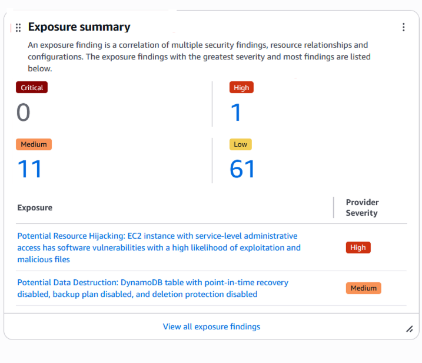

From the exposure summary widget, you can pivot to the exposure dashboard to see a pre-filtered view of your exposures for continued analysis. The exposure console shows findings by their title and ranked by decreasing severity, organized by filter criteria and grouped by finding title. Quick filters on the left-hand side provide a fast way to filter through exposures based on severity, top 10 attributes, top 10 accounts, and top 10 resource types.

To review a specific exposure, expand the finding to see the correlation of resources, status, attributes, and traits such as software vulnerabilities, misconfigurations, and reachability. For a particular exposure finding, a trait can be associated with one or more signals, and a signal can contain one or more indicators. Select anywhere in the line associated with the risk to see an overview panel with detailed information about the finding including the finding type, primary resource, region, account, age, and creation time. Most customers focus on the critical and high severity findings as a priority to respond to. We recommend you use the filter option to focus on these findings. Once you understand what are your critical and high findings you will be able to understand the types of findings you will be responding to. You can then create the necessary runbooks and automation to complete this work. Filter Findings on Severity label and Status keeping in mind filters are case sensitive, then review and remediate accordingly.


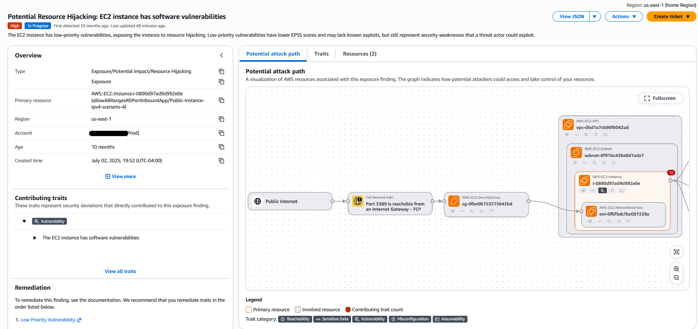

### Understanding Attack Paths

The attack path visualization provides a powerful way to understand how potential threat actors could exploit vulnerabilities to access your resources. The visualization maps out the sequence of steps an attacker could take, showing the relationships between resources and the contributing factors at each stage. When reviewing an attack path, examine the primary resource that represents the initial entry point for the attack, review the involved resources that could be accessed or compromised as part of the attack chain, analyze the contributing traits that make each resource vulnerable such as internet reachability, software vulnerabilities, misconfigurations, or excessive permissions, and consider the potential impact if the attack were successful including what sensitive data or critical resources could be compromised. 

The attack path graph uses color coding to distinguish different resource types and risk levels. Orange boxes typically represent primary or entry point resources, red boxes indicate high-risk or target resources, and gray or neutral colors show intermediate resources. Directional arrows show the attack flow, and severity indicators on nodes help you understand the risk level at each stage. Use the attack path information to prioritize remediation efforts by focusing on breaking the attack chain at its weakest or most critical points. Often, remediating a single misconfiguration or vulnerability can disrupt an entire attack path, significantly reducing your risk exposure.

### Analyzing Traits and Signals

To understand why an exposure is present, select the Traits tab in the finding details. This will list traits such as Misconfiguration, Vulnerability, Reachability, Sensitive Data, or Assumability. If you select By signal in the Traits tab, you have a full list of the signals associated with the exposure finding. These signals are the underlying findings that were created from different services such as Security Hub CSPM and Amazon Inspector that were correlated together to determine the risk associated with the exposure finding.

Understanding the relationship between traits and signals helps you comprehend the full context of a security issue. A single exposure finding might correlate findings from multiple security services, providing a comprehensive view of the risk that wouldn't be apparent when viewing individual findings in isolation. For example, an exposure finding might combine a vulnerability finding from Inspector, a misconfiguration finding from Security Hub CSPM, and a reachability finding from network analysis to show how these factors together create a critical security risk.

### Resource Investigation

When investigating resources associated with exposure findings, select the Resources tab to see all resources involved in the exposure. For example, you might see an EC2 instance along with its associated IAM role, security groups, network interfaces, VPC, subnet, and potentially S3 buckets or other resources that could be accessed through the attack path. This list of resources helps you determine what needs to be remediated in your environment to mitigate the risk attributed to the finding. 

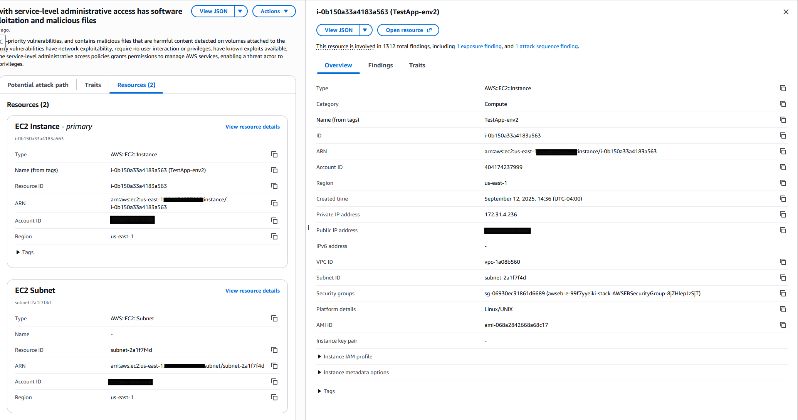

For each resource, you can view detailed configuration information including instance type, AMI ID, launch time, and network configuration. Associated findings show all security issues related to the resource, not just those contributing to the current exposure. Network connectivity information displays public IP addresses, security groups, and network ACLs. Tags provide business context such as application name, environment, and ownership. This comprehensive resource view enables you to understand the full security context of each resource and make informed decisions about remediation priorities.

### AI Inventory

The AI inventory gives you a unified view of AI and machine learning resources across your environment, split into two discovery types. **Managed** resources are the AI services AWS operates, covering a supported subset of Amazon Bedrock, Amazon Bedrock AgentCore, and Amazon SageMaker, discovered from AWS Config configuration items. **Self-hosted** resources are the ones that do not appear in any service console, such as open source models, inference servers, and agents running on your own compute.

The self-hosted side is the reason this capability matters. Security Hub detects these from contributing signals rather than from an API that lists them, correlating Amazon Inspector SBOM findings on EC2 instances and ECR images with Amazon GuardDuty DNS activity. It covers Hugging Face and Ollama models, a broad set of model-serving software including vLLM, TorchServe, Triton, TGI, and llama.cpp, agents, and external AI endpoints your instances call such as OpenAI, Anthropic, Cohere, and Mistral. Detection is confidence-based, anchored to a primary signal and corroborated by additional ones before a resource appears, which keeps false positives down.

For most organizations the immediate value is answering a question security teams have struggled to answer since generative AI adoption accelerated: where is AI actually running in our environment, including the parts nobody told us about. Shadow AI is difficult to find through governance processes because it takes minutes to deploy a model on an instance a team already owns. Detecting it from software inventory and DNS behavior sidesteps the need for anyone to self-report.

Two prerequisites are worth calling out, because the inventory silently under-reports without them. Managed AI discovery needs nothing beyond Security Hub. Self-hosted discovery requires Amazon Inspector for the SBOMs and GuardDuty for the DNS signals. For EC2 specifically, Inspector must be running agent-based scanning with enhanced scanning mode, agentless, or hybrid. Agent-based scanning without enhanced mode does not produce the deep software inventory that AI detection depends on. Self-hosted models are also only detected in default model-cache directories and in custom paths you have configured for Inspector, so if your teams stage models somewhere unusual, add those paths.

Administrator accounts see AI resources across all enabled accounts in the organization. Member accounts see only their own. On the **Resources** page, managed AI resources carry an AI icon and hosts running self-hosted AI carry a count badge, with a quick filter to show only those hosts.

### Automated Response and Remediation

Security Hub helps streamline the incident management process through its native integrations with popular service management systems such as Atlassian's Jira Service Management and ServiceNow. This integration minimizes the need for manual ticket creation and reduces the time between finding and fixing security issues. Organizations can use Security Hub Automation Rules to automatically create and track tickets for security findings directly from the Security Hub console, helping to ensure that no critical security exposure goes unaddressed.

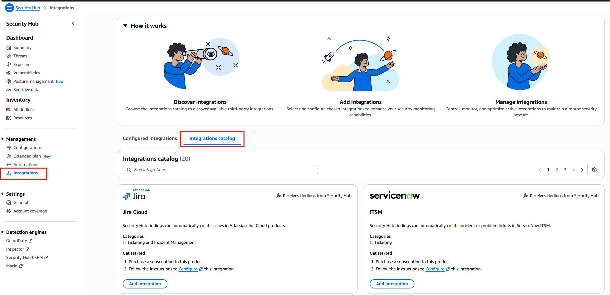

Integration with these widely-used service management systems helps maintain a consistent workflow, enables better tracking of remediation efforts, and improves collaboration between security and operations teams. Create automation rules for common remediation scenarios such as automatically revoking exposed credentials, updating security groups to remove overly permissive rules, or triggering Lambda functions that implement custom remediation logic. Document your automation rules and regularly review their effectiveness to ensure they're providing the intended security benefits. Each Security Hub finding from a Security or Compliance Standard has associated remediation instructions. This can provide valuable insights into how to respond to any given finding. Leverage these available remediation instructions to understand the recommended steps for addressing security issues.

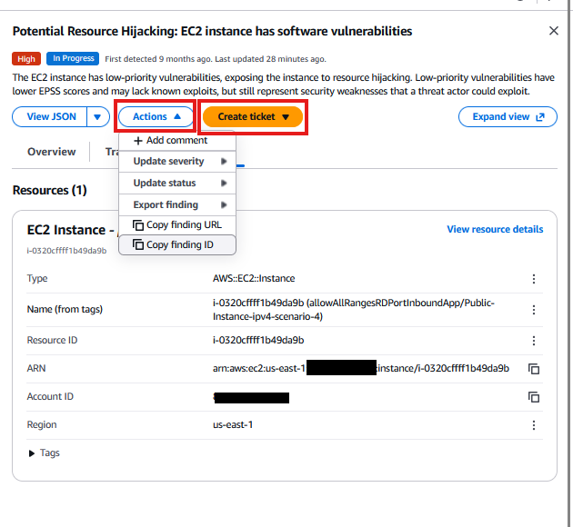

### Monitoring and Trending

Use the Security Hub dashboard to monitor trends in your security posture over time. The Trends Overview provides metrics on threats, exposures, resources, and all findings which allows you to visualize how your security posture is evolving over different time periods including 5 days, 30 days, 90 days, 6 months, and 1 year. These metrics help you understand whether your security posture is improving or deteriorating. The Security Coverage widget shows the percentage of your environment covered by different security capabilities including vulnerability management by Amazon Inspector, threat detection by Amazon GuardDuty, sensitive data discovery by Amazon Macie, and posture management by AWS Security Hub CSPM. Monitor this coverage to ensure you're maintaining comprehensive security visibility across your AWS environment. Regularly review these trends to identify patterns, measure the effectiveness of your security initiatives, and demonstrate security improvements to stakeholders. Trending data can also help you identify emerging risks or areas where additional security focus is needed.


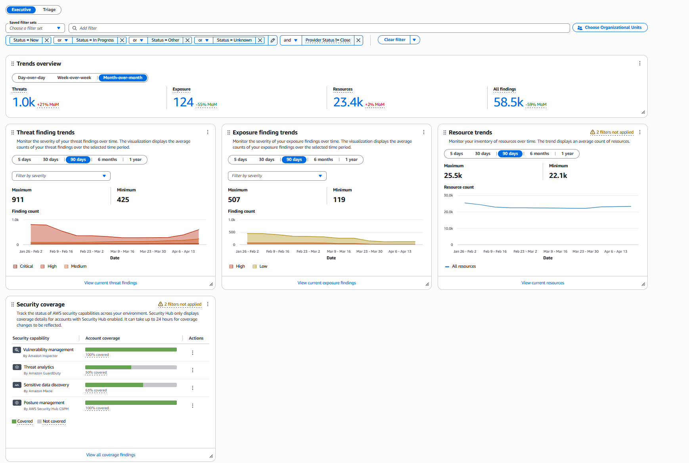

### Automation

Security Hub includes features that automatically modify and act on findings based on your specifications. Security Hub currently supports the following types of automations:

* **Automation rules** – Automatically update and suppress findings, as well as send findings to ticketing tools, in near real time based on defined criteria.
* **Automated response and remediation** – Create custom Amazon EventBridge rules that define automatic actions to take against specific findings and insights.

Automation rules are helpful when you want to automatically update finding fields in the Open Cybersecurity Schema Framework (OCSF) without the need for custom code. For example, you can use an automation rule to update the severity level of findings for resources with a specific tag. Using the automation rule eliminates the need to manually update the severity level of each finding related to the specific tag. You can configure automation rules to create tickets in tools like Jira Cloud and ServiceNow when findings match specific attributes. This allows findings to be created into tickets as soon as they are sent to Security Hub or created by Security Hub.

EventBridge rules are helpful when you want to take actions outside of Security Hub with regards to specific findings or send specific findings to third-party tools for remediation or additional investigation. The rules can be used to trigger supported actions, such as invoking an AWS Lambda function or notifying an Amazon Simple Notification Service (Amazon SNS) topic about a specific finding. For more information on setting up event bridge rules for automation see [Automation rules in EventBridge](https://docs.aws.amazon.com/securityhub/latest/userguide/securityhub-v2-eventbridge-automations.html)

Automation rules take effect before EventBridge rules are applied. That is, automation rules are triggered and update a finding before EventBridge receives the finding. EventBridge rules then apply to the updated finding.

When creating automation rules, consider the rule order as lower rule numbers execute first. You can create up to 100 automation rules per administrator account. Rules evaluate new and updated findings but not historical findings. Only the Security Hub admin account can create or edit automation rules, ensuring centralized control over automated response workflows.


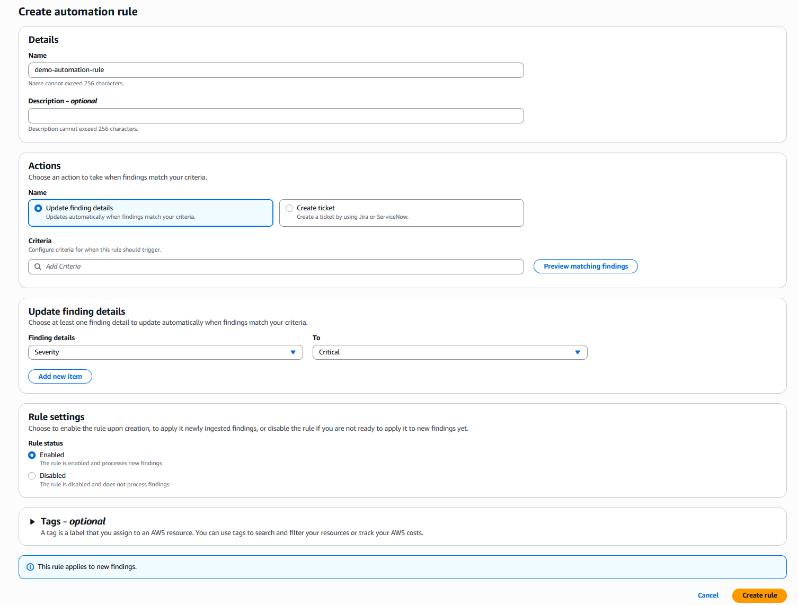


### 3rd party Integrations

Integration with 3rd party supported partners is available within Security Hub. One example of using integration to automate responses is forwarding findings to a ticketing system or SIEM such as Splunk. Security Hub supports the Open Cybersecurity Schema Framework OCSF, enabling interoperability with multiple security tools and services. Partners who support the OCSF schema include Cribl, CrowdStrike, Datadog, SentinelOne, Splunk and many others. Service partners such as Accenture, Deloitte, and Optiv can help you adopt Security Hub and implement security best practices tailored to your organization's needs.

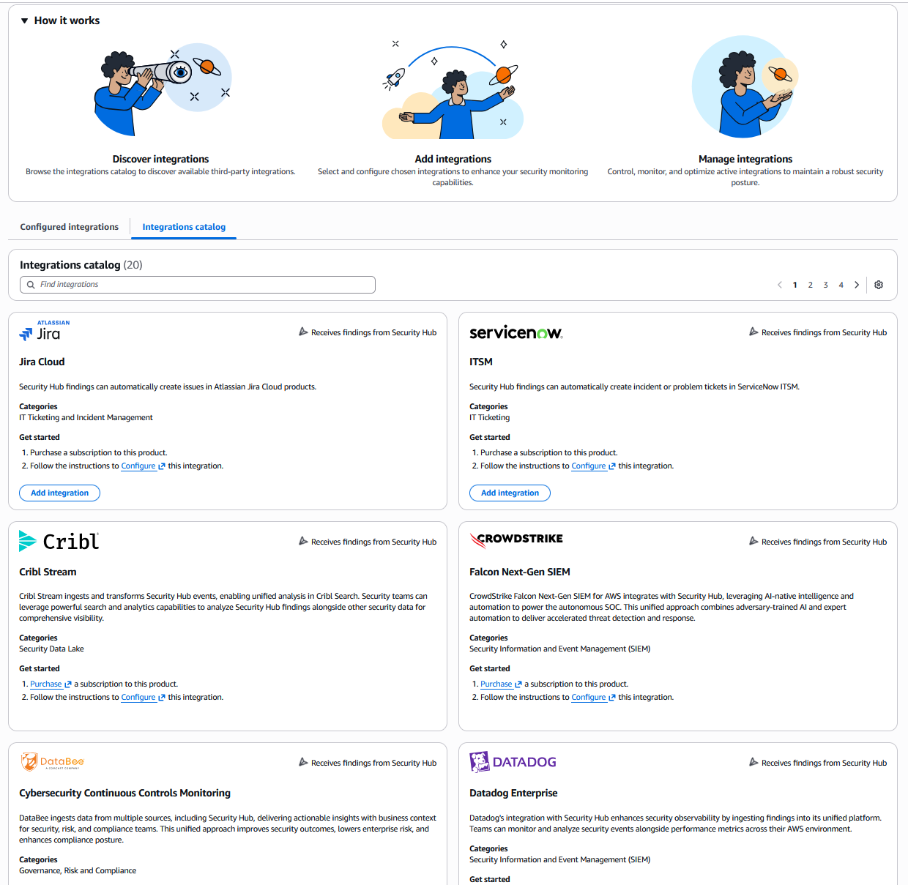

### Multi-Cloud Coverage

Security Hub is no longer AWS-only. You can connect a Microsoft Azure environment through a Security Hub connector and get posture management, vulnerability management, exposure correlation, and asset inventory for Azure resources without enabling any Azure security services. Posture management runs automated checks against CIS Microsoft Azure Foundations Benchmark v4.0 and Azure Foundational Best Practices, covering identity, networking, storage, logging, and database controls. Amazon Inspector scans Azure VMs, Function Apps, and Azure Container Registry images through the service-linked connector. If you configure Azure Defender continuous export to an Event Hub, Security Hub also ingests Microsoft Defender for Cloud threat alerts and normalizes them to OCSF so they sit alongside everything else.

For organizations running workloads in both clouds, this changes the calculus on whether you need a separate third-party CSPM to get a single view. Two details make the difference in practice. Azure findings arrive in OCSF like AWS findings, so your existing automation rules, EventBridge patterns, and SIEM pipelines generally work without modification. And AWS Config usage for Azure posture management is handled internally and included in Security Hub pricing, so unlike AWS posture management you do not enable a recorder or pay for Config separately on the Azure side.

Setting up the connector requires work on the Azure side first, including an application registration, federated identity credentials, role assignments, and Event Hub infrastructure, so plan for a joint effort with whoever owns your Azure tenant. Security Hub also creates matching service-linked integrations in Security Hub CSPM and Amazon Inspector automatically as part of connector creation. For the full procedure, see [Integrating Security Hub with Microsoft Azure](https://docs.aws.amazon.com/securityhub/latest/userguide/securityhub-v2-azure.html).

## Cost Considerations

This section is the reference for Security Hub pricing across this set of guides. The GuardDuty, Inspector, Macie, and Security Hub CSPM guides each cover the cost levers specific to that service, and they point back here for how those levers change once Security Hub is enabled.

### Understanding the Pricing Model

Security Hub replaces separate bills for GuardDuty, Inspector, and Security Hub CSPM with a single consolidated model built from three pricing plans.

**Essentials plan.** Priced per resource, covering your EC2 instances, ECR container images, Lambda functions, IAM users, and IAM roles. The plan includes risk and exposure analytics, vulnerability management powered by Amazon Inspector, security posture management powered by Security Hub CSPM, and security response. You do not separately enable or pay for Amazon Inspector or Security Hub CSPM in accounts covered by the essentials plan, and you are not double-charged for the underlying service usage.

**Threat analytics plan.** Priced per event and per GB of logs analyzed, covering threat detection powered by Amazon GuardDuty across CloudTrail management and data events, network activity, and other log sources.

**Lambda code scanning.** An optional per-resource add-on powered by Amazon Inspector that analyzes Lambda function application code for vulnerabilities.

Two things sit outside this model. The [Security Hub Extended](#security-hub-extended) plan for partner solutions is billed separately through AWS Marketplace. Amazon Macie is also billed separately and is not included in the essentials plan, so sensitive data discovery costs continue to follow [Macie pricing](https://aws.amazon.com/macie/pricing/) even after you enable Security Hub.

When you count resources for an estimate, remember that IAM users and roles are billable resources under the essentials plan. If your organization provisions a role per workload or per pipeline, IAM can be your largest resource category, and it is the one teams most often leave out of a first estimate.

Security Hub provides a 30-day free trial covering essentials plan capabilities. Every AWS account in each Region receives the trial, even if the account previously used a Security Hub CSPM or Amazon Inspector free trial. The threat analytics plan, Lambda code scanning, and the Extended plan are not included in the Security Hub free trial, though the individual service free trials still apply if you have not used them.

### Comparing Individual Service and Security Hub Pricing

Before you migrate an organization onto Security Hub pricing, model the change. The Security Hub console includes a **Cost Estimator** that shows your current individual service costs across Security Hub CSPM, Amazon Inspector, and Amazon GuardDuty side by side with what those same capabilities would cost under Security Hub simplified pricing, including a pricing comparison table. You can adjust the usage and resource counts to model different scenarios and export the result as a PDF for stakeholder review.

A few practical notes on using it:

* The estimator pulls from AWS Cost Explorer on a 30-day lookback where that data is available, and lets you enter usage manually where it is not. Cost Explorer must be enabled, and there is a 24-hour processing delay after you enable it.
* Management and standalone accounts open in view mode with data auto-populated. Delegated administrator and member accounts open in edit mode and need a cross-account IAM role configured in the management account to auto-populate.
* Your principal needs `ce:GetCostAndUsage`, `pricing:GetProducts`, `organizations:ListAccounts`, `organizations:DescribeOrganization`, and `securityhub:ListOrganizationAdminAccounts`, plus `iam:GetRole` for management accounts or `sts:AssumeRole` for delegated administrator and member accounts.
* All estimates use us-east-1 rates. Figures you modify by hand do not reflect enterprise discounts, so only the values drawn directly from Cost Explorer reflect your negotiated pricing.

Changes you make in the estimator do not affect your live Security Hub or service configuration, so it is safe to model aggressively.

### Monitoring Usage After Enablement

Once Security Hub is enabled, use the **Usage** page under **Settings** in the console rather than reconstructing costs from the billing console. The **Capability view** organizes usage into the three plan groups, and each usage type maps directly to a corresponding usage type in AWS Cost Explorer so you can reconcile the two. For each usage type you see current usage and cost for the billing cycle to date, how much of that usage is free trial usage, what the free trial usage would have cost, and a projected monthly cost extrapolated from the last seven days.

What you see depends on the account you are in. Delegated administrator and management accounts get an organization cost summary, usage by capability, usage by account, and the cost optimization strategies page. Member and standalone accounts see only their own account. One detail worth knowing before you go looking: if an account belongs to an organization that has no Security Hub delegated administrator designated, usage data is not available at all. Designating a delegated administrator is what turns usage reporting on.

The console also includes a dedicated **Cost optimization strategies** page that presents each strategy as an independent option, ordered so that options with no security tradeoff appear first. Start there for the current list, then apply the judgment below. Expect any change you make to take 24 to 48 hours to appear in billing.

### Cost Optimization Strategies

The strategies below hold up across most environments. Removing unused resources and eliminating duplicate finding aggregation carry no security tradeoff, so start with those two. The rest trade some coverage or visibility for cost, so decide them per account type rather than applying them organization wide.

* **Remove Unused Resources** - The essentials plan is priced per resource, so reducing your resource count reduces cost directly. Use [AWS Trusted Advisor](https://docs.aws.amazon.com/awssupport/latest/user/cost-optimization-checks.html) to find underutilized EC2 instances and Amazon ECR [lifecycle policies](https://docs.aws.amazon.com/AmazonECR/latest/userguide/LifecyclePolicies.html) to expire container images you no longer pull.

    Extend the same review to IAM, which teams routinely skip. Because IAM users and roles are billable resources under the essentials plan, retiring stale principals lowers cost and shrinks your identity attack surface at the same time. Security Hub gives you the worklist for free. When you enable Security Hub it creates a service-linked IAM Access Analyzer that evaluates every IAM principal against CloudTrail activity over a 90-day lookback and produces [unused access findings](https://docs.aws.amazon.com/securityhub/latest/userguide/unused-access-findings.html) in four types: `UnusedIAMRole`, `UnusedIAMUserAccessKey`, `UnusedIAMUserPassword`, and `UnusedPermission`. The analyzer and its findings carry no additional charge. For `UnusedPermission` findings, Security Hub can also generate a scoped-down least-privilege replacement policy, so you get the remediation and not just the finding.

    This is the rare optimization where the cost case and the security case point the same direction, which makes it the easiest one to get funded. It also compounds: unused access shows up as contextual traits on exposure findings for EC2 instances, Lambda functions, ECS services, EKS clusters, and IAM users, so cleaning up over-privileged roles lowers the calculated blast radius on findings you have not remediated yet.

* **Optimize Lambda Function Scanning** - Lambda functions vulnerability scanning is included in the Security Essentials plan, customers can optionally enable lambda code scanning to identify enhanced vulnerabilities such as data leaks and injection flaws. To optimize costs, carefully evaluate whether lambda code scanning is necessary for all functions or only for lambda functions in production environments with complex business logic processing sensitive data or exposed to external inputs.

* **Choose Container Scan Mode on Risk, Not Cost** - Amazon Inspector offers two ECR scanning modes. Continuous scanning rescans images as new vulnerabilities are published. On-push scanning evaluates an image only when it is pushed to the registry. Which mode you choose is a cost decision only when you are paying for Inspector directly. In accounts covered by the Security Hub essentials plan, ECR container images are billed per resource and scanning is included, so switching to on-push does not reduce your Security Hub bill. Choose the mode that matches the risk instead. In accounts running Amazon Inspector standalone, ECR is priced per image on push and per rescan of retained images, which makes both scan mode and [re-scan duration](https://docs.aws.amazon.com/inspector/latest/user/scanning_resources_configure_duration_setting_ecr.html) genuine cost levers. See the [Amazon Inspector guide](../inspector/index.md#ecr-scanning) for that side of the decision.

    Use continuous scanning for images backing internet-facing applications, images that process sensitive data, and images with frequently updated dependencies. On-push scanning is a reasonable fit for base images that rarely change and for development or test images with controlled deployment paths, provided you accept that a CVE published after the last push will not surface until the next one.

To change the scan mode for your container images, navigate to the ECR console, select “Features & Settings", then select "configure" under scanning. Use the appropriate filter based on the repository name to update the scan on push and continuous scanning configuration for example to configure continuous scanning for all repositories with prod in the name use the filter *prod*.

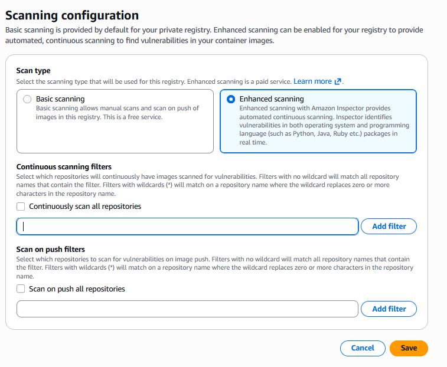

To update the re-scan configuration for ECR, Navigate to the Amazon inspector console, under “settings“ select ”scan settings“

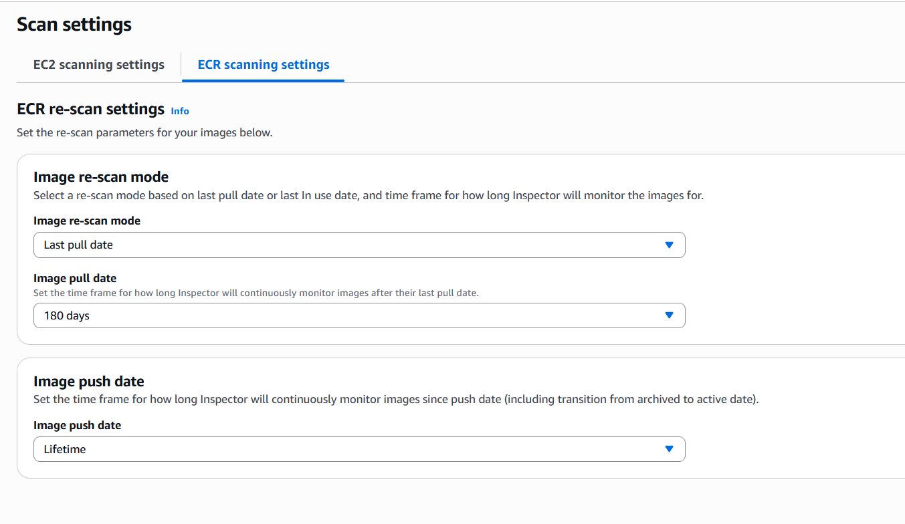

 For more information on updating the scanning mode see the [Amazon Inspector](https://docs.aws.amazon.com/inspector/latest/user/scanning-ecr.html) and the [Amazon ECR](https://docs.aws.amazon.com/AmazonECR/latest/userguide/image-scanning-enhanced-enabling.html) documentation.

* **Eliminate Redundant Finding Aggregation in Security Hub CSPM** - Customers previously using Security Hub CSPM may have configured finding aggregation at the CSPM level to consolidate security findings across AWS services and security tools. Since Security Hub now handles finding aggregation centrally, customers no longer need to maintain separate aggregation configurations at the CSPM level. This eliminates redundant processing and associated costs. It is important to understand the current Security Hub CSPM downstream integrations such as SIEM tools, ticketing platforms, security orchestration tools, compliance dashboards and impact of disabling these integration. Consider disabling the ingestion of AWS Security Service findings such as Amazon Guardduty (Threat Analytics), Amazon Inspector and Amazon Macie since the findings from these services are automatically ingested into Security Hub. Refer to the checklist below for before disabling integrations:
     
    * **Audit Existing Integrations:** Document all systems currently consuming findings from CSPM aggregation
    * **Identify Dependencies:** Determine which integrations rely specifically on CSPM aggregation vs. Security Hub's central aggregation
    * **Plan Migration Path:** For affected integrations, reconfigure them to consume findings from Security Hub's central aggregation instead
    * **Test Updated Integration:** Validate that all downstream systems continue receiving findings after the change
    * **Communicate changes:** Notify security operations and integration owners about the architectural changes

* **Match Coverage to Account Purpose** - Use configuration policies to apply different capability levels to different account types, enabling full capabilities for production accounts while limiting development and sandbox accounts to essential capabilities. Accounts where you do not enable Security Hub continue to be billed under individual service pricing for GuardDuty, Inspector, and Security Hub CSPM, which means a mixed estate is a supported end state rather than a migration you have to finish all at once. Use the 30-day free trial to evaluate real costs before you commit organization wide.

* **Plan for Finding Retention Before You Need It** - Security Hub CSPM retains archived findings for 30 days. This reduces finding noise, and it also means Security Hub is not your compliance retention layer. If you need findings beyond that window for audit or investigation, export them to Amazon S3 using a custom action with an [Amazon EventBridge rule](https://docs.aws.amazon.com/securityhub/latest/userguide/securityhub-cloudwatch-events.html) and budget for that storage. Teams that discover this after an audit request end up reconstructing history they no longer have.

## Resources

* [AWS Security Hub User Guide](https://docs.aws.amazon.com/securityhub/latest/userguide/what-is-securityhub-v2.html)
* [AWS Security Hub API Reference](https://docs.aws.amazon.com/securityhub/1.0/APIReference/API_Operations.html)
* [Streamline security response at scale with AWS Security Hub automation](https://aws.amazon.com/blogs/security/streamline-security-response-at-scale-with-aws-security-hub-automation/)
* [AWS Security Hub Extended](https://aws.amazon.com/blogs/security/aws-security-hub-extended-why-enterprise-security-products-should-sell-themselves/)
* [AWS Security Hub pricing](https://aws.amazon.com/security-hub/pricing/)
* [AWS Security Hub Cost Estimator](https://docs.aws.amazon.com/securityhub/latest/userguide/security-hub-cost-estimator.html) (console feature)
* [Monitoring usage and costs in Security Hub](https://docs.aws.amazon.com/securityhub/latest/userguide/security-hub-usage-page.html)
* [Security Hub cost estimation sample tool](https://github.com/aws-samples/sample-AWS-Security-Hub-Cost-Estimation-Tool) (for estimating before enablement)
