# Security Lake

## Introduction

Welcome to the Amazon Security Lake Best Practices Guide. The purpose of this guide is to provide prescriptive guidance for leveraging Amazon Security Lake to centralize your security data in a purpose-built data lake that's stored in your AWS account. Publishing this guidance via GitHub will allow for quick iterations to enable timely recommendations that include service enhancements and the feedback of the user community. This guide is designed to provide value whether you are deploying Security Lake for the first time, or looking for ways to optimize Security Lake in an existing multi-account deployment. 

## What is Amazon Security Lake?

Amazon Security Lake is a fully managed security data lake service. You can use Security Lake to automatically centralize security data from AWS environments, SaaS providers, on premises, cloud sources, and third-party sources into a purpose-built data lake that's stored in your AWS account. It is backed by Amazon Simple Storage Service (Amazon S3) buckets, meaning you retain ownership of the data you collect. Security Lake simplifies collecting security data and gathering insights from it. This supports a wide range of use cases with the ultimate goal of improving the protection of your workloads, applications, and data.

## What are the benefits of enabling Security Lake?

Security Lake automates the collection of security-related log and event data from integrated AWS services and third-party services. It also helps you manage the lifecycle of data with customizable retention and replication settings. Security Lake converts ingested data into Apache Parquet format and a standard open-source schema called the [Open Cybersecurity Schema Framework (OCSF)](https://github.com/ocsf). With OCSF support, Security Lake normalizes and combines security data from AWS and a broad range of enterprise security data sources.

Other AWS services and third-party services can subscribe to the data that's stored in Security Lake for incident response and security data analytics.

## How to use this guide

This guide is geared towards security practitioners who are responsible for collecting and normalizing security logs across AWS and hybrid environments. The best practices are presented in the order they should be considered for a Security Lake deployment for easier consumption. However, the topics can be consumed in any order necessary. 

* [Pre-requisites for deploying Security Lake](#pre-requisites-for-deploying-Security-Lake)
    * [Permissions and roles](#permissions-and-roles)
    * [Delegated administration](#delegated-administration)
    * [CloudTrail management events](#cloudTrail-management-events)
* [Plan your deployment](#plan-your-deployment)
    * [What regions to collect security data from](#what-regions-to-collect-security-data-from)
    * [Native data sources](#native-data-sources)
    * [Security Lake partners](#security-Lake-partners)
    * [Custom data sources](#custom-data-sources)
* [Implementing Security Lake](#implementing-Security-Lake)
* [Fine tuning your Security Lake implementation](#fine-tuning-your-Security-Lake-implementation)
    * [Changes by log source](#changes-by-log-source)
    * [Changes by region](#changes-by-region)
    * [Changes by account and region](#changes-by-account-and-region)
    * [Adding regions and accounts](#adding-regions-and-accounts)
    * [Changing S3 lifecycle directly](#changing-S3-lifecycle-directly)
* [Configure collection of third-party data](#configure-collection-of-third-party-data)
    * [Partner sources](#partner-sources)
    * [Using Security Hub to route findings to Security Lake](#using-Security-Hub-to-route-findings-to-Security-Lake)
    * [Custom sources](#custom-sources)
* [Operationalizing Security Lake](#operationalizing-Security-Lake)
    * [AWS native analytics](#aws-native-analytics)
    * [Subscriber partners](#subscriber-partners)
    * [OCSF schema updates](#ocsf-schema-updates)
* [Cost considerations](#cost-considerations)
    * [Cost breakdown and visibility](#cost-breakdown-and-visibility)
    * [Built in cost savings](#built-in-cost-savings)
    * [Confirm you are not collecting duplicate native logs](#confirm-you-are-not-collecting-duplicate-native-logs)
    * [CloudTrail management event cost savings](#cloudTrail-management-event-cost-savings)
    * [Rollup regions](#rollup-regions)
    * [Moving logs to glacier](#moving-logs-to-glacier)
* [Additional resources](#additional-resources)

## Pre-requisites for deploying Security Lake

In order to deploy Security Lake, you will need to address the following pre-requisites ahead of time. 

### Permissions and roles
Before getting started with Amazon Security Lake you need to ensure you have permissions to administer the service. You can use the AWS Managed Policy called “[AmazonSecuriyLakeAdministrator](https://docs.aws.amazon.com/security-lake/latest/userguide/security-iam-awsmanpol.html#security-iam-awsmanpol-AmazonSecurityLakeAdministrator)”, but always keep least privilege in mind. If you plan to enable or configure Security Lake programmatically, or plan to use the API or CLI to access it, you must create the IAM roles noted [here](https://docs.aws.amazon.com/security-lake/latest/userguide/getting-started.html#get-started-programmatic) . If you use the console to enable and configure Security Lake, these roles will be managed for you. While not necessary, we generally recommend customers deploy Security Lake using the console for this reason. 

### Delegated administration
You will need to use your AWS Organization Management Account to designate a Security Lake delegated administrator account. You should think through which account in your AWS Organization is best suited to use as the Security Lake delegated administrator. The [AWS Security Reference Architecture](https://docs.aws.amazon.com/prescriptive-guidance/latest/security-reference-architecture/welcome.html) recommends using the [Log Archive account](https://docs.aws.amazon.com/prescriptive-guidance/latest/security-reference-architecture/log-archive.html) as the delegated administration for Security Lake. More details on recommended account structure for your organization can be found [here](https://docs.aws.amazon.com/prescriptive-guidance/latest/security-reference-architecture/organizations.html). 

### CloudTrail management events
To collect CloudTrail Management events with Security Lake you will need to have at least one CloudTrail multi-region organization trail that collects read and write CloudTrail managements events enabled. If you’re using Control Tower this is likely part of your Control Tower configuration. For information about creating and managing a trail through CloudTrail, see [Creating a trail for an organization](https://docs.aws.amazon.com/awscloudtrail/latest/userguide/creating-trail-organization.html) in the *AWS CloudTrail User Guide*. For information about creating and managing a trail through AWS Control Tower, see [Logging AWS Control Tower actions with AWS CloudTrail](https://docs.aws.amazon.com/controltower/latest/userguide/logging-using-cloudtrail.html) in the *AWS Control Tower User Guide*.

## Plan your deployment

Security Lake offers a 15-day free trial. We recommend making the most out of this free trial by making the following decisions ahead of enabling Security Lake. 

### What regions to collect security data from
Security Lake is a regional service with global visibility. This gives you the ability to access the Security Lake console in one region and configure log collection across all of your desired regions. We recommend enabling Security Lake in all regions, even those you are not actively using. Security Lake is a pay as you go service. So, since it will collect next to no data in unused regions, it remains cost effective to enable Security Lake in all regions. Then, in the event activity occurs in an unexpected region, you will have captured the related logs and can use them for investigation. Alternatively, customers can choose to entirely block unused regions using an SCP such as [this](https://docs.aws.amazon.com/organizations/latest/userguide/orgs_manage_policies_scps_examples_general.html#example-scp-deny-region). 

### Rollup regions
You can optionally aggregate your data using “rollup regions”. A rollup region is a region you choose to receive a copy of security data from “contributing regions” that you specify. To elaborate on this point it is important to remember that although S3 bucket names are globally unique the data stored in S3 is specific to a region. When configuring Security Lake a separate bucket is created for each region you are collecting logs in. Using rollup regions, you can have contributing regions “rollup” their data to your rollup region bucket allowing all of your logs to be stored in the region you specify. This can provide needed flexibility for data residency requirements. Note that data from the rollup region is replicated, not moved. If you’d like to minimize duplicative data you can use a storage class transition for the contributing region to set an expiration period for the data. We recommend setting the expiration period to a comfortable length based on your own risk profile and control environment. For example, some customers find an expiration period of 3 days is the appropriate balance between cost and the risk of lost logs since it’s long enough to cover an issue that occurs over the weekend. Other customers prefer an expiration period of 7 days to have a longer time to identify any issues.  

### Native data sources
Before deploying Security Lake, consider what native data sources you would like to collect. Security Lake supports the managed collection of the following native AWS logs: 

* Default logs
    * AWS CloudTrail management events
    * Amazon Elastic Kubernetes Service (Amazon EKS) Audit Logs
    * Amazon Route 53 resolver query logs
    * AWS Security Hub findings (includes findings Security Hub consumes)
    * Amazon Virtual Private Cloud (Amazon VPC) Flow Logs
* Opt-in logs
    * AWS CloudTrail data events (S3, Lambda)
    * Amazon Web Application Firewall logs

During deployment, you will be able to choose which logs to collect. Default logs will already be selected, but you can choose to not collect any of them. AWS CloudTrail data events and WAF logs aren’t collected by default due to their high volume and associated cost in collecting them. If you would like to collect these logs, you will need to opt-in to collecting them during deployment or via a configuration change after deployment. 

We recommend turning on all of the default AWS log sources. Security Lake will collect these logs on your behalf without you needing to make any additional configuration at the service or resource level (except for CloudTrail management events as noted in the pre-requisites section above). Security Lake will then transform this data into [Open Cybersecurity Schema Framework (OCSF)](https://github.com/ocsf) format, and put these logs in an S3 bucket in your environment in Apache Parquet files. Opt-in log sources are generally very high volume, resulting in higher costs to collect and store these logs. Many customers see value in collecting these logs but we recommend fully understanding the security benefit they provide versus the cost to collect them before deciding to collect these log sources.

### Security Lake partners
A major benefit of Security Lake is the pre-built partner integrations designed to send data to Security Lake or consume data from it. There are three types of Security Lake partners: source partners, subscriber partners, and service partners. [Source partners](https://aws.amazon.com/security-lake/partners/#Source_Partners) are third-parties that can send security logs and findings to Security Lake in the OCSF format. [Subscriber partners](https://aws.amazon.com/security-lake/partners/#Subscriber_Partners) are third-parties that receive data from Security Lake. They are often tools that help with security use cases such as threat detection, investigation, and incident response. [Service partners](https://aws.amazon.com/security-lake/partners/#Service_Partners) are third-parties that help you build or utilize Security Lake. 

To make the most of the Security Lake 15-day free trial, you can test integrations in a sandbox account to make sure you can quickly deploy partner integrations when testing Security Lake with production data. Each partner has specific integration details which can be found [here](https://docs.aws.amazon.com/security-lake/latest/userguide/integrations-third-party.html). 

### Custom data sources
Security Lake also supports aggregation of custom data sources. If you are using a tool that is currently not a Security Lake partner, creating a custom source will allow you to still send logs or findings to Security Lake. Some customers choose to deploy Security Lake in phases, starting with native AWS logs, then adding partner sources and subscribers, and then adding custom sources. Refer to the [Security Lake documentation](https://docs.aws.amazon.com/security-lake/latest/userguide/custom-sources.html), or this [blog](https://aws.amazon.com/blogs/security/patterns-for-consuming-custom-log-sources-in-amazon-security-lake/), for details on how to set up custom sources.

## Implementing Security Lake

You should now be ready to deploy Security Lake across your AWS Organization. During deployment you will select which accounts and regions where you would like to enable Security Lake, and specify the data sources you would like to collect. You can also optionally configure rollup regions and lifecycle policies at this time. We will walk through enabling Security Lake using the AWS console. For information on how to configure Security Lake using the CLI or API refer to the [Security Lake documentation](https://docs.aws.amazon.com/security-lake/latest/userguide/getting-started.html#get-started-console). 

1. From your Organization Management account, open the Security Lake console at: https://console.aws.amazon.com/securitylake 
2. Click “Get started”
    
3. Enter the 12 digit account ID of the account you’d like to use as the delegated administrator for Security Lake, then click “Delegate” 
    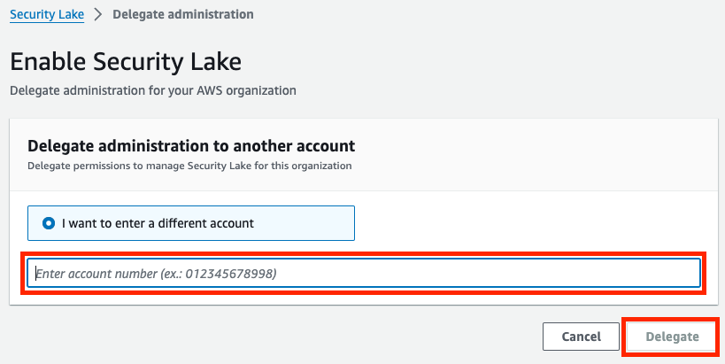
4. Switch to the delegated admin account and open the Security Lake console at: https://console.aws.amazon.com/securitylake. You will see the same landing page you saw when in the Organization Management account. Click “Get started” again, which will now take you to the Security Lake enablement page.
5. First, you will select what native log sources to ingest with Security Lake. You can either collect the default sources, or choose to specify what sources using the radio buttons at the top of this window. If you choose to specify log sources, you will then have to check which logs you’d like to ingest.
    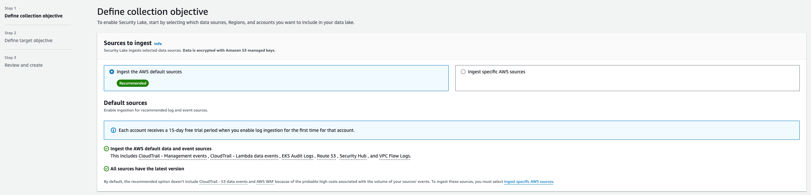
    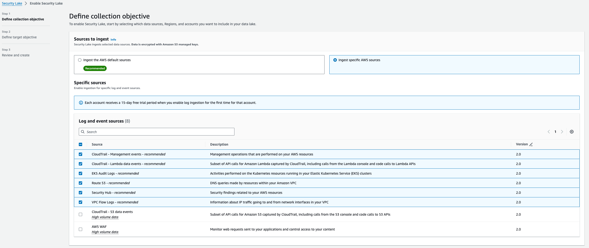
6. Next, you will select what regions to ingest the previously selected log sources from. Again, you will have the option to collect from the default regions (all supported regions), or specify regions manually.
    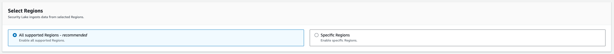
    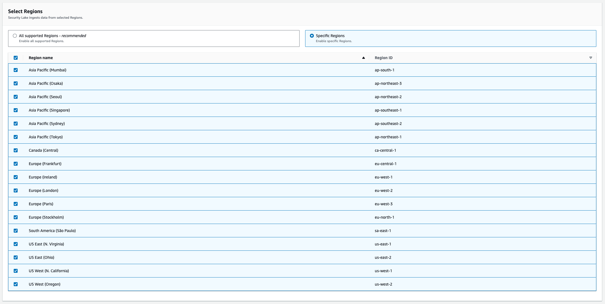
7. Next, you will select the accounts to ingest data from. You can select to collect from all accounts in your organization, specific accounts (listed in CSV format), or just the current account. The check box at the bottom of this window applies your Security Lake collection settings to any new accounts added to your organization. This allows for managed log collection even as your organization grows. We recommend leaving this feature enabled to reduce manual effort when new accounts are added to your organization. Uncheck this box if you do not wish to have his behavior. If you’ve already deployed Security Lake, and would like to confirm this setting is enabled, you can use this [API call to check](https://docs.aws.amazon.com/security-lake/latest/APIReference/API_GetDataLakeOrganizationConfiguration.html), and this [API call to enable the setting](https://docs.aws.amazon.com/security-lake/latest/APIReference/API_CreateDataLakeOrganizationConfiguration.html). 
    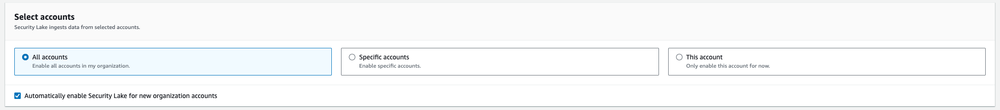
8. Please note that during initial setup, Security Lake can only be configured to collect all selected log sources from all selected accounts and regions. In other words, the logs you select will be applied to all accounts and regions where you are enabling Security Lake. If you have more specific requirements, like collecting different log sources in different regions or excluding a log source for a certain account you can configure this after initial deployment via the Security Lake console. 
9. Optionally configure service access and tags. For more details on service access, refer to the [Security Lake documentation](https://docs.aws.amazon.com/security-lake/latest/userguide/getting-started.html#prerequisites). 
   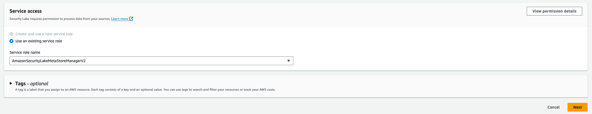
10. Click “Next” to be taken to the next page of options. Here, you can optionally configure rollup regions and storage class transitions. 
    
11. If you choose to configure rollup regions, click “Add rollup Region” and specify the rollup region and the contributing region. Repeat this for each region you’d like to have contributing to the rollup region. Note that a region cannot be a contributing region and a rollup region. Also, more than one rollup region can be created like in the example below. 
    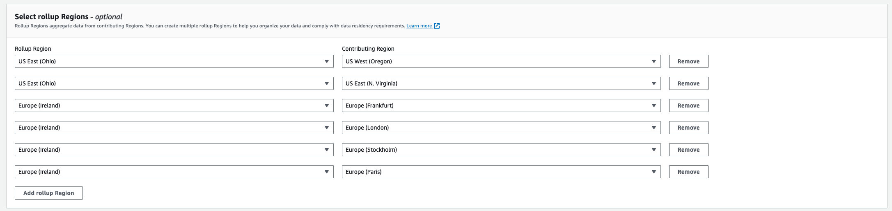
12. If you’d like to add a storage transition that will apply across your entire Security Lake deployment, you can do so now by clicking “Add transition”, specifying the desired storage class, and entering the number of days. You can create more granular storage transitions for each region after initial deployment via the Security Lake console. 
    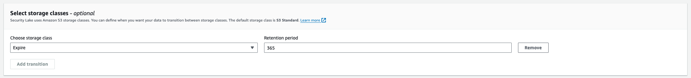
13. If you configured a rollup region, you will also be prompted to create a new service roll for replication, or choose to use an existing one. For details on using an existing role, see the [Security Lake documentation](https://docs.aws.amazon.com/security-lake/latest/userguide/manage-regions.html#add-rollup-region). 
    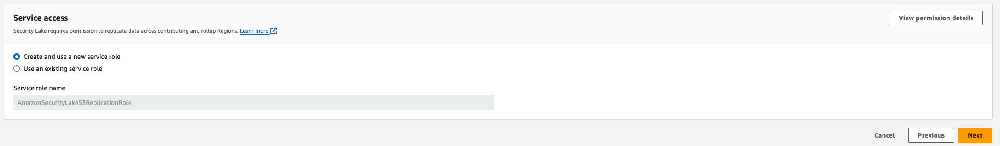
14. Click next to be taken to review your deployment of Security Lake. These settings can be changed later, but we recommend taking time to confirm your configuration options now. When you are ready, click “Create” to deploy Security Lake. 
15. After a few minutes, you should see confirmation that security lake has been successfully deployed in all of the selected regions. Security Lake will immediately begin collecting data. 

## Fine tuning your Security Lake implementation

After the initial deployment of Security Lake, you are able to further refine what logs you are collecting in which accounts and regions via the Security Lake console. You can also add coverage for new accounts and regions you excluded during initial set up. 

### Changes by log source
Changing your Security Lake configuration by log source allows you to pick a log source and specify exactly what regions it is collected in. This is the best way to change the collection of one log source for many regions. This is done via the Security Lake console, on the “Sources” page. 

On this page, select a log source, and click “Configure” in the top right. You will then be able to choose whether you’d like to enable or disable that log source in the regions you specify. These changes will affect all accounts Security Lake is configured to collect logs from for the specified regions. 

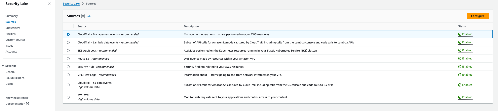
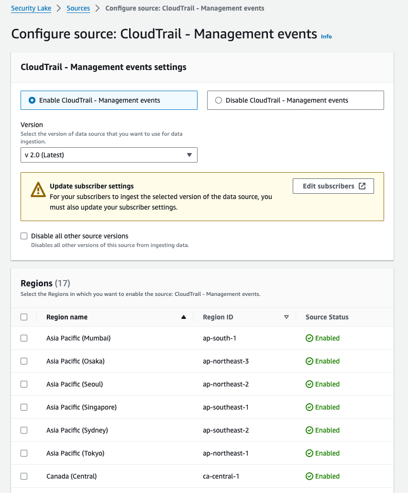

### Changes by region
Changing your Security Lake configuration by region allows you to pick a region and specify what log sources you’d like collected in that region. This is the best way to change a specific region’s collection settings. You can also modify the storage transitions for the underlying S3 bucket using this method. This is done via the Security Lake console, on the “Regions” page. 

On this page, select a region, and click “Edit” in the upper right of the page. Next, click the check box next to the statement beginning with “Override sources for all accounts in...”. Then, you can configure the collected log sources for all accounts in the selected region. You are also able to configure S3 storage transitions and add tags from this same page. 

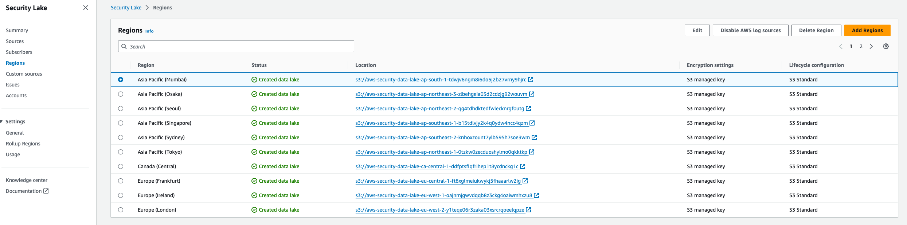
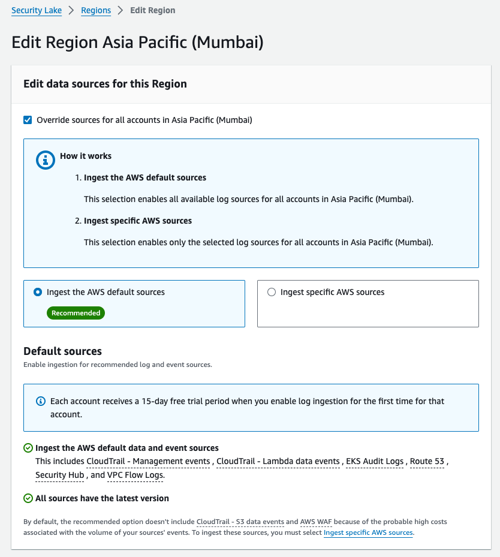
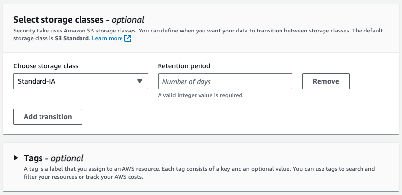

### Changes by account and region
Changing your Security Lake configuration by account/region pairings allows for the most granular changes to what log sources are collected from where. This is done via the Security Lake console on the “Accounts” page. 

On this page, select an account and region pairing and click “Edit” in the upper right corner. You are then able to change log source collection for that specific account in that specific region. 

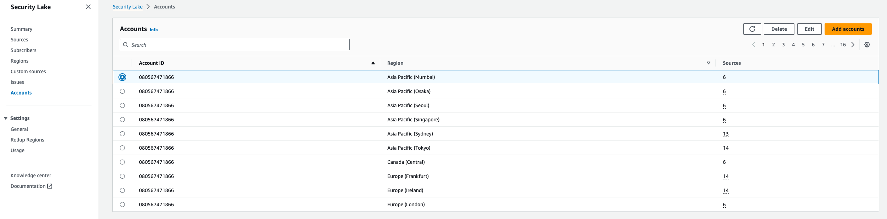
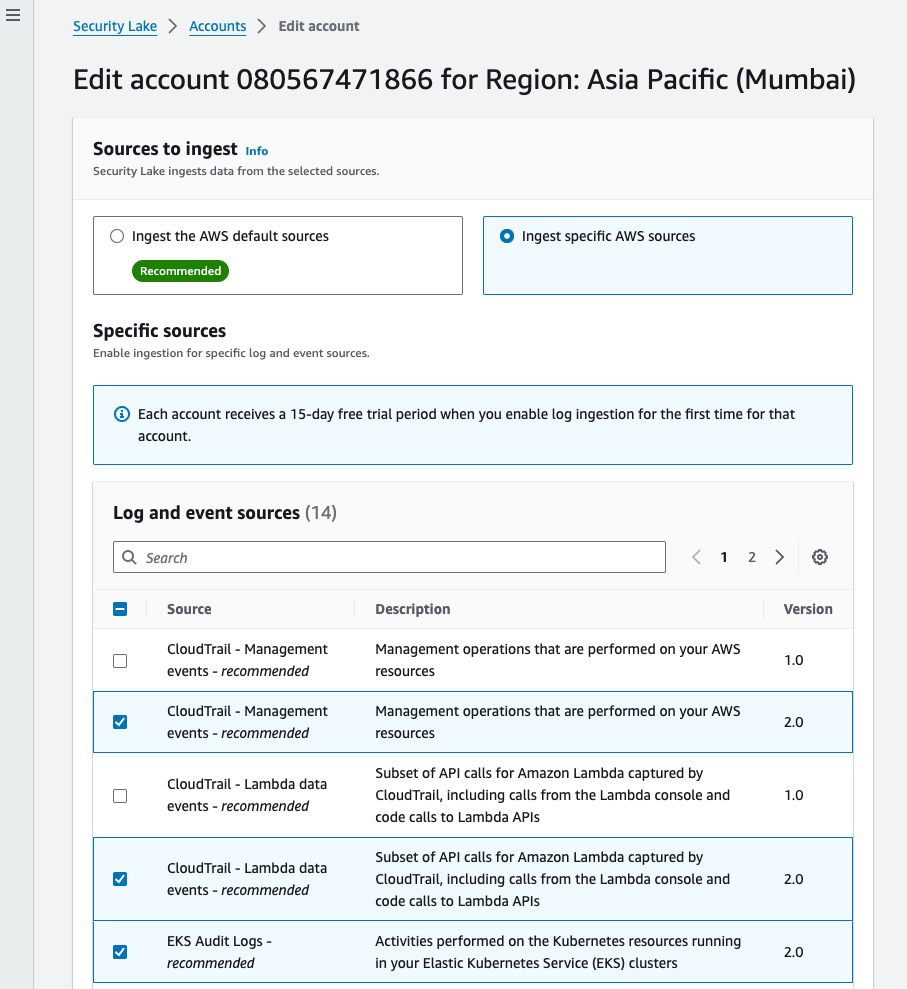

### Adding regions and accounts
If you did not include all accounts and regions when initially setting up Security Lake, you are able to add them via the Security Lake console, on the “Regions” and “Accounts” pages. Each of these pages has an orange button in the top right corner to add new regions or accounts. You will then see a similar set up wizard to specify what log sources you’d like for the entire region, or the new accounts that you specify (list by account ID separated by commas). 

### Changing S3 lifecycle directly
Since Security Lake’s underlying storage architecture is S3, you can configure lifecycle management directly at the level of the buckets and prefixes. This allows for more granular customization to bucket lifecycles than the bulk changes supported in the ASL console. However, note that change made directly in S3 will not be reflected in the Security Lake console. Refer to the [S3 documentation](https://docs.aws.amazon.com/AmazonS3/latest/userguide/lifecycle-transition-general-considerations.html) for more detail. 

## Configure collection of third party data

Security Lake enables you to easily collect AWS log sources, but one of the main concepts of a data lake is to be able to collect many different data sources so that you can derive insights from this data.

### Partner sources
If you would like to collect a third party log source, begin by checking if it is a supported [Security Lake source partner](https://aws.amazon.com/security-lake/partners/#Source_Partners). Security Lake source partners have already built an integration that allows you to send logs or findings from their solution to Security Lake in OCSF format. The details of this integration vary by partner, but links to all partner integration documentation is can be found [here](https://docs.aws.amazon.com/security-lake/latest/userguide/integrations-third-party.html). Follow the applicable guidance published by the partner.

### Using Security Hub to route findings to Security Lake
Security Hub supports the collection of security findings from a wide range of third-party sources. These findings can then be sent to Security Lake. If you are looking to send security data from a third-party security source to Security Lake, and it isn’t a source partner, we recommend checking if it has a Security Hub integration by reviewing this [list](https://docs.aws.amazon.com/securityhub/latest/userguide/securityhub-partner-providers.html).

### Custom sources
In Amazon Security Lake you can use Custom sources to collect logs or findings from any source. For example, you can collect logs from an on-premises DNS server, SaaS applications, custom applications, or from other cloud providers. You will be responsible for any necessary transformation to OCSF before bringing these types of log sources into Security Lake. AWS services like [Glue](https://aws.amazon.com/glue/), [Data Pipeline](https://docs.aws.amazon.com/datapipeline/latest/DeveloperGuide/what-is-datapipeline.html), and [Kinesis](https://aws.amazon.com/kinesis/) can help convert your custom log sources into OCSF. [AWS AppFabric](https://aws.amazon.com/appfabric/) can also help by converting logs from [supported SaaS applications](https://aws.amazon.com/appfabric/supported-applications/) into OCSF. For more details about AppFabric’s integration with Security Lake, refer to the AppFabric [documentation](https://docs.aws.amazon.com/appfabric/latest/adminguide/security-lake.html#security-lake-audit-log-ingestion).

To understand how to create a custom source in Security Lake refer to the [Security Lake documentation](https://docs.aws.amazon.com/security-lake/latest/userguide/custom-sources.html). For a pattern on how to collect data from a custom source we recommend looking at this [Security Lake blog post](https://aws.amazon.com/blogs/security/get-custom-data-into-amazon-security-lake-through-ingesting-azure-activity-logs/). 

## Operationalizing Security Lake

Once your security logs have been centrally collected and normalized to OCSF format, you will naturally want to derive insights and value from the data you are collecting. This can be done using AWS native analytics solutions or by using Security Lake subscriber partner solutions. 

### AWS native analytics
Your Security Lake data ultimately resides in S3, so there is a wide range of AWS native analytics solutions you can take advantage of. The native solutions we recommend considering for use with Security Lake are [Athena](https://aws.amazon.com/athena/), [QuickSight](https://aws.amazon.com/quicksight/?amazon-quicksight-whats-new.sort-by=item.additionalFields.postDateTime&amazon-quicksight-whats-new.sort-order=desc), and [OpenSearch](https://aws.amazon.com/opensearch-service/).  

Athena allows you to run SQL queries against Security Lake data. Once Security Lake is deployed, it is integrated with Athena by default. If you have never used Athena before, you will need to configure an S3 bucket for Athena to write query results to. See the Athena [documentation](https://docs.aws.amazon.com/athena/latest/ug/query-results-specify-location-console.html) for help doing this. You can find examples of queries you can run on your Security Lake data, along with additional guidance, [here](https://docs.aws.amazon.com/security-lake/latest/userguide/subscriber-query-examples.html). Athena is the recommended analytics approach for security data you are not accessing frequently. It can also enable your security team to run ad-hoc investigations and reports. In some cases, Athena can enable customers to shorten retention windows in downstream, more costly, analytics solutions or stop sending rarely used logs all together. 

QuickSight allows you to create dashboards and reports based on Security Lake data and share them with your stakeholders. This the recommended approach for customers looking for cost effective reporting capabilities to use with Security Lake. QuickSight also offers generative AI features through [Amazon Q in QuickSight](https://aws.amazon.com/quicksight/q/), allowing users to interact with their security data using natural language. If you are interested in using QuickSight with Security Lake, we recommend evaluating the pre-built AWS Solution “[Security Insights on AWS](https://aws.amazon.com/solutions/implementations/security-insights-on-aws/)”. 

OpenSearch is an open-source search and analytics suite that can be deployed as a managed service in AWS. OpenSearch supports using an ingestion pipeline for Security Lake and a zero-ETL integration with Security Lake. The ingestion pipeline approach is recommended for Security Lake customers looking for near real-time search and analytics capabilities or that need alerting based on their Security Lake data. The zero-ETL approach is recommended for customers who would like to query Security Lake data without the extra step, and cost, of moving it to an OpenSearch cluster. The zero-ETL approach offers a balance between cost efficiency and performance, especially with OpenSearch features like indexed views and dashboards. Both deployment options are documented in the following blog posts: [ingestion pipeline approach](https://aws.amazon.com/blogs/big-data/generate-security-insights-from-amazon-security-lake-data-using-amazon-opensearch-ingestion/) and [zero-ETL approach](https://aws.amazon.com/blogs/aws/introducing-amazon-opensearch-service-zero-etl-integration-for-amazon-security-lake/).

### Subscriber partners
[Subscriber partners](https://aws.amazon.com/security-lake/partners/#Subscriber_Partners) offer additional ways to make use of your Security Lake data. Many popular SIEM, SOAR, XDR, and security analytics tools are Security Lake partners. This means they can ingest data from your deployment of Security Lake. These partners play a critical role in extending what you can do with your Security Lake data. Security Lake can also simplify the implementation and management of these security analytics solutions. Customers can use Security Lake as a managed solution to collect native AWS logs, aggregate them to one account and region, and then have one point of integration with the downstream analytics solution. 

Security Lake subscribers have two different access models. Data access, which allows logs to be sent to the partner solution, and query access, which only allows the partner solution to run queries against Security Lake data and return the results. When configuring a Security Lake subscriber of either type, you are able to select what log sources the subscriber has access to. For additional details on configuring subscribers and  managing their access, refer to the Security Lake [documentation](https://docs.aws.amazon.com/security-lake/latest/userguide/subscriber-management.html). 

Use cases for subscribers might be sending certain log data to a SIEM or SOAR solution for correlation or response and remediation. Another example would be to create a cross account subscriber that will allow a development team to access CloudTrail data to troubleshoot issues in their account without the need to create a separate individual account CloudTrail trail. There are also many other use cases such as using [SageMaker to run machine learning analytics](https://github.com/aws-samples/amazon-security-lake-machine-learning) or integrating with a long list of [third party integrations](https://docs.aws.amazon.com/security-lake/latest/userguide/integrations-third-party.html)that can help you derive value from your security logs. Each subscriber partner will also offer guidance on how to properly set up the integration between their solution and Security Lake. Guidance on these integrations is offered [here](https://docs.aws.amazon.com/security-lake/latest/userguide/integrations-third-party.html). However, all subscribers will require some configuration within the Security Lake console, on the subscriber page, like in the example below. 

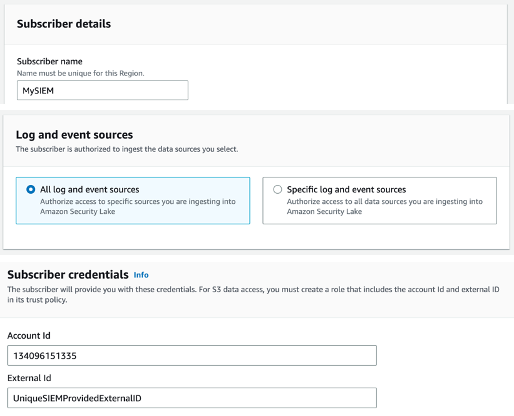
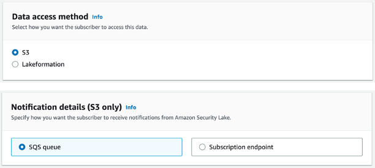
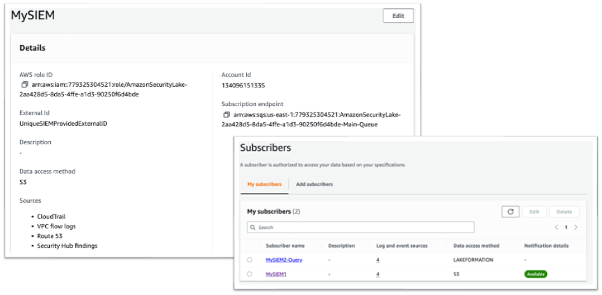

### OCSF schema updates
Security Lake will periodically go through schema updates as newer versions of OCSF are released. When this occurs, you will have the option to choose when to update your deployment of Security Lake to the new schema version. However, partners may not support the new schema right as it is released. We recommend validating partner support of any new schema versions prior to updating.

## Cost considerations

With Security Lake, you pay as you go with no upfront costs. Security Lake prices are based on two dimensions: data ingestion and data normalization. Monthly costs are determined by the volume of log and event data ingested from AWS services per gigabyte. There is no charge for bringing third-party or your own data.  For more information on pricing view the [Security Lake pricing page](https://aws.amazon.com/security-lake/pricing/).  In this section we want to highlight important cost considerations.

### Cost breakdown and visibility
Security Lake provisions other services on your behalf to successfully manage and orchestrate a data lake. This includes S3, Lake Formation, Glue, Lambda, EventBridge, Kinesis and SQS. Each of these services will generate cost independently following their respective pricing structure. The cost they generate will report to the individual services and is not included in the Security Lake pricing structure or reported back as charges tied to Security Lake in tools like Cost Explorer or the usage page of the Security Lake console. The majority of the orchestration costs related to Security Lake will be associated with the delegated admin account where you choose to run Security Lake. 

Security Lake’s pricing structure includes charges for the ingestion and normalization of AWS log sources. These charges are associated with Security Lake in tools like Cost Explorer and are what is showed on the usage of page of the Security Lake console. These charges will be associated with the account that the logs originated from, meaning that in most cases, the majority of the charges directly associated to Security Lake will be tied to member accounts. 

### Built in cost savings
By collecting all of your logs with Security Lake you are storing all of your logs in an S3 bucket in your environment. As a customer you get to choose what S3 storage tier you will use for these logs, everything from standard storage priced at \$0.023/GB to deep archive priced at \$0.00099/GB. In addition to this flexibility Security Lake also stores these logs as Apache Parquet files that allow 90%+ compression ratio of pre-text raw log volumes.

### Confirm you are not collecting duplicate native logs
Enabling Security Lake will not change any existing log collection settings you have. This means that if you enable Security Lake to collect a native log source you were already collecting, you will begin collecting more than one copy of the same data (although the format of the logs will differ). You can disable the previous log collection after enabling Security Lake. However, before doing so, we recommend identifying internal stakeholders or workloads using the previous logs and planning on how to switch them over to using Security Lake.

### CloudTrail management event cost savings
To collect CloudTrail Management events you will need to create a CloudTrail organizational trail as mentioned above. This will result in CloudTrail sending logs to a bucket of your choice. The delivery of the first copy of these logs is free, however S3 storage cost is incurred. Security Lake will collect a copy of CloudTrail Management events and store these logs in the Security Lake S3 bucket. This will result in a duplication of CloudTrail logs. It is recommended to set an [S3 lifecycle policy](https://docs.aws.amazon.com/AmazonS3/latest/userguide/object-lifecycle-mgmt.html) on the CloudTrail bucket to expire log files after a short period of time, largely dependent on what you decide at your organization. These log files will be delivered at the same time so expiration can be very short.

### Rollup regions
When using a rollup region you are aggregating data from 1 or more regional buckets to a single region’s bucket. This will result in a duplication of logs in each regional bucket as a copy now exists in your rollup region’s bucket. Some customers prefer to keep multiple copies of their logs for resiliency. However, for cost optimization, it is recommended to handle this data duplication in the same manner as the duplication of CloudTrail Management events discussed in the previous section. Create an [S3 lifecycle policy](https://docs.aws.amazon.com/AmazonS3/latest/userguide/object-lifecycle-mgmt.html) to expire these logs after a short period of time.

### Moving logs to glacier
Glacier storage classes can reduce S3 storage costs, but come with tradeoffs that should be carefully considered based on how you plan to interact with your security log data. Glacier storage classes are designed for long term storage of data that will not need to be accessed frequently. As a tradeoff for low storage cost, these classes have things like minimum retention periods, miniumum object sizes, added metadata for each object, slower retreival times, and direct retreival costs. For a full breakdown, refer to the [S3 user guide](https://docs.aws.amazon.com/AmazonS3/latest/userguide/glacier-storage-classes.html). Be sure to fully understand the pricing structure of Glacier storage classes to make sure the storage savings outweigh the additional cost dimensions for your given use case. You should also consider how you will retrieve data when necessary, and make sure any applicable delays are acceptable for your organization. 

## Additional resources

[Documentation: Amazon Security Lake User Guide](https://docs.aws.amazon.com/security-lake/latest/userguide/what-is-security-lake.html)

[Documentation: Amazon Security Lake API Reference](https://docs.aws.amazon.com/security-lake/latest/APIReference/Welcome.html)

[Video: AWS re:Inforce 2023 - Build your security data lake w/ Amazon Security Lake, featuring IPG](https://www.youtube.com/watch?v=qcXB6Y_7bNo&pp=ygUUYW1hem9uIHNlY3VyaXR5IGxha2U%3D)

[Video: How to get started and manage Amazon Security Lake with AWS Organizations](https://www.youtube.com/watch?v=fKGhscpwN-k&list=PLhr1KZpdzukfJzNDd8eCJH_TGg24ZTwP6&index=35&t=90s&pp=iAQB)

[Video: Understanding Amazon Security Lake Cost](https://www.youtube.com/watch?v=CbzLCntmgiY)

[Video: Amazon Security Lake with Amazon Athena and Amazon QuickSight](https://www.youtube.com/watch?v=M0GviMezp3w&list=PLhr1KZpdzukfJzNDd8eCJH_TGg24ZTwP6&index=41&t=1s&pp=iAQB)

[Video: Amazon Security Lake Custom Source](https://www.youtube.com/watch?v=8MDP3LX2A-A&list=PLhr1KZpdzukfJzNDd8eCJH_TGg24ZTwP6&index=26&t=3s&pp=iAQB)

[Video: Amazon Security Lake integration with Splunk](https://www.youtube.com/watch?v=VSwSwNFPz14&list=PLhr1KZpdzukfJzNDd8eCJH_TGg24ZTwP6&index=4&t=190s&pp=iAQB)

[Blog: Patterns for consuming custom log sources in Amazon Security Lake](https://aws.amazon.com/blogs/security/patterns-for-consuming-custom-log-sources-in-amazon-security-lake/) 

[Blog: Get custom data into Amazon Security Lake through ingesting Azure activity logs](https://aws.amazon.com/blogs/security/get-custom-data-into-amazon-security-lake-through-ingesting-azure-activity-logs/)

[Blog: Ingest transform and deliver events published by Amazon Security Lake to Amazon OpenSearch Service](https://aws.amazon.com/blogs/big-data/ingest-transform-and-deliver-events-published-by-amazon-security-lake-to-amazon-opensearch-service/)

[Blog: How Amazon Security Lake is helping customers simplify security data management for proactive threat analysis](https://aws.amazon.com/blogs/security/how-amazon-security-lake-is-helping-customers-simplify-security-data-management-for-proactive-threat-analysis/)

[Blog: How to deploy an Amazon OpenSearch cluster to ingest logs from Amazon Security Lake](https://aws.amazon.com/blogs/security/how-to-deploy-an-amazon-opensearch-cluster-to-ingest-logs-from-amazon-security-lake/)

[Blog: Generate security insights from Amazon Security Lake data using Aamzon OpenSearch Ingestion](https://aws.amazon.com/blogs/big-data/generate-security-insights-from-amazon-security-lake-data-using-amazon-opensearch-ingestion/)

[Blog: Introducing Amazon OpenSearch Service and Amazon Security Lake integration to simplify security analytics](https://aws.amazon.com/blogs/aws/introducing-amazon-opensearch-service-zero-etl-integration-for-amazon-security-lake/).

[OCSF Github page](https://github.com/ocsf)

