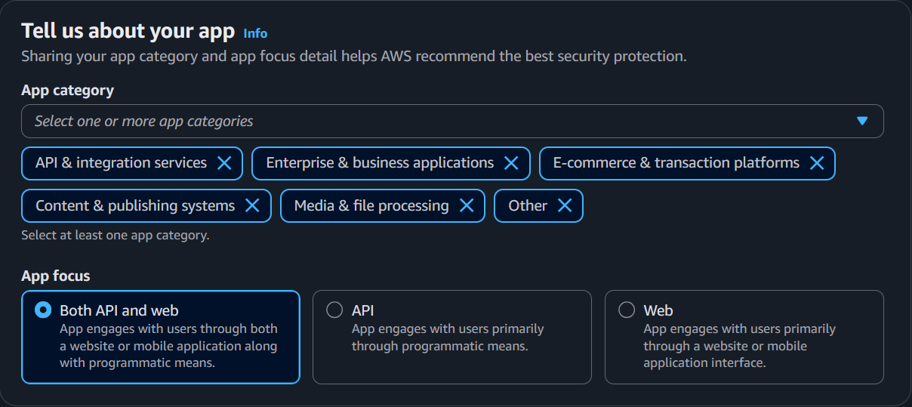
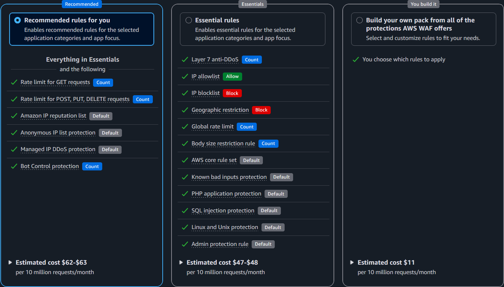
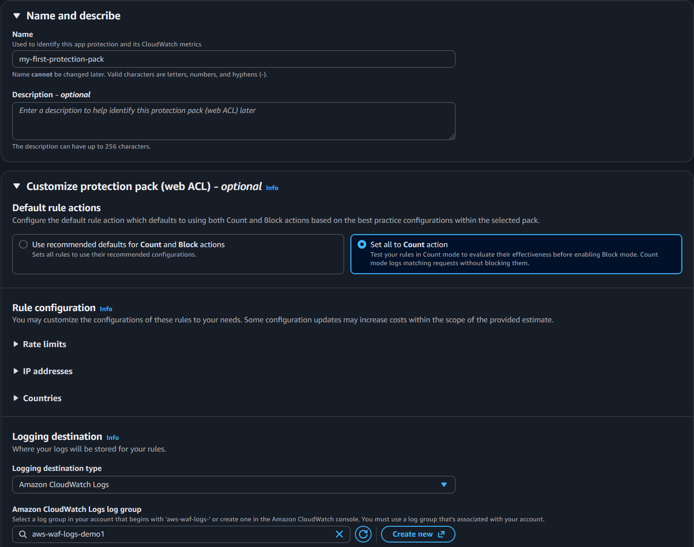

# AWS 관리형 규칙

[AWS 관리형 규칙 그룹](https://docs.aws.amazon.com/waf/latest/developerguide/aws-managed-rule-groups.html)은 AWS에서 유지 관리합니다. 표준 AWS WAF 비용에는 추가 요청당 비용 없이 AWS 관리형 규칙(기본 및 사용 사례 규칙 그룹) 사용이 포함됩니다. Bot Control, Fraud Control, DDoS Protection 규칙 그룹에는 추가 요청당 요금이 있습니다. 현재 세부 사항은 [AWS WAF 요금](https://aws.amazon.com/waf/pricing/)을 참조하세요.

이 섹션에서는 어떤 관리형 규칙 그룹을 사용할지, 버전을 관리하는 방법, 비용 최적화 및 오탐 감소를 위해 범위를 좁히는 방법을 다룹니다.

## Protection Pack 권장 사항

AWS WAF 콘솔에서 새 Protection Pack을 생성할 때, 설정 마법사는 애플리케이션 유형에 맞춤화된 사전 구성된 규칙 팩을 제공합니다. 이 팩은 AWS WAF를 시작하는 가장 빠른 방법이며 WAF를 처음 배포하거나 어떤 관리형 규칙을 활성화해야 할지 확실하지 않은 고객에게 권장됩니다.

설정 중에 먼저 앱 카테고리(예: API 및 통합 서비스, 엔터프라이즈 및 비즈니스 애플리케이션 등)와 트래픽 소스(API, Web 또는 둘 다)를 선택하여 애플리케이션을 설명합니다.

그런 다음 위의 선택에 따라 세 가지 보호 수준 중 선택합니다. 정확한 protection pack 규칙은 앱 카테고리 및 앱 포커스에 대해 선택한 것에 따라 다릅니다:

- **Recommended** - 선택한 애플리케이션 카테고리 및 앱 포커스에 대한 권장 규칙을 활성화합니다. **Essentials** 선택에 포함된 규칙을 포함합니다.
- **Essentials** - 선택한 애플리케이션 카테고리 및 앱 포커스에 대한 필수 규칙을 활성화합니다.
- **You build it** - 사용 가능한 모든 옵션에서 개별 보호를 선택하고 사용자 정의할 수 있습니다. 특정 요구 사항이 있거나 AWS WAF에 경험이 있거나 처음부터 포함되는 규칙 그룹에 대한 완전한 제어가 필요한 경우 사용하세요.

어떤 옵션을 선택하든 생성 후 언제든지 Protection Pack을 사용자 정의할 수 있습니다. 필요에 따라 규칙을 추가, 제거 또는 수정할 수 있습니다. 사전 구성된 팩은 시작점이지 제약이 아닙니다. 트래픽 패턴과 WAF 로그에 대한 경험을 쌓으면서 아래 섹션의 지침에 따라 규칙을 조정해야 합니다.

보호 수준을 선택한 후 마법사에서 Protection Pack 이름, 기본 규칙 작업, 비율 제한 임계값, IP 허용/차단 목록, 국가 기반 지리적 제한을 포함한 일반 설정을 단일 단계에서 사용자 정의할 수 있습니다.

## 모든 배포를 위한 기본 규칙

다음 AWS 관리형 규칙 그룹은 기본 보호 계층으로 모든 WAF 배포에 권장됩니다. 이것은 위의 사전 정의된 protection pack의 일부입니다. 이 섹션은 각각이 제공하는 것과 애플리케이션에 특정한 고려 사항을 자세히 설명합니다.

### Anti-DDoS

[Anti-DDoS 관리형 규칙 그룹](https://docs.aws.amazon.com/waf/latest/developerguide/aws-managed-rule-groups-anti-ddos.html)(`AWSManagedRulesAntiDDoSRuleSet`)은 애플리케이션 계층(레이어 7) DDoS 공격을 감지하고 완화합니다. 보호된 리소스에 대한 트래픽 기준선을 설정하고 이상 감지를 사용하여 수초 내에 DDoS 이벤트를 식별하고 대응합니다.

**사용 이유**

이 규칙 그룹은 DDoS 시나리오를 위한 사용자 정의 비율 기반 규칙을 작성하거나 유지할 필요 없이 자동화된 레이어 7 DDoS 감지 및 완화를 제공합니다. 정상 트래픽 패턴을 학습하고 트래픽이 해당 기준선에서 크게 벗어날 때 대응합니다. 추가 정액 + 사용량 기반 비용으로 모든 AWS WAF 고객에게 제공되며, AWS Shield Advanced 고객은 Shield 보호 리소스에서 추가 비용 없이 이 AMR을 사용할 수 있습니다.

**고려 사항**

- 이 규칙 그룹을 protection pack에서 첫 번째에 배치하여 다른 규칙이 평가를 종료하기 전에 모든 트래픽을 평가할 수 있도록 하세요.
- Anti-DDoS AMR은 감지된 이벤트 중 클라이언트를 확인하기 위해 Challenge 작업을 사용할 수 있습니다. 비브라우저 클라이언트(네이티브 모바일 앱, fetch 요청을 하는 SPA, API 클라이언트)가 있는 애플리케이션은 이벤트 중 합법적인 트래픽이 챌린지되는 것을 방지하기 위해 구성 조정이 필요할 수 있습니다.
- 이것은 Shield Advanced 서비스가 아닌 WAF 관리형 규칙 그룹입니다. Shield Advanced는 추가 이점(DDoS 비용 보호, SRT 액세스, 추가 WAF 비용 없이 이 AMR 사용)을 제공하지만 기계적으로는 별개입니다.

### Amazon IP 평판 목록

[Amazon IP 평판 목록](https://docs.aws.amazon.com/waf/latest/developerguide/aws-managed-rule-groups-ip-rep.html#aws-managed-rule-groups-ip-rep-amazon)은 AWS 위협 인텔리전스가 DDoS, 정찰 또는 기타 악성 활동에 적극적으로 관여하는 것으로 식별한 IP의 요청을 차단합니다.

**사용 이유**

이것은 활성화할 수 있는 가장 위험이 낮은 규칙 그룹 중 하나입니다. AWS는 이 목록에 IP를 추가하기 전에 높은 신뢰도 기준을 유지합니다. 기본 WAF 요금 외에 비용이 없으며, 거의 확실히 합법적인 사용자가 아닌 소스의 트래픽을 차단합니다. 모든 protection pack에서 활성화하세요.

**고려 사항**

- 이 규칙 그룹에서 차단하지 않기로 선택하더라도, Count 모드로 추가하세요. WAF 로그에 생성하는 레이블은 소급 조사에 유용합니다.
- 이 목록의 IP가 합법적인 사용자에게도 서비스를 제공할 수 있습니다(예: 공유 VPN 또는 호스팅 IP). 그러나 IP가 이 목록에 오르면 *누군가*가 악의적 목적으로 적극적으로 사용하고 있는 것입니다.

### 익명 IP 목록

[익명 IP 목록](https://docs.aws.amazon.com/waf/latest/developerguide/aws-managed-rule-groups-ip-rep.html#aws-managed-rule-groups-ip-rep-anonymous)은 요청자의 신원을 난독화하는 소스의 요청을 식별합니다: Tor 출구 노드, VPN, 공개 프록시, 호스팅/클라우드 프로바이더. 익명 IP는 악의적 행위자가 자주 사용하지만 합법적인 사용자와 기업에게도 매우 일반적입니다. VPN을 사용하는 사람들, 클라우드를 사용하는 기업이 있습니다.

**사용 이유**

이 규칙 그룹을 적용할지 여부는 전적으로 사용자가 누구인지에 따라 다릅니다. 독립적으로 평가해야 하는 두 가지 별도 규칙이 포함되어 있습니다:

- **AnonymousIPList**(Tor, VPN, 프록시) - 애플리케이션에 익명화 서비스에서 트래픽을 수신할 합법적인 이유가 없는 경우 적용하세요. B2B 엔드포인트, 내부 도구, 관리 인터페이스에는 합법적인 Tor 또는 공개 VPN 트래픽이 거의 없습니다.
- **HostingProviderIPList**(클라우드/호스팅 IP) - 주거용 또는 모바일 네트워크의 최종 사용자 브라우저만 서비스하는 엔드포인트에 권장됩니다. 다른 서비스의 API 호출, 웹훅 또는 서버 간 트래픽을 수신하는 애플리케이션에는 권장되지 않습니다. 참고: AWS IP는 이 목록에 **없습니다**.

**고려 사항**

- IP 평판과 마찬가지로, 차단하지 않더라도 Count 모드에서 유용합니다. 레이블은 트래픽의 몇 퍼센트가 익명화 소스에서 오는지 이해하는 데 도움이 됩니다.
- 일반적인 패턴은 `AnonymousIPList`를 광범위하게 적용하지만 레이블 기반 사용자 정의 규칙을 사용하여 특정 엔드포인트(예: 로그인 페이지)에서만 `HostingProviderIPList`를 적용하는 것입니다.

### Core Rule Set (CRS)

[Core rule set(CRS)](https://docs.aws.amazon.com/waf/latest/developerguide/aws-managed-rule-groups-baseline.html#aws-managed-rule-groups-baseline-crs)는 크로스 사이트 스크립팅(XSS), 로컬 파일 포함(LFI), OWASP Top 10 카테고리에 맞춘 일반 요청 이상을 포함한 일반적인 웹 익스플로잇에 대한 광범위한 보호를 제공합니다.

**사용 이유**

이것은 일반 웹 애플리케이션 보호를 위한 가장 영향력 있는 기본 규칙 그룹입니다. 애플리케이션의 기술 스택에 관계없이 적용되는 광범위한 공격 패턴을 포착합니다. 목표는 이 그룹에서 가능한 한 많은 규칙을 적용하는 것이어야 합니다. 그러나 모든 단일 규칙이 될 필요는 없습니다. 일부 규칙은 특정 애플리케이션 동작과 충돌하며, 이는 예상되는 것입니다.

**고려 사항**

CRS는 요청 콘텐츠를 광범위하게 검사하고 현재 모든 AMR 중 가장 많은 규칙을 가지고 있으므로 오탐을 생성할 가능성이 가장 높은 규칙 그룹입니다. 일반적인 마찰 지점:

- **`SizeRestrictions_BODY`** - 본문이 8KB 이상인 요청을 차단합니다. 파일 업로드, 대형 JSON 페이로드 또는 리치 텍스트가 있는 폼 제출을 수락하는 모든 엔드포인트가 이에 해당합니다. 특정 업로드 URI로 범위가 지정된 레이블 기반 예외로 이 규칙을 처리해야 할 것입니다.
- **`CrossSiteScripting_BODY`** - HTML/스크립트 태그와 유사한 콘텐츠에서 트리거됩니다. 파일 업로드(`.docx`, `.xml`, `.svg`)와 리치 텍스트 편집기는 서명에 XSS처럼 보이는 `<tag>` 패턴을 포함하므로 일반적으로 오탐을 생성합니다.

CRS 규칙이 합법적인 트래픽에서 트리거되면, 두 가지 옵션이 있습니다:

1. 규칙이 애플리케이션에 진정으로 적용되지 않는 경우(예: 대형 파일 업로드를 수락하도록 설계된 엔드포인트의 `SizeRestrictions_BODY`), 해당 protection pack에 대해 규칙을 Count 모드로 두거나 비활성화하세요.
2. 규칙이 관련되지만 특정 합법적 요청에서 트리거되는 경우, [레이블 기반 예외 패턴](../../operationalizing/docs/index.md#creating-exceptions)을 사용하여 다른 곳에서는 규칙을 적용한 상태로 유지하면서 특정 URI 또는 요청 패턴을 제외하세요.

### Known Bad Inputs

[Known bad inputs](https://docs.aws.amazon.com/waf/latest/developerguide/aws-managed-rule-groups-baseline.html#aws-managed-rule-groups-baseline-known-bad-inputs) 규칙 그룹은 알려진 익스플로잇 및 취약점 발견과 관련된 요청 패턴을 차단합니다. Log4j JNDI 인젝션 및 일반적인 익스플로잇 페이로드와 같은 것입니다.

**사용 이유**

이 규칙 그룹은 알려진 익스플로잇 및 활성 취약점 스캐닝과 관련된 패턴을 감지합니다. 서명은 정상 애플리케이션 트래픽에 나타날 합법적인 이유가 없는 특정하고 잘 문서화된 공격 기법을 대상으로 합니다. 오탐률이 낮고 WCU 비용이 낮아 배포 초기에 적용하기 좋은 후보입니다.

**고려 사항**

- 가장 일반적으로 보고되는 오탐은 **`Log4JRCE_BODY`**로, `${...}` 패턴을 포함하는 요청 본문에서 매칭합니다. 유사한 구문을 사용하는 합법적인 콘텐츠(템플릿 엔진, 로그 데이터, 구성 페이로드)에서 발생할 수 있습니다. 이를 만나면 [레이블 기반 예외 패턴](../../operationalizing/docs/index.md#creating-exceptions)을 사용하여 다른 곳에서는 규칙을 적용한 상태로 특정 URI를 제외하세요.

## 사용 사례별 규칙

위의 기본 규칙 그룹과 달리, 사용 사례별 규칙 그룹은 애플리케이션의 기술 스택과 일치할 때만 활성화하는 것이 이상적입니다. 애플리케이션에 적용되지 않는 규칙 그룹을 추가하면 WCU 용량을 소비하고(잠재적으로 WAF 사용 비용을 증가시키고) 경우에 따라 불필요한 오탐을 유발할 수 있습니다.

### SQL Database

[SQL database](https://docs.aws.amazon.com/waf/latest/developerguide/aws-managed-rule-groups-use-case.html#aws-managed-rule-groups-use-case-sql-db) 규칙 그룹(`AWSManagedRulesSQLiRuleSet`, 200 WCU)은 쿼리 매개변수, 요청 본문, 쿠키, URI 경로에서 SQL 인젝션 패턴을 감지합니다.

**사용 이유**

SQL 인젝션은 가장 일반적이고 피해가 큰 웹 애플리케이션 취약점 중 하나입니다. 애플리케이션이 Amazon RDS, Aurora, 자체 관리형 MySQL/PostgreSQL 또는 SQL 기반 데이터 웨어하우스 등 모든 SQL 데이터베이스와 통신하는 경우 이 규칙 그룹을 활성화하세요.

### Linux Operating System

[Linux operating system](https://docs.aws.amazon.com/waf/latest/developerguide/aws-managed-rule-groups-use-case.html#aws-managed-rule-groups-use-case-linux-os) 규칙 그룹(`AWSManagedRulesLinuxRuleSet`, 200 WCU)은 시스템 파일을 대상으로 하는 로컬 파일 포함(LFI) 시도를 포함한 Linux 특정 익스플로잇 패턴을 감지합니다.

**사용 이유**

스택의 일부가 Linux에서 실행되면 이 규칙 그룹을 활성화하세요. 공격자가 자격 증명, 환경 변수 또는 시스템 정보를 추출하는 데 사용하는 `/etc/passwd`, `/proc/self/environ` 등의 민감한 시스템 파일을 읽으려는 시도를 포착합니다.

### POSIX Operating System

[POSIX operating system](https://docs.aws.amazon.com/waf/latest/developerguide/aws-managed-rule-groups-use-case.html#aws-managed-rule-groups-use-case-posix-os) 규칙 그룹(`AWSManagedRulesUnixRuleSet`, 100 WCU)은 POSIX 유사 운영 체제에 일반적인 명령 인젝션 및 LFI 패턴을 감지합니다.

**사용 이유**

이것은 셸 명령 인젝션 패턴을 포착하여 Linux 규칙 그룹을 보완합니다. 100 WCU로 저렴한 추가입니다. Linux 기반 애플리케이션에 대해 Linux 규칙 그룹과 함께 활성화하세요.

### Windows Operating System

[Windows operating system](https://docs.aws.amazon.com/waf/latest/developerguide/aws-managed-rule-groups-use-case.html#aws-managed-rule-groups-use-case-windows-os) 규칙 그룹(`AWSManagedRulesWindowsRuleSet`, 200 WCU)은 PowerShell 인젝션 및 Windows 셸 명령 실행을 포함한 Windows 특정 익스플로잇 패턴을 감지합니다.

**사용 이유**

애플리케이션이 Windows에서 실행되는 경우 활성화하세요. IIS, Windows의 .NET, 모든 Windows 기반 컴퓨팅. 스택이 Linux 기반이면 이 규칙 그룹이 감지하는 공격 패턴은 애플리케이션이 익스플로잇될 수 있는 취약점과 일치하지 않습니다.

### PHP Application

[PHP application](https://docs.aws.amazon.com/waf/latest/developerguide/aws-managed-rule-groups-use-case.html#aws-managed-rule-groups-use-case-php-app) 규칙 그룹(`AWSManagedRulesPHPRuleSet`, 100 WCU)은 안전하지 않은 PHP 함수의 인젝션 및 PHP 슈퍼글로벌에 대한 접근을 포함한 PHP 특정 익스플로잇 패턴을 감지합니다.

**사용 이유**

PHP가 스택의 어디에 있든 활성화하세요. PHP로 직접 구축된 애플리케이션이나 WordPress, Drupal, Joomla와 같은 PHP 기반 CMS. 비PHP 애플리케이션에는 활성화하지 마세요.

### WordPress Application

[WordPress application](https://docs.aws.amazon.com/waf/latest/developerguide/aws-managed-rule-groups-use-case.html#aws-managed-rule-groups-use-case-wordpress-app) 규칙 그룹(`AWSManagedRulesWordPressRuleSet`, 100 WCU)은 WordPress 사이트에 특정한 익스플로잇 패턴을 감지합니다.

**사용 이유**

WordPress를 실행하는 경우 활성화하세요. 계층화된 커버리지를 위해 SQL Database 및 PHP Application 규칙 그룹과 함께 사용하세요.

## Bot Control

[AWS WAF Bot Control](https://docs.aws.amazon.com/waf/latest/developerguide/waf-bot-control.html)은 여러 수준의 정교함에서 봇 트래픽을 감지하고 관리하는 관리형 규칙 그룹을 제공합니다. Bot Control은 Common(자체 식별 봇, 알려진 봇 서명, Web Bot Authentication)과 Targeted(머신 러닝 기반 행동 분석을 사용한 정교한 봇) 두 가지 수준으로 제공됩니다. 두 수준 모두 기본 WAF 요금 외에 추가 요청당 요금이 있습니다.

Bot Control은 Common vs. Targeted 수준, 범위 축소 설계, Bot Control 레이블과 함께 작동하는 사용자 정의 규칙에 대한 중요한 전략 결정이 있는 심층적인 주제입니다. 자세한 지침은 전용 [봇 관리](../../bot-management/docs/index.md) 섹션을 참조하세요. 규칙 평가 순서에서 Bot Control이 어디에 맞는지는 [권장 WAF 규칙 순서](../../recommended-waf-rule-order/docs/index.md)를 참조하세요.

## Fraud Control

AWS WAF Fraud Control은 로그인 및 계정 생성 페이지를 자격 증명 기반 공격으로부터 보호하는 두 가지 관리형 규칙 그룹을 제공합니다. 두 규칙 그룹 모두 추가 요청당 요금이 있으며 토큰 기반 클라이언트 검증을 위한 AWS WAF 애플리케이션 통합과 함께 가장 잘 작동합니다. Fraud Control은 Amazon Cognito 사용자 풀에서는 사용할 수 없습니다.

사기 방지는 상당한 애플리케이션별 컨텍스트와 구현 단계가 있는 심층적인 주제입니다. 자세한 지침은 전용 [사기 방지](../../fraud-prevention/docs/index.md) 섹션을 참조하세요. 규칙 평가 순서에서 사기 방지가 어디에 맞는지는 [권장 WAF 규칙 순서](../../recommended-waf-rule-order/docs/index.md)를 참조하세요.

## AWS 파트너의 관리형 규칙

AWS Marketplace를 사용하여 [AWS 파트너가 제공하는 관리형 규칙](https://docs.aws.amazon.com/waf/latest/developerguide/marketplace-managed-rule-groups.html)을 구독할 수 있습니다. Marketplace AWS 파트너 규칙은 항상 유료 규칙이며 AWS WAF 자체 외에 정액 및/또는 사용량 비용이 있습니다.

**고려 사항**
- 파트너 관리형 규칙과 Amazon 관리형 규칙을 함께 사용할 수 있습니다. 둘 중 하나만 사용하는 것이 아닙니다.

이미 타사 WAF 프로바이더를 사용하거나 익숙한 고객은 AWS WAF의 네이티브 통합 및 스케일링 기능을 활용하면서 일관된 규칙 경험을 얻을 수 있습니다.

파트너 관리형 규칙은 높은 WCU를 *가지는 경향*이 있습니다. 이것은 기술적 문제가 아니지만 AWS WAF 비용은 WebACL의 총 WCU에 의해 결정됩니다. 비교로 권장 AWS WAF [protection pack](../../aws-managed-rules/docs/index.md#protection-pack-권장-사항)은 1,498 WCU($0.6/백만 사용량 비용)입니다.

## 관리형 규칙 그룹 버전 관리

!!! warning "향후 콘텐츠 업데이트 진행 중"
    이 시점 이후의 섹션은 현재 업데이트 중이며 불완전할 수 있습니다. 곧 다시 방문하거나 그동안 AWS WAF 공개 문서를 참조하세요.

시간이 지남에 따라 Amazon 관리형 규칙은 서명 정의를 변경하거나 기존 AMR에 새로운 기능을 추가합니다. AWS는 이러한 변경 사항을 이러한 AMR의 버전으로 릴리스하여 이러한 새로운 서명 및/또는 기능이 활성화되는 시기를 제어할 수 있도록 합니다.

### 기본 vs. 고정 버전 관리

**기본 버전**을 사용하면 관리형 규칙 그룹 프로바이더가 어떤 버전이 활성인지 제어합니다. 새 버전은 알림 기간 후 자동으로 배포됩니다. 이것이 가장 간단한 접근 방식이지만 테스트되지 않은 변경 사항을 도입하고 서명 업데이트로 인한 오탐 위험을 증가시킵니다.

**고정 버전**을 사용하면 사용할 버전을 명시적으로 선택합니다. 이를 통해 업데이트가 적용되는 시기를 완전히 제어하여 프로덕션으로 승격하기 전에 비프로덕션 환경에서 새 버전을 테스트할 수 있습니다.

**고려 사항**
AWS는 AMR의 고정 버전을 사용하고 애플리케이션에 대해 테스트할 것을 권장합니다. 가장 일반적인 패턴은 프로덕션에서 고정 버전을 사용하지만 비프로덕션은 기본값으로 설정하거나 먼저 업데이트하는 것입니다.

### SNS 알림 구독

기본 또는 고정 버전 관리를 사용하든, 새 버전의 [알림을 구독](https://docs.aws.amazon.com/waf/latest/developerguide/waf-using-managed-rule-groups-sns-topic.html)하세요. 이는 새 기본값이 되기 전에 테스트할 시간을 주기 위해 향후 변경 사항에 대해 알려줍니다.

### 버전 만료

[버전 만료를 추적](https://docs.aws.amazon.com/waf/latest/developerguide/waf-using-managed-rule-groups-expiration.html)하여 테스트 전에 강제 업그레이드되지 않도록 하세요. 고정 버전이 만료되면, AWS WAF가 테스트하지 않은 규칙 변경이 포함될 수 있는 기본 버전으로 자동 이동합니다.

### CloudWatch 알람으로 버전 만료 모니터링

AWS WAF는 고정 버전을 사용하는 각 관리형 규칙 그룹에 대해 `DaysToExpiry` CloudWatch 지표를 게시합니다. 이 지표에 CloudWatch 알람을 생성하여 버전이 만료되기 전에 알림을 받아 기본 버전으로 자동 이동되기보다 사전에 테스트하고 업그레이드할 시간을 확보할 수 있습니다.

### IP 평판 규칙 그룹

AWS 관리형 [IP 평판 규칙 그룹](https://docs.aws.amazon.com/waf/latest/developerguide/aws-managed-rule-groups-ip-rep.html)은 버전을 사용하지 않습니다. 이러한 규칙 그룹은 Amazon 위협 인텔리전스의 발전에 따라 자주 업데이트됩니다. 이러한 규칙 그룹에는 버전 관리가 필요하지 않습니다.

## 범위 축소 문 사용

!!! warning "향후 콘텐츠 업데이트 진행 중"
    이 시점 이후의 섹션은 현재 업데이트 중이며 불완전할 수 있습니다. 곧 다시 방문하거나 그동안 AWS WAF 공개 문서를 참조하세요.

[범위 축소 문](https://docs.aws.amazon.com/waf/latest/developerguide/waf-rule-scope-down-statements.html)은 관리형 규칙 그룹 또는 비율 기반 규칙 내에 추가하여 평가되는 요청 세트를 좁히는 문입니다.

Bot Control 및 Fraud Protection과 같은 고급 관리형 규칙 그룹에 범위 축소 문을 사용하여 규칙 그룹에서 평가해야 하는 요청을 지정하세요. 범위 축소 문에 의해 제외된 요청에 대해 요금이 부과되지 않으므로 비용을 최적화하는 효과적인 방법입니다.

**고려 사항**
범위 축소는 BotControl과 같은 유료 AMR에 권장됩니다. 기술적으로 필수는 아니지만, 대부분의 고객은 이를 모든 단일 요청에서 처리할 필요가 없거나 원하지 않습니다(비용뿐 아니라 기술적 이유로도).

범위 축소는 비IP 기반 AMR의 오탐 처리에 **권장되지 않습니다**. 범위 축소는 전체 AMR에 적용됩니다. 예를 들어, CommonRuleSet 내의 SizeRestrictions_BODY 규칙이 업로드 엔드포인트(예: /upload)에서 트리거되는 경우, uri = /upload일 때 CommonRuleSet을 적용하지 **않도록** 범위를 축소하면 CrossSiteScripting_BODY와 같은 다른 규칙도 확인되거나 레이블이 지정되지 않습니다. 대신 이 규칙을 COUNT 작업으로 설정하고 [예외 생성](../../operationalizing/docs/index.md#creating-exceptions)에 설명된 대로 오탐 예외를 생성해야 합니다.
