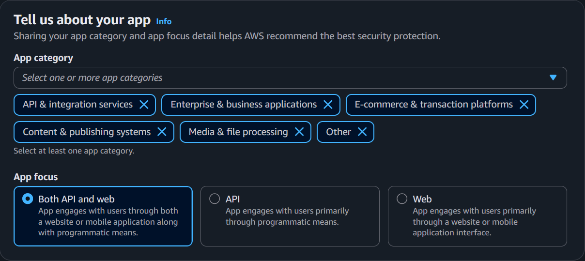
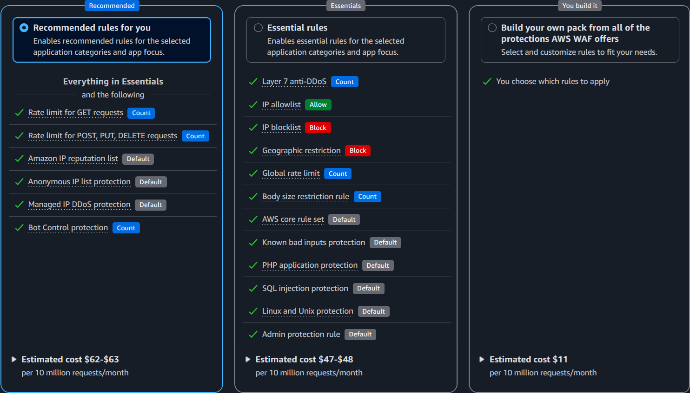
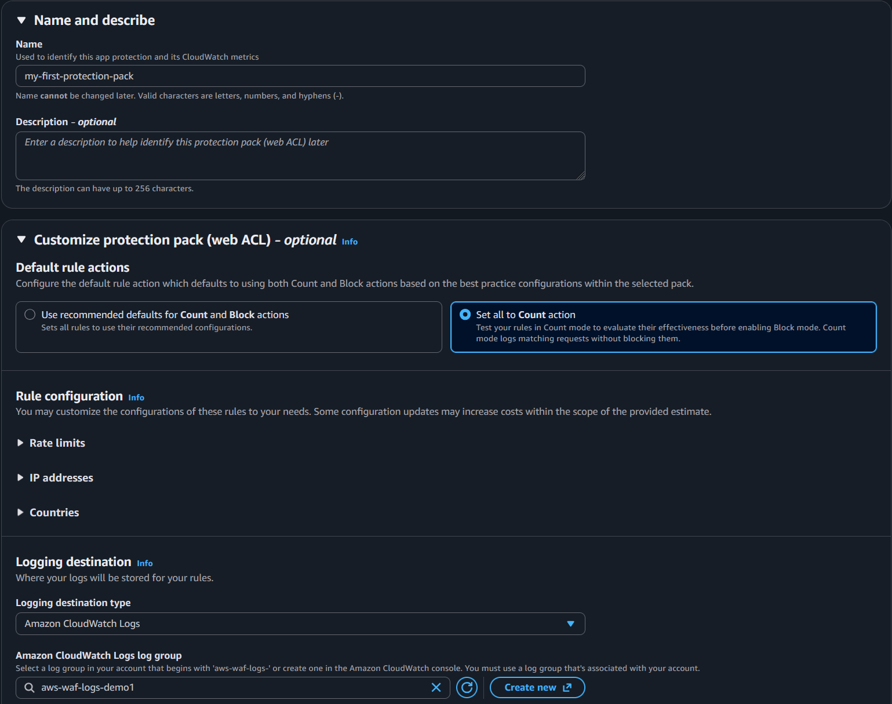

# AWS Managed Rules

[AWS managed rule groups](https://docs.aws.amazon.com/waf/latest/developerguide/aws-managed-rule-groups.html) are maintained by AWS. Standard AWS WAF costs provide the use AWS Managed Rules (baseline and use-case rule groups) with no additional per request costs. Bot Control, Fraud Control, and DDoS Protection rule groups have additional per-request charges. See [AWS WAF pricing](https://aws.amazon.com/waf/pricing/) for current details.

This section covers which managed rule groups to use, how to manage their versions, and how to narrow their scope to optimize cost and reduce false positives.

## Protection Pack Recommendations

When creating a new Protection Pack in the AWS WAF console, the setup wizard offers pre-configured rule packs tailored to your application type. These packs are the fastest way to get started with AWS WAF and are recommended for customers who are deploying WAF for the first time or are unsure which managed rules to enable.

During setup, you first describe your application by selecting an app category (e.g., API & integration services, Enterprise & business applications, etc) and traffic source (API, Web, or Both).

You then choose from three protection levels based on the above selection.  Note, the exact protection pack rules will vary depending on what you selected for app category and app focus:

- **Recommended** — Enables recommended rules for the selected application categories and app focus.  This includes the rules included in the **Essentials** selection.

- **Essentials** — Enable essential rules for the selected application categories and app focus.

- **You build it** — Lets you select and customize individual protections from all available options. Use this if you have specific requirements, are experienced with AWS WAF, or want full control over which rule groups are included from the start.

Regardless of which option you choose, you can always customize the Protection Pack after creation — adding, removing, or modifying rules as needed. The pre-configured packs are a starting point, not a constraint. As you gain experience with your traffic patterns and WAF logs, you should tune your rules following the guidance in the sections below.

After selecting a protection level, the wizard lets you customize common settings in a single step — including the Protection Pack name, default rule actions, rate limit thresholds, IP allow/block lists, and country-based geographic restrictions. This makes it easy to tailor the Protection Pack to your application without navigating multiple configuration pages.  You can always update these through the AWS WAF console or APIs.

## Baseline Rules for All Deployments

The following AWS managed rule groups are recommended for all WAF deployments as a baseline layer of protection.  These are part of the above pre-defined protection pack. This section aims to explain in detail what each provides and considerations specific to your application.

### Anti-DDoS

The [Anti-DDoS managed rule group](https://docs.aws.amazon.com/waf/latest/developerguide/aws-managed-rule-groups-anti-ddos.html) (`AWSManagedRulesAntiDDoSRuleSet`) detects and mitigates application layer (Layer 7) DDoS attacks. It establishes traffic baselines for your protected resources and uses anomaly detection to identify and respond to DDoS events within seconds.

**Why use it**

This rule group provides automated Layer 7 DDoS detection and mitigation without requiring you to write or maintain custom rate-based rules for DDoS scenarios. It learns your normal traffic patterns and responds when traffic deviates significantly from those baselines. It is available to all AWS WAF customers for an additional flat + usage based cost, while AWS Shield Advanced customers can use this AMR on shield protected resources at no additional cost.  

**Considerations**

- Place this rule group first in your protection pack so it can evaluate all traffic before any other rule terminates evaluation.
- The Anti-DDoS AMR can use Challenge actions during detected events to verify clients. Applications with non-browser clients (native mobile apps, SPAs making fetch requests, API clients) may need configuration tuning to avoid legitimate traffic being challenged during an event. See the blog [Configuring the AWS WAF Anti-DDoS managed rule group for your resources and clients](https://aws.amazon.com/blogs/networking-and-content-delivery/configuring-the-aws-waf-anti-ddos-managed-rule-group-for-your-resources-and-clients/) for guidance on tuning for different client types.
- The rule group labels all requests during a detected event, making those labels available for custom rules that can further customize your DDoS response. See the blog [How to customize your response to layer 7 DDoS attacks using AWS WAF Anti-DDoS AMR](https://aws.amazon.com/blogs/security/how-to-customize-your-response-to-layer-7-ddos-attacks-using-aws-waf-anti-ddos-amr/) for practical customization examples.
- This is a WAF managed rule group, not the Shield Advanced service. Shield Advanced provides additional benefits (DDoS cost protection, SRT access, use of this AMR without the additional WAF costs) but is separate mechanically.

### Amazon IP Reputation List

The [Amazon IP reputation list](https://docs.aws.amazon.com/waf/latest/developerguide/aws-managed-rule-groups-ip-rep.html#aws-managed-rule-groups-ip-rep-amazon) blocks requests from IPs that AWS threat intelligence has identified as actively involved in DDoS, reconnaissance, or other malicious activity.

**Why use it**

This is one of the lowest-risk rule groups you can enable. AWS maintains a high confidence bar before adding IPs to this list. It costs nothing beyond the base WAF fee and blocks traffic from sources that are almost certainly not your legitimate users. Enable it on every protection pack.

**Considerations**

- Even if you choose not to block on this rule group, add it in Count mode. The labels it generates in your WAF logs are valuable for retroactive investigation — you can correlate blocked or suspicious requests against known-bad IPs after the fact.
- It is possible for an IP on this list to also serve legitimate users (e.g., a shared VPN or hosting IP). However, if an IP makes this list, *someone* is actively using it for malicious purposes.  Many customer consider this a low/acceptable risk; this is a good example of using labels to create a custom rule to still apply this signal without outright blocking (e.g. an aggresive rate based rule, or WAF challenge)

### Anonymous IP List

The [Anonymous IP list](https://docs.aws.amazon.com/waf/latest/developerguide/aws-managed-rule-groups-ip-rep.html#aws-managed-rule-groups-ip-rep-anonymous) identifies requests from sources that obscure the requestor's identity: Tor exit nodes, VPNs, public proxies, and hosting/cloud providers.  Anonymous IPs are frequently used by bad actors however are also extremly common for legitimate users and businesses; people using VPNs, businesses using the cloud!

**Why use it**

Whether to enforce this rule group depends entirely on who your users are. It contains two distinct rules that should be evaluated independently:

- **AnonymousIPList** (Tor, VPNs, proxies) — Enforce this if your application has no legitimate reason to receive traffic from anonymizing services. B2B endpoints, internal tools, and admin interfaces almost never have legitimate Tor or public VPN traffic. Consumer-facing applications are more nuanced — some users legitimately use VPNs for privacy.
- **HostingProviderIPList** (cloud/hosting IPs) — This rule is recommended for endpoints that exclusively serve end-user browsers on residential or mobile networks. It is not recommended for applications that receive API calls from other services, webhooks, or any server-to-server traffic, as those requests originate from hosting provider IPs and will be blocked. Note: AWS IPs are **not** on this list.

**Considerations**

- Like IP Reputation, this rule group is valuable in Count mode even if you don't block. The labels help you understand what percentage of your traffic comes from anonymizing sources, which informs whether enforcement makes sense.
- A common pattern is to enforce `AnonymousIPList` broadly but only enforce `HostingProviderIPList` on specific endpoints (e.g., login pages) using a label-based custom rule. See [Creating Exceptions](../../operationalizing/docs/index.md#creating-exceptions).

<!-- TODO: What percentage of typical web traffic comes from hosting providers? Would be useful to set expectations for customers evaluating this rule. -->

### Core Rule Set (CRS)

The [Core rule set (CRS)](https://docs.aws.amazon.com/waf/latest/developerguide/aws-managed-rule-groups-baseline.html#aws-managed-rule-groups-baseline-crs) provides broad protection against common web exploits including cross-site scripting (XSS), local file inclusion (LFI), and general request anomalies aligned with OWASP Top 10 categories.

**Why use it**

This is the most impactful baseline rule group for general web application protection. It catches a wide range of attack patterns that apply regardless of your application's technology stack. Your goal should be to enforce as many rules in this group as possible — but it does not need to be every single rule. Some rules will conflict with specific application behaviors, and that's expected.

**Considerations**

CRS is the rule group most likely to produce false positives, because it inspects request content broadly and has the most rules of any AMR today. Common friction points:

- **`SizeRestrictions_BODY`** — Blocks requests with a body over 8 KB. Any endpoint that accepts file uploads, large JSON payloads, or form submissions with rich text will hit this. You'll almost certainly need to handle this rule with a label-based exception scoped to specific upload URIs.
- **`CrossSiteScripting_BODY`** — Triggers on content that resembles HTML/script tags. File uploads (`.docx`, `.xml`, `.svg`) and rich text editors commonly produce false positives here because they contain `<tag>` patterns that look like XSS to the signature.
- **`CrossSiteScripting_QUERYARGUMENTS`** and **`CrossSiteScripting_COOKIE`** — Less commonly triggered but can fire on applications that pass HTML fragments or encoded content in query strings or cookies.

When a CRS rule triggers on legitimate traffic, you have two options:

1. If the rule genuinely does not apply to your application (e.g., `SizeRestrictions_BODY` on an endpoint designed to accept large file uploads), leave the rule in Count mode or disabled for that protection pack.
2. If the rule is relevant but triggers on specific legitimate requests, use the [label-based exception pattern](../../operationalizing/docs/index.md#creating-exceptions) to exclude those specific URIs or request patterns while keeping the rule enforced everywhere else.

<!-- TODO: Are there other CRS rules that commonly cause false positives beyond SizeRestrictions and XSS? e.g., EC2MetaDataSSRF, RestrictedExtensions? Would be good to document the top 5 most common FP-causing rules. -->

### Known Bad Inputs

The [Known bad inputs](https://docs.aws.amazon.com/waf/latest/developerguide/aws-managed-rule-groups-baseline.html#aws-managed-rule-groups-baseline-known-bad-inputs) rule group blocks request patterns associated with known exploits and vulnerability discovery — things like Log4j JNDI injection and common exploit payloads.

**Why use it**

This rule group detects patterns that are associated with known exploits and active vulnerability scanning. The signatures target specific, well-documented attack techniques — the kind of requests that have no legitimate reason to appear in normal application traffic. It frequently has a low false positive rate and low WCU cost, making it a good candidate to enforce early in a deployment.

**Considerations**

- The most commonly reported false positive is **`Log4JRCE_BODY`**, which matches on request bodies containing `${...}` patterns. This can fire on legitimate content that uses similar syntax — template engines, log data, or configuration payloads. If you encounter this, use the [label-based exception pattern](../../operationalizing/docs/index.md#creating-exceptions) to exclude the specific URI while keeping the rule enforced everywhere else.
- Beyond Log4j, this rule group also catches things like path traversal attempts in headers and known exploit payloads. These are patterns you usually want blocked regardless of whether your application is vulnerable to them.

## Use-Case Specific Rules

Unlike the baseline rule groups above, use-case specific rule groups ideally are only enabled when they match your application's technology stack. Adding rule groups that do not apply to your application consumes WCU capacity (potentially increasing WAF usage costs) and in some cases can introduce unnecessary false positives.

**When to use these rule groups:**

- Your application runs on or interfaces with the specific technology the rule group protects.

### SQL Database

The [SQL database](https://docs.aws.amazon.com/waf/latest/developerguide/aws-managed-rule-groups-use-case.html#aws-managed-rule-groups-use-case-sql-db) rule group (`AWSManagedRulesSQLiRuleSet`, 200 WCU) detects SQL injection patterns across query parameters, request body, cookies, and URI path.

**Why use it**

SQL injection remains one of the most common and damaging web application vulnerabilities. If your application talks to any SQL database — Amazon RDS, Aurora, self-managed MySQL/PostgreSQL, or even a SQL-based data warehouse — enable this rule group. The 200 WCU cost is justified by the severity of what it protects against: unauthorized data access, data modification, and in some cases remote code execution.

**Considerations**

- This rule group performs SQL injection inspection across query parameters, request body, cookies, and URI path at a low sensitivity level. This means it catches well-known SQLi patterns while minimizing false positives, but it may not detect more subtle or obfuscated injection attempts.
- If you need stricter SQLi enforcement, you can configure a custom rule using the [SQLi match statement](https://docs.aws.amazon.com/waf/latest/developerguide/waf-rule-statement-type-sqli-match.html) with a higher sensitivity level and scope it to the specific request components and URIs that matter for your application.
- If you only need to inspect for SQL injection in a specific place (URI, Query String, Body), while you can use this AMR, you can create a custom rule that inspects for SQLi against that component only.  This can reduce your WCU requirements (from 200 to 20).
- Body inspection is subject to the protection pack's body size limit. Requests with bodies larger than the inspection limit are not fully inspected. See [Handling Large HTTP Requests](../../custom-rules/docs/index.md#handling-large-http-requests) for how to handle this.

### Linux Operating System

The [Linux operating system](https://docs.aws.amazon.com/waf/latest/developerguide/aws-managed-rule-groups-use-case.html#aws-managed-rule-groups-use-case-linux-os) rule group (`AWSManagedRulesLinuxRuleSet`, 200 WCU) detects Linux-specific exploitation patterns including local file inclusion (LFI) attempts targeting system files.

**Why use it**

If any part of your stack runs on Linux — enable this rule group. It catches attempts to read sensitive system files like `/etc/passwd`, `/proc/self/environ`, and similar paths that attackers use to extract credentials, environment variables, or system information. Pair it with the POSIX rule group for broader OS-level coverage.

**Considerations**

- ...

### POSIX Operating System

The [POSIX operating system](https://docs.aws.amazon.com/waf/latest/developerguide/aws-managed-rule-groups-use-case.html#aws-managed-rule-groups-use-case-posix-os) rule group (`AWSManagedRulesUnixRuleSet`, 100 WCU) detects command injection and LFI patterns common to POSIX-like operating systems.

**Why use it**

This complements the Linux rule group by catching shell command injection patterns — things like command chaining (`;`, `&&`, `|`), shell variable expansion (`$HOME`, `$PATH`), and backtick execution. At only 100 WCU, it's an inexpensive addition. Enable it alongside the Linux rule group for any Linux-based application.

**Considerations**

- Applications that legitimately accept shell-like syntax in request parameters can trigger false positives — developer-facing tools, CI/CD interfaces, and APIs that accept configuration snippets.

### Windows Operating System

The [Windows operating system](https://docs.aws.amazon.com/waf/latest/developerguide/aws-managed-rule-groups-use-case.html#aws-managed-rule-groups-use-case-windows-os) rule group (`AWSManagedRulesWindowsRuleSet`, 200 WCU) detects Windows-specific exploitation patterns including PowerShell injection and Windows shell command execution.

**Why use it**

Enable this if your application runs on Windows — IIS, .NET on Windows, or any Windows-based compute. If your stack is Linux-based, the attack patterns this rule group detects don't match vulnerabilities your application could be exploited by.  

**Considerations**

- False positives can occur on admin interfaces or management consoles that accept PowerShell-like syntax or Windows command patterns in request fields. Scope exceptions to those specific endpoints.
- If your application runs on Windows but is fronted by a Linux-based reverse proxy or load balancer, you still want this rule group — the attack payloads target the backend application, not the proxy.

### PHP Application

The [PHP application](https://docs.aws.amazon.com/waf/latest/developerguide/aws-managed-rule-groups-use-case.html#aws-managed-rule-groups-use-case-php-app) rule group (`AWSManagedRulesPHPRuleSet`, 100 WCU) detects PHP-specific exploitation patterns including injection of unsafe PHP functions and access to PHP superglobals.

**Why use it**

Enable this if PHP is anywhere in your stack — applications built directly in PHP, or PHP-based CMS platforms like WordPress, Drupal, or Joomla. Even if your primary application isn't PHP, if you have a WordPress blog or a PHP-based admin tool on the same protection pack, this rule group adds value.

**Considerations**

- Do not enable this for non-PHP applications. The signatures are PHP-specific and provide no value for Python, Java, Node.js, or other stacks.

### WordPress Application

The [WordPress application](https://docs.aws.amazon.com/waf/latest/developerguide/aws-managed-rule-groups-use-case.html#aws-managed-rule-groups-use-case-wordpress-app) rule group (`AWSManagedRulesWordPressRuleSet`, 100 WCU) detects exploitation patterns specific to WordPress sites.

**Why use it**

Enable this if you run WordPress. This rule group protects WordPress features and common extensions that are frequently targeted for abuse.

**Considerations**

- Use alongside the SQL Database and PHP Application rule groups for layered coverage.
- Some rules in this group may conflict with WordPress features or plugins your site actively uses. Review rules that trigger in Count mode and create label-based exceptions where needed.

## Bot Control

[AWS WAF Bot Control](https://docs.aws.amazon.com/waf/latest/developerguide/waf-bot-control.html) provides managed rule groups that detect and manage bot traffic at multiple levels of sophistication. Bot Control is available at two levels: Common (for self-identifying bots, known bot signatures, and Web Bot Authentication) and Targeted (for sophisticated bots using machine learning-based behavioral analysis). Both levels have additional per-request charges beyond the base WAF fee.

Bot Control is a deep topic with significant strategy decisions around Common vs. Targeted levels, scope-down design, and custom rules that work alongside Bot Control labels. For detailed guidance, see the dedicated [Bot Management](../../bot-management/docs/index.md) section. For where Bot Control fits in your rule evaluation order, see [Recommended WAF Rule Order](../../recommended-waf-rule-order/docs/index.md).

## Fraud Control

AWS WAF Fraud Control provides two managed rule groups that protect login and account creation pages from credential-based attacks. Both rule groups have additional per-request charges and work best with the AWS WAF application integration for token-based client verification. See [CAPTCHA and Challenge](../../captcha-and-challenge/docs/index.md) for details on application integration, when it is recommended, and what the implications are if you choose not to implement it. Fraud Control is not available for Amazon Cognito user pools.

**Account Takeover Prevention (ATP)**

The [Account Takeover Prevention (ATP)](https://docs.aws.amazon.com/waf/latest/developerguide/waf-atp.html) rule group (`AWSManagedRulesATPRuleSet`) inspects login attempts sent to your application's login endpoint. ATP checks email and password combinations against a stolen credential database that is updated regularly as new leaked credentials are found on the dark web. It also aggregates data by IP address and client session to detect and block clients that send too many suspicious login requests.

Fraud prevention is a deep topic with significant application specific context and implementation steps.  For deatiled guidance, see the dedicated [Fraud Prevention](../../fraud-prevention/docs/index.md) section.  For where Fraud prevention fits into your rule evaluation order, see [Recommended WAF Rule Order](../../recommended-waf-rule-order/docs/index.md).

**Account Creation Fraud Prevention (ACFP)**

The [Account Creation Fraud Prevention (ACFP)](https://docs.aws.amazon.com/waf/latest/developerguide/waf-acfp.html) rule group (`AWSManagedRulesACFPRuleSet`) inspects account creation attempts sent to your application's sign-up endpoint. ACFP monitors sign-up requests for anomalous activity and automatically blocks suspicious requests. It uses request identifiers, behavioral analysis, and machine learning to detect fraudulent account creation. ACFP also checks email and password combinations against a stolen credential database, evaluates the domains used in email addresses, and monitors phone numbers and address fields for fraudulent patterns.

Fraud prevention is a deep topic with significant application specific context and implementation steps.  For deatiled guidance, see the dedicated [Fraud Prevention](../../fraud-prevention/docs/index.md) section.  For where Fraud prevention fits into your rule evaluation order, see [Recommended WAF Rule Order](../../recommended-waf-rule-order/docs/index.md).

## Managed Rules from AWS Partners

!!! warning "Future Content Updates in progress"
    The sections below this point are actively being updated and may be incomplete.  Please come back soon or reference public docs for AWS WAF in the meantime.  

You can subscribe to [managed rules provided by AWS partners](https://docs.aws.amazon.com/waf/latest/developerguide/marketplace-managed-rule-groups.html) using AWS Marketplace.  Marketplace AWS Partner rules are always paid rules and have a flat and/or usage cost above and beyond AWS WAF itself.

**Considerations**  
-You can use Partner Managed Rules and Amazon Managed Rules together; it isn't a one or the other.

Customers already using or familiar with a 3P WAF provider can get a consistent rule experience while leveraging the native integrations and scaling capabilities of AWS WAF.  AWS has AMRs that in many cases provide the same type of protection however there are several partner managed rules that provide unique functionality such as [F5 Rules for AWS WAF - Common Vulnerabilities & Exposures (CVE) Rules](https://aws.amazon.com/marketplace/pp/prodview-y4tlpqpjpm4qi).

AWS provides many AMRs which have no usage cost.  Marketplace WAF rules have an additional flat and/or usage based cost; consider evaluating Amazon Managed that match your requirements first/in addition to partner rules.

Parnter Managed rules *tend* to have high WCU.  This is not a technical issue however AWS WAF costs are driven by total WCU of a WebACL.  
The recommended AWS WAF [protection pack](../../aws-managed-rules/docs/index.md#protection-pack-recommendations) is 1,498 WCU ($0.6/million usage cost) by comparision.  There are several Partners where enabling all of their PMRs would cost 4,000 WCU ($1.60/million) + Marketplace Usage costs.

## Managed Rule Group Versioning

!!! warning "Future Content Updates in progress"
    The sections below this point are actively being updated and may be incomplete.  Please come back soon or reference public docs for AWS WAF in the meantime.  

Over time, Amazon Managed Rules change signature definitions and/or add new capabilities to existing AMRs.  AWS releases these changes as versions of these AMRs, giving you control over when these new signatures and/or capabilites become active.  IP based rules including [IP Reputation](./index.md#### IP Reputation List) and [Anonymous IP](./index.md#### Anonymous IP List) update frequently with IP only changes, this is NOT versioned.  Updates to these AMRs such as the addition of a new rule or change in default action would result in a version as a new capability.

### Default vs. Static Versioning

!!! warning "Future Content Updates in progress"
    The sections below this point are actively being updated and may be incomplete.  Please come back soon or reference public docs for AWS WAF in the meantime.  

When using the **default version**, the managed rule group provider controls which version is active. New versions are rolled out automatically after a notification period. This is the simplest approach however introduces untested changes and increases the risk of a false positive due to a signature update impacting applications.

When using a **static version**, you explicitly select which version to use. This gives you full control over when updates are applied, allowing you to test new versions in a non-production environment before promoting them. Static versions can eventually expire; you must ensure you keep up as versions are released.

**Considerations**
AWS recommends using static, tested against your applications of AMRs.  The default version for AMRs is set by AWS and while this usually is updated after ~7 days, in some cases we may update this much sooner or later.  For example, when log4j came out, the KnownBadInputs default version was updated to the latest version in ~24 hours.  The most common pattern is use static versions in production but set non-production to default or otherwise updating these first.  This provides time to validate if there updates to signatures or new functionality in an AMR impacts your applications and exceptions are required.

### Subscribing to SNS Notifications

Whether you use default or static versioning, [subscribe to notifications](https://docs.aws.amazon.com/waf/latest/developerguide/waf-using-managed-rule-groups-sns-topic.html) of new versions. This informs you about upcoming changes to give you time to test them before they become the new default.

When using a static version, it's also important to subscribe to notifications so you are aware of new static versions. Keep your version up to date to ensure your applications have the most current protections.

**Considerations**
This is critical to remain aware of AMR versions and other operational/rule functionality actions.  AWS also publishes this to a changelog however the SNS notifications will have the most up to date information about changes related to AMRs.

### Version Expiration

[Track version expiration](https://docs.aws.amazon.com/waf/latest/developerguide/waf-using-managed-rule-groups-expiration.html) to make sure you aren't forced to upgrade before you test. When a static version expires, AWS WAF automatically moves you to the default version, which may include rule changes you haven't tested.

### Monitoring Version Expiration with CloudWatch Alarms

AWS WAF publishes the `DaysToExpiry` CloudWatch metric for each managed rule group that uses a static version. You can create a CloudWatch alarm on this metric to alert you before a version expires, giving you time to test and upgrade proactively rather than being automatically moved to the default version.

To set up a version expiration alarm:

1. Open the [CloudWatch console](https://console.aws.amazon.com/cloudwatch/) in the same region as your Protection Pack (US East N. Virginia for CloudFront).
2. Create a new alarm using the `AWS/WAFV2` namespace and the `DaysToExpiry` metric.
3. Filter by your Protection Pack name (`WebACL`), region (`Region`), and managed rule group name (`ManagedRuleGroup`).
4. Set the alarm threshold to trigger when `DaysToExpiry` is less than or equal to your desired lead time (e.g., 30 days gives you a month to test and upgrade).
5. Configure an SNS notification to alert your security or operations team.

Combine this alarm with the [SNS version notifications](#subscribing-to-sns-notifications) above for complete coverage — SNS tells you when a new version is available, and the CloudWatch alarm tells you when your current version is approaching expiration.

### IP Reputation Rule Groups

The AWS-managed [IP reputation rule groups](https://docs.aws.amazon.com/waf/latest/developerguide/aws-managed-rule-groups-ip-rep.html) do not use versions. These rule groups are updated frequently based on the evolution of Amazon threat intelligence. No version management is required for these rule groups.

## Using Scope-Down Statements

!!! warning "Future Content Updates in progress"
    The sections below this point are actively being updated and may be incomplete.  Please come back soon or reference public docs for AWS WAF in the meantime.  
    
A [scope-down statement](https://docs.aws.amazon.com/waf/latest/developerguide/waf-rule-scope-down-statements.html) is a statement that you add inside a managed rule group or a rate-based rule to narrow the set of requests that are evaluated.

Use scope-down statements on advanced managed rule groups like Bot Control and Fraud Protection to specify which requests should be evaluated by the rule group. This is an effective way of optimizing your cost since you will not be charged for requests that are excluded by the scope-down statement.

See [How to customize behavior of AWS Managed Rules for AWS WAF](https://aws.amazon.com/blogs/security/how-to-customize-behavior-of-aws-managed-rules-for-aws-waf/) for more information on scope-down statements.

**Considerations**
Scope-down is recommended for paid AMRs such as BotControl.  While not techincally required, most customers will not need or want these to be processed (for cost but possibly technical reasons) on every single request.  The primary exception is if you are using AWS WAF along with CloudFront and a [CloudFront Flat-rate pricing plan](https://docs.aws.amazon.com/AmazonCloudFront/latest/DeveloperGuide/flat-rate-pricing-plan.html) that provides that AMR.  In this case, there is no cost consideration, scope down should only be for technical reasons in this case.

Scoping down is an effective way create an exception list for IP based AMRs such as the [Anonymous IP list](https://docs.aws.amazon.com/waf/latest/developerguide/aws-managed-rule-groups-ip-rep.html#aws-managed-rule-groups-ip-rep-anonymous) and [Amazon IP reputation list](https://docs.aws.amazon.com/waf/latest/developerguide/aws-managed-rule-groups-ip-rep.html#aws-managed-rule-groups-ip-rep-amazon).  Even if you do not today have any exceptions, establishing an IPSet and scoping down these AMRs to NOT apply to that IPSet allows you operationally to quickly make exceptions.

Scope-down is **NOT** recommended to handle false positives for non-IP based AMRs as scope-down applies to the entire AMR.  For example, if the rule SizeRestrictions_BODY within CommonRuleSet is triggering on an upload endpoint (e.g. /upload), if you scope down CommonRuleSet to **NOT** apply when the uri = /upload, other rules such as CrossSiteScripting_BODY are not checked for or labeled.  Instead, you should set this rule to a COUNT action and create a false positive exception as described in [Creating Exceptions](../../operationalizing/docs/index.md#creating-exceptions)

