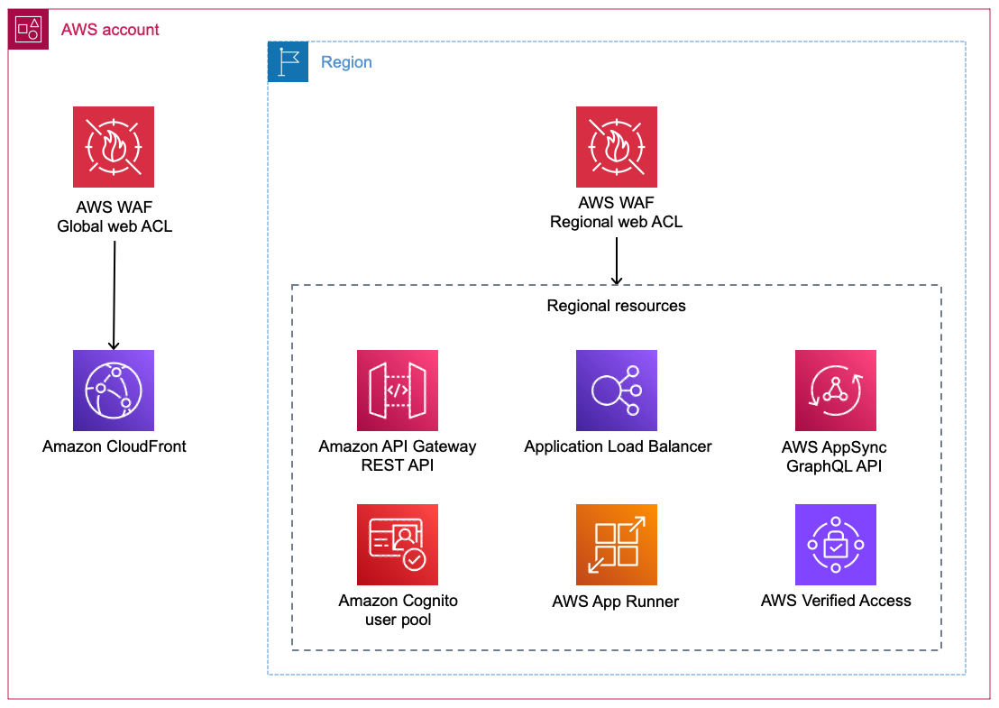

# 사전 요구 사항 및 기본 사항

## 기본 사항

### Protection Pack

Protection Pack은 WAF 규칙을 포함하는 최상위 AWS WAF 리소스입니다. 별도의 네트워크 홉으로 인라인에 위치하는 기존 WAF 어플라이언스와 달리, AWS WAF는 네트워크 경로에 배포하는 독립형 장치가 아닙니다. 대신, Protection Pack을 지원되는 AWS 리소스(CloudFront 배포, Application Load Balancer, API Gateway 등)와 연결하면 AWS WAF가 해당 리소스의 요청 처리의 일부로 요청을 평가합니다. 프로비저닝, 스케일링 또는 유지할 추가 인프라가 없습니다. 연결되면 해당 리소스에 대한 모든 HTTP 요청이 애플리케이션에 도달하기 전에 Protection Pack의 규칙에 대해 평가됩니다. Protection Pack은 각 요청에 대해 수행할 작업을 결정합니다: 허용, 차단, 챌린지 또는 모니터링을 위해 카운트.

Protection Pack에는 다음이 포함됩니다:

- **규칙 및 규칙 그룹** - 요청을 검사하고 작업을 수행하는 개별 규칙 또는 규칙 모음(Amazon 관리형 규칙 포함).
- **기본 작업** - 종료 작업이 있는 규칙과 일치하지 않는 요청에 대한 처리(일반적으로 *Allow*).
- **규칙 우선순위 순서** - 규칙은 가장 낮은 번호에서 가장 높은 번호 순으로 우선순위에 따라 평가됩니다. 일치하는 종료 작업이 있는 첫 번째 규칙이 요청의 결과를 결정합니다.

### 기본 작업

Protection Pack에 종료 작업(**Allow** 또는 **Block**)이 있는 일치하는 규칙이 없으면, Protection Pack은 [기본 작업](https://docs.aws.amazon.com/waf/latest/developerguide/web-acl-default-action.html)을 수행합니다. 가능한 기본 작업은 *Allow*와 *Block* 두 가지입니다.

기본 작업이 **Allow**인 경우, WAF 규칙은 일반적으로 악의적이거나 원치 않는 트래픽을 **Block**하면서 나머지를 모두 허용합니다. 명시적 **Allow** 작업 규칙이 있을 수도 있지만, 일반적으로 규칙은 규칙과 일치하는 요청을 **Block**, **Challenge** 또는 **Captcha**합니다.

기본 작업이 **Block**인 경우, 트래픽을 명시적으로 **Allow**해야 할 때를 정의하는 WAF 규칙을 정의합니다. 트래픽을 명시적으로 차단하는 규칙도 정의할 수 있습니다. 예를 들어, 특정 IP 범위의 요청이나 특정 값을 포함하는 요청만 허용하고 싶을 수 있습니다. 이것은 포지티브 보안 모델이라고도 합니다.

**고려 사항**
대다수의 고객이 기본 작업을 *Allow*로 설정하는데, 이것이 더 직관적인 경향이 있기 때문입니다. 기본 작업을 *block*으로 설정하면, 일반적으로 애플리케이션별 규칙을 생성하고 유지해야 합니다. 특히 조직 전체에서 AWS WAF를 사용하는 경우 이를 유지하기 어려울 수 있습니다.

### WCU - WAF 용량 단위

WCU는 WAF 규칙의 복잡성을 단일 차원으로 추상화합니다. 사용자 정의 인라인 규칙 및 사용자 정의 규칙 그룹의 경우, 규칙 유형(비율 기반, 지역 등), 문 수, 매치 유형(문자열 일치, 정규식 패턴), 변환(CSS_DECODE, HEX_DECODE 등)에 각각 특정 WCU 비용이 있습니다. 사용자 정의 규칙 그룹처럼 Amazon 관리형 규칙에도 설정된 WCU가 있습니다. 이는 [AMR 버전](../../aws-managed-rules/docs/index.md#managed-rule-group-versioning) 간에 변경되지 않습니다.

WCU는 Protection Pack 내에서 효과적으로 사용할 수 있거나 사용자 정의 규칙 그룹 내에서 정의할 수 있는 WAF 규칙의 최대량을 결정하는 데 사용됩니다.

Protection Pack은 인라인, 규칙 그룹, Amazon 관리형 규칙 및/또는 파트너 관리형 규칙의 최대 5,000 WCU를 가질 수 있습니다. 이 제한은 증가할 수 없습니다. 이 제한은 Protection Pack별이며 정의된 protection pack이나 규칙 그룹에 걸쳐 추적되지 않습니다.

AWS WAF 사용자 정의 규칙 그룹은 WCU 최대 용량을 정의해야 합니다. 이 용량은 생성 후 변경할 수 없습니다. 규칙 그룹의 WCU를 효과적으로 변경하려면 새 WCU 값으로 새 규칙 그룹을 생성하고 protection pack이 해당 새 규칙 그룹을 사용하도록 전환해야 합니다. 규칙 그룹은 포함하는 규칙(있는 경우)의 실제 WCU 사용량에 관계없이 Protection Pack 내에서 지정된 WCU 용량을 소비합니다. 각 규칙 그룹은 최대 5,000 WCU를 가질 수 있습니다. 이 제한은 규칙 그룹별이며, 구성할 수 있는 WCU 양에 대한 계정/리전 제한은 없습니다.

어떤 이유로 5,000 WCU 이상의 WAF 규칙 평가가 필요한 경우, AWS WAF를 지원하는 두 개의 리소스가 필요합니다. 예를 들어, protection pack이 있는 CloudFront와 오리진으로 Application Load Balancer(역시 WAF 포함). **참고:** 이것은 일반적으로 안티 패턴을 나타내며 WCU 요구를 최적화할 방법이 있을 가능성이 높습니다.

WCU는 AWS WAF 요청 기반 비용을 결정할 때도 사용됩니다. 표준 WAF 비용은 처음 1,500 WCU를 포함하며 1,500 이상의 500 WCU당 추가 사용량 기반 비용이 있습니다. 자세한 내용은 [WAF 비용](../../waf-cost/docs/index.md#wcu-overage)을 참조하세요.

### WAF 레이블

WAF 규칙이 일치하면, 해당 규칙은 하나 이상의 레이블을 추가할 수 있습니다. 규칙이 레이블을 추가하지만 요청을 종료하지 않는 경우(즉, 작업 = *COUNT*), 이러한 레이블은 AND/OR 문 또는 범위 축소 문과 같은 다른 규칙에서 참조할 수 있습니다. Amazon 관리형 규칙은 규칙이 일치할 때 항상 하나 이상의 레이블을 추가합니다. 사용자 정의 규칙은 규칙이 일치할 때 레이블을 첨부할 수 있지만 필수는 아닙니다. 기본적으로 WAF 레이블은 WAF에 의해 평가되는 요청에 대해서만 사용 가능하며 WAF 로그의 일부입니다. 사용자 정의 WAF 규칙을 구성하여 헤더로 삽입하지 않는 한 애플리케이션은 WAF 레이블을 *수신하지 않습니다*.

레이블의 용도:
* 오탐 처리
* 로직 단순화(예: A 또는 B 또는 C 또는 D인 경우)
* 구성된 로깅 대상으로 보내는 WAF 로그 필터링
* WAF 로그에 포함(관찰 가능성)

## Protection Pack 소유권

간단한 조직이거나 AWS WAF 채택이 제한적인 경우, 애플리케이션 팀이 일반적으로 자체 AWS WAF 규칙을 관리합니다. Protection Pack을 생성하고 내부의 모든 규칙을 소유합니다. AWS WAF 로그도 자체 계정에 유지하는 경향이 있습니다.

대규모 조직은 회사 전체의 보안 요구 사항이 있어 최소 또는 기본 AWS WAF 규칙 세트로 변환됩니다. 보안 또는 기타 중앙 팀이 해당 기준을 정의한 다음 조직 내에서 해당 기준 규칙을 감사 및/또는 적용합니다. 이러한 감사 및 적용 요구를 달성하기 위해 일반적으로 AWS Firewall Manager 보안 정책이 사용됩니다. AWS Firewall Manager는 필요에 따라:
1) 지원되는 리소스에 Protection Pack을 생성하고 연결합니다
2) 애플리케이션 팀이 정의한 Protection Pack 위에 이러한 기준 규칙을 적용합니다.

AWS WAF 로그는 일반적으로 중앙 S3 버킷 또는 타사 SIEM/모니터링 솔루션에 통합됩니다. S3의 경우, 이것은 리전별, 단일 버킷 및/또는 데이터 레이크(예: Amazon Security Lake)의 일부일 수 있습니다.

## 사용할 Protection Pack 수

AWS WAF Protection Pack은 CloudFront 배포 또는 Application Load Balancer와 같은 애플리케이션 리소스에 연결됩니다. Protection Pack은 동일한 계정, 리전, 범위(글로벌 vs 리전) 내의 하나 이상의 리소스에 연결할 수 있습니다. 계정, 리전 또는 범위에 걸쳐 WebACL을 공유할 수 없습니다. 언제 Protection Pack을 공유하거나 전용으로 사용해야 할까요? 답은 단순성, 격리, 비용 간의 선택입니다.

이 선택은 가장 합리적인 접근 방식이 변경되면 쉽게 변경할 수 있습니다. 리소스를 새 Protection Pack에 연결하면 해당 리소스의 데이터 플레인이 중단되지 않으며, Protection Pack 간의 기능적 규칙 변경 외에는 리소스가 보호되지 않는 상태가 되지 않습니다.

### 공유 Protection Pack(여러 리소스에 하나의 Protection Pack)

이것은 소규모 고객, 처음 시작할 때, 또는 SaaS나 ISV 테넌트별 엔드포인트 제품과 같이 동일한 애플리케이션의 여러 복사본이 있는 경우에 가장 일반적입니다.

**장점:**

- **더 간단한 규칙 관리** - WAF 규칙을 한 번 정의하면 모든 연결된 리소스에 적용됩니다. 변경 사항은 여러 Protection Pack을 업데이트할 필요 없이 모든 보호된 리소스에 전파됩니다.
- **더 낮은 기본 비용** - 연결된 리소스 수에 관계없이 Protection Pack당 월 $5 요금과 규칙당 월 $1 요금을 한 번만 지불합니다.
- **일관된 보안 태세** - 공유 Protection Pack 뒤의 모든 애플리케이션이 동일한 기본 보호를 받아 조직 보안 표준을 균일하게 적용하기가 더 쉽습니다.
- **공유로 인한 성능 영향 없음** - 많은 리소스를 단일 Protection Pack에 연결해도 WAF 성능이나 서비스 할당량 문제가 없습니다.

**단점:**

- **더 큰 영향 범위** - 잘못 구성된 규칙이나 문제가 있는 관리형 규칙 업데이트가 Protection Pack을 공유하는 모든 애플리케이션에 한 번에 영향을 미칩니다.
- **더 복잡한 애플리케이션별 규칙** - 사용자 정의 규칙은 의도하지 않은 애플리케이션에 적용되지 않도록 올바른 호스트 이름 및/또는 URI로 범위를 지정해야 합니다.
- **더 높은 WCU 소비** - 다른 애플리케이션에 필요한 규칙이 동일한 Protection Pack에 누적되어 표준 WAF 요금에 포함된 1,500 WCU 이상으로 밀어올릴 수 있습니다.
- **조정 오버헤드** - 모든 규칙 변경은 Protection Pack을 공유하는 팀 간의 합의가 필요합니다.

### 전용 Protection Pack(애플리케이션당 하나의 Protection Pack)

이것은 많은 제품 또는 앱 팀이 있고, 환경에서 많은 고유한 애플리케이션이 실행되며, 애플리케이션 팀이 AMR과 일반 기준 규칙만이 아닌 애플리케이션별 규칙이 있는 대규모 기업에서 일반적입니다.

**장점:**

- **더 작은 영향 범위** - 잘못 구성된 규칙이나 문제가 있는 관리형 규칙 업데이트가 해당 Protection Pack에 연결된 단일 애플리케이션에만 영향을 미칩니다.
- **더 간단한 애플리케이션별 규칙 및 예외** - Protection Pack이 하나의 애플리케이션에만 적용되므로 사용자 정의 규칙과 오탐 예외를 특정 호스트 이름이나 URI로 범위를 지정할 필요가 없습니다.
- **IaC 정렬** - 애플리케이션 팀이 공유 스택에 대한 변경을 조정하는 대신 애플리케이션의 인프라 스택의 일부로 Protection Pack을 정의할 수 있습니다.
- **Protection Pack당 더 낮은 WCU 압력** - 공유 Protection Pack에서는 여러 애플리케이션의 사용자 정의 규칙과 예외가 동일한 Protection Pack에 누적되어 WCU 소비를 높입니다. 전용 Protection Pack은 각각 자체 애플리케이션에 관련된 예외와 사용자 정의 규칙만 포함하므로 이를 방지합니다.
- **독립적인 규칙 발전** - 각 애플리케이션이 다른 애플리케이션에 영향을 미치지 않고 자체 일정에 따라 새 AMR 버전을 채택하고, 규칙을 조정하고, 변경 사항을 배포할 수 있습니다.

**단점:**

- **Protection Pack별 고정 비용** - 각 Protection Pack에는 월별 고정 요금($5/월)과 규칙당 요금($1/월)이 있습니다. 일반 기준 규칙이 많은 Protection Pack에 걸쳐 복제되면 이러한 고정 비용이 누적됩니다.
- **기준 적용을 위한 추가 서비스/자동화 필요** - AWS Firewall Manager와 같은 도구 없이는 모든 애플리케이션 팀이 일관된 기준 규칙을 포함하도록 하려면 조정과 검토가 필요합니다.

### 기준 비용이 결정을 좌우하지 않는 경우

Protection Pack 기준 요금, 사용자 정의 규칙, 사용자 정의 규칙 그룹, 무료 Amazon 관리형 규칙이 이 결정에 대한 비용을 좌우하지 않는 두 가지 시나리오:

- **AWS Shield Advanced 고객**은 Shield 보호 리소스에 대해 Protection Pack별, 사용자 정의 규칙별, 사용자 정의 규칙 그룹별 또는 무료 Amazon 관리형 규칙 규칙별 요금을 지불하지 않습니다.
- **[CloudFront 정액 요금제](https://docs.aws.amazon.com/AmazonCloudFront/latest/DeveloperGuide/flat-rate-pricing-plan.html) 고객** - 해당 정액 요금제 등급 내의 Protection Pack 및 규칙에는 표준 AWS WAF 비용이 없습니다(정액 요금제에 포함됨).

이러한 시나리오에서 결정은 비용이 아닌 영향 범위, 규칙 관리 복잡성, 운영 소유권에 따라 달라집니다.

## AWS WAF로 보호할 리소스 식별

일반적으로 모든 공개 HTTP 워크로드를 AWS WAF로 보호하는 것을 목표로 해야 합니다. AWS WAF로 기본적으로 보호할 수 있는 리소스 유형을 이해하는 것이 중요합니다. AWS WAF(CloudFront와 함께 사용 시)는 AWS, 다른 클라우드/호스팅 프로바이더, 온프레미스에 호스팅되는지 여부에 관계없이 모든 HTTP 애플리케이션을 보호할 수 있다는 점도 이해하는 것이 중요합니다.

### AWS WAF를 지원하는 AWS 리소스

AWS WAF는 [많은 AWS 서비스와 기본적으로 통합](https://docs.aws.amazon.com/waf/latest/developerguide/how-aws-waf-works-resources.html)됩니다. 보호하려는 리소스에 Protection Pack을 연결하기만 하면 됩니다.

**그림 1:** AWS와 연결할 수 있는 글로벌 및 리전 AWS 리소스

- **[Amazon CloudFront](https://docs.aws.amazon.com/AmazonCloudFront/latest/DeveloperGuide/Introduction.html)** - 전 세계 엣지 로케이션에 웹 콘텐츠를 캐싱하여 사용자에게 전달을 가속화하는 글로벌 콘텐츠 전달 네트워크(CDN). CloudFront는 AWS WAF가 지원하는 유일한 글로벌 리소스 유형입니다. Protection Pack은 US East(N. Virginia)에서 생성되어야 합니다.
- **[Application Load Balancer(ALB)](https://docs.aws.amazon.com/elasticloadbalancing/latest/application/introduction.html)** - 요청 콘텐츠에 따라 EC2 인스턴스, 컨테이너, Lambda 함수와 같은 대상에 HTTP/HTTPS 트래픽을 라우팅하는 리전 로드 밸런서.
- **[Amazon API Gateway REST API](https://docs.aws.amazon.com/apigateway/latest/developerguide/welcome.html)** - 모든 규모에서 REST API를 생성, 게시, 관리하기 위한 완전 관리형 서비스.
- **[AWS AppSync GraphQL API](https://docs.aws.amazon.com/appsync/latest/devguide/what-is-appsync.html)** - 여러 소스의 데이터에 안전하게 접근, 조작, 결합하기 위한 유연한 API 계층을 제공하여 애플리케이션 개발을 단순화하는 관리형 GraphQL 서비스.
- **[Amazon Cognito 사용자 풀](https://docs.aws.amazon.com/cognito/latest/developerguide/cognito-user-identity-pools.html)** - 웹 및 모바일 애플리케이션을 위한 가입, 로그인, 접근 제어를 제공하는 사용자 디렉토리.
- **[AWS App Runner 서비스](https://docs.aws.amazon.com/apprunner/latest/dg/what-is-apprunner.html)** - 인프라를 관리하지 않고 컨테이너화된 웹 애플리케이션과 API를 대규모로 쉽게 배포할 수 있게 하는 완전 관리형 서비스.
- **[AWS Verified Access 인스턴스](https://docs.aws.amazon.com/verified-access/latest/ug/what-is-verified-access.html)** - ID 및 장치 태세 정책을 사용하여 VPN 없이 기업 애플리케이션에 대한 안전한 액세스를 제공하는 서비스.
- **[AWS Amplify](https://docs.aws.amazon.com/amplify/latest/userguide/welcome.html)** - 풀스택 웹 및 모바일 애플리케이션을 구축하고 배포하기 위한 도구 및 서비스 세트. AWS Amplify를 보호하려면 Protection Pack이 US East(N. Virginia)에서 생성되어야 합니다.

전체 세부 사항은 [AWS WAF로 보호할 수 있는 리소스](https://docs.aws.amazon.com/waf/latest/developerguide/how-aws-waf-works-resources.html)를 참조하세요.

### AWS 외부의 HTTP 엔드포인트

AWS WAF 관점에서, AWS 또는 비AWS 엔드포인트를 보호할 때 기능적 차이가 없습니다.

고객은 [Amazon CloudFront 배포](https://docs.aws.amazon.com/AmazonCloudFront/latest/DeveloperGuide/DownloadDistS3AndCustomOrigins.html)를 사용하여 해당 엔드포인트가 AWS에 호스팅되었든 다른 곳에 호스팅되었든 관계없이 AWS WAF로 **모든** HTTP 엔드포인트를 보호할 수 있습니다. 여기에는 다른 클라우드 프로바이더, 타사 호스팅 서비스, 온프레미스 인프라에 호스팅된 HTTP 엔드포인트가 포함됩니다. 엔드포인트가 공개 인터넷을 통해 라우팅 가능하고 관련 포트(일반적으로 TCP 80 및/또는 TCP 443)에서 [Amazon CloudFront 오리진 IP](https://docs.aws.amazon.com/AmazonCloudFront/latest/DeveloperGuide/LocationsOfEdgeServers.html)의 인바운드 연결을 수락할 수 있으면 AWS WAF가 해당 트래픽을 검사하고 보호할 수 있습니다.

## AWS WAF를 통합하기 위한 아키텍처 변경

워크로드에 이미 AWS WAF 지원 서비스가 인라인으로 없을 수 있는 여러 과거 및 애플리케이션 설계 이유가 있습니다. 아래는 이러한 결정을 좌우하는 일반적인 요구 사항과 이를 해결하는 방법으로, AWS WAF의 통합을 가능하게 합니다:

* **mTLS**: Amazon CloudFront, Application Load Balancer, API Gateway 모두 패스스루 mTLS를 지원합니다.
* **고정, 전용 및/또는 고객 소유 IP**: Amazon CloudFront는 [Anycast Static IPs](https://docs.aws.amazon.com/AmazonCloudFront/latest/DeveloperGuide/request-static-ips.html)를 통해 고정, 전용 및/또는 BYOIP IP를 지원합니다. 이는 사소하지 않은 비용을 추가하지만, 이러한 고정 IP는 여러 배포에 걸쳐 공유할 수 있어 배포별 비용이 아닌 조직 전체 비용이 될 수 있습니다.
* **지연 시간 우려**: AWS WAF 자체는 매우 낮은 지연 시간(일반적으로 낮은 한 자릿수 밀리초)을 도입합니다. AWS WAF와 함께 CloudFront를 사용하면, CloudFront에 대한 클라이언트 연결(AWS WAF 포함)이 종종 리전 엔드포인트에 직접 연결(AWS WAF 포함)하는 것보다 빠릅니다.
* **대형 요청/응답 본문**: Amazon CloudFront는 요청당 최대 20 GB 본문을 지원하며, ALB에는 본문 크기 제한이 없습니다.

AWS WAF를 사용할 수 없게 하는 여러 요구 사항이 있습니다:

* **애플리케이션/컴퓨팅(즉, EC2, EKS, ECS 등)에서 TLS 종료**: AWS WAF는 TLS를 종료하고 요청을 애플리케이션에 프록시하는 리소스에서만 사용 가능합니다.
* **비http/https**: AWS WAF는 HTTP 인식 방화벽이며 HTTP/HTTPS를 프록시하는 AWS 리소스에서만 지원됩니다. 비HTTP 엔드포인트는 레이어 7 검사 및 완화를 위해 AWS Network Firewall을 고려해야 합니다.

## WAF 로깅

AWS WAF는 protection pack 트래픽을 Amazon S3, Amazon CloudWatch Logs 또는 Amazon Data Firehose 및 Amazon Security Lake를 통한 타사 대상으로 로깅하는 것을 지원합니다. 로깅은 규칙 동작 모니터링, 인시던트 조사, 시간에 따른 Protection Pack 조정에 필수적입니다. 로그 대상 구성, 필터링, 비용 최적화에 대한 자세한 지침은 [WAF 로깅](../../waf-logging/docs/index.md)을 참조하세요.

## WAF 비용

AWS WAF 요금은 Protection Pack 수, 규칙 수, 검사된 요청 수를 기반으로 하며, Bot Control, CAPTCHA, 증가된 본문 검사 제한과 같은 고급 기능에 대한 추가 요금이 있습니다. 일부 요금은 AWS Shield Advanced 구독자에게 면제됩니다. 요청당 요금 요소, WCU 용량 계획, Shield Advanced 비용 보호를 포함한 자세한 비용 지침은 [WAF 비용](../../waf-cost/docs/index.md)을 참조하세요.
