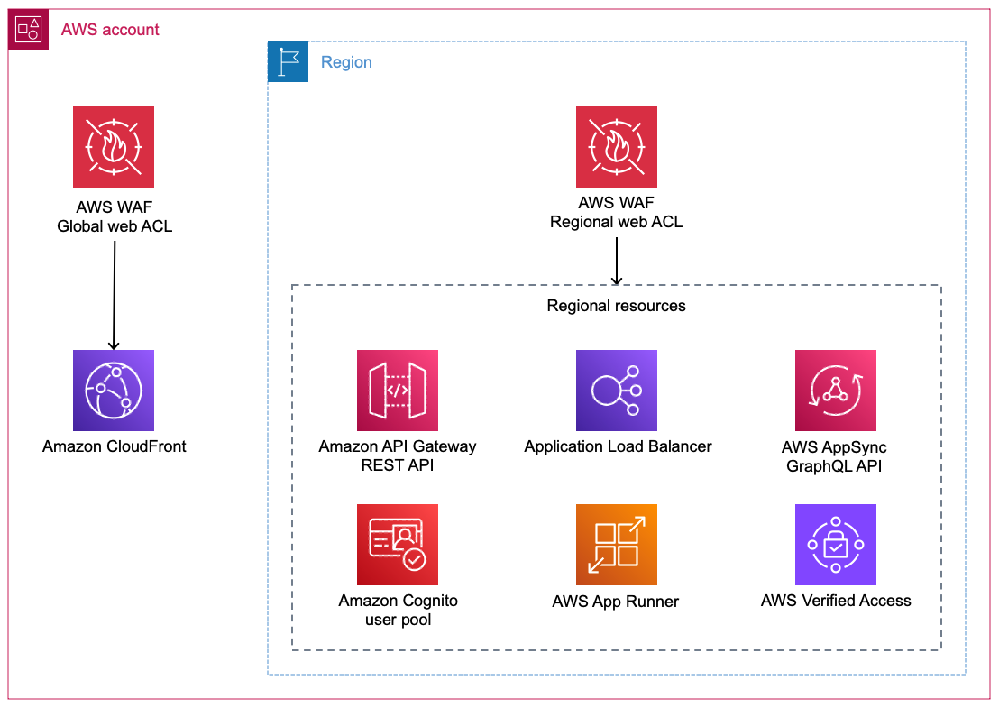
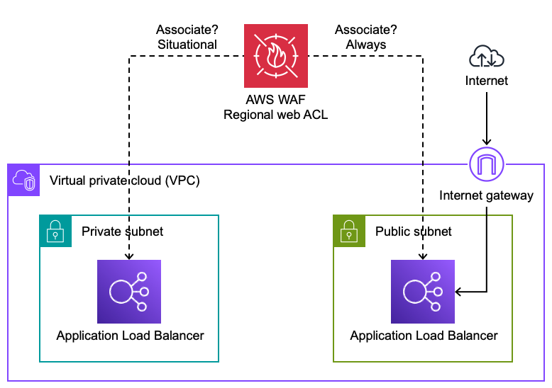
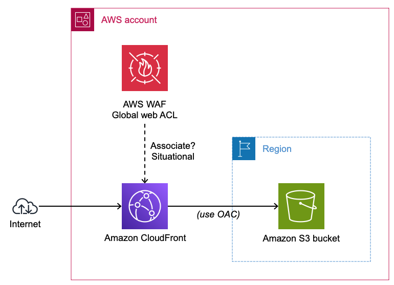
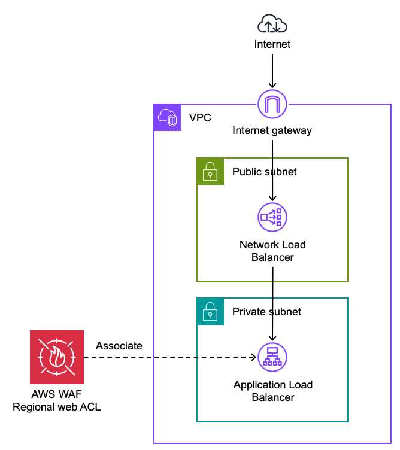
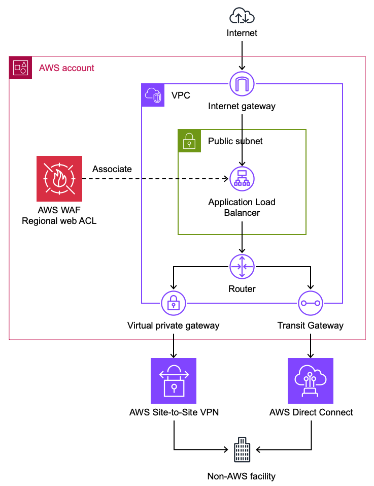
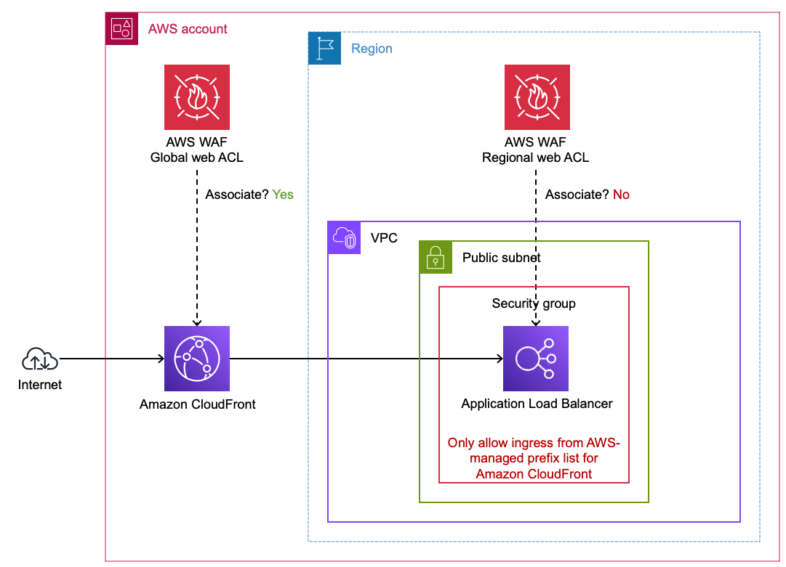

# WAF Prerequisites

Consider the following topics before creating your first AWS WAF web ACL.

## Identifying resources to protect with AWS WAF

It's important to understand what type of resources you can protect natively with AWS WAF. If your use case is not supported directly, there may be architecture changes to consider. This section outlines the best practice for the most common use cases.

### AWS services natively supported by AWS WAF

AWS WAF is [natively integrated with other AWS services](https://docs.aws.amazon.com/waf/latest/developerguide/how-aws-waf-works-resources.html). Simply associate the web ACL to the resource you want to protect.

**Figure 1:** Global and regional AWS resources you can associate with AWS

There are use cases where either the need for a WAF is unclear or the resource cannot be directly associated with a web ACL. The following sections offer guidance for these situations.

### Private Application Load Balancers

A private Application Load Balancer (ALB) uses VPC subnets that do not have a route to an [internet gateway](https://docs.aws.amazon.com/vpc/latest/userguide/VPC_Internet_Gateway.html). In other words, the ALB cannot be reached directly from the Internet.

**Figure 2:** Protecting private Application Load Balancers

It is uncommon to protect private ALBs with AWS WAF because the risk usually (but not always) does not justify the cost. Here are a few situations where you might protect private ALBs:

* Protect private ALBs with AWS WAF if they are indirectly handling unfiltered traffic from the Internet or any network you don't control. If the source IP address is not preserved, you may need to inspect an HTTP header that [forwards the IP address](https://docs.aws.amazon.com/waf/latest/developerguide/waf-rule-statement-forwarded-ip-address.html). Typically this header is `X-Forwarded-For`.
* If your private ALB is subject to threats from your own network without other mitigating controls such as narrow [VPC security group ingress rules](https://docs.aws.amazon.com/vpc/latest/userguide/security-group-rules.html) then consider protecting it with AWS WAF.

### Amazon CloudFront distributions that point to Amazon S3 buckets

It is uncommon to protect CloudFront distributions that only have origins that point to Amazon S3 buckets. AWS is responsible for protecting Amazon S3 endpoints from malicious requests.

**Figure 3:** Protecting CloudFront distributions with Amazon S3 bucket origins

AWS WAF [geographic match statements](https://docs.aws.amazon.com/waf/latest/developerguide/waf-rule-statement-type-geo-match.html) can be used to block requests based on region of origin. If you need to prevent users in specific geographic locations from accessing content distributed by CloudFront, you can use native [geographic restrictions](https://docs.aws.amazon.com/AmazonCloudFront/latest/DeveloperGuide/georestrictions.html) in CloudFront. If you use the CloudFront geo restriction feature, the feature doesn't forward blocked requests to AWS WAF. If you want to block requests based on geography and other AWS WAF criteria, use the AWS WAF geo match statement and do not use the CloudFront geo restriction feature.

Use [origin access control](https://docs.aws.amazon.com/AmazonCloudFront/latest/DeveloperGuide/private-content-restricting-access-to-s3.html) (OAC) to restrict access to your bucket so that Amazon S3 only allows requests from your CloudFront distribution.

### Network Load Balancers

AWS WAF web ACLs cannot be associated with Network Load Balancers (NLB). If your NLB is handling HTTP traffic then consider using Application Load Balancer (ALB) instead. If you are using NLB to listen on static IP addresses, then you can [create an ALB as the target of your NLB](https://aws.amazon.com/blogs/networking-and-content-delivery/application-load-balancer-type-target-group-for-network-load-balancer/) and protect the ALB with AWS WAF. By default, NLB preserves the client IP of traffic sent to ALB targets. This is important for IP-based AWS WAF rules to work properly.

**Figure 4:** Using ALB with AWS WAF to protect NLB targets

### HTTP endpoints hosted outside of AWS

You can create an ALB with [IP address targets](https://docs.aws.amazon.com/elasticloadbalancing/latest/application/load-balancer-target-groups.html#target-group-ip-address-type). If your VPC has a route to your endpoint's network, you can specify any [RFC 1918](https://datatracker.ietf.org/doc/html/rfc1918) address as a target. Contact AWS Support if you need to use IP targets outside of RFC 1918.

**Figure 5:** Using AWS WAF to protect endpoints outside of AWS

### Application Load Balancers behind a CloudFront distribution

It is uncommon to use AWS WAF to protect an Application Load Balancer (ALB) that is the origin for a CloudFront distribution. Associate a web ACL with the CloudFront distribution to filter unwanted traffic at CloudFront edge locations. CloudFront forwards the client IP to the ALB in the `X-Forwarded-For` HTTP header, but there are some IP-based rules that will not work properly. For example, [Amazon IP reputation list](https://docs.aws.amazon.com/waf/latest/developerguide/aws-managed-rule-groups-ip-rep.html#aws-managed-rule-groups-ip-rep-amazon) and [Anonymous IP list](https://docs.aws.amazon.com/waf/latest/developerguide/aws-managed-rule-groups-ip-rep.html#aws-managed-rule-groups-ip-rep-anonymous) currently do not support forwarded IPs.

**Figure 6:** Using AWS WAF to protect ALBs behind CloudFront

CloudFront requires ALB origins to be reachable by the Internet. Follow these steps make sure your ALB only accepts Internet traffic from your CloudFront distribution.

1. [Limit access to your origins using the AWS-managed prefix list for Amazon CloudFront](https://aws.amazon.com/blogs/networking-and-content-delivery/limit-access-to-your-origins-using-the-aws-managed-prefix-list-for-amazon-cloudfront/)
2. [Configure your ALB to respond to requests only when they include a customer header added by CloudFront](https://aws.amazon.com/blogs/security/how-to-enhance-amazon-cloudfront-origin-security-with-aws-waf-and-aws-secrets-manager/). This ensures your origin only accepts requests from your CloudFront distribution.

### AWS resources behind a non-CloudFront content delivery network

If your application uses a CDN other than CloudFront, you can protect your origin with a regional AWS WAF web ACL. AWS WAF will not be able to see the client IP directly, so you must rely on the CDN forwarding client IPs in an HTTP header. Some AWS managed rule groups do not support forwarded IPs. See [forwarded IP addresses](https://docs.aws.amazon.com/waf/latest/developerguide/waf-rule-statement-forwarded-ip-address.html) for the rule statements that can use forwarded IPs.

## Storing AWS WAF logs

AWS WAF logs can be stored in Amazon S3 or Amazon CloudWatch Logs. You can configure WAF to use Amazon Kinesis Data Firehose to deliver WAF logs to a variety of destinations, including Amazon S3.

### Storing AWS WAF logs in S3

Amazon S3 is the most cost-effective option for storing AWS WAF logs. There are two ways to configure AWS WAF to store logs in an S3 bucket.

1. Using Kinesis Data Firehose.
2. Directly by specifying the target bucket. This is simpler, but is more expensive than using KDF unless your log volume exceeds 80 billion events per month.

When using Amazon S3 for AWS WAF logs, they are typically stored in a central bucket. In the web ACL you can specify the ARN of a bucket in any account or region. See [the documentation](https://docs.aws.amazon.com/waf/latest/developerguide/logging-s3.html) for information about the bucket policy changes you need.

See [Monitoring WAF Rules](../../monitoring-waf-rules/docs/) for information on using logs Amazon S3 to monitor WAF behavior.

### Storing AWS WAF logs in CloudWatch Logs

You can use [subscription filters](https://docs.aws.amazon.com/AmazonCloudWatch/latest/logs/Subscriptions.html) to have AWS WAF logs delivered to other services such as Amazon Kinesis or AWS Lambda for custom processing, analysis, or loading to other systems.

You can use [metric filters](https://docs.aws.amazon.com/AmazonCloudWatch/latest/logs/MonitoringLogData.html) to parse log events and extract numerical values into CloudWatch metrics. These metrics can be used for configuring alarms or dashboards.

You can centralize AWS WAF logs to a CloudWatch log group in a central account, but this is not supported natively and requires a non-trivial setup. First you set up a CloudWatch log group in the same region as the web ACL (`us-east-1` for global web ACLs). Then define a [subscription filter with AWS Lambda](https://docs.aws.amazon.com/AmazonCloudWatch/latest/logs/SubscriptionFilters.html#LambdaFunctionExample). The Lambda function writes log events to a CloudWatch log group in your central account. For now, you can't use KDF to stream data across accounts.

See [Monitoring WAF Rules](../../monitoring-waf-rules/docs/) for information on using logs in CloudWatch Logs to monitor WAF behavior.

## Filtering WAF logs

If you want to avoid logging fields that might contain sensitive data, you can [omit fields from AWS WAF logs](https://docs.aws.amazon.com/waf/latest/developerguide/logging-management.html). Note that AWS WAF does not log the HTTP body.

AWS WAF logs are detailed, as they can contain up to 100 rule labels. To optimize the cost of storing AWS WAF logs you can specify conditions that determine whether logs are kept or dropped (see [log filtering](https://docs.aws.amazon.com/waf/latest/developerguide/logging-management.html)). You can only filter based on rule labels and rule actions, not based on values in HTTP request fields.

## Estimating cost

There are a few topics to consider while reviwing [AWS WAF pricing](https://aws.amazon.com/waf/pricing/). 

The per-request pricing scales up based on two factors.

* Additional $0.20 per million requests for each 500 WCUs the Web ACL uses beyond the default allocation of 1,500
* Additional $0.30 per million requests for each additional 16KB analyzed beyond the default body inspection limit (16KB for CloudFront web ACLs, 8KB for regional web ACLs)

The following AWS WAF charges are waived for resouces that are protected by AWS Shield Advanced.

* $0.60 per million requests analyzed by AWS WAF
* $5.00 per month per web ACL

Shield Advanced does not cover these AWS WAF charges. This list may grow over time as more advanced capabilities are supported by AWS WAF.

* Additional charges when using more than 1,500 WCUs
* Additional charges when inspecting bodies larger than the default limit
* Charges for Fraud Control account creation fraud prevention
* Charges for Fraud Control account takeover prevention
* Charges for Bot Control
* Charges for CAPTCHA and Challenge actions

CloudFront charges for requests even if they are blocked by AWS WAF. AWS Shield Advanced provides DDoS cost protection to safeguard against scaling charges resulting from DDoS-related usage spikes on CloudFront distributions protected by Shield Advanced. You can [request a credit](https://docs.aws.amazon.com/waf/latest/developerguide/request-refund.html) for charges through AWS Support. To be eligible to receive a credit for CloudFront and ALB protected resources, you must have associated an AWS WAF web ACL and implemented a rate-based rule in the web ACL.

## Ownership of WAF rules

In a simple organization, application teams typically manage their own AWS WAF rules. They create web ACLs and own all the rules inside them. They also tend to keep AWS WAF logs in their own account.

Larger organizations tend to have a company-wide security policy that requires all web applications to have a minimum baseline of AWS WAF rules. A security team needs to audit web applications for compliance reporting and automatic remediation. Customers use AWS Firewall Manager to define AWS WAF policies that enforce required rules. Application teams can customize FMS-managed web ACLs with application-specific rules. In this way, their web ACLs contain a mix of required and custom rules.

Application teams should be aware of the responsibility model their organization uses. Security teams may wish to update the required rules, which requires coordinated testing. Also when using FMS, AWS WAF logs are typically stored in a central S3 bucket that application teams may need access to.

## How many web ACLs to use

AWS WAF web ACLs are associated with application resources, such as ALBs. Web ACLs can be associated with one or more resources in the same account. When should you share or dedicate web ACLs? The answer requires a balance between simplicity, isolation, and cost.

To keep it simple, you can use one web ACL to protect multiple resources. Keep in mind this means multiple resources share the same AWS WAF rules. If one application needs a custom rule, it might impact requests for other applications sharing the same web ACL. If each application has unique rules, you might lean toward dedicated web ACLs instead of sharing.

Cost is another factor that determines whether sharing web ACLs makes sense. AWS WAF charges are based on request volume and per-web ACL and per-rule charges. If the applications in your account handle over 10 million requests per month, request volume is the dominant pricing factor. In that case, using many web ACLs instead of one won't impact your costs very much. On the other hand, if you have many resources to protect and those resources handle a small number of requests per month, it might make sense to consolidate web ACLs to optimize cost.
