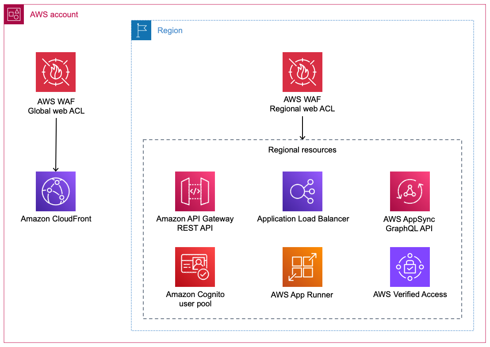

# Prerequisites and Fundamentals

## Fundamentals

### Protection Packs

A Protection Pack is the top-level AWS WAF resource that contains your WAF rules. Unlike traditional WAF appliances that sit inline as a separate network hop, AWS WAF is not a standalone device you deploy in your network path. Instead, you associate a Protection Pack with a supported AWS resource (such as a CloudFront distribution, Application Load Balancer, or API Gateway) and AWS WAF evaluates requests as part of that resource's request processing — there is no additional infrastructure to provision, scale, or maintain. Once associated, every HTTP request to that resource is evaluated against the rules in the Protection Pack before reaching your application. The Protection Pack determines what happens to each request: allow it, block it, challenge it, or count it for monitoring.

A Protection Pack contains:

- **Rules and rule groups** — Individual rules or collections of rules (including Amazon Managed Rules) that inspect requests and take actions.
- **A default action** — What happens to requests that don't match any rule with a terminating action (typically *Allow*).
- **Rule priority order** — Rules are evaluated in priority order from lowest number to highest; the first rule with a terminating action that matches determines the outcome of the request.

### Default Action

If there are no matching rules in the Protection Pack that have a terminating action (**Allow** or **Block**), the Protection Pack takes a [default action](https://docs.aws.amazon.com/waf/latest/developerguide/web-acl-default-action.html). There are two possible default actions: *Allow* and *Block*.

With a default action of **Allow**, WAF rules usually **Block** malicous or non-desired traffic while allowing everything else.  You might also have explicit **Allow** action rules but usually your rules will **Block**, **Challenge**, or **Captcha** requests matching your rules.

With a default action of **Block**, you define WAF rules that explicitly define when traffic should be **Allow**ed.  You can also define rules that explicity block traffic.  For example, you might only want to allow requests from a specific IP range or requests that contain specific values.  This is also known as a positive security model.

**Considerations**  
The overwhelming majority of customers set the default action to *Allow* as this tends to be more straight forward.  If you set your default action to *block*, you usually need to create and maintain application specific rules.  Especially if using AWS WAF acrosss your organization, this can be difficult to maintain.

### WCU - WAF Capacity Units

WCU abstracts the complexity of WAF rules into a single dimension.  For custom inline rules and custom rule group, the rule type (rate based, geo, etc), how many statements, match type (string equal, regex pattern), and transformations (CSS_DECODE, HEX_DECODE, etc>) each have a specific WCU cost.  Amazon Managed Rules like custom rule groups have a set WCU; this does not change between [AMR versions](../../aws-managed-rules/docs/index.md#managed-rule-group-versioning).

WCU is used determine the maximum amount of WAF rules that can effectively be used within a Protection Pack or defined within a custom rule group.

Protection Packs can have a max of 5,000 WCU worth of inline, rule groups, Amazon Managed Rules, and/or Partner Managed rules; this limit cannot be increase. This limit is per Protection pack and not tracked across defined protection packs or rule groups.

AWS WAF custom rule group must define a WCU max capacity; this capacity cannot be changed after creation.  To effectively change the WCU of a rule group, you must create a new rule group with the new WCU value and transition Protection Packs to use that new rule group.  Rule Groups consume the specified WCU capacity within a Protection Pack regardless of the actual WCU usage of any rules (if any) they contain.  Each Rule Groups can have a maximum of 5,000 WCU.  This limit is per rule group; there is no account/region limit to the amount of WCUs you can have configure

If you for some reason require more than 5,000 WCU worth of WAF rule evaluations, you would need to have two resources inspecting that support AWS WAF.  For example, CloudFront with a Protection Pack with an origin of an Application Load Balancer (also with WAF). **Note:** this usually represents an anti-pattern and there is likely some way to optimize your WCU needs.

WCU is also used when determining AWS WAF request based costs; standard WAF costs covers the first 1,500 WCU with an additional usage based cost per 500 WCU above 1,500. See [WAF Costs](../../waf-cost/docs/index.md#protection-pack-capacity-units-wcu) for more details.

### WAF Labels
When a WAF rule matches, that rule can add one or more labels. When a rule adds a label but does not terminate the request (i.e. action = *COUNT*), these labels can be referenced by other rules such as AND/OR statements or scope down statements.  Amazon Managed Rules always add one or more label when a rule matches. Custom rules can but do not need to attach labels when a rule matches. By default, WAF labels are only available for a reqeust being evaluated by WAF and are a part of your WAF log.  YOur application will *not* receive WAF labels unless you configure a custom WAF rule to inject them as a header.

Labels are used to:  
* Handle False positives  
* Simplify logic (e.g. if A, or B, or C, or D)  
* Filter WAF logs send to a configured logging destination  
* Are included in WAF logs (observability)  

## Ownership of Protection Packs

In a simple organization or when AWS WAF has limited adoption, application teams typically manage their own AWS WAF rules. They create Protection Packs and own all the rules inside them. They also tend to keep AWS WAF logs in their own account.

Larger organizations tend to have company-wide security requirements which translate into a minimum or baseline set of AWS WAF rules.  A security or other central team defines that baseline and then audits and/or enforces those baseline rules within the Organization; AWS Firewall Manager security policies is commonly used to achieve that audit and enforce needs.  AWS Firewall manager as needed either:
1) Creates and associates a Protection Pack with supported resources
2) Retrofits these bseline rules on top of an application team defined Protection Pack.

AWS WAF logs are usually consolidated in a central S3 bucket or 3P SIEM/monitoring solution.  S3 wise, this might be a per region, a single bucket, and/or part of a data lake (such as Amazon Security Lake)

## How many Protection Packs to use

AWS WAF Protection Packs are associated with application resources, such as CloudFront Distributions or Application Load Balancers. Protection Packs can be associated with one or more resources in the same account, region, and scope (global vs regional). You cannot share a WebACL across accounts, regions, or scope. When should you share or dedicate Protection Packs? The answer is a choice between simplicity, isolation, and cost.

This choice is easy to change if the approach that makes the most sense changes. Associating a resource with a new Protection Pack does not interrupt the data plane of that resource, and outside of functional rule changes between Protection Packs the resource is never unprotected. This is the case whether you consolidate or separate into multiple Protection Packs.

### Shared Protection Pack (one Protection Pack for multiple resources)

This is most common for smaller customers, when first starting out, or when you have many copies of the same application such as SaaS or ISV per-tenant endpoint products.

**Pros:**

- **Simpler rule management** - You define WAF rules once and they apply to all associated resources. Changes propagate to every protected resource without needing to update multiple Protection Packs.
- **Lower baseline cost** - You pay the $5/month per-Protection Pack fee and the $1/month per-rule fee once, regardless of how many resources are associated. For example, 20 CloudFront distributions sharing one Protection Pack with 5 rules costs $10/month in baseline charges, versus $200/month if each had its own Protection Pack with the same rules.
- **Consistent security posture** - All applications behind the shared Protection Pack receive the same baseline protection, making it easier to enforce organizational security standards uniformly.
- **No performance impact from sharing** - There are no WAF performance or service quota concerns from associating many resources with a single Protection Pack.

**Cons:**

- **Larger blast radius** - A misconfigured rule or a problematic managed rule update affects every application sharing the Protection Pack at once. A single bad change can impact unrelated workloads.
- **More complex application-specific rules** - Custom rules must be scoped to the correct hostname and/or URI to avoid applying to unintended applications. False positive exceptions become more complex because they need to target specific applications within the shared rule set.
- **Higher WCU consumption** - Rules needed by different applications accumulate in the same Protection Pack, which can push the Protection Pack's WCU usage above the 1,500 WCU included with standard WAF pricing and drive up per-request charges. The per-request WCU overage applies to every request across all associated resources.
- **Coordination overhead** - Any rule change requires agreement across the teams whose applications share the Protection Pack. In an IaC workflow, the Protection Pack usually lives in a shared stack rather than application-specific stacks.

### Dedicated Protection Pack (one Protection Pack per application)

This is common for larger enterprises where there are many product or app teams, many unique applications running in your environment, and/or application teams have application-specific rules rather than *just* AMRs and generic baseline rules.

**Pros:**

- **Smaller blast radius** - A misconfigured rule or a problematic managed rule update only impacts the single application associated with that Protection Pack.  
- **Simpler application-specific rules and exceptions** - Custom rules and false positive exceptions don't need to be scoped to specific hostnames or URIs because the Protection Pack only applies to one application. This is especially valuable for handling false positives, which are application-specific by nature.
- **IaC alignment** - Application teams can define their Protection Pack as part of their application's infrastructure stack rather than coordinating changes to a shared stack. This aligns ownership and deployment with the application lifecycle.
- **Lower WCU pressure per Protection Pack** - With a shared Protection Pack, custom rules and exceptions for multiple applications accumulate in the same Protection Pack, driving up WCU consumption. Dedicated Protection Packs avoid this because each only contains the exceptions and custom rules relevant to its own application, making it easier to stay within the 1,500 WCU included with standard WAF pricing and avoid per-request overage charges.
- **Independent rule evolution** - Each application can adopt new AMR versions, tune rules, and roll out changes on its own schedule without affecting other applications.

**Cons:**

- **Per-Protection Pack flat costs** - Each Protection Pack has a flat monthly fee ($5/month) plus a per-rule fee ($1/month per rule). When common baseline rules (IP Reputation, Core Rule Set, Known Bad Inputs, etc.) are duplicated across many Protection Packs, these flat costs add up and there are more places to keep in sync. This is usually not a significant concern unless you have many Protection Packs with very low request volume, but it should be factored into cost planning.
- **Requires additional services/automation to enforce baseline** - Without tooling like AWS Firewall Manager, ensuring every application team includes a consistent baseline of rules requires coordination and review.

### When baseline costs don't drive the decision

There are two scenarios where Protection Pack baseline fees, custom rules, custom rule groups, and free Amazon Managed rules do not drive a cost towards this decision:

- **AWS Shield Advanced customers** do not pay per-Protection Pack, custom rule, custom rule group, or free Amazon Managed rule per-rule fees on Shield-protected resources.
- **[CloudFront Flat-rate pricing plan](https://docs.aws.amazon.com/AmazonCloudFront/latest/DeveloperGuide/flat-rate-pricing-plan.html) customers** - the Protection Pack and rules within that flat-rate plan tier do not have the standard AWS WAF costs (they are included in the flat-rate pricing plan).

In these scenarios, the decision comes down to blast radius, rule management complexity, and operational ownership rather than cost.

## Identifying resources to protect with AWS WAF

You typcially should aim to protect all public facing HTTP workloads with AWS WAF.  It's important to understand what type of resources you can protect natively with AWS WAF.  It is also important to understand that AWS WAF (when used with CloudFront) can protect any HTTP application regardless of being hosted on AWS, another cloud/hosting provider, or on-prem. If your existing AWS architecture does not include one of these AWS WAF supported resources, you should consider changes to your architecture and/or layering in an AWS service that does support AWS WAF.

### AWS Resources that support AWS WAF

AWS WAF is [natively integrated with many AWS services](https://docs.aws.amazon.com/waf/latest/developerguide/how-aws-waf-works-resources.html). Simply associate a Protection Pack to the resource you want to protect.

**Figure 1:** Global and regional AWS resources you can associate with AWS

- **[Amazon CloudFront](https://docs.aws.amazon.com/AmazonCloudFront/latest/DeveloperGuide/Introduction.html)** - A global content delivery network (CDN) that accelerates delivery of web content to users by caching it at edge locations worldwide. CloudFront is the only global resource type supported by AWS WAF; the Protection Pack must be created in US East (N. Virginia).

- **[Application Load Balancer (ALB)](https://docs.aws.amazon.com/elasticloadbalancing/latest/application/introduction.html)** - A regional load balancer that routes HTTP/HTTPS traffic to targets such as EC2 instances, containers, and Lambda functions based on request content.

- **[Amazon API Gateway REST API](https://docs.aws.amazon.com/apigateway/latest/developerguide/welcome.html)** - A fully managed service for creating, publishing, and managing REST APIs at any scale.

- **[AWS AppSync GraphQL API](https://docs.aws.amazon.com/appsync/latest/devguide/what-is-appsync.html)** - A managed GraphQL service that simplifies application development by providing a flexible API layer to securely access, manipulate, and combine data from multiple sources.

- **[Amazon Cognito user pool](https://docs.aws.amazon.com/cognito/latest/developerguide/cognito-user-identity-pools.html)** - A user directory that provides sign-up, sign-in, and access control for web and mobile applications.

- **[AWS App Runner service](https://docs.aws.amazon.com/apprunner/latest/dg/what-is-apprunner.html)** - A fully managed service that makes it easy to deploy containerized web applications and APIs at scale without managing infrastructure.

- **[AWS Verified Access instance](https://docs.aws.amazon.com/verified-access/latest/ug/what-is-verified-access.html)** - A service that provides secure access to corporate applications without requiring a VPN, using identity and device posture policies.

- **[AWS Amplify](https://docs.aws.amazon.com/amplify/latest/userguide/welcome.html)** - A set of tools and services for building and deploying full-stack web and mobile applications. The Protection Pack must be created in US East (N. Virginia) to protect AWS Amplify.

For full details, see [Resources that you can protect with AWS WAF](https://docs.aws.amazon.com/waf/latest/developerguide/how-aws-waf-works-resources.html).

### HTTP endpoints outside of AWS

From an AWS WAF perspective, there is no functional different when protecting an AWS or non-AWS endpoint.

Customers can use an [Amazon CloudFront distribution](https://docs.aws.amazon.com/AmazonCloudFront/latest/DeveloperGuide/DownloadDistS3AndCustomOrigins.html) to protect **any** HTTP endpoint with AWS WAF, regardless of whether that endpoint is hosted on AWS or anywher else.  This incldues HTTP endpoints hosted on other cloud providers, third-party hosting services, or on-premises infrastructure.  As long as an endpoint is routable across the public internet and can accept inbound connections from [Amazon CloudFront origin IPs](https://docs.aws.amazon.com/AmazonCloudFront/latest/DeveloperGuide/LocationsOfEdgeServers.html) on the relevant ports (typically TCP 80 and/or TCP 443), AWS WAF can inspect and protect that traffic.  To achieve this, create an Amazon CloudFront distribution, set your endpoint as the origin, and place AWS WAF on the CloudFront distribution.  Once this is in place, update your origin to only accept traffic from [CloudFront Origin IPs](https://docs.aws.amazon.com/AmazonCloudFront/latest/DeveloperGuide/LocationsOfEdgeServers.html).

## Architecture changes to incorporate AWS WAF

There are a number of historical and application design reasons why a workload might not already have an AWS WAF-supported service inline. Below are common requirements that have historically driven these decision and how to address them, therefore allowing the incorporation of AWS WAF:

* **mTLS**: Amazon CloudFront, Application Load Balancers, and API Gateway all support passthrough mTLS.

* **Static, dedicated, and/or customer owned IPs**: Amazon CloudFront supports static, dedicated, and/or BYOIP IPs via [Anycast Static IPs](https://docs.aws.amazon.com/AmazonCloudFront/latest/DeveloperGuide/request-static-ips.html). While this adds a non-trivial cost, it is important to understand that these static IPs can be shared across multiple distributions, allowing this to be an organization-wide cost rather than a per-distribution cost.

    *An alternative is using AWS Global Accelerator or an Network Load Balancer ahead of an Application Load Balancer. This provides dedicated IPs plus AWS WAF on the ALB. Note that L7 DDoS traffic still reaches the ALB in this configuration, meaning AWS WAF request-per-second capacity is based on the ALB's capabilities.*

* **Latency concerns**: AWS WAF itself introduces very low latency (typically low single-digit milliseconds). When using CloudFront with AWS WAF, client connections to Cloudfront (with AWS WAF) are often faster than connecting directly to a regional endpoint (with AWS WAF). Clients get onto the AWS backbone network sooner, and CloudFront-to-origin traffic traverses the backbone rather than the public internet.

* **Large request/response bodies****: Amazon CloudFront supports up to a 20 GB body per request, ALB does not have a body size limit. Multi-part uploads with either CloudFront or ALB with AWS WAF allow larger uploads and POST requests while still enabling AWS WAF inspection.

There are several requirements that will make it not possible to use AWS WAF.

* **Terminating TLS at your application/compute (i.e. EC2, EKS, ECS, etc)**:  AWS WAF is only available on resources that terminate TLS and proxy the request to your application; this means the client TLS terminates on the ALB, CloudFront, API Gateway, etc.  These services support TLS passthrough (i.e. headers with TLS information from the actual client).  If you *must* terminate TLS at your application level, you will not be able to use AWS WAF to protect that application.

* **Non-http/https**: AWS WAF is a HTTP aware firewall and only supported on AWS resources that proxy HTTP/HTTPS; non-HTTP endpoints should consider AWS Network Firewall for Layer 7 inspection and mitigation.

## WAF Logging

AWS WAF supports logging protection pack traffic to Amazon S3, Amazon CloudWatch Logs, or third-party destinations via Amazon Data Firehose and Amazon Security Lake. Logging is essential for monitoring rule behavior, investigating incidents, and tuning your Protection Pack over time. For detailed guidance on configuring log destinations, filtering, and cost optimization, see [WAF Logging](../../waf-logging/docs/index.md).

## WAF Cost

AWS WAF pricing is based on the number of Protection Packs, rules, and requests inspected, with additional charges for advanced features like Bot Control, CAPTCHA, and increased body inspection limits. Some charges are waived for AWS Shield Advanced subscribers. For detailed cost guidance including per-request pricing factors, WCU capacity planning, and Shield Advanced cost protection, see [WAF Cost](../../waf-cost/docs/index.md).