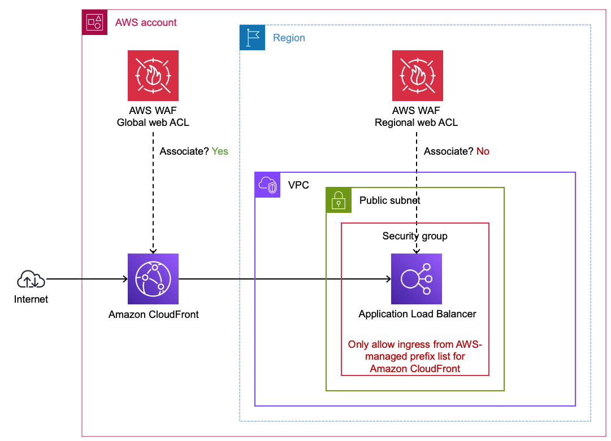
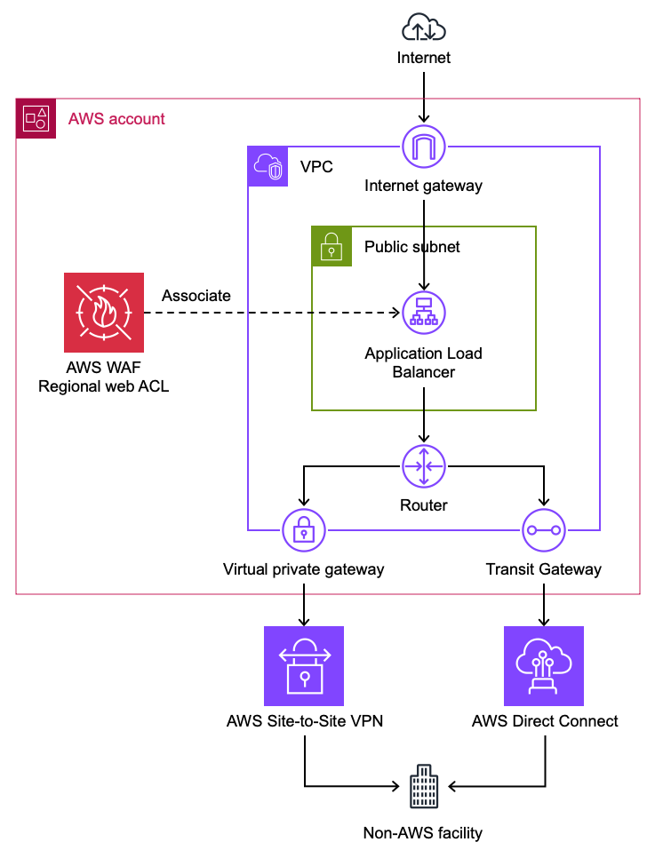

# AWS 권장 HTTP 아키텍처

이 섹션에서는 웹 익스플로잇, 정찰, DDoS로부터 적절히 보호받도록 HTTP 워크로드를 설계하는 권장 방법을 다룹니다. HTTP 워크로드 앞에 Amazon CloudFront를 배치하는 것은 AWS WAF의 효과를 극대화하고 엣지에서 추가 보안 이점을 제공하는 모범 사례입니다.

## CloudFront가 HTTP 워크로드를 프론트해야 하는 이유

가능하면 AWS는 다음과 같은 이유로 HTTP 워크로드 앞에 AWS WAF와 함께 Amazon CloudFront를 사용할 것을 권장합니다:

- **CloudFront의 AWS WAF는 L7 검사를 위해 초당 수백만 요청 이상으로 확장됩니다.** 이는 WAF 보호 용량이 사전 통지 없이 사실상 모든 규모의 DDoS 이벤트를 처리할 수 있음을 의미합니다. WAF를 지원하는 Application Load Balancer와 같은 리전 리소스는 자체 및 관련 protection pack이 스케일업하는 데 시간(분)이 걸리며 CDN의 RPS 기능에 도달할 수 없습니다.
- **CloudFront에서 평가된 AWS WAF 규칙은 요청이 오리진에 도달하기 전에 차단합니다.** 이는 공격 중 컴퓨팅 비용을 줄이고 백엔드 가용성을 보호합니다. CloudFront 엣지 로케이션에서 WAF에 의해 차단된 요청은 오리진 리소스를 소비하지 않습니다.
- **CloudFront의 AWS WAF는 모든 계층에서 DDoS 보호를 제공합니다.** AWS WAF는 비율 기반 규칙과 Anti-DDoS 관리형 규칙 그룹을 통해 L7 DDoS 완화를 제공합니다. CloudFront에 대한 레이어 3/레이어 4 DDoS 보호는 [공동 책임 모델](https://docs.aws.amazon.com/whitepapers/latest/aws-best-practices-ddos-resiliency/shared-responsibility.html)의 AWS 측에 해당합니다. 고객은 CloudFront 배포에 대한 볼류메트릭 네트워크 계층 공격에 대해 추가 보호를 구성하거나 구매할 필요가 없습니다. CloudFront는 전 세계적으로 분산된 CDN이므로, 볼류메트릭 L3/L4 공격이 애플리케이션의 가용성에 영향을 미치려면 CDN 인프라 자체를 압도해야 합니다. 공격 표면은 단일 엔드포인트가 아닌 AWS의 글로벌 엣지 네트워크입니다. 이를 통해 L3/L4에서 고객 조치 없이 네트워크 계층부터 애플리케이션 계층까지 DDoS 보호를 제공합니다.
- **CloudFront의 AWS WAF는 더 큰 본문 검사를 허용합니다.** CloudFront의 AWS WAF는 최대 64kb의 본문을 검사할 수 있으며, 리전 서비스의 AWS WAF는 16kb를 지원합니다.

## CloudFront 뒤에서 AWS 오리진 보호

AWS 리전 서비스(Application Load Balancer, API Gateway(REST) 등)를 CloudFront 배포 뒤에 배치하면, 오리진을 안전하게 유지하면서 AWS WAF를 사용한 엣지 필터링의 이점을 얻습니다.

**그림 1:** CloudFront 배포 뒤의 Application Load Balancer

### VPC Origin(CloudFront 기능)

CloudFront는 [VPC Origins](https://docs.aws.amazon.com/AmazonCloudFront/latest/DeveloperGuide/private-content-vpc-origins.html)을 통해 프라이빗 ALB 오리진에 연결할 수 있습니다. 그러나 퍼블릭 ALB를 갖고 싶다면, 다음 단계에 따라 ALB가 CloudFront 배포의 인터넷 트래픽만 수락하도록 하세요. 이 접근 방식을 사용하면 ALB가 프라이빗이고 인터넷에서 접근할 수 없으므로 AWS 관리 접두사 목록 및/또는 Origin 헤더 삽입을 사용할 필요가 없습니다.

### CloudFront용 AWS 관리 접두사 목록 사용

ALB가 CloudFront의 트래픽만 수락하도록 하려면, ALB의 보안 그룹 인바운드 규칙에서 [CloudFront용 AWS 관리 접두사 목록](https://docs.aws.amazon.com/AmazonCloudFront/latest/DeveloperGuide/LocationsOfEdgeServers.html)을 사용하세요. 이렇게 하면 CloudFront 엣지 로케이션만 도달할 수 있도록 ALB에 대한 액세스가 제한됩니다. 이것은 ALB뿐만 아니라 보안 그룹과 함께 작동하는 모든 AWS 서비스에 적용할 수 있습니다.

### 오리진 검증을 위한 사용자 정의 오리진 헤더

CloudFront가 오리진으로 전달되는 요청에 [사용자 정의 오리진 헤더](https://docs.aws.amazon.com/AmazonCloudFront/latest/DeveloperGuide/add-origin-custom-headers.html)를 추가하도록 구성할 수 있습니다. 오리진은 이 헤더를 검증하여 요청이 CloudFront를 통해 왔는지 확인할 수 있습니다. 이것은 접두사 목록을 넘어 추가적인 오리진 검증 계층을 제공합니다.

엔드포인트에 대한 다른 우회 벡터로부터 보호하므로 CloudFront용 AWS 관리 접두사 목록과 사용자 정의 오리진 헤더를 모두 사용하는 것이 좋습니다. 접두사 목록은 연결을 CloudFront로만 제한하고, 삽입된 헤더는 **당신의** 배포만이 해당 리전 엔드포인트와 성공적으로 통신할 수 있도록 합니다.

### CloudFront 뒤에서 API Gateway(REST) 보호

API Gateway REST API를 CloudFront 뒤에 배치하여 엣지 WAF 검사를 얻을 수 있습니다. API Gateway가 CloudFront 배포의 요청만 수락하도록 하려면, CloudFront가 API Gateway에 구성된 [API 키](https://docs.aws.amazon.com/apigateway/latest/developerguide/api-gateway-setup-api-key-with-console.html)에 매핑되는 값으로 `x-api-key` 헤더를 삽입하도록 구성하세요. API Gateway는 기본적으로 API 키를 검증하므로, CloudFront를 우회하고 API Gateway에 직접 도달하는 요청은 유효한 키 없이 거부됩니다. 자세한 안내는 [Amazon API Gateway 및 AWS WAF를 사용한 API 보호](https://aws.amazon.com/blogs/compute/protecting-your-api-using-amazon-api-gateway-and-aws-waf-part-2/)를 참조하세요.

ALB와 달리 API Gateway REST API에는 보안 그룹이 *없으므로*, API 키 접근 방식이 오리진 검증을 위한 기본 메커니즘입니다.

### 전달된 IP를 사용한 IP 기반 규칙 제한

ALB, API Gateway 또는 기타 WAF 지원 리전 엔드포인트가 CloudFront 뒤에 있을 때, ALB가 보는 소스 IP 주소는 클라이언트의 원래 IP가 아닌 CloudFront 엣지 IP입니다. protection pack을 ALB에 연결하면, `X-Forwarded-For`와 같은 헤더의 [전달된 IP 주소](https://docs.aws.amazon.com/waf/latest/developerguide/waf-rule-statement-forwarded-ip-address.html)를 사용하도록 규칙을 구성하지 않는 한 IP 기반 규칙이 CloudFront IP와 일치합니다. 이러한 이유로 CloudFront를 사용할 때 protection pack을 ALB가 아닌 CloudFront 배포에 연결하는 것이 일반적으로 권장됩니다.

### Origin Access Control (OAC)

Amazon S3가 CloudFront 배포의 요청만 허용하도록 버킷에 대한 액세스를 제한하려면 [Origin Access Control](https://docs.aws.amazon.com/AmazonCloudFront/latest/DeveloperGuide/private-content-restricting-access-to-s3.html)(OAC)을 사용하세요. 이렇게 하면 사용자가 CloudFront를 우회하고 S3 콘텐츠에 직접 접근할 수 없습니다.

## 다른 WAF 지원 리소스에서의 AWS WAF

아키텍처에서 CloudFront가 옵션이 아닌 경우, Application Load Balancer, API Gateway(REST), AWS AppSync, Amazon Cognito와 같은 다른 [지원되는 리전 리소스](../../prerequisites/docs/index.md#aws-resources-that-support-aws-waf)에서 AWS WAF를 사용할 수 있습니다. 이러한 리소스에서도 L7 검사의 이점을 얻을 수 있지만, 위에서 언급한 제한 사항(더 작은 본문 검사, 느린 스케일링, CDN 계층에서의 기본 L3/L4 보호 없음)이 있습니다.

CloudFront가 실행 가능하지 않을 수 있는 예시 이유:

- **기존 비AWS CDN** - 조직이 이미 타사 CDN(Akamai, Cloudflare, Fastly 등)을 사용하고 있으며 CloudFront를 추가하면 복잡성과 지연이 추가되는 이중 홉 CDN 아키텍처가 생성됩니다.
- **소규모의 고정 IP 요구 사항** - 일부 애플리케이션은 고정 IP 주소가 필요합니다(예: 파트너 허용 목록). CloudFront는 [anycast 고정 IP 목록](https://docs.aws.amazon.com/AmazonCloudFront/latest/DeveloperGuide/anycast-static-ip-list.html)을 통해 고정 IP를 지원하지만, 비용(월 $3,000부터)이 단일 소규모 애플리케이션에는 정당화되지 않을 수 있습니다. 이러한 경우 AWS Global Accelerator 뒤의 ALB와 AWS WAF가 더 낮은 비용으로 고정 IP를 제공할 수 있습니다.
- **TLS가 컴퓨팅 계층에서 종료되어야 하는 경우** - 일부 애플리케이션은 애플리케이션 자체에서만 TLS가 종료되는 엔드투엔드 암호화가 필요합니다. AWS WAF는 HTTP 요청 콘텐츠를 검사하기 위해 WAF 지원 리소스(CloudFront, ALB, API Gateway)에서 TLS 종료가 필요합니다.
- **PrivateLink 또는 NLB 프론트 서비스** - 애플리케이션이 AWS PrivateLink를 통해 노출되는 경우, CloudFront를 PrivateLink 경로에 삽입할 수 없습니다.
- **프라이빗 또는 내부 전용 워크로드** - 퍼블릭 인터넷에 노출되지 않는 애플리케이션(예: 프라이빗 ALB 뒤의 내부 API)은 CDN을 사용할 수 없습니다.

## CloudFront 뒤에서 비AWS 오리진 보호

CloudFront는 [사용자 정의 오리진](https://docs.aws.amazon.com/AmazonCloudFront/latest/DeveloperGuide/DownloadDistS3AndCustomOrigins.html)을 지원하므로, 호스팅 위치에 관계없이 공개적으로 접근 가능한 모든 HTTP 엔드포인트를 CloudFront 배포에 지정할 수 있습니다. 이것은 AWS WAF로 비AWS HTTP 엔드포인트를 보호하는 데 권장되는 접근 방식입니다. protection pack을 CloudFront 배포와 연결하면 외부 오리진에 대한 모든 트래픽이 엣지에서 검사됩니다.

**그림 2:** AWS 외부의 엔드포인트를 보호하기 위해 AWS WAF와 함께 CloudFront 사용

### 전달된 IP 헤더 고려 사항

CloudFront 뒤에서 비AWS 오리진을 보호할 때, 클라이언트의 원래 IP 주소는 기본적으로 보존되지 않습니다. [IP 주소를 전달하는](https://docs.aws.amazon.com/waf/latest/developerguide/waf-rule-statement-forwarded-ip-address.html) HTTP 헤더를 검사해야 할 수 있습니다. 일반적으로 이 헤더는 `X-Forwarded-For`입니다. 비AWS 오리진에 대한 요청에 IP 기반 매칭이 필요한 경우 전달된 IP 주소를 사용하도록 WAF 규칙을 구성하세요.

### 지리적 제한(CloudFront 네이티브 vs. WAF Geo Match)

AWS WAF [지리적 매치 문](https://docs.aws.amazon.com/waf/latest/developerguide/waf-rule-statement-type-geo-match.html)을 사용하여 출처 지역에 따라 요청을 차단할 수 있습니다. 특정 지리적 위치의 사용자가 CloudFront로 배포된 콘텐츠에 접근하지 못하도록 해야 하는 경우, CloudFront의 네이티브 [지리적 제한](https://docs.aws.amazon.com/AmazonCloudFront/latest/DeveloperGuide/georestrictions.html)을 사용할 수 있습니다. CloudFront 지리 제한 기능을 사용하면, 기능이 차단된 요청을 AWS WAF로 전달하지 않습니다. 지리 및 다른 AWS WAF 기준에 따라 요청을 차단하려면, AWS WAF 지리적 매치 문을 사용하고 CloudFront 지리 제한 기능을 사용하지 마세요.

## AWS WAF를 고려하지 **않아야** 하는 사용 사례

AWS WAF의 필요성이 불분명하거나 리소스가 protection pack과 직접 연결될 수 없는 사용 사례가 있습니다. 다음 섹션은 이러한 상황에 대한 지침을 제공합니다.

### 프라이빗 Application Load Balancer

프라이빗 Application Load Balancer(ALB)는 [인터넷 게이트웨이](https://docs.aws.amazon.com/vpc/latest/userguide/VPC_Internet_Gateway.html)에 대한 경로가 없는 VPC 서브넷을 사용합니다. 즉, 인터넷에서 ALB에 직접 도달할 수 없습니다.

**그림 2:** 프라이빗 Application Load Balancer 보호

프라이빗 ALB를 AWS WAF로 보호하는 것은 위험이 일반적으로(항상은 아니지만) 비용을 정당화하지 않으므로 드뭅니다. 프라이빗 ALB를 보호할 수 있는 몇 가지 상황:

* 인터넷 또는 제어하지 않는 네트워크에서 필터링되지 않은 트래픽을 간접적으로 처리하는 경우 프라이빗 ALB를 AWS WAF로 보호하세요. 소스 IP 주소가 보존되지 않는 경우 [IP 주소를 전달하는](https://docs.aws.amazon.com/waf/latest/developerguide/waf-rule-statement-forwarded-ip-address.html) HTTP 헤더를 검사해야 할 수 있습니다. 일반적으로 이 헤더는 `X-Forwarded-For`입니다.
* 좁은 [VPC 보안 그룹 인그레스 규칙](https://docs.aws.amazon.com/vpc/latest/userguide/security-group-rules.html)과 같은 다른 완화 제어 없이 자체 네트워크의 위협에 노출되는 경우 AWS WAF로 보호를 고려하세요.

### 캐시된 정적 콘텐츠가 있는 CloudFront 배포

완전히 공개적이고 정적이며 캐시된 콘텐츠(예: Amazon S3 버킷)를 제공하는 CloudFront 배포를 AWS WAF로 보호하는 것은 드뭅니다. 이것은 기술적 제한이 아니지만, WAF 규칙은 콘텐츠 뒤에 애플리케이션 로직이 없을 때 적용되지 않는 애플리케이션 계층 위협(인젝션, XSS, 크리덴셜 스터핑)으로부터 보호합니다. 순수 정적 콘텐츠에 WAF를 추가하면 위험을 의미 있게 줄이지 않으면서 요청당 비용이 추가됩니다.

**그림 3:** Amazon S3 버킷 오리진이 있는 CloudFront 배포 보호

[Origin Access Control](https://docs.aws.amazon.com/AmazonCloudFront/latest/DeveloperGuide/private-content-restricting-access-to-s3.html)(OAC)을 사용하여 Amazon S3가 CloudFront 배포의 요청만 허용하도록 버킷에 대한 액세스를 제한하세요.

### 비HTTP 워크로드

AWS WAF는 HTTP 계층(L7)에서 작동하며 HTTP/HTTPS 트래픽만 검사할 수 있습니다. 애플리케이션이 원시 TCP, UDP, REST 시맨틱 없는 HTTP/2를 통한 gRPC 또는 기타 바이너리 프로토콜과 같은 비HTTP 프로토콜을 사용하는 경우, AWS WAF는 해당 트래픽을 검사하거나 보호할 수 없습니다.

Network Load Balancer(NLB) 뒤의 비HTTP 워크로드의 경우, AWS WAF protection pack을 NLB에 직접 연결할 수 없습니다. 트래픽이 실제로 HTTP인 경우, Application Load Balancer(ALB)를 대신 사용하는 것을 고려하세요. 고정 IP 주소를 위해 NLB가 필요하지만 트래픽이 HTTP인 경우, [NLB의 대상으로 ALB를 생성](https://aws.amazon.com/blogs/networking-and-content-delivery/application-load-balancer-type-target-group-for-network-load-balancer/)하고 ALB를 AWS WAF로 보호할 수 있습니다. 기본적으로 NLB는 ALB 대상으로 보내는 트래픽의 클라이언트 IP를 보존하며, 이는 IP 기반 AWS WAF 규칙이 올바르게 작동하는 데 중요합니다.

**그림 4:** NLB 뒤에서 AWS WAF와 함께 ALB 사용

비HTTP 워크로드의 경우, DDoS 보호를 위한 [AWS Shield Advanced](https://docs.aws.amazon.com/waf/latest/developerguide/shield-chapter.html), [VPC 보안 그룹](https://docs.aws.amazon.com/vpc/latest/userguide/security-group-rules.html), 네트워크 수준 필터링을 위한 [AWS Network Firewall](https://docs.aws.amazon.com/network-firewall/latest/developerguide/what-is-aws-network-firewall.html)과 같은 다른 AWS 보안 서비스를 고려하세요.
