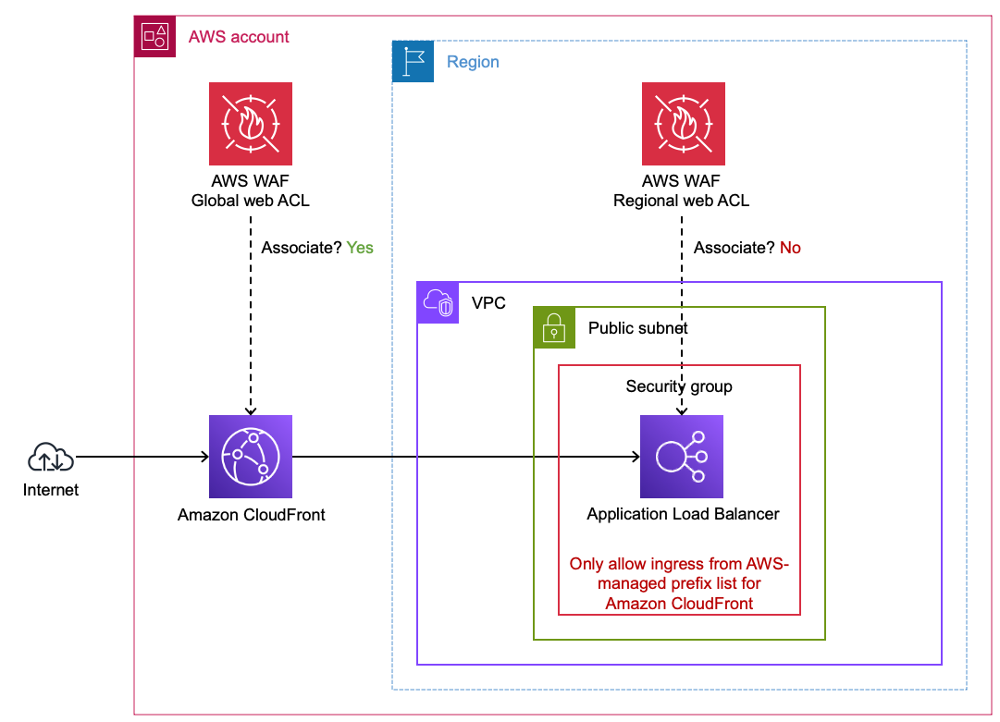
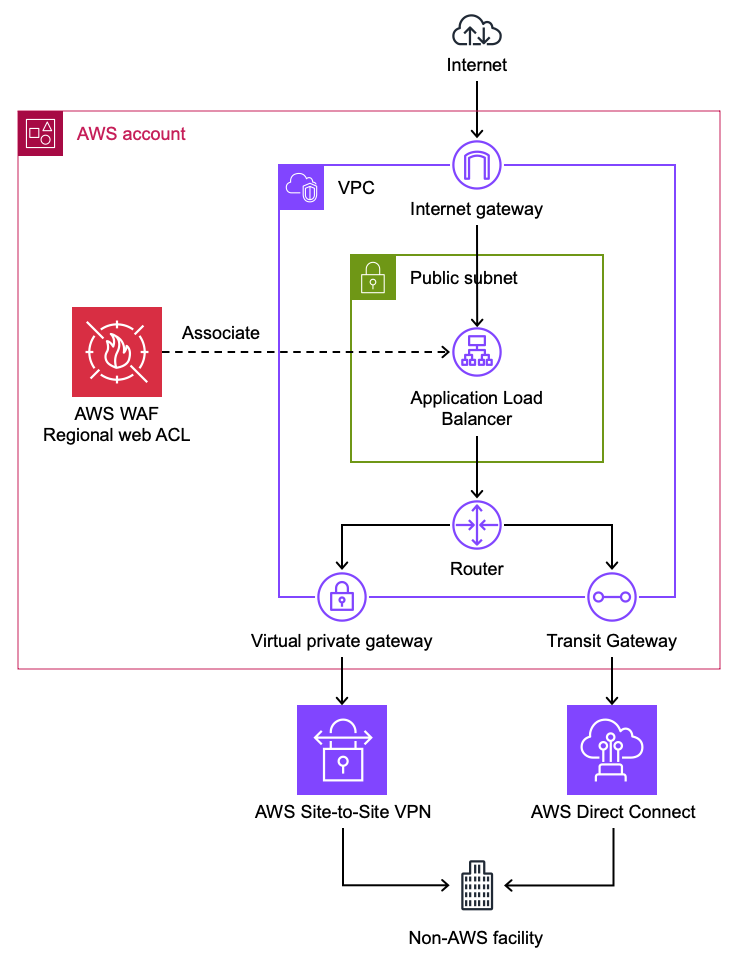

# Recommended HTTP Architecture on AWS

This section covers the recommended way to architect HTTP workloads to be properly protected from web exploits, reconnisance, and DDoS. Placing Amazon CloudFront in front of your HTTP workloads is a best practice that maximizes the effectiveness of AWS WAF and provides additional security benefits at the edge.

## Why CloudFront Should Front Your HTTP Workloads

Whenever possible, AWS recommends using Amazon CloudFront with AWS WAF ahead of HTTP workloads for the following reasons:

- **AWS WAF on CloudFront scales beyond millions of requests per second** for L7 inspection.  This means your WAF protection capacity can handle effectively any size off DDoS event with no notice.  Regional resources that support WAF such as Application Load Balancers themselves as well as Protection Packs associated with them take time (minutes) to scale up and even then cannot match the RPS capabilities of a CDN.
- **AWS WAF rules evaluated at the edge block requests before they reach your origin**, reducing compute costs and protecting backend availability during attacks. Requests blocked by WAF at CloudFront edge locations never consume origin resources.
- **AWS WAF on CloudFront gives you DDoS protection at all layers.** AWS WAF provides L7 DDoS mitigation through rate-based rules and the Anti-DDoS managed rule group. Layer 3/layer 4 DDoS protection for CloudFront falls on the AWS side of the [shared responsibility model](https://docs.aws.amazon.com/whitepapers/latest/aws-best-practices-ddos-resiliency/shared-responsibility.html) — customers do not need to configure or purchase additional protection for volumetric network-layer attacks against CloudFront distributions. Because CloudFront is a globally distributed CDN, a volumetric L3/L4 attack would need to overwhelm the CDN infrastructure itself to impact your application's availability — the attack surface is AWS's global edge network rather than a single endpoint. Together, this provides DDoS protection from network layer through application layer without requiring customer action at L3/L4.
- **AWS WAF on CloudFront allows for larger body inspection.**  AWS WAF on CloudFront can inspect up to 64 kb of body where regional services with AWS WAF support 16 kb.

## Securing an AWS Origin Behind CloudFront

When you place an AWS regional service (Application Load Balancer, API Gateway (Rest), etc) behind a CloudFront distribution, you gain the benefits of edge filtering with AWS WAF while keeping your origin secure.

**Figure 1:** Application Load Balancer behind a CloudFront distribution

### VPC Origin (CloudFront Feature)  

CloudFront can connect to private ALB origins through [VPC Origins](https://docs.aws.amazon.com/AmazonCloudFront/latest/DeveloperGuide/private-content-vpc-origins.html). However, if you want to have a public ALB, follow these steps make sure your ALB only accepts Internet traffic from your CloudFront distribution.  If you use this approach, you do not need to use the AWS-Managed Prefix list and/or Origin Header injection as your ALB is private and not accessable from the internet.  

### Using the AWS-Managed Prefix List for CloudFront

To ensure your ALB only accepts traffic from CloudFront, use the [AWS-managed prefix list for CloudFront](https://docs.aws.amazon.com/AmazonCloudFront/latest/DeveloperGuide/LocationsOfEdgeServers.html) in your ALB's security group inbound rules. This restricts access to your ALB so that only CloudFront edge locations can reach it.  This can be applied to any AWS service that works with Security groups, not just ALBs.

### Custom Origin Headers for Origin Verification

You can configure CloudFront to add a [custom origin header](https://docs.aws.amazon.com/AmazonCloudFront/latest/DeveloperGuide/add-origin-custom-headers.html) to requests forwarded to your origin. Your origin can then validate this header to confirm the request came through CloudFront. This provides an additional layer of origin verification beyond the prefix list.

It is recommended to use both the AWS-Managed Prefix list for CLoudfront as well as the custom origin headers as they protect from different bypass vectors against your endpoints.  The prefix list limits connections to only CloudFront, the injected header ensures only **your** distribution can successfully communicate with that regional endpoint.

### Securing API Gateway (REST) Behind CloudFront

API Gateway REST APIs can be placed behind CloudFront to gain edge WAF inspection. To ensure your API Gateway only accepts requests from your CloudFront distribution, configure CloudFront to inject an `x-api-key` header with a value that maps to an [API key](https://docs.aws.amazon.com/apigateway/latest/developerguide/api-gateway-setup-api-key-with-console.html) configured on your API Gateway. API Gateway natively validates API keys, so requests that bypass CloudFront and reach the API Gateway directly will be rejected without a valid key. See [Protecting your API using Amazon API Gateway and AWS WAF](https://aws.amazon.com/blogs/compute/protecting-your-api-using-amazon-api-gateway-and-aws-waf-part-2/) for a detailed walkthrough.

Unlike ALBs, API Gateway REST APIs do use security groups, so the API key approach is the primary mechanism for origin verification.

### IP-Based Rule Limitations with Forwarded IPs

When an ALB, API Gateway or any other WAF supported regional endpoint is behind CloudFront, the source IP address seen by the ALB is a CloudFront edge IP, not the client's original IP. If you associate a protection pack with the ALB, IP-based rules will match against the CloudFront IP unless you configure the rule to use a [forwarded IP address](https://docs.aws.amazon.com/waf/latest/developerguide/waf-rule-statement-forwarded-ip-address.html) from a header such as `X-Forwarded-For`. For this reason, it is generally recommended to associate your protection pack with the CloudFront distribution rather than the ALB when using CloudFront.

### Origin Access Control (OAC)

Use [origin access control](https://docs.aws.amazon.com/AmazonCloudFront/latest/DeveloperGuide/private-content-restricting-access-to-s3.html) (OAC) to restrict access to your bucket so that Amazon S3 only allows requests from your CloudFront distribution. This ensures users cannot bypass CloudFront and access your S3 content directly.

## AWS WAF on other WAF supported resources

If CloudFront is not an option for your architecture, AWS WAF can be used on other [supported regional resources](../../prerequisites/docs/#aws-resources-that-support-aws-waf) such as Application Load Balancers, API Gateway (REST), AWS AppSync, and Amazon Cognito. You still benefit from L7 inspection on these resources — just with the limitations noted above (smaller body inspection, slower scaling, no inherent L3/L4 protection at the CDN layer).

Example reasons CloudFront may not be feasible:

- **Existing non-AWS CDN** — Your organization already uses a third-party CDN (Akamai, Cloudflare, Fastly, etc.) and adding CloudFront would create a double-hop CDN architecture with added complexity and latency. You may still do this if you want to use AWS WAF but for whatever reason will continue using the third-party CDN (short or long term). When a non-AWS CDN sits ahead of your AWS resource, certain request attributes such as client IP and TLS details are not directly visible to AWS WAF — the CDN terminates the client's TLS connection and establishes a new connection to your endpoint, so AWS WAF sees the CDN's IP address rather than the actual client's. CDNs typically forward the original client IP in HTTP headers such as `X-Forwarded-For`, though the specific header name varies by provider. AWS WAF rules that depend on client IP (rate-based rules, IP allow/block lists) must be configured to inspect the appropriate [forwarded IP header](https://docs.aws.amazon.com/waf/latest/developerguide/waf-rule-statement-forwarded-ip-address.html) instead of the connection source IP. AWS Managed Rules that are IP-based will also inspect the connection source IP (the CDN) and not the true client unless configured with forwarded IP headers.
- **Static IP requirement at small scale** — Some applications require a static IP address (e.g., for partner allowlisting). CloudFront supports static IPs through [anycast static IP lists](https://docs.aws.amazon.com/AmazonCloudFront/latest/DeveloperGuide/anycast-static-ip-list.html), however the cost (starting at $3,000/month) may not be justified for a single small-scale application. In these cases, an ALB behind AWS Global Accelerator with AWS WAF can provide static IPs at lower cost.
- **TLS must terminate at the compute layer** — Some applications require end-to-end encryption where TLS is terminated only at the application itself (e.g., certain compliance or key management requirements). AWS WAF requires TLS termination at the WAF-enabled resource (CloudFront, ALB, API Gateway) in order to inspect HTTP request content. This is not a limitation of CloudFront specifically — it applies to any WAF-enabled resource. If your architecture cannot allow TLS termination before the compute layer, AWS WAF cannot be used. Note that CloudFront does support [mTLS passthrough](https://docs.aws.amazon.com/AmazonCloudFront/latest/DeveloperGuide/client-cert-auth.html) where client certificate details are forwarded to the origin in headers, however this may not satisfy all backend requirements — some applications expect the TLS handshake itself to occur directly with the client rather than receiving certificate information via headers.
- **PrivateLink or NLB-fronted services** — When your application is exposed via AWS PrivateLink (VPC endpoint service → NLB → ALB → EC2), CloudFront cannot be inserted into the PrivateLink path. If the same application also serves internet traffic through CloudFront, you would need WAF on both CloudFront and the ALB to cover both paths — or you can consolidate WAF onto the ALB to maintain a single set of WAF rules that protects both the PrivateLink and internet-facing traffic paths.
- **Private or internal-only workloads** — Applications that are not exposed to the public internet (e.g., internal APIs behind a private ALB) cannot use a CDN. Using AWS WAF on private endpoints is uncommon unless the ALB endpoint is exposed to external parties or the external party intends to make it public (e.g., crossing a VPC peer or VPN into a customer's AWS account or tenant).

## Securing a Non-AWS Origin Behind CloudFront

CloudFront supports [custom origins](https://docs.aws.amazon.com/AmazonCloudFront/latest/DeveloperGuide/DownloadDistS3AndCustomOrigins.html), meaning you can point a CloudFront distribution at any publicly accessible HTTP endpoint regardless of where it is hosted. This is the recommended approach for protecting non-AWS HTTP endpoints with AWS WAF — associate a protection pack with the CloudFront distribution and all traffic to your external origin is inspected at the edge.

**Figure 2:** Using CloudFront with AWS WAF to protect endpoints outside of AWS

### Forwarded IP Header Considerations

When protecting non-AWS origins behind CloudFront, the client's original IP address is not preserved by default. You may need to inspect an HTTP header that [forwards the IP address](https://docs.aws.amazon.com/waf/latest/developerguide/waf-rule-statement-forwarded-ip-address.html). Typically this header is `X-Forwarded-For`. Configure your WAF rules to use the forwarded IP address if you need IP-based matching for requests to non-AWS origins.

### Geographic Restrictions (CloudFront Native vs. WAF Geo Match)

AWS WAF [geographic match statements](https://docs.aws.amazon.com/waf/latest/developerguide/waf-rule-statement-type-geo-match.html) can be used to block requests based on region of origin. If you need to prevent users in specific geographic locations from accessing content distributed by CloudFront, you can use native [geographic restrictions](https://docs.aws.amazon.com/AmazonCloudFront/latest/DeveloperGuide/georestrictions.html) in CloudFront. If you use the CloudFront geo restriction feature, the feature doesn't forward blocked requests to AWS WAF. If you want to block requests based on geography and other AWS WAF criteria, use the AWS WAF geo match statement and do not use the CloudFront geo restriction feature.

## Use cases where **not** to consider AWS WAF

There are use cases where either the need for AWS WAF is unclear or the resource cannot be directly associated with a Protection Pack. The following sections offer guidance for these situations.

### Private Application Load Balancers

A private Application Load Balancer (ALB) uses VPC subnets that do not have a route to an [internet gateway](https://docs.aws.amazon.com/vpc/latest/userguide/VPC_Internet_Gateway.html). In other words, the ALB cannot be reached directly from the Internet.

**Figure 2:** Protecting private Application Load Balancers

It is uncommon to protect private ALBs with AWS WAF because the risk usually (but not always) does not justify the cost.  Here are a few situations where you might protect private ALBs:

* Protect private ALBs with AWS WAF if they are indirectly handling unfiltered traffic from the Internet or any network you don't control. If the source IP address is not preserved, you may need to inspect an HTTP header that [forwards the IP address](https://docs.aws.amazon.com/waf/latest/developerguide/waf-rule-statement-forwarded-ip-address.html). Typically this header is `X-Forwarded-For`.
* If your private ALB is subject to threats from your own network without other mitigating controls such as narrow [VPC security group ingress rules](https://docs.aws.amazon.com/vpc/latest/userguide/security-group-rules.html) then consider protecting it with AWS WAF.

### CloudFront Distributions with cached static content

It is uncommon to protect a CloudFront distribution serving entirely public, static, and cached content (e.g., Amazon S3 buckets) with AWS WAF. This is not a technical limitation, however WAF rules protect against application-layer threats (injection, XSS, credential stuffing) that do not apply when there is no application logic behind the content. Adding WAF to purely static content adds per-request cost without meaningfully reducing risk.

**Figure 3:** Protecting CloudFront distributions with Amazon S3 bucket origins

If you need to prevent users in specific geographic locations from accessing content distributed by CloudFront, you can use native [geographic restrictions](https://docs.aws.amazon.com/AmazonCloudFront/latest/DeveloperGuide/georestrictions.html) in CloudFront. If you use the CloudFront geo restriction feature, the feature doesn't forward blocked requests to AWS WAF. If you want to block requests based on geography and other AWS WAF criteria, use the AWS WAF [geographic match statement](https://docs.aws.amazon.com/waf/latest/developerguide/waf-rule-statement-type-geo-match.html) and do not use the CloudFront geo restriction feature.

Use [origin access control](https://docs.aws.amazon.com/AmazonCloudFront/latest/DeveloperGuide/private-content-restricting-access-to-s3.html) (OAC) to restrict access to your bucket so that Amazon S3 only allows requests from your CloudFront distribution.

### Non-HTTP Workloads

AWS WAF operates at the HTTP layer (L7) and can only inspect HTTP/HTTPS traffic. If your application uses non-HTTP protocols such as raw TCP, UDP, gRPC over HTTP/2 without REST semantics, or other binary protocols, AWS WAF cannot inspect or protect that traffic.

For non-HTTP workloads behind a Network Load Balancer (NLB), AWS WAF Protection Packs cannot be associated directly with the NLB. If the traffic is actually HTTP, consider using an Application Load Balancer (ALB) instead. If you need NLB for static IP addresses but your traffic is HTTP, you can [create an ALB as a target of your NLB](https://aws.amazon.com/blogs/networking-and-content-delivery/application-load-balancer-type-target-group-for-network-load-balancer/) and protect the ALB with AWS WAF. By default, NLB preserves the client IP of traffic sent to ALB targets, which is important for IP-based AWS WAF rules to work properly.

**Figure 4:** Using ALB with AWS WAF behind an NLB

For non-HTTP workloads, consider other AWS security services such as [AWS Shield Advanced](https://docs.aws.amazon.com/waf/latest/developerguide/shield-chapter.html) for DDoS protection, [VPC security groups](https://docs.aws.amazon.com/vpc/latest/userguide/security-group-rules.html), and [AWS Network Firewall](https://docs.aws.amazon.com/network-firewall/latest/developerguide/what-is-aws-network-firewall.html) for network-level filtering.